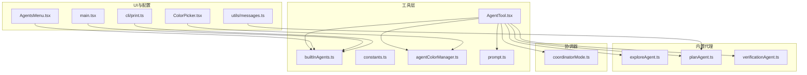
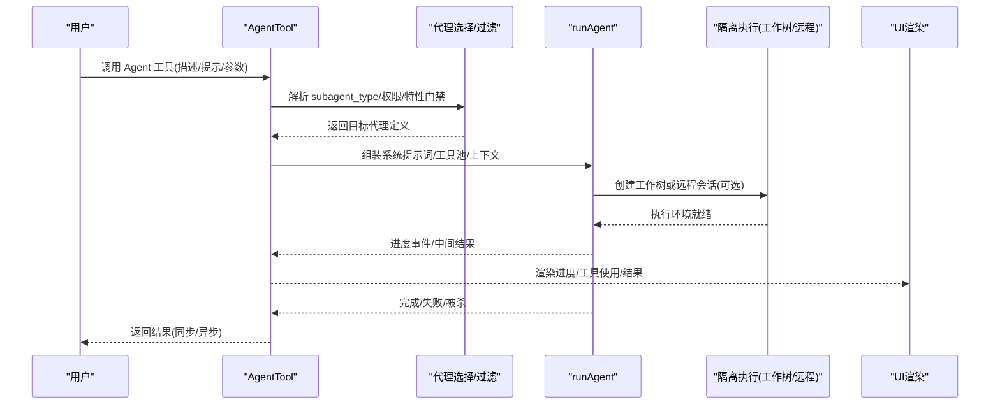
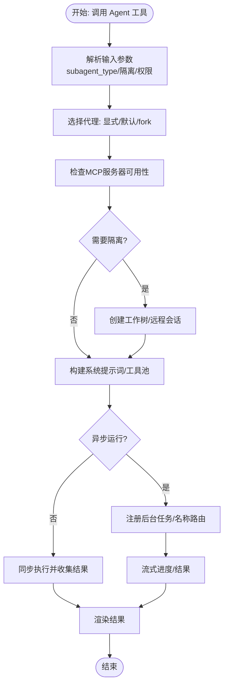
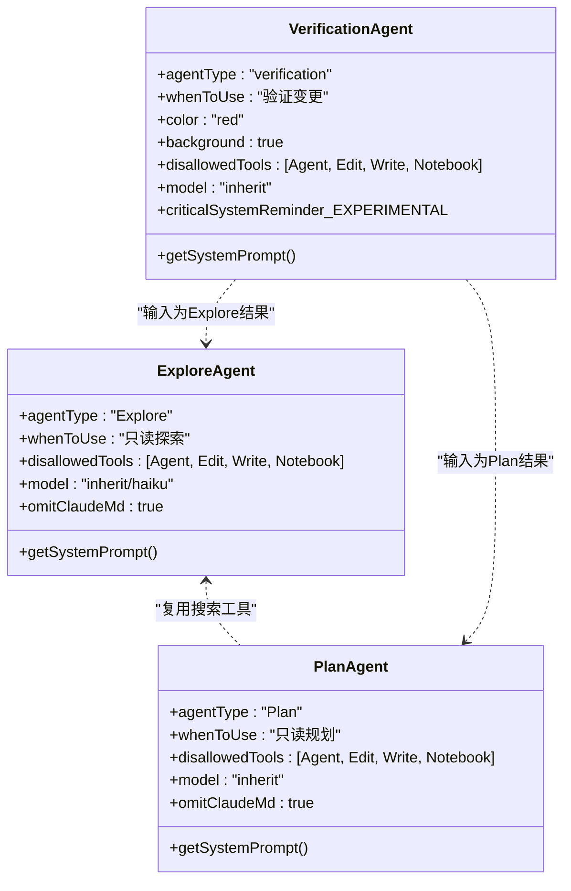
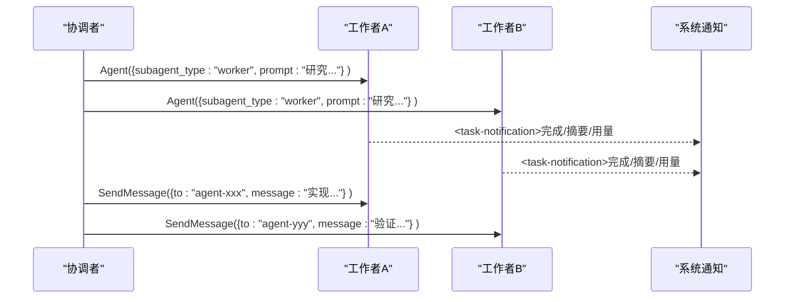
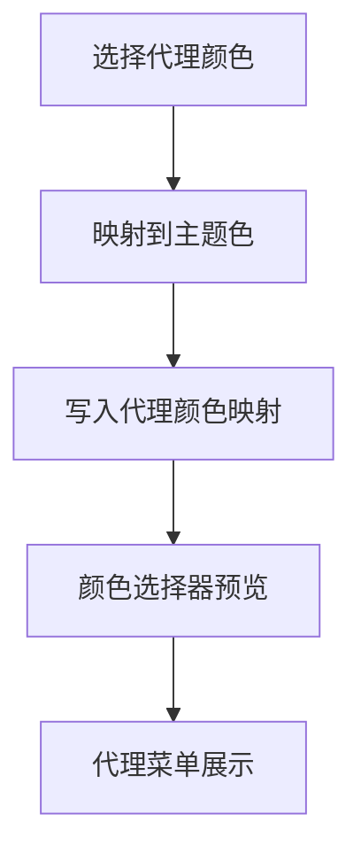
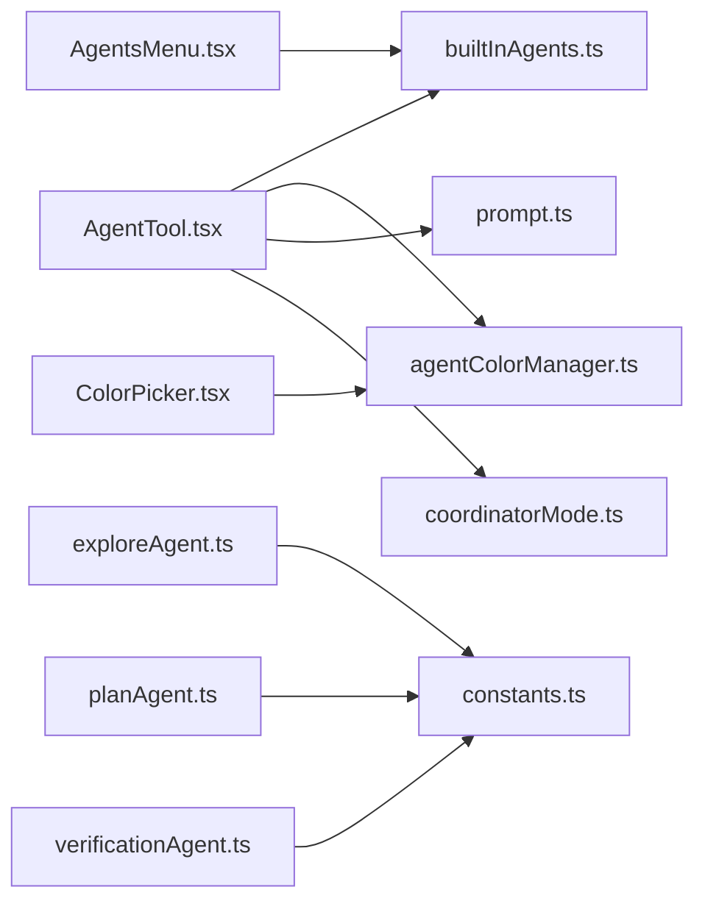

# 代理概念与设计原理

<cite>
**本文引用的文件**
- [src/tools/AgentTool/AgentTool.tsx](file://src/tools/AgentTool/AgentTool.tsx)
- [src/tools/AgentTool/builtInAgents.ts](file://src/tools/AgentTool/builtInAgents.ts)
- [src/tools/AgentTool/constants.ts](file://src/tools/AgentTool/constants.ts)
- [src/tools/AgentTool/agentColorManager.ts](file://src/tools/AgentTool/agentColorManager.ts)
- [src/tools/AgentTool/built-in/exploreAgent.ts](file://src/tools/AgentTool/built-in/exploreAgent.ts)
- [src/tools/AgentTool/built-in/planAgent.ts](file://src/tools/AgentTool/built-in/planAgent.ts)
- [src/tools/AgentTool/built-in/verificationAgent.ts](file://src/tools/AgentTool/built-in/verificationAgent.ts)
- [src/coordinator/coordinatorMode.ts](file://src/coordinator/coordinatorMode.ts)
- [src/components/agents/ColorPicker.tsx](file://src/components/agents/ColorPicker.tsx)
- [src/components/agents/AgentsMenu.tsx](file://src/components/agents/AgentsMenu.tsx)
- [src/components/permissions/ExitPlanModePermissionRequest/ExitPlanModePermissionRequest.tsx](file://src/components/permissions/ExitPlanModePermissionRequest/ExitPlanModePermissionRequest.tsx)
- [src/utils/messages.ts](file://src/utils/messages.ts)
- [src/main.tsx](file://src/main.tsx)
- [src/cli/print.ts](file://src/cli/print.ts)
- [src/tools/AgentTool/prompt.ts](file://src/tools/AgentTool/prompt.ts)
</cite>

## 目录
1. [引言](#引言)
2. [项目结构](#项目结构)
3. [核心组件](#核心组件)
4. [架构总览](#架构总览)
5. [详细组件分析](#详细组件分析)
6. [依赖关系分析](#依赖关系分析)
7. [性能考量](#性能考量)
8. [故障排查指南](#故障排查指南)
9. [结论](#结论)
10. [附录](#附录)

## 引言
本文件系统性阐述 Claude Code 中“代理”（Agent）的概念、设计理念与实现原理，重点解释“子代理”的含义、职责分离、能力边界与协作机制；介绍内置代理类型（探索代理、计划代理、验证代理等）及其用途；说明代理的颜色管理、显示逻辑与用户界面集成；给出代理配置与参数设置方法；总结最佳实践与设计模式，并提供可操作的应用场景与使用示例。

## 项目结构
围绕代理的核心代码主要分布在以下模块：
- 工具层：AgentTool 负责代理的调用入口、参数解析、生命周期管理与结果渲染
- 内置代理定义：Explore、Plan、Verification 等专用代理
- 协调器模式：多代理协调执行与消息交互
- 颜色与 UI：代理颜色映射、颜色选择器与菜单展示
- 配置与入口：主进程初始化、CLI 注入代理、权限与提示词

**图表来源**
- [src/tools/AgentTool/AgentTool.tsx](file://src/tools/AgentTool/AgentTool.tsx)
- [src/tools/AgentTool/builtInAgents.ts](file://src/tools/AgentTool/builtInAgents.ts)
- [src/tools/AgentTool/agentColorManager.ts](file://src/tools/AgentTool/agentColorManager.ts)
- [src/tools/AgentTool/built-in/exploreAgent.ts](file://src/tools/AgentTool/built-in/exploreAgent.ts)
- [src/tools/AgentTool/built-in/planAgent.ts](file://src/tools/AgentTool/built-in/planAgent.ts)
- [src/tools/AgentTool/built-in/verificationAgent.ts](file://src/tools/AgentTool/built-in/verificationAgent.ts)
- [src/coordinator/coordinatorMode.ts](file://src/coordinator/coordinatorMode.ts)
- [src/components/agents/ColorPicker.tsx](file://src/components/agents/ColorPicker.tsx)
- [src/components/agents/AgentsMenu.tsx](file://src/components/agents/AgentsMenu.tsx)
- [src/main.tsx](file://src/main.tsx)
- [src/cli/print.ts](file://src/cli/print.ts)
- [src/utils/messages.ts](file://src/utils/messages.ts)

**章节来源**
- [src/tools/AgentTool/AgentTool.tsx](file://src/tools/AgentTool/AgentTool.tsx)
- [src/tools/AgentTool/builtInAgents.ts](file://src/tools/AgentTool/builtInAgents.ts)
- [src/tools/AgentTool/agentColorManager.ts](file://src/tools/AgentTool/agentColorManager.ts)
- [src/coordinator/coordinatorMode.ts](file://src/coordinator/coordinatorMode.ts)

## 核心组件
- 代理工具（AgentTool）
  - 负责解析输入参数、选择代理类型、构建系统提示词、组装工具池、隔离执行（工作树/远程）、异步/同步生命周期管理、进度与结果渲染
  - 支持 fork 子代理、团队代理（Teammate）、远程隔离、背景任务等高级能力
- 内置代理集合
  - Explore：只读探索型代理，专注文件与内容检索
  - Plan：只读规划型代理，设计实现方案
  - Verification：验证型代理，独立对抗式验证变更
- 协调器模式
  - 提供统一的系统提示词、工具集与交互协议，支持并行工作流与任务通知格式
- 颜色与 UI
  - 代理颜色映射与主题色对应，颜色选择器预览与菜单展示
- 配置与入口
  - 主进程初始化时合并 CLI 注入的代理定义，设置主线程代理类型

**章节来源**
- [src/tools/AgentTool/AgentTool.tsx](file://src/tools/AgentTool/AgentTool.tsx)
- [src/tools/AgentTool/builtInAgents.ts](file://src/tools/AgentTool/builtInAgents.ts)
- [src/tools/AgentTool/built-in/exploreAgent.ts](file://src/tools/AgentTool/built-in/exploreAgent.ts)
- [src/tools/AgentTool/built-in/planAgent.ts](file://src/tools/AgentTool/built-in/planAgent.ts)
- [src/tools/AgentTool/built-in/verificationAgent.ts](file://src/tools/AgentTool/built-in/verificationAgent.ts)
- [src/coordinator/coordinatorMode.ts](file://src/coordinator/coordinatorMode.ts)
- [src/tools/AgentTool/agentColorManager.ts](file://src/tools/AgentTool/agentColorManager.ts)
- [src/components/agents/ColorPicker.tsx](file://src/components/agents/ColorPicker.tsx)
- [src/components/agents/AgentsMenu.tsx](file://src/components/agents/AgentsMenu.tsx)
- [src/main.tsx](file://src/main.tsx)
- [src/cli/print.ts](file://src/cli/print.ts)

## 架构总览
下图展示了代理从调用到执行、再到结果反馈的端到端流程，涵盖参数校验、代理选择、工具装配、隔离执行、进度与结果渲染等关键环节。

**图表来源**
- [src/tools/AgentTool/AgentTool.tsx](file://src/tools/AgentTool/AgentTool.tsx)
- [src/tools/AgentTool/builtInAgents.ts](file://src/tools/AgentTool/builtInAgents.ts)
- [src/coordinator/coordinatorMode.ts](file://src/coordinator/coordinatorMode.ts)

## 详细组件分析

### 代理工具（AgentTool）设计与实现
- 参数与输入输出
  - 输入：描述、提示、子代理类型、模型覆盖、是否后台运行、团队/名称/权限模式、隔离模式（工作树/远程）、工作目录覆盖
  - 输出：同步完成或异步启动（含代理ID、输出文件路径、可读取标志）
- 代理选择与路由
  - 支持显式 subagent_type 或 fork 子代理路径（由特性门禁决定）
  - 权限规则与 MCP 服务器可用性检查后进行过滤
- 生命周期与隔离
  - 同步：阻塞主循环，返回即时结果
  - 异步：注册后台任务，支持名称路由、进度汇总、工作树清理
  - 隔离：工作树复制隔离文件系统；远程隔离通过 CCR 会话
- 提示词与系统提示
  - fork 子代理继承父系统提示以保持缓存一致性
  - 普通代理构建增强系统提示（环境详情注入），并在工作目录覆盖时重新计算
- 结果与 UI
  - 统一渲染工具使用消息、进度消息、错误消息与最终结果
  - 支持 SDK 事件队列与进度追踪

**图表来源**
- [src/tools/AgentTool/AgentTool.tsx](file://src/tools/AgentTool/AgentTool.tsx)

**章节来源**
- [src/tools/AgentTool/AgentTool.tsx](file://src/tools/AgentTool/AgentTool.tsx)

### 内置代理类型与职责边界
- 探索代理（Explore）
  - 角色：只读探索型代理，专注文件与内容检索
  - 能力边界：禁止任何写操作，仅使用搜索与只读工具
  - 使用场景：快速定位问题文件、理解现有实现、收集上下文
- 计划代理（Plan）
  - 角色：只读规划型代理，设计实现方案
  - 能力边界：禁止任何写操作，基于探索结果生成可执行计划
  - 使用场景：在进入实现前产出清晰的步骤与关键文件清单
- 验证代理（Verification）
  - 角色：验证型代理，对抗式验证变更
  - 能力边界：禁止对项目目录做任何修改，仅可使用临时目录与可用工具
  - 使用场景：在非平凡实现完成后进行独立验证，确保质量与鲁棒性

**图表来源**
- [src/tools/AgentTool/built-in/exploreAgent.ts](file://src/tools/AgentTool/built-in/exploreAgent.ts)
- [src/tools/AgentTool/built-in/planAgent.ts](file://src/tools/AgentTool/built-in/planAgent.ts)
- [src/tools/AgentTool/built-in/verificationAgent.ts](file://src/tools/AgentTool/built-in/verificationAgent.ts)

**章节来源**
- [src/tools/AgentTool/built-in/exploreAgent.ts](file://src/tools/AgentTool/built-in/exploreAgent.ts)
- [src/tools/AgentTool/built-in/planAgent.ts](file://src/tools/AgentTool/built-in/planAgent.ts)
- [src/tools/AgentTool/built-in/verificationAgent.ts](file://src/tools/AgentTool/built-in/verificationAgent.ts)

### 协调器模式与多代理协作
- 角色与工具
  - 协调者负责任务分解、工作流编排与跨代理沟通
  - 工作者通过 Agent 工具启动，结果以特定 XML 格式的内部消息返回
- 并发与任务通知
  - 支持并行工作者，通过任务通知格式汇报状态、摘要与用量
  - 使用 SendMessage 继续已有工作者，或用 TaskStop 停止错误方向的工作
- 提示词与工作流
  - 明确研究、合成、实现、验证阶段分工
  - 强调“合成”（理解与提炼）的重要性，避免委托懒惰

**图表来源**
- [src/coordinator/coordinatorMode.ts](file://src/coordinator/coordinatorMode.ts)

**章节来源**
- [src/coordinator/coordinatorMode.ts](file://src/coordinator/coordinatorMode.ts)

### 代理的颜色管理、显示逻辑与 UI 集成
- 颜色映射
  - 代理颜色枚举与主题色映射，通用代理不强制颜色
  - 通过颜色管理器读取/设置代理颜色，持久化于代理颜色映射
- UI 展示
  - 颜色选择器根据当前代理名与所选颜色生成预览
  - 代理菜单根据代理定义与来源进行筛选与展示
- 交互
  - 在团队代理场景中，先设置代理颜色再发起子代理，保证 UI 分组显示一致

**图表来源**
- [src/tools/AgentTool/agentColorManager.ts](file://src/tools/AgentTool/agentColorManager.ts)
- [src/components/agents/ColorPicker.tsx](file://src/components/agents/ColorPicker.tsx)
- [src/components/agents/AgentsMenu.tsx](file://src/components/agents/AgentsMenu.tsx)

**章节来源**
- [src/tools/AgentTool/agentColorManager.ts](file://src/tools/AgentTool/agentColorManager.ts)
- [src/components/agents/ColorPicker.tsx](file://src/components/agents/ColorPicker.tsx)
- [src/components/agents/AgentsMenu.tsx](file://src/components/agents/AgentsMenu.tsx)

### 代理配置与参数设置
- 入口与初始化
  - 主进程加载时合并 CLI 注入的代理定义，设置主线程代理类型
  - CLI 支持通过 JSON 注入代理，与磁盘加载代理合并
- 代理定义来源
  - 内置代理集合按特性门禁与入口类型动态启用
  - 支持外部/内部协调器模式下的代理扩展
- 提示词与行为
  - Agent 工具提示词根据代理集合与协调器模式动态生成
  - 计划模式下，验证代理的使用指令与提示词联动

**章节来源**
- [src/main.tsx](file://src/main.tsx)
- [src/cli/print.ts](file://src/cli/print.ts)
- [src/tools/AgentTool/builtInAgents.ts](file://src/tools/AgentTool/builtInAgents.ts)
- [src/tools/AgentTool/prompt.ts](file://src/tools/AgentTool/prompt.ts)
- [src/utils/messages.ts](file://src/utils/messages.ts)
- [src/components/permissions/ExitPlanModePermissionRequest/ExitPlanModePermissionRequest.tsx](file://src/components/permissions/ExitPlanModePermissionRequest/ExitPlanModePermissionRequest.tsx)

## 依赖关系分析
- AgentTool 对内置代理与颜色管理器存在直接依赖
- 协调器模式提供统一系统提示词与交互协议，影响 Agent 工具的行为与提示词生成
- UI 组件依赖颜色管理器与代理定义来源

**图表来源**
- [src/tools/AgentTool/AgentTool.tsx](file://src/tools/AgentTool/AgentTool.tsx)
- [src/tools/AgentTool/builtInAgents.ts](file://src/tools/AgentTool/builtInAgents.ts)
- [src/tools/AgentTool/agentColorManager.ts](file://src/tools/AgentTool/agentColorManager.ts)
- [src/tools/AgentTool/prompt.ts](file://src/tools/AgentTool/prompt.ts)
- [src/tools/AgentTool/built-in/exploreAgent.ts](file://src/tools/AgentTool/built-in/exploreAgent.ts)
- [src/tools/AgentTool/built-in/planAgent.ts](file://src/tools/AgentTool/built-in/planAgent.ts)
- [src/tools/AgentTool/built-in/verificationAgent.ts](file://src/tools/AgentTool/built-in/verificationAgent.ts)
- [src/components/agents/ColorPicker.tsx](file://src/components/agents/ColorPicker.tsx)
- [src/components/agents/AgentsMenu.tsx](file://src/components/agents/AgentsMenu.tsx)
- [src/coordinator/coordinatorMode.ts](file://src/coordinator/coordinatorMode.ts)

**章节来源**
- [src/tools/AgentTool/AgentTool.tsx](file://src/tools/AgentTool/AgentTool.tsx)
- [src/tools/AgentTool/builtInAgents.ts](file://src/tools/AgentTool/builtInAgents.ts)
- [src/tools/AgentTool/agentColorManager.ts](file://src/tools/AgentTool/agentColorManager.ts)
- [src/coordinator/coordinatorMode.ts](file://src/coordinator/coordinatorMode.ts)

## 性能考量
- 缓存与一致性
  - fork 子代理继承父系统提示，减少重复计算与提升缓存命中
- 异步与并发
  - 后台任务与并行工作者显著降低用户等待时间，提高吞吐
- 工作树隔离
  - 针对无变更自动清理，避免资源浪费
- 提示词与工具池
  - 为工作者独立装配工具池，避免父级限制影响执行效率

[本节为通用指导，无需具体文件分析]

## 故障排查指南
- 代理不可用或被拒绝
  - 检查权限规则与 Agent(AgentName) 语法，确认代理类型是否被允许
- MCP 服务器缺失或未认证
  - 确认所需 MCP 服务器已连接且具备可用工具，必要时等待连接完成
- fork 子代理递归
  - 在 fork 子代理中再次 fork 将被拒绝，请直接使用工具完成任务
- 颜色设置无效
  - 确认代理类型与颜色枚举匹配，检查颜色映射是否成功写入
- 计划模式与验证代理
  - 在计划模式下，验证代理的使用指令需遵循特定提示词与行为约定

**章节来源**
- [src/tools/AgentTool/AgentTool.tsx](file://src/tools/AgentTool/AgentTool.tsx)
- [src/tools/AgentTool/agentColorManager.ts](file://src/tools/AgentTool/agentColorManager.ts)
- [src/components/permissions/ExitPlanModePermissionRequest/ExitPlanModePermissionRequest.tsx](file://src/components/permissions/ExitPlanModePermissionRequest/ExitPlanModePermissionRequest.tsx)

## 结论
Claude Code 的代理体系通过“职责分离、能力边界与协作机制”实现了从单一通用代理到多代理协同的演进。内置代理（Explore/Plan/Verification）分别承担探索、规划与验证的关键角色；AgentTool 提供统一的调用入口与生命周期管理；协调器模式则定义了跨代理的交互协议与工作流。颜色管理与 UI 集成提升了多代理场景下的可辨识性与可操作性。通过合理的参数配置与最佳实践，用户可以在复杂任务中高效地组织与调度代理，获得稳定、可验证的工程成果。

[本节为总结性内容，无需具体文件分析]

## 附录

### 最佳实践与设计模式
- 设计模式
  - 策略模式：不同代理类型封装不同的系统提示与工具集
  - 命令模式：Agent 工具作为命令对象，统一参数与执行流程
  - 观察者模式：进度事件与任务通知驱动 UI 更新
- 最佳实践
  - 在计划模式下优先使用 Explore 与 Plan 代理，严格遵守只读约束
  - 非平凡实现完成后必须使用验证代理进行对抗式验证
  - 合理使用 fork 子代理与团队代理，避免递归 fork 与不必要的上下文传递
  - 通过颜色管理与命名路由提升多代理协作的可视化与可控性

[本节为通用指导，无需具体文件分析]

### 实际应用场景与使用示例
- 场景一：定位并修复认证模块空指针
  - 步骤：使用 Explore 并行搜索相关文件与测试；合成结果后使用 Plan 生成实现方案；实现后使用 Verification 进行对抗式验证
- 场景二：重构鉴权策略为 JWT
  - 步骤：使用 Explore 收集现状；Plan 设计迁移方案；实现后使用 Verification 验证接口与安全边界
- 场景三：多人并行调查多个问题
  - 步骤：协调者使用 Agent 工具并行启动多个工作者，每个工作者聚焦一个子问题，结束后统一合成与验证

[本节为概念性示例，无需具体文件分析]