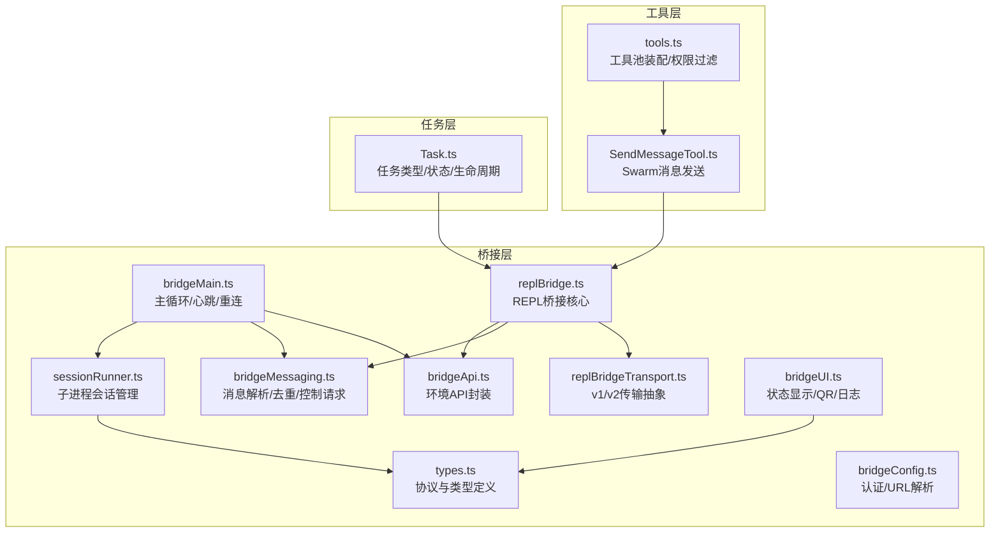
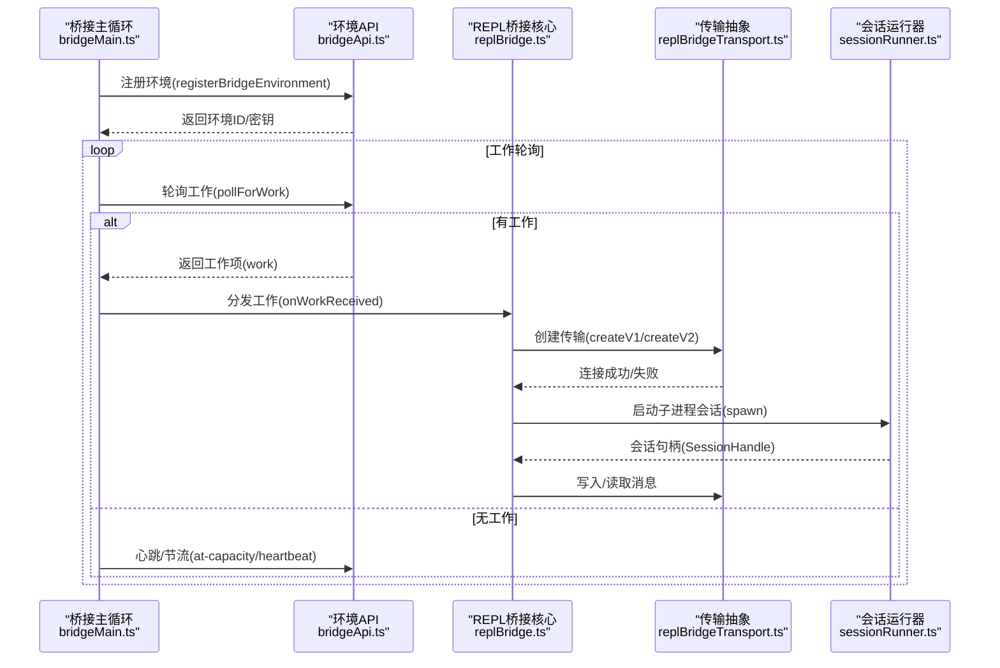
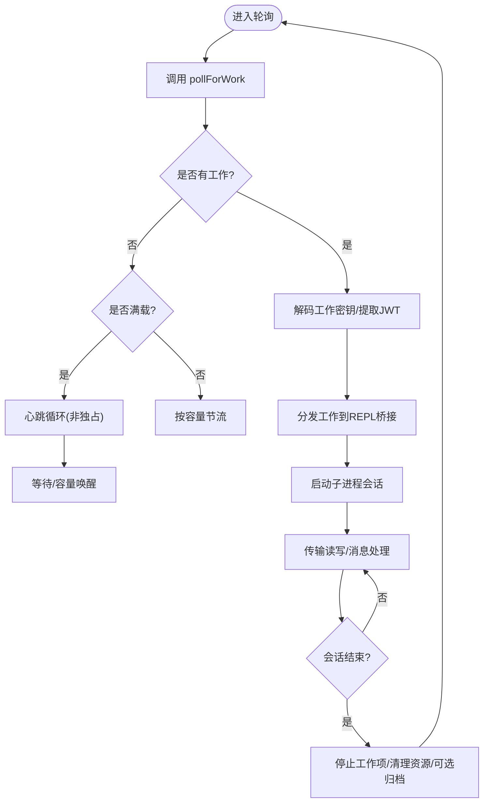
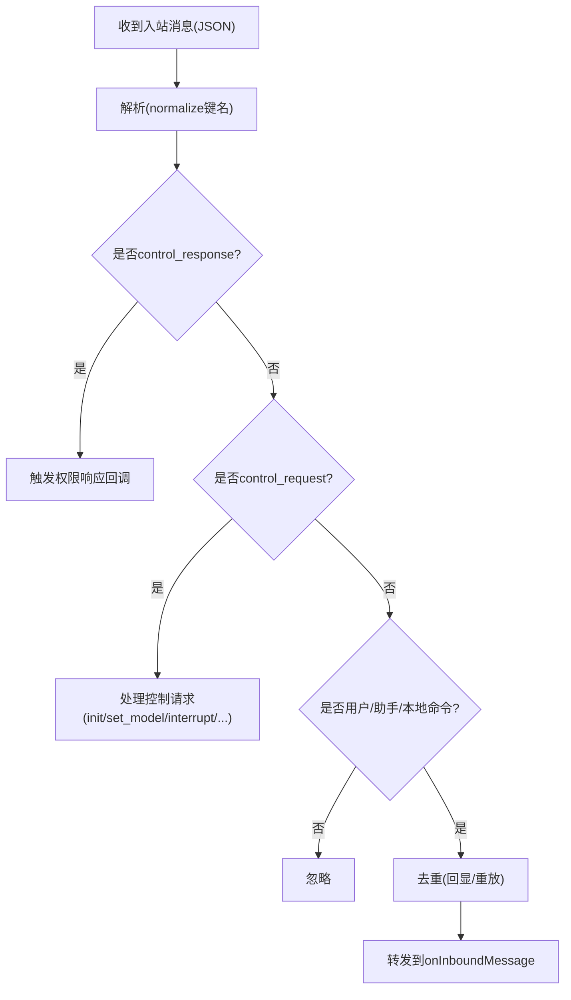
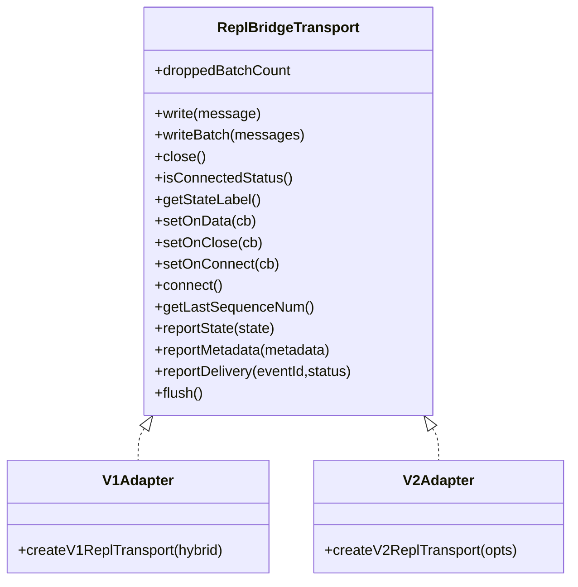
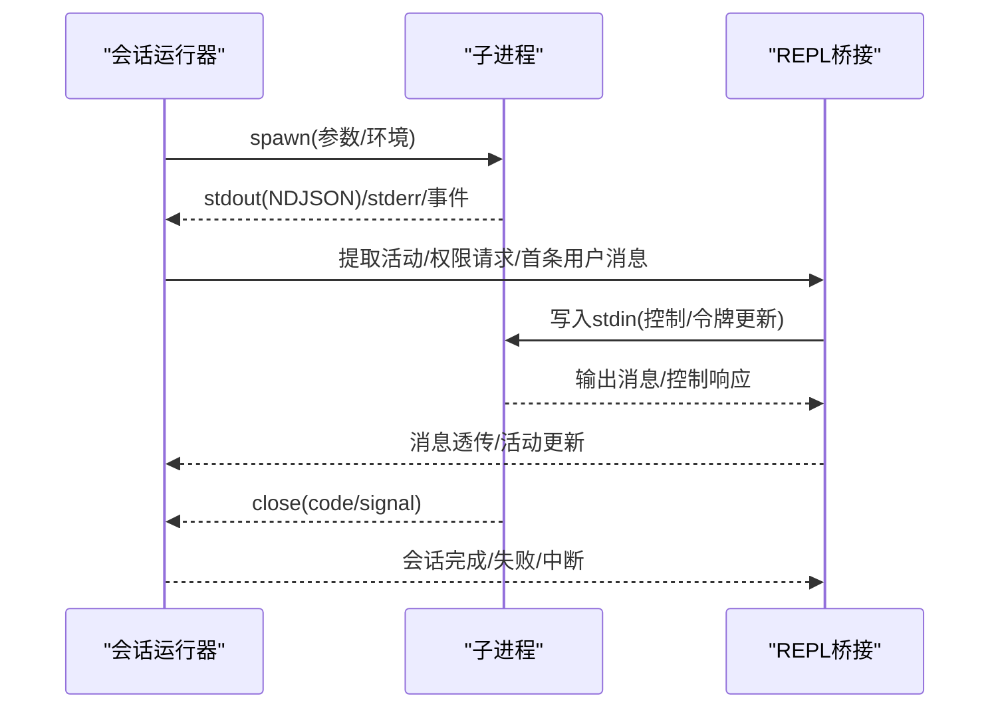
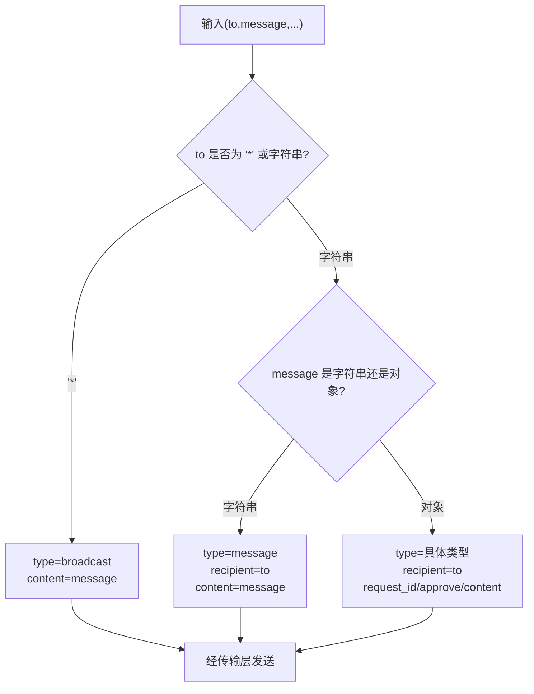
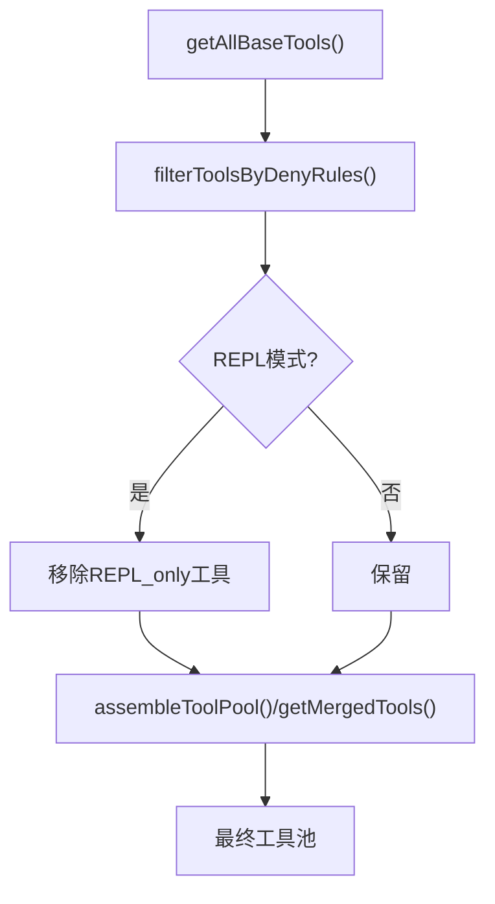
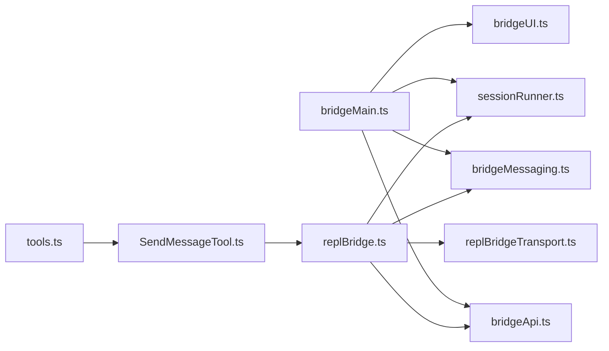

# 代理通信与交互

<cite>
**本文引用的文件**
- [src/bridge/bridgeMain.ts](file://src/bridge/bridgeMain.ts)
- [src/bridge/bridgeApi.ts](file://src/bridge/bridgeApi.ts)
- [src/bridge/bridgeMessaging.ts](file://src/bridge/bridgeMessaging.ts)
- [src/bridge/replBridge.ts](file://src/bridge/replBridge.ts)
- [src/bridge/replBridgeTransport.ts](file://src/bridge/replBridgeTransport.ts)
- [src/bridge/sessionRunner.ts](file://src/bridge/sessionRunner.ts)
- [src/bridge/bridgeUI.ts](file://src/bridge/bridgeUI.ts)
- [src/bridge/types.ts](file://src/bridge/types.ts)
- [src/bridge/bridgeConfig.ts](file://src/bridge/bridgeConfig.ts)
- [src/tools.ts](file://src/tools.ts)
- [src/tools/SendMessageTool/SendMessageTool.ts](file://src/tools/SendMessageTool/SendMessageTool.ts)
- [src/Task.ts](file://src/Task.ts)
</cite>

## 目录
1. [引言](#引言)
2. [项目结构](#项目结构)
3. [核心组件](#核心组件)
4. [架构总览](#架构总览)
5. [详细组件分析](#详细组件分析)
6. [依赖关系分析](#依赖关系分析)
7. [性能考虑](#性能考虑)
8. [故障排查指南](#故障排查指南)
9. [结论](#结论)
10. [附录](#附录)

## 引言
本文件系统性阐述代理通信与交互机制，覆盖以下主题：
- 代理间通信的实现方式与协议设计（含环境注册、工作轮询、会话接入、权限与控制请求）
- Swarm 工具集中的通信机制与消息传递（SendMessage 工具与广播/点对点消息）
- 代理与用户的交互方式与界面呈现（桥接 UI、QR 码、状态栏）
- 代理工具的通用能力与工具适配器（内置工具池、MCP 工具合并、权限过滤）
- 代理状态的共享与同步（心跳、断线重连、会话标题、活动轨迹）
- 安全性与可靠性保障（认证头、可信设备令牌、过期处理、重试与退避）
- 调试与监控（日志、诊断、错误类型、遥测事件）
- 与外部系统的集成接口（环境 API、会话入口、CCR v2 协议）
- 性能优化与延迟控制（心跳模式、容量唤醒、空闲节流）

## 项目结构
该仓库围绕“桥接层”构建代理通信与交互能力，关键目录与职责如下：
- bridge：桥接核心（环境注册、工作轮询、会话接入、传输抽象、UI 展示）
- tools：工具集合（内置工具、MCP 工具、工具池装配、权限过滤）
- Task：任务抽象（任务生命周期、状态机、输出路径）
- 其他：CLI 传输、远程会话、服务端集成等

**图表来源**
- [src/bridge/bridgeMain.ts:141-800](file://src/bridge/bridgeMain.ts#L141-L800)
- [src/bridge/bridgeApi.ts:68-452](file://src/bridge/bridgeApi.ts#L68-L452)
- [src/bridge/bridgeMessaging.ts:132-391](file://src/bridge/bridgeMessaging.ts#L132-L391)
- [src/bridge/replBridge.ts:260-800](file://src/bridge/replBridge.ts#L260-L800)
- [src/bridge/replBridgeTransport.ts:119-371](file://src/bridge/replBridgeTransport.ts#L119-L371)
- [src/bridge/sessionRunner.ts:248-551](file://src/bridge/sessionRunner.ts#L248-L551)
- [src/bridge/bridgeUI.ts:42-531](file://src/bridge/bridgeUI.ts#L42-L531)
- [src/bridge/types.ts:16-263](file://src/bridge/types.ts#L16-L263)
- [src/bridge/bridgeConfig.ts:17-49](file://src/bridge/bridgeConfig.ts#L17-L49)
- [src/tools.ts:193-390](file://src/tools.ts#L193-L390)
- [src/tools/SendMessageTool/SendMessageTool.ts:520-569](file://src/tools/SendMessageTool/SendMessageTool.ts#L520-L569)
- [src/Task.ts:1-126](file://src/Task.ts#L1-L126)

**章节来源**
- [src/bridge/bridgeMain.ts:141-800](file://src/bridge/bridgeMain.ts#L141-L800)
- [src/bridge/types.ts:16-263](file://src/bridge/types.ts#L16-L263)

## 核心组件
- 环境与工作轮询：通过环境注册、工作轮询、心跳维持会话活性；支持多会话模式与容量唤醒。
- 消息与控制：统一的 SDK 消息解析、去重、控制请求响应（初始化、设置模型、权限模式、中断）。
- 传输抽象：v1（HybridTransport）与 v2（SSETransport + CCRClient）双栈，自动选择与回退。
- 子进程会话：子进程生命周期管理、活动追踪、权限请求转发、令牌刷新。
- UI 与日志：状态栏、QR 码、连接/失败/重连提示、调试日志与诊断输出。
- 工具池与 Swarm：内置工具与 MCP 工具合并、权限过滤、SendMessage 工具支持广播/点对点消息。

**章节来源**
- [src/bridge/bridgeApi.ts:141-452](file://src/bridge/bridgeApi.ts#L141-L452)
- [src/bridge/bridgeMessaging.ts:132-391](file://src/bridge/bridgeMessaging.ts#L132-L391)
- [src/bridge/replBridgeTransport.ts:119-371](file://src/bridge/replBridgeTransport.ts#L119-L371)
- [src/bridge/sessionRunner.ts:248-551](file://src/bridge/sessionRunner.ts#L248-L551)
- [src/bridge/bridgeUI.ts:42-531](file://src/bridge/bridgeUI.ts#L42-L531)
- [src/tools.ts:193-390](file://src/tools.ts#L193-L390)
- [src/tools/SendMessageTool/SendMessageTool.ts:520-569](file://src/tools/SendMessageTool/SendMessageTool.ts#L520-L569)

## 架构总览
下图展示桥接主循环如何驱动环境注册、工作轮询、会话接入与传输层交互。

**图表来源**
- [src/bridge/bridgeMain.ts:141-800](file://src/bridge/bridgeMain.ts#L141-L800)
- [src/bridge/bridgeApi.ts:199-452](file://src/bridge/bridgeApi.ts#L199-L452)
- [src/bridge/replBridge.ts:260-800](file://src/bridge/replBridge.ts#L260-L800)
- [src/bridge/replBridgeTransport.ts:119-371](file://src/bridge/replBridgeTransport.ts#L119-L371)
- [src/bridge/sessionRunner.ts:248-551](file://src/bridge/sessionRunner.ts#L248-L551)

## 详细组件分析

### 组件A：桥接主循环与工作轮询
- 功能要点
  - 环境注册、工作轮询、心跳、断线重连、容量唤醒、会话归档与清理。
  - 支持多会话模式与 at-capacity 心跳模式，避免过度轮询。
  - 令牌刷新与 v2 重连策略，确保长时间会话不中断。
- 关键流程
  - 空闲/部分占用/满载三种轮询速率；在满载时以心跳为主，必要时快速轮询。
  - 对于已完成的工作进行去重，防止重复派发。
  - 会话结束时停止工作项、清理工作树、可选归档会话。

**图表来源**
- [src/bridge/bridgeMain.ts:141-800](file://src/bridge/bridgeMain.ts#L141-L800)
- [src/bridge/bridgeApi.ts:199-452](file://src/bridge/bridgeApi.ts#L199-L452)
- [src/bridge/sessionRunner.ts:248-551](file://src/bridge/sessionRunner.ts#L248-L551)

**章节来源**
- [src/bridge/bridgeMain.ts:141-800](file://src/bridge/bridgeMain.ts#L141-L800)
- [src/bridge/bridgeApi.ts:199-452](file://src/bridge/bridgeApi.ts#L199-L452)

### 组件B：消息解析与控制请求处理
- 功能要点
  - 统一 SDK 消息解析、去重（回显与重放）、桥接消息筛选（仅转发用户/助手/本地命令）。
  - 服务器下发的 control_request 快速响应，避免超时挂起。
  - 权限响应事件通过会话事件 API 发送。
- 关键数据结构
  - BoundedUUIDSet：固定容量环形去重缓冲，保证内存上限。
  - SDKMessage/SDKControlRequest/SDKControlResponse 类型守卫。

**图表来源**
- [src/bridge/bridgeMessaging.ts:132-208](file://src/bridge/bridgeMessaging.ts#L132-L208)
- [src/bridge/bridgeMessaging.ts:243-391](file://src/bridge/bridgeMessaging.ts#L243-L391)

**章节来源**
- [src/bridge/bridgeMessaging.ts:132-391](file://src/bridge/bridgeMessaging.ts#L132-L391)

### 组件C：传输抽象（v1/v2）
- 功能要点
  - v1：HybridTransport（WebSocket 读 + Session-Ingress POST 写）。
  - v2：SSETransport（读）+ CCRClient（写），支持 worker 注册、心跳、状态上报、交付跟踪。
  - 自动选择：由工作密钥决定是否使用 CCR v2；支持 outbound-only 模式。
- 关键行为
  - v2 写路径不使用 SSE 序列号，采用 CCRClient 的批上传与心跳。
  - epoch 不匹配时主动关闭并触发轮询恢复。

**图表来源**
- [src/bridge/replBridgeTransport.ts:23-70](file://src/bridge/replBridgeTransport.ts#L23-L70)
- [src/bridge/replBridgeTransport.ts:119-371](file://src/bridge/replBridgeTransport.ts#L119-L371)

**章节来源**
- [src/bridge/replBridgeTransport.ts:119-371](file://src/bridge/replBridgeTransport.ts#L119-L371)

### 组件D：子进程会话管理
- 功能要点
  - 子进程生命周期：stdin 写入、stdout 解析、stderr 捕获、退出码处理。
  - 活动追踪：工具调用摘要、文本摘要、结果/错误标记。
  - 权限请求转发：当子进程发出 can_use_tool 控制请求时，桥接转发至服务器。
  - 令牌刷新：通过 stdin 发送更新环境变量指令，动态替换会话访问令牌。
- 关键数据结构
  - SessionHandle：会话句柄，暴露 done、活动列表、当前活动、写入 stdin、更新令牌等。

**图表来源**
- [src/bridge/sessionRunner.ts:248-551](file://src/bridge/sessionRunner.ts#L248-L551)
- [src/bridge/replBridge.ts:260-800](file://src/bridge/replBridge.ts#L260-L800)

**章节来源**
- [src/bridge/sessionRunner.ts:248-551](file://src/bridge/sessionRunner.ts#L248-L551)

### 组件E：Swarm 工具与消息传递
- 功能要点
  - SendMessage 工具启用条件：isAgentSwarmsEnabled。
  - 自动推断消息类型：广播（to=*）、点对点（to=具体ID）、带 request_id/approve/reason/feedback 的控制消息。
  - 与 REPL 桥接配合，通过传输层发送消息；支持 outbound-only 模式（镜像附件转发）。
- 关键流程
  - 输入归档：根据 to 与 message 结构推断 type/recipient/request_id/content。
  - 与 REPL 桥接：SendMessageTool 作为工具被调用，经由传输层发送到目标代理或广播。

**图表来源**
- [src/tools/SendMessageTool/SendMessageTool.ts:520-569](file://src/tools/SendMessageTool/SendMessageTool.ts#L520-L569)
- [src/tools.ts:226-230](file://src/tools.ts#L226-L230)

**章节来源**
- [src/tools/SendMessageTool/SendMessageTool.ts:520-569](file://src/tools/SendMessageTool/SendMessageTool.ts#L520-L569)
- [src/tools.ts:226-230](file://src/tools.ts#L226-L230)

### 组件F：工具池与适配器
- 功能要点
  - getAllBaseTools：聚合内置工具与条件性工具（如 REPL、PowerShell、Cron、Monitor 等）。
  - assembleToolPool/getMergedTools：内置工具与 MCP 工具合并，去重优先内置工具。
  - filterToolsByDenyRules：基于权限上下文的拒绝规则过滤工具。
- 适配器
  - REPL 模式隐藏原语工具，仅在 VM 内部可用。
  - 简化模式（CLAUDE_CODE_SIMPLE）返回 Bash/Read/Edit 或 REPL 包装。

**图表来源**
- [src/tools.ts:193-390](file://src/tools.ts#L193-L390)

**章节来源**
- [src/tools.ts:193-390](file://src/tools.ts#L193-L390)

### 组件G：UI 与交互
- 功能要点
  - 状态栏：连接中/就绪/连接中重连/失败状态切换，工具活动展示。
  - QR 码：生成连接 URL 的二维码，支持显示/隐藏。
  - 日志：调试日志、诊断日志、错误日志分级输出。
  - 多会话：容量指示、会话标题、活动轨迹、切换 spawn 模式提示。
- 关键行为
  - 切换状态时清屏并重新渲染，避免残留状态。
  - 在 reconnecting/failed 状态下保护 UI 渲染，避免覆盖错误信息。

**章节来源**
- [src/bridge/bridgeUI.ts:42-531](file://src/bridge/bridgeUI.ts#L42-L531)

## 依赖关系分析
- 组件耦合
  - bridgeMain 依赖 bridgeApi、bridgeMessaging、sessionRunner、bridgeUI。
  - replBridge 依赖 bridgeApi、bridgeMessaging、replBridgeTransport、sessionRunner。
  - tools 与 SendMessageTool 依赖工具池装配与权限上下文。
- 外部依赖
  - 环境 API（Axios）、传输层（WebSocket/SSE/HTTP）、子进程（child_process）。
- 可能的循环依赖
  - tools.ts 通过懒加载 TeamCreate/TeamDelete 与 SendMessageTool，避免直接循环导入。

**图表来源**
- [src/bridge/bridgeMain.ts:141-800](file://src/bridge/bridgeMain.ts#L141-L800)
- [src/bridge/replBridge.ts:260-800](file://src/bridge/replBridge.ts#L260-L800)
- [src/bridge/replBridgeTransport.ts:119-371](file://src/bridge/replBridgeTransport.ts#L119-L371)
- [src/bridge/sessionRunner.ts:248-551](file://src/bridge/sessionRunner.ts#L248-L551)
- [src/bridge/bridgeUI.ts:42-531](file://src/bridge/bridgeUI.ts#L42-L531)
- [src/tools.ts:193-390](file://src/tools.ts#L193-L390)
- [src/tools/SendMessageTool/SendMessageTool.ts:520-569](file://src/tools/SendMessageTool/SendMessageTool.ts#L520-L569)

**章节来源**
- [src/bridge/bridgeMain.ts:141-800](file://src/bridge/bridgeMain.ts#L141-L800)
- [src/bridge/replBridge.ts:260-800](file://src/bridge/replBridge.ts#L260-L800)
- [src/tools.ts:193-390](file://src/tools.ts#L193-L390)

## 性能考虑
- 心跳与轮询
  - 满载时以心跳为主，减少不必要的轮询；在特定配置下周期性强制轮询以保持活跃。
- 容量唤醒
  - 会话结束时唤醒 at-capacity 睡眠，立即接受新工作，降低延迟。
- 去重与批处理
  - 出站/入站 UUID 去重缓冲，避免回显与重放导致的消息风暴。
  - v2 写路径使用 CCRClient 批上传，顺序写入保证有序性。
- 资源回收
  - 会话结束清理工作树、停止工作项、取消定时器与清理任务，避免资源泄漏。

[本节为通用指导，无需特定文件引用]

## 故障排查指南
- 认证与权限
  - 401/403/404/410 错误分类与处理：401 触发 OAuth 刷新；403/404/410 视为致命错误，触发断开或退出。
  - 可抑制的 403（如外部轮询/环境管理权限不足）不显示给用户。
- 重连与恢复
  - 环境丢失：尝试重注册并原地重连；失败则归档旧会话并创建新会话。
  - 传输异常：v2 epoch 不匹配时主动关闭并由轮询恢复；SSE 连接耗尽映射为特定关闭码。
- 日志与诊断
  - 调试日志与诊断日志分离；桥接 UI 提供详细状态与 QR 码。
  - 环境/会话事件遥测用于定位问题。

**章节来源**
- [src/bridge/bridgeApi.ts:454-540](file://src/bridge/bridgeApi.ts#L454-L540)
- [src/bridge/replBridge.ts:605-800](file://src/bridge/replBridge.ts#L605-L800)
- [src/bridge/bridgeUI.ts:42-531](file://src/bridge/bridgeUI.ts#L42-L531)

## 结论
该系统通过桥接层实现了稳定可靠的代理通信与交互机制：以环境注册与工作轮询为核心，结合 v1/v2 传输抽象、消息去重与控制请求处理、子进程会话管理与 UI 展示，形成完整的代理生命周期闭环。Swarm 工具集进一步扩展了代理间的协作能力，配合工具池与权限过滤，满足复杂场景下的安全与可控性需求。通过心跳模式、容量唤醒与严格的错误处理，系统在可靠性与性能之间取得平衡，并提供了完善的调试与监控手段。

[本节为总结，无需特定文件引用]

## 附录
- 关键类型与协议
  - WorkResponse/WorkSecret：工作项与会话密钥结构。
  - BridgeApiClient：环境 API 封装，包括轮询、心跳、停止、归档、重连等。
  - ReplBridgeHandle/Transport：REPL 桥接句柄与传输抽象。
- 配置与认证
  - getBridgeAccessToken/getBridgeBaseUrl：桥接认证与 API 基址解析。
  - getBridgeTokenOverride/getBridgeBaseUrlOverride：Ant 开发者覆盖。

**章节来源**
- [src/bridge/types.ts:18-176](file://src/bridge/types.ts#L18-L176)
- [src/bridge/bridgeConfig.ts:17-49](file://src/bridge/bridgeConfig.ts#L17-L49)
- [src/Task.ts:1-126](file://src/Task.ts#L1-L126)