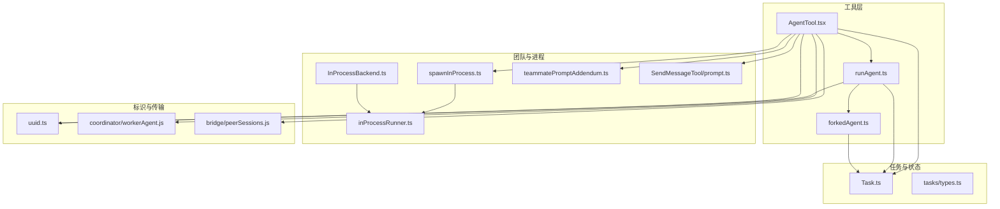
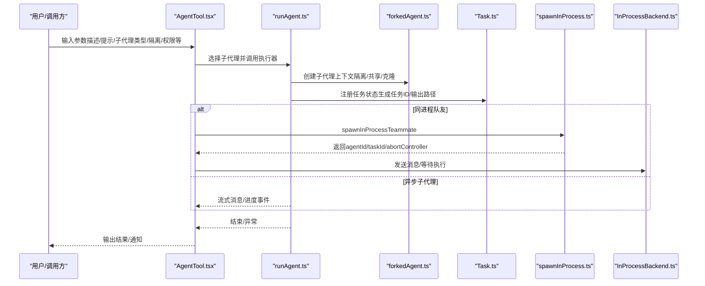
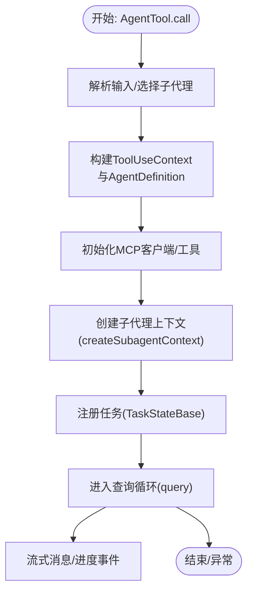
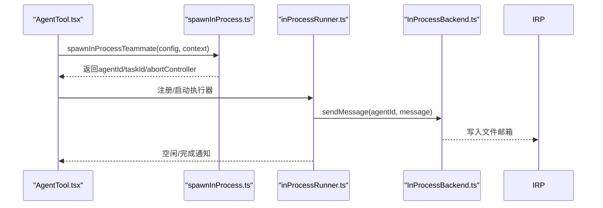
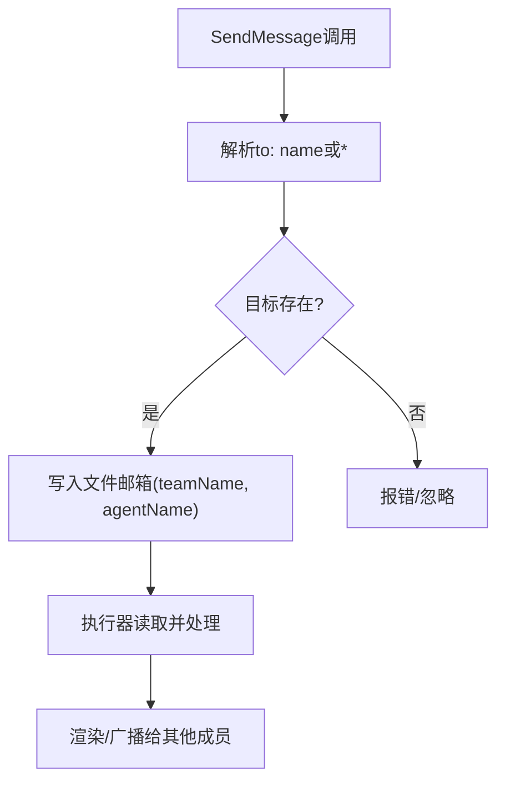
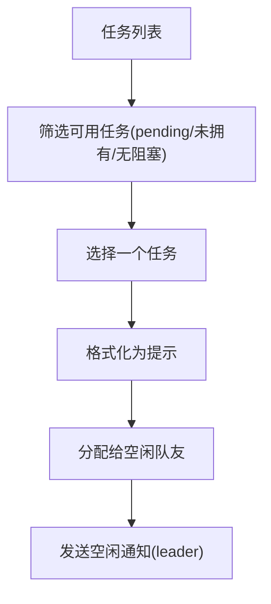
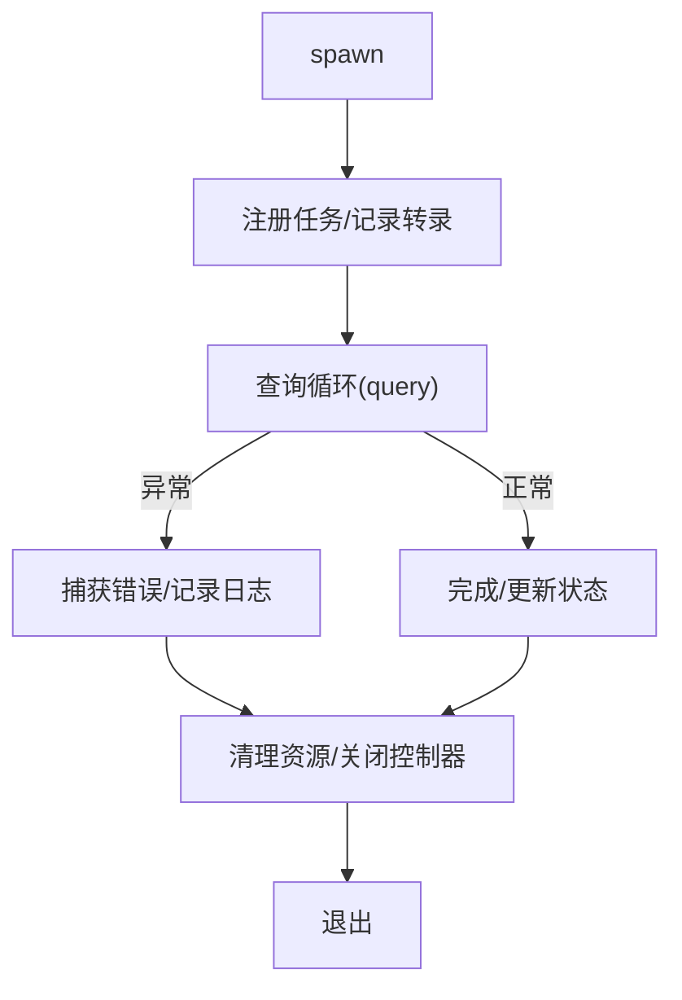
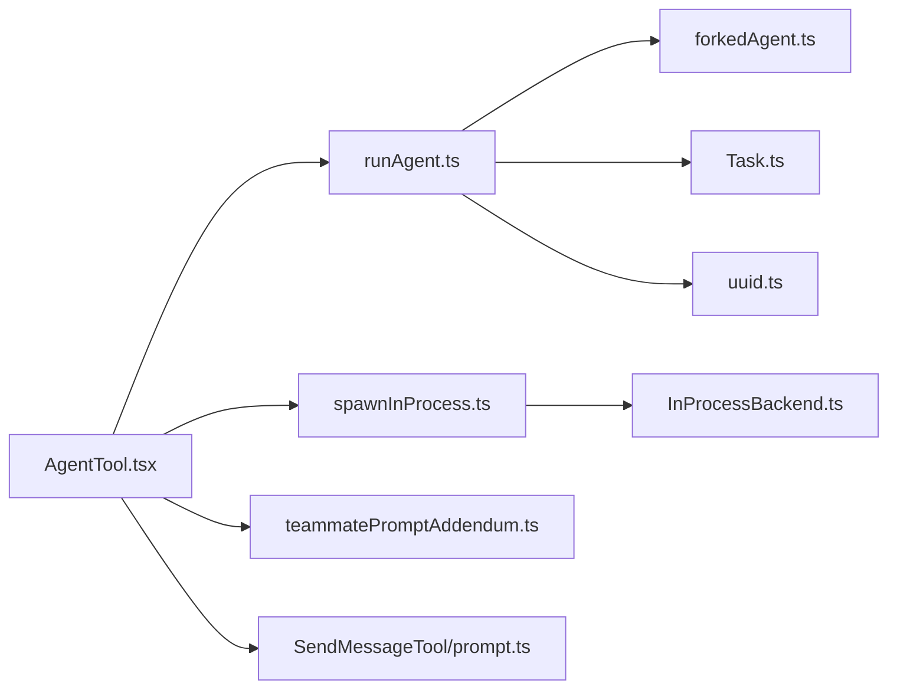

# 子代理架构

<cite>
**本文引用的文件**
- [src/Task.ts](file://src/Task.ts)
- [src/tasks/types.ts](file://src/tasks/types.ts)
- [src/utils/forkedAgent.ts](file://src/utils/forkedAgent.ts)
- [src/tools/AgentTool/runAgent.ts](file://src/tools/AgentTool/runAgent.ts)
- [src/tools/AgentTool/AgentTool.tsx](file://src/tools/AgentTool/AgentTool.tsx)
- [src/utils/swarm/spawnInProcess.ts](file://src/utils/swarm/spawnInProcess.ts)
- [src/utils/swarm/backends/InProcessBackend.ts](file://src/utils/swarm/backends/InProcessBackend.ts)
- [src/utils/swarm/inProcessRunner.ts](file://src/utils/swarm/inProcessRunner.ts)
- [src/utils/swarm/teammatePromptAddendum.ts](file://src/utils/swarm/teammatePromptAddendum.ts)
- [src/tools/SendMessageTool/prompt.ts](file://src/tools/SendMessageTool/prompt.ts)
- [src/utils/uuid.ts](file://src/utils/uuid.ts)
- [coordinator/workerAgent.js](file://coordinator/workerAgent.js)
- [bridge/peerSessions.js](file://bridge/peerSessions.js)
</cite>

## 目录
1. [引言](#引言)
2. [项目结构](#项目结构)
3. [核心组件](#核心组件)
4. [架构总览](#架构总览)
5. [详细组件分析](#详细组件分析)
6. [依赖关系分析](#依赖关系分析)
7. [性能考量](#性能考量)
8. [故障排查指南](#故障排查指南)
9. [结论](#结论)
10. [附录](#附录)

## 引言
本文件系统化阐述 Claude Code 的“子代理”（Subagent）架构：从概念、设计原则到实现细节，覆盖子代理的创建与管理、进程与状态同步、资源共享、跨代理通信、多代理协调与任务分配、生命周期与错误处理、性能优化与资源控制，以及与主代理的协作关系。目标是帮助开发者在不深入源码的前提下，也能高效理解并正确使用与扩展子代理能力。

## 项目结构
子代理相关能力横跨工具层、执行层、任务框架、团队与进程隔离、消息与会话存储等多个模块：
- 工具层：AgentTool 负责解析输入、选择子代理类型、调度执行与异步生命周期管理。
- 执行层：runAgent 提供统一的查询循环与上下文构建，支持 MCP 服务器、权限模式、钩子、技能预加载、提示缓存共享等。
- 上下文与隔离：forkedAgent 提供子代理上下文隔离、可选共享回调、克隆文件状态缓存、查询链追踪等。
- 团队与进程：spawnInProcess 与 InProcessBackend 支持同进程队友的创建、注册、消息投递；inProcessRunner 实现任务分发与空闲通知。
- 任务框架：Task/TaskState 定义任务类型、状态机与持久化输出路径，支撑后台任务显示与清理。
- 会话与传输：UUID 生成、会话转录记录、消息协议（含 SendMessage 工具与协议响应）。

图表来源
- [src/tools/AgentTool/AgentTool.tsx:196-726](file://src/tools/AgentTool/AgentTool.tsx#L196-L726)
- [src/tools/AgentTool/runAgent.ts:248-800](file://src/tools/AgentTool/runAgent.ts#L248-L800)
- [src/utils/forkedAgent.ts:345-690](file://src/utils/forkedAgent.ts#L345-L690)
- [src/utils/swarm/spawnInProcess.ts:104-216](file://src/utils/swarm/spawnInProcess.ts#L104-L216)
- [src/utils/swarm/backends/InProcessBackend.ts:131-180](file://src/utils/swarm/backends/InProcessBackend.ts#L131-L180)
- [src/utils/swarm/inProcessRunner.ts:565-618](file://src/utils/swarm/inProcessRunner.ts#L565-L618)
- [src/utils/swarm/teammatePromptAddendum.ts:1-18](file://src/utils/swarm/teammatePromptAddendum.ts#L1-L18)
- [src/tools/SendMessageTool/prompt.ts:36-49](file://src/tools/SendMessageTool/prompt.ts#L36-L49)
- [src/Task.ts:1-126](file://src/Task.ts#L1-L126)
- [src/tasks/types.ts:1-47](file://src/tasks/types.ts#L1-L47)
- [src/utils/uuid.ts:1-27](file://src/utils/uuid.ts#L1-L27)
- [coordinator/workerAgent.js:1-4](file://coordinator/workerAgent.js#L1-L4)
- [bridge/peerSessions.js:1-4](file://bridge/peerSessions.js#L1-L4)

章节来源
- [src/tools/AgentTool/AgentTool.tsx:196-726](file://src/tools/AgentTool/AgentTool.tsx#L196-L726)
- [src/tools/AgentTool/runAgent.ts:248-800](file://src/tools/AgentTool/runAgent.ts#L248-L800)
- [src/utils/forkedAgent.ts:345-690](file://src/utils/forkedAgent.ts#L345-L690)
- [src/utils/swarm/spawnInProcess.ts:104-216](file://src/utils/swarm/spawnInProcess.ts#L104-L216)
- [src/utils/swarm/backends/InProcessBackend.ts:131-180](file://src/utils/swarm/backends/InProcessBackend.ts#L131-L180)
- [src/utils/swarm/inProcessRunner.ts:565-618](file://src/utils/swarm/inProcessRunner.ts#L565-L618)
- [src/utils/swarm/teammatePromptAddendum.ts:1-18](file://src/utils/swarm/teammatePromptAddendum.ts#L1-L18)
- [src/tools/SendMessageTool/prompt.ts:36-49](file://src/tools/SendMessageTool/prompt.ts#L36-L49)
- [src/Task.ts:1-126](file://src/Task.ts#L1-L126)
- [src/tasks/types.ts:1-47](file://src/tasks/types.ts#L1-L47)
- [src/utils/uuid.ts:1-27](file://src/utils/uuid.ts#L1-L27)
- [coordinator/workerAgent.js:1-4](file://coordinator/workerAgent.js#L1-L4)
- [bridge/peerSessions.js:1-4](file://bridge/peerSessions.js#L1-L4)

## 核心组件
- 任务与状态
  - 任务类型与状态：定义本地/远程/流程/监控/梦境等任务类型与运行/挂起/完成/失败/终止状态机，并提供终端态判断以避免僵尸任务与孤儿清理路径。
  - 任务 ID 生成：为不同任务类型生成带前缀的唯一 ID，兼顾向后兼容与安全随机性。
  - 任务状态基类：统一描述、时间戳、输出路径与偏移、通知标记等字段，便于 UI 与日志展示。
- 子代理上下文隔离
  - 克隆文件状态缓存、独立或共享的 AbortController、可选共享 setAppState/setResponseLength 等回调，确保父/子状态隔离与必要共享。
  - 查询链追踪与内容替换状态克隆，保障 fork 场景下的提示缓存命中一致性。
- 进程内队友与消息
  - 同进程队友创建：生成确定性 agentId、注册任务、建立 AbortController 链接、注册清理回调。
  - 消息投递：基于文件邮箱的简单协议，按 teamName/agentName 写入消息，由执行器读取并驱动。
- 统一执行器
  - 构建系统提示、用户/系统上下文、工具集与 MCP 客户端，注入权限模式、额外工作目录、钩子与技能预加载。
  - 支持 fork 场景的缓存安全参数传递，保证父子请求前缀一致以命中提示缓存。

章节来源
- [src/Task.ts:6-126](file://src/Task.ts#L6-L126)
- [src/tasks/types.ts:12-47](file://src/tasks/types.ts#L12-L47)
- [src/utils/forkedAgent.ts:345-690](file://src/utils/forkedAgent.ts#L345-L690)
- [src/utils/swarm/spawnInProcess.ts:104-216](file://src/utils/swarm/spawnInProcess.ts#L104-L216)
- [src/utils/swarm/backends/InProcessBackend.ts:131-180](file://src/utils/swarm/backends/InProcessBackend.ts#L131-L180)
- [src/tools/AgentTool/runAgent.ts:248-800](file://src/tools/AgentTool/runAgent.ts#L248-L800)

## 架构总览
子代理体系围绕“工具调用—执行器—上下文隔离—任务框架—团队与通信”的闭环展开。AgentTool 解析输入并决定是否创建子代理；runAgent 构建上下文与工具集，按需连接 MCP；forkedAgent 提供隔离与缓存共享；任务框架负责状态持久化与后台显示；团队模块负责进程内/进程外队友的创建与消息投递。

图表来源
- [src/tools/AgentTool/AgentTool.tsx:196-726](file://src/tools/AgentTool/AgentTool.tsx#L196-L726)
- [src/tools/AgentTool/runAgent.ts:248-800](file://src/tools/AgentTool/runAgent.ts#L248-L800)
- [src/utils/forkedAgent.ts:345-690](file://src/utils/forkedAgent.ts#L345-L690)
- [src/Task.ts:1-126](file://src/Task.ts#L1-L126)
- [src/utils/swarm/spawnInProcess.ts:104-216](file://src/utils/swarm/spawnInProcess.ts#L104-L216)
- [src/utils/swarm/backends/InProcessBackend.ts:131-180](file://src/utils/swarm/backends/InProcessBackend.ts#L131-L180)

## 详细组件分析

### 子代理创建与管理
- AgentTool 输入与路由
  - 支持描述、提示、子代理类型、模型覆盖、后台运行、隔离模式（worktree/remote）、工作目录等参数。
  - 多代理参数（name/team_name/mode）在特性开关下启用，用于团队与权限模式控制。
  - 当开启 fork 子代理时，自动路由至 fork 分支，禁用 run_in_background 参数。
- runAgent 生命周期
  - 解析系统提示、上下文、工具集与 MCP 客户端，注入权限模式与额外工作目录。
  - 注册前端钩子、预加载技能、记录初始转录与元数据。
  - 构造子代理上下文（createSubagentContext），支持共享 setAppState/setResponseLength/abortController。
  - 在查询循环中转发 TTFT/OTPS 等指标，支持最大轮次限制与附件消息处理。
- 任务注册与输出
  - 使用 createTaskStateBase 生成任务状态，设置输出路径与偏移，便于 UI 与日志读取。
  - 通过 setAppStateForTasks 或 setAppState 将任务写入全局状态，确保后台任务可见与清理。

图表来源
- [src/tools/AgentTool/AgentTool.tsx:196-726](file://src/tools/AgentTool/AgentTool.tsx#L196-L726)
- [src/tools/AgentTool/runAgent.ts:248-800](file://src/tools/AgentTool/runAgent.ts#L248-L800)
- [src/utils/forkedAgent.ts:345-690](file://src/utils/forkedAgent.ts#L345-L690)
- [src/Task.ts:108-126](file://src/Task.ts#L108-L126)

章节来源
- [src/tools/AgentTool/AgentTool.tsx:82-125](file://src/tools/AgentTool/AgentTool.tsx#L82-L125)
- [src/tools/AgentTool/AgentTool.tsx:196-726](file://src/tools/AgentTool/AgentTool.tsx#L196-L726)
- [src/tools/AgentTool/runAgent.ts:248-800](file://src/tools/AgentTool/runAgent.ts#L248-L800)
- [src/utils/forkedAgent.ts:345-690](file://src/utils/forkedAgent.ts#L345-L690)
- [src/Task.ts:108-126](file://src/Task.ts#L108-L126)

### 进程管理、状态同步与资源共享
- 进程内队友
  - spawnInProcessTeammate 生成确定性 agentId（name@team），创建独立 AbortController，注册任务状态，返回 teammateContext 供执行器使用。
  - killInProcessTeammate 中断控制器、注销清理回调、更新任务状态并移除团队映射，随后触发 SDK 事件与输出清理。
- 状态同步
  - 子代理上下文默认隔离 setAppState 与响应长度统计，仅在显式共享时与父状态同步。
  - forkedAgent 在查询循环中累积用量并记录 tengu_fork_agent_query 事件，便于跨子代理的用量追踪。
- 资源共享
  - 文件状态缓存克隆（cloneFileStateCache），避免父子并发修改导致的竞态。
  - MCP 客户端可复用（memoized connectToServer），新增 agent-specific 服务器仅在清理阶段关闭。

图表来源
- [src/utils/swarm/spawnInProcess.ts:104-216](file://src/utils/swarm/spawnInProcess.ts#L104-L216)
- [src/utils/swarm/inProcessRunner.ts:565-618](file://src/utils/swarm/inProcessRunner.ts#L565-L618)
- [src/utils/swarm/backends/InProcessBackend.ts:131-180](file://src/utils/swarm/backends/InProcessBackend.ts#L131-L180)

章节来源
- [src/utils/swarm/spawnInProcess.ts:104-216](file://src/utils/swarm/spawnInProcess.ts#L104-L216)
- [src/utils/swarm/inProcessRunner.ts:565-618](file://src/utils/swarm/inProcessRunner.ts#L565-L618)
- [src/utils/swarm/backends/InProcessBackend.ts:131-180](file://src/utils/swarm/backends/InProcessBackend.ts#L131-L180)
- [src/utils/forkedAgent.ts:489-626](file://src/utils/forkedAgent.ts#L489-L626)

### 代理间通信方式与协议
- 同进程通信
  - 基于文件邮箱的消息投递，按 teamName/agentName 写入消息体（文本、来源、颜色、时间戳）。
  - 队友通过系统提示附加说明可见性与通信要求，强调必须使用 SendMessage 工具进行团队内可见通信。
- 协议响应（历史）
  - 支持 shutdown_request/plan_approval_request 的 JSON 响应格式，要求 echo request_id 并设置 approve 字段。
- 远程/桥接
  - coordinator/workerAgent.js 与 bridge/peerSessions.js 提供远程/桥接通道占位，便于扩展远端子代理执行与状态同步。

图表来源
- [src/tools/SendMessageTool/prompt.ts:36-49](file://src/tools/SendMessageTool/prompt.ts#L36-L49)
- [src/utils/swarm/backends/InProcessBackend.ts:150-180](file://src/utils/swarm/backends/InProcessBackend.ts#L150-L180)
- [src/utils/swarm/teammatePromptAddendum.ts:1-18](file://src/utils/swarm/teammatePromptAddendum.ts#L1-L18)
- [coordinator/workerAgent.js:1-4](file://coordinator/workerAgent.js#L1-L4)
- [bridge/peerSessions.js:1-4](file://bridge/peerSessions.js#L1-L4)

章节来源
- [src/tools/SendMessageTool/prompt.ts:36-49](file://src/tools/SendMessageTool/prompt.ts#L36-L49)
- [src/utils/swarm/backends/InProcessBackend.ts:150-180](file://src/utils/swarm/backends/InProcessBackend.ts#L150-L180)
- [src/utils/swarm/teammatePromptAddendum.ts:1-18](file://src/utils/swarm/teammatePromptAddendum.ts#L1-L18)
- [coordinator/workerAgent.js:1-4](file://coordinator/workerAgent.js#L1-L4)
- [bridge/peerSessions.js:1-4](file://bridge/peerSessions.js#L1-L4)

### 多代理协调与任务分配
- 任务发现与分配
  - inProcessRunner 从团队任务列表中筛选可用任务（pending、无拥有者、无阻塞），格式化为提示交由队友执行。
  - 空闲通知通过文件邮箱发送回领导，携带可用/中断/失败原因、摘要、完成的任务ID与状态。
- 权限与模式
  - 支持 plan 模式（需要计划审批）与默认模式；当队友不可见 UI 时自动避免权限提示。
- 队友系统提示附加
  - 明确队友可见性约束与通信要求，避免“仅文本回复”被误认为可见。

图表来源
- [src/utils/swarm/inProcessRunner.ts:595-618](file://src/utils/swarm/inProcessRunner.ts#L595-L618)
- [src/utils/swarm/inProcessRunner.ts:565-589](file://src/utils/swarm/inProcessRunner.ts#L565-L589)
- [src/utils/swarm/teammatePromptAddendum.ts:1-18](file://src/utils/swarm/teammatePromptAddendum.ts#L1-L18)

章节来源
- [src/utils/swarm/inProcessRunner.ts:595-618](file://src/utils/swarm/inProcessRunner.ts#L595-L618)
- [src/utils/swarm/inProcessRunner.ts:565-589](file://src/utils/swarm/inProcessRunner.ts#L565-L589)
- [src/utils/swarm/teammatePromptAddendum.ts:1-18](file://src/utils/swarm/teammatePromptAddendum.ts#L1-L18)

### 子代理生命周期管理与错误处理
- 生命周期
  - 生成 agentId/任务ID，注册任务状态，记录初始转录与元数据。
  - 查询循环中持续转发指标与进度；达到最大轮次或异常时终止。
  - 同进程队友支持优雅关闭：abortController 中断、清理回调注销、状态更新、SDK 事件与输出清理。
- 错误处理
  - runAgent 对 MCP 连接失败、工具加载失败、权限拒绝等进行日志记录与降级处理。
  - forkedAgent 在 finally 中释放克隆的文件状态缓存与临时消息数组，避免内存泄漏。
  - AgentTool 对非法输入、并发 spawn 限制（如 in-process teammate 不允许后台子代理）进行校验与报错。

图表来源
- [src/tools/AgentTool/runAgent.ts:248-800](file://src/tools/AgentTool/runAgent.ts#L248-L800)
- [src/utils/swarm/spawnInProcess.ts:182-216](file://src/utils/swarm/spawnInProcess.ts#L182-L216)
- [src/utils/swarm/spawnInProcess.ts:227-329](file://src/utils/swarm/spawnInProcess.ts#L227-L329)
- [src/utils/forkedAgent.ts:489-626](file://src/utils/forkedAgent.ts#L489-L626)

章节来源
- [src/tools/AgentTool/runAgent.ts:248-800](file://src/tools/AgentTool/runAgent.ts#L248-L800)
- [src/utils/swarm/spawnInProcess.ts:182-216](file://src/utils/swarm/spawnInProcess.ts#L182-L216)
- [src/utils/swarm/spawnInProcess.ts:227-329](file://src/utils/swarm/spawnInProcess.ts#L227-L329)
- [src/utils/forkedAgent.ts:489-626](file://src/utils/forkedAgent.ts#L489-L626)

### 子代理与主代理的关系与协作
- 主代理作为父上下文
  - 子代理继承父的工具池、MCP 客户端、系统提示与上下文，同时可按 agent 定义覆盖模型、权限模式、思考配置等。
  - forkedAgent 通过 CacheSafeParams 保持父子请求前缀一致，最大化提示缓存命中率。
- 协作机制
  - AgentTool 负责路由与生命周期管理；runAgent 负责执行与上下文构建；forkedAgent 负责隔离与缓存策略。
  - 队友通过文件邮箱与主代理交互，遵循明确的通信协议与可见性规则。

章节来源
- [src/tools/AgentTool/runAgent.ts:248-800](file://src/tools/AgentTool/runAgent.ts#L248-L800)
- [src/utils/forkedAgent.ts:345-690](file://src/utils/forkedAgent.ts#L345-L690)
- [src/utils/swarm/teammatePromptAddendum.ts:1-18](file://src/utils/swarm/teammatePromptAddendum.ts#L1-L18)

## 依赖关系分析
- 组件耦合
  - AgentTool 依赖 runAgent、Task.ts、spawnInProcess.ts、InProcessBackend.ts 等模块。
  - runAgent 依赖 forkedAgent、MCP 客户端、权限钩子、会话存储等。
  - forkedAgent 依赖 query.ts、用量统计、提示缓存事件记录。
- 外部依赖
  - MCP 客户端连接与工具拉取、UUID 生成、文件状态缓存、会话转录与元数据写入等。

图表来源
- [src/tools/AgentTool/AgentTool.tsx:196-726](file://src/tools/AgentTool/AgentTool.tsx#L196-L726)
- [src/tools/AgentTool/runAgent.ts:248-800](file://src/tools/AgentTool/runAgent.ts#L248-L800)
- [src/utils/forkedAgent.ts:345-690](file://src/utils/forkedAgent.ts#L345-L690)
- [src/Task.ts:1-126](file://src/Task.ts#L1-L126)
- [src/utils/swarm/spawnInProcess.ts:104-216](file://src/utils/swarm/spawnInProcess.ts#L104-L216)
- [src/utils/swarm/backends/InProcessBackend.ts:131-180](file://src/utils/swarm/backends/InProcessBackend.ts#L131-L180)
- [src/utils/uuid.ts:1-27](file://src/utils/uuid.ts#L1-L27)
- [src/utils/swarm/teammatePromptAddendum.ts:1-18](file://src/utils/swarm/teammatePromptAddendum.ts#L1-L18)
- [src/tools/SendMessageTool/prompt.ts:36-49](file://src/tools/SendMessageTool/prompt.ts#L36-L49)

章节来源
- [src/tools/AgentTool/AgentTool.tsx:196-726](file://src/tools/AgentTool/AgentTool.tsx#L196-L726)
- [src/tools/AgentTool/runAgent.ts:248-800](file://src/tools/AgentTool/runAgent.ts#L248-L800)
- [src/utils/forkedAgent.ts:345-690](file://src/utils/forkedAgent.ts#L345-L690)
- [src/Task.ts:1-126](file://src/Task.ts#L1-L126)
- [src/utils/swarm/spawnInProcess.ts:104-216](file://src/utils/swarm/spawnInProcess.ts#L104-L216)
- [src/utils/swarm/backends/InProcessBackend.ts:131-180](file://src/utils/swarm/backends/InProcessBackend.ts#L131-L180)
- [src/utils/uuid.ts:1-27](file://src/utils/uuid.ts#L1-L27)
- [src/utils/swarm/teammatePromptAddendum.ts:1-18](file://src/utils/swarm/teammatePromptAddendum.ts#L1-L18)
- [src/tools/SendMessageTool/prompt.ts:36-49](file://src/tools/SendMessageTool/prompt.ts#L36-L49)

## 性能考量
- 提示缓存优化
  - forkedAgent 通过 CacheSafeParams 与 useExactTools 保持父子请求前缀一致，最大化缓存命中，降低 token 成本。
  - runAgent 在特定只读子代理（如 Explore/Plan）中剔除冗余上下文，减少提示长度。
- 资源隔离与内存
  - 克隆文件状态缓存与内容替换状态，避免竞态；finally 中及时释放，防止内存泄漏。
- 并发与阻塞
  - 同进程队友独立 AbortController，避免主查询中断影响队友执行；同时支持空闲通知与任务再分配。
- 指标与可观测性
  - 记录 tengu_fork_agent_query 事件，包含输入/输出/缓存读取/创建等用量与缓存命中率，辅助性能分析。

章节来源
- [src/utils/forkedAgent.ts:489-626](file://src/utils/forkedAgent.ts#L489-L626)
- [src/tools/AgentTool/runAgent.ts:385-411](file://src/tools/AgentTool/runAgent.ts#L385-L411)
- [src/utils/swarm/spawnInProcess.ts:182-216](file://src/utils/swarm/spawnInProcess.ts#L182-L216)

## 故障排查指南
- 子代理无法启动
  - 检查 AgentTool 输入参数合法性与特性开关；确认 MCP 服务器配置与权限模式。
  - 查看 runAgent 初始化日志，定位 MCP 连接失败或工具加载失败。
- 进程内队友无响应
  - 确认 agentId 格式（name@team）与文件邮箱路径；检查 sendMessage 是否成功写入。
  - 关注 inProcessRunner 的空闲通知与任务分配逻辑。
- 资源泄漏或内存增长
  - 确保 forkedAgent 的 finally 分支已执行；检查 setAppStateForTasks 是否正确指向根状态。
- 任务状态异常
  - 核对 Task.ts 的状态机与 isTerminalTaskStatus 判断；检查任务输出路径与清理时机。

章节来源
- [src/tools/AgentTool/AgentTool.tsx:261-280](file://src/tools/AgentTool/AgentTool.tsx#L261-L280)
- [src/tools/AgentTool/runAgent.ts:112-127](file://src/tools/AgentTool/runAgent.ts#L112-L127)
- [src/utils/swarm/backends/InProcessBackend.ts:150-180](file://src/utils/swarm/backends/InProcessBackend.ts#L150-L180)
- [src/utils/forkedAgent.ts:599-604](file://src/utils/forkedAgent.ts#L599-L604)
- [src/Task.ts:27-29](file://src/Task.ts#L27-L29)

## 结论
子代理架构通过“工具层路由—统一执行器—上下文隔离—任务框架—团队通信”的设计，在保证父/子状态隔离的同时，提供了灵活的权限控制、MCP 扩展、提示缓存共享与可观测性。同进程队友与文件邮箱协议简化了跨进程通信，配合严格的生命周期管理与错误处理，使多代理协作稳定可靠。建议在实际集成中优先采用 forkedAgent 的缓存安全策略与隔离选项，并结合任务框架进行后台任务可视化与资源回收。

## 附录
- 最佳实践
  - 优先使用 forkedAgent 的 CacheSafeParams 与 useExactTools，确保父子请求前缀一致。
  - 明确共享与隔离边界：仅在需要时共享 setAppState/setResponseLength/abortController。
  - 严格校验 AgentTool 输入，避免非法 spawn（如 in-process teammate 后台运行）。
  - 使用 UUID 生成器与确定性 agentId，便于调试与溯源。
  - 为后台任务设置合理的最大轮次与输出路径，便于 UI 展示与清理。
- 与主代理协作
  - 子代理继承父上下文，但可按需覆盖模型、权限模式与思考配置。
  - 队友通信遵循 SendMessage 协议，避免“仅文本可见”的误解。

章节来源
- [src/utils/forkedAgent.ts:345-690](file://src/utils/forkedAgent.ts#L345-L690)
- [src/tools/AgentTool/AgentTool.tsx:261-280](file://src/tools/AgentTool/AgentTool.tsx#L261-L280)
- [src/utils/uuid.ts:19-27](file://src/utils/uuid.ts#L19-L27)
- [src/Task.ts:108-126](file://src/Task.ts#L108-L126)
- [src/utils/swarm/teammatePromptAddendum.ts:1-18](file://src/utils/swarm/teammatePromptAddendum.ts#L1-L18)