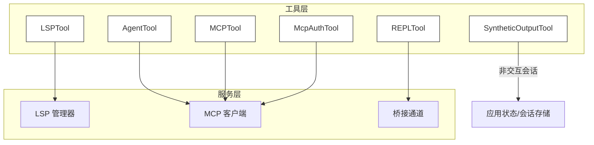
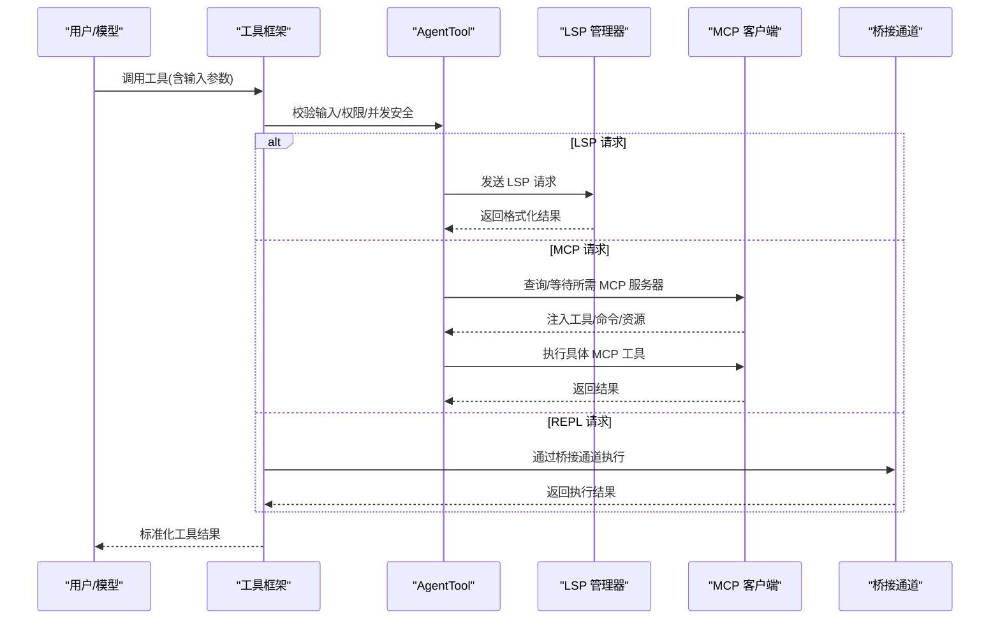
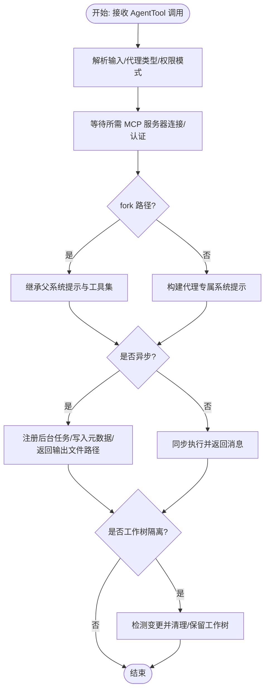
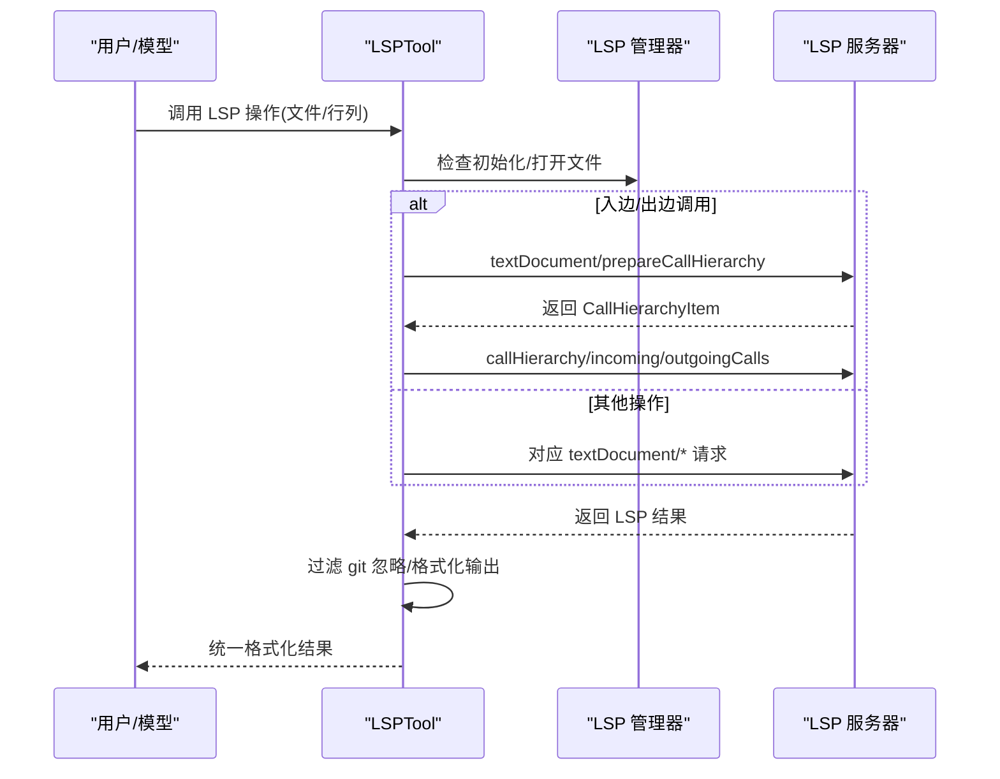
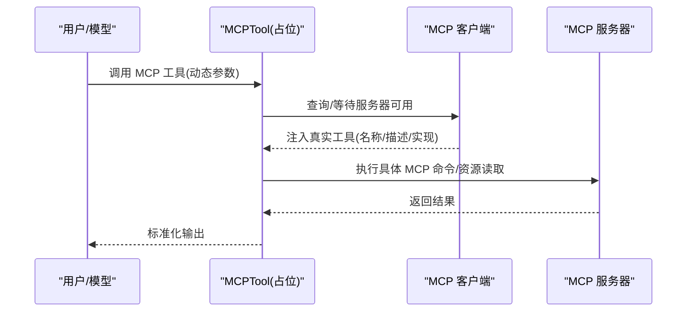
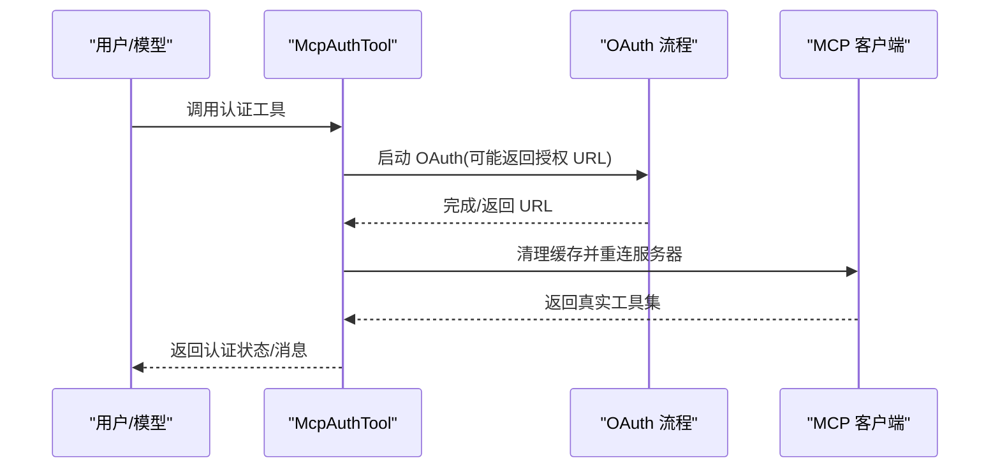
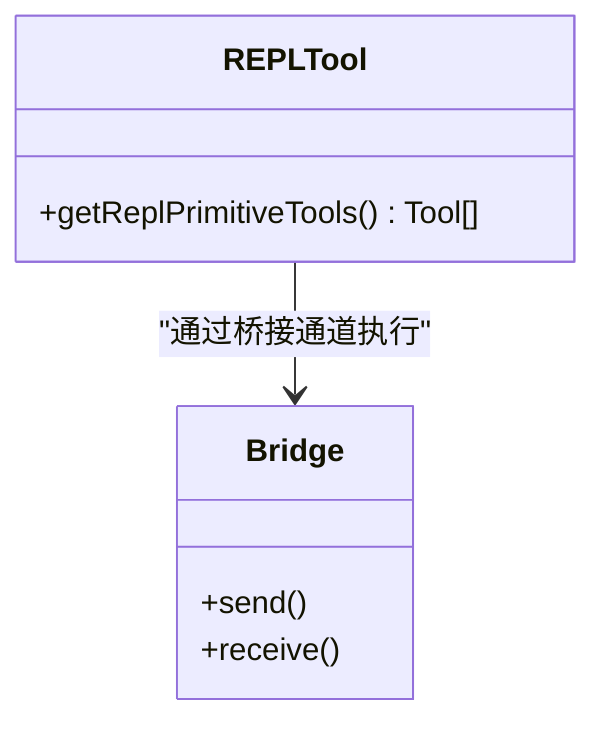
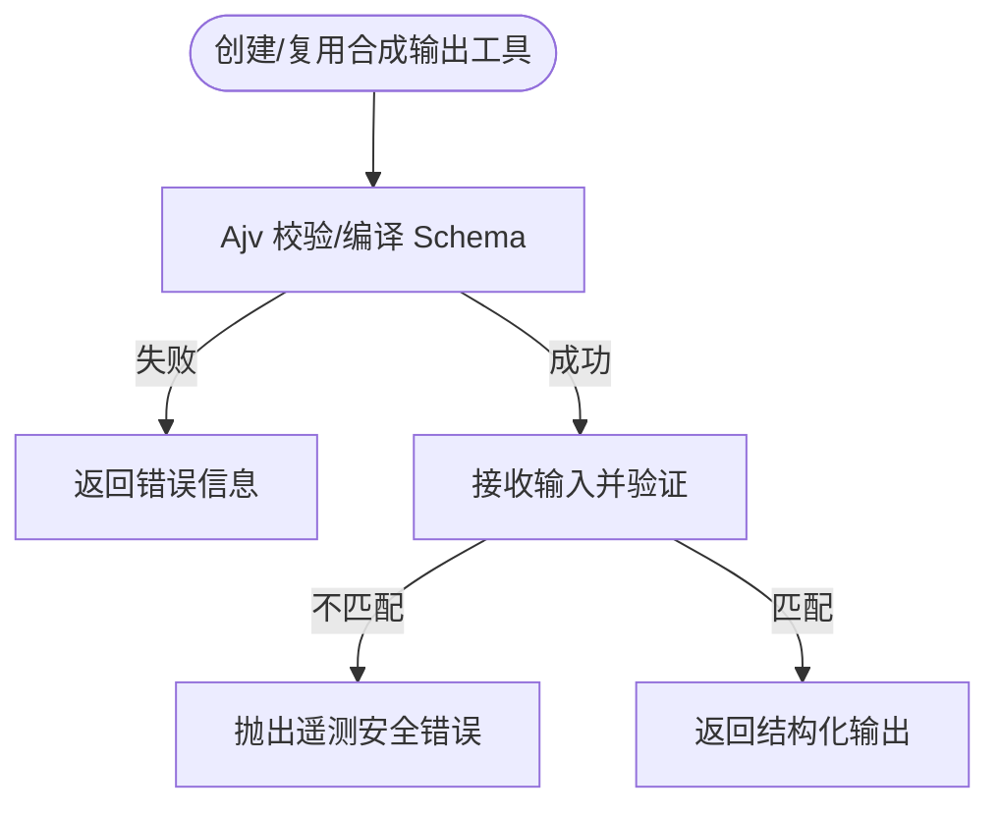
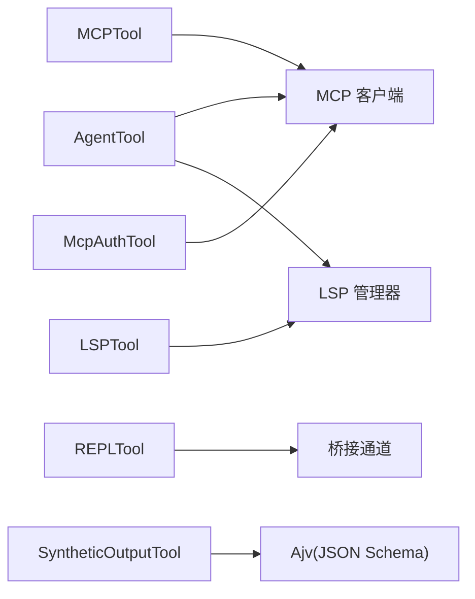

# 专用工具

<cite>
**本文引用的文件**
- [AgentTool.tsx](file://src/tools/AgentTool/AgentTool.tsx)
- [LSPTool.ts](file://src/tools/LSPTool/LSPTool.ts)
- [MCPTool.ts](file://src/tools/MCPTool/MCPTool.ts)
- [McpAuthTool.ts](file://src/tools/McpAuthTool/McpAuthTool.ts)
- [primitiveTools.ts](file://src/tools/REPLTool/primitiveTools.ts)
- [SyntheticOutputTool.ts](file://src/tools/SyntheticOutputTool/SyntheticOutputTool.ts)
- [manager.js](file://src/services/lsp/manager.js)
- [mcpClient.ts](file://src/services/mcp/client.ts)
- [mcpSkills.js](file://skills/mcpSkills.js)
- [bridgeApi.ts](file://src/bridge/bridgeApi.ts)
- [bridgeMain.ts](file://src/bridge/bridgeMain.ts)
- [replBridge.ts](file://src/bridge/replBridge.ts)
- [initReplBridge.ts](file://src/bridge/initReplBridge.ts)
- [replBridgeTransport.ts](file://src/bridge/replBridgeTransport.ts)
- [replBridgeHandle.ts](file://src/bridge/replBridgeHandle.ts)
- [types.ts](file://src/bridge/types.ts)
- [bridgeConfig.ts](file://src/bridge/bridgeConfig.ts)
- [bridgeMessaging.ts](file://src/bridge/bridgeMessaging.ts)
- [bridgeEnabled.ts](file://src/bridge/bridgeEnabled.ts)
- [bridgePointer.ts](file://src/bridge/bridgePointer.ts)
- [bridgeStatusUtil.ts](file://src/bridge/bridgeStatusUtil.ts)
- [bridgeUI.ts](file://src/bridge/bridgeUI.ts)
- [bridgeDebug.ts](file://src/bridge/bridgeDebug.ts)
- [envLessBridgeConfig.ts](file://src/bridge/envLessBridgeConfig.ts)
- [flushGate.ts](file://src/bridge/flushGate.ts)
- [inboundAttachments.ts](file://src/bridge/inboundAttachments.ts)
- [inboundMessages.ts](file://src/bridge/inboundMessages.ts)
- [pollConfig.ts](file://src/bridge/pollConfig.ts)
- [pollConfigDefaults.ts](file://src/bridge/pollConfigDefaults.ts)
- [remoteBridgeCore.ts](file://src/bridge/remoteBridgeCore.ts)
- [sessionIdCompat.ts](file://src/bridge/sessionIdCompat.ts)
- [sessionRunner.ts](file://src/bridge/sessionRunner.ts)
- [trustedDevice.ts](file://src/bridge/trustedDevice.ts)
- [workSecret.ts](file://src/bridge/workSecret.ts)
- [bridgePermissionCallbacks.ts](file://src/bridge/bridgePermissionCallbacks.ts)
- [bridgePointer.ts](file://src/bridge/bridgePointer.ts)
- [bridgeStatusUtil.ts](file://src/bridge/bridgeStatusUtil.ts)
- [bridgeUI.ts](file://src/bridge/bridgeUI.ts)
- [bridgeDebug.ts](file://src/bridge/bridgeDebug.ts)
- [envLessBridgeConfig.ts](file://src/bridge/envLessBridgeConfig.ts)
- [flushGate.ts](file://src/bridge/flushGate.ts)
- [inboundAttachments.ts](file://src/bridge/inboundAttachments.ts)
- [inboundMessages.ts](file://src/bridge/inboundMessages.ts)
- [pollConfig.ts](file://src/bridge/pollConfig.ts)
- [pollConfigDefaults.ts](file://src/bridge/pollConfigDefaults.ts)
- [remoteBridgeCore.ts](file://src/bridge/remoteBridgeCore.ts)
- [sessionIdCompat.ts](file://src/bridge/sessionIdCompat.ts)
- [sessionRunner.ts](file://src/bridge/sessionRunner.ts)
- [trustedDevice.ts](file://src/bridge/trustedDevice.ts)
- [workSecret.ts](file://src/bridge/workSecret.ts)
- [bridgePermissionCallbacks.ts](file://src/bridge/bridgePermissionCallbacks.ts)
</cite>

## 目录
1. [简介](#简介)
2. [项目结构](#项目结构)
3. [核心组件](#核心组件)
4. [架构总览](#架构总览)
5. [详细组件分析](#详细组件分析)
6. [依赖分析](#依赖分析)
7. [性能考虑](#性能考虑)
8. [故障排查指南](#故障排查指南)
9. [结论](#结论)
10. [附录](#附录)

## 简介
本文件为专用工具的深度技术文档，聚焦以下专业工具：AgentTool（AI代理工具）、LSPTool（语言服务器协议工具）、MCPTool（模型上下文协议工具）、McpAuthTool（MCP认证工具）、REPLTool（交互式解释器）和 SyntheticOutputTool（合成输出工具）。文档从系统架构、组件关系、数据流、处理逻辑、集成点、错误处理与性能特性等方面进行深入剖析，并提供使用示例、集成方案、扩展开发与故障诊断的专业指导。

## 项目结构
专用工具位于 src/tools 下，围绕“工具即服务”的理念构建，每个工具通过统一的工具框架注册、校验输入、执行权限检查、调用后端服务或本地能力，并以标准化输出返回。与之配套的服务层（如 LSP 管理器、MCP 客户端、桥接通道）在 src/services 和 src/bridge 中实现。

**图表来源**
- [AgentTool.tsx:196-800](file://src/tools/AgentTool/AgentTool.tsx#L196-L800)
- [LSPTool.ts:127-422](file://src/tools/LSPTool/LSPTool.ts#L127-L422)
- [MCPTool.ts:27-77](file://src/tools/MCPTool/MCPTool.ts#L27-L77)
- [McpAuthTool.ts:49-214](file://src/tools/McpAuthTool/McpAuthTool.ts#L49-L214)
- [primitiveTools.ts:28-39](file://src/tools/REPLTool/primitiveTools.ts#L28-L39)

**章节来源**
- [AgentTool.tsx:1-1398](file://src/tools/AgentTool/AgentTool.tsx#L1-L1398)
- [LSPTool.ts:1-861](file://src/tools/LSPTool/LSPTool.ts#L1-L861)
- [MCPTool.ts:1-78](file://src/tools/MCPTool/MCPTool.ts#L1-L78)
- [McpAuthTool.ts:1-216](file://src/tools/McpAuthTool/McpAuthTool.ts#L1-L216)
- [primitiveTools.ts:1-40](file://src/tools/REPLTool/primitiveTools.ts#L1-L40)
- [SyntheticOutputTool.ts:1-164](file://src/tools/SyntheticOutputTool/SyntheticOutputTool.ts#L1-L164)

## 核心组件
- AgentTool：子代理编排与生命周期管理，支持工作树隔离、远程执行、后台任务、多智能体团队协作、权限模式与进度追踪。
- LSPTool：基于 LSP 的代码智能工具，支持跳转定义、引用查找、悬停信息、文档符号、工作区符号、调用层次等。
- MCPTool：MCP 协议的通用入口，动态代理具体 MCP 工具，负责权限与 UI 渲染。
- McpAuthTool：为未认证的 MCP 服务器生成认证伪工具，触发 OAuth 流程并在完成后自动替换为真实工具集。
- REPLTool：REPL 模式下的原语工具集合，隐藏部分工具但保留其在虚拟机上下文中的可访问性。
- SyntheticOutputTool：面向非交互会话的结构化输出工具，按传入 JSON Schema 验证并返回结构化结果。

**章节来源**
- [AgentTool.tsx:196-800](file://src/tools/AgentTool/AgentTool.tsx#L196-L800)
- [LSPTool.ts:127-422](file://src/tools/LSPTool/LSPTool.ts#L127-L422)
- [MCPTool.ts:27-77](file://src/tools/MCPTool/MCPTool.ts#L27-L77)
- [McpAuthTool.ts:49-214](file://src/tools/McpAuthTool/McpAuthTool.ts#L49-L214)
- [primitiveTools.ts:28-39](file://src/tools/REPLTool/primitiveTools.ts#L28-L39)
- [SyntheticOutputTool.ts:28-101](file://src/tools/SyntheticOutputTool/SyntheticOutputTool.ts#L28-L101)

## 架构总览
专用工具与服务层之间通过统一的工具框架解耦，工具仅负责输入校验、权限与 UI，具体执行委托给服务层。桥接通道为 REPL 提供跨进程/远程通信能力；MCP 客户端负责 MCP 服务器发现、认证、工具列表与命令资源的动态注入。

**图表来源**
- [AgentTool.tsx:239-800](file://src/tools/AgentTool/AgentTool.tsx#L239-L800)
- [LSPTool.ts:224-414](file://src/tools/LSPTool/LSPTool.ts#L224-L414)
- [manager.js](file://src/services/lsp/manager.js)
- [mcpClient.ts](file://src/services/mcp/client.ts)
- [bridgeApi.ts](file://src/bridge/bridgeApi.ts)

## 详细组件分析

### AgentTool（AI代理工具）
- 功能特性
  - 子代理编排：支持内置/自定义代理类型、权限模式、模型选择、描述与提示注入。
  - 生命周期管理：同步/异步执行、后台任务注册、进度追踪、摘要生成、元数据写入。
  - 隔离与工作树：可选工作树隔离，自动检测变更并清理；支持远程隔离（受特性门控）。
  - 多智能体团队：支持团队名、成员命名、计划模式要求、tmux 分屏显示。
  - 权限与 MCP：根据 MCP 服务器可用性与认证状态过滤代理；等待连接完成避免竞态。
- 关键流程
  - 输入校验与 schema 动态裁剪（按特性门控移除可选字段）。
  - 解析代理类型与权限模式，过滤被拒绝的代理。
  - 等待所需 MCP 服务器连接/认证，确保工具可用。
  - 选择 fork 或常规路径：fork 路径继承父系统提示与工具集，常规路径构建代理专属系统提示。
  - 同步/异步执行：异步时注册后台任务并返回输出文件路径；同步时直接返回消息。
  - 工作树清理：无变更则删除，有变更则保留以便后续恢复。
- 使用场景
  - 自动化代码审查、重构建议、缺陷修复、文档生成。
  - 团队协作中的任务委派与进度可视化。
  - 远程环境下的隔离执行与审计。

**图表来源**
- [AgentTool.tsx:239-800](file://src/tools/AgentTool/AgentTool.tsx#L239-L800)

**章节来源**
- [AgentTool.tsx:196-800](file://src/tools/AgentTool/AgentTool.tsx#L196-L800)

### LSPTool（语言服务器协议工具）
- 功能特性
  - 支持操作：跳转定义、查找引用、悬停信息、文档符号、工作区符号、实现跳转、调用层次准备、入边/出边调用。
  - 文件安全：UNC 路径安全跳过；大文件限制；git 忽略过滤；URI 解码与路径转换。
  - 结果格式化：针对不同操作输出统一格式字符串，统计结果数量与文件数量。
  - 并发安全：标记为并发安全；延迟渲染以提升响应。
- 关键流程
  - 初始化状态检查：若仍在初始化中则等待完成。
  - 文件打开：若未打开则读取内容并 open 到 LSP 服务器。
  - 特殊调用层次：入边/出边调用需先 prepareCallHierarchy 再请求。
  - git 忽略过滤：批量调用 git check-ignore 过滤结果。
  - 错误处理：捕获异常并返回可读错误信息。
- 使用场景
  - 编辑器内快速定位符号、查看类型信息、重构导航。
  - 代码检索与依赖分析。

**图表来源**
- [LSPTool.ts:224-414](file://src/tools/LSPTool/LSPTool.ts#L224-L414)
- [manager.js](file://src/services/lsp/manager.js)

**章节来源**
- [LSPTool.ts:127-422](file://src/tools/LSPTool/LSPTool.ts#L127-L422)

### MCPTool（模型上下文协议工具）
- 功能特性
  - 通用入口：作为 MCP 工具的占位符，名称与描述由 MCP 客户端动态覆盖。
  - 权限策略：采用“透传”策略，具体权限由 MCP 服务器自身控制。
  - UI 渲染：提供工具使用、进度与结果的标准渲染接口。
  - 截断检测：对输出进行行截断检测，便于 UI 展示。
- 集成方式
  - MCP 客户端在运行时根据服务器动态生成具体工具，替换 MCPTool 的名称、描述与 call 实现。
  - 工具池按前缀 mcp__<server>__* 注入，认证完成后自动替换伪工具。
- 使用场景
  - 任意 MCP 服务器的统一入口，屏蔽底层差异。

**图表来源**
- [MCPTool.ts:27-77](file://src/tools/MCPTool/MCPTool.ts#L27-L77)
- [mcpClient.ts](file://src/services/mcp/client.ts)

**章节来源**
- [MCPTool.ts:1-78](file://src/tools/MCPTool/MCPTool.ts#L1-L78)

### McpAuthTool（MCP 认证工具）
- 功能特性
  - 伪工具：为未认证的 MCP 服务器生成认证入口，描述与名称包含服务器信息。
  - OAuth 触发：支持 SSE/HTTP 传输的 OAuth 流程，返回授权 URL 或静默完成。
  - 自动替换：OAuth 成功后清理缓存并重新连接，以真实工具集替换伪工具。
- 使用场景
  - 用户在模型侧发起认证，无需手动进入 /mcp 页面即可启动流程。

**图表来源**
- [McpAuthTool.ts:85-206](file://src/tools/McpAuthTool/McpAuthTool.ts#L85-L206)
- [mcpClient.ts](file://src/services/mcp/client.ts)

**章节来源**
- [McpAuthTool.ts:49-214](file://src/tools/McpAuthTool/McpAuthTool.ts#L49-L214)

### REPLTool（交互式解释器）
- 功能特性
  - 原语工具集合：在 REPL 模式下隐藏部分工具，但这些工具仍可在虚拟机上下文中使用，用于内部消息分类与渲染。
  - 与桥接通道：REPL 通过桥接通道与远端/本地环境交互，支持终端/TTY 场景。
- 使用场景
  - 在 REPL 中进行脚本化探索、文件操作、编辑与搜索等。

**图表来源**
- [primitiveTools.ts:28-39](file://src/tools/REPLTool/primitiveTools.ts#L28-L39)
- [bridgeApi.ts](file://src/bridge/bridgeApi.ts)

**章节来源**
- [primitiveTools.ts:1-40](file://src/tools/REPLTool/primitiveTools.ts#L1-L40)

### SyntheticOutputTool（合成输出工具）
- 功能特性
  - 非交互会话专用：仅在非交互会话中启用，用于最终结构化输出。
  - 动态 JSON Schema：按传入 Schema 编译并验证输出，失败时抛出遥测安全错误。
  - 缓存优化：对相同 Schema 的工具创建进行弱引用缓存，降低 Ajv 编译开销。
- 使用场景
  - SDK/CLI 场景下的结构化报告、工单、测试结果等。

**图表来源**
- [SyntheticOutputTool.ts:116-163](file://src/tools/SyntheticOutputTool/SyntheticOutputTool.ts#L116-L163)

**章节来源**
- [SyntheticOutputTool.ts:28-101](file://src/tools/SyntheticOutputTool/SyntheticOutputTool.ts#L28-L101)

## 依赖分析
- 工具到服务层
  - AgentTool 依赖 MCP 客户端与任务系统，以及 LSP 管理器（在 fork 路径中）。
  - LSPTool 依赖 LSP 管理器与文件系统权限检查。
  - MCPTool/McpAuthTool 依赖 MCP 客户端与认证流程。
  - REPLTool 依赖桥接通道与原语工具集合。
  - SyntheticOutputTool 依赖应用状态与 JSON Schema 验证。
- 组件耦合与内聚
  - 工具层通过统一框架保持高内聚、低耦合；服务层通过客户端/管理器抽象对外暴露。
  - 桥接通道与 MCP 客户端存在运行时动态替换，避免静态循环依赖。
- 外部依赖与集成点
  - LSPTool 与文件系统、git 命令集成；MCPTool 与各类 MCP 服务器集成；REPLTool 与终端/TTY 集成。

**图表来源**
- [AgentTool.tsx:1-1398](file://src/tools/AgentTool/AgentTool.tsx#L1-L1398)
- [LSPTool.ts:1-861](file://src/tools/LSPTool/LSPTool.ts#L1-L861)
- [MCPTool.ts:1-78](file://src/tools/MCPTool/MCPTool.ts#L1-L78)
- [McpAuthTool.ts:1-216](file://src/tools/McpAuthTool/McpAuthTool.ts#L1-L216)
- [primitiveTools.ts:1-40](file://src/tools/REPLTool/primitiveTools.ts#L1-L40)
- [SyntheticOutputTool.ts:1-164](file://src/tools/SyntheticOutputTool/SyntheticOutputTool.ts#L1-L164)

**章节来源**
- [AgentTool.tsx:1-1398](file://src/tools/AgentTool/AgentTool.tsx#L1-L1398)
- [LSPTool.ts:1-861](file://src/tools/LSPTool/LSPTool.ts#L1-L861)
- [MCPTool.ts:1-78](file://src/tools/MCPTool/MCPTool.ts#L1-L78)
- [McpAuthTool.ts:1-216](file://src/tools/McpAuthTool/McpAuthTool.ts#L1-L216)
- [primitiveTools.ts:1-40](file://src/tools/REPLTool/primitiveTools.ts#L1-L40)
- [SyntheticOutputTool.ts:1-164](file://src/tools/SyntheticOutputTool/SyntheticOutputTool.ts#L1-L164)

## 性能考虑
- LSPTool
  - 大文件限制与文件打开策略减少不必要的 I/O。
  - git 忽略过滤采用批处理命令，降低多次外部调用开销。
- AgentTool
  - 异步执行避免阻塞主回合并提升吞吐；工作树变更检测避免无意义清理。
  - schema 动态裁剪与死代码消除减少运行时负担。
- MCPTool/McpAuthTool
  - 工具名称/描述动态覆盖减少重复实现；OAuth 成功后自动替换伪工具，避免重复尝试。
- SyntheticOutputTool
  - Ajv 编译结果弱引用缓存显著降低重复工作负载。
- REPLTool
  - 原语工具延迟初始化避免 TDZ 与循环依赖。

[本节为通用性能讨论，不直接分析特定文件]

## 故障排查指南
- LSPTool
  - 症状：返回“无可用 LSP 服务器”或“文件过大”。
  - 排查：确认文件已打开、大小未超过限制；检查文件类型是否有对应 LSP；查看 git 忽略过滤是否误删结果。
- AgentTool
  - 症状：MCP 服务器未就绪导致代理无法启动。
  - 排查：等待所需服务器连接/认证完成；检查服务器列表与工具可用性；查看后台任务输出文件。
- MCPTool/McpAuthTool
  - 症状：OAuth 无法启动或工具未替换。
  - 排查：确认传输类型支持 OAuth；检查浏览器回调与缓存清理；观察工具池前缀替换。
- REPLTool
  - 症状：REPL 中某些工具不可见但功能仍可用。
  - 排查：确认 REPL 模式下的工具隐藏策略；检查桥接通道状态与权限。
- SyntheticOutputTool
  - 症状：输出不符合 Schema 报错。
  - 排查：核对输入结构与 Schema；查看缓存是否命中；检查 Ajv 错误详情。

**章节来源**
- [LSPTool.ts:224-414](file://src/tools/LSPTool/LSPTool.ts#L224-L414)
- [AgentTool.tsx:370-410](file://src/tools/AgentTool/AgentTool.tsx#L370-L410)
- [McpAuthTool.ts:174-206](file://src/tools/McpAuthTool/McpAuthTool.ts#L174-L206)
- [primitiveTools.ts:28-39](file://src/tools/REPLTool/primitiveTools.ts#L28-L39)
- [SyntheticOutputTool.ts:142-157](file://src/tools/SyntheticOutputTool/SyntheticOutputTool.ts#L142-L157)

## 结论
专用工具通过统一框架实现了对复杂后端能力（LSP、MCP、桥接通道、任务系统）的抽象与封装，既保证了易用性，又兼顾了安全性与性能。AgentTool 作为中枢协调者，LSPTool/MCPTool/McpAuthTool 提供代码智能与外部生态接入，REPLTool 与 SyntheticOutputTool 则分别满足交互式探索与结构化输出需求。建议在生产环境中结合特性门控、权限策略与监控告警，持续优化工具链的稳定性与可观测性。

[本节为总结性内容，不直接分析特定文件]

## 附录
- 集成方案
  - LSP：在 IDE/编辑器中启用 LSPTool，结合 git 忽略配置与大文件策略。
  - MCP：通过 /mcp 配置服务器，使用 McpAuthTool 启动认证，随后由 MCPTool 动态代理具体工具。
  - Agent：根据任务类型选择内置/自定义代理，必要时开启工作树隔离与远程执行。
  - REPL：在 REPL 模式下使用原语工具集合，通过桥接通道与远端环境交互。
  - SyntheticOutput：在非交互会话中按需创建带 Schema 的合成输出工具，确保最终输出结构一致。
- 扩展开发
  - 新增工具：遵循工具框架，提供输入/输出 schema、权限检查与 UI 渲染。
  - 新增 MCP 服务器：实现工具/命令/资源清单，由 MCP 客户端自动注入。
  - 新增 LSP 语言：确保 LSP 服务器支持所需方法，配合 LSPTool 的格式化与过滤逻辑。
- 最佳实践
  - 使用特性门控与权限模式控制工具可见性与行为。
  - 对大负载操作（如批量 git 检查）采用批处理与超时控制。
  - 在异步执行场景中提供进度反馈与摘要生成，提升用户体验。

[本节为通用指导，不直接分析特定文件]