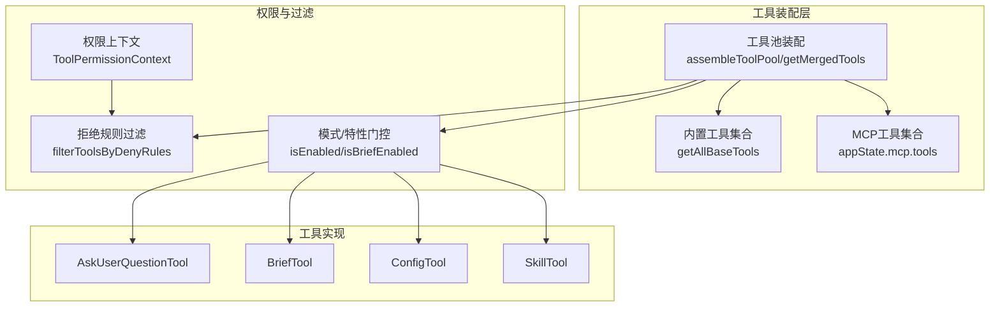
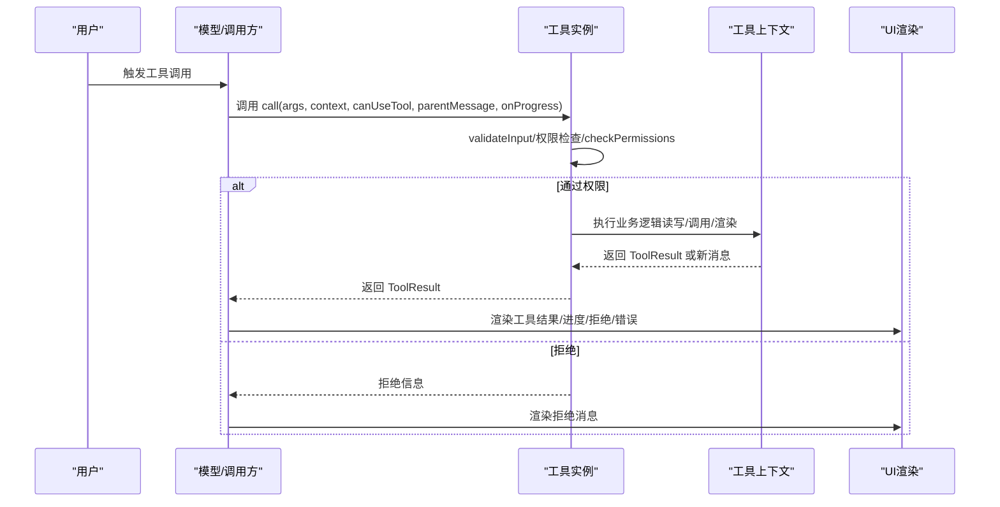
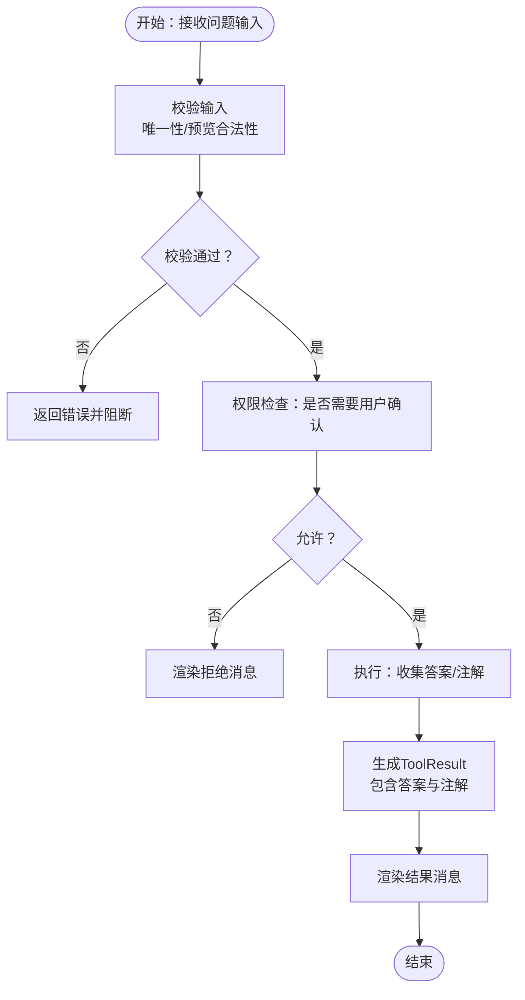
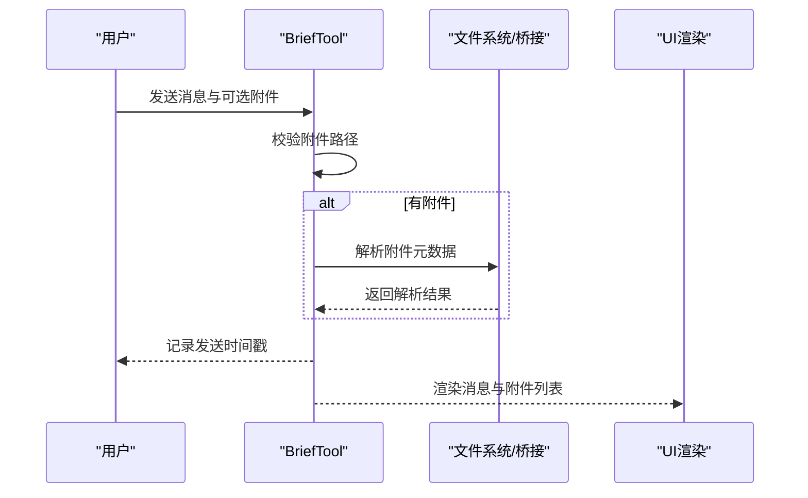
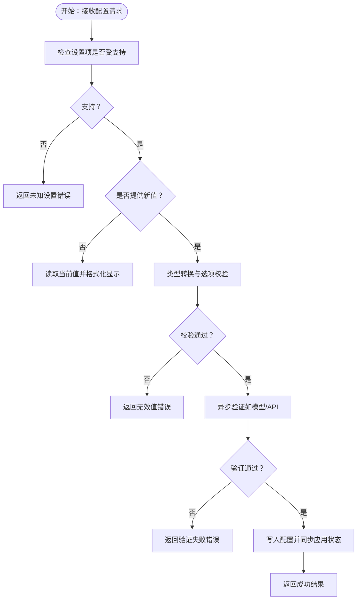
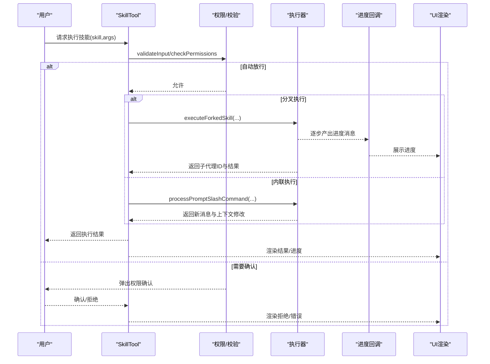
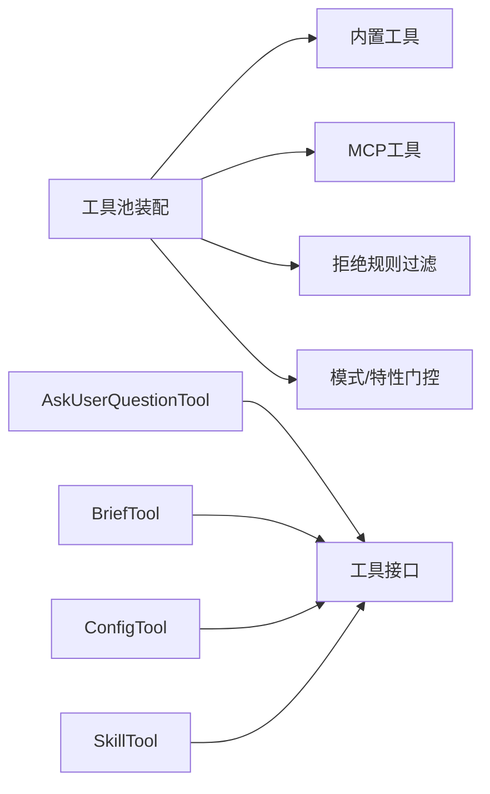

# 交互式工具

<cite>
**本文档引用的文件**
- [src/tools.ts](file://src/tools.ts)
- [src/Tool.ts](file://src/Tool.ts)
- [src/tools/AskUserQuestionTool/AskUserQuestionTool.tsx](file://src/tools/AskUserQuestionTool/AskUserQuestionTool.tsx)
- [src/tools/AskUserQuestionTool/prompt.ts](file://src/tools/AskUserQuestionTool/prompt.ts)
- [src/tools/BriefTool/BriefTool.ts](file://src/tools/BriefTool/BriefTool.ts)
- [src/tools/BriefTool/UI.tsx](file://src/tools/BriefTool/UI.tsx)
- [src/tools/ConfigTool/ConfigTool.ts](file://src/tools/ConfigTool/ConfigTool.ts)
- [src/tools/ConfigTool/UI.tsx](file://src/tools/ConfigTool/UI.tsx)
- [src/tools/ConfigTool/constants.ts](file://src/tools/ConfigTool/constants.ts)
- [src/tools/SkillTool/SkillTool.ts](file://src/tools/SkillTool/SkillTool.ts)
- [src/tools/SkillTool/UI.tsx](file://src/tools/SkillTool/UI.tsx)
- [src/tools/SkillTool/constants.ts](file://src/tools/SkillTool/constants.ts)
</cite>

## 目录
1. [简介](#简介)
2. [项目结构](#项目结构)
3. [核心组件](#核心组件)
4. [架构总览](#架构总览)
5. [详细组件分析](#详细组件分析)
6. [依赖关系分析](#依赖关系分析)
7. [性能考量](#性能考量)
8. [故障排查指南](#故障排查指南)
9. [结论](#结论)
10. [附录](#附录)

## 简介
本指南聚焦于交互式工具的设计与实现，围绕以下四类工具展开：AskUserQuestionTool（用户问答）、BriefTool（摘要生成）、ConfigTool（配置管理）与SkillTool（技能调用）。文档从系统架构、组件关系、数据流与处理逻辑入手，深入解析用户输入处理、上下文保持、状态管理与响应格式化等关键机制，并提供丰富的交互场景示例与最佳实践建议，帮助开发者与使用者高效、安全地构建与使用交互式工具。

## 项目结构
交互式工具在系统中以“工具”为单位进行组织，统一遵循工具接口规范，通过工具池装配与权限控制实现可扩展、可治理的交互能力。核心要点：
- 工具注册与装配：工具清单由工具池函数统一装配，支持内置工具与MCP工具合并去重。
- 权限与可见性：工具启用受运行时环境与权限规则双重约束，确保安全可控。
- UI渲染与进度：每个工具提供独立的消息渲染与进度展示，保证交互体验一致且可追踪。

图表来源
- [src/tools.ts:193-251](file://src/tools.ts#L193-L251)
- [src/tools.ts:345-367](file://src/tools.ts#L345-L367)
- [src/Tool.ts:123-148](file://src/Tool.ts#L123-L148)

章节来源
- [src/tools.ts:193-251](file://src/tools.ts#L193-L251)
- [src/tools.ts:345-367](file://src/tools.ts#L345-L367)
- [src/Tool.ts:123-148](file://src/Tool.ts#L123-L148)

## 核心组件
本节概述四大交互式工具的核心职责与通用接口能力：
- AskUserQuestionTool：面向用户的选择题问答，支持单选/多选、选项预览、注释标注与权限拦截。
- BriefTool：向用户发送消息与附件，支持主动/正常两类消息，具备附件解析与渲染。
- ConfigTool：读取/设置全局或用户设置项，支持类型校验、选项限制、异步验证与即时UI同步。
- SkillTool：调用“技能”（命令），支持内联执行与子代理分叉执行，具备权限规则匹配与进度展示。

章节来源
- [src/tools/AskUserQuestionTool/AskUserQuestionTool.tsx:109-245](file://src/tools/AskUserQuestionTool/AskUserQuestionTool.tsx#L109-L245)
- [src/tools/BriefTool/BriefTool.ts:136-204](file://src/tools/BriefTool/BriefTool.ts#L136-L204)
- [src/tools/ConfigTool/ConfigTool.ts:67-434](file://src/tools/ConfigTool/ConfigTool.ts#L67-L434)
- [src/tools/SkillTool/SkillTool.ts:331-800](file://src/tools/SkillTool/SkillTool.ts#L331-L800)

## 架构总览
交互式工具的运行链路包括：工具选择与装配、权限决策、输入校验、执行与结果渲染、进度与错误处理。下图展示了工具调用到消息渲染的关键路径：

图表来源
- [src/Tool.ts:379-385](file://src/Tool.ts#L379-L385)
- [src/Tool.ts:566-580](file://src/Tool.ts#L566-L580)
- [src/Tool.ts:625-634](file://src/Tool.ts#L625-L634)

章节来源
- [src/Tool.ts:379-385](file://src/Tool.ts#L379-L385)
- [src/Tool.ts:566-580](file://src/Tool.ts#L566-L580)
- [src/Tool.ts:625-634](file://src/Tool.ts#L625-L634)

## 详细组件分析

### AskUserQuestionTool（用户问答）
- 用户输入处理
  - 支持多问题、每问题2-4个选项；可启用多选；支持选项预览（HTML/Markdown片段）。
  - 输入校验包含唯一性约束（问题文本与选项标签唯一）、预览内容合法性（HTML片段禁止完整文档标签、脚本样式标签等）。
- 上下文与状态
  - 在特定渠道环境下禁用（避免无键盘交互），通过特性门控与通道检测决定是否可用。
  - 结果输出包含问题列表、用户答案与可选注解（如预览选择与自由笔记）。
- 响应格式化
  - 渲染为简洁的结果消息，便于后续继续对话。
- 交互场景示例
  - 场景1：在计划模式前收集偏好，引导用户在多个实现方案中做出选择。
  - 场景2：对复杂变更提供可视化对比（预览），辅助用户快速决策。
- 最佳实践
  - 预览仅用于需要视觉比较的场景；简单偏好问题无需预览。
  - 选项描述需清晰说明影响与权衡，帮助用户理解选择后果。

图表来源
- [src/tools/AskUserQuestionTool/AskUserQuestionTool.tsx:158-181](file://src/tools/AskUserQuestionTool/AskUserQuestionTool.tsx#L158-L181)
- [src/tools/AskUserQuestionTool/AskUserQuestionTool.tsx:182-188](file://src/tools/AskUserQuestionTool/AskUserQuestionTool.tsx#L182-L188)
- [src/tools/AskUserQuestionTool/AskUserQuestionTool.tsx:209-223](file://src/tools/AskUserQuestionTool/AskUserQuestionTool.tsx#L209-L223)
- [src/tools/AskUserQuestionTool/AskUserQuestionTool.tsx:195-199](file://src/tools/AskUserQuestionTool/AskUserQuestionTool.tsx#L195-L199)

章节来源
- [src/tools/AskUserQuestionTool/AskUserQuestionTool.tsx:158-181](file://src/tools/AskUserQuestionTool/AskUserQuestionTool.tsx#L158-L181)
- [src/tools/AskUserQuestionTool/AskUserQuestionTool.tsx:182-188](file://src/tools/AskUserQuestionTool/AskUserQuestionTool.tsx#L182-L188)
- [src/tools/AskUserQuestionTool/AskUserQuestionTool.tsx:209-223](file://src/tools/AskUserQuestionTool/AskUserQuestionTool.tsx#L209-L223)
- [src/tools/AskUserQuestionTool/AskUserQuestionTool.tsx:195-199](file://src/tools/AskUserQuestionTool/AskUserQuestionTool.tsx#L195-L199)
- [src/tools/AskUserQuestionTool/prompt.ts:10-30](file://src/tools/AskUserQuestionTool/prompt.ts#L10-L30)

### BriefTool（摘要生成）
- 用户输入处理
  - 接收消息正文与可选附件路径；附件路径在执行前进行合法性校验。
  - 支持“主动”与“正常”两类消息，前者用于未被请求但需立即呈现的信息。
- 上下文与状态
  - 启用受特性门控与用户显式授权双重控制；支持在会话中记录发送时间戳。
  - 附件解析在执行阶段完成，解析结果作为渲染元数据返回。
- 响应格式化
  - 渲染为带标签的用户消息，支持Markdown与附件列表；在不同视图模式下采用不同的布局风格。
- 交互场景示例
  - 场景1：任务完成时主动通知用户，附带日志或差异文件。
  - 场景2：在用户离线期间发现阻塞问题，立即推送解决方案概要。
- 最佳实践
  - 优先使用简短、明确的摘要；必要时附加文件以便进一步查阅。
  - 主动消息应明确标注触发原因与后续步骤，避免造成干扰。

图表来源
- [src/tools/BriefTool/BriefTool.ts:163-168](file://src/tools/BriefTool/BriefTool.ts#L163-L168)
- [src/tools/BriefTool/BriefTool.ts:186-203](file://src/tools/BriefTool/BriefTool.ts#L186-L203)
- [src/tools/BriefTool/UI.tsx:15-68](file://src/tools/BriefTool/UI.tsx#L15-L68)

章节来源
- [src/tools/BriefTool/BriefTool.ts:163-168](file://src/tools/BriefTool/BriefTool.ts#L163-L168)
- [src/tools/BriefTool/BriefTool.ts:186-203](file://src/tools/BriefTool/BriefTool.ts#L186-L203)
- [src/tools/BriefTool/UI.tsx:15-68](file://src/tools/BriefTool/UI.tsx#L15-L68)

### ConfigTool（配置管理）
- 用户输入处理
  - 支持读取与设置配置项；对布尔值进行字符串到布尔的转换；对枚举型配置进行选项校验。
  - 特殊键值处理（如“默认”）用于恢复平台默认行为，并同步到应用状态。
- 上下文与状态
  - 支持异步验证（如模型可用性检查）；在特定特性开启时进行前置检查（如语音模式）。
  - 写入后同步更新应用状态，确保UI即时生效；记录变更事件用于分析。
- 响应格式化
  - 成功时返回操作类型、键名、旧值/新值；失败时返回错误信息。
- 交互场景示例
  - 场景1：查询当前主题或模型设置，了解当前配置。
  - 场景2：切换模型或主题，观察界面即时变化。
- 最佳实践
  - 对可能产生副作用的配置（如远程控制开关）务必进行权限确认与前置检查。
  - 使用“默认”语义恢复平台默认值，避免误删关键配置。

图表来源
- [src/tools/ConfigTool/ConfigTool.ts:112-130](file://src/tools/ConfigTool/ConfigTool.ts#L112-L130)
- [src/tools/ConfigTool/ConfigTool.ts:146-180](file://src/tools/ConfigTool/ConfigTool.ts#L146-L180)
- [src/tools/ConfigTool/ConfigTool.ts:182-230](file://src/tools/ConfigTool/ConfigTool.ts#L182-L230)
- [src/tools/ConfigTool/ConfigTool.ts:313-411](file://src/tools/ConfigTool/ConfigTool.ts#L313-L411)

章节来源
- [src/tools/ConfigTool/ConfigTool.ts:112-130](file://src/tools/ConfigTool/ConfigTool.ts#L112-L130)
- [src/tools/ConfigTool/ConfigTool.ts:146-180](file://src/tools/ConfigTool/ConfigTool.ts#L146-L180)
- [src/tools/ConfigTool/ConfigTool.ts:182-230](file://src/tools/ConfigTool/ConfigTool.ts#L182-L230)
- [src/tools/ConfigTool/ConfigTool.ts:313-411](file://src/tools/ConfigTool/ConfigTool.ts#L313-L411)
- [src/tools/ConfigTool/UI.tsx:6-37](file://src/tools/ConfigTool/UI.tsx#L6-L37)

### SkillTool（技能调用）
- 用户输入处理
  - 接收技能名称与可选参数；支持去除前导斜杠的兼容处理；远程“规范技能”在实验特性开启时直接加载。
- 上下文与状态
  - 通过权限规则匹配决定是否自动放行；对仅使用“安全属性”的技能自动放行；否则弹出权限确认并提供规则添加建议。
  - 分叉执行：当技能声明为“fork”上下文时，使用子代理隔离执行，避免主流程阻塞。
- 响应格式化
  - 内联执行：返回允许使用的工具列表与模型覆盖信息；分叉执行：返回子代理ID与最终结果文本。
  - 进度消息聚合展示，支持非冗余显示与“更多工具使用”统计。
- 交互场景示例
  - 场景1：在对话中直接调用“提交”技能，查看生成的提交信息与允许的工具列表。
  - 场景2：调用“审查PR”技能，观察其在子代理中的逐步进展与最终结论。
- 最佳实践
  - 对高风险技能（如涉及外部资源或敏感操作）谨慎放行，优先通过权限规则精细化控制。
  - 利用分叉执行承载长耗时或高风险流程，提升整体交互流畅度。

图表来源
- [src/tools/SkillTool/SkillTool.ts:580-632](file://src/tools/SkillTool/SkillTool.ts#L580-L632)
- [src/tools/SkillTool/SkillTool.ts:634-766](file://src/tools/SkillTool/SkillTool.ts#L634-L766)
- [src/tools/SkillTool/UI.tsx:62-93](file://src/tools/SkillTool/UI.tsx#L62-L93)

章节来源
- [src/tools/SkillTool/SkillTool.ts:580-632](file://src/tools/SkillTool/SkillTool.ts#L580-L632)
- [src/tools/SkillTool/SkillTool.ts:634-766](file://src/tools/SkillTool/SkillTool.ts#L634-L766)
- [src/tools/SkillTool/UI.tsx:62-93](file://src/tools/SkillTool/UI.tsx#L62-L93)

## 依赖关系分析
- 工具注册与权限
  - 工具池通过“内置工具 + MCP工具”装配，按名称去重，内置工具优先；同时应用拒绝规则与模式门控。
- 工具接口契约
  - 统一的工具接口定义了输入/输出模式、权限检查、并发安全、只读/破坏性标记、进度与结果渲染等能力。
- 工具间协作
  - SkillTool在执行过程中可能引入新的消息与上下文修改，需与其他工具协同保持一致性。

图表来源
- [src/tools.ts:345-367](file://src/tools.ts#L345-L367)
- [src/tools.ts:262-269](file://src/tools.ts#L262-L269)
- [src/Tool.ts:362-434](file://src/Tool.ts#L362-L434)

章节来源
- [src/tools.ts:345-367](file://src/tools.ts#L345-L367)
- [src/tools.ts:262-269](file://src/tools.ts#L262-L269)
- [src/Tool.ts:362-434](file://src/Tool.ts#L362-L434)

## 性能考量
- 并发与阻塞
  - 工具并发安全策略：部分工具声明为并发安全，减少串行等待；对非并发安全工具采用阻塞策略，避免状态竞争。
- 进度与内存
  - 技能执行采用分叉代理，避免主线程阻塞；及时释放消息与内容缓存，降低内存占用。
- 传输与渲染
  - 工具结果通过统一块参数传递，UI按需渲染；对大结果采用持久化与预览策略，避免一次性渲染过大数据。

章节来源
- [src/Tool.ts:402-416](file://src/Tool.ts#L402-L416)
- [src/tools/SkillTool/SkillTool.ts:285-289](file://src/tools/SkillTool/SkillTool.ts#L285-L289)
- [src/tools/BriefTool/BriefTool.ts:175-183](file://src/tools/BriefTool/BriefTool.ts#L175-L183)

## 故障排查指南
- 权限相关
  - 未知设置/技能：检查设置项是否受支持，或技能是否存在且允许模型调用。
  - 权限拒绝：根据建议添加本地规则或使用前缀通配符放宽权限。
- 输入校验
  - 问答预览不合法：确保预览为HTML片段且不含脚本/样式标签；使用正确的标签包裹内容。
  - 配置值非法：确认布尔值格式（true/false）、枚举值在允许范围内，或满足异步验证条件。
- 执行异常
  - 报错信息包含错误码与具体原因，优先根据错误提示修正输入或环境配置。
  - 技能执行失败：检查技能是否声明为“fork”，必要时改用分叉执行以避免阻塞。

章节来源
- [src/tools/AskUserQuestionTool/AskUserQuestionTool.tsx:158-181](file://src/tools/AskUserQuestionTool/AskUserQuestionTool.tsx#L158-L181)
- [src/tools/ConfigTool/ConfigTool.ts:126-130](file://src/tools/ConfigTool/ConfigTool.ts#L126-L130)
- [src/tools/SkillTool/SkillTool.ts:402-427](file://src/tools/SkillTool/SkillTool.ts#L402-L427)

## 结论
交互式工具通过统一的工具接口与严格的权限控制，实现了可扩展、可审计、可追踪的用户交互能力。AskUserQuestionTool、BriefTool、ConfigTool与SkillTool分别覆盖了“问答收集”、“消息摘要”、“配置管理”与“技能执行”四大核心场景。结合本文提供的流程优化、错误处理与用户反馈机制建议，可在保证安全性的同时显著提升用户体验与开发效率。

## 附录
- 术语
  - 工具：可被模型调用以执行特定任务的模块化单元。
  - 权限上下文：封装权限模式、工作目录、规则集与提示策略的上下文对象。
  - 进度消息：工具执行过程中的中间态消息，用于UI实时反馈。
- 参考文件
  - 工具接口与工具池装配：[src/Tool.ts](file://src/Tool.ts)、[src/tools.ts](file://src/tools.ts)
  - 问答工具：[AskUserQuestionTool 实现](file://src/tools/AskUserQuestionTool/AskUserQuestionTool.tsx)、[提示与描述](file://src/tools/AskUserQuestionTool/prompt.ts)
  - 摘要工具：[BriefTool 实现](file://src/tools/BriefTool/BriefTool.ts)、[UI渲染](file://src/tools/BriefTool/UI.tsx)
  - 配置工具：[ConfigTool 实现](file://src/tools/ConfigTool/ConfigTool.ts)、[UI渲染](file://src/tools/ConfigTool/UI.tsx)、[常量](file://src/tools/ConfigTool/constants.ts)
  - 技能工具：[SkillTool 实现](file://src/tools/SkillTool/SkillTool.ts)、[UI渲染](file://src/tools/SkillTool/UI.tsx)、[常量](file://src/tools/SkillTool/constants.ts)