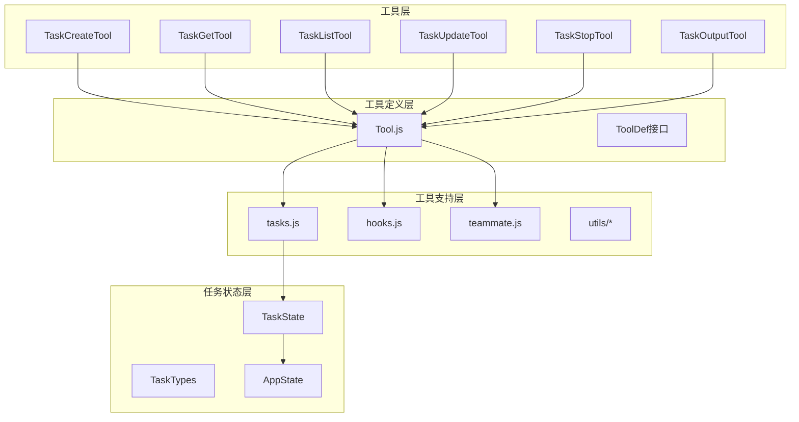
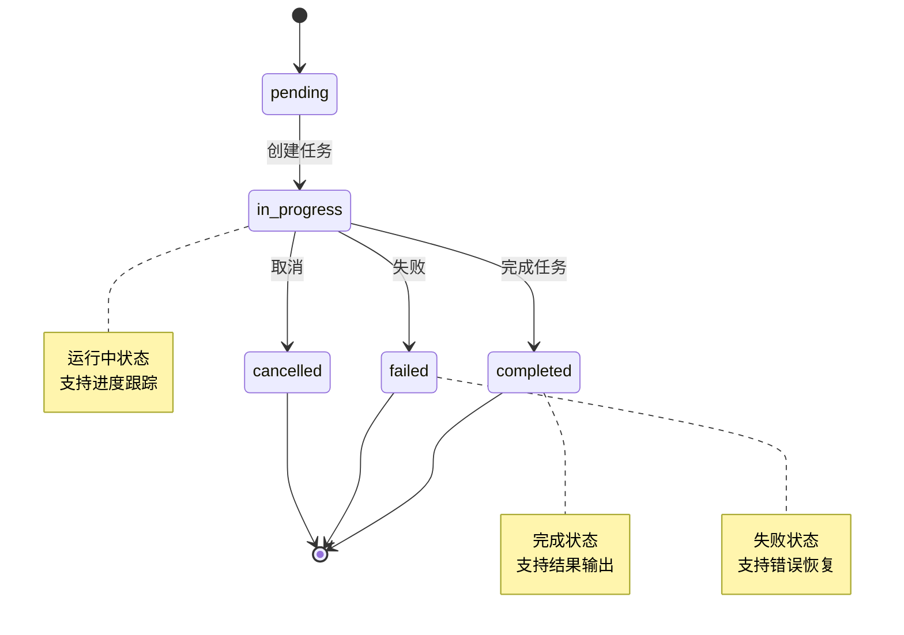
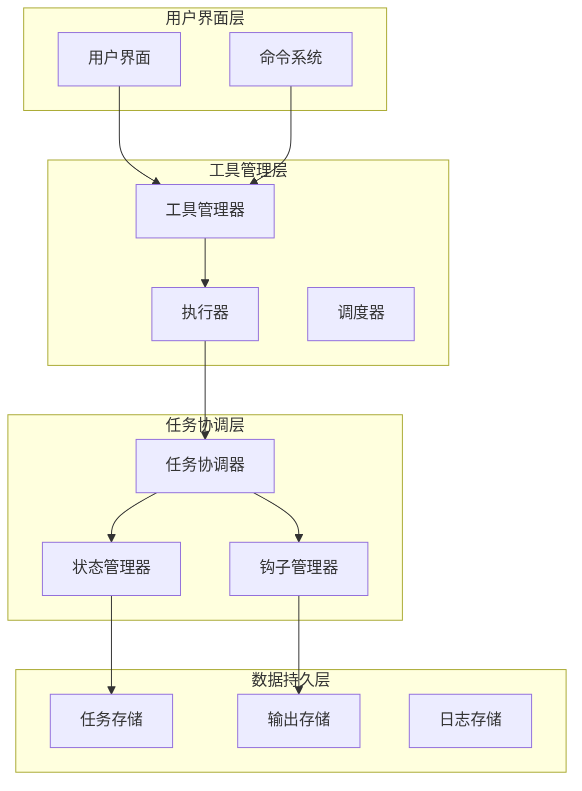
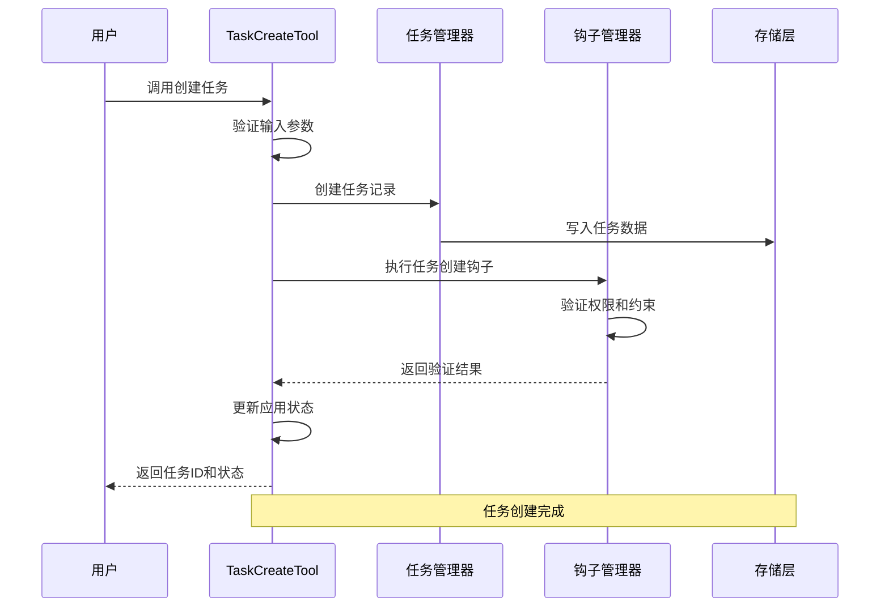
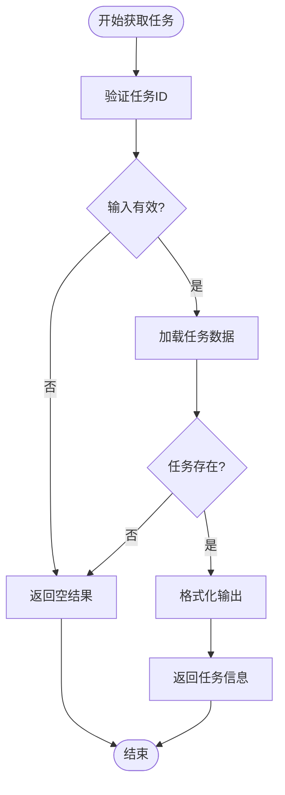
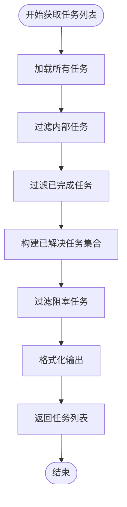
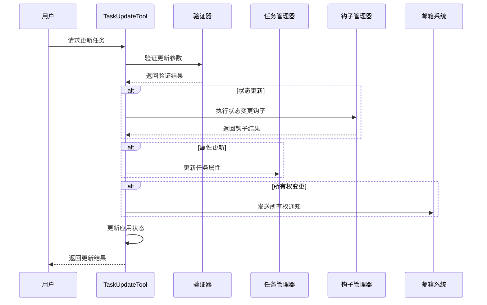
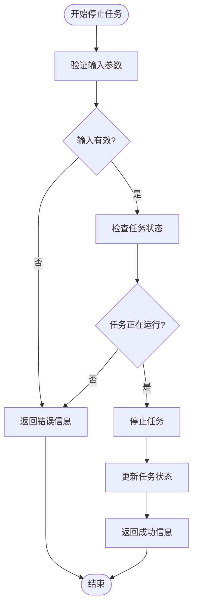
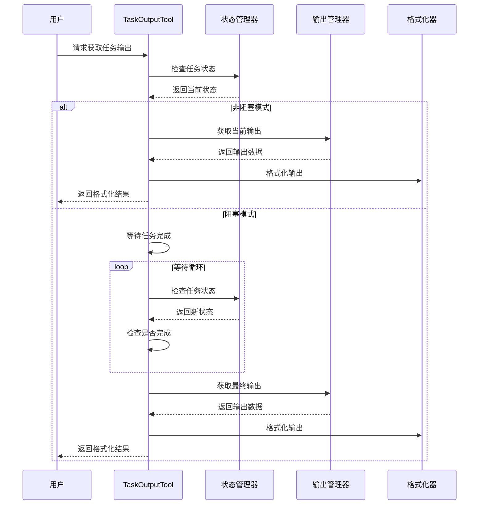
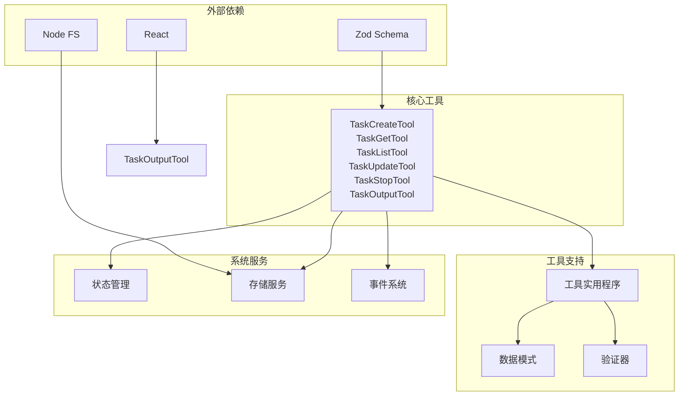

# 任务管理工具

<cite>
**本文档引用的文件**
- [TaskCreateTool.ts](file://src/tools/TaskCreateTool/TaskCreateTool.ts)
- [TaskGetTool.ts](file://src/tools/TaskGetTool/TaskGetTool.ts)
- [TaskListTool.ts](file://src/tools/TaskListTool/TaskListTool.ts)
- [TaskUpdateTool.ts](file://src/tools/TaskUpdateTool/TaskUpdateTool.ts)
- [TaskStopTool.ts](file://src/tools/TaskStopTool/TaskStopTool.ts)
- [TaskOutputTool.tsx](file://src/tools/TaskOutputTool/TaskOutputTool.tsx)
- [tasks.js](file://src/utils/tasks.js)
- [hooks.js](file://src/utils/hooks.js)
- [teammate.js](file://src/utils/teammate.js)
- [stopTask.js](file://src/tasks/stopTask.js)
- [diskOutput.js](file://src/utils/task/diskOutput.js)
- [framework.js](file://src/utils/task/framework.js)
- [outputFormatting.js](file://src/utils/task/outputFormatting.js)
- [messages.js](file://src/utils/messages.js)
- [sleep.js](file://src/utils/sleep.js)
- [semanticBoolean.js](file://src/utils/semanticBoolean.js)
- [lazySchema.js](file://src/utils/lazySchema.js)
- [Tool.js](file://src/Tool.js)
- [Task.ts](file://src/Task.ts)
- [TaskStatusSchema](file://src/utils/tasks.js)
</cite>

## 目录
1. [简介](#简介)
2. [项目结构](#项目结构)
3. [核心组件](#核心组件)
4. [架构概览](#架构概览)
5. [详细组件分析](#详细组件分析)
6. [依赖关系分析](#依赖关系分析)
7. [性能考虑](#性能考虑)
8. [故障排除指南](#故障排除指南)
9. [结论](#结论)
10. [附录](#附录)

## 简介

本文档详细介绍了任务管理工具系统的架构设计和实现原理，涵盖了TaskCreateTool（任务创建）、TaskGetTool（任务获取）、TaskListTool（任务列表）、TaskUpdateTool（任务更新）、TaskStopTool（任务停止）和TaskOutputTool（任务输出）等核心工具。该系统提供了完整的任务生命周期管理、状态跟踪、并发控制和错误恢复机制。

系统采用模块化设计，每个工具都遵循统一的工具接口规范，通过标准化的数据流和状态管理实现任务的全生命周期操作。工具之间通过共享的状态存储和事件机制进行协调，确保任务状态的一致性和可靠性。

## 项目结构

任务管理工具系统位于项目的`src/tools/`目录下，采用按功能分组的组织方式：

**图表来源**
- [TaskCreateTool.ts:1-139](file://src/tools/TaskCreateTool/TaskCreateTool.ts#L1-L139)
- [TaskGetTool.ts:1-129](file://src/tools/TaskGetTool/TaskGetTool.ts#L1-L129)
- [TaskListTool.ts:1-117](file://src/tools/TaskListTool/TaskListTool.ts#L1-L117)
- [TaskUpdateTool.ts:1-407](file://src/tools/TaskUpdateTool/TaskUpdateTool.ts#L1-L407)
- [TaskStopTool.ts:1-132](file://src/tools/TaskStopTool/TaskStopTool.ts#L1-L132)
- [TaskOutputTool.tsx:1-584](file://src/tools/TaskOutputTool/TaskOutputTool.tsx#L1-L584)

**章节来源**
- [TaskCreateTool.ts:1-139](file://src/tools/TaskCreateTool/TaskCreateTool.ts#L1-L139)
- [TaskGetTool.ts:1-129](file://src/tools/TaskGetTool/TaskGetTool.ts#L1-L129)
- [TaskListTool.ts:1-117](file://src/tools/TaskListTool/TaskListTool.ts#L1-L117)
- [TaskUpdateTool.ts:1-407](file://src/tools/TaskUpdateTool/TaskUpdateTool.ts#L1-L407)
- [TaskStopTool.ts:1-132](file://src/tools/TaskStopTool/TaskStopTool.ts#L1-L132)
- [TaskOutputTool.tsx:1-584](file://src/tools/TaskOutputTool/TaskOutputTool.tsx#L1-L584)

## 核心组件

### 工具接口规范

所有任务管理工具都实现了统一的工具接口规范，具备以下核心特性：

- **类型安全**：使用Zod Schema进行输入输出验证
- **并发安全**：标记为并发安全的工具可同时执行多个实例
- **延迟执行**：支持延迟执行以优化性能
- **状态管理**：集成应用状态管理系统

### 任务状态管理

系统维护统一的任务状态模型，支持多种任务状态转换：

**图表来源**
- [TaskStatusSchema](file://src/utils/tasks.js)

**章节来源**
- [TaskCreateTool.ts:48-138](file://src/tools/TaskCreateTool/TaskCreateTool.ts#L48-L138)
- [TaskUpdateTool.ts:88-406](file://src/tools/TaskUpdateTool/TaskUpdateTool.ts#L88-L406)
- [TaskStopTool.ts:39-131](file://src/tools/TaskStopTool/TaskStopTool.ts#L39-L131)

## 架构概览

任务管理工具系统采用分层架构设计，确保各组件职责清晰、耦合度低：

**图表来源**
- [Tool.js](file://src/Tool.js)
- [tasks.js](file://src/utils/tasks.js)
- [hooks.js](file://src/utils/hooks.js)

## 详细组件分析

### TaskCreateTool - 任务创建工具

TaskCreateTool负责创建新的任务，提供完整的任务初始化和验证机制：

**图表来源**
- [TaskCreateTool.ts:80-129](file://src/tools/TaskCreateTool/TaskCreateTool.ts#L80-L129)

#### 核心功能特性

- **输入验证**：使用Zod Schema验证任务参数
- **钩子执行**：自动执行任务创建后的验证钩子
- **状态初始化**：设置任务初始状态为"pending"
- **错误处理**：支持阻塞式错误处理和回滚机制

**章节来源**
- [TaskCreateTool.ts:18-138](file://src/tools/TaskCreateTool/TaskCreateTool.ts#L18-L138)

### TaskGetTool - 任务获取工具

TaskGetTool提供任务信息的查询和检索功能：

**图表来源**
- [TaskGetTool.ts:73-98](file://src/tools/TaskGetTool/TaskGetTool.ts#L73-L98)

#### 查询优化

- **只读访问**：标记为只读工具，避免不必要的写操作
- **缓存机制**：利用应用状态缓存提高查询性能
- **空值处理**：优雅处理不存在的任务查询

**章节来源**
- [TaskGetTool.ts:13-128](file://src/tools/TaskGetTool/TaskGetTool.ts#L13-L128)

### TaskListTool - 任务列表工具

TaskListTool提供任务列表的过滤、排序和展示功能：

**图表来源**
- [TaskListTool.ts:65-90](file://src/tools/TaskListTool/TaskListTool.ts#L65-L90)

#### 列表优化策略

- **智能过滤**：自动过滤内部使用的任务
- **阻塞关系处理**：清理已完成任务的阻塞引用
- **性能优化**：使用Set数据结构提高过滤效率

**章节来源**
- [TaskListTool.ts:13-116](file://src/tools/TaskListTool/TaskListTool.ts#L13-L116)

### TaskUpdateTool - 任务更新工具

TaskUpdateTool提供任务的全方位更新能力，包括状态变更、属性修改和关系管理：

**图表来源**
- [TaskUpdateTool.ts:123-363](file://src/tools/TaskUpdateTool/TaskUpdateTool.ts#L123-L363)

#### 高级功能特性

- **状态验证**：支持复杂的状态转换验证
- **钩子集成**：在关键状态变更时执行验证钩子
- **所有权管理**：自动处理任务所有权转移
- **阻塞关系**：支持任务间的依赖关系管理

**章节来源**
- [TaskUpdateTool.ts:33-406](file://src/tools/TaskUpdateTool/TaskUpdateTool.ts#L33-L406)

### TaskStopTool - 任务停止工具

TaskStopTool提供后台任务的强制停止功能：

**图表来源**
- [TaskStopTool.ts:60-130](file://src/tools/TaskStopTool/TaskStopTool.ts#L60-L130)

#### 停止机制

- **状态检查**：确保只有运行中的任务才能被停止
- **安全停止**：通过AbortController实现安全的任务终止
- **状态同步**：及时更新应用状态中的任务信息

**章节来源**
- [TaskStopTool.ts:10-131](file://src/tools/TaskStopTool/TaskStopTool.ts#L10-L131)

### TaskOutputTool - 任务输出工具

TaskOutputTool提供任务输出的实时获取和格式化显示功能：

**图表来源**
- [TaskOutputTool.tsx:208-282](file://src/tools/TaskOutputTool/TaskOutputTool.tsx#L208-L282)

#### 输出管理特性

- **多任务类型支持**：支持本地Shell、本地Agent和远程Agent任务
- **实时监控**：提供任务执行过程的实时输出监控
- **格式化输出**：根据任务类型提供相应的输出格式化
- **超时处理**：支持超时机制防止无限等待

**章节来源**
- [TaskOutputTool.tsx:30-583](file://src/tools/TaskOutputTool/TaskOutputTool.tsx#L30-L583)

## 依赖关系分析

任务管理工具系统具有清晰的依赖层次结构：

**图表来源**
- [TaskCreateTool.ts:1-16](file://src/tools/TaskCreateTool/TaskCreateTool.ts#L1-L16)
- [TaskOutputTool.tsx:1-29](file://src/tools/TaskOutputTool/TaskOutputTool.tsx#L1-L29)

### 关键依赖关系

- **类型系统依赖**：所有工具都依赖于统一的类型定义
- **状态管理依赖**：工具间通过共享状态进行通信
- **存储抽象依赖**：通过抽象层实现数据持久化
- **钩子系统依赖**：扩展点机制支持功能增强

**章节来源**
- [TaskCreateTool.ts:1-15](file://src/tools/TaskCreateTool/TaskCreateTool.ts#L1-L15)
- [TaskOutputTool.tsx:1-29](file://src/tools/TaskOutputTool/TaskOutputTool.tsx#L1-L29)

## 性能考虑

### 并发控制策略

系统采用多层并发控制机制确保任务执行的安全性：

- **工具级别并发**：标记为并发安全的工具可同时执行
- **任务级别并发**：单个任务的多次操作通过队列管理
- **状态一致性**：通过原子操作保证状态更新的一致性

### 缓存优化

- **状态缓存**：应用状态在内存中缓存减少磁盘访问
- **输出缓存**：任务输出结果缓存提高重复访问性能
- **模式缓存**：Zod Schema模式预编译提升验证性能

### 内存管理

- **垃圾回收**：及时释放已完成任务的内存占用
- **流式处理**：大输出内容采用流式处理避免内存溢出
- **连接池**：数据库和网络连接使用连接池复用

## 故障排除指南

### 常见问题诊断

#### 任务创建失败

**症状**：任务创建后立即失败或无法找到任务

**可能原因**：
- 输入参数验证失败
- 钩子验证阻止了任务创建
- 存储权限不足

**解决方案**：
- 检查输入参数格式和完整性
- 查看钩子执行日志
- 验证存储权限配置

#### 任务更新异常

**症状**：任务更新操作无响应或返回错误

**可能原因**：
- 任务不存在或已被删除
- 状态转换不被允许
- 权限不足

**解决方案**：
- 确认任务ID的有效性
- 检查目标状态的合法性
- 验证用户权限

#### 输出获取超时

**症状**：TaskOutputTool长时间无响应

**可能原因**：
- 任务仍在运行中
- 网络连接问题
- 超时设置过短

**解决方案**：
- 增加超时时间设置
- 检查任务状态
- 验证网络连接

**章节来源**
- [TaskCreateTool.ts:110-113](file://src/tools/TaskCreateTool/TaskCreateTool.ts#L110-L113)
- [TaskUpdateTool.ts:145-156](file://src/tools/TaskUpdateTool/TaskUpdateTool.ts#L145-L156)
- [TaskOutputTool.tsx:118-143](file://src/tools/TaskOutputTool/TaskOutputTool.tsx#L118-L143)

## 结论

任务管理工具系统通过模块化设计和标准化接口实现了完整的任务生命周期管理。系统具备以下优势：

- **架构清晰**：分层设计确保各组件职责明确
- **扩展性强**：钩子系统和抽象层支持功能扩展
- **性能优异**：多层缓存和并发控制机制
- **可靠性高**：完善的错误处理和恢复机制

该系统为开发者提供了强大而灵活的任务管理能力，适用于各种复杂的任务编排和执行场景。

## 附录

### 最佳实践建议

1. **输入验证**：始终对用户输入进行严格的验证
2. **错误处理**：实现完善的错误捕获和处理机制
3. **性能监控**：定期监控系统性能指标
4. **日志记录**：保持详细的日志记录便于调试
5. **安全考虑**：实施适当的权限控制和数据保护

### 性能优化建议

1. **批量操作**：对于大量任务操作考虑批量处理
2. **异步处理**：耗时操作应采用异步处理模式
3. **资源池化**：合理使用连接池和资源池
4. **缓存策略**：制定合适的缓存策略平衡内存和性能
5. **监控告警**：建立性能监控和告警机制