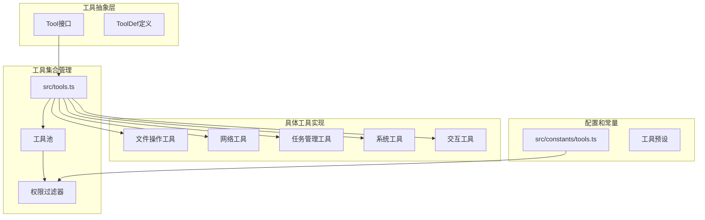
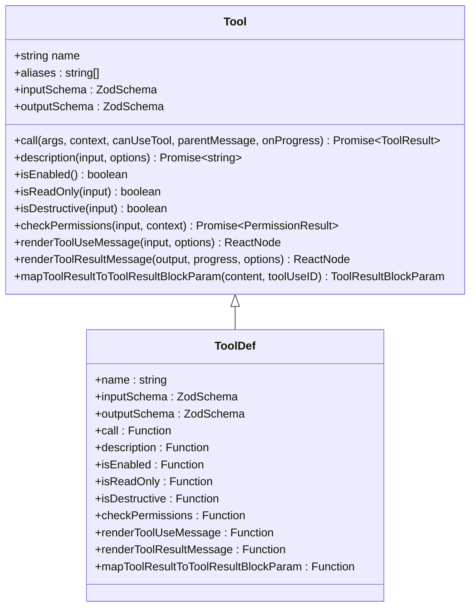
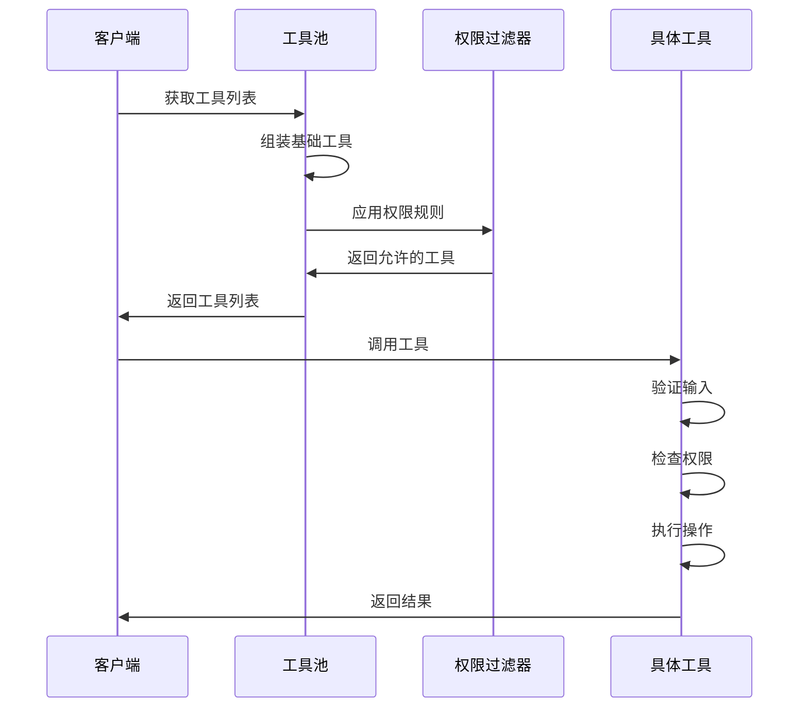
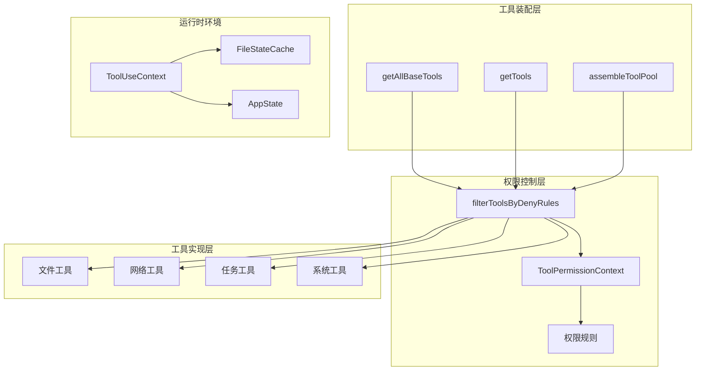
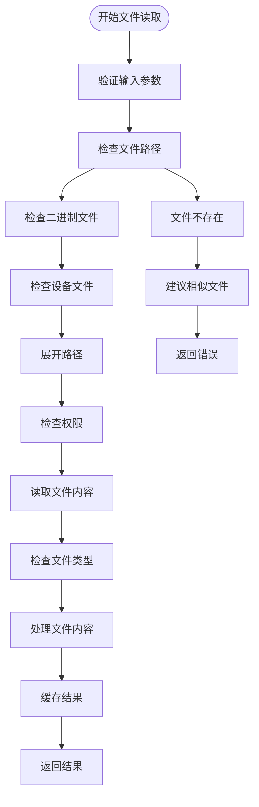
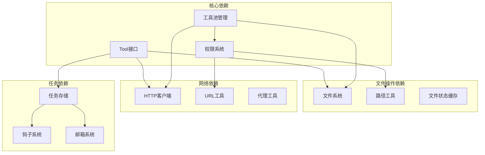
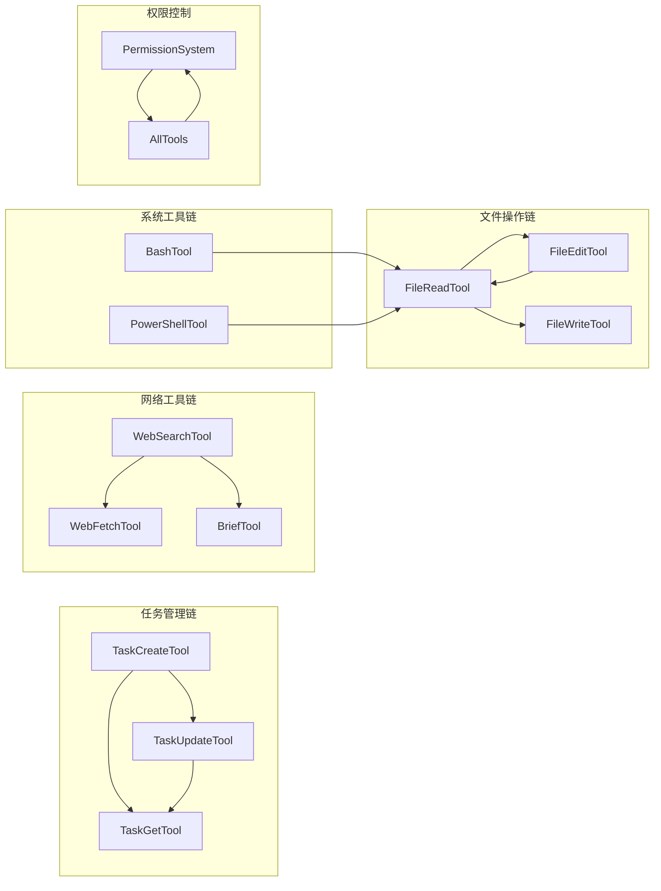

# 内置工具详解

<cite>
**本文档引用的文件**
- [src/tools.ts](file://src/tools.ts)
- [src/Tool.ts](file://src/Tool.ts)
- [src/constants/tools.ts](file://src/constants/tools.ts)
- [src/tools/FileReadTool/FileReadTool.ts](file://src/tools/FileReadTool/FileReadTool.ts)
- [src/tools/FileEditTool/FileEditTool.ts](file://src/tools/FileEditTool/FileEditTool.ts)
- [src/tools/FileWriteTool/FileWriteTool.ts](file://src/tools/FileWriteTool/FileWriteTool.ts)
- [src/tools/GlobTool/GlobTool.ts](file://src/tools/GlobTool/GlobTool.ts)
- [src/tools/WebFetchTool/WebFetchTool.ts](file://src/tools/WebFetchTool/WebFetchTool.ts)
- [src/tools/WebSearchTool/WebSearchTool.ts](file://src/tools/WebSearchTool/WebSearchTool.ts)
- [src/tools/TaskCreateTool/TaskCreateTool.ts](file://src/tools/TaskCreateTool/TaskCreateTool.ts)
- [src/tools/TaskGetTool/TaskGetTool.ts](file://src/tools/TaskGetTool/TaskGetTool.ts)
- [src/tools/TaskUpdateTool/TaskUpdateTool.ts](file://src/tools/TaskUpdateTool/TaskUpdateTool.ts)
- [src/tools/AskUserQuestionTool/AskUserQuestionTool.ts](file://src/tools/AskUserQuestionTool/AskUserQuestionTool.ts)
- [src/tools/BriefTool/BriefTool.ts](file://src/tools/BriefTool/BriefTool.ts)
- [src/tools/GrepTool/GrepTool.ts](file://src/tools/GrepTool/GrepTool.ts)
- [src/tools/NotebookEditTool/NotebookEditTool.ts](file://src/tools/NotebookEditTool/NotebookEditTool.ts)
- [src/tools/PowerShellTool/PowerShellTool.ts](file://src/tools/PowerShellTool/PowerShellTool.ts)
- [src/tools/BashTool/BashTool.ts](file://src/tools/BashTool/BashTool.ts)
- [src/tools/TaskStopTool/TaskStopTool.ts](file://src/tools/TaskStopTool/TaskStopTool.ts)
- [src/tools/SkillTool/SkillTool.ts](file://src/tools/SkillTool/SkillTool.ts)
- [src/tools/ExitPlanModeTool/ExitPlanModeTool.ts](file://src/tools/ExitPlanModeTool/ExitPlanModeTool.ts)
- [src/tools/EnterPlanModeTool/EnterPlanModeTool.ts](file://src/tools/EnterPlanModeTool/EnterPlanModeTool.ts)
- [src/tools/EnterWorktreeTool/EnterWorktreeTool.ts](file://src/tools/EnterWorktreeTool/EnterWorktreeTool.ts)
- [src/tools/ExitWorktreeTool/ExitWorktreeTool.ts](file://src/tools/ExitWorktreeTool/ExitWorktreeTool.ts)
- [src/tools/ConfigTool/ConfigTool.ts](file://src/tools/ConfigTool/ConfigTool.ts)
- [src/tools/TodoWriteTool/TodoWriteTool.ts](file://src/tools/TodoWriteTool/TodoWriteTool.ts)
- [src/tools/ToolSearchTool/ToolSearchTool.ts](file://src/tools/ToolSearchTool/ToolSearchTool.ts)
- [src/tools/SendMessageTool/SendMessageTool.ts](file://src/tools/SendMessageTool/SendMessageTool.ts)
- [src/tools/TeamCreateTool/TeamCreateTool.ts](file://src/tools/TeamCreateTool/TeamCreateTool.ts)
- [src/tools/TeamDeleteTool/TeamDeleteTool.ts](file://src/tools/TeamDeleteTool/TeamDeleteTool.ts)
- [src/tools/ScheduleCronTool/ScheduleCronTool.ts](file://src/tools/ScheduleCronTool/ScheduleCronTool.ts)
- [src/tools/RemoteTriggerTool/RemoteTriggerTool.ts](file://src/tools/RemoteTriggerTool/RemoteTriggerTool.ts)
- [src/tools/MonitorTool/MonitorTool.ts](file://src/tools/MonitorTool/MonitorTool.ts)
- [src/tools/SyntheticOutputTool/SyntheticOutputTool.ts](file://src/tools/SyntheticOutputTool/SyntheticOutputTool.ts)
- [src/tools/REPLTool/REPLTool.ts](file://src/tools/REPLTool/REPLTool.ts)
- [src/tools/TungstenTool/TungstenTool.ts](file://src/tools/TungstenTool/TungstenTool.ts)
- [src/tools/VerifyPlanExecutionTool/VerifyPlanExecutionTool.ts](file://src/tools/VerifyPlanExecutionTool/VerifyPlanExecutionTool.ts)
- [src/tools/OverflowTestTool/OverflowTestTool.ts](file://src/tools/OverflowTestTool/OverflowTestTool.ts)
- [src/tools/CtxInspectTool/CtxInspectTool.ts](file://src/tools/CtxInspectTool/CtxInspectTool.ts)
- [src/tools/TerminalCaptureTool/TerminalCaptureTool.ts](file://src/tools/TerminalCaptureTool/TerminalCaptureTool.ts)
- [src/tools/WebBrowserTool/WebBrowserTool.ts](file://src/tools/WebBrowserTool/WebBrowserTool.ts)
- [src/tools/WorkflowTool/WorkflowTool.ts](file://src/tools/WorkflowTool/WorkflowTool.ts)
- [src/tools/SleepTool/SleepTool.ts](file://src/tools/SleepTool/SleepTool.ts)
- [src/tools/SuggestBackgroundPRTool/SuggestBackgroundPRTool.ts](file://src/tools/SuggestBackgroundPRTool/SuggestBackgroundPRTool.ts)
- [src/tools/SendUserFileTool/SendUserFileTool.ts](file://src/tools/SendUserFileTool/SendUserFileTool.ts)
- [src/tools/PushNotificationTool/PushNotificationTool.ts](file://src/tools/PushNotificationTool/PushNotificationTool.ts)
- [src/tools/SubscribePRTool/SubscribePRTool.ts](file://src/tools/SubscribePRTool/SubscribePRTool.ts)
- [src/tools/SnipTool/SnipTool.ts](file://src/tools/SnipTool/SnipTool.ts)
- [src/tools/ListPeersTool/ListPeersTool.ts](file://src/tools/ListPeersTool/ListPeersTool.ts)
- [src/tools/LSPTool/LSPTool.ts](file://src/tools/LSPTool/LSPTool.ts)
- [src/tools/AgentTool/AgentTool.ts](file://src/tools/AgentTool/AgentTool.ts)
- [src/tools/TaskListTool/TaskListTool.ts](file://src/tools/TaskListTool/TaskListTool.ts)
- [src/tools/TaskOutputTool/TaskOutputTool.ts](file://src/tools/TaskOutputTool/TaskOutputTool.ts)
- [src/tools/ToolSearchTool/ToolSearchTool.ts](file://src/tools/ToolSearchTool/ToolSearchTool.ts)
- [src/tools/ListMcpResourcesTool/ListMcpResourcesTool.ts](file://src/tools/ListMcpResourcesTool/ListMcpResourcesTool.ts)
- [src/tools/ReadMcpResourceTool/ReadMcpResourceTool.ts](file://src/tools/ReadMcpResourceTool/ReadMcpResourceTool.ts)
- [src/tools/MCPTool/MCPTool.ts](file://src/tools/MCPTool/MCPTool.ts)
- [src/tools/McpAuthTool/McpAuthTool.ts](file://src/tools/McpAuthTool/McpAuthTool.ts)
- [src/tools/NotebookEditTool/NotebookEditTool.ts](file://src/tools/NotebookEditTool/NotebookEditTool.ts)
- [src/tools/REPLTool/REPLTool.ts](file://src/tools/REPLTool/REPLTool.ts)
- [src/tools/testing/TestingPermissionTool.ts](file://src/tools/testing/TestingPermissionTool.ts)
</cite>

## 目录
1. [简介](#简介)
2. [项目结构](#项目结构)
3. [核心组件](#核心组件)
4. [架构概览](#架构概览)
5. [详细组件分析](#详细组件分析)
6. [依赖分析](#依赖分析)
7. [性能考虑](#性能考虑)
8. [故障排除指南](#故障排除指南)
9. [结论](#结论)

## 简介

Claude Code内置工具系统是一个高度模块化、可扩展的工具框架，提供了40多种预定义工具来执行各种任务。这些工具涵盖了文件操作、系统命令、网络请求、任务管理、用户交互等多个领域，为AI代理提供了强大的本地和远程操作能力。

该工具系统基于统一的抽象层设计，所有工具都实现了相同的接口规范，支持权限控制、并发安全、结果渲染等功能。工具系统还集成了智能权限检查、结果缓存、错误处理等高级特性。

## 项目结构

工具系统的整体架构采用分层设计：

**图表来源**
- [src/tools.ts:193-251](file://src/tools.ts#L193-L251)
- [src/Tool.ts:362-695](file://src/Tool.ts#L362-L695)
- [src/constants/tools.ts:36-113](file://src/constants/tools.ts#L36-L113)

**章节来源**
- [src/tools.ts:193-390](file://src/tools.ts#L193-L390)
- [src/Tool.ts:1-793](file://src/Tool.ts#L1-793)
- [src/constants/tools.ts:1-113](file://src/constants/tools.ts#L1-L113)

## 核心组件

### 工具抽象接口

所有工具都实现统一的Tool接口，该接口定义了工具的基本行为和生命周期：

**图表来源**
- [src/Tool.ts:362-695](file://src/Tool.ts#L362-L695)

### 工具池管理

工具池是工具系统的核心管理组件，负责工具的组装、过滤和分发：

**图表来源**
- [src/tools.ts:271-327](file://src/tools.ts#L271-L327)
- [src/tools.ts:345-367](file://src/tools.ts#L345-L367)

**章节来源**
- [src/Tool.ts:362-793](file://src/Tool.ts#L362-L793)
- [src/tools.ts:271-367](file://src/tools.ts#L271-L367)

## 架构概览

工具系统采用模块化架构，支持动态加载、权限控制和结果缓存：

**图表来源**
- [src/tools.ts:193-390](file://src/tools.ts#L193-L390)
- [src/Tool.ts:123-148](file://src/Tool.ts#L123-L148)

## 详细组件分析

### 文件操作工具

文件操作工具提供了完整的文件读写编辑功能，支持多种文件类型和格式。

#### FileReadTool - 文件读取工具

FileReadTool是最复杂的文件操作工具，支持多种文件类型的读取：

**图表来源**
- [src/tools/FileReadTool/FileReadTool.ts:418-651](file://src/tools/FileReadTool/FileReadTool.ts#L418-L651)

**参数说明：**
- `file_path`: 必需，要读取的文件绝对路径
- `offset`: 可选，起始行号，用于大文件分段读取
- `limit`: 可选，读取的行数
- `pages`: 可选，PDF页面范围（如"1-5", "3"）

**使用示例：**
- 读取完整文件：`{"file_path": "/home/user/project/src/main.js"}`
- 分段读取：`{"file_path": "/var/log/app.log", "offset": 1, "limit": 100}`
- PDF页面提取：`{"file_path": "report.pdf", "pages": "1-3"}`

**最佳实践：**
- 对于大文件使用offset和limit参数进行分段读取
- PDF文件使用pages参数指定需要的页面范围
- 注意文件大小限制和令牌计数限制

**章节来源**
- [src/tools/FileReadTool/FileReadTool.ts:227-335](file://src/tools/FileReadTool/FileReadTool.ts#L227-L335)
- [src/tools/FileReadTool/FileReadTool.ts:337-718](file://src/tools/FileReadTool/FileReadTool.ts#L337-L718)

#### FileEditTool - 文件编辑工具

FileEditTool提供精确的文件内容替换功能：

**参数说明：**
- `file_path`: 必需，目标文件路径
- `old_string`: 必需，要被替换的字符串
- `new_string`: 必需，新的字符串内容
- `replace_all`: 可选，是否替换所有匹配项，默认false

**使用示例：**
- 替换单个实例：`{"file_path": "config.json", "old_string": "DEBUG=false", "new_string": "DEBUG=true"}`
- 替换所有匹配：`{"file_path": "app.py", "old_string": "print(", "new_string": "#print(", "replace_all": true}`

**最佳实践：**
- 使用更具体的上下文字符串以避免误替换
- 大文件编辑前先确认文件状态
- 利用quote样式保持与原文件一致的引号风格

**章节来源**
- [src/tools/FileEditTool/FileEditTool.ts:56-595](file://src/tools/FileEditTool/FileEditTool.ts#L56-L595)

#### FileWriteTool - 文件写入工具

FileWriteTool提供文件内容的完全覆盖写入：

**参数说明：**
- `file_path`: 必需，目标文件的绝对路径
- `content`: 必需，要写入的内容

**使用示例：**
- 创建新文件：`{"file_path": "/tmp/newfile.txt", "content": "Hello World"}`
- 覆盖现有文件：`{"file_path": "config.yaml", "content": "version: 2"}`

**最佳实践：**
- 确保父目录存在
- 注意文件编码和换行符处理
- 对重要文件使用备份策略

**章节来源**
- [src/tools/FileWriteTool/FileWriteTool.ts:56-434](file://src/tools/FileWriteTool/FileWriteTool.ts#L56-L434)

### 系统命令工具

系统命令工具允许在受控环境中执行shell命令。

#### BashTool - Bash命令工具

BashTool提供Linux/Unix系统命令执行能力：

**参数说明：**
- `command`: 必需，要执行的bash命令
- `cwd`: 可选，工作目录
- `timeout`: 可选，超时时间（秒）

**使用示例：**
- 基本命令：`{"command": "ls -la"}`
- 带工作目录：`{"command": "npm install", "cwd": "/home/user/project"}`
- 带超时：`{"command": "find . -name '*.log'", "timeout": 30}`

**最佳实践：**
- 限制可能耗时过长的命令
- 使用适当的超时设置
- 避免执行危险命令

**章节来源**
- [src/tools/BashTool/BashTool.ts:1-200](file://src/tools/BashTool/BashTool.ts#L1-L200)

#### PowerShellTool - PowerShell命令工具

PowerShellTool提供Windows系统命令执行能力：

**参数说明：**
- `command`: 必需，要执行的PowerShell命令
- `cwd`: 可选，工作目录
- `timeout`: 可选，超时时间（秒）

**使用示例：**
- 基本命令：`{"command": "Get-ChildItem"}`
- 带参数：`{"command": "Get-Process | Where-Object {$_.CPU -gt 100}"}`

**最佳实践：**
- 在Windows环境中使用
- 注意PowerShell特定的语法和安全性
- 合理设置执行策略

**章节来源**
- [src/tools/PowerShellTool/PowerShellTool.ts:1-200](file://src/tools/PowerShellTool/PowerShellTool.ts#L1-L200)

### 网络请求工具

网络工具提供了网页抓取和搜索功能。

#### WebFetchTool - 网页抓取工具

WebFetchTool从URL获取内容并应用提示进行处理：

**参数说明：**
- `url`: 必需，要抓取的URL
- `prompt`: 必需，对获取内容应用的提示

**使用示例：**
- 抓取技术文档：`{"url": "https://docs.example.com/api", "prompt": "总结主要API端点和使用方法"}`

**最佳实践：**
- 避免访问需要认证的私有URL
- 注意重定向处理
- 合理设置超时时间

**章节来源**
- [src/tools/WebFetchTool/WebFetchTool.ts:24-319](file://src/tools/WebFetchTool/WebFetchTool.ts#L24-L319)

#### WebSearchTool - 网络搜索工具

WebSearchTool提供实时网络搜索功能：

**参数说明：**
- `query`: 必需，搜索查询
- `allowed_domains`: 可选，允许的域名列表
- `blocked_domains`: 可选，阻止的域名列表

**使用示例：**
- 基本搜索：`{"query": "JavaScript最佳实践"}`
- 限定域名：`{"query": "React文档", "allowed_domains": ["reactjs.org"]}`

**最佳实践：**
- 提供清晰明确的搜索查询
- 合理使用域名限制
- 注意搜索结果的时效性

**章节来源**
- [src/tools/WebSearchTool/WebSearchTool.ts:25-436](file://src/tools/WebSearchTool/WebSearchTool.ts#L25-L436)

### 任务管理工具

任务管理工具提供了完整的任务生命周期管理。

#### TaskCreateTool - 任务创建工具

TaskCreateTool用于创建新的任务：

**参数说明：**
- `subject`: 必需，任务简短标题
- `description`: 必需，任务描述
- `activeForm`: 可选，在进行中的活动形式
- `metadata`: 可选，附加元数据

**使用示例：**
- 创建开发任务：`{"subject": "实现用户认证", "description": "开发用户登录和注册功能", "activeForm": "Implementing authentication"}`

**最佳实践：**
- 提供清晰的任务描述
- 使用合适的活动形式
- 添加必要的元数据

**章节来源**
- [src/tools/TaskCreateTool/TaskCreateTool.ts:18-139](file://src/tools/TaskCreateTool/TaskCreateTool.ts#L18-L139)

#### TaskGetTool - 任务获取工具

TaskGetTool用于获取特定任务的详细信息：

**参数说明：**
- `taskId`: 必需，任务ID

**使用示例：**
- 获取任务详情：`{"taskId": "task_12345"}`

**最佳实践：**
- 确保任务ID的有效性
- 处理任务不存在的情况

**章节来源**
- [src/tools/TaskGetTool/TaskGetTool.ts:13-129](file://src/tools/TaskGetTool/TaskGetTool.ts#L13-L129)

#### TaskUpdateTool - 任务更新工具

TaskUpdateTool用于更新任务状态和属性：

**参数说明：**
- `taskId`: 必需，任务ID
- `subject`: 可选，新主题
- `description`: 可选，新描述
- `status`: 可选，新状态
- `owner`: 可选，新所有者
- `metadata`: 可选，合并的元数据

**使用示例：**
- 更新任务状态：`{"taskId": "task_12345", "status": "in_progress"}`
- 分配任务所有者：`{"taskId": "task_12345", "owner": "developer1"}`

**最佳实践：**
- 使用原子更新操作
- 注意状态转换的业务逻辑
- 合理使用元数据管理

**章节来源**
- [src/tools/TaskUpdateTool/TaskUpdateTool.ts:33-407](file://src/tools/TaskUpdateTool/TaskUpdateTool.ts#L33-L407)

### 交互工具

交互工具提供了与用户和系统的直接交互能力。

#### AskUserQuestionTool - 用户提问工具

AskUserQuestionTool用于向用户提出问题：

**参数说明：**
- `question`: 必需，要问的问题
- `choices`: 可选，预定义的选择列表
- `allowSkip`: 可选，是否允许跳过

**使用示例：**
- 确认操作：`{"question": "确定要删除这个文件吗？", "choices": ["是", "否"]}`

**最佳实践：**
- 提供清晰明确的问题
- 合理设置选择选项
- 考虑用户体验

**章节来源**
- [src/tools/AskUserQuestionTool/AskUserQuestionTool.ts:1-200](file://src/tools/AskUserQuestionTool/AskUserQuestionTool.ts#L1-L200)

#### BriefTool - 简报工具

BriefTool是Claude Code的主要用户输出工具：

**参数说明：**
- `message`: 必需，要发送给用户的消息
- `attachments`: 可选，要附加的文件路径列表
- `status`: 必需，消息状态（'normal'或'proactive'）

**使用示例：**
- 发送普通消息：`{"message": "任务已完成", "status": "normal"}`
- 发送主动提醒：`{"message": "检测到代码冲突需要解决", "status": "proactive"}`

**最佳实践：**
- 使用简洁明了的语言
- 合理使用附件功能
- 区分正常和主动消息

**章节来源**
- [src/tools/BriefTool/BriefTool.ts:20-205](file://src/tools/BriefTool/BriefTool.ts#L20-L205)

### 辅助工具

#### GlobTool - 文件查找工具

GlobTool提供基于通配符的文件查找功能：

**参数说明：**
- `pattern`: 必需，glob模式
- `path`: 可选，搜索目录

**使用示例：**
- 查找所有JS文件：`{"pattern": "*.js"}`
- 在特定目录查找：`{"pattern": "src/**/*.ts", "path": "project"}`

**最佳实践：**
- 使用具体化的模式减少结果数量
- 合理设置搜索路径

**章节来源**
- [src/tools/GlobTool/GlobTool.ts:26-199](file://src/tools/GlobTool/GlobTool.ts#L26-L199)

#### GrepTool - 文本搜索工具

GrepTool提供文本内容搜索功能：

**参数说明：**
- `pattern`: 必需，搜索模式
- `path`: 可选，搜索路径
- `case_sensitive`: 可选，是否区分大小写

**使用示例：**
- 搜索函数定义：`{"pattern": "function.*\\(", "path": "src"}`

**最佳实践：**
- 使用正则表达式时注意转义
- 合理设置搜索范围

**章节来源**
- [src/tools/GrepTool/GrepTool.ts:1-200](file://src/tools/GrepTool/GrepTool.ts#L1-L200)

#### NotebookEditTool - 笔记本编辑工具

NotebookEditTool专门用于Jupyter笔记本文件的编辑：

**参数说明：**
- `file_path`: 必需，笔记本文件路径
- `cell_index`: 必需，要编辑的单元格索引
- `new_content`: 必需，新内容

**使用示例：**
- 编辑特定单元格：`{"file_path": "analysis.ipynb", "cell_index": 2, "new_content": "import pandas as pd"}`

**最佳实践：**
- 注意笔记本的执行顺序
- 保持代码单元格的完整性

**章节来源**
- [src/tools/NotebookEditTool/NotebookEditTool.ts:1-200](file://src/tools/NotebookEditTool/NotebookEditTool.ts#L1-L200)

## 依赖分析

工具系统具有清晰的依赖关系和模块化设计：

**图表来源**
- [src/tools.ts:193-390](file://src/tools.ts#L193-L390)
- [src/Tool.ts:123-148](file://src/Tool.ts#L123-L148)

### 工具间依赖关系

不同工具之间存在特定的依赖关系和组合使用模式：

**图表来源**
- [src/tools.ts:193-251](file://src/tools.ts#L193-L251)
- [src/constants/tools.ts:36-113](file://src/constants/tools.ts#L36-L113)

**章节来源**
- [src/tools.ts:193-390](file://src/tools.ts#L193-L390)
- [src/constants/tools.ts:36-113](file://src/constants/tools.ts#L36-L113)

## 性能考虑

工具系统在设计时充分考虑了性能优化：

### 缓存机制

- **文件读取缓存**：FileReadTool实现了智能缓存机制，避免重复读取相同内容
- **结果持久化**：超过阈值的结果自动保存到磁盘，避免内存溢出
- **权限检查缓存**：权限规则检查结果会被缓存以提高性能

### 并发控制

- **并发安全**：工具接口定义了并发安全检查方法
- **资源限制**：每个工具都有最大结果大小限制
- **超时控制**：网络和文件操作都有合理的超时设置

### 内存管理

- **流式处理**：大文件和网络响应采用流式处理
- **分块读取**：支持大文件的分块读取和处理
- **垃圾回收**：使用WeakMap等机制确保及时释放内存

## 故障排除指南

### 常见问题和解决方案

#### 权限相关问题

**问题**：工具调用被拒绝
**原因**：权限规则配置或文件系统权限问题
**解决方案**：
- 检查工具权限规则配置
- 验证文件系统访问权限
- 使用权限检查工具诊断问题

#### 文件操作问题

**问题**：文件读取失败
**原因**：文件不存在、权限不足或文件过大
**解决方案**：
- 验证文件路径和存在性
- 检查文件权限
- 使用offset和limit参数分段读取

#### 网络连接问题

**问题**：网络请求超时或失败
**原因**：网络不稳定、URL无效或服务器无响应
**解决方案**：
- 检查网络连接状态
- 验证URL格式和可达性
- 调整超时设置

#### 性能问题

**问题**：工具执行缓慢
**原因**：文件过大、网络延迟或系统资源不足
**解决方案**：
- 优化查询条件和范围
- 增加系统资源
- 使用缓存机制

### 调试技巧

1. **启用详细日志**：设置调试标志获取详细的执行日志
2. **使用权限检查**：通过权限检查工具诊断权限问题
3. **监控资源使用**：监控内存、CPU和磁盘使用情况
4. **测试工具链**：按顺序测试工具依赖关系

**章节来源**
- [src/tools/FileReadTool/FileReadTool.ts:175-185](file://src/tools/FileReadTool/FileReadTool.ts#L175-L185)
- [src/tools/FileEditTool/FileEditTool.ts:137-362](file://src/tools/FileEditTool/FileEditTool.ts#L137-L362)
- [src/tools/WebFetchTool/WebFetchTool.ts:104-180](file://src/tools/WebFetchTool/WebFetchTool.ts#L104-L180)

## 结论

Claude Code内置工具系统是一个设计精良、功能丰富的工具框架。它提供了40多种工具，涵盖了现代软件开发和系统管理的各个方面。系统的特点包括：

1. **统一抽象**：所有工具都实现相同的接口，确保一致的使用体验
2. **权限控制**：内置的权限系统确保工具使用的安全性和可控性
3. **性能优化**：缓存机制、流式处理和资源限制确保高效运行
4. **扩展性**：模块化设计支持新工具的添加和现有工具的扩展
5. **错误处理**：完善的错误处理和恢复机制提高系统稳定性

该工具系统为AI代理提供了强大的本地和远程操作能力，是构建智能开发助手的重要基础设施。通过合理使用这些工具，开发者可以显著提高工作效率和代码质量。