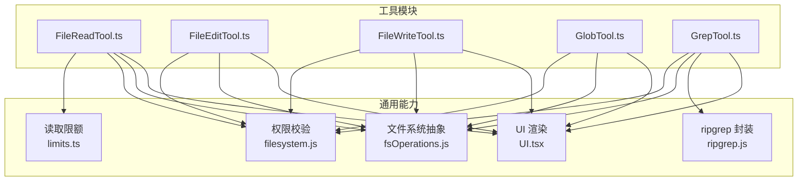
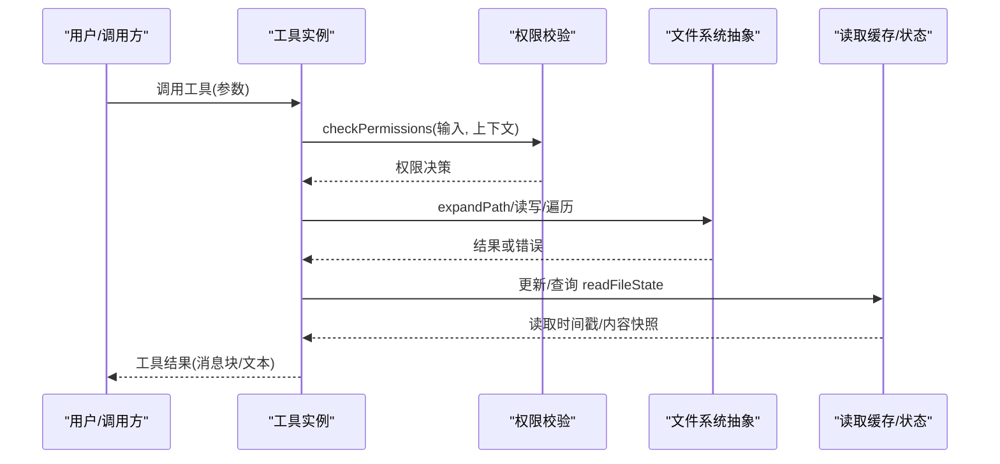
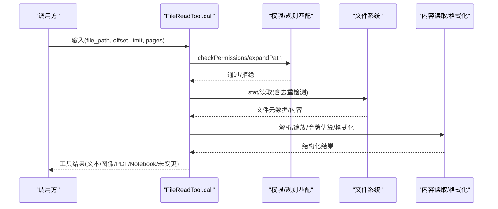
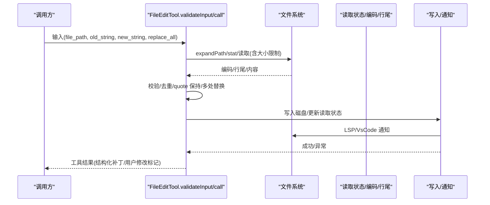
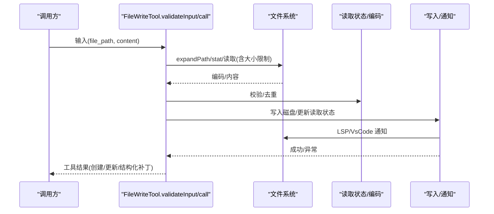
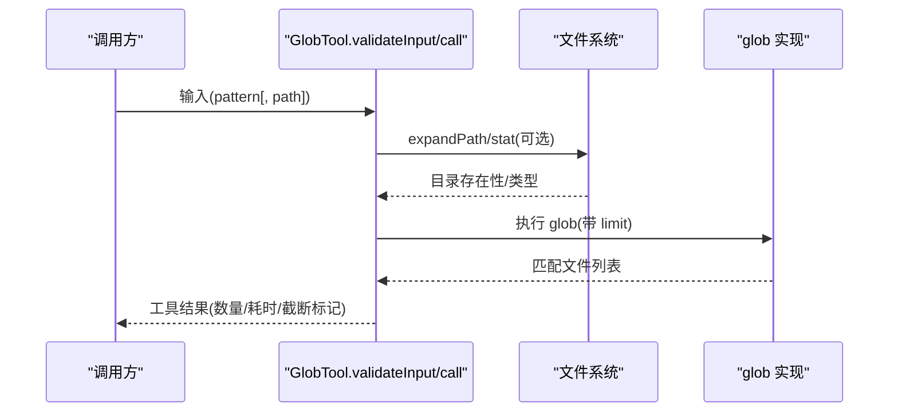
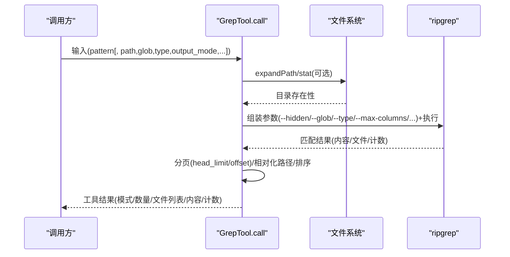
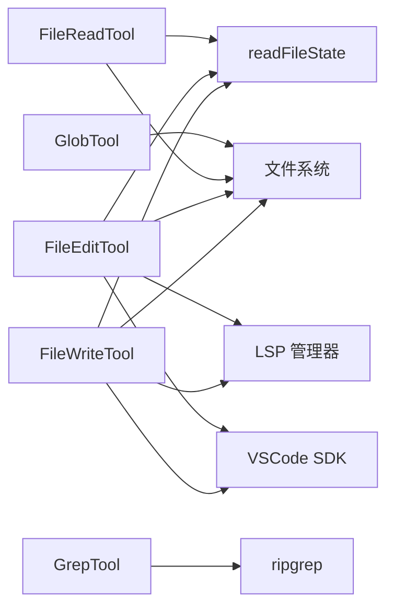

# 文件操作工具

<cite>
**本文引用的文件**
- [src/tools/FileReadTool/FileReadTool.ts](file://src/tools/FileReadTool/FileReadTool.ts)
- [src/tools/FileReadTool/limits.ts](file://src/tools/FileReadTool/limits.ts)
- [src/tools/FileReadTool/prompt.ts](file://src/tools/FileReadTool/prompt.ts)
- [src/tools/FileReadTool/UI.tsx](file://src/tools/FileReadTool/UI.tsx)
- [src/tools/FileEditTool/FileEditTool.ts](file://src/tools/FileEditTool/FileEditTool.ts)
- [src/tools/FileEditTool/types.ts](file://src/tools/FileEditTool/types.ts)
- [src/tools/FileEditTool/utils.ts](file://src/tools/FileEditTool/utils.ts)
- [src/tools/FileWriteTool/FileWriteTool.ts](file://src/tools/FileWriteTool/FileWriteTool.ts)
- [src/tools/GlobTool/GlobTool.ts](file://src/tools/GlobTool/GlobTool.ts)
- [src/tools/GrepTool/GrepTool.ts](file://src/tools/GrepTool/GrepTool.ts)
</cite>

## 目录
1. [简介](#简介)
2. [项目结构](#项目结构)
3. [核心组件](#核心组件)
4. [架构总览](#架构总览)
5. [详细组件分析](#详细组件分析)
6. [依赖关系分析](#依赖关系分析)
7. [性能考量](#性能考量)
8. [故障排查指南](#故障排查指南)
9. [结论](#结论)
10. [附录](#附录)

## 简介
本文件面向使用者与开发者，系统化梳理并讲解文件操作工具集：FileReadTool（文件读取）、FileEditTool（文件编辑）、FileWriteTool（文件写入）、GlobTool（文件模式匹配）、GrepTool（文件内容搜索）。内容涵盖：
- 实现原理与调用流程
- 参数配置、权限控制与安全限制
- 性能特征与优化建议
- 常见问题与最佳实践
- 具体使用场景与示例路径（以源码路径标注代替代码片段）

## 项目结构
文件操作工具位于 src/tools 下，每个工具独立封装为一个工具模块，遵循统一的工具定义接口与权限校验框架，并通过 UI.tsx 提供用户可见的结果呈现。

图表来源
- [src/tools/FileReadTool/FileReadTool.ts:1-120](file://src/tools/FileReadTool/FileReadTool.ts#L1-L120)
- [src/tools/FileEditTool/FileEditTool.ts:1-120](file://src/tools/FileEditTool/FileEditTool.ts#L1-L120)
- [src/tools/FileWriteTool/FileWriteTool.ts:1-120](file://src/tools/FileWriteTool/FileWriteTool.ts#L1-L120)
- [src/tools/GlobTool/GlobTool.ts:1-120](file://src/tools/GlobTool/GlobTool.ts#L1-L120)
- [src/tools/GrepTool/GrepTool.ts:1-120](file://src/tools/GrepTool/GrepTool.ts#L1-L120)

章节来源
- [src/tools/FileReadTool/FileReadTool.ts:1-120](file://src/tools/FileReadTool/FileReadTool.ts#L1-L120)
- [src/tools/FileEditTool/FileEditTool.ts:1-120](file://src/tools/FileEditTool/FileEditTool.ts#L1-L120)
- [src/tools/FileWriteTool/FileWriteTool.ts:1-120](file://src/tools/FileWriteTool/FileWriteTool.ts#L1-L120)
- [src/tools/GlobTool/GlobTool.ts:1-120](file://src/tools/GlobTool/GlobTool.ts#L1-L120)
- [src/tools/GrepTool/GrepTool.ts:1-120](file://src/tools/GrepTool/GrepTool.ts#L1-L120)

## 核心组件
- FileReadTool：支持文本、图片、PDF、Jupyter Notebook 的读取；具备偏移/范围读取、大小与令牌上限控制、设备文件阻断、macOS 截图路径兼容、重复读取去重等特性。
- FileEditTool：基于“读取-校验-变更-写回”的原子流程，确保文件未被外部修改；支持多处替换、引号风格保持、差异计算与 LSP/VsCode 同步。
- FileWriteTool：覆盖式写入，要求先读取再写入；对新旧内容进行差异统计与 LSP/VsCode 通知；支持 Git Diff 捕获。
- GlobTool：基于通配符的文件发现，支持目录合法性校验与结果截断提示。
- GrepTool：基于 ripgrep 的正则搜索，支持上下文、计数、类型过滤、忽略模式、分页与排序。

章节来源
- [src/tools/FileReadTool/FileReadTool.ts:337-718](file://src/tools/FileReadTool/FileReadTool.ts#L337-L718)
- [src/tools/FileEditTool/FileEditTool.ts:86-595](file://src/tools/FileEditTool/FileEditTool.ts#L86-L595)
- [src/tools/FileWriteTool/FileWriteTool.ts:94-434](file://src/tools/FileWriteTool/FileWriteTool.ts#L94-L434)
- [src/tools/GlobTool/GlobTool.ts:57-198](file://src/tools/GlobTool/GlobTool.ts#L57-L198)
- [src/tools/GrepTool/GrepTool.ts:160-577](file://src/tools/GrepTool/GrepTool.ts#L160-L577)

## 架构总览
工具层统一通过 buildTool 定义，共享输入输出模式、权限检查、路径展开、UI 渲染与工具分类信息。读取工具与编辑/写入工具之间存在状态联动（readFileState），用于防止并发修改与保证一致性。

图表来源
- [src/tools/FileReadTool/FileReadTool.ts:395-495](file://src/tools/FileReadTool/FileReadTool.ts#L395-L495)
- [src/tools/FileEditTool/FileEditTool.ts:122-132](file://src/tools/FileEditTool/FileEditTool.ts#L122-L132)
- [src/tools/FileWriteTool/FileWriteTool.ts:132-142](file://src/tools/FileWriteTool/FileWriteTool.ts#L132-L142)

## 详细组件分析

### FileReadTool（文件读取）
- 功能要点
  - 支持文本、图片、PDF、Notebook 多媒体读取；自动识别并返回对应数据结构。
  - 偏移/范围读取：通过 offset/limit 控制长文件分段读取。
  - PDF 支持：可指定页码范围，限制单次最大页数。
  - 设备文件阻断：禁止读取无限输出或阻塞输入的设备节点。
  - macOS 截图兼容：自动尝试空格字符差异（常规空格与窄空格）。
  - 重复读取去重：若文件未变化且范围一致，返回“未变更”占位，避免重复传输。
  - 令牌与字节上限：默认最大输出令牌数与最大文件大小，支持环境变量与实验开关覆盖。
  - 安全提醒：对读取文件给出“恶意软件分析”提醒（特定模型例外）。
- 关键流程（调用序列）

图表来源
- [src/tools/FileReadTool/FileReadTool.ts:496-651](file://src/tools/FileReadTool/FileReadTool.ts#L496-L651)
- [src/tools/FileReadTool/limits.ts:53-92](file://src/tools/FileReadTool/limits.ts#L53-L92)

- 参数与行为
  - file_path：绝对路径（必填）
  - offset/limit：行级范围读取（可选）
  - pages：PDF 页码范围（如 "1-5"，可选）
- 输出类型
  - 文本：包含内容、起止行、总行数
  - 图像：base64、MIME 类型、原尺寸、可选维度
  - PDF：base64、原尺寸
  - Notebook：单元数组
  - 未变更：占位消息
- 安全与权限
  - deny 规则拦截
  - UNC 路径延迟 I/O 防泄漏
  - 设备文件白名单外阻断
  - 二进制扩展名检测（除 PDF/图片/SVG）
- 性能与限制
  - 默认最大输出令牌数与最大文件大小
  - 令牌估算与 API 计数双重校验
  - macOS 截图路径兼容减少失败重试
- 使用示例路径
  - [调用入口与去重逻辑:523-573](file://src/tools/FileReadTool/FileReadTool.ts#L523-L573)
  - [PDF 页范围解析与限制:418-440](file://src/tools/FileReadTool/FileReadTool.ts#L418-L440)
  - [设备文件阻断列表:96-128](file://src/tools/FileReadTool/FileReadTool.ts#L96-L128)
  - [读取限额与环境变量覆盖:24-92](file://src/tools/FileReadTool/limits.ts#L24-L92)

章节来源
- [src/tools/FileReadTool/FileReadTool.ts:337-718](file://src/tools/FileReadTool/FileReadTool.ts#L337-L718)
- [src/tools/FileReadTool/limits.ts:1-92](file://src/tools/FileReadTool/limits.ts#L1-L92)
- [src/tools/FileReadTool/prompt.ts:1-50](file://src/tools/FileReadTool/prompt.ts#L1-L50)
- [src/tools/FileReadTool/UI.tsx:77-142](file://src/tools/FileReadTool/UI.tsx#L77-L142)

### FileEditTool（文件编辑）
- 功能要点
  - 读取-校验-变更-写回的原子流程，确保文件未被外部修改。
  - 支持多处替换（replace_all），自动处理引号风格（保留文件中的弯曲引号）。
  - 严格输入校验：空 old_string 仅允许空文件；不存在文件时需显式允许创建。
  - 团队内存敏感内容防护：禁止写入包含机密的团队记忆文件。
  - LSP/VsCode 同步：变更后通知服务器并触发保存诊断。
  - Git Diff 捕获：可选记录变更统计与补丁。
- 关键流程（调用序列）

图表来源
- [src/tools/FileEditTool/FileEditTool.ts:137-362](file://src/tools/FileEditTool/FileEditTool.ts#L137-L362)
- [src/tools/FileEditTool/FileEditTool.ts:387-574](file://src/tools/FileEditTool/FileEditTool.ts#L387-L574)
- [src/tools/FileEditTool/utils.ts:104-136](file://src/tools/FileEditTool/utils.ts#L104-L136)

- 参数与行为
  - file_path：绝对路径（必填）
  - old_string/new_string：替换目标与新内容（必填且需不同）
  - replace_all：是否全部替换（可选，默认 false）
- 输出类型
  - filePath/oldString/newString/originalFile/structuredPatch/userModified/replaceAll/gitDiff
- 安全与权限
  - deny 规则拦截
  - UNC 路径延迟 I/O 防泄漏
  - 最大文件大小限制（1GiB）
  - 团队记忆机密防护
- 使用示例路径
  - [输入校验与冲突检测:137-362](file://src/tools/FileEditTool/FileEditTool.ts#L137-L362)
  - [引号风格保持算法:104-199](file://src/tools/FileEditTool/utils.ts#L104-L199)
  - [多处替换与补丁生成:234-350](file://src/tools/FileEditTool/utils.ts#L234-L350)
  - [写回与 LSP/VsCode 通知:490-517](file://src/tools/FileEditTool/FileEditTool.ts#L490-L517)

章节来源
- [src/tools/FileEditTool/FileEditTool.ts:86-595](file://src/tools/FileEditTool/FileEditTool.ts#L86-L595)
- [src/tools/FileEditTool/types.ts:1-86](file://src/tools/FileEditTool/types.ts#L1-L86)
- [src/tools/FileEditTool/utils.ts:1-776](file://src/tools/FileEditTool/utils.ts#L1-L776)

### FileWriteTool（文件写入）
- 功能要点
  - 覆盖式写入，要求先读取再写入，防止并发覆盖。
  - 对新旧内容进行差异统计与 LSP/VsCode 通知。
  - 支持 Git Diff 捕获与行数统计。
  - 团队记忆机密防护。
- 关键流程（调用序列）

图表来源
- [src/tools/FileWriteTool/FileWriteTool.ts:153-222](file://src/tools/FileWriteTool/FileWriteTool.ts#L153-L222)
- [src/tools/FileWriteTool/FileWriteTool.ts:223-417](file://src/tools/FileWriteTool/FileWriteTool.ts#L223-L417)

- 参数与行为
  - file_path：绝对路径（必填）
  - content：要写入的完整内容（必填）
- 输出类型
  - type/create/update + filePath/content/structuredPatch/originalFile/gitDiff
- 安全与权限
  - deny 规则拦截
  - UNC 路径延迟 I/O 防泄漏
  - 团队记忆机密防护
- 使用示例路径
  - [输入校验与去重检查:153-222](file://src/tools/FileWriteTool/FileWriteTool.ts#L153-L222)
  - [写回与 LSP/VsCode 通知:307-330](file://src/tools/FileWriteTool/FileWriteTool.ts#L307-L330)

章节来源
- [src/tools/FileWriteTool/FileWriteTool.ts:94-434](file://src/tools/FileWriteTool/FileWriteTool.ts#L94-L434)

### GlobTool（文件模式匹配）
- 功能要点
  - 基于通配符的文件发现，支持指定根目录与默认工作目录。
  - 目录存在性校验与错误提示。
  - 结果数量限制（默认 100），超限时提示截断。
- 关键流程（调用序列）

图表来源
- [src/tools/GlobTool/GlobTool.ts:94-134](file://src/tools/GlobTool/GlobTool.ts#L94-L134)
- [src/tools/GlobTool/GlobTool.ts:154-176](file://src/tools/GlobTool/GlobTool.ts#L154-L176)

- 参数与行为
  - pattern：通配符模式（必填）
  - path：可选根目录（省略则使用当前工作目录）
- 输出类型
  - durationMs/numFiles/filenames/truncated
- 安全与权限
  - deny 规则拦截
  - UNC 路径延迟 I/O 防泄漏
- 使用示例路径
  - [输入校验与目录检查:94-134](file://src/tools/GlobTool/GlobTool.ts#L94-L134)
  - [执行 glob 并相对化路径:154-176](file://src/tools/GlobTool/GlobTool.ts#L154-L176)

章节来源
- [src/tools/GlobTool/GlobTool.ts:57-198](file://src/tools/GlobTool/GlobTool.ts#L57-L198)

### GrepTool（文件内容搜索）
- 功能要点
  - 基于 ripgrep 的正则搜索，支持上下文、计数、类型过滤、忽略模式、分页与按修改时间排序。
  - 自动排除版本控制目录与插件孤儿版本目录。
  - 行长度限制与超时保护。
- 关键流程（调用序列）

图表来源
- [src/tools/GrepTool/GrepTool.ts:310-384](file://src/tools/GrepTool/GrepTool.ts#L310-L384)
- [src/tools/GrepTool/GrepTool.ts:441-576](file://src/tools/GrepTool/GrepTool.ts#L441-L576)

- 参数与行为
  - pattern：正则表达式（必填）
  - path：可选搜索根目录（默认当前工作目录）
  - glob/type：文件类型/通配过滤（可选）
  - output_mode：content/files_with_matches/count（可选，默认 files_with_matches）
  - -B/-A/-C/context：上下文行数（仅 content 模式有效）
  - -n：显示行号（仅 content 模式有效）
  - -i：大小写不敏感（可选）
  - type：文件类型（可选）
  - head_limit：结果上限（默认 250，0 表示无限制）
  - offset：跳过前 N 条后再应用 head_limit（可选）
  - multiline：多行模式（可选）
- 输出类型
  - mode/numFiles/filenames/content/numLines/numMatches/appliedLimit/appliedOffset
- 安全与权限
  - deny 规则拦截
  - UNC 路径延迟 I/O 防泄漏
  - 忽略模式与 VCS 目录排除
- 使用示例路径
  - [参数解析与 flags 组装:310-410](file://src/tools/GrepTool/GrepTool.ts#L310-L410)
  - [内容/计数/文件列表三种模式处理:443-576](file://src/tools/GrepTool/GrepTool.ts#L443-L576)

章节来源
- [src/tools/GrepTool/GrepTool.ts:160-577](file://src/tools/GrepTool/GrepTool.ts#L160-L577)

## 依赖关系分析
- 工具间耦合
  - FileReadTool 与 FileEditTool/FileWriteTool：通过 readFileState 协同，避免并发写入导致的覆盖或不一致。
  - FileEditTool/FileWriteTool 与 LSP/VsCode：写回后主动通知，确保 IDE 诊断与差异视图同步。
  - GrepTool 与 ripgrep：通过封装的 ripGrep 执行命令行工具，支持超时与分页。
- 外部依赖
  - 权限系统：shell 规则匹配与 deny 规则
  - 文件系统抽象：跨平台路径展开与 I/O 封装
  - UI 层：统一的工具使用/结果消息渲染

图表来源
- [src/tools/FileReadTool/FileReadTool.ts:523-573](file://src/tools/FileReadTool/FileReadTool.ts#L523-L573)
- [src/tools/FileEditTool/FileEditTool.ts:490-517](file://src/tools/FileEditTool/FileEditTool.ts#L490-L517)
- [src/tools/FileWriteTool/FileWriteTool.ts:307-330](file://src/tools/FileWriteTool/FileWriteTool.ts#L307-L330)
- [src/tools/GrepTool/GrepTool.ts:441-441](file://src/tools/GrepTool/GrepTool.ts#L441-L441)

章节来源
- [src/tools/FileReadTool/FileReadTool.ts:523-573](file://src/tools/FileReadTool/FileReadTool.ts#L523-L573)
- [src/tools/FileEditTool/FileEditTool.ts:490-517](file://src/tools/FileEditTool/FileEditTool.ts#L490-L517)
- [src/tools/FileWriteTool/FileWriteTool.ts:307-330](file://src/tools/FileWriteTool/FileWriteTool.ts#L307-L330)
- [src/tools/GrepTool/GrepTool.ts:441-441](file://src/tools/GrepTool/GrepTool.ts#L441-L441)

## 性能考量
- 令牌与大小限制
  - FileReadTool：默认最大输出令牌数与最大文件大小，避免一次性传输过大内容；支持环境变量与实验开关覆盖。
  - GrepTool：默认 head_limit 为 250，避免大结果集占用上下文；支持 offset/head_limit 分页。
- 去重与缓存
  - FileReadTool：相同范围且文件未变时返回“未变更”占位，减少重复传输。
- I/O 与并发
  - FileEditTool/FileWriteTool：写回前确保父目录存在，写入前后严格检查文件时间戳，避免并发写入导致的数据不一致。
- 外部工具
  - GrepTool：ripgrep 本身具备高性能与超时控制；通过 --max-columns 限制单行长度，降低噪声。

章节来源
- [src/tools/FileReadTool/limits.ts:1-92](file://src/tools/FileReadTool/limits.ts#L1-L92)
- [src/tools/FileReadTool/FileReadTool.ts:523-573](file://src/tools/FileReadTool/FileReadTool.ts#L523-L573)
- [src/tools/GrepTool/GrepTool.ts:108-128](file://src/tools/GrepTool/GrepTool.ts#L108-L128)
- [src/tools/GrepTool/GrepTool.ts:436-441](file://src/tools/GrepTool/GrepTool.ts#L436-L441)

## 故障排查指南
- 文件不存在
  - FileReadTool：若原始路径不存在，尝试 macOS 截图空格差异路径；否则提示相似文件与当前工作目录建议。
  - FileEditTool/FileWriteTool：若文件不存在且非空 old_string 或非空文件，提示类似错误并建议修正。
- 权限拒绝
  - 所有工具：deny 规则命中时直接拒绝；UNC 路径会延迟 I/O 以避免凭据泄露。
- 设备文件阻断
  - FileReadTool：对 /dev/zero、/dev/random、/dev/tty 等阻断读取。
- 多处替换冲突
  - FileEditTool：当 replace_all=false 且匹配多处时，提示设置 replace_all=true 或提供更明确上下文。
- 文件已修改
  - FileEditTool/FileWriteTool：若自上次读取后文件被外部修改（含云同步/杀软），拒绝写入并提示重新读取。
- 搜索结果过多
  - GrepTool：默认限制 250 条，可通过 head_limit=0 取消上限但谨慎使用；使用 offset 进行分页。
- PDF/图片读取
  - FileReadTool：PDF 需要 pages 参数限制页数；图片自动缩放与 base64 返回。

章节来源
- [src/tools/FileReadTool/FileReadTool.ts:609-649](file://src/tools/FileReadTool/FileReadTool.ts#L609-L649)
- [src/tools/FileEditTool/FileEditTool.ts:158-174](file://src/tools/FileEditTool/FileEditTool.ts#L158-L174)
- [src/tools/FileWriteTool/FileWriteTool.ts:162-177](file://src/tools/FileWriteTool/FileWriteTool.ts#L162-L177)
- [src/tools/FileReadTool/FileReadTool.ts:484-492](file://src/tools/FileReadTool/FileReadTool.ts#L484-L492)
- [src/tools/FileEditTool/FileEditTool.ts:331-343](file://src/tools/FileEditTool/FileEditTool.ts#L331-L343)
- [src/tools/FileEditTool/FileEditTool.ts:290-311](file://src/tools/FileEditTool/FileEditTool.ts#L290-L311)
- [src/tools/FileWriteTool/FileWriteTool.ts:211-219](file://src/tools/FileWriteTool/FileWriteTool.ts#L211-L219)
- [src/tools/GrepTool/GrepTool.ts:108-128](file://src/tools/GrepTool/GrepTool.ts#L108-L128)

## 结论
上述工具围绕“安全、可控、可观测”的原则设计：严格的权限与路径校验、原子写入与状态联动、丰富的 UI 呈现与分页/限额控制。结合 ripgrep 的高效检索与多模式输出，能够满足从文件发现到内容搜索、从读取到编辑/写入的完整开发工作流。

## 附录
- 最佳实践
  - 优先使用 offset/limit 或 head_limit 分页，避免一次性传输大量内容。
  - 先读取再编辑/写入，确保一致性；遇到“文件已修改”提示时重新读取。
  - PDF 与图片读取建议明确范围/类型，避免超大文件导致高开销。
  - 使用 GlobTool/GrepTool 前先缩小范围（glob/type），提升性能与准确性。
  - 对团队记忆文件的敏感内容，避免通过编辑/写入工具提交。