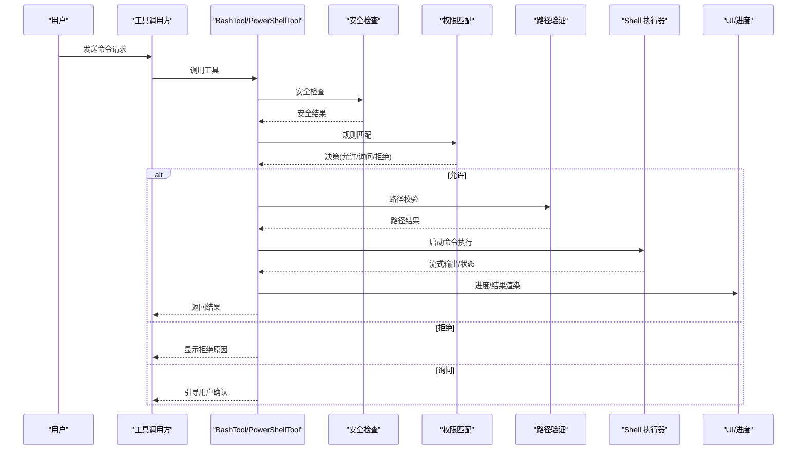
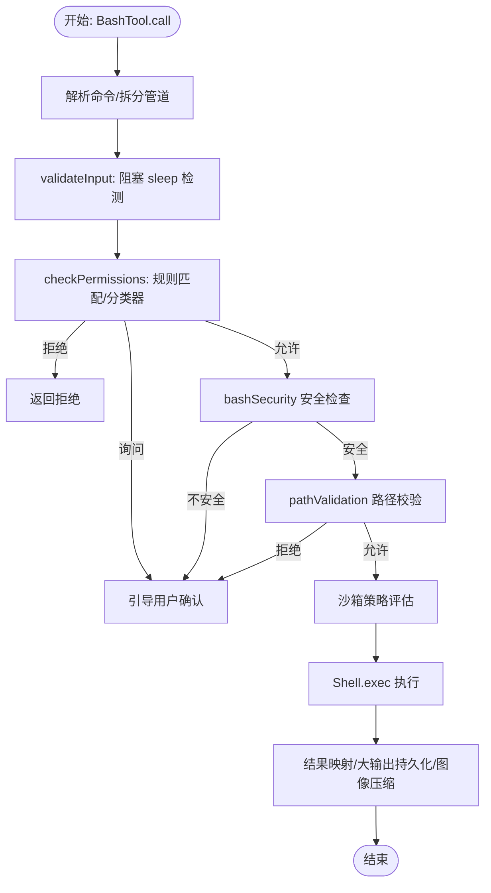
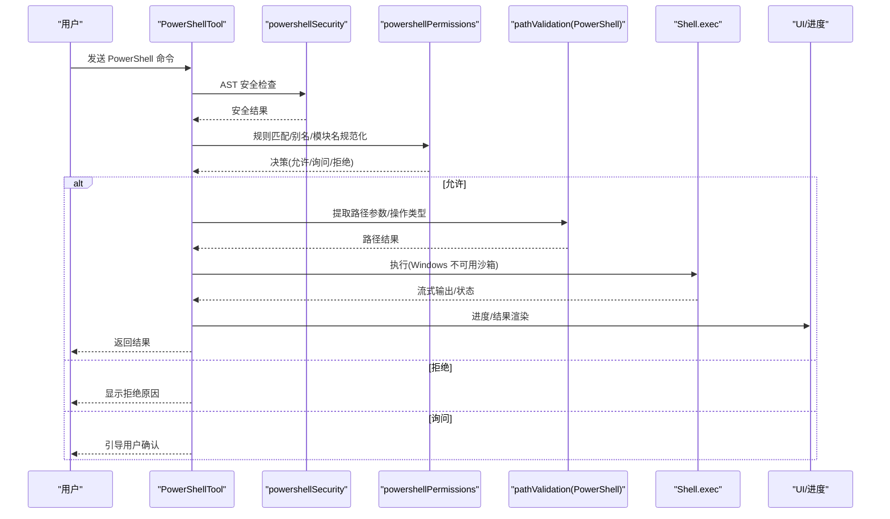

# 系统命令工具

<cite>
**本文档引用的文件**
- [BashTool.tsx](file://src/tools/BashTool/BashTool.tsx)
- [PowerShellTool.tsx](file://src/tools/PowerShellTool/PowerShellTool.tsx)
- [bashSecurity.ts](file://src/tools/BashTool/bashSecurity.ts)
- [powershellSecurity.ts](file://src/tools/PowerShellTool/powershellSecurity.ts)
- [bashPermissions.ts](file://src/tools/BashTool/bashPermissions.ts)
- [powershellPermissions.ts](file://src/tools/PowerShellTool/powershellPermissions.ts)
- [pathValidation.ts](file://src/tools/BashTool/pathValidation.ts)
- [pathValidation.ts](file://src/tools/PowerShellTool/pathValidation.ts)
- [readOnlyValidation.ts](file://src/tools/BashTool/readOnlyValidation.ts)
- [readOnlyValidation.ts](file://src/tools/PowerShellTool/readOnlyValidation.ts)
- [modeValidation.ts](file://src/tools/BashTool/modeValidation.ts)
- [modeValidation.ts](file://src/tools/PowerShellTool/modeValidation.ts)
- [destructiveCommandWarning.ts](file://src/tools/BashTool/destructiveCommandWarning.ts)
- [destructiveCommandWarning.ts](file://src/tools/PowerShellTool/destructiveCommandWarning.ts)
- [shouldUseSandbox.ts](file://src/tools/BashTool/shouldUseSandbox.ts)
- [UI.tsx](file://src/tools/BashTool/UI.tsx)
- [UI.tsx](file://src/tools/PowerShellTool/UI.tsx)
- [commandSemantics.ts](file://src/tools/BashTool/commandSemantics.ts)
- [commandSemantics.ts](file://src/tools/PowerShellTool/commandSemantics.ts)
- [prompt.ts](file://src/tools/BashTool/prompt.ts)
- [prompt.ts](file://src/tools/PowerShellTool/prompt.ts)
- [toolName.ts](file://src/tools/BashTool/toolName.ts)
- [toolName.ts](file://src/tools/PowerShellTool/toolName.ts)
- [sedEditParser.ts](file://src/tools/BashTool/sedEditParser.ts)
- [sedValidation.ts](file://src/tools/BashTool/sedValidation.ts)
- [utils.ts](file://src/tools/BashTool/utils.ts)
- [utils.ts](file://src/tools/PowerShellTool/utils.ts)
- [LocalShellTask.ts](file://src/tasks/LocalShellTask/LocalShellTask.ts)
- [Shell.ts](file://src/utils/Shell.ts)
- [sandbox-adapter.ts](file://src/utils/sandbox/sandbox-adapter.ts)
- [platform.ts](file://src/utils/platform.ts)
- [permissions.ts](file://src/utils/permissions/permissions.ts)
- [PermissionResult.ts](file://src/utils/permissions/PermissionResult.ts)
- [pathValidation.ts](file://src/utils/permissions/pathValidation.ts)
- [filesystem.ts](file://src/utils/permissions/filesystem.ts)
- [bashClassifier.js](file://src/utils/permissions/bashClassifier.js)
- [parser.js](file://src/utils/bash/parser.js)
- [commands.js](file://src/utils/bash/commands.js)
- [shellQuote.js](file://src/utils/bash/shellQuote.js)
- [ast.js](file://src/utils/bash/ast.js)
- [heredoc.js](file://src/utils/bash/heredoc.js)
- [treeSitterAnalysis.js](file://src/utils/bash/treeSitterAnalysis.js)
- [powershell/parser.js](file://src/utils/powershell/parser.js)
- [powershell/dangerousCmdlets.js](file://src/utils/powershell/dangerousCmdlets.js)
- [powershellDetection.js](file://src/utils/shell/powershellDetection.js)
- [cwd.js](file://src/utils/cwd.js)
- [envUtils.js](file://src/utils/envUtils.js)
- [errors.js](file://src/utils/errors.js)
- [file.js](file://src/utils/file.js)
- [format.js](file://src/utils/format.js)
- [stringUtils.js](file://src/utils/stringUtils.js)
- [terminal.js](file://src/utils/terminal.js)
- [toolResultStorage.js](file://src/utils/toolResultStorage.js)
- [task/diskOutput.js](file://src/utils/task/diskOutput.js)
- [task/TaskOutput.js](file://src/utils/task/TaskOutput.js)
- [analytics/index.js](file://src/services/analytics/index.js)
- [claudeCodeHints.js](file://src/utils/claudeCodeHints.js)
- [gitOperationTracking.js](file://src/utils/shared/gitOperationTracking.js)
- [plugin/hintRecommendation.js](file://src/utils/plugins/hintRecommendation.js)
- [log.js](file://src/utils/log.js)
- [semanticBoolean.js](file://src/utils/semanticBoolean.js)
- [semanticNumber.js](file://src/utils/semanticNumber.js)
- [lazySchema.js](file://src/utils/lazySchema.js)
- [Tool.js](file://src/Tool.js)
- [types/tools.js](file://src/types/tools.js)
- [constants/toolLimits.js](file://src/constants/toolLimits.js)
- [bootstrap/state.ts](file://src/bootstrap/state.ts)
- [stubs/bun-bundle.js](file://src/stubs/bun-bundle.js)
</cite>

## 目录
1. [简介](#简介)
2. [项目结构](#项目结构)
3. [核心组件](#核心组件)
4. [架构总览](#架构总览)
5. [详细组件分析](#详细组件分析)
6. [依赖关系分析](#依赖关系分析)
7. [性能考虑](#性能考虑)
8. [故障排除指南](#故障排除指南)
9. [结论](#结论)
10. [附录](#附录)

## 简介
本指南面向系统命令工具的使用者与维护者，全面解析 BashTool（Linux/Unix 命令执行）与 PowerShellTool（Windows PowerShell 执行）的设计与实现。内容涵盖安全机制与权限控制、沙箱隔离策略、路径验证、危险命令检测、输出限制、跨平台兼容性与命令语法差异、最佳实践、性能优化与故障排除。

## 项目结构
系统命令工具位于 `src/tools/` 目录下，分别实现 BashTool 与 PowerShellTool 两大工具模块，并配套大量安全、权限、路径校验与 UI 组件：

- BashTool：Linux/Unix 命令执行，包含安全检查、权限匹配、路径约束、只读判定、沙箱策略、输出处理与 UI 渲染。
- PowerShellTool：Windows PowerShell 执行，包含 AST 解析、安全规则、权限匹配、路径约束、只读判定、沙箱策略与输出处理。
- 共享模块：权限系统、路径校验、平台检测、沙箱适配器、Shell 执行器、任务系统、分析与提示等。

```mermaid
graph TB
subgraph "工具层"
BT["BashTool<br/>Linux/Unix 命令执行"]
PT["PowerShellTool<br/>Windows PowerShell 执行"]
end
subgraph "安全与权限"
SEC_B["bashSecurity<br/>Bash 安全检查"]
SEC_P["powershellSecurity<br/>PowerShell 安全检查"]
PERM_B["bashPermissions<br/>Bash 权限匹配"]
PERM_P["powershellPermissions<br/>PowerShell 权限匹配"]
PATH_B["pathValidation(Bash)<br/>Bash 路径校验"]
PATH_P["pathValidation(PowerShell)<br/>PowerShell 路径校验"]
READ_B["readOnlyValidation(Bash)<br/>Bash 只读判定"]
READ_P["readOnlyValidation(PowerShell)<br/>PowerShell 只读判定"]
MODE_B["modeValidation(Bash)<br/>Bash 模式校验"]
MODE_P["modeValidation(PowerShell)<br/>PowerShell 模式校验"]
end
subgraph "执行与平台"
SH["Shell.ts<br/>Shell 执行器"]
LS["LocalShellTask.ts<br/>本地 Shell 任务"]
SB["sandbox-adapter.ts<br/>沙箱适配器"]
PD["platform.ts<br/>平台检测"]
PSDET["powershellDetection.js<br/>PowerShell 路径检测"]
end
subgraph "UI 与结果"
UIB["UI(Bash)"]
UIP["UI(PowerShell)"]
SEM["commandSemantics<br/>命令语义解释"]
PROMPT["prompt<br/>提示词与默认超时"]
TOOLNAME["toolName<br/>工具名称"]
end
BT --> SEC_B
BT --> PERM_B
BT --> PATH_B
BT --> READ_B
BT --> MODE_B
BT --> SH
BT --> LS
BT --> SB
BT --> UIB
BT --> SEM
BT --> PROMPT
BT --> TOOLNAME
PT --> SEC_P
PT --> PERM_P
PT --> PATH_P
PT --> READ_P
PT --> MODE_P
PT --> SH
PT --> LS
PT --> SB
PT --> PSDET
PT --> UIP
PT --> SEM
PT --> PROMPT
PT --> TOOLNAME
```

图表来源
- [BashTool.tsx](file://src/tools/BashTool/BashTool.tsx)
- [PowerShellTool.tsx](file://src/tools/PowerShellTool/PowerShellTool.tsx)
- [bashSecurity.ts](file://src/tools/BashTool/bashSecurity.ts)
- [powershellSecurity.ts](file://src/tools/PowerShellTool/powershellSecurity.ts)
- [bashPermissions.ts](file://src/tools/BashTool/bashPermissions.ts)
- [powershellPermissions.ts](file://src/tools/PowerShellTool/powershellPermissions.ts)
- [pathValidation.ts](file://src/tools/BashTool/pathValidation.ts)
- [pathValidation.ts](file://src/tools/PowerShellTool/pathValidation.ts)
- [readOnlyValidation.ts](file://src/tools/BashTool/readOnlyValidation.ts)
- [readOnlyValidation.ts](file://src/tools/PowerShellTool/readOnlyValidation.ts)
- [modeValidation.ts](file://src/tools/BashTool/modeValidation.ts)
- [modeValidation.ts](file://src/tools/PowerShellTool/modeValidation.ts)
- [Shell.ts](file://src/utils/Shell.ts)
- [LocalShellTask.ts](file://src/tasks/LocalShellTask/LocalShellTask.ts)
- [sandbox-adapter.ts](file://src/utils/sandbox/sandbox-adapter.ts)
- [platform.ts](file://src/utils/platform.ts)
- [powershellDetection.js](file://src/utils/shell/powershellDetection.js)
- [UI.tsx](file://src/tools/BashTool/UI.tsx)
- [UI.tsx](file://src/tools/PowerShellTool/UI.tsx)
- [commandSemantics.ts](file://src/tools/BashTool/commandSemantics.ts)
- [commandSemantics.ts](file://src/tools/PowerShellTool/commandSemantics.ts)
- [prompt.ts](file://src/tools/BashTool/prompt.ts)
- [prompt.ts](file://src/tools/PowerShellTool/prompt.ts)
- [toolName.ts](file://src/tools/BashTool/toolName.ts)
- [toolName.ts](file://src/tools/PowerShellTool/toolName.ts)

章节来源
- [BashTool.tsx](file://src/tools/BashTool/BashTool.tsx)
- [PowerShellTool.tsx](file://src/tools/PowerShellTool/PowerShellTool.tsx)

## 核心组件
- 工具定义与调用流程：通过 `buildTool` 构建工具，定义输入/输出模式、权限检查、只读判定、UI 渲染、结果映射与进度回调。
- 安全检查：Bash 使用 AST/正则/启发式组合；PowerShell 使用 AST 严格解析，覆盖动态命令名、脚本块注入、子表达式、可扩展字符串、拼接参数等。
- 权限匹配：基于规则（exact/prefix/wildcard）与分类器（bashClassifier），支持建议生成与拒绝/询问/允许三态决策。
- 路径验证：提取命令参数中的路径，结合工作目录白名单与操作类型（读/写/创建）进行安全校验，阻断危险路径与路径穿越。
- 沙箱隔离：根据平台与配置决定是否启用沙箱包装，Windows 原生不支持沙箱但遵循企业策略拒绝。
- 输出处理：大输出持久化、图像识别与压缩、错误语义解释、进度流式传输与后台任务管理。

章节来源
- [BashTool.tsx](file://src/tools/BashTool/BashTool.tsx)
- [PowerShellTool.tsx](file://src/tools/PowerShellTool/PowerShellTool.tsx)
- [bashSecurity.ts](file://src/tools/BashTool/bashSecurity.ts)
- [powershellSecurity.ts](file://src/tools/PowerShellTool/powershellSecurity.ts)
- [bashPermissions.ts](file://src/tools/BashTool/bashPermissions.ts)
- [powershellPermissions.ts](file://src/tools/PowerShellTool/powershellPermissions.ts)
- [pathValidation.ts](file://src/tools/BashTool/pathValidation.ts)
- [pathValidation.ts](file://src/tools/PowerShellTool/pathValidation.ts)
- [sandbox-adapter.ts](file://src/utils/sandbox/sandbox-adapter.ts)
- [platform.ts](file://src/utils/platform.ts)

## 架构总览
系统命令工具采用“工具定义 + 多层安全检查 + 权限匹配 + 执行器 + 结果处理”的分层架构。BashTool 与 PowerShellTool 在安全与权限层面共享相似设计，但在具体实现上因平台差异而不同。

图表来源
- [BashTool.tsx](file://src/tools/BashTool/BashTool.tsx)
- [PowerShellTool.tsx](file://src/tools/PowerShellTool/PowerShellTool.tsx)
- [bashSecurity.ts](file://src/tools/BashTool/bashSecurity.ts)
- [powershellSecurity.ts](file://src/tools/PowerShellTool/powershellSecurity.ts)
- [bashPermissions.ts](file://src/tools/BashTool/bashPermissions.ts)
- [powershellPermissions.ts](file://src/tools/PowerShellTool/powershellPermissions.ts)
- [pathValidation.ts](file://src/tools/BashTool/pathValidation.ts)
- [pathValidation.ts](file://src/tools/PowerShellTool/pathValidation.ts)
- [Shell.ts](file://src/utils/Shell.ts)
- [UI.tsx](file://src/tools/BashTool/UI.tsx)
- [UI.tsx](file://src/tools/PowerShellTool/UI.tsx)

## 详细组件分析

### BashTool 实现细节
- 输入/输出模式：严格 Schema 校验，支持描述、超时、后台运行、沙箱覆盖、sed 预览模拟等。
- 只读判定：基于命令拆分与安全检查，判断是否为只读/搜索/列表类命令，影响并发安全与 UI 折叠。
- 安全检查：覆盖 heredoc 替换、命令替换、变量注入、重定向剥离、Zsh 特殊命令、git 提交消息、jq 危险参数等。
- 权限匹配：支持 exact/prefix/wildcard 规则，结合 bashClassifier 分类器与建议生成，拒绝/询问/允许三态。
- 路径验证：提取 rm/rm -rf、find、grep/rg、sed、jq 等命令的路径参数，结合工作目录白名单与操作类型进行校验。
- 沙箱策略：根据平台与配置决定是否启用沙箱包装，支持危险命令禁用沙箱覆盖。
- 输出处理：大输出持久化到工具结果目录，图像识别与压缩，错误语义解释，进度流式传输，后台任务注册与通知。

图表来源
- [BashTool.tsx](file://src/tools/BashTool/BashTool.tsx)
- [bashSecurity.ts](file://src/tools/BashTool/bashSecurity.ts)
- [bashPermissions.ts](file://src/tools/BashTool/bashPermissions.ts)
- [pathValidation.ts](file://src/tools/BashTool/pathValidation.ts)
- [shouldUseSandbox.ts](file://src/tools/BashTool/shouldUseSandbox.ts)
- [Shell.ts](file://src/utils/Shell.ts)

章节来源
- [BashTool.tsx](file://src/tools/BashTool/BashTool.tsx)
- [bashSecurity.ts](file://src/tools/BashTool/bashSecurity.ts)
- [bashPermissions.ts](file://src/tools/BashTool/bashPermissions.ts)
- [pathValidation.ts](file://src/tools/BashTool/pathValidation.ts)
- [shouldUseSandbox.ts](file://src/tools/BashTool/shouldUseSandbox.ts)
- [UI.tsx](file://src/tools/BashTool/UI.tsx)
- [commandSemantics.ts](file://src/tools/BashTool/commandSemantics.ts)
- [prompt.ts](file://src/tools/BashTool/prompt.ts)
- [toolName.ts](file://src/tools/BashTool/toolName.ts)
- [sedEditParser.ts](file://src/tools/BashTool/sedEditParser.ts)
- [sedValidation.ts](file://src/tools/BashTool/sedValidation.ts)
- [utils.ts](file://src/tools/BashTool/utils.ts)

### PowerShellTool 实现细节
- 输入/输出模式：严格 Schema 校验，支持描述、超时、后台运行、沙箱覆盖。
- 安全检查：AST 解析，覆盖动态命令名、脚本块注入、子表达式、可扩展字符串、拼接参数、COM 对象、下载链等。
- 权限匹配：基于 exact/prefix/wildcard 规则，大小写不敏感匹配，别名与模块限定名规范化，支持建议生成。
- 路径验证：按 cmdlet 参数配置提取路径，区分读/写/创建操作，处理 -Uri 等非路径参数，支持 optionalWrite 场景。
- 沙箱策略：Windows 原生不支持沙箱，遵循企业策略拒绝执行；其他平台与 BashTool 一致。
- 输出处理：大输出持久化、图像识别与压缩、错误语义解释、进度流式传输、后台任务注册与通知。

图表来源
- [PowerShellTool.tsx](file://src/tools/PowerShellTool/PowerShellTool.tsx)
- [powershellSecurity.ts](file://src/tools/PowerShellTool/powershellSecurity.ts)
- [powershellPermissions.ts](file://src/tools/PowerShellTool/powershellPermissions.ts)
- [pathValidation.ts](file://src/tools/PowerShellTool/pathValidation.ts)
- [powershellDetection.js](file://src/utils/shell/powershellDetection.js)
- [platform.ts](file://src/utils/platform.ts)
- [Shell.ts](file://src/utils/Shell.ts)
- [UI.tsx](file://src/tools/PowerShellTool/UI.tsx)

章节来源
- [PowerShellTool.tsx](file://src/tools/PowerShellTool/PowerShellTool.tsx)
- [powershellSecurity.ts](file://src/tools/PowerShellTool/powershellSecurity.ts)
- [powershellPermissions.ts](file://src/tools/PowerShellTool/powershellPermissions.ts)
- [pathValidation.ts](file://src/tools/PowerShellTool/pathValidation.ts)
- [powershellDetection.js](file://src/utils/shell/powershellDetection.js)
- [platform.ts](file://src/utils/platform.ts)
- [UI.tsx](file://src/tools/PowerShellTool/UI.tsx)
- [commandSemantics.ts](file://src/tools/PowerShellTool/commandSemantics.ts)
- [prompt.ts](file://src/tools/PowerShellTool/prompt.ts)
- [toolName.ts](file://src/tools/PowerShellTool/toolName.ts)
- [utils.ts](file://src/tools/PowerShellTool/utils.ts)

### 安全机制与权限控制
- Bash 安全检查：覆盖 heredoc 安全替换、命令替换、变量注入、重定向剥离、Zsh 危险命令、git 提交消息、jq 危险参数、控制字符、Unicode 空白等。
- PowerShell 安全检查：覆盖动态命令名、脚本块注入、子表达式、可扩展字符串、拼接参数、COM 对象、下载链、编码参数、嵌套 pwsh 等。
- 权限匹配：exact/prefix/wildcard 规则，结合 bashClassifier 与建议生成，支持 deny/ask/allow 三态决策。
- 路径验证：提取命令参数中的路径，结合工作目录白名单与操作类型（读/写/创建）进行校验，阻断危险路径与路径穿越。
- 沙箱策略：根据平台与配置决定是否启用沙箱包装，Windows 原生不支持沙箱但遵循企业策略拒绝。

章节来源
- [bashSecurity.ts](file://src/tools/BashTool/bashSecurity.ts)
- [powershellSecurity.ts](file://src/tools/PowerShellTool/powershellSecurity.ts)
- [bashPermissions.ts](file://src/tools/BashTool/bashPermissions.ts)
- [powershellPermissions.ts](file://src/tools/PowerShellTool/powershellPermissions.ts)
- [pathValidation.ts](file://src/tools/BashTool/pathValidation.ts)
- [pathValidation.ts](file://src/tools/PowerShellTool/pathValidation.ts)
- [sandbox-adapter.ts](file://src/utils/sandbox/sandbox-adapter.ts)
- [platform.ts](file://src/utils/platform.ts)

### 沙箱隔离与平台差异
- BashTool：在 Linux/macOS/WSL2 上通过沙箱适配器包装命令执行；在 Windows 原生不支持沙箱，遵循企业策略拒绝。
- PowerShellTool：Windows 原生不支持沙箱，遵循企业策略拒绝；其他平台与 BashTool 一致。
- 平台检测：通过 `getPlatform()` 判断当前平台，影响沙箱启用与某些行为。

章节来源
- [shouldUseSandbox.ts](file://src/tools/BashTool/shouldUseSandbox.ts)
- [powershellSecurity.ts](file://src/tools/PowerShellTool/powershellSecurity.ts)
- [platform.ts](file://src/utils/platform.ts)
- [sandbox-adapter.ts](file://src/utils/sandbox/sandbox-adapter.ts)

### 路径验证与危险命令检测
- BashTool：针对 rm/rmdir、find、grep/rg、sed、jq、git 等命令提取路径参数，结合工作目录白名单与操作类型进行校验，阻断危险路径与路径穿越。
- PowerShellTool：按 cmdlet 参数配置提取路径，区分读/写/创建操作，处理 -Uri 等非路径参数，支持 optionalWrite 场景。

章节来源
- [pathValidation.ts](file://src/tools/BashTool/pathValidation.ts)
- [pathValidation.ts](file://src/tools/PowerShellTool/pathValidation.ts)

### 输出限制与 UI 渲染
- 大输出持久化：超过阈值时将输出文件链接/复制到工具结果目录，避免内存溢出。
- 图像识别与压缩：自动识别图像数据并进行尺寸与大小限制。
- 错误语义解释：通过 `interpretCommandResult` 将退出码解释为语义化信息。
- 进度流式传输：通过 `AsyncGenerator` 与 `ToolCallProgress` 实时反馈输出与状态。
- UI 渲染：BashTool 与 PowerShellTool 各自提供 UI 组件，支持进度、队列、错误与结果展示。

章节来源
- [BashTool.tsx](file://src/tools/BashTool/BashTool.tsx)
- [PowerShellTool.tsx](file://src/tools/PowerShellTool/PowerShellTool.tsx)
- [UI.tsx](file://src/tools/BashTool/UI.tsx)
- [UI.tsx](file://src/tools/PowerShellTool/UI.tsx)
- [commandSemantics.ts](file://src/tools/BashTool/commandSemantics.ts)
- [commandSemantics.ts](file://src/tools/PowerShellTool/commandSemantics.ts)
- [toolResultStorage.js](file://src/utils/toolResultStorage.js)
- [task/diskOutput.js](file://src/utils/task/diskOutput.js)
- [task/TaskOutput.js](file://src/utils/task/TaskOutput.js)
- [terminal.js](file://src/utils/terminal.js)

### 使用示例与最佳实践
- 文件操作
  - Bash: `ls -la`、`find . -name "*.log"`、`grep -r "error" .`、`sed -i 's/old/new/g' file.txt`、`rm -rf /tmp/*`（需明确批准）
  - PowerShell: `Get-ChildItem -Path . -Recurse`、`Select-String -Path .\*.log -Pattern "error"`、`Remove-Item -Path .\temp\* -Recurse -Force`（需明确批准）
- 系统信息查询
  - Bash: `uname -a`、`df -h`、`ps aux | head -20`
  - PowerShell: `Get-ComputerInfo`、`Get-PSDrive`、`Get-Process | Sort-Object CPU -Descending | Select-Object -First 10`
- 进程管理
  - Bash: `ps aux | grep nginx`、`kill -9 PID`
  - PowerShell: `Get-Process -Name nginx`、`Stop-Process -Id PID`
- 最佳实践
  - 优先使用只读命令（如 `ls`、`cat`、`grep`）以提升并发安全性。
  - 对写操作（如 `rm`、`mv`、`sed`）提供明确描述与超时设置。
  - 启用沙箱以限制系统资源访问，避免在 Windows 原生环境绕过策略。
  - 使用后台运行模式处理长时间任务，避免阻塞主会话。

章节来源
- [BashTool.tsx](file://src/tools/BashTool/BashTool.tsx)
- [PowerShellTool.tsx](file://src/tools/PowerShellTool/PowerShellTool.tsx)
- [prompt.ts](file://src/tools/BashTool/prompt.ts)
- [prompt.ts](file://src/tools/PowerShellTool/prompt.ts)

## 依赖关系分析
系统命令工具的依赖关系围绕“工具定义”、“安全与权限”、“执行与平台”、“UI 与结果”四大维度展开，各模块职责清晰、耦合度低，便于扩展与维护。

```mermaid
graph TB
BT["BashTool.tsx"] --> SEC_B["bashSecurity.ts"]
BT --> PERM_B["bashPermissions.ts"]
BT --> PATH_B["pathValidation(Bash)"]
BT --> READ_B["readOnlyValidation(Bash)"]
BT --> MODE_B["modeValidation(Bash)"]
BT --> SH["Shell.ts"]
BT --> LS["LocalShellTask.ts"]
BT --> SB["sandbox-adapter.ts"]
BT --> UIB["UI(Bash)"]
PT["PowerShellTool.tsx"] --> SEC_P["powershellSecurity.ts"]
PT --> PERM_P["powershellPermissions.ts"]
PT --> PATH_P["pathValidation(PowerShell)"]
PT --> READ_P["readOnlyValidation(PowerShell)"]
PT --> MODE_P["modeValidation(PowerShell)"]
PT --> SH
PT --> LS
PT --> SB
PT --> PSDET["powershellDetection.js"]
PT --> UIP["UI(PowerShell)"]
SEC_B --> AST["ast.js"]
SEC_B --> PARSER["parser.js"]
SEC_B --> CMD["commands.js"]
SEC_B --> SQ["shellQuote.js"]
SEC_B --> HEREDOC["heredoc.js"]
SEC_B --> TSA["treeSitterAnalysis.js"]
SEC_P --> PARSER_P["powershell/parser.js"]
SEC_P --> DC["dangerousCmdlets.js"]
PERM_B --> BC["bashClassifier.js"]
PERM_B --> PERM["permissions.ts"]
PERM_B --> PR["PermissionResult.ts"]
PERM_B --> FS["filesystem.ts"]
PERM_B --> PV["pathValidation.ts(utils)"]
PERM_P --> PARSER_P
PERM_P --> FS
PERM_P --> READ_P
PERM_P --> MODE_P
PATH_B --> PV["pathValidation.ts(utils)"]
PATH_P --> PV
SH --> LS
LS --> SB
SB --> PD["platform.ts"]
```

图表来源
- [BashTool.tsx](file://src/tools/BashTool/BashTool.tsx)
- [PowerShellTool.tsx](file://src/tools/PowerShellTool/PowerShellTool.tsx)
- [bashSecurity.ts](file://src/tools/BashTool/bashSecurity.ts)
- [powershellSecurity.ts](file://src/tools/PowerShellTool/powershellSecurity.ts)
- [bashPermissions.ts](file://src/tools/BashTool/bashPermissions.ts)
- [powershellPermissions.ts](file://src/tools/PowerShellTool/powershellPermissions.ts)
- [pathValidation.ts](file://src/tools/BashTool/pathValidation.ts)
- [pathValidation.ts](file://src/tools/PowerShellTool/pathValidation.ts)
- [Shell.ts](file://src/utils/Shell.ts)
- [LocalShellTask.ts](file://src/tasks/LocalShellTask/LocalShellTask.ts)
- [sandbox-adapter.ts](file://src/utils/sandbox/sandbox-adapter.ts)
- [platform.ts](file://src/utils/platform.ts)
- [powershellDetection.js](file://src/utils/shell/powershellDetection.js)
- [ast.js](file://src/utils/bash/ast.js)
- [parser.js](file://src/utils/bash/parser.js)
- [commands.js](file://src/utils/bash/commands.js)
- [shellQuote.js](file://src/utils/bash/shellQuote.js)
- [heredoc.js](file://src/utils/bash/heredoc.js)
- [treeSitterAnalysis.js](file://src/utils/bash/treeSitterAnalysis.js)
- [powershell/parser.js](file://src/utils/powershell/parser.js)
- [powershell/dangerousCmdlets.js](file://src/utils/powershell/dangerousCmdlets.js)
- [bashClassifier.js](file://src/utils/permissions/bashClassifier.js)
- [permissions.ts](file://src/utils/permissions/permissions.ts)
- [PermissionResult.ts](file://src/utils/permissions/PermissionResult.ts)
- [filesystem.ts](file://src/utils/permissions/filesystem.ts)
- [pathValidation.ts](file://src/utils/permissions/pathValidation.ts)

章节来源
- [BashTool.tsx](file://src/tools/BashTool/BashTool.tsx)
- [PowerShellTool.tsx](file://src/tools/PowerShellTool/PowerShellTool.tsx)

## 性能考虑
- 流式输出与进度：通过 `AsyncGenerator` 与 `ToolCallProgress` 实时反馈，避免一次性加载大量输出。
- 大输出持久化：超过阈值时将输出文件链接/复制到工具结果目录，减少内存占用。
- 背景任务：长耗时命令自动后台运行，避免阻塞主会话；支持用户手动后台化与助手模式预算。
- 并发安全：只读命令具备并发安全属性，可并行执行以提升吞吐量。
- 解析与缓存：AST 解析与分类器结果进行缓存，减少重复计算；复杂命令拆分存在上限以防止 ReDoS。

章节来源
- [BashTool.tsx](file://src/tools/BashTool/BashTool.tsx)
- [PowerShellTool.tsx](file://src/tools/PowerShellTool/PowerShellTool.tsx)
- [LocalShellTask.ts](file://src/tasks/LocalShellTask/LocalShellTask.ts)
- [toolResultStorage.js](file://src/utils/toolResultStorage.js)
- [terminal.js](file://src/utils/terminal.js)

## 故障排除指南
- 命令被拒绝
  - 检查规则匹配：exact/prefix/wildcard 是否命中 deny/ask/allow。
  - 安全检查：查看 bashSecurity/powershellSecurity 的触发项（如命令替换、动态命令名、下载链等）。
  - 路径验证：确认路径在工作目录白名单内且操作类型正确。
- Windows 原生不支持沙箱
  - 若企业策略要求沙箱，PowerShellTool 将直接拒绝执行；请在支持沙箱的平台或使用 WSL2。
- 超时与中断
  - 设置合理超时；长时间任务使用后台运行；中断后会显示中止信息。
- 输出过大
  - 系统会将大输出持久化到工具结果目录，可通过文件读取工具访问。
- Git 操作异常
  - 注意 `.git/index.lock` 错误，可能需要等待锁释放或重启 Git 服务。
- UNC 路径风险
  - PowerShellTool 会对潜在的 UNC 路径触发询问，避免网络请求与凭据泄露。

章节来源
- [bashPermissions.ts](file://src/tools/BashTool/bashPermissions.ts)
- [powershellPermissions.ts](file://src/tools/PowerShellTool/powershellPermissions.ts)
- [bashSecurity.ts](file://src/tools/BashTool/bashSecurity.ts)
- [powershellSecurity.ts](file://src/tools/PowerShellTool/powershellSecurity.ts)
- [pathValidation.ts](file://src/tools/BashTool/pathValidation.ts)
- [pathValidation.ts](file://src/tools/PowerShellTool/pathValidation.ts)
- [powershellSecurity.ts](file://src/tools/PowerShellTool/powershellSecurity.ts)
- [toolResultStorage.js](file://src/utils/toolResultStorage.js)
- [errors.js](file://src/utils/errors.js)

## 结论
系统命令工具通过多层安全检查、严格的权限匹配、完善的路径验证与沙箱策略，在保证功能强大的同时兼顾安全性与可维护性。BashTool 与 PowerShellTool 在设计上保持一致性，同时针对平台差异做出差异化处理。推荐在生产环境中启用沙箱、合理设置超时与后台运行、优先使用只读命令，并对写操作提供明确描述与审批流程。

## 附录
- 关键实现参考路径
  - BashTool 主入口：[BashTool.tsx](file://src/tools/BashTool/BashTool.tsx)
  - PowerShellTool 主入口：[PowerShellTool.tsx](file://src/tools/PowerShellTool/PowerShellTool.tsx)
  - Bash 安全检查：[bashSecurity.ts](file://src/tools/BashTool/bashSecurity.ts)
  - PowerShell 安全检查：[powershellSecurity.ts](file://src/tools/PowerShellTool/powershellSecurity.ts)
  - Bash 权限匹配：[bashPermissions.ts](file://src/tools/BashTool/bashPermissions.ts)
  - PowerShell 权限匹配：[powershellPermissions.ts](file://src/tools/PowerShellTool/powershellPermissions.ts)
  - Bash 路径验证：[pathValidation.ts](file://src/tools/BashTool/pathValidation.ts)
  - PowerShell 路径验证：[pathValidation.ts](file://src/tools/PowerShellTool/pathValidation.ts)
  - 沙箱适配器：[sandbox-adapter.ts](file://src/utils/sandbox/sandbox-adapter.ts)
  - 平台检测：[platform.ts](file://src/utils/platform.ts)
  - Shell 执行器：[Shell.ts](file://src/utils/Shell.ts)
  - 本地 Shell 任务：[LocalShellTask.ts](file://src/tasks/LocalShellTask/LocalShellTask.ts)
  - UI 组件：[UI.tsx](file://src/tools/BashTool/UI.tsx)、[UI.tsx](file://src/tools/PowerShellTool/UI.tsx)
  - 命令语义解释：[commandSemantics.ts](file://src/tools/BashTool/commandSemantics.ts)、[commandSemantics.ts](file://src/tools/PowerShellTool/commandSemantics.ts)
  - 提示词与默认超时：[prompt.ts](file://src/tools/BashTool/prompt.ts)、[prompt.ts](file://src/tools/PowerShellTool/prompt.ts)
  - 工具名称：[toolName.ts](file://src/tools/BashTool/toolName.ts)、[toolName.ts](file://src/tools/PowerShellTool/toolName.ts)
  - sed 编辑解析与校验：[sedEditParser.ts](file://src/tools/BashTool/sedEditParser.ts)、[sedValidation.ts](file://src/tools/BashTool/sedValidation.ts)
  - 工具通用工具函数：[utils.ts](file://src/tools/BashTool/utils.ts)、[utils.ts](file://src/tools/PowerShellTool/utils.ts)