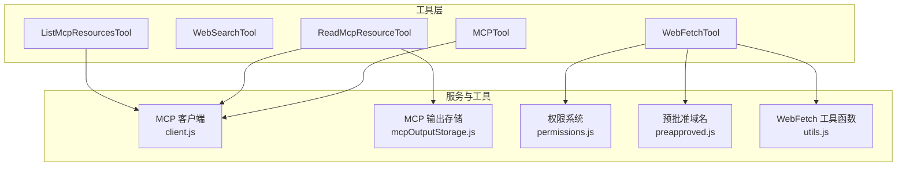
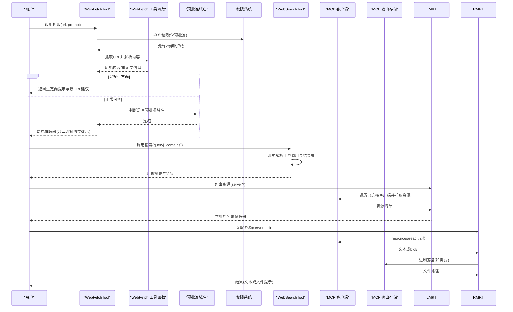
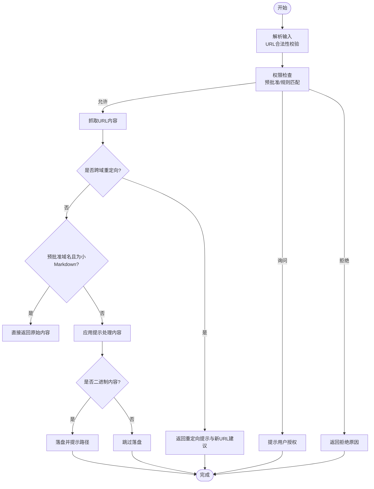
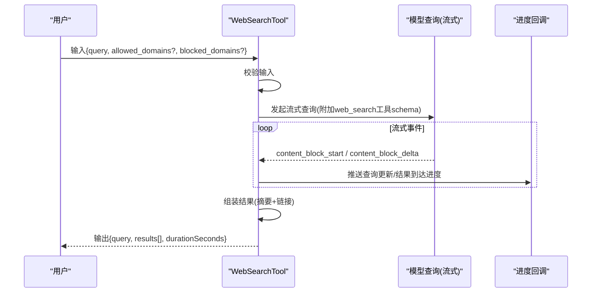
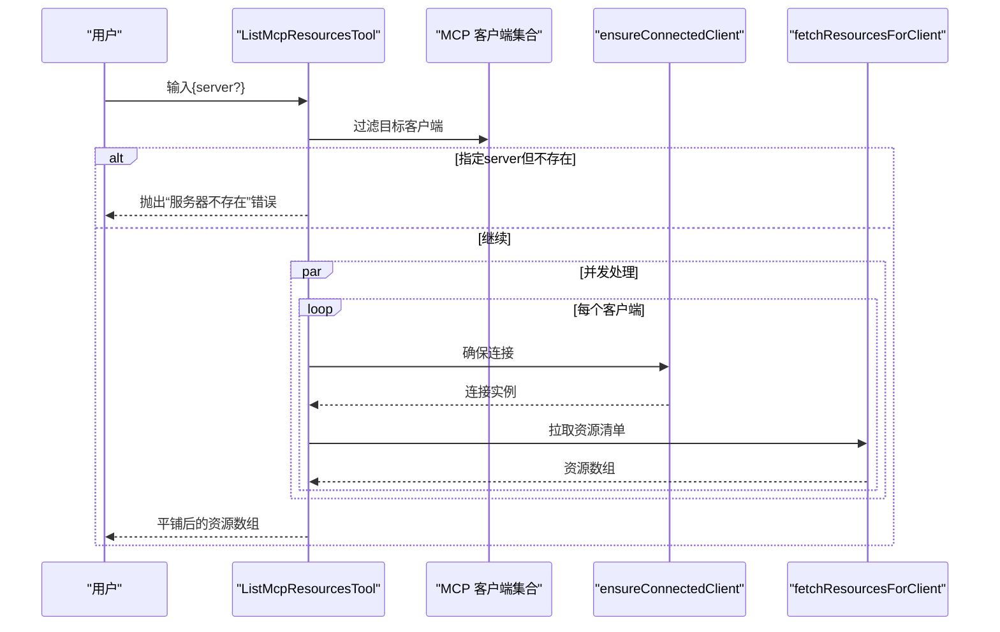
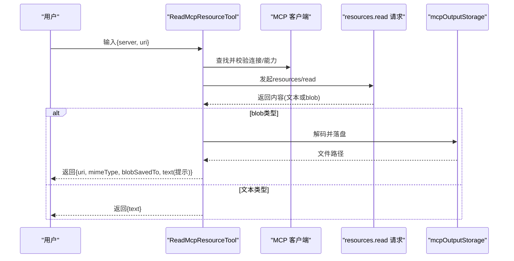
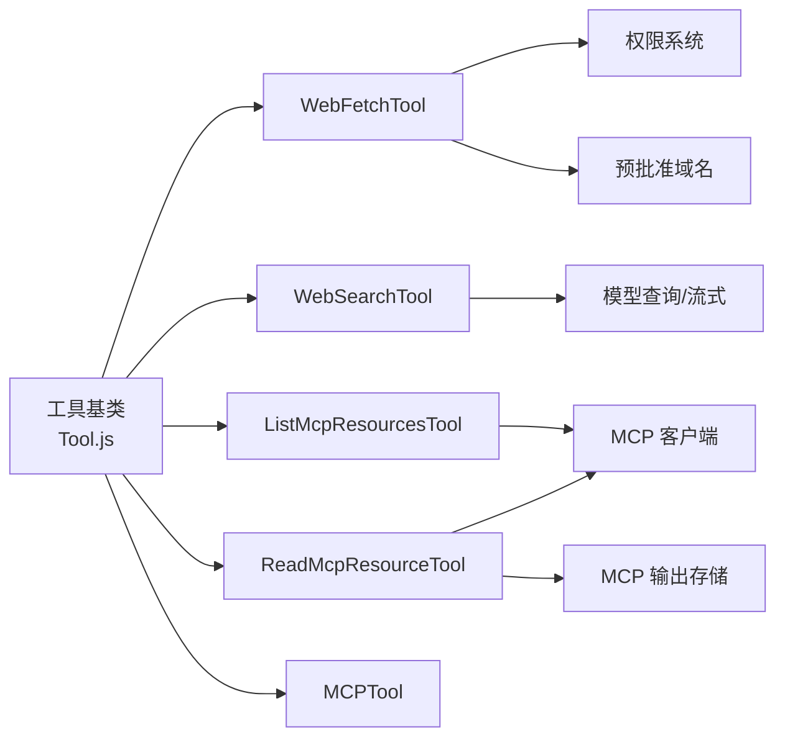

# 网络和Web工具

<cite>
**本文引用的文件**
- [WebFetchTool.ts](file://src/tools/WebFetchTool/WebFetchTool.ts)
- [WebSearchTool.ts](file://src/tools/WebSearchTool/WebSearchTool.ts)
- [ListMcpResourcesTool.ts](file://src/tools/ListMcpResourcesTool/ListMcpResourcesTool.ts)
- [ReadMcpResourceTool.ts](file://src/tools/ReadMcpResourceTool/ReadMcpResourceTool.ts)
- [MCPTool.ts](file://src/tools/MCPTool/MCPTool.ts)
- [client.js](file://src/services/mcp/client.js)
- [mcpOutputStorage.js](file://src/utils/mcpOutputStorage.js)
- [permissions.js](file://src/utils/permissions/permissions.js)
- [preapproved.js](file://src/tools/WebFetchTool/preapproved.js)
- [utils.js](file://src/tools/WebFetchTool/utils.js)
- [UI.js](file://src/tools/WebFetchTool/UI.js)
- [prompt.js](file://src/tools/WebFetchTool/prompt.js)
- [prompt.js](file://src/tools/WebSearchTool/prompt.js)
- [UI.js](file://src/tools/WebSearchTool/UI.js)
- [prompt.js](file://src/tools/ListMcpResourcesTool/prompt.js)
- [UI.js](file://src/tools/ListMcpResourcesTool/UI.js)
- [prompt.js](file://src/tools/ReadMcpResourceTool/prompt.js)
- [UI.js](file://src/tools/ReadMcpResourceTool/UI.js)
- [tools.ts](file://src/constants/tools.ts)
- [toolLimits.ts](file://src/constants/toolLimits.ts)
- [rateLimitMessages.ts](file://src/services/rateLimitMessages.ts)
- [mockRateLimits.ts](file://src/services/mockRateLimits.ts)
- [claudeAiLimits.ts](file://src/services/claudeAiLimits.ts)
- [claudeAiLimitsHook.ts](file://src/services/claudeAiLimitsHook.ts)
- [analytics/growthbook.js](file://src/services/analytics/growthbook.js)
- [messages.js](file://src/utils/messages.js)
- [model.js](file://src/utils/model/model.js)
- [systemPromptType.js](file://src/utils/systemPromptType.js)
- [slowOperations.js](file://src/utils/slowOperations.js)
- [terminal.js](file://src/utils/terminal.js)
- [log.js](file://src/utils/log.js)
- [format.js](file://src/utils/format.js)
- [lazySchema.js](file://src/utils/lazySchema.js)
- [Tool.js](file://src/Tool.ts)
</cite>

## 目录
1. [简介](#简介)
2. [项目结构](#项目结构)
3. [核心组件](#核心组件)
4. [架构总览](#架构总览)
5. [详细组件分析](#详细组件分析)
6. [依赖关系分析](#依赖关系分析)
7. [性能考量](#性能考量)
8. [故障排查指南](#故障排查指南)
9. [结论](#结论)
10. [附录](#附录)

## 简介
本文件为网络与Web工具的完整技术文档，聚焦以下工具：
- WebFetchTool：从指定URL抓取网页内容，并可对内容进行提示后处理或直接返回预批准内容
- WebSearchTool：通过模型能力执行网络搜索，聚合结果并生成可溯源的摘要与链接
- ListMcpResourcesTool：枚举已连接MCP服务器提供的资源清单
- ReadMcpResourceTool：按URI读取MCP资源，支持文本与二进制内容，自动落盘并提示保存位置

文档涵盖安全限制、URL验证、内容过滤、速率限制、MCP协议应用与资源管理机制，并提供实际使用场景与最佳实践。

## 项目结构
这些工具均位于 src/tools 下，采用统一的工具构建器模式，具备输入/输出模式校验、权限检查、UI渲染、结果映射等功能。MCP相关能力由 src/services/mcp 与 src/utils/mcpOutputStorage 提供支撑。

图表来源
- [WebFetchTool.ts:1-319](file://src/tools/WebFetchTool/WebFetchTool.ts#L1-L319)
- [WebSearchTool.ts:1-436](file://src/tools/WebSearchTool/WebSearchTool.ts#L1-L436)
- [ListMcpResourcesTool.ts:1-124](file://src/tools/ListMcpResourcesTool/ListMcpResourcesTool.ts#L1-L124)
- [ReadMcpResourceTool.ts:1-159](file://src/tools/ReadMcpResourceTool/ReadMcpResourceTool.ts#L1-L159)
- [MCPTool.ts:1-78](file://src/tools/MCPTool/MCPTool.ts#L1-L78)
- [client.js](file://src/services/mcp/client.js)
- [mcpOutputStorage.js](file://src/utils/mcpOutputStorage.js)
- [permissions.js](file://src/utils/permissions/permissions.js)
- [preapproved.js](file://src/tools/WebFetchTool/preapproved.js)
- [utils.js](file://src/tools/WebFetchTool/utils.js)

章节来源
- [WebFetchTool.ts:1-319](file://src/tools/WebFetchTool/WebFetchTool.ts#L1-L319)
- [WebSearchTool.ts:1-436](file://src/tools/WebSearchTool/WebSearchTool.ts#L1-L436)
- [ListMcpResourcesTool.ts:1-124](file://src/tools/ListMcpResourcesTool/ListMcpResourcesTool.ts#L1-L124)
- [ReadMcpResourceTool.ts:1-159](file://src/tools/ReadMcpResourceTool/ReadMcpResourceTool.ts#L1-L159)
- [MCPTool.ts:1-78](file://src/tools/MCPTool/MCPTool.ts#L1-L78)

## 核心组件
- WebFetchTool：负责URL抓取、重定向检测、内容处理与持久化提示；内置预批准域名豁免与权限规则匹配
- WebSearchTool：封装模型侧Web搜索能力，流式解析工具调用与结果块，生成可溯源摘要与链接
- ListMcpResourcesTool：遍历已连接MCP客户端，批量拉取资源清单，缓存与健康保障
- ReadMcpResourceTool：按URI读取资源，自动处理二进制blob并落盘，返回文本或文件路径提示
- MCPTool：通用MCP工具适配器，用于承载动态MCP工具的描述、权限与UI

章节来源
- [WebFetchTool.ts:66-307](file://src/tools/WebFetchTool/WebFetchTool.ts#L66-L307)
- [WebSearchTool.ts:152-435](file://src/tools/WebSearchTool/WebSearchTool.ts#L152-L435)
- [ListMcpResourcesTool.ts:40-123](file://src/tools/ListMcpResourcesTool/ListMcpResourcesTool.ts#L40-L123)
- [ReadMcpResourceTool.ts:49-158](file://src/tools/ReadMcpResourceTool/ReadMcpResourceTool.ts#L49-L158)
- [MCPTool.ts:27-77](file://src/tools/MCPTool/MCPTool.ts#L27-L77)

## 架构总览
下图展示工具到服务的调用链路与关键交互点：

图表来源
- [WebFetchTool.ts:104-299](file://src/tools/WebFetchTool/WebFetchTool.ts#L104-L299)
- [WebSearchTool.ts:254-399](file://src/tools/WebSearchTool/WebSearchTool.ts#L254-L399)
- [ListMcpResourcesTool.ts:66-101](file://src/tools/ListMcpResourcesTool/ListMcpResourcesTool.ts#L66-L101)
- [ReadMcpResourceTool.ts:75-143](file://src/tools/ReadMcpResourceTool/ReadMcpResourceTool.ts#L75-L143)
- [client.js](file://src/services/mcp/client.js)
- [mcpOutputStorage.js](file://src/utils/mcpOutputStorage.js)

## 详细组件分析

### WebFetchTool 组件分析
- 功能特性
  - 输入校验：严格对象模式，要求合法URL与提示词
  - 权限检查：优先匹配预批准主机/路径；否则基于规则内容匹配deny/ask/allow
  - 内容抓取：支持重定向检测，若跨域重定向则给出明确提示与新参数建议
  - 内容处理：对预批准且为Markdown的小文本直接返回原文；否则应用提示对内容进行抽取/总结
  - 结果增强：对二进制内容额外落盘并提示保存路径
- 安全限制
  - 明确提示不适用于认证/私有URL；建议优先使用具备认证能力的MCP工具
  - 重定向跨域时中止自动跟随，避免越权访问
- 速率限制
  - 工具自身未内置并发/节流逻辑，遵循上层会话/模型服务的速率限制策略
- 使用示例
  - 数据抓取：传入公开URL与提取提示，获得精炼结果
  - 搜索集成：先用WebSearchTool检索，再用WebFetchTool抓取详情页
- 错误处理
  - URL解析失败、重定向跨域、内容过大等情况均有明确反馈

图表来源
- [WebFetchTool.ts:191-299](file://src/tools/WebFetchTool/WebFetchTool.ts#L191-L299)
- [preapproved.js](file://src/tools/WebFetchTool/preapproved.js)
- [utils.js](file://src/tools/WebFetchTool/utils.js)
- [UI.js](file://src/tools/WebFetchTool/UI.js)
- [prompt.js](file://src/tools/WebFetchTool/prompt.js)

章节来源
- [WebFetchTool.ts:24-48](file://src/tools/WebFetchTool/WebFetchTool.ts#L24-L48)
- [WebFetchTool.ts:104-180](file://src/tools/WebFetchTool/WebFetchTool.ts#L104-L180)
- [WebFetchTool.ts:208-299](file://src/tools/WebFetchTool/WebFetchTool.ts#L208-L299)
- [permissions.js](file://src/utils/permissions/permissions.js)
- [preapproved.js](file://src/tools/WebFetchTool/preapproved.js)
- [utils.js](file://src/tools/WebFetchTool/utils.js)
- [UI.js](file://src/tools/WebFetchTool/UI.js)
- [prompt.js](file://src/tools/WebFetchTool/prompt.js)

### WebSearchTool 组件分析
- 功能特性
  - 输入校验：查询必填，不允许同时设置允许/禁止域名
  - 启用条件：根据API提供商与模型能力动态启用
  - 执行流程：构造消息与工具schema，流式消费模型响应，解析server_tool_use与web_search_tool_result
  - 进度回调：在查询更新与结果到达时推送进度事件
  - 输出组装：将文本摘要与链接结果合并为统一输出
- 安全与合规
  - 仅在支持WebSearch的模型与提供商上启用
  - 结果中强制提醒必须以可溯源的超链接形式呈现
- 使用示例
  - 实时资讯检索：传入query，获得摘要与链接
  - 域名限定：通过allowed_domains聚焦特定站点
- 错误处理
  - 对工具调用错误进行日志记录与错误消息拼接

图表来源
- [WebSearchTool.ts:235-399](file://src/tools/WebSearchTool/WebSearchTool.ts#L235-L399)
- [prompt.js](file://src/tools/WebSearchTool/prompt.js)
- [UI.js](file://src/tools/WebSearchTool/UI.js)
- [messages.js](file://src/utils/messages.js)
- [model.js](file://src/utils/model/model.js)
- [systemPromptType.js](file://src/utils/systemPromptType.js)
- [analytics/growthbook.js](file://src/services/analytics/growthbook.js)

章节来源
- [WebSearchTool.ts:25-67](file://src/tools/WebSearchTool/WebSearchTool.ts#L25-L67)
- [WebSearchTool.ts:152-193](file://src/tools/WebSearchTool/WebSearchTool.ts#L152-L193)
- [WebSearchTool.ts:235-399](file://src/tools/WebSearchTool/WebSearchTool.ts#L235-L399)
- [prompt.js](file://src/tools/WebSearchTool/prompt.js)
- [UI.js](file://src/tools/WebSearchTool/UI.js)
- [messages.js](file://src/utils/messages.js)
- [model.js](file://src/utils/model/model.js)
- [systemPromptType.js](file://src/utils/systemPromptType.js)
- [analytics/growthbook.js](file://src/services/analytics/growthbook.js)

### ListMcpResourcesTool 组件分析
- 功能特性
  - 输入：可选server名称，用于筛选目标MCP服务器
  - 执行：遍历mcpClients，确保连接健康后批量拉取资源清单
  - 缓存与健壮性：LRU缓存与启动预热，连接断开时自动重建连接
  - 输出：平铺所有服务器的资源数组，支持截断检测
- 使用示例
  - 全量枚举：不带参数调用，获取所有已连通服务器的资源
  - 精确筛选：传入server名称，仅列出该服务器资源
- 错误处理
  - 单个服务器异常不影响整体结果，记录日志并跳过

图表来源
- [ListMcpResourcesTool.ts:66-101](file://src/tools/ListMcpResourcesTool/ListMcpResourcesTool.ts#L66-L101)
- [client.js](file://src/services/mcp/client.js)

章节来源
- [ListMcpResourcesTool.ts:15-38](file://src/tools/ListMcpResourcesTool/ListMcpResourcesTool.ts#L15-L38)
- [ListMcpResourcesTool.ts:40-101](file://src/tools/ListMcpResourcesTool/ListMcpResourcesTool.ts#L40-L101)
- [prompt.js](file://src/tools/ListMcpResourcesTool/prompt.js)
- [UI.js](file://src/tools/ListMcpResourcesTool/UI.js)

### ReadMcpResourceTool 组件分析
- 功能特性
  - 输入：server名称与资源uri
  - 执行：定位客户端、校验连接与能力、发起resources/read请求
  - 内容处理：对blob字段进行base64解码并落盘，替换为文件路径提示；文本直接透传
  - 输出：标准化contents数组，包含uri、mimeType、text或blobSavedTo
- 使用示例
  - 读取文本资源：返回text字段
  - 读取二进制资源：自动落盘并在结果中提示文件路径
- 错误处理
  - 服务器不存在、未连接、不支持resources能力时抛出明确错误

图表来源
- [ReadMcpResourceTool.ts:75-143](file://src/tools/ReadMcpResourceTool/ReadMcpResourceTool.ts#L75-L143)
- [mcpOutputStorage.js](file://src/utils/mcpOutputStorage.js)

章节来源
- [ReadMcpResourceTool.ts:22-47](file://src/tools/ReadMcpResourceTool/ReadMcpResourceTool.ts#L22-L47)
- [ReadMcpResourceTool.ts:49-143](file://src/tools/ReadMcpResourceTool/ReadMcpResourceTool.ts#L49-L143)
- [prompt.js](file://src/tools/ReadMcpResourceTool/prompt.js)
- [UI.js](file://src/tools/ReadMcpResourceTool/UI.js)

### MCPTool 组件分析
- 功能特性
  - 作为通用MCP工具适配器，动态覆盖名称、描述、调用实现
  - 提供统一的权限提示与UI渲染接口
- 使用场景
  - 承载来自MCP服务器的动态工具定义，实现“开放世界”工具集

章节来源
- [MCPTool.ts:27-77](file://src/tools/MCPTool/MCPTool.ts#L27-L77)

## 依赖关系分析
- 工具构建器：所有工具均通过统一的工具基类构建，具备一致的生命周期与接口
- 权限系统：WebFetchTool使用权限规则匹配；WebSearchTool与MCPTool提供权限提示
- MCP服务：ListMcpResourcesTool与ReadMcpResourceTool依赖MCP客户端与输出存储
- 模型与流式：WebSearchTool依赖模型查询与流式事件解析
- 工具常量与限制：工具启用/禁用、限额与速率限制由常量与服务模块提供

图表来源
- [Tool.js](file://src/Tool.ts)
- [WebFetchTool.ts](file://src/tools/WebFetchTool/WebFetchTool.ts)
- [WebSearchTool.ts](file://src/tools/WebSearchTool/WebSearchTool.ts)
- [ListMcpResourcesTool.ts](file://src/tools/ListMcpResourcesTool/ListMcpResourcesTool.ts)
- [ReadMcpResourceTool.ts](file://src/tools/ReadMcpResourceTool/ReadMcpResourceTool.ts)
- [MCPTool.ts](file://src/tools/MCPTool/MCPTool.ts)
- [permissions.js](file://src/utils/permissions/permissions.js)
- [preapproved.js](file://src/tools/WebFetchTool/preapproved.js)
- [client.js](file://src/services/mcp/client.js)
- [mcpOutputStorage.js](file://src/utils/mcpOutputStorage.js)

章节来源
- [Tool.js](file://src/Tool.ts)
- [WebFetchTool.ts:1-319](file://src/tools/WebFetchTool/WebFetchTool.ts#L1-L319)
- [WebSearchTool.ts:1-436](file://src/tools/WebSearchTool/WebSearchTool.ts#L1-L436)
- [ListMcpResourcesTool.ts:1-124](file://src/tools/ListMcpResourcesTool/ListMcpResourcesTool.ts#L1-L124)
- [ReadMcpResourceTool.ts:1-159](file://src/tools/ReadMcpResourceTool/ReadMcpResourceTool.ts#L1-L159)
- [MCPTool.ts:1-78](file://src/tools/MCPTool/MCPTool.ts#L1-L78)

## 性能考量
- 并发与延迟
  - WebSearchTool采用流式解析，边到边处理，降低首屏延迟
  - ListMcpResourcesTool对多个客户端并发拉取，提升资源枚举效率
- 缓存与预热
  - ListMcpResourcesTool依赖LRU缓存与启动预热，减少重复请求
- 结果大小控制
  - 所有工具均设置最大结果字符阈值，避免上下文膨胀
- 二进制处理
  - ReadMcpResourceTool对大体积blob进行落盘，避免将大字符串注入上下文

章节来源
- [WebSearchTool.ts:293-388](file://src/tools/WebSearchTool/WebSearchTool.ts#L293-L388)
- [ListMcpResourcesTool.ts:79-96](file://src/tools/ListMcpResourcesTool/ListMcpResourcesTool.ts#L79-L96)
- [ReadMcpResourceTool.ts:106-139](file://src/tools/ReadMcpResourceTool/ReadMcpResourceTool.ts#L106-L139)
- [tools.ts](file://src/constants/tools.ts)
- [toolLimits.ts](file://src/constants/toolLimits.ts)

## 故障排查指南
- WebFetchTool
  - URL无效：检查格式与可解析性
  - 跨域重定向：按提示改用新URL再次调用
  - 预批准域名不生效：确认域名/路径是否在预批准列表
- WebSearchTool
  - 工具不可用：确认当前提供商与模型是否支持WebSearch
  - 输入冲突：不允许同时设置allowed_domains与blocked_domains
  - 结果无链接：检查模型是否正确返回web_search_tool_result
- ListMcpResourcesTool
  - 服务器不存在：核对server名称是否在可用列表中
  - 部分服务器失败：单点异常不影响其他结果，查看日志定位问题
- ReadMcpResourceTool
  - 服务器未连接或不支持resources：检查MCP连接状态与能力声明
  - 二进制落盘失败：查看存储目录权限与磁盘空间
- 通用
  - 速率限制：参考速率限制服务与模拟配置，避免触发限流
  - 日志与错误：使用统一日志工具记录错误，便于追踪

章节来源
- [WebFetchTool.ts:191-204](file://src/tools/WebFetchTool/WebFetchTool.ts#L191-L204)
- [WebFetchTool.ts:216-249](file://src/tools/WebFetchTool/WebFetchTool.ts#L216-L249)
- [WebSearchTool.ts:235-253](file://src/tools/WebSearchTool/WebSearchTool.ts#L235-L253)
- [ListMcpResourcesTool.ts:73-77](file://src/tools/ListMcpResourcesTool/ListMcpResourcesTool.ts#L73-L77)
- [ReadMcpResourceTool.ts:80-92](file://src/tools/ReadMcpResourceTool/ReadMcpResourceTool.ts#L80-L92)
- [rateLimitMessages.ts](file://src/services/rateLimitMessages.ts)
- [mockRateLimits.ts](file://src/services/mockRateLimits.ts)
- [claudeAiLimits.ts](file://src/services/claudeAiLimits.ts)
- [claudeAiLimitsHook.ts](file://src/services/claudeAiLimitsHook.ts)
- [log.js](file://src/utils/log.js)

## 结论
上述工具围绕“网络抓取—搜索—MCP资源管理”的闭环设计，既满足公开信息获取与检索需求，又通过MCP协议扩展了认证与资源能力边界。配合严格的权限控制、内容过滤与缓存策略，能够在保证安全与性能的前提下，为用户提供稳定可靠的网络与Web工具集。

## 附录
- 使用建议
  - 优先使用WebSearchTool进行实时信息检索，再用WebFetchTool抓取详情
  - 对于需要认证的资源，优先选择具备认证能力的MCP工具
  - 大体量二进制资源建议通过ReadMcpResourceTool落盘后二次处理
- 参考文件
  - 工具基类与模式：[Tool.js](file://src/Tool.ts)
  - WebFetchTool实现与提示：[WebFetchTool.ts](file://src/tools/WebFetchTool/WebFetchTool.ts)
  - WebSearchTool实现与提示：[WebSearchTool.ts](file://src/tools/WebSearchTool/WebSearchTool.ts)
  - MCP资源列举与读取：[ListMcpResourcesTool.ts](file://src/tools/ListMcpResourcesTool/ListMcpResourcesTool.ts)、[ReadMcpResourceTool.ts](file://src/tools/ReadMcpResourceTool/ReadMcpResourceTool.ts)
  - MCP通用适配器：[MCPTool.ts](file://src/tools/MCPTool/MCPTool.ts)
  - MCP客户端与输出存储：[client.js](file://src/services/mcp/client.js)、[mcpOutputStorage.js](file://src/utils/mcpOutputStorage.js)
  - 权限与预批准：[permissions.js](file://src/utils/permissions/permissions.js)、[preapproved.js](file://src/tools/WebFetchTool/preapproved.js)
  - 速率限制与限额：[rateLimitMessages.ts](file://src/services/rateLimitMessages.ts)、[mockRateLimits.ts](file://src/services/mockRateLimits.ts)、[claudeAiLimits.ts](file://src/services/claudeAiLimits.ts)、[claudeAiLimitsHook.ts](file://src/services/claudeAiLimitsHook.ts)