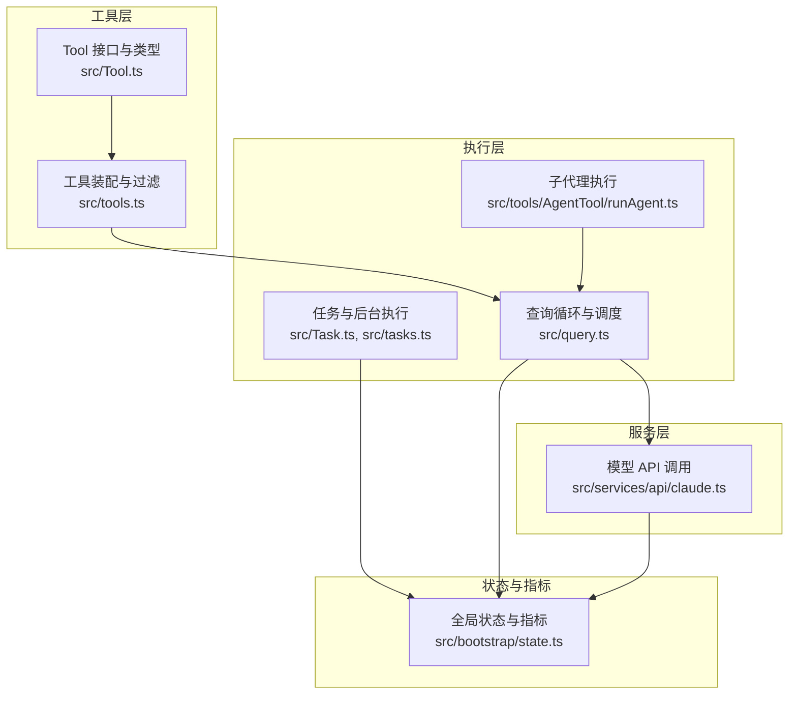
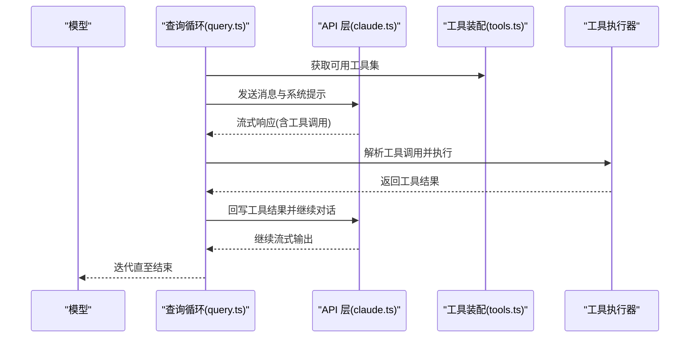
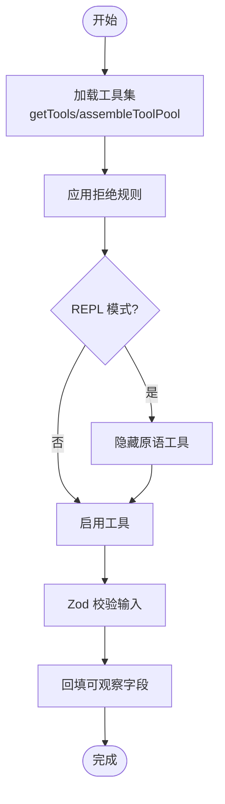
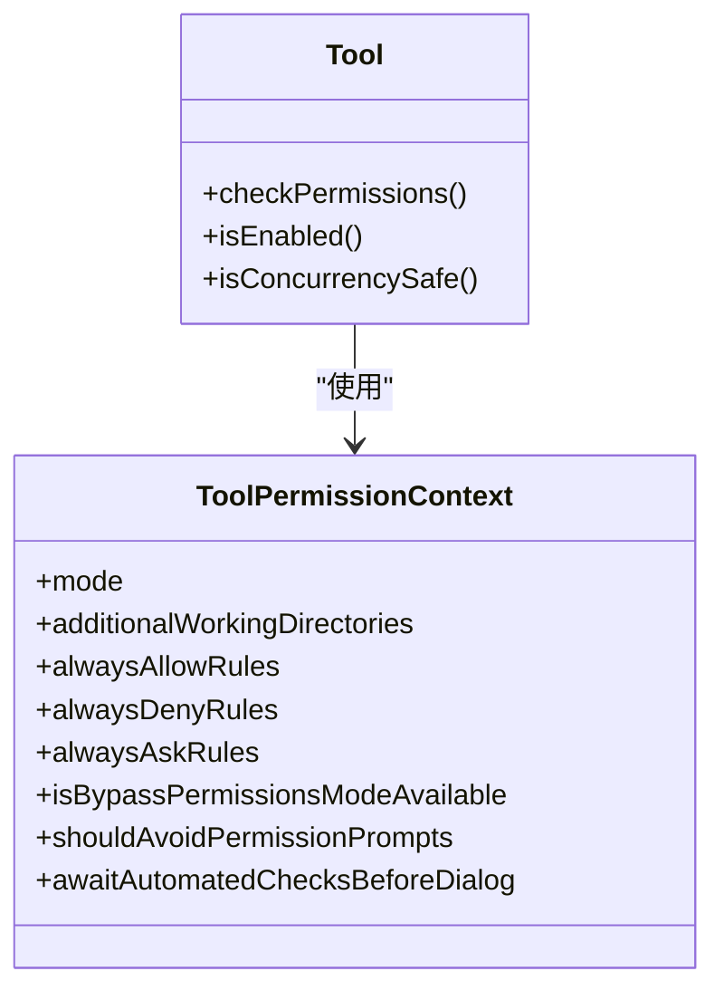
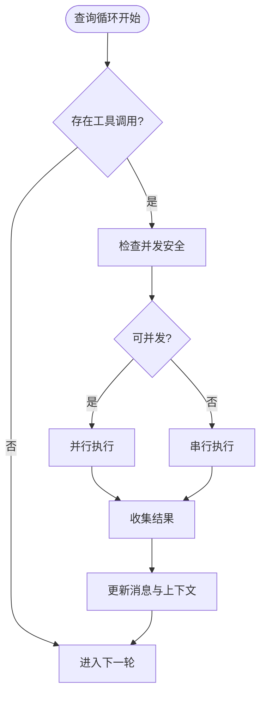
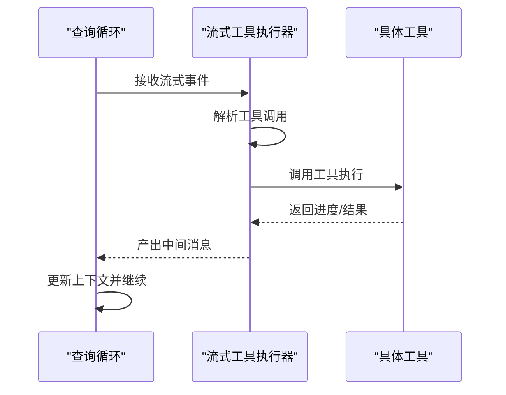
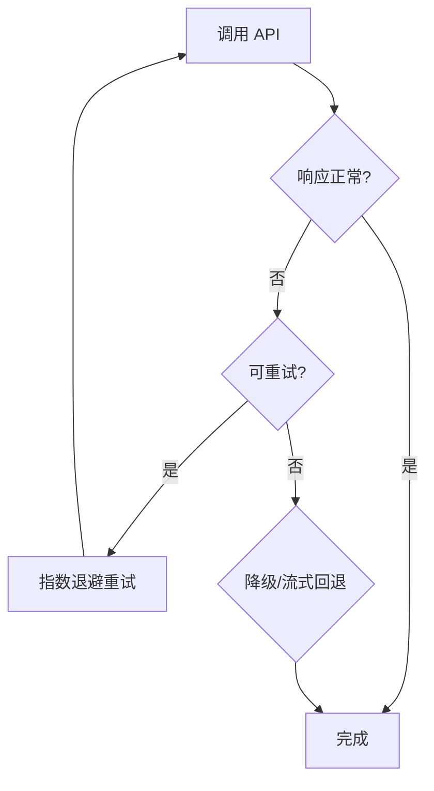
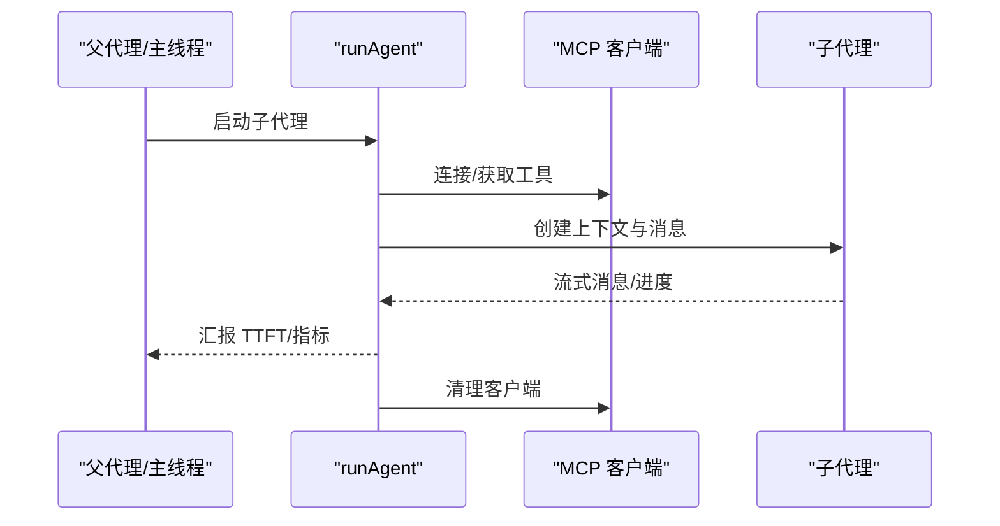
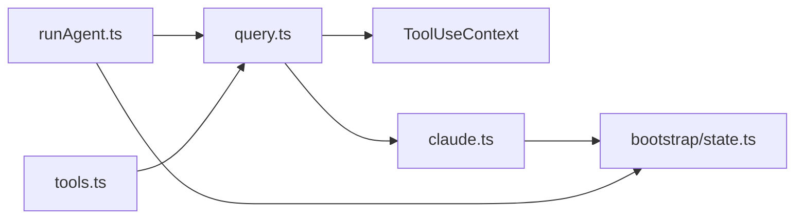

# 工具执行引擎

<cite>
**本文档引用的文件**
- [src/Tool.ts](file://src/Tool.ts)
- [src/tools.ts](file://src/tools.ts)
- [src/query.ts](file://src/query.ts)
- [src/services/api/claude.ts](file://src/services/api/claude.ts)
- [src/tools/AgentTool/runAgent.ts](file://src/tools/AgentTool/runAgent.ts)
- [src/Task.ts](file://src/Task.ts)
- [src/tasks.ts](file://src/tasks.ts)
- [src/bootstrap/state.ts](file://src/bootstrap/state.ts)
</cite>

## 目录
1. [简介](#简介)
2. [项目结构](#项目结构)
3. [核心组件](#核心组件)
4. [架构总览](#架构总览)
5. [详细组件分析](#详细组件分析)
6. [依赖关系分析](#依赖关系分析)
7. [性能考虑](#性能考虑)
8. [故障排除指南](#故障排除指南)
9. [结论](#结论)

## 简介
本文件系统性阐述 Claude Code 工具执行引擎的技术细节，覆盖工具选择、参数解析、权限验证、执行调度、并发与串行策略、流式执行器、错误处理与重试、性能优化、监控与日志等主题。目标是帮助开发者与使用者全面理解从“模型决策到工具调用”的完整链路，以及在复杂会话与多代理场景下的执行行为。

## 项目结构
工具执行引擎由以下关键模块构成：
- 工具定义与类型系统：统一的 Tool 接口、工具上下文、权限规则与进度类型
- 工具装配与过滤：按权限、特性开关、REPL 模式等组装工具池
- 查询循环与调度：query.ts 驱动的主循环，负责上下文压缩、工具选择、模型调用与工具执行
- 模型 API 层：claude.ts 封装 API 请求、缓存控制、重试与降级
- 子代理与任务：runAgent.ts 管理子代理生命周期与 MCP 服务器；Task/任务系统管理后台任务
- 全局状态与指标：bootstrap/state.ts 提供会话级统计、计时与追踪

图表来源
- [src/Tool.ts:1-793](file://src/Tool.ts#L1-L793)
- [src/tools.ts:193-390](file://src/tools.ts#L193-L390)
- [src/query.ts:219-800](file://src/query.ts#L219-L800)
- [src/services/api/claude.ts:676-800](file://src/services/api/claude.ts#L676-L800)
- [src/tools/AgentTool/runAgent.ts:248-800](file://src/tools/AgentTool/runAgent.ts#L248-L800)
- [src/Task.ts:1-126](file://src/Task.ts#L1-L126)
- [src/tasks.ts:17-40](file://src/tasks.ts#L17-L40)
- [src/bootstrap/state.ts:45-800](file://src/bootstrap/state.ts#L45-L800)

章节来源
- [src/Tool.ts:1-793](file://src/Tool.ts#L1-L793)
- [src/tools.ts:193-390](file://src/tools.ts#L193-L390)
- [src/query.ts:219-800](file://src/query.ts#L219-L800)
- [src/services/api/claude.ts:676-800](file://src/services/api/claude.ts#L676-L800)
- [src/tools/AgentTool/runAgent.ts:248-800](file://src/tools/AgentTool/runAgent.ts#L248-L800)
- [src/Task.ts:1-126](file://src/Task.ts#L1-L126)
- [src/tasks.ts:17-40](file://src/tasks.ts#L17-L40)
- [src/bootstrap/state.ts:45-800](file://src/bootstrap/state.ts#L45-L800)

## 核心组件
- 工具接口与上下文
  - Tool 定义了工具的输入/输出模式、权限校验、并发安全、描述与渲染等能力
  - ToolUseContext 提供工具执行所需的运行时上下文（消息、文件状态、权限、回调等）
- 工具装配与过滤
  - getTools/assembleToolPool 统一装配内置工具与 MCP 工具，支持权限拒绝规则、REPL 模式屏蔽、启用状态过滤
- 查询循环与调度
  - query.ts 驱动主循环，负责上下文压缩、工具选择、模型调用、工具执行与结果回写
- 模型 API 层
  - claude.ts 封装请求构建、缓存控制、重试与降级、元数据注入
- 子代理与任务
  - runAgent.ts 管理子代理生命周期、MCP 服务器连接与清理、上下文克隆与指标上报
  - Task/任务系统管理后台任务的生命周期与状态

章节来源
- [src/Tool.ts:362-793](file://src/Tool.ts#L362-L793)
- [src/tools.ts:271-390](file://src/tools.ts#L271-L390)
- [src/query.ts:219-800](file://src/query.ts#L219-L800)
- [src/services/api/claude.ts:676-800](file://src/services/api/claude.ts#L676-L800)
- [src/tools/AgentTool/runAgent.ts:248-800](file://src/tools/AgentTool/runAgent.ts#L248-L800)
- [src/Task.ts:1-126](file://src/Task.ts#L1-L126)

## 架构总览
工具执行引擎以“查询循环”为核心，贯穿上下文压缩、模型推理、工具选择与执行、结果回写与会话持久化。关键路径如下：
- 工具装配：根据权限上下文与特性开关生成可用工具集
- 上下文压缩：自动/微紧凑、历史裁剪、上下文折叠
- 模型调用：构建请求、注入缓存控制、处理流式响应
- 工具执行：串行或流式执行，支持中断与进度反馈
- 结果回写：消息持久化、指标更新、转场与后续动作

图表来源
- [src/query.ts:219-800](file://src/query.ts#L219-L800)
- [src/services/api/claude.ts:676-800](file://src/services/api/claude.ts#L676-L800)
- [src/tools.ts:271-390](file://src/tools.ts#L271-L390)

## 详细组件分析

### 工具选择与参数解析
- 工具选择
  - 通过 ToolUseContext 中的 tools 列表进行匹配与筛选
  - 支持工具别名、搜索提示、是否延迟加载、是否始终加载等属性
- 参数解析
  - 使用 Zod schema 校验输入，必要时回填可观察字段
  - 对于 MCP 工具，支持 JSON Schema 输入
- 权限与可用性
  - 工具 isEnabled 控制启用状态
  - deny 规则在装配阶段即剔除，避免模型看到被禁用工具

图表来源
- [src/tools.ts:262-327](file://src/tools.ts#L262-L327)
- [src/Tool.ts:379-492](file://src/Tool.ts#L379-L492)

章节来源
- [src/tools.ts:262-327](file://src/tools.ts#L262-L327)
- [src/Tool.ts:379-492](file://src/Tool.ts#L379-L492)

### 权限验证与上下文隔离
- 权限上下文
  - ToolPermissionContext 包含模式、附加工作目录、允许/拒绝/询问规则、是否可绕过等
  - 支持在子代理中覆盖权限模式与等待自动化检查后再弹窗
- 工具权限
  - checkPermissions 可在工具层面自定义权限逻辑
  - deny 规则在装配阶段生效，确保模型侧看不到被拒工具

图表来源
- [src/Tool.ts:123-148](file://src/Tool.ts#L123-L148)
- [src/Tool.ts:500-503](file://src/Tool.ts#L500-L503)

章节来源
- [src/Tool.ts:123-148](file://src/Tool.ts#L123-L148)
- [src/Tool.ts:500-503](file://src/Tool.ts#L500-L503)

### 执行调度：串行与并发
- 串行执行
  - 默认串行执行工具调用，保证资源一致性与可预测性
  - 工具可通过 isConcurrencySafe 声明是否可并发
- 并发执行
  - 当工具声明并发安全且满足资源条件时，可并行执行
  - 并发执行需避免共享资源竞争，必要时引入互斥或队列
- 中断与阻塞
  - 工具可声明 interruptBehavior（取消/阻塞），用于用户输入时的处理策略

图表来源
- [src/query.ts:551-568](file://src/query.ts#L551-L568)
- [src/Tool.ts:402-416](file://src/Tool.ts#L402-L416)

章节来源
- [src/query.ts:551-568](file://src/query.ts#L551-L568)
- [src/Tool.ts:402-416](file://src/Tool.ts#L402-L416)

### 流式工具执行器
- 流式执行
  - StreamingToolExecutor 在模型流式输出过程中解析并执行工具调用
  - 支持实时进度反馈、中断与结果回写
- 进度与中断
  - 工具进度通过 ToolProgressData 传递，UI 可据此渲染
  - 中断行为由工具声明，查询循环在新消息到达时决定取消或阻塞

图表来源
- [src/query.ts:561-568](file://src/query.ts#L561-L568)
- [src/query.ts:748-787](file://src/query.ts#L748-L787)

章节来源
- [src/query.ts:561-568](file://src/query.ts#L561-L568)
- [src/query.ts:748-787](file://src/query.ts#L748-L787)

### 错误处理与重试机制
- 错误捕获
  - API 层封装 APIError、超时、用户中止等错误类型
  - 查询循环对 recoverable 错误（如 max_output_tokens）进行延迟抛出或恢复
- 重试策略
  - withRetry 提供统一重试包装，支持最大重试次数、退避与不可重试错误
  - 流式降级：当流式失败时，丢弃部分消息并重建执行器，避免孤儿结果
- 失败通知
  - 通过 createAssistantAPIErrorMessage 等机制向会话注入错误消息

图表来源
- [src/services/api/claude.ts:252-257](file://src/services/api/claude.ts#L252-L257)
- [src/query.ts:708-741](file://src/query.ts#L708-L741)

章节来源
- [src/services/api/claude.ts:252-257](file://src/services/api/claude.ts#L252-L257)
- [src/query.ts:708-741](file://src/query.ts#L708-L741)

### 子代理与任务执行
- 子代理
  - runAgent.ts 创建子代理上下文，继承/覆盖权限、思考配置与工具集
  - 支持 MCP 服务器的动态连接与清理，支持前置技能加载与钩子注册
- 任务
  - Task/TaskType 抽象任务生命周期，TaskHandle 提供清理回调
  - 任务 ID 生成与状态管理，支持后台任务与会话持久化

图表来源
- [src/tools/AgentTool/runAgent.ts:248-800](file://src/tools/AgentTool/runAgent.ts#L248-L800)
- [src/Task.ts:38-76](file://src/Task.ts#L38-L76)

章节来源
- [src/tools/AgentTool/runAgent.ts:248-800](file://src/tools/AgentTool/runAgent.ts#L248-L800)
- [src/Task.ts:38-76](file://src/Task.ts#L38-L76)

## 依赖关系分析
- 组件耦合
  - query.ts 依赖 ToolUseContext 与工具集合，间接依赖权限系统与状态模块
  - claude.ts 依赖工具集合与系统提示，向上游提供统一 API 调用
  - runAgent.ts 依赖 query.ts 的执行能力，同时管理 MCP 与会话元数据
- 外部依赖
  - OpenTelemetry 提供指标与追踪
  - VCR/录制回放用于测试与诊断

图表来源
- [src/query.ts:219-800](file://src/query.ts#L219-L800)
- [src/services/api/claude.ts:676-800](file://src/services/api/claude.ts#L676-L800)
- [src/tools/AgentTool/runAgent.ts:248-800](file://src/tools/AgentTool/runAgent.ts#L248-L800)
- [src/tools.ts:271-390](file://src/tools.ts#L271-L390)
- [src/bootstrap/state.ts:45-800](file://src/bootstrap/state.ts#L45-L800)

章节来源
- [src/query.ts:219-800](file://src/query.ts#L219-L800)
- [src/services/api/claude.ts:676-800](file://src/services/api/claude.ts#L676-L800)
- [src/tools/AgentTool/runAgent.ts:248-800](file://src/tools/AgentTool/runAgent.ts#L248-L800)
- [src/tools.ts:271-390](file://src/tools.ts#L271-L390)
- [src/bootstrap/state.ts:45-800](file://src/bootstrap/state.ts#L45-L800)

## 性能考虑
- 上下文压缩
  - 自动紧凑、微紧凑、历史裁剪与上下文折叠降低 token 占用，提升吞吐
- 缓存控制
  - prompt caching 与缓存编辑配合，减少重复计算
- 流式执行
  - 流式工具执行器减少首字节延迟，提升交互体验
- 指标与追踪
  - 通过 bootstrap/state.ts 记录工具耗时、令牌用量与会话指标，便于定位瓶颈

章节来源
- [src/query.ts:412-468](file://src/query.ts#L412-L468)
- [src/services/api/claude.ts:333-374](file://src/services/api/claude.ts#L333-L374)
- [src/bootstrap/state.ts:543-640](file://src/bootstrap/state.ts#L543-L640)

## 故障排除指南
- 常见问题
  - 工具未显示：检查权限拒绝规则与 REPL 模式屏蔽
  - 工具执行卡住：确认工具并发安全与资源占用；必要时改为串行
  - 流式中断：查看中断行为与用户输入时机；必要时调整工具的 interruptBehavior
  - API 错误：利用 withRetry 与降级策略；关注流式回退后的孤儿消息清理
- 诊断手段
  - 使用 VCR/录制回放复现问题
  - 查看会话指标与追踪信息，定位耗时环节
  - 检查工具回填字段与输入校验，避免传输不一致导致的配额或缓存失效

章节来源
- [src/tools.ts:262-327](file://src/tools.ts#L262-L327)
- [src/Tool.ts:402-416](file://src/Tool.ts#L402-L416)
- [src/query.ts:708-741](file://src/query.ts#L708-L741)
- [src/services/api/claude.ts:252-257](file://src/services/api/claude.ts#L252-L257)

## 结论
该工具执行引擎通过清晰的工具抽象、严格的权限控制、稳健的查询循环与流式执行器，实现了在复杂会话与多代理场景下的高效、可控与可观测的工具调用。结合上下文压缩、缓存策略与指标追踪，能够在保证安全性的同时最大化性能与用户体验。