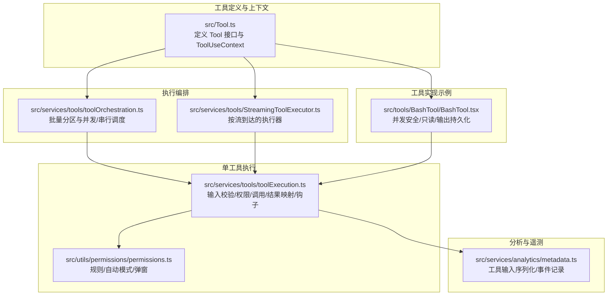
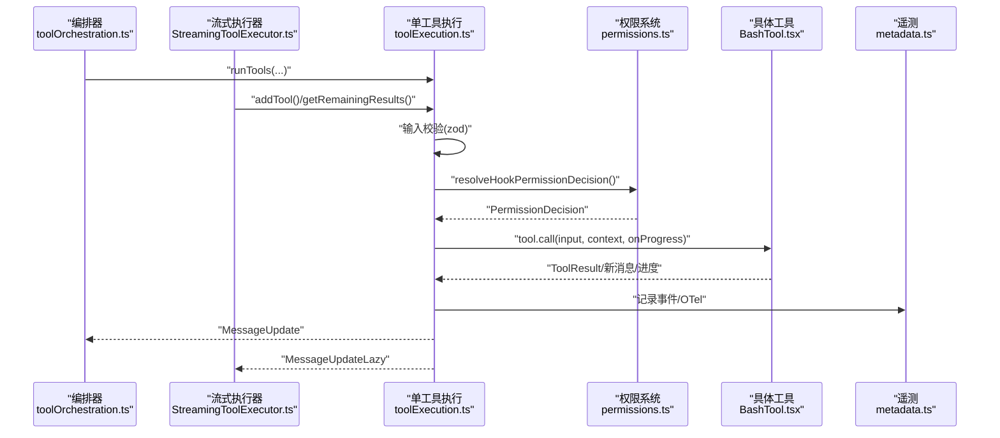
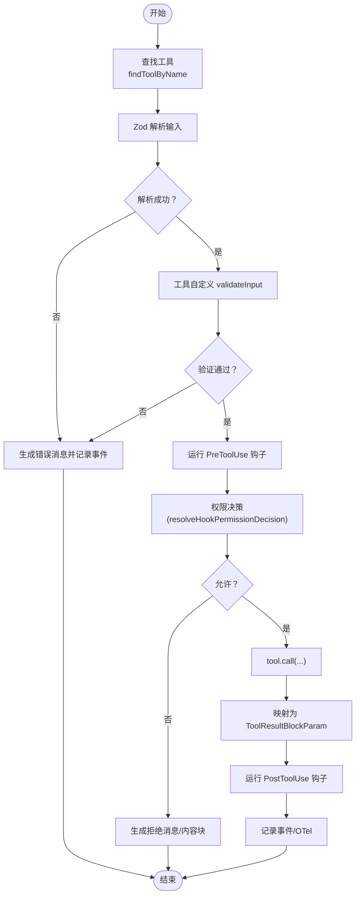
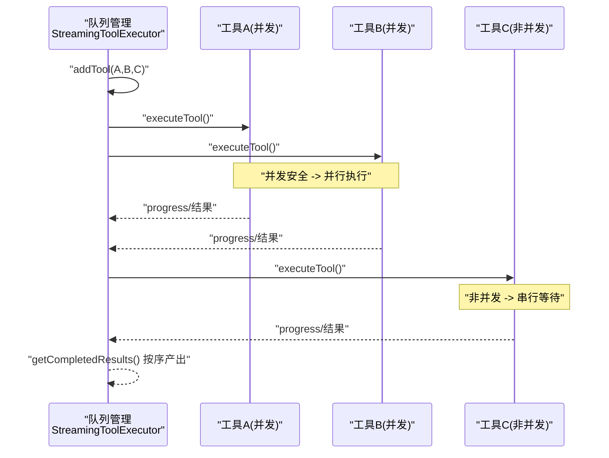
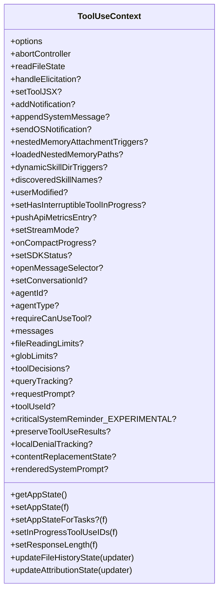
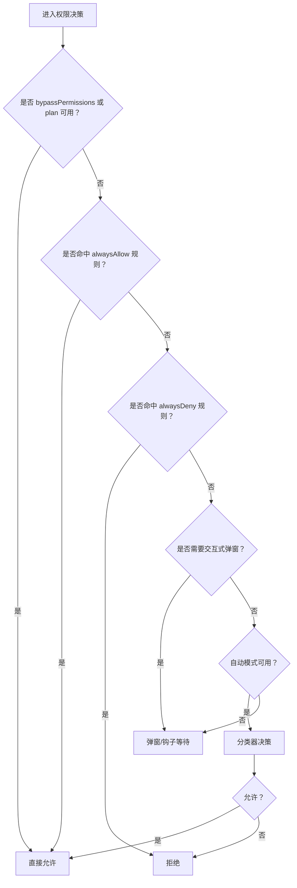
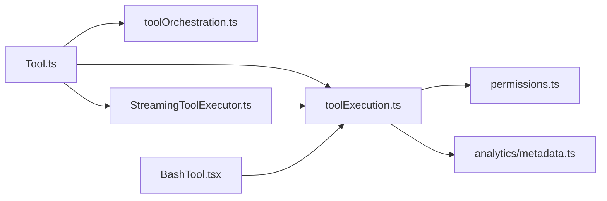

# 工具执行流程

<cite>
**本文档引用的文件**
- [src/Tool.ts](file://src/Tool.ts)
- [src/services/tools/toolExecution.ts](file://src/services/tools/toolExecution.ts)
- [src/services/tools/toolOrchestration.ts](file://src/services/tools/toolOrchestration.ts)
- [src/services/tools/StreamingToolExecutor.ts](file://src/services/tools/StreamingToolExecutor.ts)
- [src/utils/permissions/permissions.ts](file://src/utils/permissions/permissions.ts)
- [src/tools/BashTool/BashTool.tsx](file://src/tools/BashTool/BashTool.tsx)
- [src/services/analytics/metadata.ts](file://src/services/analytics/metadata.ts)
</cite>

## 目录
1. [简介](#简介)
2. [项目结构](#项目结构)
3. [核心组件](#核心组件)
4. [架构总览](#架构总览)
5. [详细组件分析](#详细组件分析)
6. [依赖关系分析](#依赖关系分析)
7. [性能考虑](#性能考虑)
8. [故障排除指南](#故障排除指南)
9. [结论](#结论)

## 简介
本文件系统性阐述 Claude Code 工具执行的完整生命周期：从工具发现与选择、参数解析与验证、权限检查，到工具调用、结果处理与流式响应，再到上下文构建与传递、监控与日志记录，以及异步流程控制（含 AsyncGenerator 使用、并发控制、错误传播）等。文档面向不同技术背景读者，既提供高层概览也包含代码级细节与可视化图表。

## 项目结构
围绕工具执行的关键模块分布如下：
- 工具定义与上下文：src/Tool.ts 定义 Tool 接口、ToolUseContext 数据结构与默认行为
- 执行编排：src/services/tools/toolOrchestration.ts 负责批量工具的分区与并发/串行调度
- 单工具执行：src/services/tools/toolExecution.ts 实现输入校验、权限决策、工具调用、结果映射与钩子处理
- 流式执行器：src/services/tools/StreamingToolExecutor.ts 提供按流到达的工具执行、并发控制与进度消息即时产出
- 权限系统：src/utils/permissions/permissions.ts 实现规则匹配、自动模式分类器、交互式弹窗等
- Bash 工具示例：src/tools/BashTool/BashTool.tsx 展示工具如何实现并发安全判定、只读约束、输出持久化与 UI 渲染
- 分析与遥测：src/services/analytics/metadata.ts 提供工具输入序列化、事件记录与 OTel 输出

**图表来源**
- [src/Tool.ts:158-300](file://src/Tool.ts#L158-L300)
- [src/services/tools/toolOrchestration.ts:19-82](file://src/services/tools/toolOrchestration.ts#L19-L82)
- [src/services/tools/StreamingToolExecutor.ts:40-62](file://src/services/tools/StreamingToolExecutor.ts#L40-L62)
- [src/services/tools/toolExecution.ts:337-490](file://src/services/tools/toolExecution.ts#L337-L490)
- [src/utils/permissions/permissions.ts:473-800](file://src/utils/permissions/permissions.ts#L473-L800)
- [src/tools/BashTool/BashTool.tsx:420-800](file://src/tools/BashTool/BashTool.tsx#L420-L800)
- [src/services/analytics/metadata.ts:285-311](file://src/services/analytics/metadata.ts#L285-L311)

**章节来源**
- [src/Tool.ts:158-300](file://src/Tool.ts#L158-L300)
- [src/services/tools/toolOrchestration.ts:19-82](file://src/services/tools/toolOrchestration.ts#L19-L82)
- [src/services/tools/StreamingToolExecutor.ts:40-62](file://src/services/tools/StreamingToolExecutor.ts#L40-L62)
- [src/services/tools/toolExecution.ts:337-490](file://src/services/tools/toolExecution.ts#L337-L490)
- [src/utils/permissions/permissions.ts:473-800](file://src/utils/permissions/permissions.ts#L473-L800)
- [src/tools/BashTool/BashTool.tsx:420-800](file://src/tools/BashTool/BashTool.tsx#L420-L800)
- [src/services/analytics/metadata.ts:285-311](file://src/services/analytics/metadata.ts#L285-L311)

## 核心组件
- ToolUseContext：贯穿工具执行的全局上下文，承载工具集、AbortController、状态更新回调、会话信息、查询追踪、权限上下文等
- Tool 接口：统一的工具抽象，包含输入/输出模式、并发安全判定、只读/破坏性标记、权限检查、描述生成、渲染与结果映射等
- 工具编排器：将多个工具调用按“并发安全”分批，读操作可并发，非读操作串行
- 流式执行器：按工具到达顺序执行，支持并发安全工具并行、非并发工具串行，即时产出进度消息
- 权限系统：基于规则、自动模式分类器、交互式弹窗，支持钩子扩展与拒绝计数
- Bash 工具：并发安全判定、只读约束、输出截断与持久化、图像输出压缩、命令类型统计与索引工具检测

**章节来源**
- [src/Tool.ts:158-300](file://src/Tool.ts#L158-L300)
- [src/Tool.ts:362-695](file://src/Tool.ts#L362-L695)
- [src/services/tools/toolOrchestration.ts:86-116](file://src/services/tools/toolOrchestration.ts#L86-L116)
- [src/services/tools/StreamingToolExecutor.ts:40-62](file://src/services/tools/StreamingToolExecutor.ts#L40-L62)
- [src/utils/permissions/permissions.ts:473-800](file://src/utils/permissions/permissions.ts#L473-L800)
- [src/tools/BashTool/BashTool.tsx:420-800](file://src/tools/BashTool/BashTool.tsx#L420-L800)

## 架构总览
工具执行采用“编排层 + 单工具执行层 + 权限层 + 钩子层 + 遥测层”的分层设计。编排层负责批量调度与并发控制；单工具执行层完成输入校验、权限决策、工具调用与结果映射；权限层提供规则匹配与自动模式分类器；钩子层在前后阶段注入逻辑；遥测层记录事件与指标。

**图表来源**
- [src/services/tools/toolOrchestration.ts:19-82](file://src/services/tools/toolOrchestration.ts#L19-L82)
- [src/services/tools/StreamingToolExecutor.ts:453-490](file://src/services/tools/StreamingToolExecutor.ts#L453-L490)
- [src/services/tools/toolExecution.ts:337-490](file://src/services/tools/toolExecution.ts#L337-L490)
- [src/utils/permissions/permissions.ts:473-800](file://src/utils/permissions/permissions.ts#L473-L800)
- [src/tools/BashTool/BashTool.tsx:624-800](file://src/tools/BashTool/BashTool.tsx#L624-L800)
- [src/services/analytics/metadata.ts:285-311](file://src/services/analytics/metadata.ts#L285-L311)

## 详细组件分析

### 工具执行生命周期（从请求到结果）
- 工具发现与选择：通过 ToolUseContext.options.tools 查找目标工具；若别名工具被调用则回退至基础工具集合
- 参数解析与验证：使用 zod schema 进行类型校验；失败时返回用户可读的错误消息并记录事件
- 权限检查：先运行前置钩子，再根据规则或自动模式分类器决定是否允许；允许后可对输入进行二次更新
- 工具调用：构造工具上下文（含 AbortController 子控制器），调用 tool.call 并支持进度回调
- 结果处理：映射为 API 兼容的消息块，处理结构化输出、附件、图片、大结果持久化等
- 钩子与后续处理：运行后置钩子，必要时追加提示或反馈
- 记录与遥测：记录工具决策、结果大小、耗时、文件扩展名、MCP 服务器信息等

**图表来源**
- [src/services/tools/toolExecution.ts:337-490](file://src/services/tools/toolExecution.ts#L337-L490)
- [src/services/tools/toolExecution.ts:599-862](file://src/services/tools/toolExecution.ts#L599-L862)
- [src/services/tools/toolExecution.ts:899-1599](file://src/services/tools/toolExecution.ts#L899-L1599)
- [src/utils/permissions/permissions.ts:473-800](file://src/utils/permissions/permissions.ts#L473-L800)

**章节来源**
- [src/services/tools/toolExecution.ts:337-490](file://src/services/tools/toolExecution.ts#L337-L490)
- [src/services/tools/toolExecution.ts:599-862](file://src/services/tools/toolExecution.ts#L599-L862)
- [src/services/tools/toolExecution.ts:899-1599](file://src/services/tools/toolExecution.ts#L899-L1599)
- [src/utils/permissions/permissions.ts:473-800](file://src/utils/permissions/permissions.ts#L473-L800)

### 异步流程控制与并发策略
- 编排层并发：将连续的只读工具合并为并发批次，最大并发度由环境变量控制；非并发工具串行执行
- 流式执行器并发：维护工具队列与状态机，按“并发安全 + 顺序一致性”策略启动执行；支持进度消息即时产出与等待
- 中断与取消：每个工具拥有独立的 AbortController 子节点；兄弟工具错误或用户中断时可传播取消信号
- 同步点：非并发工具执行期间阻塞后续工具；并发工具完成后统一应用上下文修改器

**图表来源**
- [src/services/tools/StreamingToolExecutor.ts:140-151](file://src/services/tools/StreamingToolExecutor.ts#L140-L151)
- [src/services/tools/StreamingToolExecutor.ts:265-405](file://src/services/tools/StreamingToolExecutor.ts#L265-L405)
- [src/services/tools/StreamingToolExecutor.ts:453-490](file://src/services/tools/StreamingToolExecutor.ts#L453-L490)
- [src/services/tools/toolOrchestration.ts:152-177](file://src/services/tools/toolOrchestration.ts#L152-L177)

**章节来源**
- [src/services/tools/StreamingToolExecutor.ts:140-151](file://src/services/tools/StreamingToolExecutor.ts#L140-L151)
- [src/services/tools/StreamingToolExecutor.ts:265-405](file://src/services/tools/StreamingToolExecutor.ts#L265-L405)
- [src/services/tools/StreamingToolExecutor.ts:453-490](file://src/services/tools/StreamingToolExecutor.ts#L453-L490)
- [src/services/tools/toolOrchestration.ts:152-177](file://src/services/tools/toolOrchestration.ts#L152-L177)

### 工具执行上下文（ToolUseContext）与传递
- 关键字段：options（工具集、命令、调试、思考配置、MCP 客户端/资源、会话模式）、AbortController、文件状态缓存、AppState 获取/设置、通知与系统消息附加、查询追踪、工具决策缓存、本地拒绝计数、内容替换状态等
- 上下文修饰：工具可在结果中提供 contextModifier，串行执行器在批次结束后应用；并发工具暂不支持上下文修饰
- 子代理场景：提供 setAppStateForTasks 回调以确保后台任务基础设施可达

**图表来源**
- [src/Tool.ts:158-300](file://src/Tool.ts#L158-L300)

**章节来源**
- [src/Tool.ts:158-300](file://src/Tool.ts#L158-L300)

### 权限检查与自动模式
- 规则匹配：支持“总是允许/禁止/询问”规则，涵盖工具名与前缀模式、MCP 服务器级别规则
- 自动模式分类器：在 auto/dontAsk/plan 等模式下，优先使用分类器快速决策；接受编辑模式可绕过分类器
- 钩子扩展：PermissionRequest 钩子支持异步代理场景的自动审批/拒绝
- 拒绝计数：在 auto 模式下重置连续拒绝计数，避免长期拒绝导致误判

**图表来源**
- [src/utils/permissions/permissions.ts:1262-1297](file://src/utils/permissions/permissions.ts#L1262-L1297)
- [src/utils/permissions/permissions.ts:518-800](file://src/utils/permissions/permissions.ts#L518-L800)

**章节来源**
- [src/utils/permissions/permissions.ts:1262-1297](file://src/utils/permissions/permissions.ts#L1262-L1297)
- [src/utils/permissions/permissions.ts:518-800](file://src/utils/permissions/permissions.ts#L518-L800)

### Bash 工具执行要点
- 并发安全：基于只读约束判断是否并发安全
- 只读约束：解析命令，检测 cd/路径变更等写操作，不符合只读则串行执行
- 大输出处理：超过阈值时将完整输出持久化到工具结果目录，仅在消息中提供预览
- 图像输出：检测并压缩图像输出，保持 UI 标签一致
- 命令类型统计：记录命令类型与索引工具使用情况

**章节来源**
- [src/tools/BashTool/BashTool.tsx:420-800](file://src/tools/BashTool/BashTool.tsx#L420-L800)

### 监控与日志记录
- 事件记录：工具调用成功/失败、权限决策、进度、钩子耗时、MCP 详情、文件扩展名等
- OTel 输出：工具结果事件携带工具参数、输入序列化（受开关控制）、决策来源与类型、MCP 作用域等
- 输入序列化：对敏感内容进行截断与脱敏，限制 JSON 长度

**章节来源**
- [src/services/tools/toolExecution.ts:1331-1395](file://src/services/tools/toolExecution.ts#L1331-L1395)
- [src/services/analytics/metadata.ts:285-311](file://src/services/analytics/metadata.ts#L285-L311)

## 依赖关系分析
- 工具接口依赖：ToolUseContext、CanUseToolFn、消息类型、进度类型、文件状态缓存
- 执行器依赖：工具定义、CanUseToolFn、AbortController、消息构建工具
- 权限系统依赖：规则解析、自动模式分类器、钩子执行、拒绝计数
- Bash 工具依赖：沙箱适配器、任务输出、文件历史、VS Code 通知、AST 解析

**图表来源**
- [src/Tool.ts:158-300](file://src/Tool.ts#L158-L300)
- [src/services/tools/toolExecution.ts:337-490](file://src/services/tools/toolExecution.ts#L337-L490)
- [src/services/tools/toolOrchestration.ts:19-82](file://src/services/tools/toolOrchestration.ts#L19-L82)
- [src/services/tools/StreamingToolExecutor.ts:40-62](file://src/services/tools/StreamingToolExecutor.ts#L40-L62)
- [src/utils/permissions/permissions.ts:473-800](file://src/utils/permissions/permissions.ts#L473-L800)
- [src/tools/BashTool/BashTool.tsx:420-800](file://src/tools/BashTool/BashTool.tsx#L420-L800)
- [src/services/analytics/metadata.ts:285-311](file://src/services/analytics/metadata.ts#L285-L311)

**章节来源**
- [src/Tool.ts:158-300](file://src/Tool.ts#L158-L300)
- [src/services/tools/toolExecution.ts:337-490](file://src/services/tools/toolExecution.ts#L337-L490)
- [src/services/tools/toolOrchestration.ts:19-82](file://src/services/tools/toolOrchestration.ts#L19-L82)
- [src/services/tools/StreamingToolExecutor.ts:40-62](file://src/services/tools/StreamingToolExecutor.ts#L40-L62)
- [src/utils/permissions/permissions.ts:473-800](file://src/utils/permissions/permissions.ts#L473-L800)
- [src/tools/BashTool/BashTool.tsx:420-800](file://src/tools/BashTool/BashTool.tsx#L420-L800)
- [src/services/analytics/metadata.ts:285-311](file://src/services/analytics/metadata.ts#L285-L311)

## 性能考虑
- 并发控制：通过环境变量限制并发度，避免资源争用；并发安全工具尽量并行
- 进度与等待：流式执行器在无已完成结果时等待执行完成或进度可用，减少空转
- 大结果持久化：Bash 工具超过阈值时落盘，避免内存压力与消息体积过大
- 遥测开销：工具输入序列化受开关控制，避免敏感信息泄露的同时降低开销

[本节为通用指导，无需特定文件引用]

## 故障排除指南
- 输入解析失败：检查 zod schema 是否与模型输出匹配；查看工具输入错误事件与提示
- 权限拒绝：确认规则匹配、自动模式分类器结果、交互式弹窗是否触发；查看拒绝计数与模式
- 工具调用异常：关注工具返回的 is_error 标记与错误消息；检查 Bash 工具的中断标志与输出截断
- 流式执行卡住：确认是否有未完成的工具且无进度；检查兄弟工具错误是否传播取消信号
- 日志定位：启用调试日志与遥测事件，结合工具决策来源与耗时统计定位瓶颈

**章节来源**
- [src/services/tools/toolExecution.ts:614-680](file://src/services/tools/toolExecution.ts#L614-L680)
- [src/services/tools/toolExecution.ts:995-1104](file://src/services/tools/toolExecution.ts#L995-L1104)
- [src/services/tools/StreamingToolExecutor.ts:210-231](file://src/services/tools/StreamingToolExecutor.ts#L210-L231)
- [src/tools/BashTool/BashTool.tsx:728-761](file://src/tools/BashTool/BashTool.tsx#L728-L761)

## 结论
该工具执行框架通过清晰的分层设计与严格的并发控制，实现了从工具发现、参数校验、权限决策到工具调用与结果映射的全链路自动化。流式执行器与编排器协同保证了高吞吐与顺序一致性，权限系统与遥测体系提供了可观测性与安全性保障。建议在生产环境中合理设置并发度、开启必要的遥测与日志，并针对关键工具（如 Bash）关注大结果持久化与图像输出优化。