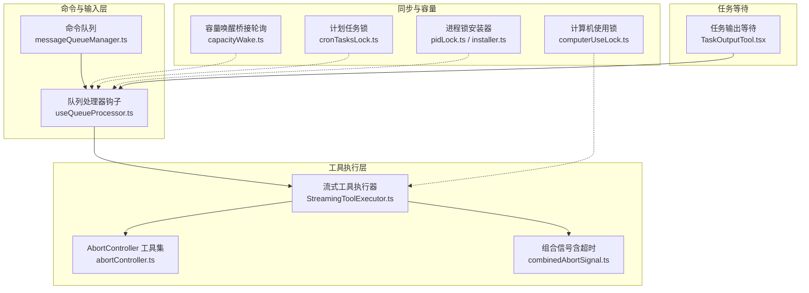
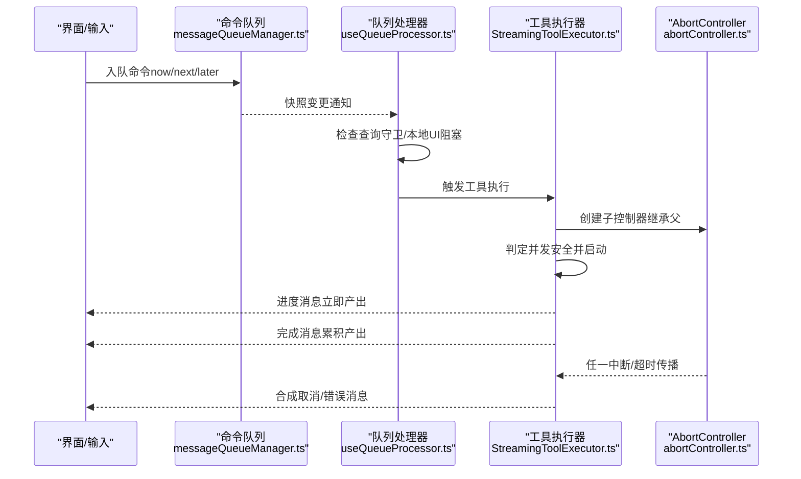
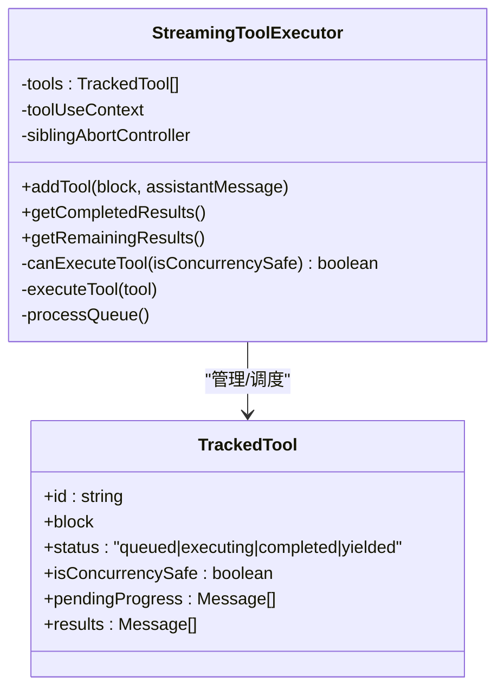
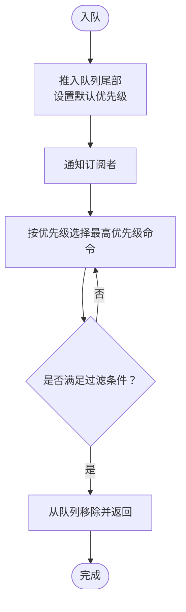
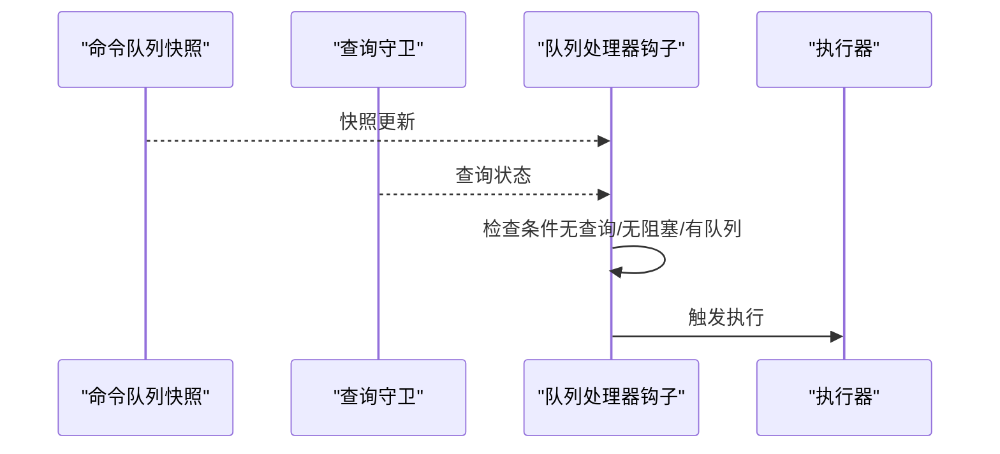
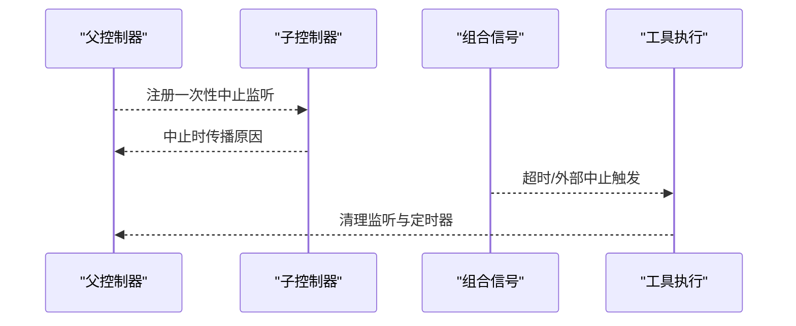
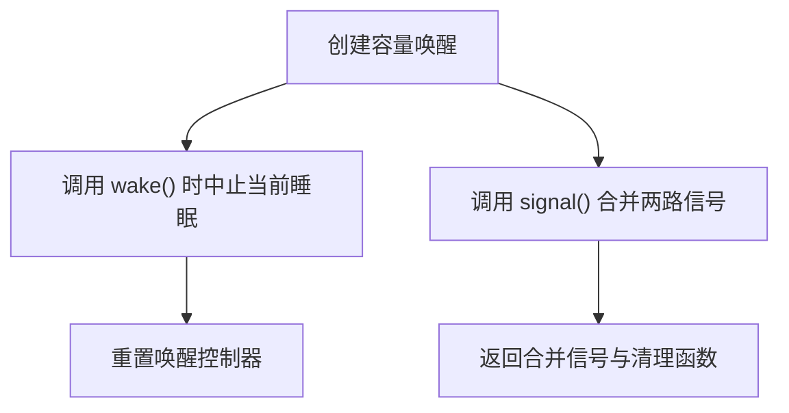
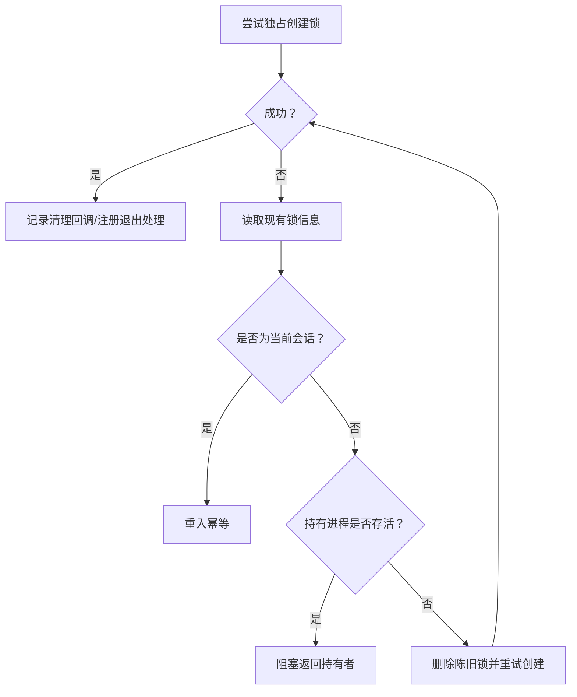
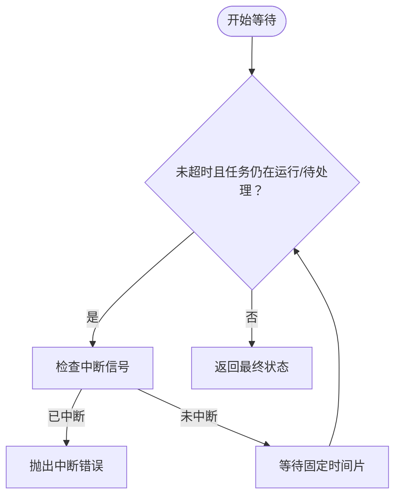
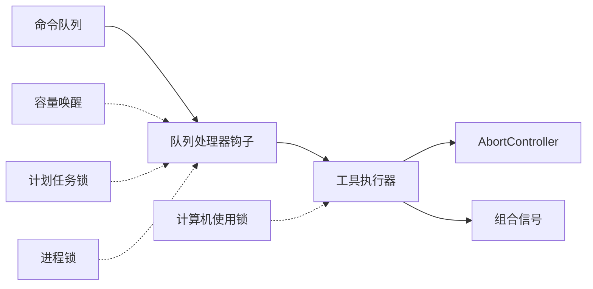

# 并发执行控制

<cite>
**本文引用的文件**
- [StreamingToolExecutor.ts](file://src/services/tools/StreamingToolExecutor.ts)
- [messageQueueManager.ts](file://src/utils/messageQueueManager.ts)
- [useQueueProcessor.ts](file://src/hooks/useQueueProcessor.ts)
- [abortController.ts](file://src/utils/abortController.ts)
- [combinedAbortSignal.ts](file://src/utils/combinedAbortSignal.ts)
- [capacityWake.ts](file://src/bridge/capacityWake.ts)
- [cronTasksLock.ts](file://src/utils/cronTasksLock.ts)
- [computerUseLock.ts](file://src/utils/computerUse/computerUseLock.ts)
- [pidLock.ts](file://src/utils/nativeInstaller/pidLock.ts)
- [installer.ts](file://src/utils/nativeInstaller/installer.ts)
- [TaskOutputTool.tsx](file://src/tools/TaskOutputTool/TaskOutputTool.tsx)
- [tools.ts](file://src/constants/tools.ts)
</cite>

## 目录
1. [简介](#简介)
2. [项目结构](#项目结构)
3. [核心组件](#核心组件)
4. [架构总览](#架构总览)
5. [详细组件分析](#详细组件分析)
6. [依赖关系分析](#依赖关系分析)
7. [性能考虑](#性能考虑)
8. [故障排查指南](#故障排查指南)
9. [结论](#结论)
10. [附录](#附录)

## 简介
本文件系统性阐述 Claude Code 的并发执行控制系统，聚焦以下主题：
- 工具并发执行策略：串行与并行的选择机制与实现细节
- 执行队列管理：任务调度、优先级控制、资源分配
- 冲突处理与同步机制：锁、信号合并、条件等待
- 超时与取消：AbortController 使用、优雅关闭
- 性能优化建议与最佳实践

该系统通过“统一命令队列”和“流式工具执行器”两条主线协同工作，确保在复杂交互场景下保持一致性、可中断性和可观测性。

## 项目结构
围绕并发执行的关键模块如下：
- 命令队列与处理器：统一命令队列、队列处理器钩子
- 工具执行器：流式工具执行器，支持并发安全判定与串行阻塞
- 取消与超时：AbortController 体系与组合信号
- 容量唤醒：桥接轮询的容量唤醒原语
- 锁与互斥：计划任务锁、计算机使用锁、进程锁
- 任务等待与取消：任务输出工具的轮询等待与超时

图表来源
- [messageQueueManager.ts:1-548](file://src/utils/messageQueueManager.ts#L1-L548)
- [useQueueProcessor.ts:1-69](file://src/hooks/useQueueProcessor.ts#L1-L69)
- [StreamingToolExecutor.ts:1-531](file://src/services/tools/StreamingToolExecutor.ts#L1-L531)
- [abortController.ts:1-100](file://src/utils/abortController.ts#L1-L100)
- [combinedAbortSignal.ts:1-47](file://src/utils/combinedAbortSignal.ts#L1-L47)
- [capacityWake.ts:1-57](file://src/bridge/capacityWake.ts#L1-L57)
- [cronTasksLock.ts:34-195](file://src/utils/cronTasksLock.ts#L34-L195)
- [computerUseLock.ts:89-215](file://src/utils/computerUse/computerUseLock.ts#L89-L215)
- [pidLock.ts:330-347](file://src/utils/nativeInstaller/pidLock.ts#L330-L347)
- [installer.ts:214-279](file://src/utils/nativeInstaller/installer.ts#L214-L279)
- [TaskOutputTool.tsx:117-138](file://src/tools/TaskOutputTool/TaskOutputTool.tsx#L117-L138)

章节来源
- [messageQueueManager.ts:1-548](file://src/utils/messageQueueManager.ts#L1-L548)
- [useQueueProcessor.ts:1-69](file://src/hooks/useQueueProcessor.ts#L1-L69)
- [StreamingToolExecutor.ts:1-531](file://src/services/tools/StreamingToolExecutor.ts#L1-L531)
- [abortController.ts:1-100](file://src/utils/abortController.ts#L1-L100)
- [combinedAbortSignal.ts:1-47](file://src/utils/combinedAbortSignal.ts#L1-L47)
- [capacityWake.ts:1-57](file://src/bridge/capacityWake.ts#L1-L57)
- [cronTasksLock.ts:34-195](file://src/utils/cronTasksLock.ts#L34-L195)
- [computerUseLock.ts:89-215](file://src/utils/computerUse/computerUseLock.ts#L89-L215)
- [pidLock.ts:330-347](file://src/utils/nativeInstaller/pidLock.ts#L330-L347)
- [installer.ts:214-279](file://src/utils/nativeInstaller/installer.ts#L214-L279)
- [TaskOutputTool.tsx:117-138](file://src/tools/TaskOutputTool/TaskOutputTool.tsx#L117-L138)

## 核心组件
- 统一命令队列与优先级：支持 now/next/later 三优先级，FIFO 同优先级顺序，提供入队、出队、窥视、匹配移除、批量清理等操作。
- 队列处理器钩子：基于外部查询守卫与队列快照，按条件触发执行，避免与活跃查询冲突。
- 流式工具执行器：根据工具并发安全属性决定串行或并行；支持进度消息立即投递、错误传播与取消；维护上下文修改器链。
- 取消与超时：AbortController 子控制器树形传播；组合信号支持第二信号与超时；统一清理。
- 容量唤醒：桥接轮询的“容量释放”早醒机制，合并外层关闭信号与容量唤醒信号。
- 锁与互斥：计划任务锁、计算机使用锁、安装器进程锁，均采用独占创建+会话身份校验+陈旧锁恢复策略。
- 任务等待：任务输出工具以轮询方式等待任务完成，支持超时与用户中断。

章节来源
- [messageQueueManager.ts:128-328](file://src/utils/messageQueueManager.ts#L128-L328)
- [useQueueProcessor.ts:28-68](file://src/hooks/useQueueProcessor.ts#L28-L68)
- [StreamingToolExecutor.ts:40-151](file://src/services/tools/StreamingToolExecutor.ts#L40-L151)
- [abortController.ts:68-99](file://src/utils/abortController.ts#L68-L99)
- [combinedAbortSignal.ts:15-47](file://src/utils/combinedAbortSignal.ts#L15-L47)
- [capacityWake.ts:28-56](file://src/bridge/capacityWake.ts#L28-L56)
- [cronTasksLock.ts:111-195](file://src/utils/cronTasksLock.ts#L111-L195)
- [computerUseLock.ts:110-215](file://src/utils/computerUse/computerUseLock.ts#L110-L215)
- [TaskOutputTool.tsx:117-138](file://src/tools/TaskOutputTool/TaskOutputTool.tsx#L117-L138)

## 架构总览
并发执行由“命令队列 + 工具执行器 + 取消/锁/容量”四维协作构成：
- 命令队列负责输入与通知的统一调度，保证优先级与顺序
- 工具执行器负责工具粒度的并发策略与结果产出
- 取消/超时保障可中断性与健壮性
- 锁与容量控制共享资源访问与轮询节奏

图表来源
- [messageQueueManager.ts:128-193](file://src/utils/messageQueueManager.ts#L128-L193)
- [useQueueProcessor.ts:48-67](file://src/hooks/useQueueProcessor.ts#L48-L67)
- [StreamingToolExecutor.ts:129-151](file://src/services/tools/StreamingToolExecutor.ts#L129-L151)
- [abortController.ts:68-99](file://src/utils/abortController.ts#L68-L99)

## 详细组件分析

### 组件A：流式工具执行器（并发策略与串行/并行选择）
- 并发安全判定：基于工具输入解析结果与工具定义的并发安全函数，确定是否与其他并发安全工具并行
- 串行阻塞：当遇到非并发安全工具时，需等待当前执行集合全部完成后再继续，以维持顺序一致性
- 结果产出：支持进度消息即时投递；完成消息按到达顺序累积；上下文修改器仅对串行工具生效
- 取消与错误传播：兄弟工具错误（如 Bash 失败）会通过子控制器冒泡，触发同组工具取消；用户中断可按工具中断行为选择取消或阻断
- 资源隔离：为每个工具创建独立子控制器，避免相互影响；同时通过“兄弟取消控制器”实现必要的级联终止

图表来源
- [StreamingToolExecutor.ts:19-52](file://src/services/tools/StreamingToolExecutor.ts#L19-L52)
- [StreamingToolExecutor.ts:76-151](file://src/services/tools/StreamingToolExecutor.ts#L76-L151)
- [StreamingToolExecutor.ts:265-405](file://src/services/tools/StreamingToolExecutor.ts#L265-L405)

章节来源
- [StreamingToolExecutor.ts:40-151](file://src/services/tools/StreamingToolExecutor.ts#L40-L151)
- [StreamingToolExecutor.ts:129-151](file://src/services/tools/StreamingToolExecutor.ts#L129-L151)
- [StreamingToolExecutor.ts:265-405](file://src/services/tools/StreamingToolExecutor.ts#L265-L405)

### 组件B：统一命令队列与优先级控制
- 优先级：now > next > later；同优先级 FIFO
- 操作集：入队、出队（可带过滤）、窥视、批量移除、按谓词移除、清空、重置
- 可编辑性：区分可编辑与不可编辑命令，支持弹出合并到输入缓冲区
- 订阅与快照：基于 useSyncExternalStore 的外部订阅，保证渲染一致性

图表来源
- [messageQueueManager.ts:128-193](file://src/utils/messageQueueManager.ts#L128-L193)
- [messageQueueManager.ts:167-193](file://src/utils/messageQueueManager.ts#L167-L193)

章节来源
- [messageQueueManager.ts:128-193](file://src/utils/messageQueueManager.ts#L128-L193)
- [messageQueueManager.ts:244-292](file://src/utils/messageQueueManager.ts#L244-L292)
- [messageQueueManager.ts:428-484](file://src/utils/messageQueueManager.ts#L428-L484)

### 组件C：队列处理器钩子（调度触发与条件控制）
- 条件触发：无活跃查询、无本地 UI 阻塞、队列非空
- 与查询守卫联动：通过 useSyncExternalStore 订阅查询状态变化，避免竞态
- 与命令队列解耦：不直接操作队列，仅作为触发器

图表来源
- [useQueueProcessor.ts:35-67](file://src/hooks/useQueueProcessor.ts#L35-L67)

章节来源
- [useQueueProcessor.ts:28-68](file://src/hooks/useQueueProcessor.ts#L28-L68)

### 组件D：取消与超时（AbortController 体系）
- 父子控制器传播：子控制器在父控制器中止时自动中止；子中止时自动清理父监听，避免泄漏
- 组合信号：支持第二信号与超时，统一清理；避免使用平台自带的超时信号导致内存滞留
- 使用场景：工具执行器内部为每个工具创建子控制器；任务等待使用组合信号进行超时控制

图表来源
- [abortController.ts:68-99](file://src/utils/abortController.ts#L68-L99)
- [combinedAbortSignal.ts:15-47](file://src/utils/combinedAbortSignal.ts#L15-L47)

章节来源
- [abortController.ts:16-99](file://src/utils/abortController.ts#L16-L99)
- [combinedAbortSignal.ts:15-47](file://src/utils/combinedAbortSignal.ts#L15-L47)
- [TaskOutputTool.tsx:117-138](file://src/tools/TaskOutputTool/TaskOutputTool.tsx#L117-L138)

### 组件E：容量唤醒（桥接轮询）
- 功能：在“满容量”状态下睡眠，当外层关闭或容量释放时提前唤醒
- 实现：合并外层信号与内部唤醒控制器信号；每次唤醒后重置控制器，确保下次可再次被唤醒

图表来源
- [capacityWake.ts:28-56](file://src/bridge/capacityWake.ts#L28-L56)

章节来源
- [capacityWake.ts:13-56](file://src/bridge/capacityWake.ts#L13-L56)

### 组件F：锁与互斥（计划任务锁、计算机使用锁、进程锁）
- 计划任务锁：独占创建 + 会话身份校验；若被其他存活会话持有则阻塞；支持陈旧锁恢复
- 计算机使用锁：请求访问前检查但不获取；获取时进行独占创建与清理注册；退出时释放
- 安装器进程锁：PID 基础锁与锁文件锁双策略；指数回退重试；陈旧锁恢复

图表来源
- [cronTasksLock.ts:111-195](file://src/utils/cronTasksLock.ts#L111-L195)
- [computerUseLock.ts:110-195](file://src/utils/computerUse/computerUseLock.ts#L110-L195)
- [pidLock.ts:330-347](file://src/utils/nativeInstaller/pidLock.ts#L330-L347)
- [installer.ts:214-279](file://src/utils/nativeInstaller/installer.ts#L214-L279)

章节来源
- [cronTasksLock.ts:111-195](file://src/utils/cronTasksLock.ts#L111-L195)
- [computerUseLock.ts:110-195](file://src/utils/computerUse/computerUseLock.ts#L110-L195)
- [pidLock.ts:330-347](file://src/utils/nativeInstaller/pidLock.ts#L330-L347)
- [installer.ts:214-279](file://src/utils/nativeInstaller/installer.ts#L214-L279)

### 组件G：任务等待与取消（轮询等待）
- 轮询等待：定期检查任务状态，支持超时与用户中断
- 中断处理：检测 AbortController 信号，抛出特定错误类型

图表来源
- [TaskOutputTool.tsx:117-138](file://src/tools/TaskOutputTool/TaskOutputTool.tsx#L117-L138)

章节来源
- [TaskOutputTool.tsx:117-138](file://src/tools/TaskOutputTool/TaskOutputTool.tsx#L117-L138)

## 依赖关系分析
- 组件内聚与耦合
  - 流式工具执行器与 AbortController 强耦合，用于取消与传播
  - 队列处理器钩子与命令队列弱耦合，仅通过快照订阅
  - 容量唤醒与桥接轮询模块弱耦合，通过信号合并接口交互
  - 锁模块彼此独立，均面向“独占创建 + 会话校验 + 陈旧恢复”的通用模式
- 外部依赖
  - 事件系统：AbortController 事件监听与清理
  - 文件系统：锁文件读写、清理
  - 平台特性：Bun 下超时信号的特殊处理

图表来源
- [messageQueueManager.ts:128-193](file://src/utils/messageQueueManager.ts#L128-L193)
- [useQueueProcessor.ts:48-67](file://src/hooks/useQueueProcessor.ts#L48-L67)
- [StreamingToolExecutor.ts:299-318](file://src/services/tools/StreamingToolExecutor.ts#L299-L318)
- [abortController.ts:68-99](file://src/utils/abortController.ts#L68-L99)
- [combinedAbortSignal.ts:15-47](file://src/utils/combinedAbortSignal.ts#L15-L47)
- [capacityWake.ts:36-53](file://src/bridge/capacityWake.ts#L36-L53)
- [cronTasksLock.ts:111-132](file://src/utils/cronTasksLock.ts#L111-L132)
- [computerUseLock.ts:158-162](file://src/utils/computerUse/computerUseLock.ts#L158-L162)
- [pidLock.ts:330-347](file://src/utils/nativeInstaller/pidLock.ts#L330-L347)

章节来源
- [messageQueueManager.ts:128-193](file://src/utils/messageQueueManager.ts#L128-L193)
- [useQueueProcessor.ts:48-67](file://src/hooks/useQueueProcessor.ts#L48-L67)
- [StreamingToolExecutor.ts:299-318](file://src/services/tools/StreamingToolExecutor.ts#L299-L318)
- [abortController.ts:68-99](file://src/utils/abortController.ts#L68-L99)
- [combinedAbortSignal.ts:15-47](file://src/utils/combinedAbortSignal.ts#L15-L47)
- [capacityWake.ts:36-53](file://src/bridge/capacityWake.ts#L36-L53)
- [cronTasksLock.ts:111-132](file://src/utils/cronTasksLock.ts#L111-L132)
- [computerUseLock.ts:158-162](file://src/utils/computerUse/computerUseLock.ts#L158-L162)
- [pidLock.ts:330-347](file://src/utils/nativeInstaller/pidLock.ts#L330-L347)

## 性能考虑
- 队列操作
  - 出队按优先级线性扫描，建议在高频场景下减少队列长度或分批处理
  - 批量移除与按谓词移除采用逆序遍历，避免频繁 splice 影响性能
- 工具执行
  - 并发安全工具尽量并行，减少串行阻塞；非并发安全工具应避免长耗时
  - 进度消息即时投递降低用户感知延迟
- 取消与超时
  - 使用组合信号替代平台超时信号，避免内存滞留
  - 子控制器传播路径短、清理及时，降低监听器泄漏风险
- 锁与容量
  - 独占创建与陈旧恢复减少竞争窗口；指数回退降低争用抖动
  - 容量唤醒避免无效轮询，提升桥接轮询效率

## 故障排查指南
- 工具未执行或卡住
  - 检查是否存在非并发安全工具阻塞；确认查询守卫状态与本地 UI 阻塞
  - 查看工具中断行为与取消原因（用户中断/兄弟错误/流式回退）
- 取消无效
  - 确认子控制器传播链完整；检查组合信号是否正确清理
- 锁无法获取
  - 检查锁文件是否存在、会话 ID 是否匹配、持有进程是否存活
  - 若为陈旧锁，确认恢复流程是否成功
- 超时异常
  - 确认超时定时器是否正确清理；避免重复创建导致泄漏

章节来源
- [useQueueProcessor.ts:28-68](file://src/hooks/useQueueProcessor.ts#L28-L68)
- [StreamingToolExecutor.ts:210-231](file://src/services/tools/StreamingToolExecutor.ts#L210-L231)
- [abortController.ts:68-99](file://src/utils/abortController.ts#L68-L99)
- [combinedAbortSignal.ts:15-47](file://src/utils/combinedAbortSignal.ts#L15-L47)
- [cronTasksLock.ts:111-195](file://src/utils/cronTasksLock.ts#L111-L195)
- [computerUseLock.ts:110-195](file://src/utils/computerUse/computerUseLock.ts#L110-L195)

## 结论
该并发执行系统通过“统一命令队列 + 流式工具执行器 + 取消/锁/容量”形成闭环：
- 优先级与顺序由队列保障
- 并发策略由工具定义与执行器判定
- 可中断性与健壮性由 AbortController 与组合信号提供
- 共享资源与轮询节奏由锁与容量唤醒控制
整体设计兼顾了可用性、一致性与性能，适合在复杂交互场景下稳定运行。

## 附录
- 最佳实践
  - 明确工具并发安全属性，避免将可能产生副作用的工具设为并发安全
  - 在工具执行器中尽早检查取消信号，缩短响应时间
  - 使用组合信号管理超时，确保清理函数被调用
  - 对于长耗时任务，优先使用进度消息反馈，提升用户体验
  - 锁的获取与释放成对出现，必要时注册退出清理