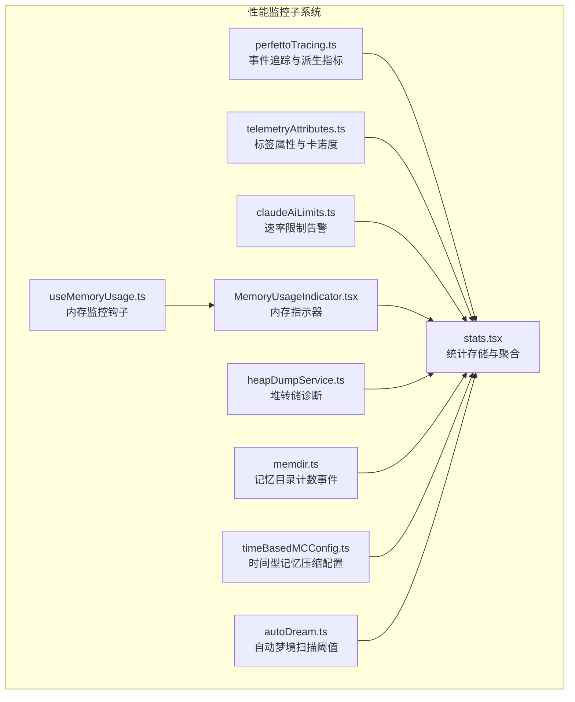
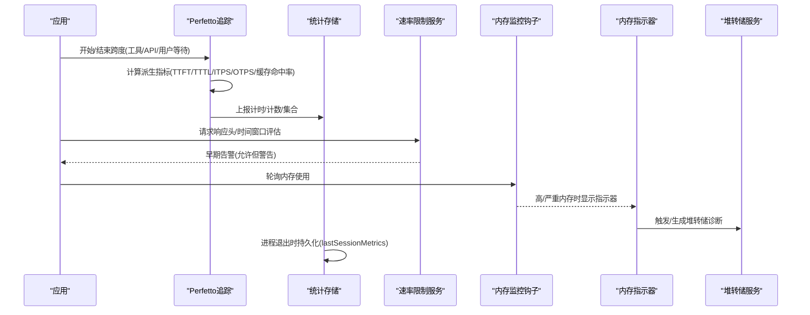
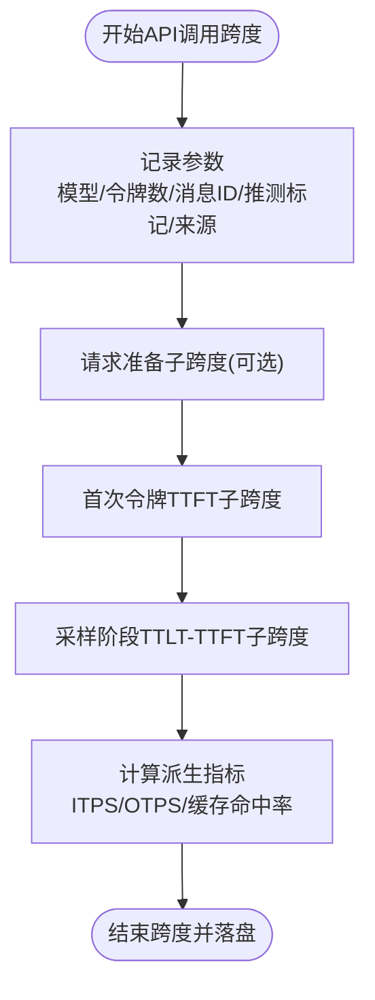
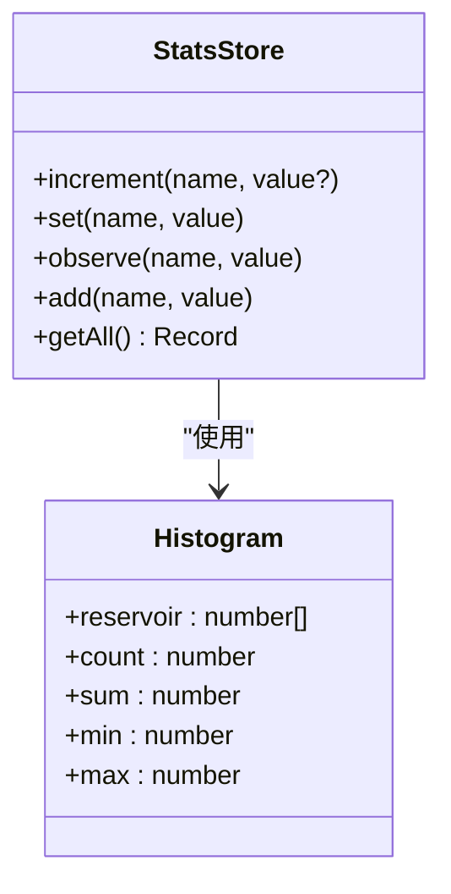
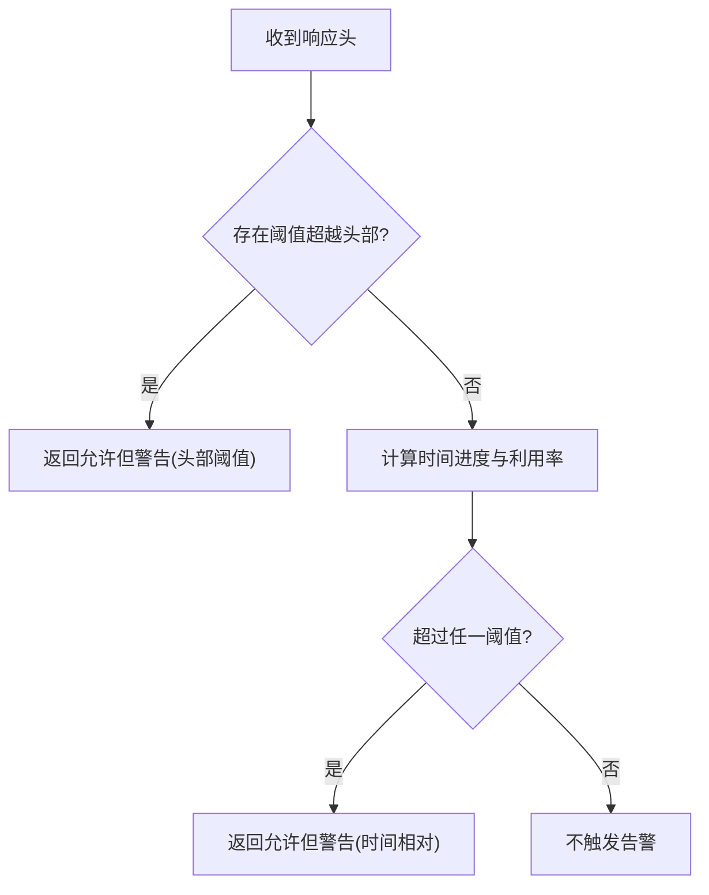
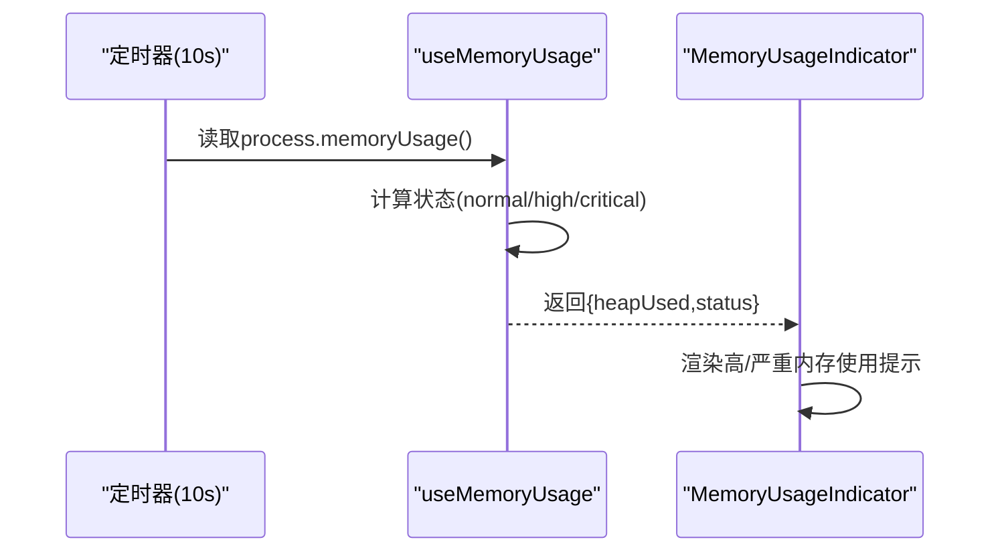
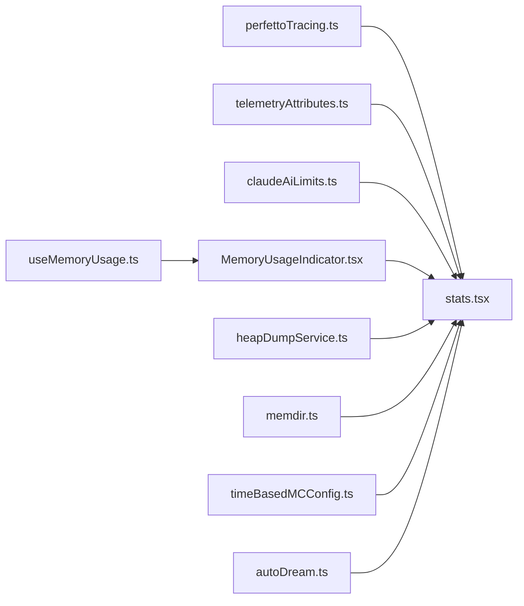

# 性能监控

<cite>
**本文引用的文件**
- [perfettoTracing.ts](file://src/utils/telemetry/perfettoTracing.ts)
- [stats.tsx](file://src/context/stats.tsx)
- [telemetryAttributes.ts](file://src/utils/telemetryAttributes.ts)
- [claudeAiLimits.ts](file://src/services/claudeAiLimits.ts)
- [useMemoryUsage.ts](file://src/hooks/useMemoryUsage.ts)
- [MemoryUsageIndicator.tsx](file://src/components/MemoryUsageIndicator.tsx)
- [heapDumpService.ts](file://src/utils/heapDumpService.ts)
- [memdir.ts](file://src/memdir/memdir.ts)
- [timeBasedMCConfig.ts](file://src/services/compact/timeBasedMCConfig.ts)
- [autoDream.ts](file://src/services/autoDream/autoDream.ts)
</cite>

## 目录
1. [简介](#简介)
2. [项目结构](#项目结构)
3. [核心组件](#核心组件)
4. [架构总览](#架构总览)
5. [详细组件分析](#详细组件分析)
6. [依赖关系分析](#依赖关系分析)
7. [性能考量](#性能考量)
8. [故障排查指南](#故障排查指南)
9. [结论](#结论)
10. [附录](#附录)

## 简介
本文件面向Claude Code工具的性能监控体系，系统化阐述工具执行期间的性能指标采集、计时与采样、指标聚合与存储、历史趋势与瓶颈识别、性能告警与优化建议，以及调优策略与工具使用指南。重点覆盖以下方面：
- 执行时间、吞吐量、资源使用（内存）等关键指标
- Perfetto Chrome Trace事件流与派生指标（如TTFT/TTLP、ITPS/OTPS、缓存命中率）
- 基于React上下文的统计存储与分位数聚合
- 速率限制早期告警与阈值检测
- 内存使用监控与堆转储辅助诊断
- 历史会话指标持久化与可视化路径

## 项目结构
与性能监控直接相关的核心模块分布如下：
- 事件追踪与派生指标：src/utils/telemetry/perfettoTracing.ts
- 指标聚合与持久化：src/context/stats.tsx
- 标签属性与卡诺度控制：src/utils/telemetryAttributes.ts
- 速率限制早期告警：src/services/claudeAiLimits.ts
- 内存使用监控与指示器：src/hooks/useMemoryUsage.ts、src/components/MemoryUsageIndicator.tsx
- 堆转储与诊断信息：src/utils/heapDumpService.ts
- 记忆目录计数事件：src/memdir/memdir.ts
- 时间型记忆压缩配置：src/services/compact/timeBasedMCConfig.ts
- 自动梦境扫描节流与阈值：src/services/autoDream/autoDream.ts

图表来源
- [perfettoTracing.ts:1-1121](file://src/utils/telemetry/perfettoTracing.ts#L1-L1121)
- [stats.tsx:1-220](file://src/context/stats.tsx#L1-L220)
- [telemetryAttributes.ts:1-72](file://src/utils/telemetryAttributes.ts#L1-L72)
- [claudeAiLimits.ts:251-374](file://src/services/claudeAiLimits.ts#L251-L374)
- [useMemoryUsage.ts:1-39](file://src/hooks/useMemoryUsage.ts#L1-L39)
- [MemoryUsageIndicator.tsx:1-36](file://src/components/MemoryUsageIndicator.tsx#L1-L36)
- [heapDumpService.ts:32-82](file://src/utils/heapDumpService.ts#L32-L82)
- [memdir.ts:149-185](file://src/memdir/memdir.ts#L149-L185)
- [timeBasedMCConfig.ts:30-43](file://src/services/compact/timeBasedMCConfig.ts#L30-L43)
- [autoDream.ts:54-100](file://src/services/autoDream/autoDream.ts#L54-L100)

章节来源
- [perfettoTracing.ts:1-1121](file://src/utils/telemetry/perfettoTracing.ts#L1-L1121)
- [stats.tsx:1-220](file://src/context/stats.tsx#L1-L220)
- [telemetryAttributes.ts:1-72](file://src/utils/telemetryAttributes.ts#L1-L72)
- [claudeAiLimits.ts:251-374](file://src/services/claudeAiLimits.ts#L251-L374)
- [useMemoryUsage.ts:1-39](file://src/hooks/useMemoryUsage.ts#L1-L39)
- [MemoryUsageIndicator.tsx:1-36](file://src/components/MemoryUsageIndicator.tsx#L1-L36)
- [heapDumpService.ts:32-82](file://src/utils/heapDumpService.ts#L32-L82)
- [memdir.ts:149-185](file://src/memdir/memdir.ts#L149-L185)
- [timeBasedMCConfig.ts:30-43](file://src/services/compact/timeBasedMCConfig.ts#L30-L43)
- [autoDream.ts:54-100](file://src/services/autoDream/autoDream.ts#L54-L100)

## 核心组件
- Perfetto事件追踪与派生指标
  - 提供API调用、工具执行、用户等待、交互等跨度的开始/结束事件记录，支持嵌套子跨度（请求准备、首次令牌、采样阶段），并计算TTFT/TTTL、ITPS/OTPS、缓存命中率等派生指标。
  - 支持周期性写盘与过期跨度清理，避免无限增长。
- 统计存储与聚合
  - 提供计数器、量规、计时器、集合等能力；对数值进行直方图采样与分位数聚合（p50/p95/p99），并在进程退出时持久化到项目配置中。
- 标签属性与卡诺度控制
  - 动态决定是否包含会话ID、版本、账户UUID等维度，以控制指标卡诺度与隐私边界。
- 速率限制早期告警
  - 基于服务端头部阈值或客户端时间窗口相对利用率阈值，触发“允许但警告”状态，便于提前干预。
- 内存使用监控与指示器
  - 定期轮询Node内存使用，按阈值分级（正常/偏高/严重），在外部构建中通过指示器展示并提供堆转储入口。
- 堆转储与诊断
  - 捕获V8堆空间、原生内存、句柄/请求状态等多维诊断，辅助定位泄漏类型与建议。
- 记忆目录计数事件
  - 异步统计记忆目录文件/子目录数量，上报事件用于观测与分析。

章节来源
- [perfettoTracing.ts:422-942](file://src/utils/telemetry/perfettoTracing.ts#L422-L942)
- [stats.tsx:28-98](file://src/context/stats.tsx#L28-L98)
- [telemetryAttributes.ts:29-71](file://src/utils/telemetryAttributes.ts#L29-L71)
- [claudeAiLimits.ts:251-374](file://src/services/claudeAiLimits.ts#L251-L374)
- [useMemoryUsage.ts:18-39](file://src/hooks/useMemoryUsage.ts#L18-L39)
- [MemoryUsageIndicator.tsx:1-36](file://src/components/MemoryUsageIndicator.tsx#L1-L36)
- [heapDumpService.ts:32-82](file://src/utils/heapDumpService.ts#L32-L82)
- [memdir.ts:149-185](file://src/memdir/memdir.ts#L149-L185)

## 架构总览
下图展示了从事件产生到指标聚合与持久化的整体流程，以及与外部系统的交互点（速率限制告警、内存监控、堆转储）。

图表来源
- [perfettoTracing.ts:422-942](file://src/utils/telemetry/perfettoTracing.ts#L422-L942)
- [stats.tsx:123-135](file://src/context/stats.tsx#L123-L135)
- [claudeAiLimits.ts:342-374](file://src/services/claudeAiLimits.ts#L342-L374)
- [useMemoryUsage.ts:21-36](file://src/hooks/useMemoryUsage.ts#L21-L36)
- [MemoryUsageIndicator.tsx:14-35](file://src/components/MemoryUsageIndicator.tsx#L14-L35)
- [heapDumpService.ts:32-82](file://src/utils/heapDumpService.ts#L32-L82)

## 详细组件分析

### Perfetto事件追踪与派生指标
- 关键能力
  - 跨度管理：注册/注销代理、生成唯一跨度ID、维护挂起跨度表、过期跨度清理。
  - 事件格式：遵循Chrome Trace Event规范，支持B/E/X/i/C/b/n/e/M多种阶段。
  - API调用跨度：记录模型、提示词/输出令牌数、消息ID、推测标记、查询来源、TTFT/TTTL、请求准备耗时、重试尝试时间序列等。
  - 工具执行跨度：记录工具名、成功/失败、错误、结果令牌数。
  - 用户输入等待跨度：记录上下文、决策来源、持续时间。
  - 派生指标：ITPS（输入令牌/秒）、OTPS（输出令牌/秒）、缓存命中率、请求准备耗时、实际采样耗时。
  - 周期写盘与容量控制：定期写入trace文件，超过上限时丢弃旧事件并插入截断标记。
- 使用场景
  - 诊断慢请求、识别首令牌延迟瓶颈、评估采样阶段吞吐、定位缓存命中不足问题。
- 可视化
  - 输出为Chrome Trace JSON，可在ui.perfetto.dev或chrome://tracing打开。

图表来源
- [perfettoTracing.ts:422-685](file://src/utils/telemetry/perfettoTracing.ts#L422-L685)

章节来源
- [perfettoTracing.ts:253-335](file://src/utils/telemetry/perfettoTracing.ts#L253-L335)
- [perfettoTracing.ts:422-685](file://src/utils/telemetry/perfettoTracing.ts#L422-L685)
- [perfettoTracing.ts:687-763](file://src/utils/telemetry/perfettoTracing.ts#L687-L763)
- [perfettoTracing.ts:765-835](file://src/utils/telemetry/perfettoTracing.ts#L765-L835)
- [perfettoTracing.ts:837-942](file://src/utils/telemetry/perfettoTracing.ts#L837-L942)

### 统计存储与聚合（计时/计数/集合）
- 能力概览
  - 计数器：累计整数指标
  - 量规：设置瞬时数值
  - 计时器：对数值进行直方图采样与分位数聚合（p50/p95/p99）
  - 集合：记录唯一值数量
  - 导出：getAll返回所有指标，含计数/最小/最大/平均/分位数与集合大小
  - 持久化：进程退出时将lastSessionMetrics写入当前项目配置
- 复杂度
  - 直方图采样采用水塘抽样算法R，单次observe摊销O(1)，分位数计算基于排序，O(k log k)其中k为采样窗口大小（固定为1024）

图表来源
- [stats.tsx:28-98](file://src/context/stats.tsx#L28-L98)

章节来源
- [stats.tsx:28-98](file://src/context/stats.tsx#L28-L98)
- [stats.tsx:123-135](file://src/context/stats.tsx#L123-L135)

### 标签属性与卡诺度控制
- 功能要点
  - 默认开启会话ID与账户UUID维度，版本维度默认关闭
  - 通过环境变量可显式控制是否包含会话ID、版本、账户UUID
  - 当使用OAuth时，附加组织ID、邮箱、账户UUID与账户ID标签
  - 包含终端类型等运行时动态属性
- 价值
  - 在可观测性与隐私之间平衡，避免过度卡诺度导致指标膨胀

章节来源
- [telemetryAttributes.ts:9-14](file://src/utils/telemetryAttributes.ts#L9-L14)
- [telemetryAttributes.ts:29-71](file://src/utils/telemetryAttributes.ts#L29-L71)

### 速率限制早期告警
- 两阶段检测
  - 头部阈值优先：当服务端返回“已超越阈值”头部时，立即触发“允许但警告”
  - 时间相对阈值回退：若无头部，则基于重置时间与时间窗口内的利用率阈值判断
- 返回状态
  - allowed_warning：允许继续但提示即将限流，包含利用率、重置时间、是否使用超量等信息

图表来源
- [claudeAiLimits.ts:342-374](file://src/services/claudeAiLimits.ts#L342-L374)
- [claudeAiLimits.ts:251-340](file://src/services/claudeAiLimits.ts#L251-L340)

章节来源
- [claudeAiLimits.ts:251-374](file://src/services/claudeAiLimits.ts#L251-L374)

### 内存使用监控与指示器
- 监控策略
  - 每10秒轮询一次heapUsed，按阈值分为正常/偏高/严重
  - 正常时不渲染，避免频繁重渲染
- 指示器
  - 外部构建中仅在高/严重时显示，提示/heapdump入口
- 诊断
  - 结合堆转储服务获取更全面的内存与资源使用信息

图表来源
- [useMemoryUsage.ts:21-36](file://src/hooks/useMemoryUsage.ts#L21-L36)
- [MemoryUsageIndicator.tsx:14-35](file://src/components/MemoryUsageIndicator.tsx#L14-L35)

章节来源
- [useMemoryUsage.ts:1-39](file://src/hooks/useMemoryUsage.ts#L1-L39)
- [MemoryUsageIndicator.tsx:1-36](file://src/components/MemoryUsageIndicator.tsx#L1-L36)

### 堆转储与诊断
- 诊断字段
  - 时间戳、会话ID、触发方式、序号、运行时长、heapUsed/Total、external、arrayBuffers、rss
  - V8堆空间统计、malloced/peak_malloced、detached/native上下文数
  - 资源使用（maxRSS、CPU时间）、活跃句柄/请求、文件描述符（Linux/macOS）
  - 分析结论与建议、smaps汇总（Linux）
- 用途
  - 辅助区分V8堆泄漏与原生内存泄漏，指导优化方向

章节来源
- [heapDumpService.ts:32-82](file://src/utils/heapDumpService.ts#L32-L82)

### 记忆目录计数事件
- 行为
  - 异步读取记忆目录，统计文件与子目录数量，上报事件
  - 不阻塞主流程，异常时仍上报基础元数据
- 价值
  - 观测记忆规模变化与潜在异常

章节来源
- [memdir.ts:149-185](file://src/memdir/memdir.ts#L149-L185)

### 时间型记忆压缩配置与自动梦境扫描
- 时间型记忆压缩
  - 通过特性门控配置启用，定义时间间隔阈值与保留最近项数
- 自动梦境扫描
  - 设定会话扫描间隔与阈值，避免频繁扫描导致性能抖动

章节来源
- [timeBasedMCConfig.ts:30-43](file://src/services/compact/timeBasedMCConfig.ts#L30-L43)
- [autoDream.ts:54-100](file://src/services/autoDream/autoDream.ts#L54-L100)

## 依赖关系分析
- 组件耦合
  - Perfetto追踪与统计存储松耦合：前者负责事件与派生指标，后者负责聚合与持久化
  - 内存监控与指示器弱耦合：钩子独立，指示器条件渲染
  - 速率限制服务与应用层解耦：通过返回状态驱动UI/日志提示
- 外部依赖
  - Node.js进程内存API、Chrome Trace事件格式、特性门控与环境变量
- 循环依赖
  - 未见循环依赖迹象；各模块职责清晰且单向依赖

图表来源
- [perfettoTracing.ts:1-1121](file://src/utils/telemetry/perfettoTracing.ts#L1-L1121)
- [stats.tsx:1-220](file://src/context/stats.tsx#L1-L220)
- [telemetryAttributes.ts:1-72](file://src/utils/telemetryAttributes.ts#L1-L72)
- [claudeAiLimits.ts:251-374](file://src/services/claudeAiLimits.ts#L251-L374)
- [useMemoryUsage.ts:1-39](file://src/hooks/useMemoryUsage.ts#L1-L39)
- [MemoryUsageIndicator.tsx:1-36](file://src/components/MemoryUsageIndicator.tsx#L1-L36)
- [heapDumpService.ts:32-82](file://src/utils/heapDumpService.ts#L32-L82)
- [memdir.ts:149-185](file://src/memdir/memdir.ts#L149-L185)
- [timeBasedMCConfig.ts:30-43](file://src/services/compact/timeBasedMCConfig.ts#L30-L43)
- [autoDream.ts:54-100](file://src/services/autoDream/autoDream.ts#L54-L100)

## 性能考量
- 事件追踪
  - 采用微秒级时间戳与相对时间，避免时钟漂移影响
  - 最大事件数上限与截断标记，保障长时间会话的稳定性
  - 子跨度嵌套确保可视化正确性
- 指标聚合
  - 固定大小的水塘抽样窗口，兼顾内存与统计质量
  - 分位数计算在小样本上可能有偏差，建议结合历史趋势观察
- 内存监控
  - 10秒轮询频率适中，避免高频开销；仅在高/严重时渲染，降低UI负担
- 速率限制
  - 头部阈值优先，减少误报；时间相对阈值作为回退，提升鲁棒性
- 卡诺度控制
  - 默认关闭高基数维度，必要时通过环境变量开启，平衡可观测性与性能

## 故障排查指南
- Perfetto追踪未生成
  - 检查特性门控与环境变量是否启用；确认写盘间隔与路径权限
  - 查看过期跨度清理日志，确认是否存在大量未结束跨度
- 指标缺失或不更新
  - 确认统计存储是否被注入到上下文；检查进程退出钩子是否触发持久化
  - 检查是否有过多计时器/集合导致内存压力
- 内存使用偏高/持续增长
  - 使用指示器定位；触发堆转储并分析V8堆空间与原生内存
  - 关注活跃句柄/请求与文件描述符数量
- 速率限制频繁告警
  - 检查服务端头部是否可用；若不可用，确认客户端时间相对阈值配置
  - 评估会话内请求节奏与批量操作，必要时引入退避与合并策略

章节来源
- [perfettoTracing.ts:253-335](file://src/utils/telemetry/perfettoTracing.ts#L253-L335)
- [stats.tsx:123-135](file://src/context/stats.tsx#L123-L135)
- [useMemoryUsage.ts:18-39](file://src/hooks/useMemoryUsage.ts#L18-L39)
- [MemoryUsageIndicator.tsx:14-35](file://src/components/MemoryUsageIndicator.tsx#L14-L35)
- [heapDumpService.ts:32-82](file://src/utils/heapDumpService.ts#L32-L82)
- [claudeAiLimits.ts:342-374](file://src/services/claudeAiLimits.ts#L342-L374)

## 结论
该性能监控体系通过事件追踪、指标聚合、内存监控与速率限制告警形成闭环，既满足深度诊断需求，又兼顾运行时开销与隐私控制。建议在生产环境中：
- 启用必要的卡诺度控制，避免指标膨胀
- 结合Perfetto与统计存储进行多维度交叉验证
- 将内存监控与堆转储纳入常规排障流程
- 利用早期告警机制提前调整会话节奏与批处理策略

## 附录
- 性能指标速查
  - TTFT/TTTL：首次令牌/最后令牌耗时
  - ITPS/OTPS：输入/输出令牌每秒
  - 缓存命中率：提示词缓存命中比例
  - 请求准备耗时：客户端准备与重试耗时
  - 内存：heapUsed/Total、external、arrayBuffers、rss
  - 资源：活跃句柄/请求、文件描述符（Linux/macOS）
- 建议阈值参考
  - TTFT：优先关注显著偏离均值的样本
  - OTPS：结合输出长度与并发度评估
  - 内存：偏高阈值1.5GB，严重阈值2.5GB（可根据平台调整）
  - 速率限制：头部阈值优先，时间相对阈值作为回退