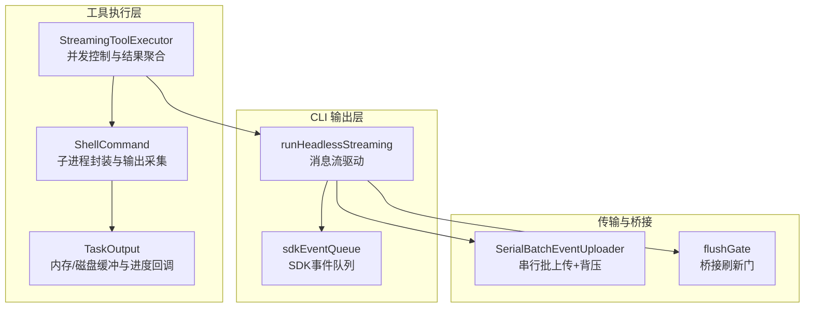
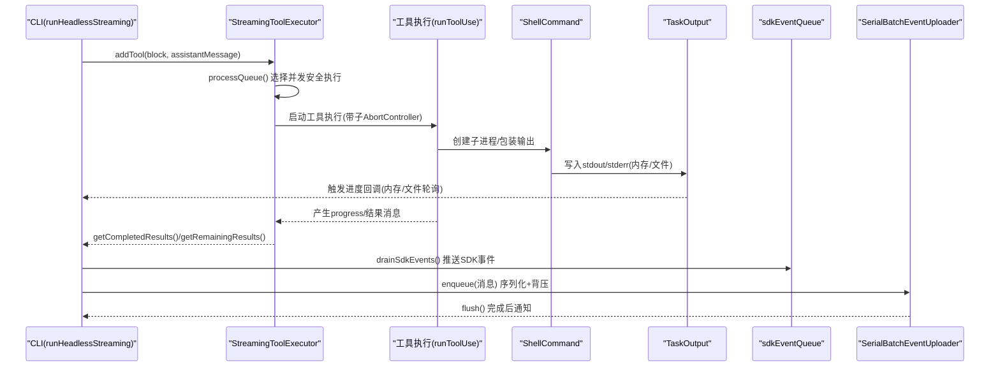
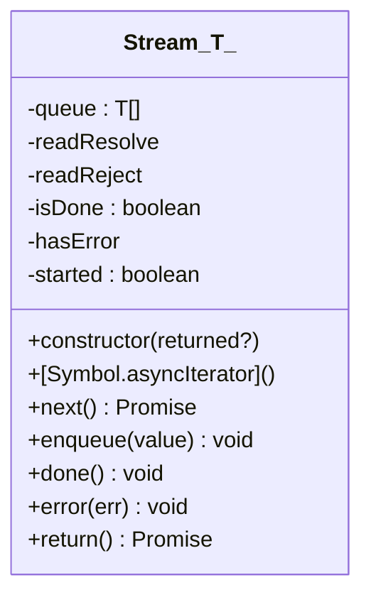
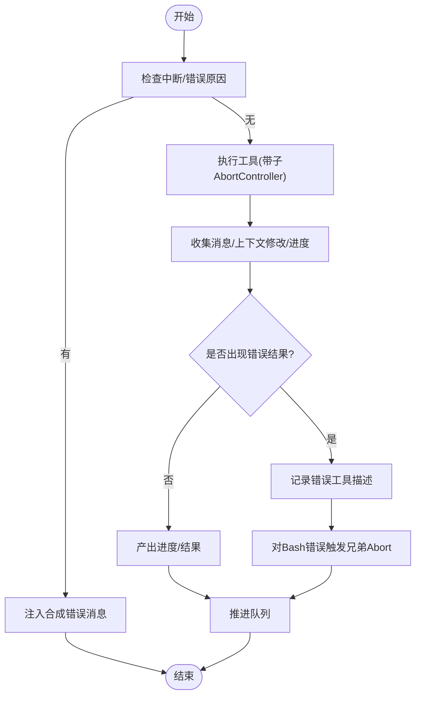
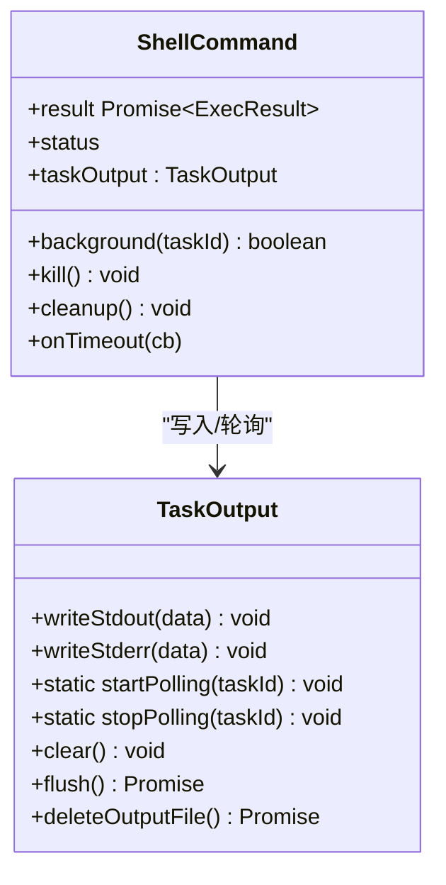
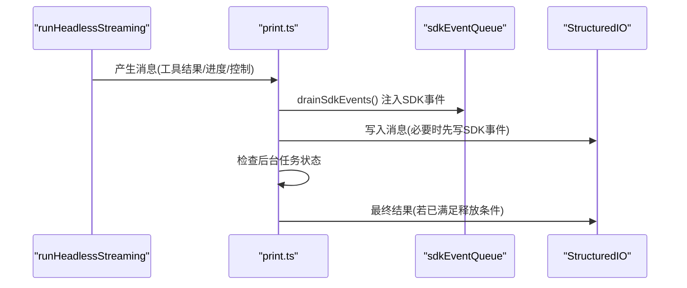
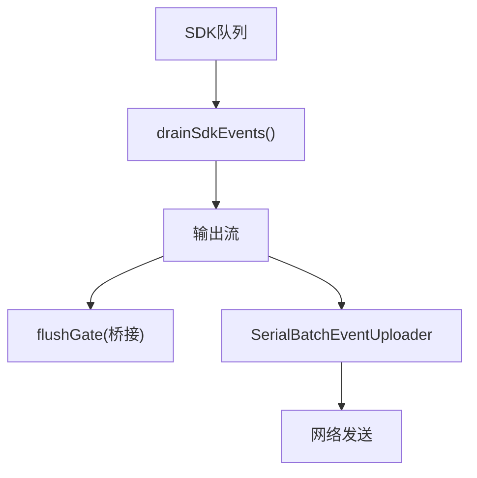
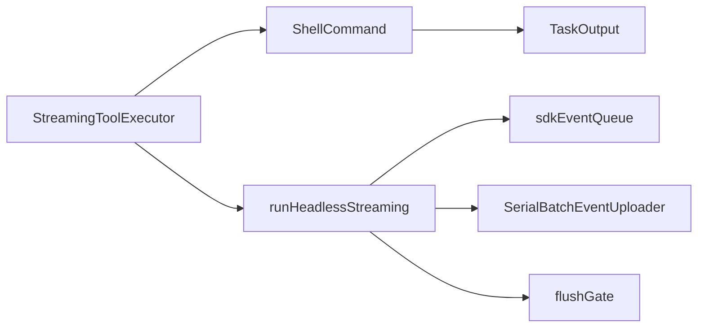

# 流式执行器

<cite>
**本文引用的文件**
- [src/utils/stream.ts](file://src/utils/stream.ts)
- [src/services/tools/StreamingToolExecutor.ts](file://src/services/tools/StreamingToolExecutor.ts)
- [src/utils/ShellCommand.ts](file://src/utils/ShellCommand.ts)
- [src/utils/task/TaskOutput.ts](file://src/utils/task/TaskOutput.ts)
- [src/cli/print.ts](file://src/cli/print.ts)
- [src/utils/sdkEventQueue.ts](file://src/utils/sdkEventQueue.ts)
- [src/services/api/claude.ts](file://src/services/api/claude.ts)
- [src/cli/transports/SerialBatchEventUploader.ts](file://src/cli/transports/SerialBatchEventUploader.ts)
- [src/bridge/flushGate.ts](file://src/bridge/flushGate.ts)
</cite>

## 目录
1. [引言](#引言)
2. [项目结构](#项目结构)
3. [核心组件](#核心组件)
4. [架构总览](#架构总览)
5. [详细组件分析](#详细组件分析)
6. [依赖关系分析](#依赖关系分析)
7. [性能考量](#性能考量)
8. [故障排查指南](#故障排查指南)
9. [结论](#结论)
10. [附录](#附录)

## 引言
本文件系统性阐述 Claude Code 的“流式执行器”实现，重点覆盖以下方面：
- 实时输出处理：如何在工具执行过程中持续产出中间结果与进度信息
- 进度反馈机制：如何在 CLI/TUI/SDK 等不同环境下提供及时的进度提示
- 中断处理：用户输入新消息或工具错误时的中断传播与清理
- Stream 类设计与使用：异步迭代器的入队/出队、完成与错误传播
- 缓冲区管理与背压：串行批上传器、SDK 事件队列、任务输出溢出到磁盘
- 错误恢复：重试、降级、丢弃批次与资源清理
- 与传统执行器的差异与优势：并发安全、顺序一致性、可中断性、可观测性
- 性能优化与内存管理：内存上限、文件轮询、背压与批量发送

## 项目结构
围绕流式执行的关键模块如下：
- 工具执行与并发控制：StreamingToolExecutor
- 子进程与输出采集：ShellCommand、TaskOutput
- CLI 输出与消息流：print.ts（runHeadlessStreaming）
- SDK 事件队列：sdkEventQueue.ts
- 资源清理：cleanupStream（api/claude.ts）
- 批量传输与背压：SerialBatchEventUploader
- 桥接层刷新门：flushGate

**图表来源**
- [src/services/tools/StreamingToolExecutor.ts:40-520](file://src/services/tools/StreamingToolExecutor.ts#L40-L520)
- [src/utils/ShellCommand.ts:114-180](file://src/utils/ShellCommand.ts#L114-L180)
- [src/utils/task/TaskOutput.ts:32-164](file://src/utils/task/TaskOutput.ts#L32-L164)
- [src/cli/print.ts:976-1009](file://src/cli/print.ts#L976-L1009)
- [src/utils/sdkEventQueue.ts:74-101](file://src/utils/sdkEventQueue.ts#L74-L101)
- [src/cli/transports/SerialBatchEventUploader.ts:64-200](file://src/cli/transports/SerialBatchEventUploader.ts#L64-L200)
- [src/bridge/flushGate.ts:52-71](file://src/bridge/flushGate.ts#L52-L71)

**章节来源**
- [src/services/tools/StreamingToolExecutor.ts:40-520](file://src/services/tools/StreamingToolExecutor.ts#L40-L520)
- [src/utils/ShellCommand.ts:114-180](file://src/utils/ShellCommand.ts#L114-L180)
- [src/utils/task/TaskOutput.ts:32-164](file://src/utils/task/TaskOutput.ts#L32-L164)
- [src/cli/print.ts:976-1009](file://src/cli/print.ts#L976-L1009)
- [src/utils/sdkEventQueue.ts:74-101](file://src/utils/sdkEventQueue.ts#L74-L101)
- [src/cli/transports/SerialBatchEventUploader.ts:64-200](file://src/cli/transports/SerialBatchEventUploader.ts#L64-L200)
- [src/bridge/flushGate.ts:52-71](file://src/bridge/flushGate.ts#L52-L71)

## 核心组件
- Stream<T>：通用异步迭代器，支持 enqueue/done/error/return，用于在工具执行器与 CLI 之间传递消息流
- StreamingToolExecutor：按并发安全规则调度工具执行，收集中间进度与最终结果，支持中断与回滚
- ShellCommand/TaskOutput：封装子进程与输出采集，内存上限触发溢出到磁盘，文件模式通过轮询获取进度
- runHeadlessStreaming：CLI 主循环，驱动工具执行器与 SDK 事件队列，实时输出并处理中断
- SerialBatchEventUploader：串行批上传器，实现背压、指数退避重试、批次大小/字节限制
- sdkEventQueue：SDK 事件队列，确保后台任务状态与会话状态在流中可见
- cleanupStream：资源清理，避免内存泄漏

**章节来源**
- [src/utils/stream.ts:1-77](file://src/utils/stream.ts#L1-L77)
- [src/services/tools/StreamingToolExecutor.ts:40-520](file://src/services/tools/StreamingToolExecutor.ts#L40-L520)
- [src/utils/ShellCommand.ts:114-180](file://src/utils/ShellCommand.ts#L114-L180)
- [src/utils/task/TaskOutput.ts:32-164](file://src/utils/task/TaskOutput.ts#L32-L164)
- [src/cli/print.ts:976-1009](file://src/cli/print.ts#L976-L1009)
- [src/utils/sdkEventQueue.ts:74-101](file://src/utils/sdkEventQueue.ts#L74-L101)
- [src/services/api/claude.ts:2894-2912](file://src/services/api/claude.ts#L2894-L2912)

## 架构总览
下面以序列图展示一次“流式工具执行”的关键流程：工具被添加到执行器 -> 并发条件满足后开始执行 -> 工具生成中间进度与结果 -> 执行器聚合并按序产出 -> CLI 输出层实时转发 -> SDK 事件队列与桥接传输。

**图表来源**
- [src/services/tools/StreamingToolExecutor.ts:76-124](file://src/services/tools/StreamingToolExecutor.ts#L76-L124)
- [src/utils/ShellCommand.ts:114-180](file://src/utils/ShellCommand.ts#L114-L180)
- [src/utils/task/TaskOutput.ts:166-200](file://src/utils/task/TaskOutput.ts#L166-L200)
- [src/utils/sdkEventQueue.ts:89-101](file://src/utils/sdkEventQueue.ts#L89-L101)
- [src/cli/transports/SerialBatchEventUploader.ts:101-133](file://src/cli/transports/SerialBatchEventUploader.ts#L101-L133)

## 详细组件分析

### Stream 类设计与使用
- 设计要点
  - 单次迭代约束：只允许一次异步迭代
  - 入队/出队：enqueue 将值直接交付给等待的 next；否则进入内部队列
  - 结束与错误：done/error 分别触发迭代结束与异常传播
  - 返回钩子：return 触发清理回调
- 使用场景
  - 工具执行器与 CLI 之间的消息通道
  - SDK 事件队列的临时存储与一次性消费
  - 任何需要“生产者-消费者”解耦的异步数据流

**图表来源**
- [src/utils/stream.ts:1-77](file://src/utils/stream.ts#L1-L77)

**章节来源**
- [src/utils/stream.ts:1-77](file://src/utils/stream.ts#L1-L77)

### StreamingToolExecutor：并发控制与中断传播
- 并发策略
  - 并发安全工具：可与其他并发安全工具并行
  - 非并发工具：必须独占执行，阻塞后续非并发工具
- 中断与回滚
  - 用户中断：根据工具中断行为决定取消或阻断
  - 兄弟工具错误：Bash 错误会触发兄弟子进程同步终止
  - 流式回退：当失败时丢弃当前批次并注入合成错误
- 进度与结果
  - 进度消息优先立即产出
  - 结果按到达顺序聚合，完成后标记为已产出
- 上下文修改
  - 非并发工具可修改上下文，需在顺序上应用

**图表来源**
- [src/services/tools/StreamingToolExecutor.ts:210-241](file://src/services/tools/StreamingToolExecutor.ts#L210-L241)
- [src/services/tools/StreamingToolExecutor.ts:332-382](file://src/services/tools/StreamingToolExecutor.ts#L332-L382)
- [src/services/tools/StreamingToolExecutor.ts:412-440](file://src/services/tools/StreamingToolExecutor.ts#L412-L440)

**章节来源**
- [src/services/tools/StreamingToolExecutor.ts:40-520](file://src/services/tools/StreamingToolExecutor.ts#L40-L520)

### ShellCommand 与 TaskOutput：输出采集与溢出策略
- ShellCommand
  - 文件模式：stdout/stderr 直写文件 fd，JS 不参与数据流
  - 管道模式：通过 StreamWrapper 将数据写入 TaskOutput
  - 超时与大小监控：超时自动挂起或终止；大小 watchdog 防止磁盘爆满
- TaskOutput
  - 内存上限：超过阈值则溢出到磁盘文件
  - 进度回调：文件模式通过轮询尾部计算行数/字节数；管道模式实时更新
  - 清理：停止轮询、释放监听、删除冗余文件

**图表来源**
- [src/utils/ShellCommand.ts:32-47](file://src/utils/ShellCommand.ts#L32-L47)
- [src/utils/TaskOutput.ts:32-164](file://src/utils/task/TaskOutput.ts#L32-L164)

**章节来源**
- [src/utils/ShellCommand.ts:114-180](file://src/utils/ShellCommand.ts#L114-L180)
- [src/utils/task/TaskOutput.ts:166-200](file://src/utils/task/TaskOutput.ts#L166-L200)

### CLI runHeadlessStreaming：消息流驱动与实时输出
- 主循环
  - 逐条消费 runHeadlessStreaming 产生的消息
  - 在流式模式下优先输出 SDK 事件与进度，再输出最终结果
  - 支持流式转换器与多种输出格式
- 事件队列
  - drainSdkEvents 将 SDK 事件注入输出流，保证后台任务状态可见
- 结果持有与延迟输出
  - 当存在后台任务运行时，结果可能被暂缓，待后台任务结束后统一发出

**图表来源**
- [src/cli/print.ts:863-916](file://src/cli/print.ts#L863-L916)
- [src/utils/sdkEventQueue.ts:89-101](file://src/utils/sdkEventQueue.ts#L89-L101)

**章节来源**
- [src/cli/print.ts:863-916](file://src/cli/print.ts#L863-L916)
- [src/utils/sdkEventQueue.ts:74-101](file://src/utils/sdkEventQueue.ts#L74-L101)

### SDK 事件队列与桥接传输
- SDK 事件队列
  - 仅在非交互会话启用，避免 TUI 下事件堆积
  - 提供 drainSdkEvents 将事件注入输出流
  - 终止事件 emitTaskTerminatedSdk 用于 SDK 消费者感知任务生命周期
- 桥接刷新门
  - 控制桥接传输的激活/去激活/丢弃，避免在传输替换时丢失消息
- 串行批上传器
  - 串行发送、批量聚合、背压阻塞、指数退避重试、可配置最大连续失败丢弃批次

**图表来源**
- [src/utils/sdkEventQueue.ts:89-101](file://src/utils/sdkEventQueue.ts#L89-L101)
- [src/bridge/flushGate.ts:52-71](file://src/bridge/flushGate.ts#L52-L71)
- [src/cli/transports/SerialBatchEventUploader.ts:101-133](file://src/cli/transports/SerialBatchEventUploader.ts#L101-L133)

**章节来源**
- [src/utils/sdkEventQueue.ts:74-134](file://src/utils/sdkEventQueue.ts#L74-L134)
- [src/bridge/flushGate.ts:52-71](file://src/bridge/flushGate.ts#L52-L71)
- [src/cli/transports/SerialBatchEventUploader.ts:64-200](file://src/cli/transports/SerialBatchEventUploader.ts#L64-L200)

### 资源清理与错误恢复
- cleanupStream：在流结束或异常时主动中止控制器，防止资源泄漏
- SerialBatchEventUploader：失败时指数退避、可配置最大连续失败丢弃批次，避免雪崩
- ShellCommand：超时自动挂起或终止，大小 watchdog 防止磁盘爆满

**章节来源**
- [src/services/api/claude.ts:2894-2912](file://src/services/api/claude.ts#L2894-L2912)
- [src/cli/transports/SerialBatchEventUploader.ts:156-200](file://src/cli/transports/SerialBatchEventUploader.ts#L156-L200)
- [src/utils/ShellCommand.ts:135-141](file://src/utils/ShellCommand.ts#L135-L141)

## 依赖关系分析
- StreamingToolExecutor 依赖工具定义、权限校验、上下文与子 AbortController
- ShellCommand 依赖 TaskOutput 以进行内存/磁盘缓冲与进度回调
- CLI runHeadlessStreaming 依赖 SDK 事件队列与串行批上传器
- 串行批上传器与桥接刷新门共同保障传输稳定性

**图表来源**
- [src/services/tools/StreamingToolExecutor.ts:53-62](file://src/services/tools/StreamingToolExecutor.ts#L53-L62)
- [src/utils/ShellCommand.ts:114-180](file://src/utils/ShellCommand.ts#L114-L180)
- [src/utils/task/TaskOutput.ts:32-164](file://src/utils/task/TaskOutput.ts#L32-L164)
- [src/cli/print.ts:976-1009](file://src/cli/print.ts#L976-L1009)
- [src/utils/sdkEventQueue.ts:74-101](file://src/utils/sdkEventQueue.ts#L74-L101)
- [src/cli/transports/SerialBatchEventUploader.ts:64-133](file://src/cli/transports/SerialBatchEventUploader.ts#L64-L133)
- [src/bridge/flushGate.ts:52-71](file://src/bridge/flushGate.ts#L52-L71)

**章节来源**
- [src/services/tools/StreamingToolExecutor.ts:40-62](file://src/services/tools/StreamingToolExecutor.ts#L40-L62)
- [src/utils/ShellCommand.ts:114-180](file://src/utils/ShellCommand.ts#L114-L180)
- [src/utils/task/TaskOutput.ts:32-164](file://src/utils/task/TaskOutput.ts#L32-L164)
- [src/cli/print.ts:976-1009](file://src/cli/print.ts#L976-L1009)
- [src/utils/sdkEventQueue.ts:74-101](file://src/utils/sdkEventQueue.ts#L74-L101)
- [src/cli/transports/SerialBatchEventUploader.ts:64-133](file://src/cli/transports/SerialBatchEventUploader.ts#L64-L133)
- [src/bridge/flushGate.ts:52-71](file://src/bridge/flushGate.ts#L52-L71)

## 性能考量
- 并发与顺序
  - 并发安全工具并行提升吞吐；非并发工具严格顺序保证一致性
- 背压与批处理
  - 串行批上传器限制队列长度与单批大小/字节，避免内存峰值
  - RetryableError 支持服务端 Retry-After，平滑退避
- 内存与磁盘
  - TaskOutput 内存上限触发溢出到磁盘，避免 OOM
  - 文件模式通过轮询尾部计算进度，减少频繁全量读取
- I/O 与轮询
  - 轮询间隔固定，避免过载；空闲时仍唤醒以检测后台挂起状态
- 中断与清理
  - 子 AbortController 与兄弟 Abort 传播，快速终止无效工作
  - cleanupStream 主动中止控制器，防止资源泄漏

[本节为通用性能建议，不直接分析具体文件]

## 故障排查指南
- 工具执行卡住
  - 检查是否为非并发工具阻塞；查看 StreamingToolExecutor 的执行状态
  - 若为 Bash 命令，确认是否因兄弟错误被中止
- 输出缺失或延迟
  - 确认 SDK 事件队列是否在非交互会话启用
  - 检查串行批上传器 pendingCount 与 droppedBatchCount
- 磁盘占用过高
  - 检查 ShellCommand 的大小 watchdog 是否触发
  - TaskOutput 是否正确溢出到磁盘并清理冗余文件
- 资源泄漏
  - 确保在流结束或异常路径调用 cleanupStream
  - 检查 flushGate 是否正确 deactivate/drop

**章节来源**
- [src/services/tools/StreamingToolExecutor.ts:210-241](file://src/services/tools/StreamingToolExecutor.ts#L210-L241)
- [src/utils/sdkEventQueue.ts:74-101](file://src/utils/sdkEventQueue.ts#L74-L101)
- [src/cli/transports/SerialBatchEventUploader.ts:88-133](file://src/cli/transports/SerialBatchEventUploader.ts#L88-L133)
- [src/utils/ShellCommand.ts:135-141](file://src/utils/ShellCommand.ts#L135-L141)
- [src/utils/task/TaskOutput.ts:361-389](file://src/utils/task/TaskOutput.ts#L361-L389)
- [src/services/api/claude.ts:2894-2912](file://src/services/api/claude.ts#L2894-L2912)
- [src/bridge/flushGate.ts:52-71](file://src/bridge/flushGate.ts#L52-L71)

## 结论
Claude Code 的流式执行器通过“并发安全调度 + 顺序一致性 + 实时进度 + 可中断传播 + 背压与批处理 + 资源清理”的组合，实现了高可靠、低延迟、可观测的工具执行体验。相较传统执行器，它在以下方面具备显著优势：
- 实时性：进度与中间结果即时产出，避免长时间等待
- 可控性：严格的中断传播与回滚，支持用户与工具错误的快速收敛
- 可扩展性：串行批上传器与 SDK 事件队列使输出与桥接易于扩展
- 稳定性：内存上限与磁盘溢出、超时与大小监控、指数退避重试等机制降低崩溃风险

[本节为总结性内容，不直接分析具体文件]

## 附录
- 关键实现位置参考
  - Stream 类：[src/utils/stream.ts:1-77](file://src/utils/stream.ts#L1-L77)
  - 流式工具执行器：[src/services/tools/StreamingToolExecutor.ts:40-520](file://src/services/tools/StreamingToolExecutor.ts#L40-L520)
  - 子进程与输出：[src/utils/ShellCommand.ts:114-180](file://src/utils/ShellCommand.ts#L114-L180)、[src/utils/task/TaskOutput.ts:32-164](file://src/utils/task/TaskOutput.ts#L32-L164)
  - CLI 主循环：[src/cli/print.ts:976-1009](file://src/cli/print.ts#L976-L1009)
  - SDK 事件队列：[src/utils/sdkEventQueue.ts:74-134](file://src/utils/sdkEventQueue.ts#L74-L134)
  - 资源清理：[src/services/api/claude.ts:2894-2912](file://src/services/api/claude.ts#L2894-L2912)
  - 串行批上传器：[src/cli/transports/SerialBatchEventUploader.ts:64-200](file://src/cli/transports/SerialBatchEventUploader.ts#L64-L200)
  - 桥接刷新门：[src/bridge/flushGate.ts:52-71](file://src/bridge/flushGate.ts#L52-L71)