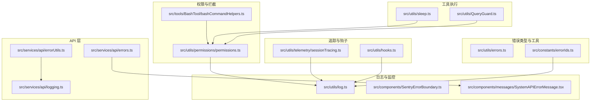
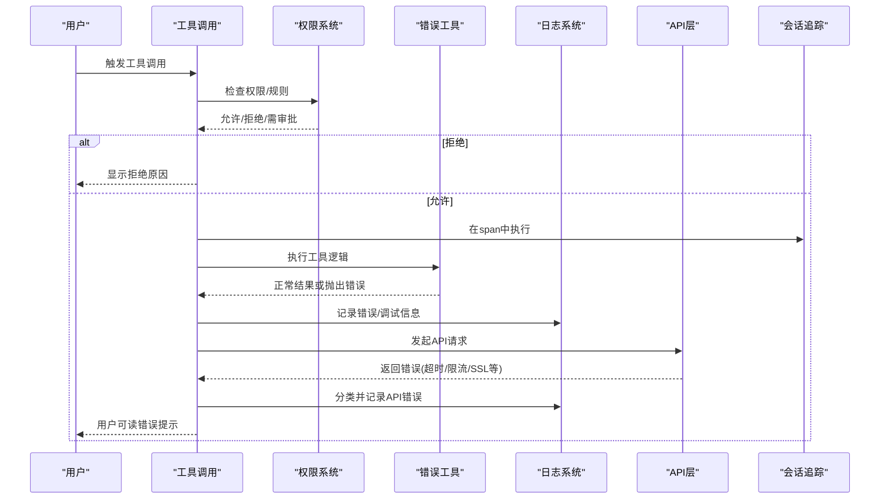
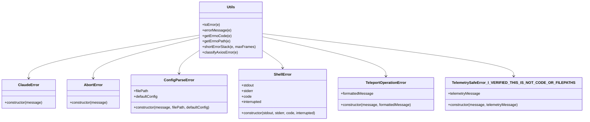
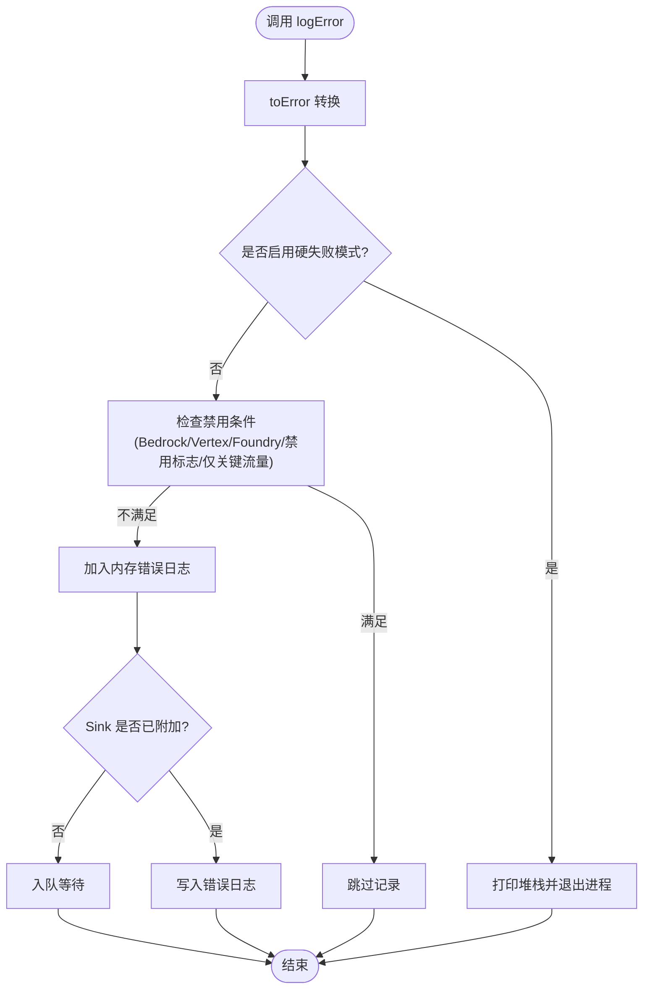
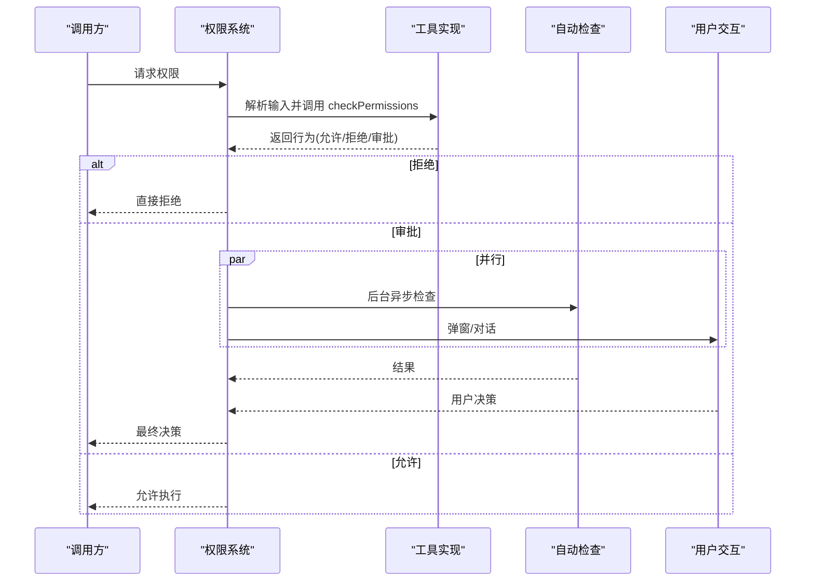
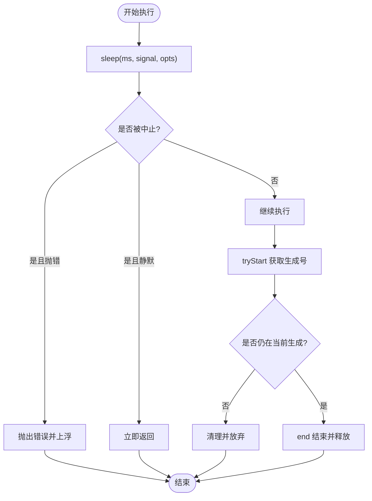
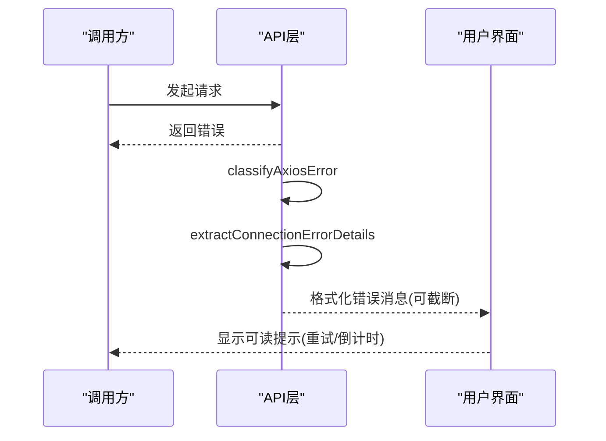
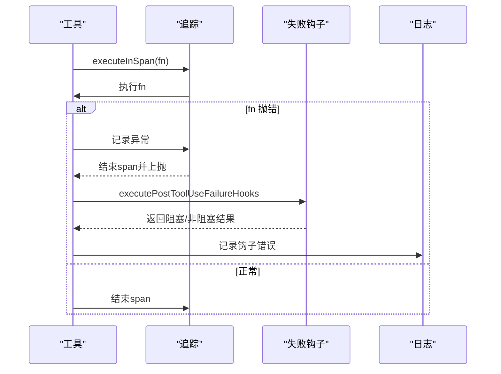
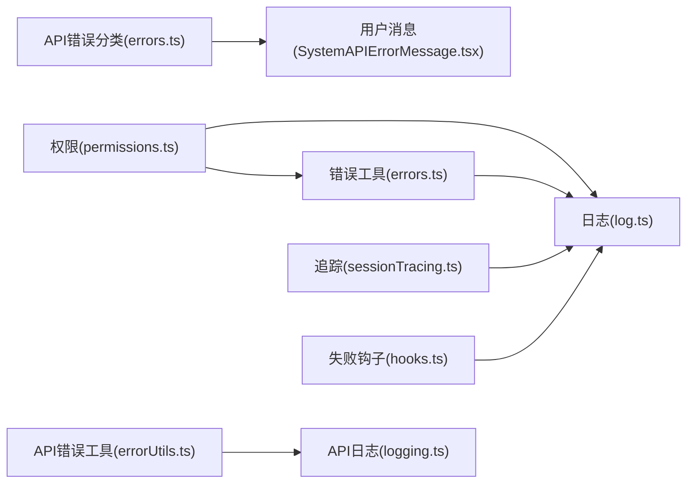

# 错误处理机制

<cite>
**本文档引用的文件**
- [src/utils/errors.ts](file://src/utils/errors.ts)
- [src/utils/log.ts](file://src/utils/log.ts)
- [src/constants/errorIds.ts](file://src/constants/errorIds.ts)
- [src/utils/permissions/permissions.ts](file://src/utils/permissions/permissions.ts)
- [src/tools/BashTool/bashCommandHelpers.ts](file://src/tools/BashTool/bashCommandHelpers.ts)
- [src/services/api/errors.ts](file://src/services/api/errors.ts)
- [src/services/api/errorUtils.ts](file://src/services/api/errorUtils.ts)
- [src/services/api/logging.ts](file://src/services/api/logging.ts)
- [src/utils/sleep.ts](file://src/utils/sleep.ts)
- [src/utils/QueryGuard.ts](file://src/utils/QueryGuard.ts)
- [src/utils/hooks.ts](file://src/utils/hooks.ts)
- [src/utils/telemetry/sessionTracing.ts](file://src/utils/telemetry/sessionTracing.ts)
- [src/components/SentryErrorBoundary.ts](file://src/components/SentryErrorBoundary.ts)
- [src/components/messages/SystemAPIErrorMessage.tsx](file://src/components/messages/SystemAPIErrorMessage.tsx)
</cite>

## 目录
1. [简介](#简介)
2. [项目结构](#项目结构)
3. [核心组件](#核心组件)
4. [架构总览](#架构总览)
5. [详细组件分析](#详细组件分析)
6. [依赖关系分析](#依赖关系分析)
7. [性能考量](#性能考量)
8. [故障排查指南](#故障排查指南)
9. [结论](#结论)
10. [附录](#附录)

## 简介
本文件系统性梳理 Claude Code 工具执行过程中的错误处理机制，覆盖输入验证错误、权限拒绝错误、执行时错误等的分类与处理策略；解释错误的捕获、转换、传播机制（含异常链维护、错误信息格式化）；阐述错误恢复与重试机制（幂等性保证、状态回滚）；说明错误日志记录与监控（错误分类、统计分析、告警机制）；并提供最佳实践与调试技巧。

## 项目结构
围绕错误处理的关键模块分布如下：
- 错误类型与工具：统一的错误类、错误码提取、栈截断、分类器等
- 日志与监控：错误日志记录、内存缓存、持久化、错误队列、Sentry 边界
- 权限与拦截：工具调用前的权限检查与拒绝流程
- 工具执行：Bash 等工具执行、中断与超时处理
- API 层：网络/SSL/速率限制等错误分类与用户提示
- 钩子与追踪：失败钩子、会话追踪、慢操作日志

**图表来源**
- [src/utils/errors.ts](file://src/utils/errors.ts)
- [src/utils/log.ts](file://src/utils/log.ts)
- [src/constants/errorIds.ts](file://src/constants/errorIds.ts)
- [src/utils/permissions/permissions.ts](file://src/utils/permissions/permissions.ts)
- [src/tools/BashTool/bashCommandHelpers.ts](file://src/tools/BashTool/bashCommandHelpers.ts)
- [src/services/api/errors.ts](file://src/services/api/errors.ts)
- [src/services/api/errorUtils.ts](file://src/services/api/errorUtils.ts)
- [src/services/api/logging.ts](file://src/services/api/logging.ts)
- [src/utils/sleep.ts](file://src/utils/sleep.ts)
- [src/utils/QueryGuard.ts](file://src/utils/QueryGuard.ts)
- [src/utils/telemetry/sessionTracing.ts](file://src/utils/telemetry/sessionTracing.ts)
- [src/utils/hooks.ts](file://src/utils/hooks.ts)
- [src/components/SentryErrorBoundary.ts](file://src/components/SentryErrorBoundary.ts)
- [src/components/messages/SystemAPIErrorMessage.tsx](file://src/components/messages/SystemAPIErrorMessage.tsx)

**章节来源**
- [src/utils/errors.ts](file://src/utils/errors.ts)
- [src/utils/log.ts](file://src/utils/log.ts)
- [src/utils/permissions/permissions.ts](file://src/utils/permissions/permissions.ts)
- [src/tools/BashTool/bashCommandHelpers.ts](file://src/tools/BashTool/bashCommandHelpers.ts)
- [src/services/api/errors.ts](file://src/services/api/errors.ts)
- [src/services/api/errorUtils.ts](file://src/services/api/errorUtils.ts)
- [src/services/api/logging.ts](file://src/services/api/logging.ts)
- [src/utils/sleep.ts](file://src/utils/sleep.ts)
- [src/utils/QueryGuard.ts](file://src/utils/QueryGuard.ts)
- [src/utils/telemetry/sessionTracing.ts](file://src/utils/telemetry/sessionTracing.ts)
- [src/utils/hooks.ts](file://src/utils/hooks.ts)
- [src/components/SentryErrorBoundary.ts](file://src/components/SentryErrorBoundary.ts)
- [src/components/messages/SystemAPIErrorMessage.tsx](file://src/components/messages/SystemAPIErrorMessage.tsx)

## 核心组件
- 统一错误类型与工具
  - 自定义错误类：如工具错误、中止错误、配置解析错误、Shell 错误、遥测安全错误等
  - 错误转换与提取：未知值转 Error、消息字符串提取、errno 代码与路径提取、短栈截断
  - 错误分类：针对 axios 请求的错误分类（认证、超时、网络、HTTP、其他）
- 错误日志与监控
  - 错误日志记录：内存缓存、持久化文件、错误队列、Sink 接口
  - 硬失败模式：命令行参数触发的硬失败，直接退出进程
  - 错误 ID：用于生产环境追踪错误来源的标识符
- 权限与拦截
  - 权限请求消息构建、规则来源显示、拒绝阈值与回退策略
  - 工具特定权限检查（如 Bash 子命令规则），支持自动检查与交互式对话
- 工具执行与重试
  - 中断响应睡眠：支持 AbortSignal 的超时与取消
  - 查询守卫：并发控制与过期清理，避免陈旧 finally 块
  - API 错误分类：超时、重复 529、容量关闭、速率限制、服务器过载、内容大小等
- 追踪与钩子
  - 会话追踪：在 span 中记录异常，确保错误传播
  - 失败钩子：工具失败后的后置钩子执行与非阻塞错误记录

**章节来源**
- [src/utils/errors.ts](file://src/utils/errors.ts)
- [src/utils/log.ts](file://src/utils/log.ts)
- [src/constants/errorIds.ts](file://src/constants/errorIds.ts)
- [src/utils/permissions/permissions.ts](file://src/utils/permissions/permissions.ts)
- [src/tools/BashTool/bashCommandHelpers.ts](file://src/tools/BashTool/bashCommandHelpers.ts)
- [src/utils/sleep.ts](file://src/utils/sleep.ts)
- [src/utils/QueryGuard.ts](file://src/utils/QueryGuard.ts)
- [src/services/api/errors.ts](file://src/services/api/errors.ts)
- [src/utils/telemetry/sessionTracing.ts](file://src/utils/telemetry/sessionTracing.ts)
- [src/utils/hooks.ts](file://src/utils/hooks.ts)

## 架构总览
下图展示从工具调用到错误处理与监控的整体流程，包括权限检查、执行、错误捕获、日志记录与用户提示。

**图表来源**
- [src/utils/permissions/permissions.ts](file://src/utils/permissions/permissions.ts)
- [src/utils/errors.ts](file://src/utils/errors.ts)
- [src/utils/log.ts](file://src/utils/log.ts)
- [src/services/api/errors.ts](file://src/services/api/errors.ts)
- [src/utils/telemetry/sessionTracing.ts](file://src/utils/telemetry/sessionTracing.ts)

## 详细组件分析

### 组件A：错误类型与工具
- 错误类体系
  - 工具相关：MalformedCommandError、ShellError、TeleportOperationError
  - 中止与异常：AbortError、APIUserAbortError、ClaudeError
  - 配置与遥测：ConfigParseError、TelemetrySafeError_I_VERIFIED_THIS_IS_NOT_CODE_OR_FILEPATHS
- 错误转换与提取
  - toError：将任意值转换为 Error 实例
  - errorMessage：提取消息字符串
  - getErrnoCode/getErrnoPath：提取 errno 代码与路径
  - shortErrorStack：截断堆栈帧，避免上下文浪费
- 错误分类
  - classifyAxiosError：对 axios 错误进行分类（认证、超时、网络、HTTP、其他）

**图表来源**
- [src/utils/errors.ts](file://src/utils/errors.ts)

**章节来源**
- [src/utils/errors.ts](file://src/utils/errors.ts)

### 组件B：错误日志与监控
- 日志系统
  - 内存错误日志：最近 100 条，支持查询
  - Sink 接口：统一的错误输出目标，支持 MCP 错误与调试
  - 错误队列：Sink 未就绪时暂存事件，就绪后立即投递
  - 硬失败模式：通过命令行参数触发，直接退出进程
- 错误 ID
  - 生产环境追踪错误来源的标识符集合
- Sentry 边界
  - React 错误边界，捕获渲染错误并静默处理

**图表来源**
- [src/utils/log.ts](file://src/utils/log.ts)
- [src/utils/errors.ts](file://src/utils/errors.ts)
- [src/constants/errorIds.ts](file://src/constants/errorIds.ts)
- [src/components/SentryErrorBoundary.ts](file://src/components/SentryErrorBoundary.ts)

**章节来源**
- [src/utils/log.ts](file://src/utils/log.ts)
- [src/constants/errorIds.ts](file://src/constants/errorIds.ts)
- [src/components/SentryErrorBoundary.ts](file://src/components/SentryErrorBoundary.ts)

### 组件C：权限与拦截
- 权限请求消息
  - 支持多种决策原因：分类器、Hook、规则、子命令结果、沙箱覆盖、工作目录、安全检查等
- 工具特定权限检查
  - Bash 子命令规则：解析命令 AST，分派到具体检查器
  - 工具实现的 checkPermissions：允许、拒绝或需要审批
- 自动检查与交互式对话
  - 异步自动检查与用户交互竞速，避免阻塞
  - 一次性解析与用户交互标记，防止重复决议

**图表来源**
- [src/utils/permissions/permissions.ts](file://src/utils/permissions/permissions.ts)
- [src/tools/BashTool/bashCommandHelpers.ts](file://src/tools/BashTool/bashCommandHelpers.ts)

**章节来源**
- [src/utils/permissions/permissions.ts](file://src/utils/permissions/permissions.ts)
- [src/tools/BashTool/bashCommandHelpers.ts](file://src/tools/BashTool/bashCommandHelpers.ts)

### 组件D：工具执行与重试
- 中断响应睡眠
  - 支持 AbortSignal，可选择抛出错误或静默返回
  - 用于重试循环中避免阻塞关闭
- 查询守卫
  - 生成号管理并发，过期任务及时清理，避免陈旧 finally 块
- API 错误分类
  - 超时、重复 529、容量关闭、429 速率限制、529 服务器过载、提示长度、PDF 错误等

**图表来源**
- [src/utils/sleep.ts](file://src/utils/sleep.ts)
- [src/utils/QueryGuard.ts](file://src/utils/QueryGuard.ts)
- [src/services/api/errors.ts](file://src/services/api/errors.ts)

**章节来源**
- [src/utils/sleep.ts](file://src/utils/sleep.ts)
- [src/utils/QueryGuard.ts](file://src/utils/QueryGuard.ts)
- [src/services/api/errors.ts](file://src/services/api/errors.ts)

### 组件E：API 层错误处理
- 错误分类与用户提示
  - classifyAxiosError：认证、超时、网络、HTTP、其他
  - 提取连接错误详情（SSL 错误码、消息），用于调试日志
  - 针对 SSL 错误的详细提示（证书过期、吊销、主机名不匹配等）
- 用户可见错误消息
  - 截断与展开控制，避免长文本影响界面
  - 重试倒计时与最大重试次数提示

**图表来源**
- [src/services/api/errors.ts](file://src/services/api/errors.ts)
- [src/services/api/errorUtils.ts](file://src/services/api/errorUtils.ts)
- [src/services/api/logging.ts](file://src/services/api/logging.ts)
- [src/components/messages/SystemAPIErrorMessage.tsx](file://src/components/messages/SystemAPIErrorMessage.tsx)

**章节来源**
- [src/services/api/errors.ts](file://src/services/api/errors.ts)
- [src/services/api/errorUtils.ts](file://src/services/api/errorUtils.ts)
- [src/services/api/logging.ts](file://src/services/api/logging.ts)
- [src/components/messages/SystemAPIErrorMessage.tsx](file://src/components/messages/SystemAPIErrorMessage.tsx)

### 组件F：追踪与钩子
- 会话追踪
  - 在 span 中执行，异常自动记录，确保可观测性
- 失败钩子
  - 工具失败后执行后置钩子，支持阻塞错误与非阻塞错误
  - 取消与异常均记录，不影响主流程

**图表来源**
- [src/utils/telemetry/sessionTracing.ts](file://src/utils/telemetry/sessionTracing.ts)
- [src/utils/hooks.ts](file://src/utils/hooks.ts)
- [src/utils/log.ts](file://src/utils/log.ts)

**章节来源**
- [src/utils/telemetry/sessionTracing.ts](file://src/utils/telemetry/sessionTracing.ts)
- [src/utils/hooks.ts](file://src/utils/hooks.ts)
- [src/utils/log.ts](file://src/utils/log.ts)

## 依赖关系分析
- 松耦合设计
  - 错误工具与日志系统通过接口解耦，Sink 可插拔
  - 权限系统与工具实现通过抽象接口解耦，便于扩展
- 关键依赖链
  - 权限系统依赖错误工具与日志系统进行异常记录
  - API 层依赖错误工具与日志系统进行错误分类与记录
  - 追踪与钩子依赖日志系统进行统一记录

**图表来源**
- [src/utils/errors.ts](file://src/utils/errors.ts)
- [src/utils/log.ts](file://src/utils/log.ts)
- [src/utils/permissions/permissions.ts](file://src/utils/permissions/permissions.ts)
- [src/services/api/errors.ts](file://src/services/api/errors.ts)
- [src/services/api/errorUtils.ts](file://src/services/api/errorUtils.ts)
- [src/services/api/logging.ts](file://src/services/api/logging.ts)
- [src/utils/telemetry/sessionTracing.ts](file://src/utils/telemetry/sessionTracing.ts)
- [src/utils/hooks.ts](file://src/utils/hooks.ts)
- [src/components/messages/SystemAPIErrorMessage.tsx](file://src/components/messages/SystemAPIErrorMessage.tsx)

**章节来源**
- [src/utils/errors.ts](file://src/utils/errors.ts)
- [src/utils/log.ts](file://src/utils/log.ts)
- [src/utils/permissions/permissions.ts](file://src/utils/permissions/permissions.ts)
- [src/services/api/errors.ts](file://src/services/api/errors.ts)
- [src/services/api/errorUtils.ts](file://src/services/api/errorUtils.ts)
- [src/services/api/logging.ts](file://src/services/api/logging.ts)
- [src/utils/telemetry/sessionTracing.ts](file://src/utils/telemetry/sessionTracing.ts)
- [src/utils/hooks.ts](file://src/utils/hooks.ts)
- [src/components/messages/SystemAPIErrorMessage.tsx](file://src/components/messages/SystemAPIErrorMessage.tsx)

## 性能考量
- 错误日志的内存上限与队列投递，避免阻塞主线程
- 短栈截断减少上下文占用，提高模型交互效率
- 中断响应睡眠与查询守卫避免无效计算与资源浪费
- API 错误分类与用户提示减少不必要的重试与刷新

## 故障排查指南
- 快速定位
  - 使用内存错误日志与持久化错误列表进行快速检索
  - 通过错误 ID 与时间戳定位生产问题
- 常见场景
  - 输入验证错误：检查工具 inputSchema 与 validateInput
  - 权限拒绝：查看权限规则来源与决策原因
  - 执行时错误：关注短栈截断后的关键帧数
  - API 错误：根据分类结果调整网络/代理/速率限制
- 调试技巧
  - 启用硬失败模式以快速暴露问题
  - 使用 Sentry 边界捕获前端渲染错误
  - 在追踪 span 中记录关键变量，便于回溯

**章节来源**
- [src/utils/log.ts](file://src/utils/log.ts)
- [src/utils/errors.ts](file://src/utils/errors.ts)
- [src/utils/permissions/permissions.ts](file://src/utils/permissions/permissions.ts)
- [src/services/api/errors.ts](file://src/services/api/errors.ts)
- [src/components/SentryErrorBoundary.ts](file://src/components/SentryErrorBoundary.ts)
- [src/utils/telemetry/sessionTracing.ts](file://src/utils/telemetry/sessionTracing.ts)

## 结论
该错误处理机制通过统一的错误类型、完善的日志与监控、严格的权限拦截、健壮的工具执行与重试策略，以及可观测的追踪与钩子，实现了从工具调用到用户反馈的全链路错误治理。建议在实际使用中遵循幂等性原则、合理设置重试与回退策略，并充分利用错误 ID 与追踪能力进行问题定位与优化。

## 附录
- 最佳实践
  - 对外部输入严格校验，使用 validateInput 与 inputSchema
  - 使用 TelemetrySafeError 保护敏感信息
  - 在工具实现中区分“可重试”与“不可重试”错误
  - 利用短栈截断减少上下文开销
  - 为关键路径添加追踪 span，记录异常
- 调试清单
  - 检查内存错误日志与持久化错误列表
  - 确认权限规则来源与决策原因
  - 查看 API 错误分类与 SSL 详情
  - 使用硬失败模式快速暴露问题
  - 在失败钩子中记录非阻塞错误以便后续分析