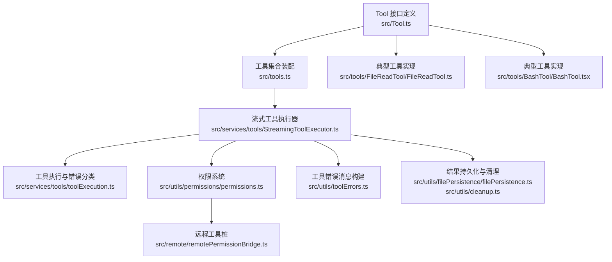
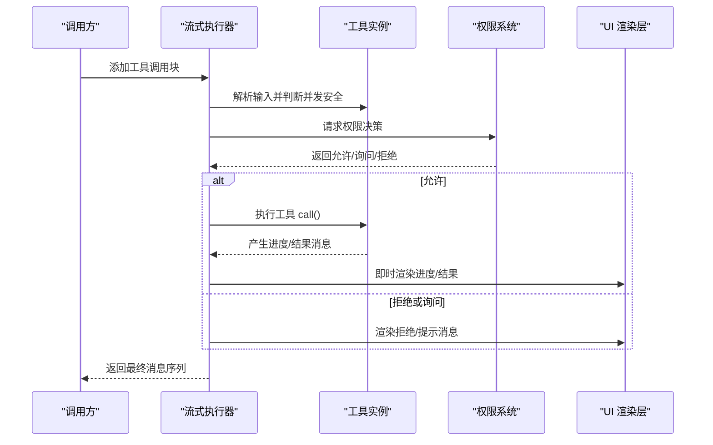
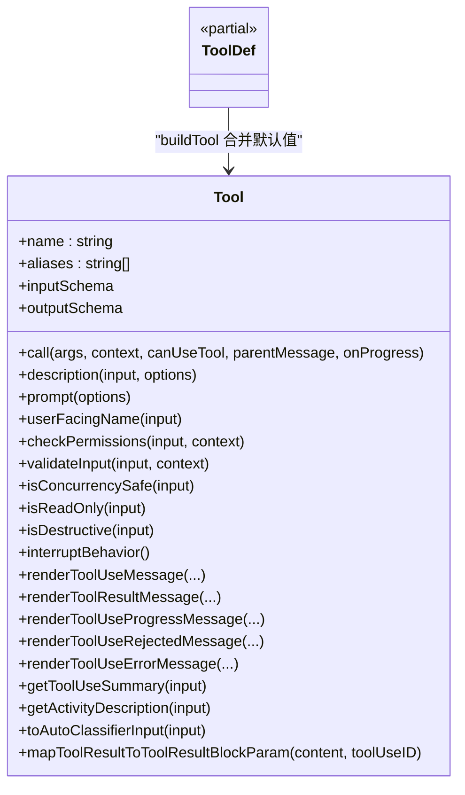
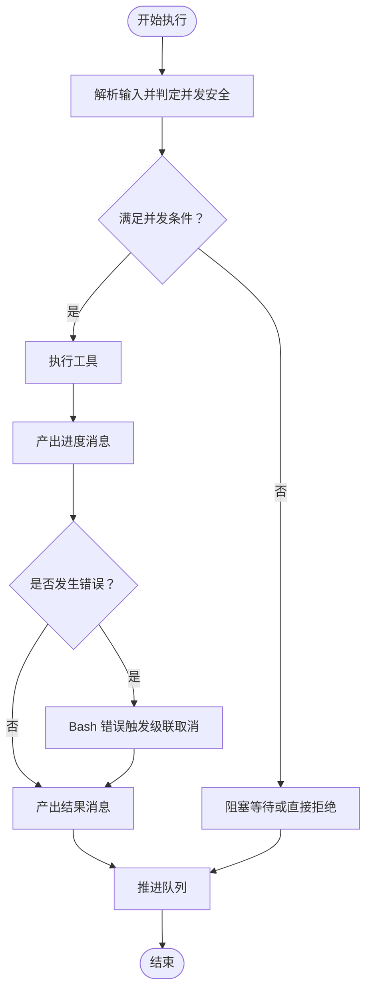
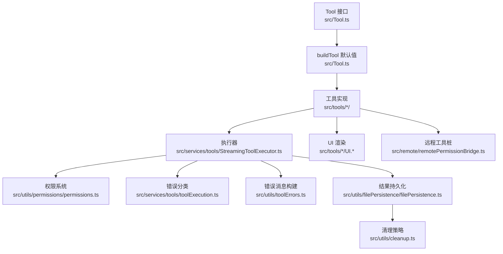

# 工具接口设计

<cite>
**本文引用的文件**
- [Tool.ts](file://src/Tool.ts)
- [tools.ts](file://src/tools.ts)
- [StreamingToolExecutor.ts](file://src/services/tools/StreamingToolExecutor.ts)
- [permissions.ts](file://src/utils/permissions/permissions.ts)
- [toolExecution.ts](file://src/services/tools/toolExecution.ts)
- [remotePermissionBridge.ts](file://src/remote/remotePermissionBridge.ts)
- [FileReadTool.ts](file://src/tools/FileReadTool/FileReadTool.ts)
- [BashTool.tsx](file://src/tools/BashTool/BashTool.tsx)
- [toolErrors.ts](file://src/utils/toolErrors.ts)
- [cleanup.ts](file://src/utils/cleanup.ts)
- [filePersistence.ts](file://src/utils/filePersistence/filePersistence.ts)
</cite>

## 目录
1. [简介](#简介)
2. [项目结构](#项目结构)
3. [核心组件](#核心组件)
4. [架构总览](#架构总览)
5. [详细组件分析](#详细组件分析)
6. [依赖关系分析](#依赖关系分析)
7. [性能考量](#性能考量)
8. [故障排查指南](#故障排查指南)
9. [结论](#结论)
10. [附录](#附录)

## 简介
本文件系统性阐述 Claude Code 工具接口设计，围绕 Tool 基类的架构与接口规范展开，覆盖工具生命周期管理、执行流程、权限与错误处理机制；详解工具注册与命名规范、权限声明方式；解释异步执行模型与并发控制策略、资源管理机制；给出工具接口实现最佳实践（参数校验、返回值格式、错误码定义）；说明序列化与反序列化机制及在不同运行环境中的适配方法，并提供具体工具实现示例与集成指南。

## 项目结构
- 工具接口定义集中在 src/Tool.ts，统一抽象工具能力与生命周期钩子。
- 工具集合装配与过滤逻辑位于 src/tools.ts，负责按权限上下文与特性开关组装工具池。
- 工具执行器 src/services/tools/StreamingToolExecutor.ts 实现并发安全的流式执行与进度产出。
- 权限系统位于 src/utils/permissions/permissions.ts，提供规则匹配、自动模式分类器与拒绝追踪。
- 工具执行与错误分类位于 src/services/tools/toolExecution.ts 与 src/utils/toolErrors.ts。
- 远程桥接与工具桩生成位于 src/remote/remotePermissionBridge.ts。
- 典型工具实现如 FileReadTool.ts 与 BashTool.tsx 展示了 buildTool 使用与 UI 渲染、权限检查、并发安全等实践。

图表来源
- [Tool.ts:1-793](file://src/Tool.ts#L1-L793)
- [tools.ts:1-390](file://src/tools.ts#L1-L390)
- [StreamingToolExecutor.ts:1-531](file://src/services/tools/StreamingToolExecutor.ts#L1-L531)
- [permissions.ts:1-800](file://src/utils/permissions/permissions.ts#L1-L800)
- [toolExecution.ts:139-171](file://src/services/tools/toolExecution.ts#L139-L171)
- [remotePermissionBridge.ts:48-78](file://src/remote/remotePermissionBridge.ts#L48-L78)
- [FileReadTool.ts:1-200](file://src/tools/FileReadTool/FileReadTool.ts#L1-L200)
- [BashTool.tsx:1-200](file://src/tools/BashTool/BashTool.tsx#L1-L200)
- [toolErrors.ts:78-132](file://src/utils/toolErrors.ts#L78-L132)
- [filePersistence.ts:82-132](file://src/utils/filePersistence/filePersistence.ts#L82-L132)
- [cleanup.ts:218-252](file://src/utils/cleanup.ts#L218-L252)

章节来源
- [Tool.ts:1-793](file://src/Tool.ts#L1-L793)
- [tools.ts:1-390](file://src/tools.ts#L1-L390)

## 核心组件
- Tool 接口与工具定义：统一抽象工具名称、输入输出模式、生命周期钩子、并发安全、只读/破坏性标记、权限检查、UI 渲染、摘要与活动描述等。
- buildTool：为工具定义填充安全默认值，确保调用方无需显式提供可选方法。
- 工具集合装配：根据权限上下文、特性开关、REPL 模式、MCP 工具等条件筛选与合并工具集。
- 流式执行器：支持并发安全与非并发安全工具的有序执行，处理中断、兄弟工具级联取消、进度消息即时产出。
- 权限系统：规则匹配、自动模式分类器、拒绝追踪与提示消息构建。
- 错误处理：参数校验错误的人类可读化、工具执行错误分类与诊断信息提取。

章节来源
- [Tool.ts:362-792](file://src/Tool.ts#L362-L792)
- [tools.ts:189-390](file://src/tools.ts#L189-L390)
- [StreamingToolExecutor.ts:40-531](file://src/services/tools/StreamingToolExecutor.ts#L40-L531)
- [permissions.ts:473-800](file://src/utils/permissions/permissions.ts#L473-L800)
- [toolErrors.ts:78-132](file://src/utils/toolErrors.ts#L78-L132)

## 架构总览
下图展示从工具定义到执行、权限与 UI 的整体交互：

图表来源
- [StreamingToolExecutor.ts:76-490](file://src/services/tools/StreamingToolExecutor.ts#L76-L490)
- [permissions.ts:473-800](file://src/utils/permissions/permissions.ts#L473-L800)
- [Tool.ts:378-580](file://src/Tool.ts#L378-L580)

## 详细组件分析

### Tool 基类与接口规范
- 关键字段与方法
  - 名称与别名：name、aliases、searchHint
  - 输入输出：inputSchema（Zod）、outputSchema（可选）
  - 生命周期：call、description、prompt、userFacingName
  - 并发与安全：isConcurrencySafe、interruptBehavior
  - 只读/破坏性：isReadOnly、isDestructive
  - 权限：checkPermissions、validateInput、preparePermissionMatcher
  - UI 渲染：renderToolUseMessage、renderToolResultMessage、renderToolUseProgressMessage、renderToolUseRejectedMessage、renderToolUseErrorMessage
  - 摘要与活动描述：getToolUseSummary、getActivityDescription
  - 自动分类器输入：toAutoClassifierInput
  - 结果映射：mapToolResultToToolResultBlockParam
  - 路径与观察：getPath、backfillObservableInput
  - 特殊标记：shouldDefer、alwaysLoad、isMcp、isLsp、isOpenWorld
- 默认行为
  - buildTool 为常用方法提供安全默认，如 isEnabled、isConcurrencySafe、isReadOnly、isDestructive、checkPermissions、toAutoClassifierInput、userFacingName。
- 设计要点
  - 通过 inputSchema.safeParse 在执行前进行参数校验，结合 validateInput 提供更细粒度的业务校验。
  - 通过 isConcurrencySafe 控制并发策略，避免共享状态冲突。
  - 通过 contextModifier 支持工具对上下文的不可逆修改（仅非并发安全工具生效）。

图表来源
- [Tool.ts:362-792](file://src/Tool.ts#L362-L792)

章节来源
- [Tool.ts:362-792](file://src/Tool.ts#L362-L792)

### 工具注册机制与命名规范
- 注册入口
  - getAllBaseTools：聚合所有内置工具，按特性开关与环境变量动态启用/禁用。
  - assembleToolPool/getMergedTools：合并内置工具与 MCP 工具，去重并保持排序稳定。
  - filterToolsByDenyRules：基于权限上下文的全局拒绝规则过滤工具。
- 命名规范
  - 工具名称唯一且稳定，支持别名 aliases 用于向后兼容。
  - MCP 工具使用 mcpInfo(serverName, toolName) 标识来源。
- 权限声明
  - 工具可通过 checkPermissions 定义自身权限规则，配合权限系统进行匹配与自动模式分类器决策。
  - deny/ask/allow 规则由 ToolPermissionContext 统一承载，支持源（设置、命令行、会话等）与内容（通配符）。

章节来源
- [tools.ts:189-390](file://src/tools.ts#L189-L390)
- [permissions.ts:233-302](file://src/utils/permissions/permissions.ts#L233-L302)

### 异步执行模型与并发控制
- 并发策略
  - 非并发安全工具串行执行，必须等待当前执行完成。
  - 并发安全工具可与其他并发安全工具并行执行。
- 中断与级联取消
  - 用户中断（ESC 拒绝）按工具 interruptBehavior 决定取消或阻塞。
  - Bash 工具错误会触发兄弟进程级联取消（siblingAbortController），避免无意义的后续执行。
- 进度与结果
  - 进度消息优先于结果立即产出，保证 UI 反馈及时。
  - 工具结果按接收顺序回放，非并发安全工具执行期间阻塞后续工具。
- 上下文修改
  - 非并发安全工具可在执行后应用 contextModifier 修改共享上下文；并发工具不支持此机制。

图表来源
- [StreamingToolExecutor.ts:129-151](file://src/services/tools/StreamingToolExecutor.ts#L129-L151)
- [StreamingToolExecutor.ts:265-405](file://src/services/tools/StreamingToolExecutor.ts#L265-L405)

章节来源
- [StreamingToolExecutor.ts:40-531](file://src/services/tools/StreamingToolExecutor.ts#L40-L531)

### 权限声明与自动模式分类器
- 规则匹配
  - 支持工具名、MCP 服务器前缀、通配符规则；deny/ask/allow 分别处理。
- 自动模式
  - 在 auto/dontAsk/plan 等模式下，自动分类器替代用户交互；对敏感操作保留交互要求。
  - acceptEdits 快速路径跳过分类器，提升安全读写效率。
- 拒绝追踪
  - 记录连续拒绝次数，超过阈值后强制提示，防止静默拒绝。
- 头像代理场景
  - 对无法显示 UI 的异步代理，先尝试 PermissionRequest 钩子，再按规则自动决策。

章节来源
- [permissions.ts:473-800](file://src/utils/permissions/permissions.ts#L473-L800)

### 错误处理机制
- 参数校验错误人性化
  - 将 Zod 校验问题转换为人类可读的缺失参数、意外参数、类型不匹配等提示。
- 工具执行错误分类
  - 通过 classifyToolError 提取稳定可诊断的错误类别（含 errno 代码），便于日志与监控。
- UI 拒绝/错误消息
  - 工具可自定义拒绝与错误 UI，未定义时使用通用回退组件。

章节来源
- [toolErrors.ts:78-132](file://src/utils/toolErrors.ts#L78-L132)
- [toolExecution.ts:139-171](file://src/services/tools/toolExecution.ts#L139-L171)

### 序列化与反序列化机制
- 工具输入/输出
  - 输入通过 Zod schema 进行解析与校验；部分 MCP 工具支持 JSON Schema 直接输入。
  - 输出通过 mapToolResultToToolResultBlockParam 映射为 SDK 期望的消息块参数。
- 远程适配
  - 远程环境中本地未知的 MCP 工具以“工具桩”形式存在，仅提供最小可用能力与渲染摘要，路由到权限请求。
- 结果持久化
  - 大结果自动落盘并生成预览，避免内存与传输压力；清理策略按时间窗口扫描与删除。

章节来源
- [Tool.ts:395-400](file://src/Tool.ts#L395-L400)
- [Tool.ts:557-560](file://src/Tool.ts#L557-L560)
- [remotePermissionBridge.ts:53-78](file://src/remote/remotePermissionBridge.ts#L53-L78)
- [filePersistence.ts:82-132](file://src/utils/filePersistence/filePersistence.ts#L82-L132)
- [cleanup.ts:218-252](file://src/utils/cleanup.ts#L218-L252)

### 工具实现最佳实践
- 参数验证
  - 使用 inputSchema.safeParse 进行严格参数解析；必要时在 validateInput 中补充业务规则。
- 返回值格式
  - 返回 ToolResult，包含 data 与可选新消息；并发安全工具建议避免修改共享上下文。
- 错误码与消息
  - 使用工具错误消息构建函数生成一致的人类可读错误；执行错误通过 classifyToolError 归类。
- UI 渲染
  - 提供 renderToolUseMessage/renderToolResultMessage/renderToolUseProgressMessage 等，确保非 verbose 与 verbose 场景一致。
- 并发与中断
  - 正确实现 isConcurrencySafe 与 interruptBehavior；非并发安全工具需谨慎使用 contextModifier。
- 权限与只读
  - 明确 isReadOnly/isDestructive；在 checkPermissions 中细化规则匹配与更新输入。

章节来源
- [Tool.ts:378-695](file://src/Tool.ts#L378-L695)
- [toolErrors.ts:78-132](file://src/utils/toolErrors.ts#L78-L132)

### 典型工具实现示例
- FileReadTool
  - 展示文件读取限制、设备路径阻断、图像/PDF 处理、监听器注册、令牌上限与截断错误等。
  - 通过 buildTool 定义输入输出与 UI 渲染。
- BashTool
  - 展示搜索/读取/列表命令识别、静默命令处理、管道解析、沙箱与权限检查、任务后台化与前台注册等。

章节来源
- [FileReadTool.ts:1-200](file://src/tools/FileReadTool/FileReadTool.ts#L1-L200)
- [BashTool.tsx:1-200](file://src/tools/BashTool/BashTool.tsx#L1-L200)

## 依赖关系分析

图表来源
- [Tool.ts:757-792](file://src/Tool.ts#L757-L792)
- [StreamingToolExecutor.ts:1-531](file://src/services/tools/StreamingToolExecutor.ts#L1-L531)
- [permissions.ts:1-800](file://src/utils/permissions/permissions.ts#L1-L800)
- [toolExecution.ts:139-171](file://src/services/tools/toolExecution.ts#L139-L171)
- [toolErrors.ts:78-132](file://src/utils/toolErrors.ts#L78-L132)
- [remotePermissionBridge.ts:48-78](file://src/remote/remotePermissionBridge.ts#L48-L78)
- [filePersistence.ts:82-132](file://src/utils/filePersistence/filePersistence.ts#L82-L132)
- [cleanup.ts:218-252](file://src/utils/cleanup.ts#L218-L252)

章节来源
- [Tool.ts:1-793](file://src/Tool.ts#L1-L793)
- [tools.ts:1-390](file://src/tools.ts#L1-L390)

## 性能考量
- 并发控制
  - 并发安全工具并行执行，显著降低长耗时工具串行带来的总延迟。
  - 非并发安全工具串行执行，避免共享资源竞争。
- 进度优先
  - 进度消息即时产出，减少 UI 等待时间，提升感知性能。
- 自动模式优化
  - acceptEdits 快速路径与安全工具白名单减少分类器调用开销。
- 结果持久化
  - 大结果落盘与预览，避免内存峰值与网络拥塞。

## 故障排查指南
- 参数校验失败
  - 使用工具错误消息构建函数查看缺失/多余/类型不匹配项，修正调用参数。
- 工具执行错误
  - 查看 classifyToolError 的错误类别（含 errno），定位系统级错误（如权限不足、文件不存在）。
- 权限被拒
  - 检查 deny/ask/allow 规则来源与内容；在自动模式下确认分类器是否拦截。
- 远程工具不可用
  - 使用远程工具桩的最小渲染摘要，确认工具名称与输入；通过权限请求流程解决。
- 结果过大导致内存压力
  - 检查持久化与清理策略，确认临时目录清理是否正常。

章节来源
- [toolErrors.ts:78-132](file://src/utils/toolErrors.ts#L78-L132)
- [toolExecution.ts:139-171](file://src/services/tools/toolExecution.ts#L139-L171)
- [permissions.ts:473-800](file://src/utils/permissions/permissions.ts#L473-L800)
- [remotePermissionBridge.ts:53-78](file://src/remote/remotePermissionBridge.ts#L53-L78)
- [filePersistence.ts:82-132](file://src/utils/filePersistence/filePersistence.ts#L82-L132)
- [cleanup.ts:218-252](file://src/utils/cleanup.ts#L218-L252)

## 结论
该工具接口设计以 Tool 基类为核心，通过严格的输入校验、清晰的生命周期钩子、完善的权限与并发控制、以及可扩展的 UI 渲染与错误处理，实现了高一致性与可维护性的工具生态。借助流式执行器与自动模式分类器，系统在安全性与用户体验之间取得平衡；通过远程工具桩与结果持久化，进一步增强了跨环境适配能力。遵循本文最佳实践，可快速实现高质量工具并安全地融入整体系统。

## 附录
- 工具注册与装配
  - getAllBaseTools：内置工具聚合与特性开关控制。
  - assembleToolPool/getMergedTools：内置与 MCP 工具合并与去重。
  - filterToolsByDenyRules：全局拒绝规则过滤。
- 并发与中断
  - canExecuteTool：并发条件判断。
  - getAbortReason：中断原因判定（用户中断/兄弟错误/流式回退）。
- 权限与自动模式
  - toolMatchesRule：规则匹配。
  - hasPermissionsToUseTool：综合权限决策。
  - classifyYoloAction：自动模式分类器调用。
- 错误与诊断
  - classifyToolError：执行错误分类。
  - createToolErrorHumanReadable：参数校验错误人性化。

章节来源
- [tools.ts:189-390](file://src/tools.ts#L189-L390)
- [StreamingToolExecutor.ts:129-241](file://src/services/tools/StreamingToolExecutor.ts#L129-L241)
- [permissions.ts:233-800](file://src/utils/permissions/permissions.ts#L233-L800)
- [toolExecution.ts:139-171](file://src/services/tools/toolExecution.ts#L139-L171)
- [toolErrors.ts:78-132](file://src/utils/toolErrors.ts#L78-L132)