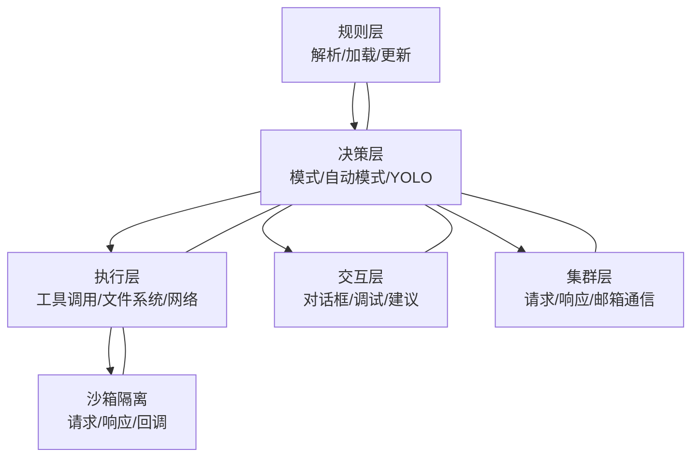
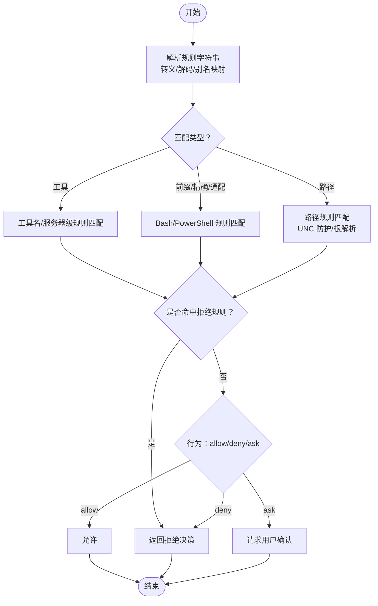
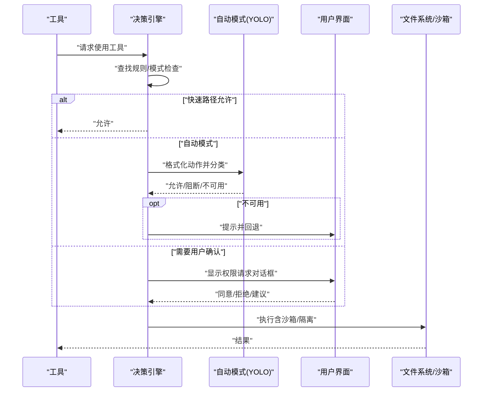
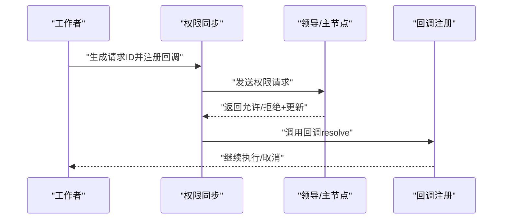
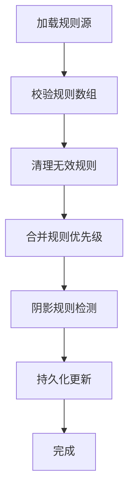
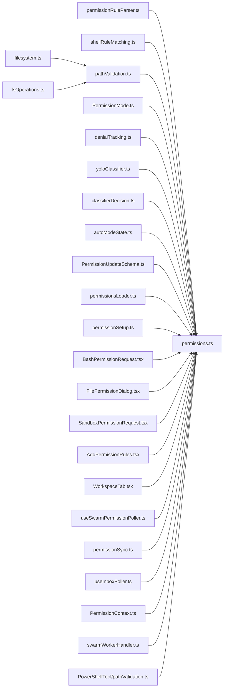

# 工具权限控制

<cite>
**本文引用的文件**
- [src/utils/permissions/permissions.ts](file://src/utils/permissions/permissions.ts)
- [src/utils/permissions/pathValidation.ts](file://src/utils/permissions/pathValidation.ts)
- [src/utils/permissions/filesystem.ts](file://src/utils/permissions/filesystem.ts)
- [src/utils/permissions/shellRuleMatching.ts](file://src/utils/permissions/shellRuleMatching.ts)
- [src/utils/permissions/permissionRuleParser.ts](file://src/utils/permissions/permissionRuleParser.ts)
- [src/utils/permissions/PermissionMode.ts](file://src/utils/permissions/PermissionMode.ts)
- [src/utils/permissions/PermissionRule.ts](file://src/utils/permissions/PermissionRule.ts)
- [src/utils/permissions/PermissionUpdateSchema.ts](file://src/utils/permissions/PermissionUpdateSchema.ts)
- [src/utils/permissions/PermissionResult.ts](file://src/utils/permissions/PermissionResult.ts)
- [src/utils/permissions/denialTracking.ts](file://src/utils/permissions/denialTracking.ts)
- [src/utils/permissions/yoloClassifier.ts](file://src/utils/permissions/yoloClassifier.ts)
- [src/utils/permissions/classifierDecision.ts](file://src/utils/permissions/classifierDecision.ts)
- [src/utils/permissions/autoModeState.ts](file://src/utils/permissions/autoModeState.ts)
- [src/utils/permissions/bypassPermissionsKillswitch.ts](file://src/utils/permissions/bypassPermissionsKillswitch.ts)
- [src/utils/permissions/permissionExplainer.ts](file://src/utils/permissions/permissionExplainer.ts)
- [src/utils/permissions/permissionSetup.ts](file://src/utils/permissions/permissionSetup.ts)
- [src/utils/permissions/permissionsLoader.ts](file://src/utils/permissions/permissionsLoader.ts)
- [src/utils/permissions/shadowedRuleDetection.ts](file://src/utils/permissions/shadowedRuleDetection.ts)
- [src/utils/permissions/permissionSync.ts](file://src/utils/permissions/permissionSync.ts)
- [src/utils/permissions/fsOperations.ts](file://src/utils/permissions/fsOperations.ts)
- [src/hooks/toolPermission/PermissionContext.ts](file://src/hooks/toolPermission/PermissionContext.ts)
- [src/hooks/toolPermission/handlers/swarmWorkerHandler.ts](file://src/hooks/toolPermission/handlers/swarmWorkerHandler.ts)
- [src/hooks/useSwarmPermissionPoller.ts](file://src/hooks/useSwarmPermissionPoller.ts)
- [src/hooks/useInboxPoller.ts](file://src/hooks/useInboxPoller.ts)
- [src/components/permissions/BashPermissionRequest/BashPermissionRequest.tsx](file://src/components/permissions/BashPermissionRequest/BashPermissionRequest.tsx)
- [src/components/permissions/FilePermissionDialog/FilePermissionDialog.tsx](file://src/components/permissions/FilePermissionDialog/FilePermissionDialog.tsx)
- [src/components/permissions/SandboxPermissionRequest.tsx](file://src/components/permissions/SandboxPermissionRequest.tsx)
- [src/components/permissions/rules/AddPermissionRules.tsx](file://src/components/permissions/rules/AddPermissionRules.tsx)
- [src/components/permissions/rules/RemoveWorkspaceDirectory.tsx](file://src/components/permissions/rules/RemoveWorkspaceDirectory.tsx)
- [src/components/permissions/rules/WorkspaceTab.tsx](file://src/components/permissions/rules/WorkspaceTab.tsx)
- [src/tools/PowerShellTool/pathValidation.ts](file://src/tools/PowerShellTool/pathValidation.ts)
- [src/utils/settings/validation.ts](file://src/utils/settings/validation.ts)
- [src/utils/settings/permissionValidation.ts](file://src/utils/settings/permissionValidation.ts)
- [src/types/permissions.ts](file://src/types/permissions.ts)
</cite>

## 目录
1. [简介](#简介)
2. [项目结构](#项目结构)
3. [核心组件](#核心组件)
4. [架构总览](#架构总览)
5. [详细组件分析](#详细组件分析)
6. [依赖关系分析](#依赖关系分析)
7. [性能考量](#性能考量)
8. [故障排查指南](#故障排查指南)
9. [结论](#结论)
10. [附录](#附录)

## 简介
本文件系统性阐述 Claude Code 工具权限控制体系：权限验证机制、规则匹配算法、沙箱隔离实现；权限分类（文件系统、网络、进程执行等）；权限决策流程（请求、用户确认、自动批准）；规则配置方法（通配符、路径过滤、时间限制等）；调试与监控手段；安全策略与防护机制；并提供实际配置案例与最佳实践。

## 项目结构
权限控制相关代码主要分布在以下模块：
- 规则解析与匹配：permissionRuleParser、shellRuleMatching、filesystem、pathValidation
- 决策与模式：permissions、PermissionMode、denialTracking、yoloClassifier、classifierDecision、autoModeState
- 更新与持久化：PermissionUpdateSchema、permissionsLoader、permissionSetup
- UI 交互与对话框：components/permissions 下各组件
- 集群与消息：useSwarmPermissionPoller、permissionSync、useInboxPoller
- 工具侧集成：hooks/toolPermission、tools/PowerShellTool/pathValidation
- 设置校验：utils/settings/validation、utils/settings/permissionValidation
- 类型定义：src/types/permissions.ts

```mermaid
graph TB
subgraph "规则与匹配"
PRP["permissionRuleParser.ts"]
SRM["shellRuleMatching.ts"]
FS["filesystem.ts"]
PV["pathValidation.ts"]
FSO["fsOperations.ts"]
end
subgraph "决策与模式"
PERM["permissions.ts"]
PM["PermissionMode.ts"]
DT["denialTracking.ts"]
YC["yoloClassifier.ts"]
CD["classifierDecision.ts"]
AMS["autoModeState.ts"]
end
subgraph "更新与持久化"
PUS["PermissionUpdateSchema.ts"]
PL["permissionsLoader.ts"]
PS["permissionSetup.ts"]
end
subgraph "UI 与交互"
BPR["BashPermissionRequest.tsx"]
FPD["FilePermissionDialog.tsx"]
SPR["SandboxPermissionRequest.tsx"]
AR["AddPermissionRules.tsx"]
RT["WorkspaceTab.tsx"]
end
subgraph "集群与消息"
SWP["useSwarmPermissionPoller.ts"]
PSYNC["permissionSync.ts"]
INBOX["useInboxPoller.ts"]
end
subgraph "工具集成"
PHC["PermissionContext.ts"]
SWH["swarmWorkerHandler.ts"]
PSPV["PowerShellTool/pathValidation.ts"]
end
PRP --> PERM
SRM --> PERM
FS --> PV
PV --> PERM
FSO --> PV
PM --> PERM
DT --> PERM
YC --> PERM
CD --> PERM
AMS --> PERM
PUS --> PERM
PL --> PERM
PS --> PERM
BPR --> PERM
FPD --> PERM
SPR --> PERM
AR --> PERM
RT --> PERM
SWP --> PERM
PSYNC --> PERM
INBOX --> PERM
PHC --> PERM
SWH --> PERM
PSPV --> PERM
```

**图表来源**
- [src/utils/permissions/permissions.ts](file://src/utils/permissions/permissions.ts)
- [src/utils/permissions/permissionRuleParser.ts](file://src/utils/permissions/permissionRuleParser.ts)
- [src/utils/permissions/shellRuleMatching.ts](file://src/utils/permissions/shellRuleMatching.ts)
- [src/utils/permissions/filesystem.ts](file://src/utils/permissions/filesystem.ts)
- [src/utils/permissions/pathValidation.ts](file://src/utils/permissions/pathValidation.ts)
- [src/utils/permissions/fsOperations.ts](file://src/utils/permissions/fsOperations.ts)
- [src/utils/permissions/PermissionMode.ts](file://src/utils/permissions/PermissionMode.ts)
- [src/utils/permissions/denialTracking.ts](file://src/utils/permissions/denialTracking.ts)
- [src/utils/permissions/yoloClassifier.ts](file://src/utils/permissions/yoloClassifier.ts)
- [src/utils/permissions/classifierDecision.ts](file://src/utils/permissions/classifierDecision.ts)
- [src/utils/permissions/autoModeState.ts](file://src/utils/permissions/autoModeState.ts)
- [src/utils/permissions/PermissionUpdateSchema.ts](file://src/utils/permissions/PermissionUpdateSchema.ts)
- [src/utils/permissions/permissionsLoader.ts](file://src/utils/permissions/permissionsLoader.ts)
- [src/utils/permissions/permissionSetup.ts](file://src/utils/permissions/permissionSetup.ts)
- [src/components/permissions/BashPermissionRequest/BashPermissionRequest.tsx](file://src/components/permissions/BashPermissionRequest/BashPermissionRequest.tsx)
- [src/components/permissions/FilePermissionDialog/FilePermissionDialog.tsx](file://src/components/permissions/FilePermissionDialog/FilePermissionDialog.tsx)
- [src/components/permissions/SandboxPermissionRequest.tsx](file://src/components/permissions/SandboxPermissionRequest.tsx)
- [src/components/permissions/rules/AddPermissionRules.tsx](file://src/components/permissions/rules/AddPermissionRules.tsx)
- [src/components/permissions/rules/WorkspaceTab.tsx](file://src/components/permissions/rules/WorkspaceTab.tsx)
- [src/hooks/useSwarmPermissionPoller.ts](file://src/hooks/useSwarmPermissionPoller.ts)
- [src/utils/permissions/permissionSync.ts](file://src/utils/permissions/permissionSync.ts)
- [src/hooks/useInboxPoller.ts](file://src/hooks/useInboxPoller.ts)
- [src/hooks/toolPermission/PermissionContext.ts](file://src/hooks/toolPermission/PermissionContext.ts)
- [src/hooks/toolPermission/handlers/swarmWorkerHandler.ts](file://src/hooks/toolPermission/handlers/swarmWorkerHandler.ts)
- [src/tools/PowerShellTool/pathValidation.ts](file://src/tools/PowerShellTool/pathValidation.ts)

**章节来源**
- [src/utils/permissions/permissions.ts](file://src/utils/permissions/permissions.ts)
- [src/utils/permissions/permissionRuleParser.ts](file://src/utils/permissions/permissionRuleParser.ts)
- [src/utils/permissions/PermissionMode.ts](file://src/utils/permissions/PermissionMode.ts)
- [src/utils/permissions/PermissionUpdateSchema.ts](file://src/utils/permissions/PermissionUpdateSchema.ts)
- [src/utils/permissions/permissionsLoader.ts](file://src/utils/permissions/permissionsLoader.ts)
- [src/utils/permissions/permissionSync.ts](file://src/utils/permissions/permissionSync.ts)
- [src/hooks/useSwarmPermissionPoller.ts](file://src/hooks/useSwarmPermissionPoller.ts)
- [src/hooks/useInboxPoller.ts](file://src/hooks/useInboxPoller.ts)
- [src/components/permissions/BashPermissionRequest/BashPermissionRequest.tsx](file://src/components/permissions/BashPermissionRequest/BashPermissionRequest.tsx)
- [src/components/permissions/FilePermissionDialog/FilePermissionDialog.tsx](file://src/components/permissions/FilePermissionDialog/FilePermissionDialog.tsx)
- [src/components/permissions/SandboxPermissionRequest.tsx](file://src/components/permissions/SandboxPermissionRequest.tsx)
- [src/components/permissions/rules/AddPermissionRules.tsx](file://src/components/permissions/rules/AddPermissionRules.tsx)
- [src/components/permissions/rules/WorkspaceTab.tsx](file://src/components/permissions/rules/WorkspaceTab.tsx)
- [src/tools/PowerShellTool/pathValidation.ts](file://src/tools/PowerShellTool/pathValidation.ts)

## 核心组件
- 权限规则与行为
  - 规则值与行为：工具名、可选内容，行为为 allow/deny/ask
  - 解析与序列化：支持转义括号、兼容旧版工具名
- 决策引擎
  - 模式：default、plan、acceptEdits、bypassPermissions、dontAsk、auto（ant-only）
  - 自动模式：YOLO 分类器、快速路径（acceptEdits）、安全检查豁免
  - 连续拒绝追踪与降级提示
- 文件系统权限
  - 路径规范化、符号链接链跟踪、UNC 防护、工作目录根解析
- 沙箱与隔离
  - 沙箱请求生成、跨节点消息传递、回调注册与响应处理
- 规则更新与持久化
  - 添加/替换/移除规则、设置目标（用户/项目/本地/会话/命令行）
- UI 对话与调试
  - Bash/文件/沙箱权限请求对话框，调试信息切换
- 集群与消息
  - 请求/响应队列、邮箱通信、回调映射、超时与错误处理

**章节来源**
- [src/utils/permissions/PermissionRule.ts](file://src/utils/permissions/PermissionRule.ts)
- [src/utils/permissions/permissionRuleParser.ts](file://src/utils/permissions/permissionRuleParser.ts)
- [src/utils/permissions/PermissionMode.ts](file://src/utils/permissions/PermissionMode.ts)
- [src/utils/permissions/permissions.ts](file://src/utils/permissions/permissions.ts)
- [src/utils/permissions/denialTracking.ts](file://src/utils/permissions/denialTracking.ts)
- [src/utils/permissions/yoloClassifier.ts](file://src/utils/permissions/yoloClassifier.ts)
- [src/utils/permissions/filesystem.ts](file://src/utils/permissions/filesystem.ts)
- [src/utils/permissions/pathValidation.ts](file://src/utils/permissions/pathValidation.ts)
- [src/utils/permissions/fsOperations.ts](file://src/utils/permissions/fsOperations.ts)
- [src/utils/permissions/permissionSync.ts](file://src/utils/permissions/permissionSync.ts)
- [src/utils/permissions/PermissionUpdateSchema.ts](file://src/utils/permissions/PermissionUpdateSchema.ts)
- [src/utils/permissions/permissionsLoader.ts](file://src/utils/permissions/permissionsLoader.ts)
- [src/components/permissions/BashPermissionRequest/BashPermissionRequest.tsx](file://src/components/permissions/BashPermissionRequest/BashPermissionRequest.tsx)
- [src/components/permissions/FilePermissionDialog/FilePermissionDialog.tsx](file://src/components/permissions/FilePermissionDialog/FilePermissionDialog.tsx)
- [src/components/permissions/SandboxPermissionRequest.tsx](file://src/components/permissions/SandboxPermissionRequest.tsx)

## 架构总览
权限系统由“规则层”“决策层”“执行层”“交互层”“集群层”构成，形成从规则到执行、从 UI 到沙箱、从本地到团队的闭环。

**图表来源**
- [src/utils/permissions/permissions.ts](file://src/utils/permissions/permissions.ts)
- [src/utils/permissions/PermissionMode.ts](file://src/utils/permissions/PermissionMode.ts)
- [src/utils/permissions/yoloClassifier.ts](file://src/utils/permissions/yoloClassifier.ts)
- [src/utils/permissions/permissionSync.ts](file://src/utils/permissions/permissionSync.ts)
- [src/utils/permissions/permissionRuleParser.ts](file://src/utils/permissions/permissionRuleParser.ts)
- [src/utils/permissions/permissionsLoader.ts](file://src/utils/permissions/permissionsLoader.ts)
- [src/utils/permissions/PermissionUpdateSchema.ts](file://src/utils/permissions/PermissionUpdateSchema.ts)
- [src/components/permissions/BashPermissionRequest/BashPermissionRequest.tsx](file://src/components/permissions/BashPermissionRequest/BashPermissionRequest.tsx)
- [src/components/permissions/FilePermissionDialog/FilePermissionDialog.tsx](file://src/components/permissions/FilePermissionDialog/FilePermissionDialog.tsx)
- [src/components/permissions/SandboxPermissionRequest.tsx](file://src/components/permissions/SandboxPermissionRequest.tsx)

## 详细组件分析

### 权限规则与匹配算法
- 规则格式与解析
  - 支持“工具名”或“工具名(内容)”两种形式；内容中括号需转义存储
  - 兼容历史工具名别名，统一到规范名称
- 匹配策略
  - 工具级匹配：支持 MCP 服务器级规则（含通配）
  - 前缀/精确/通配：Bash/PowerShell 子命令规则解析与匹配
  - 路径规则：双斜杠根相对、Windows 驱动器路径转换、UNC 防护
- 路径检查
  - 获取所有需要检查的路径集合：原始路径、中间符号链接目标、最终解析路径
  - 防循环符号链接、防 UNC 访问引发网络请求
- 结果与原因
  - 决策类型：allow/deny/ask/passthrough
  - 决策原因：规则、hook、分类器、模式、工作目录、安全检查等

**图表来源**
- [src/utils/permissions/permissionRuleParser.ts](file://src/utils/permissions/permissionRuleParser.ts)
- [src/utils/permissions/shellRuleMatching.ts](file://src/utils/permissions/shellRuleMatching.ts)
- [src/utils/permissions/filesystem.ts](file://src/utils/permissions/filesystem.ts)
- [src/utils/permissions/pathValidation.ts](file://src/utils/permissions/pathValidation.ts)
- [src/utils/permissions/fsOperations.ts](file://src/utils/permissions/fsOperations.ts)

**章节来源**
- [src/utils/permissions/permissionRuleParser.ts](file://src/utils/permissions/permissionRuleParser.ts)
- [src/utils/permissions/shellRuleMatching.ts](file://src/utils/permissions/shellRuleMatching.ts)
- [src/utils/permissions/filesystem.ts](file://src/utils/permissions/filesystem.ts)
- [src/utils/permissions/pathValidation.ts](file://src/utils/permissions/pathValidation.ts)
- [src/utils/permissions/fsOperations.ts](file://src/utils/permissions/fsOperations.ts)
- [src/utils/permissions/PermissionRule.ts](file://src/utils/permissions/PermissionRule.ts)

### 决策流程与自动批准
- 模式与快速路径
  - acceptEdits 快速允许安全操作（如工作目录内的文件编辑）
  - 安全工具白名单跳过分类器
- 自动模式（YOLO）
  - 将工具与输入格式化为分类器输入，评估是否阻断
  - 统计连续拒绝次数、记录成本与用量指标
  - 不可用时按策略回退或拒绝
- 用户交互
  - ask 模式弹出对话框，支持建议、反馈、分类器描述
  - passthrough 可异步进行分类器检查后自动批准
- 安全检查与豁免
  - 敏感文件路径等安全检查可能要求交互，且在避免权限提示场景下直接拒绝

**图表来源**
- [src/utils/permissions/permissions.ts](file://src/utils/permissions/permissions.ts)
- [src/utils/permissions/yoloClassifier.ts](file://src/utils/permissions/yoloClassifier.ts)
- [src/utils/permissions/PermissionMode.ts](file://src/utils/permissions/PermissionMode.ts)
- [src/components/permissions/BashPermissionRequest/BashPermissionRequest.tsx](file://src/components/permissions/BashPermissionRequest/BashPermissionRequest.tsx)
- [src/components/permissions/FilePermissionDialog/FilePermissionDialog.tsx](file://src/components/permissions/FilePermissionDialog/FilePermissionDialog.tsx)

**章节来源**
- [src/utils/permissions/permissions.ts](file://src/utils/permissions/permissions.ts)
- [src/utils/permissions/PermissionMode.ts](file://src/utils/permissions/PermissionMode.ts)
- [src/utils/permissions/yoloClassifier.ts](file://src/utils/permissions/yoloClassifier.ts)
- [src/utils/permissions/denialTracking.ts](file://src/utils/permissions/denialTracking.ts)
- [src/components/permissions/BashPermissionRequest/BashPermissionRequest.tsx](file://src/components/permissions/BashPermissionRequest/BashPermissionRequest.tsx)
- [src/components/permissions/FilePermissionDialog/FilePermissionDialog.tsx](file://src/components/permissions/FilePermissionDialog/FilePermissionDialog.tsx)

### 沙箱隔离与跨节点权限
- 请求生成与回调
  - 生成唯一请求 ID，注册回调，等待响应
  - 处理响应：允许则应用更新，拒绝则反馈
- 邮箱通信
  - 通过邮箱发送/接收权限响应，支持本地/文件路由
- 工作线程协作
  - 工作者向领导发起请求，等待批准或取消
  - 中断信号触发取消并清理状态

**图表来源**
- [src/utils/permissions/permissionSync.ts](file://src/utils/permissions/permissionSync.ts)
- [src/hooks/useSwarmPermissionPoller.ts](file://src/hooks/useSwarmPermissionPoller.ts)
- [src/hooks/toolPermission/handlers/swarmWorkerHandler.ts](file://src/hooks/toolPermission/handlers/swarmWorkerHandler.ts)
- [src/hooks/useInboxPoller.ts](file://src/hooks/useInboxPoller.ts)

**章节来源**
- [src/utils/permissions/permissionSync.ts](file://src/utils/permissions/permissionSync.ts)
- [src/hooks/useSwarmPermissionPoller.ts](file://src/hooks/useSwarmPermissionPoller.ts)
- [src/hooks/toolPermission/handlers/swarmWorkerHandler.ts](file://src/hooks/toolPermission/handlers/swarmWorkerHandler.ts)
- [src/hooks/useInboxPoller.ts](file://src/hooks/useInboxPoller.ts)

### 权限规则配置与持久化
- 规则数组校验
  - 字符串数组校验，非法项跳过并记录警告
  - 自定义 Zod 校验，提供示例与建议
- 规则更新
  - 支持添加/替换/移除规则，指定目标位置（用户/项目/本地/会话/CLI）
  - 支持设置模式、增删工作区目录
- 规则加载与管理
  - 从多源加载规则（设置源、命令行、会话），合并优先级
  - 阴影规则检测与冲突提示

**图表来源**
- [src/utils/settings/validation.ts](file://src/utils/settings/validation.ts)
- [src/utils/settings/permissionValidation.ts](file://src/utils/settings/permissionValidation.ts)
- [src/utils/permissions/PermissionUpdateSchema.ts](file://src/utils/permissions/PermissionUpdateSchema.ts)
- [src/utils/permissions/permissionsLoader.ts](file://src/utils/permissions/permissionsLoader.ts)
- [src/utils/permissions/shadowedRuleDetection.ts](file://src/utils/permissions/shadowedRuleDetection.ts)

**章节来源**
- [src/utils/settings/validation.ts](file://src/utils/settings/validation.ts)
- [src/utils/settings/permissionValidation.ts](file://src/utils/settings/permissionValidation.ts)
- [src/utils/permissions/PermissionUpdateSchema.ts](file://src/utils/permissions/PermissionUpdateSchema.ts)
- [src/utils/permissions/permissionsLoader.ts](file://src/utils/permissions/permissionsLoader.ts)
- [src/utils/permissions/shadowedRuleDetection.ts](file://src/utils/permissions/shadowedRuleDetection.ts)

### 权限分类体系
- 文件系统权限
  - 读写/创建区分；路径解析与符号链接链检查；UNC 防护
- 网络访问权限
  - 通过工具/服务层的权限检查与代理/上游代理集成
- 进程执行权限
  - Bash/PowerShell 等子命令规则匹配；输出重定向剥离用于展示
- MCP/外部工具
  - 服务器级规则与工具级规则；前缀/通配支持

**章节来源**
- [src/utils/permissions/pathValidation.ts](file://src/utils/permissions/pathValidation.ts)
- [src/utils/permissions/filesystem.ts](file://src/utils/permissions/filesystem.ts)
- [src/utils/permissions/shellRuleMatching.ts](file://src/utils/permissions/shellRuleMatching.ts)
- [src/tools/PowerShellTool/pathValidation.ts](file://src/tools/PowerShellTool/pathValidation.ts)

## 依赖关系分析

**图表来源**
- [src/utils/permissions/permissions.ts](file://src/utils/permissions/permissions.ts)
- [src/utils/permissions/permissionRuleParser.ts](file://src/utils/permissions/permissionRuleParser.ts)
- [src/utils/permissions/shellRuleMatching.ts](file://src/utils/permissions/shellRuleMatching.ts)
- [src/utils/permissions/filesystem.ts](file://src/utils/permissions/filesystem.ts)
- [src/utils/permissions/pathValidation.ts](file://src/utils/permissions/pathValidation.ts)
- [src/utils/permissions/fsOperations.ts](file://src/utils/permissions/fsOperations.ts)
- [src/utils/permissions/PermissionMode.ts](file://src/utils/permissions/PermissionMode.ts)
- [src/utils/permissions/denialTracking.ts](file://src/utils/permissions/denialTracking.ts)
- [src/utils/permissions/yoloClassifier.ts](file://src/utils/permissions/yoloClassifier.ts)
- [src/utils/permissions/classifierDecision.ts](file://src/utils/permissions/classifierDecision.ts)
- [src/utils/permissions/autoModeState.ts](file://src/utils/permissions/autoModeState.ts)
- [src/utils/permissions/PermissionUpdateSchema.ts](file://src/utils/permissions/PermissionUpdateSchema.ts)
- [src/utils/permissions/permissionsLoader.ts](file://src/utils/permissions/permissionsLoader.ts)
- [src/utils/permissions/permissionSetup.ts](file://src/utils/permissions/permissionSetup.ts)
- [src/components/permissions/BashPermissionRequest/BashPermissionRequest.tsx](file://src/components/permissions/BashPermissionRequest/BashPermissionRequest.tsx)
- [src/components/permissions/FilePermissionDialog/FilePermissionDialog.tsx](file://src/components/permissions/FilePermissionDialog/FilePermissionDialog.tsx)
- [src/components/permissions/SandboxPermissionRequest.tsx](file://src/components/permissions/SandboxPermissionRequest.tsx)
- [src/components/permissions/rules/AddPermissionRules.tsx](file://src/components/permissions/rules/AddPermissionRules.tsx)
- [src/components/permissions/rules/WorkspaceTab.tsx](file://src/components/permissions/rules/WorkspaceTab.tsx)
- [src/hooks/useSwarmPermissionPoller.ts](file://src/hooks/useSwarmPermissionPoller.ts)
- [src/utils/permissions/permissionSync.ts](file://src/utils/permissions/permissionSync.ts)
- [src/hooks/useInboxPoller.ts](file://src/hooks/useInboxPoller.ts)
- [src/hooks/toolPermission/PermissionContext.ts](file://src/hooks/toolPermission/PermissionContext.ts)
- [src/hooks/toolPermission/handlers/swarmWorkerHandler.ts](file://src/hooks/toolPermission/handlers/swarmWorkerHandler.ts)
- [src/tools/PowerShellTool/pathValidation.ts](file://src/tools/PowerShellTool/pathValidation.ts)

**章节来源**
- [src/utils/permissions/permissions.ts](file://src/utils/permissions/permissions.ts)
- [src/utils/permissions/permissionRuleParser.ts](file://src/utils/permissions/permissionRuleParser.ts)
- [src/utils/permissions/shellRuleMatching.ts](file://src/utils/permissions/shellRuleMatching.ts)
- [src/utils/permissions/filesystem.ts](file://src/utils/permissions/filesystem.ts)
- [src/utils/permissions/pathValidation.ts](file://src/utils/permissions/pathValidation.ts)
- [src/utils/permissions/fsOperations.ts](file://src/utils/permissions/fsOperations.ts)
- [src/utils/permissions/PermissionMode.ts](file://src/utils/permissions/PermissionMode.ts)
- [src/utils/permissions/denialTracking.ts](file://src/utils/permissions/denialTracking.ts)
- [src/utils/permissions/yoloClassifier.ts](file://src/utils/permissions/yoloClassifier.ts)
- [src/utils/permissions/classifierDecision.ts](file://src/utils/permissions/classifierDecision.ts)
- [src/utils/permissions/autoModeState.ts](file://src/utils/permissions/autoModeState.ts)
- [src/utils/permissions/PermissionUpdateSchema.ts](file://src/utils/permissions/PermissionUpdateSchema.ts)
- [src/utils/permissions/permissionsLoader.ts](file://src/utils/permissions/permissionsLoader.ts)
- [src/utils/permissions/permissionSetup.ts](file://src/utils/permissions/permissionSetup.ts)
- [src/components/permissions/BashPermissionRequest/BashPermissionRequest.tsx](file://src/components/permissions/BashPermissionRequest/BashPermissionRequest.tsx)
- [src/components/permissions/FilePermissionDialog/FilePermissionDialog.tsx](file://src/components/permissions/FilePermissionDialog/FilePermissionDialog.tsx)
- [src/components/permissions/SandboxPermissionRequest.tsx](file://src/components/permissions/SandboxPermissionRequest.tsx)
- [src/components/permissions/rules/AddPermissionRules.tsx](file://src/components/permissions/rules/AddPermissionRules.tsx)
- [src/components/permissions/rules/WorkspaceTab.tsx](file://src/components/permissions/rules/WorkspaceTab.tsx)
- [src/hooks/useSwarmPermissionPoller.ts](file://src/hooks/useSwarmPermissionPoller.ts)
- [src/utils/permissions/permissionSync.ts](file://src/utils/permissions/permissionSync.ts)
- [src/hooks/useInboxPoller.ts](file://src/hooks/useInboxPoller.ts)
- [src/hooks/toolPermission/PermissionContext.ts](file://src/hooks/toolPermission/PermissionContext.ts)
- [src/hooks/toolPermission/handlers/swarmWorkerHandler.ts](file://src/hooks/toolPermission/handlers/swarmWorkerHandler.ts)
- [src/tools/PowerShellTool/pathValidation.ts](file://src/tools/PowerShellTool/pathValidation.ts)

## 性能考量
- 缓存与去重
  - 沙箱配置路径解析结果缓存，避免重复系统调用
  - 符号链接链解析与路径集合去重
- 快速路径
  - acceptEdits 快速允许安全操作，减少分类器调用
  - 安全工具白名单直接放行
- I/O 优化
  - UNC 防护提前拦截网络请求
  - 最大符号链接深度限制，防止环路与过度遍历
- 分类器成本
  - 记录输入/输出令牌、缓存读取、延迟与费用，便于开销分析

**章节来源**
- [src/utils/permissions/pathValidation.ts](file://src/utils/permissions/pathValidation.ts)
- [src/utils/permissions/fsOperations.ts](file://src/utils/permissions/fsOperations.ts)
- [src/utils/permissions/permissions.ts](file://src/utils/permissions/permissions.ts)
- [src/utils/permissions/yoloClassifier.ts](file://src/utils/permissions/yoloClassifier.ts)

## 故障排查指南
- 调试信息
  - 权限请求消息构建、决策原因、分类器阶段与用量
  - 键盘快捷键切换权限调试信息
- 常见问题
  - 规则无效：检查字符串格式、转义字符、示例与建议
  - UNC/路径异常：确认 UNC 防护与根路径解析
  - 自动模式不可用：查看分类器不可用时间窗与回退逻辑
  - 集群无响应：检查邮箱通信、回调注册与请求 ID
- 监控与日志
  - 连续拒绝计数、总拒绝数、分类器阶段用量与成本
  - 安全检查与模式导致的交互需求

**章节来源**
- [src/utils/permissions/permissions.ts](file://src/utils/permissions/permissions.ts)
- [src/utils/permissions/denialTracking.ts](file://src/utils/permissions/denialTracking.ts)
- [src/utils/permissions/yoloClassifier.ts](file://src/utils/permissions/yoloClassifier.ts)
- [src/components/permissions/BashPermissionRequest/BashPermissionRequest.tsx](file://src/components/permissions/BashPermissionRequest/BashPermissionRequest.tsx)
- [src/utils/settings/validation.ts](file://src/utils/settings/validation.ts)
- [src/utils/settings/permissionValidation.ts](file://src/utils/settings/permissionValidation.ts)
- [src/hooks/useSwarmPermissionPoller.ts](file://src/hooks/useSwarmPermissionPoller.ts)
- [src/utils/permissions/permissionSync.ts](file://src/utils/permissions/permissionSync.ts)

## 结论
该权限系统以“规则即代码”的方式实现灵活而强大的权限控制：通过解析与匹配、模式与自动模式、文件系统与沙箱隔离、UI 与集群协同，形成从个人到团队的一致安全基线。配合完善的调试与监控能力，既满足日常开发效率，又确保高风险操作的可控与可观测。

## 附录

### 权限配置最佳实践
- 规则粒度
  - 优先使用工具级规则，再细化到内容/前缀/通配
  - 使用 MCP 服务器级规则统一管控一组工具
- 路径与环境
  - 明确工作区目录，结合路径规则与工作目录检查
  - 避免通配符滥用，必要时配合“仅受管规则”模式
- 自动模式
  - 在安全前提下启用自动模式，利用白名单与快速路径
  - 关注分类器不可用窗口与回退策略
- 持久化与迁移
  - 使用统一的更新目标（用户/项目/本地/会话/CLI）
  - 保留历史规则别名映射，避免升级后规则失效

### 安全策略与防护机制
- 安全检查与交互
  - 敏感路径与高危命令强制交互
  - 避免权限提示场景下的自动批准
- 沙箱与隔离
  - 沙箱外运行开关与请求流程
  - 符号链接与 UNC 防护
- 集群一致性
  - 请求 ID 与回调映射，邮箱通信保证一致性
  - 中断信号与取消流程

**章节来源**
- [src/utils/permissions/permissions.ts](file://src/utils/permissions/permissions.ts)
- [src/utils/permissions/filesystem.ts](file://src/utils/permissions/filesystem.ts)
- [src/utils/permissions/pathValidation.ts](file://src/utils/permissions/pathValidation.ts)
- [src/utils/permissions/permissionSync.ts](file://src/utils/permissions/permissionSync.ts)
- [src/utils/permissions/bypassPermissionsKillswitch.ts](file://src/utils/permissions/bypassPermissionsKillswitch.ts)
- [src/utils/permissions/permissionExplainer.ts](file://src/utils/permissions/permissionExplainer.ts)
- [src/utils/permissions/permissionSetup.ts](file://src/utils/permissions/permissionSetup.ts)