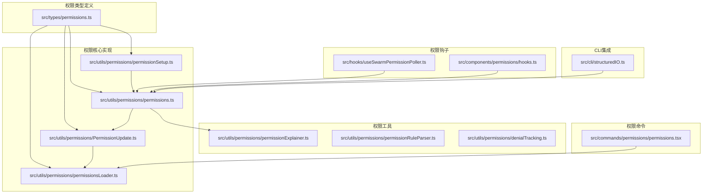
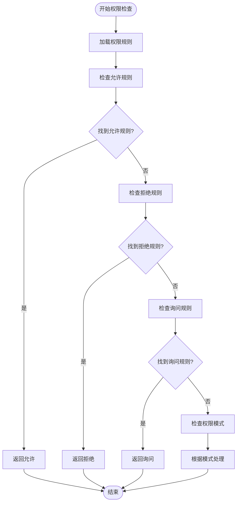
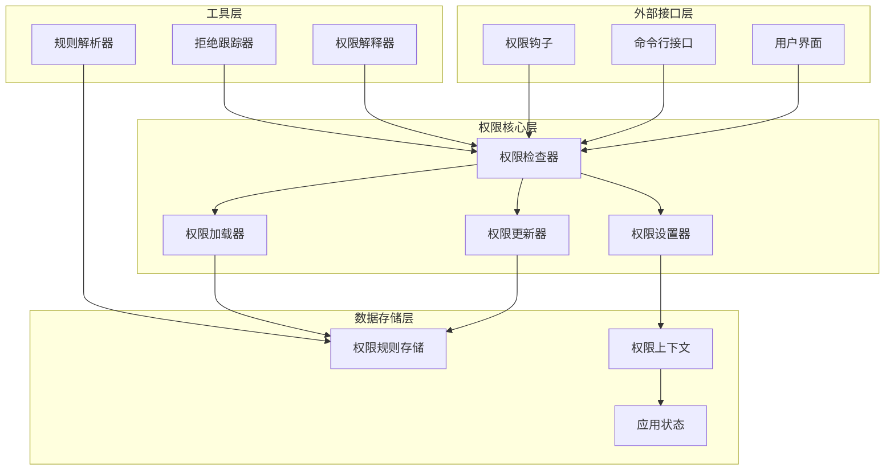
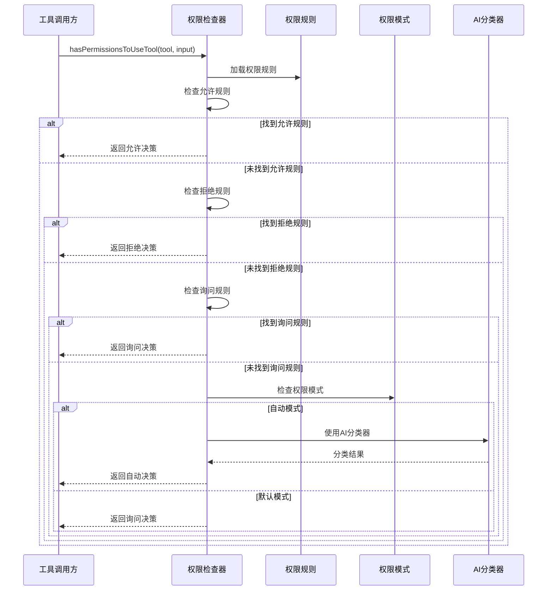
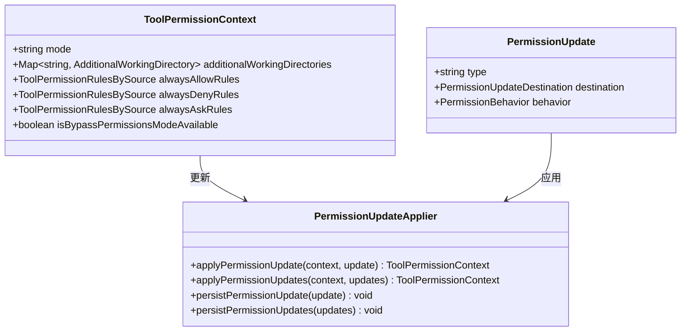
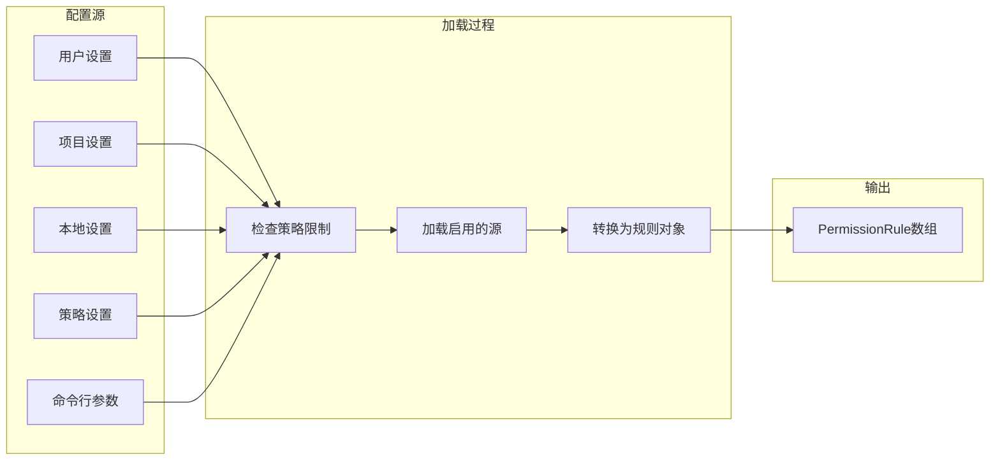
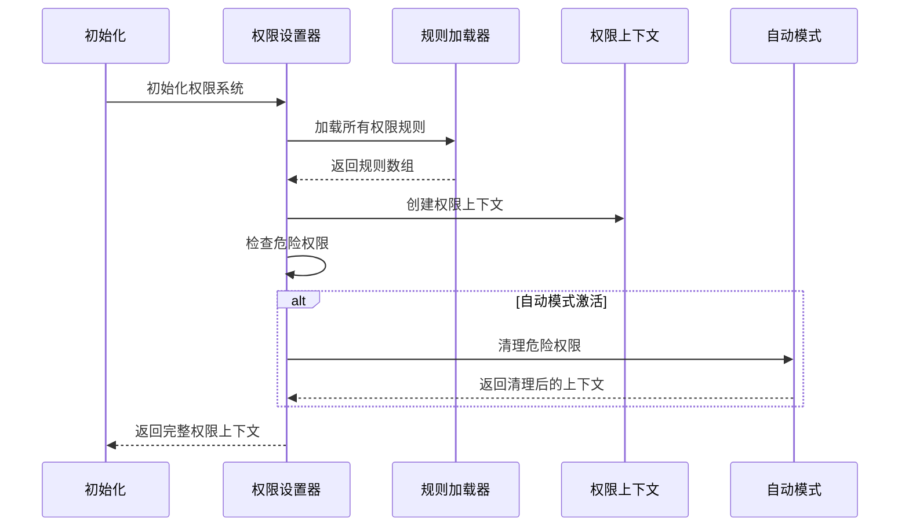
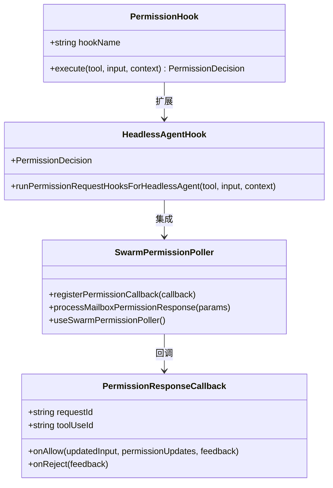
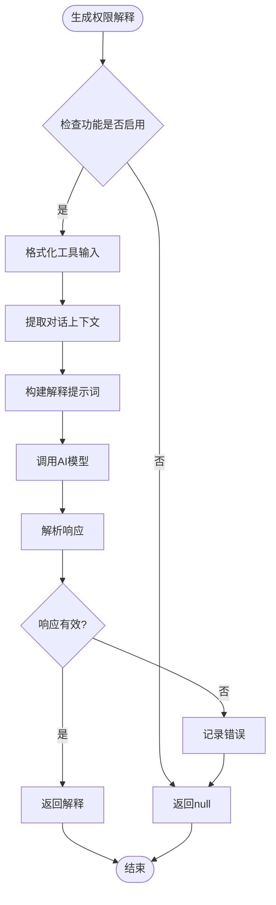
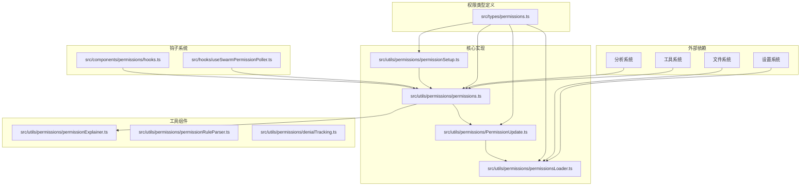

# 权限API接口

<cite>
**本文档引用的文件**
- [src/types/permissions.ts](file://src/types/permissions.ts)
- [src/utils/permissions/permissions.ts](file://src/utils/permissions/permissions.ts)
- [src/utils/permissions/PermissionUpdate.ts](file://src/utils/permissions/PermissionUpdate.ts)
- [src/utils/permissions/permissionSetup.ts](file://src/utils/permissions/permissionSetup.ts)
- [src/utils/permissions/permissionsLoader.ts](file://src/utils/permissions/permissionsLoader.ts)
- [src/utils/permissions/permissionExplainer.ts](file://src/utils/permissions/permissionExplainer.ts)
- [src/utils/permissions/permissionRuleParser.ts](file://src/utils/permissions/permissionRuleParser.ts)
- [src/utils/permissions/denialTracking.ts](file://src/utils/permissions/denialTracking.ts)
- [src/hooks/useSwarmPermissionPoller.ts](file://src/hooks/useSwarmPermissionPoller.ts)
- [src/components/permissions/hooks.ts](file://src/components/permissions/hooks.ts)
- [src/commands/permissions/permissions.tsx](file://src/commands/permissions/permissions.tsx)
- [src/cli/structuredIO.ts](file://src/cli/structuredIO.ts)
</cite>

## 目录
1. [简介](#简介)
2. [项目结构](#项目结构)
3. [核心组件](#核心组件)
4. [架构概览](#架构概览)
5. [详细组件分析](#详细组件分析)
6. [依赖关系分析](#依赖关系分析)
7. [性能考虑](#性能考虑)
8. [故障排除指南](#故障排除指南)
9. [结论](#结论)
10. [附录](#附录)

## 简介

Claude Code权限API接口是一个完整的权限管理系统，负责控制工具使用权限、管理权限规则、处理权限决策和提供权限钩子系统。该系统支持多种权限模式（默认、自动、计划、绕过权限），提供细粒度的权限控制，并通过钩子机制扩展权限检查逻辑。

系统的核心特性包括：
- 多层次权限控制：基于规则的允许/拒绝/询问策略
- 智能权限模式：支持默认、自动、计划、绕过权限等多种模式
- 权限更新持久化：支持用户设置、项目设置、本地设置的权限规则持久化
- 权限钩子系统：可扩展的权限检查钩子机制
- 权限解释器：为用户提供权限操作的风险解释
- 联合权限同步：支持多代理环境下的权限同步

## 项目结构

权限API接口主要分布在以下目录结构中：

**图表来源**
- [src/types/permissions.ts:1-442](file://src/types/permissions.ts#L1-L442)
- [src/utils/permissions/permissions.ts:1-800](file://src/utils/permissions/permissions.ts#L1-L800)

**章节来源**
- [src/types/permissions.ts:1-442](file://src/types/permissions.ts#L1-L442)
- [src/utils/permissions/permissions.ts:1-800](file://src/utils/permissions/permissions.ts#L1-L800)

## 核心组件

### 权限模式系统

权限系统支持以下权限模式：
- **默认模式（default）**：标准权限检查，需要用户确认
- **自动模式（auto）**：使用AI分类器自动审批安全操作
- **计划模式（plan）**：用于规划阶段的特殊权限模式
- **绕过权限模式（bypassPermissions）**：完全绕过权限检查
- **接受编辑模式（acceptEdits）**：专门用于文件编辑的安全模式
- **不询问模式（dontAsk）**：直接拒绝询问的操作

### 权限规则系统

权限规则采用"工具名(内容)"的格式，支持：
- 工具级规则：如"Bash"表示所有Bash命令
- 内容级规则：如"Bash(npm install)"表示特定命令
- 通配符规则：如"Bash(*)"表示所有Bash命令
- MCP服务器规则：支持MCP工具的服务器级权限

### 权限决策流程

**图表来源**
- [src/utils/permissions/permissions.ts:473-501](file://src/utils/permissions/permissions.ts#L473-L501)

**章节来源**
- [src/types/permissions.ts:16-38](file://src/types/permissions.ts#L16-L38)
- [src/utils/permissions/permissions.ts:233-302](file://src/utils/permissions/permissions.ts#L233-L302)

## 架构概览

权限API接口采用分层架构设计，确保模块间的清晰分离和高内聚低耦合：

**图表来源**
- [src/utils/permissions/permissions.ts:473-800](file://src/utils/permissions/permissions.ts#L473-L800)
- [src/utils/permissions/permissionSetup.ts:597-646](file://src/utils/permissions/permissionSetup.ts#L597-L646)

## 详细组件分析

### 权限检查器（hasPermissionsToUseTool）

权限检查器是权限系统的核心组件，负责执行实际的权限检查逻辑：

**图表来源**
- [src/utils/permissions/permissions.ts:473-800](file://src/utils/permissions/permissions.ts#L473-L800)

权限检查器的主要功能包括：

1. **规则匹配**：检查工具是否在允许、拒绝或询问规则中
2. **模式处理**：根据当前权限模式调整决策
3. **AI分类**：在自动模式下使用AI分类器进行智能决策
4. **钩子集成**：支持权限请求钩子的扩展机制

**章节来源**
- [src/utils/permissions/permissions.ts:473-800](file://src/utils/permissions/permissions.ts#L473-L800)

### 权限更新器（applyPermissionUpdate）

权限更新器负责应用权限更新到权限上下文中：

**图表来源**
- [src/utils/permissions/PermissionUpdate.ts:55-206](file://src/utils/permissions/PermissionUpdate.ts#L55-L206)

权限更新器支持的操作类型：

1. **添加规则**：向指定目的地添加新的权限规则
2. **替换规则**：完全替换指定目的地的所有规则
3. **移除规则**：从指定目的地移除权限规则
4. **设置模式**：更改权限模式
5. **管理目录**：添加或移除额外的工作目录

**章节来源**
- [src/utils/permissions/PermissionUpdate.ts:55-353](file://src/utils/permissions/PermissionUpdate.ts#L55-L353)

### 权限加载器（permissionsLoader）

权限加载器负责从各种配置源加载权限规则：

**图表来源**
- [src/utils/permissions/permissionsLoader.ts:120-133](file://src/utils/permissions/permissionsLoader.ts#L120-L133)

权限加载器的关键特性：

1. **策略优先**：支持策略设置中的权限规则限制
2. **多源支持**：从多个配置源加载规则
3. **去重处理**：避免重复的权限规则
4. **向后兼容**：支持旧版工具名称的映射

**章节来源**
- [src/utils/permissions/permissionsLoader.ts:120-297](file://src/utils/permissions/permissionsLoader.ts#L120-L297)

### 权限设置器（permissionSetup）

权限设置器负责初始化和管理权限上下文：

**图表来源**
- [src/utils/permissions/permissionSetup.ts:505-553](file://src/utils/permissions/permissionSetup.ts#L505-L553)

权限设置器的主要职责：

1. **规则应用**：将加载的规则应用到权限上下文中
2. **危险权限检测**：识别可能绕过安全检查的危险规则
3. **自动模式管理**：在自动模式下清理危险权限
4. **模式转换**：处理不同权限模式之间的转换

**章节来源**
- [src/utils/permissions/permissionSetup.ts:505-646](file://src/utils/permissions/permissionSetup.ts#L505-L646)

### 权限钩子系统

权限钩子系统提供了扩展权限检查逻辑的能力：

**图表来源**
- [src/hooks/useSwarmPermissionPoller.ts:58-106](file://src/hooks/useSwarmPermissionPoller.ts#L58-L106)

权限钩子系统的特点：

1. **异步处理**：支持异步权限请求处理
2. **多代理支持**：支持主代理和工作代理的权限同步
3. **回调机制**：提供标准化的回调接口
4. **错误处理**：优雅处理钩子执行失败的情况

**章节来源**
- [src/hooks/useSwarmPermissionPoller.ts:1-331](file://src/hooks/useSwarmPermissionPoller.ts#L1-L331)

### 权限解释器

权限解释器为用户提供权限操作的风险解释和理由：

**图表来源**
- [src/utils/permissions/permissionExplainer.ts:147-250](file://src/utils/permissions/permissionExplainer.ts#L147-L250)

权限解释器的功能特性：

1. **风险评估**：评估权限操作的风险等级
2. **结构化输出**：提供标准化的解释格式
3. **上下文感知**：结合对话历史提供更准确的解释
4. **可配置性**：支持通过配置禁用功能

**章节来源**
- [src/utils/permissions/permissionExplainer.ts:1-251](file://src/utils/permissions/permissionExplainer.ts#L1-L251)

## 依赖关系分析

权限API接口的依赖关系呈现清晰的分层结构：

**图表来源**
- [src/utils/permissions/permissions.ts:1-94](file://src/utils/permissions/permissions.ts#L1-L94)
- [src/utils/permissions/permissionSetup.ts:1-83](file://src/utils/permissions/permissionSetup.ts#L1-L83)

**章节来源**
- [src/utils/permissions/permissions.ts:1-94](file://src/utils/permissions/permissions.ts#L1-L94)
- [src/utils/permissions/permissionSetup.ts:1-83](file://src/utils/permissions/permissionSetup.ts#L1-L83)

## 性能考虑

权限系统的性能优化策略：

1. **规则缓存**：权限规则在内存中缓存，避免重复加载
2. **异步处理**：AI分类器调用采用异步非阻塞方式
3. **懒加载**：按需加载权限解释器等可选功能
4. **批量操作**：支持批量权限更新以减少磁盘I/O
5. **引用相等性**：保持权限上下文的引用相等性以优化React渲染

## 故障排除指南

### 常见问题及解决方案

**权限规则不生效**
- 检查规则格式是否正确
- 验证规则目标源是否可写
- 确认权限模式设置是否正确

**自动模式无法使用**
- 检查自动模式门控状态
- 验证AI分类器可用性
- 确认危险权限已被正确清理

**权限钩子执行失败**
- 查看钩子日志输出
- 检查钩子注册状态
- 验证回调函数完整性

**章节来源**
- [src/utils/permissions/permissions.ts:462-471](file://src/utils/permissions/permissions.ts#L462-L471)
- [src/hooks/useSwarmPermissionPoller.ts:311-315](file://src/hooks/useSwarmPermissionPoller.ts#L311-L315)

## 结论

Claude Code权限API接口提供了一个功能完整、设计合理的权限管理系统。系统通过分层架构实现了高内聚低耦合，通过钩子机制提供了良好的扩展性，通过多种权限模式满足了不同的使用场景需求。

该系统的主要优势包括：
- 完整的权限控制策略支持
- 灵活的权限规则格式
- 智能的AI辅助决策
- 可扩展的钩子系统
- 完善的错误处理机制

## 附录

### API参考

**权限检查函数**
- `hasPermissionsToUseTool(tool, input, context)` - 主要权限检查入口
- `toolAlwaysAllowedRule(context, tool)` - 检查工具是否被允许
- `getDenyRuleForTool(context, tool)` - 获取工具的拒绝规则

**权限更新接口**
- `applyPermissionUpdate(context, update)` - 应用单个权限更新
- `applyPermissionUpdates(context, updates)` - 应用多个权限更新
- `persistPermissionUpdate(update)` - 持久化权限更新

**权限查询方法**
- `loadAllPermissionRulesFromDisk()` - 从磁盘加载所有权限规则
- `getPermissionRulesForSource(source)` - 从指定源加载权限规则
- `getRuleByContentsForTool(context, tool, behavior)` - 获取工具的规则映射

**章节来源**
- [src/utils/permissions/permissions.ts:275-302](file://src/utils/permissions/permissions.ts#L275-L302)
- [src/utils/permissions/PermissionUpdate.ts:196-206](file://src/utils/permissions/PermissionUpdate.ts#L196-L206)
- [src/utils/permissions/permissionsLoader.ts:120-145](file://src/utils/permissions/permissionsLoader.ts#L120-L145)