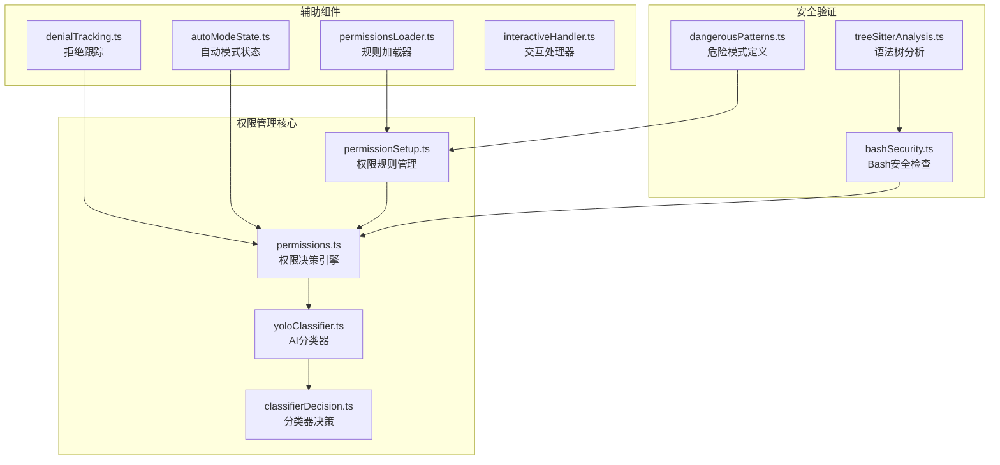
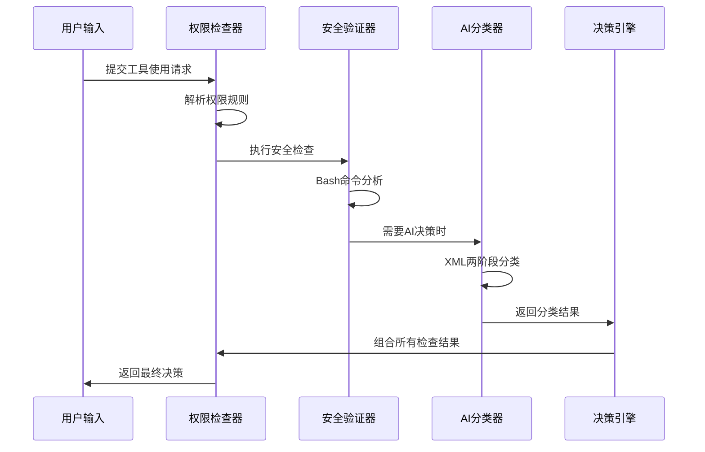
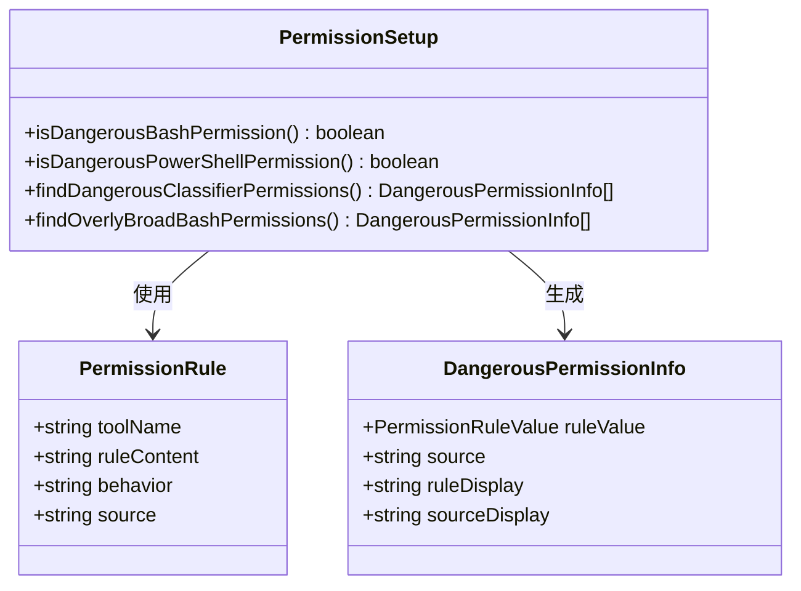
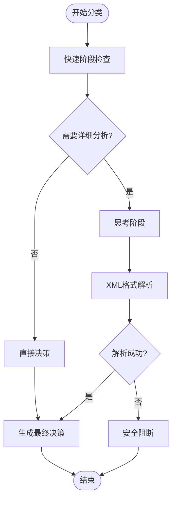
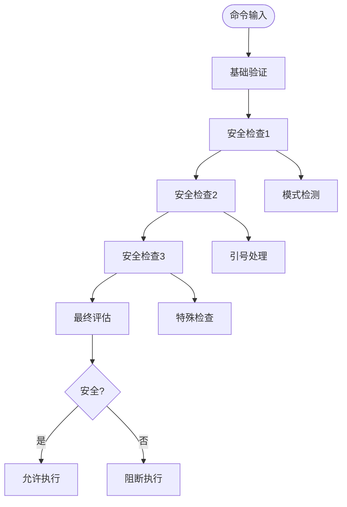
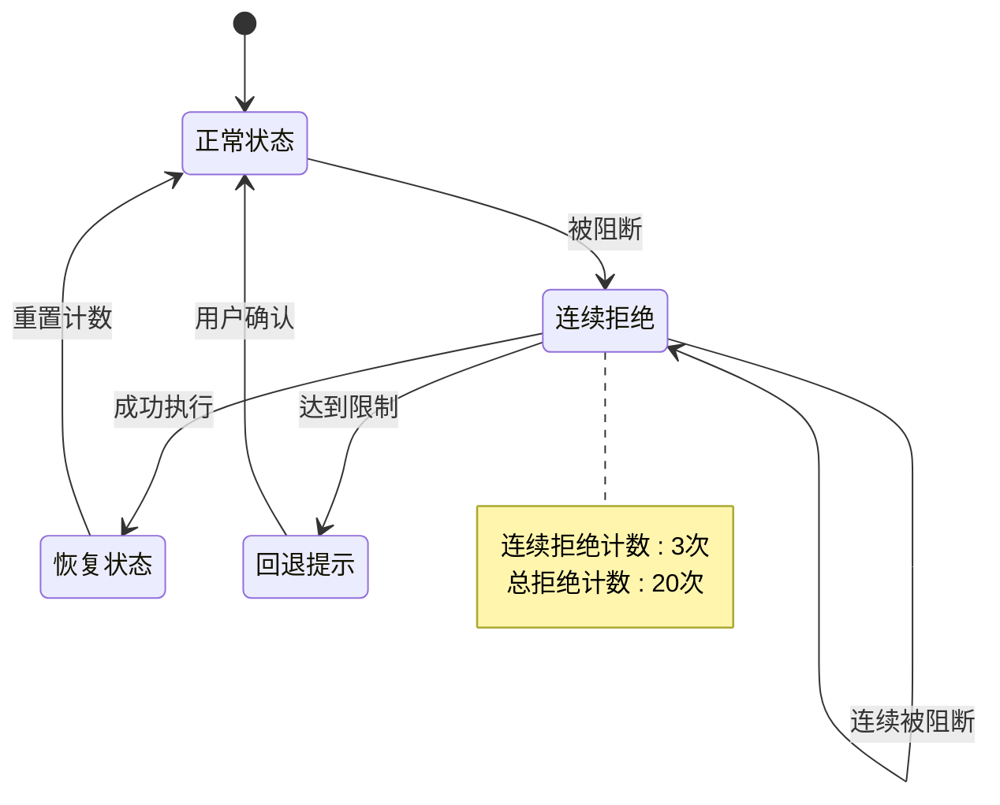
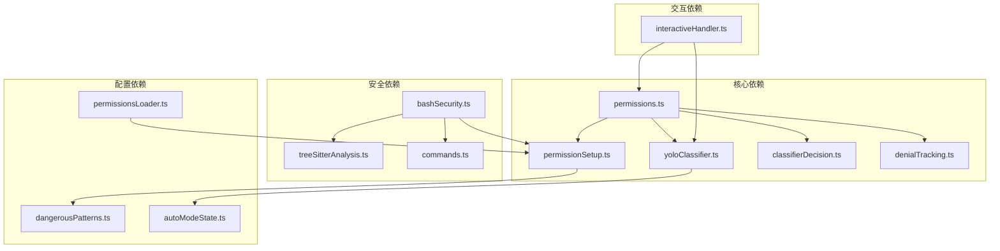

# 权限分类与识别

<cite>
**本文档引用的文件**
- [permissionSetup.ts](file://src/utils/permissions/permissionSetup.ts)
- [yoloClassifier.ts](file://src/utils/permissions/yoloClassifier.ts)
- [permissions.ts](file://src/utils/permissions/permissions.ts)
- [bashSecurity.ts](file://src/tools/BashTool/bashSecurity.ts)
- [dangerousPatterns.ts](file://src/utils/permissions/dangerousPatterns.ts)
- [classifierDecision.ts](file://src/utils/permissions/classifierDecision.ts)
- [bashClassifier.ts](file://src/utils/permissions/bashClassifier.ts)
- [autoModeState.ts](file://src/utils/permissions/autoModeState.ts)
- [denialTracking.ts](file://src/utils/permissions/denialTracking.ts)
- [permissionsLoader.ts](file://src/utils/permissions/permissionsLoader.ts)
- [treeSitterAnalysis.ts](file://src/utils/bash/treeSitterAnalysis.ts)
- [commands.ts](file://src/utils/bash/commands.ts)
- [interactiveHandler.ts](file://src/hooks/toolPermission/handlers/interactiveHandler.ts)
</cite>

## 目录
1. [简介](#简介)
2. [项目结构](#项目结构)
3. [核心组件](#核心组件)
4. [架构概览](#架构概览)
5. [详细组件分析](#详细组件分析)
6. [依赖关系分析](#依赖关系分析)
7. [性能考虑](#性能考虑)
8. [故障排除指南](#故障排除指南)
9. [结论](#结论)

## 简介

Claude Code权限分类与识别系统是一个多层次的安全防护框架，旨在保护用户免受恶意命令和危险操作的影响。该系统通过结合传统规则匹配、现代机器学习分类器和深度安全验证，为不同的shell工具（特别是Bash）提供智能权限控制。

系统的核心特性包括：
- 多层次权限检查机制
- 基于XML的两阶段AI分类器
- 深度shell命令安全分析
- 危险模式自动检测
- 智能误判处理和例外情况管理

## 项目结构

权限分类与识别系统主要分布在以下目录中：

**图表来源**
- [permissionSetup.ts:1-1533](file://src/utils/permissions/permissionSetup.ts#L1-L1533)
- [yoloClassifier.ts:1-1496](file://src/utils/permissions/yoloClassifier.ts#L1-L1496)
- [permissions.ts:1-1487](file://src/utils/permissions/permissions.ts#L1-L1487)

**章节来源**
- [permissionSetup.ts:1-1533](file://src/utils/permissions/permissionSetup.ts#L1-L1533)
- [yoloClassifier.ts:1-1496](file://src/utils/permissions/yoloClassifier.ts#L1-L1496)
- [permissions.ts:1-1487](file://src/utils/permissions/permissions.ts#L1-L1487)

## 核心组件

### 权限规则管理系统

权限规则管理系统负责管理和解析各种权限规则，包括允许、拒绝和询问三种行为类型。

**危险权限检测机制**：
- Bash危险权限：支持通配符和前缀规则检测
- PowerShell危险权限：检测任意代码执行模式
- Agent危险权限：防止代理绕过机制

**关键功能**：
- 规则解析和验证
- 危险权限自动移除
- 权限规则持久化
- 跨源权限合并

### AI驱动的YOLO分类器

YOLO（You Only Look Once）分类器是系统的核心AI组件，采用两阶段XML输出格式进行安全决策。

**两阶段分类流程**：
1. **快速阶段（Stage 1）**：使用64个token限制，立即给出阻断或允许决定
2. **思考阶段（Stage 2）**：对需要进一步分析的请求进行详细推理

**XML输出格式**：
- `<block>yes/no</block>` - 主要决策标签
- `<reason>原因说明</reason>` - 决策理由
- `<thinking>链式思维过程</thinking>` - 分析过程

### Bash安全验证系统

Bash安全验证系统提供了多层次的安全检查，确保命令执行的安全性。

**安全检查类型**：
- 命令注入检测
- 危险元字符分析
- 引号和转义序列处理
- 进程替换和命令子stitution检测
- Heredoc安全验证

**章节来源**
- [permissionSetup.ts:84-147](file://src/utils/permissions/permissionSetup.ts#L84-L147)
- [yoloClassifier.ts:545-1108](file://src/utils/permissions/yoloClassifier.ts#L545-L1108)
- [bashSecurity.ts:1-800](file://src/tools/BashTool/bashSecurity.ts#L1-L800)

## 架构概览

系统采用分层架构设计，从底层安全验证到高层AI决策形成完整的防护体系：

**图表来源**
- [permissions.ts:473-800](file://src/utils/permissions/permissions.ts#L473-L800)
- [yoloClassifier.ts:711-1108](file://src/utils/permissions/yoloClassifier.ts#L711-L1108)

**章节来源**
- [permissions.ts:473-800](file://src/utils/permissions/permissions.ts#L473-L800)
- [yoloClassifier.ts:711-1108](file://src/utils/permissions/yoloClassifier.ts#L711-L1108)

## 详细组件分析

### 权限规则分类器

权限规则分类器负责识别和处理不同类型的权限规则，特别是那些可能绕过安全检查的危险规则。

**图表来源**
- [permissionSetup.ts:94-342](file://src/utils/permissions/permissionSetup.ts#L94-L342)

**危险规则检测逻辑**：

1. **Bash危险规则检测**：
   - 工具级允许规则（Bash无内容）
   - 解释器前缀规则（python:*）
   - 通配符规则匹配（python*）

2. **PowerShell危险规则检测**：
   - 任意代码执行cmdlet
   - 嵌套shell启动
   - 脚本块执行

3. **Agent危险规则检测**：
   - 代理允许规则绕过子代理评估

**章节来源**
- [permissionSetup.ts:84-342](file://src/utils/permissions/permissionSetup.ts#L84-L342)
- [dangerousPatterns.ts:1-81](file://src/utils/permissions/dangerousPatterns.ts#L1-L81)

### AI分类器决策过程

AI分类器采用XML输出格式，通过两阶段决策过程确保安全性：

**图表来源**
- [yoloClassifier.ts:711-917](file://src/utils/permissions/yoloClassifier.ts#L711-L917)

**分类器配置**：
- **快速模式**：max_tokens=64，stop_sequences用于立即决策
- **思考模式**：max_tokens=256，允许详细reason标签
- **默认模式**：快速阶段失败时自动进入思考阶段

**XML输出格式规范**：
- `<block>yes/no</block>` - 明确的阻断/允许决策
- `<reason>简短原因</reason>` - 当允许时可选
- `<thinking>分析过程</thinking>` - 链式思维

**章节来源**
- [yoloClassifier.ts:545-664](file://src/utils/permissions/yoloClassifier.ts#L545-L664)
- [yoloClassifier.ts:711-917](file://src/utils/permissions/yoloClassifier.ts#L711-L917)

### Bash命令安全分析

Bash命令安全分析系统提供了全面的安全检查机制：

**图表来源**
- [bashSecurity.ts:233-740](file://src/tools/BashTool/bashSecurity.ts#L233-L740)

**关键安全检查**：

1. **命令完整性检查**：
   - 检测不完整命令片段
   - 验证命令起始字符合法性

2. **危险元字符检测**：
   - 分号、管道、与运算符检测
   - 命令替换模式检测
   - 参数扩展检测

3. **引号和转义处理**：
   - 单引号和双引号内容提取
   - 反斜杠转义序列处理
   - 安全重定向剥离

4. **特殊命令检测**：
   - Git提交消息安全检查
   - jq命令系统函数检测
   - Heredoc安全验证

**章节来源**
- [bashSecurity.ts:233-740](file://src/tools/BashTool/bashSecurity.ts#L233-L740)
- [treeSitterAnalysis.ts:496-506](file://src/utils/bash/treeSitterAnalysis.ts#L496-L506)

### 拒绝跟踪和误判处理

系统实现了智能的拒绝跟踪机制，用于处理AI分类器的误判情况：

**图表来源**
- [denialTracking.ts:12-45](file://src/utils/permissions/denialTracking.ts#L12-L45)

**误判处理策略**：
- **连续拒绝限制**：超过3次连续拒绝触发回退
- **总拒绝限制**：超过20次总拒绝重置状态
- **智能回退**：自动切换到用户确认模式
- **状态持久化**：拒绝状态在会话间保持

**章节来源**
- [denialTracking.ts:1-46](file://src/utils/permissions/denialTracking.ts#L1-L46)
- [permissions.ts:1029-1058](file://src/utils/permissions/permissions.ts#L1029-L1058)

## 依赖关系分析

系统各组件之间的依赖关系形成了一个复杂的协作网络：

**图表来源**
- [permissions.ts:1-100](file://src/utils/permissions/permissions.ts#L1-L100)
- [yoloClassifier.ts:1-50](file://src/utils/permissions/yoloClassifier.ts#L1-L50)

**依赖特点**：
- **低耦合高内聚**：各模块职责明确，接口清晰
- **条件编译支持**：ANT构建版本的特性开关
- **异步处理**：AI分类器采用异步非阻塞模式
- **错误隔离**：单个组件故障不影响整体系统

**章节来源**
- [permissions.ts:1-100](file://src/utils/permissions/permissions.ts#L1-L100)
- [yoloClassifier.ts:1-50](file://src/utils/permissions/yoloClassifier.ts#L1-L50)

## 性能考虑

系统在保证安全性的同时，也注重性能优化：

### 缓存策略
- **提示词缓存**：系统提示词和CLAUDE.md内容使用缓存控制
- **分类器缓存**：两阶段分类器共享缓存前缀
- **令牌统计缓存**：避免重复的令牌计算

### 优化技术
- **快速路径**：安全工具直接放行，跳过分类器
- **接受编辑模式**：在工作目录内的文件编辑直接放行
- **允许列表**：常见安全工具加入白名单
- **条件编译**：根据构建类型启用/禁用功能

### 性能监控
- **分类器成本追踪**：记录API调用成本和延迟
- **令牌使用统计**：监控分类器和主循环的令牌消耗
- **超时处理**：合理设置分类器超时时间

## 故障排除指南

### 常见问题及解决方案

**AI分类器不可用**：
- 检查网络连接和API密钥配置
- 查看分类器错误日志
- 验证模型可用性和配额

**误判处理**：
- 检查拒绝跟踪状态
- 查看最近的分类器决策日志
- 调整权限规则或分类器阈值

**安全检查误报**：
- 分析具体的警告信息
- 检查命令格式和引号使用
- 调整安全检查参数

**章节来源**
- [permissions.ts:1029-1058](file://src/utils/permissions/permissions.ts#L1029-L1058)
- [interactiveHandler.ts:523-536](file://src/hooks/toolPermission/handlers/interactiveHandler.ts#L523-L536)

## 结论

Claude Code权限分类与识别系统通过多层次的安全防护机制，为用户提供了全面的命令执行安全保障。系统的核心优势包括：

1. **多层防护架构**：从基础规则检查到AI智能分类的完整防护链
2. **智能误判处理**：通过拒绝跟踪和回退机制减少误判影响
3. **高性能设计**：采用缓存、快速路径和异步处理优化性能
4. **灵活配置**：支持多种权限规则和分类器配置选项
5. **持续改进**：通过日志分析和错误报告不断优化系统表现

该系统为AI助手的安全使用提供了坚实的技术基础，既保证了用户体验的流畅性，又确保了系统的安全性。