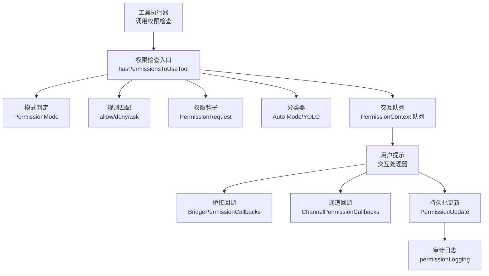
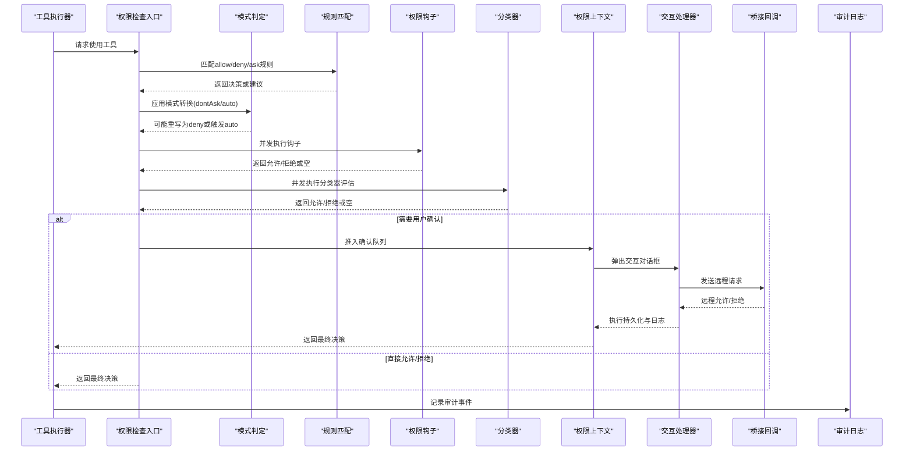
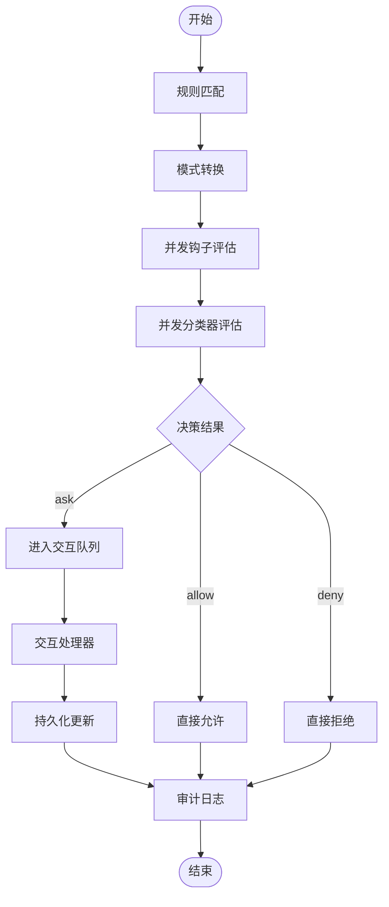
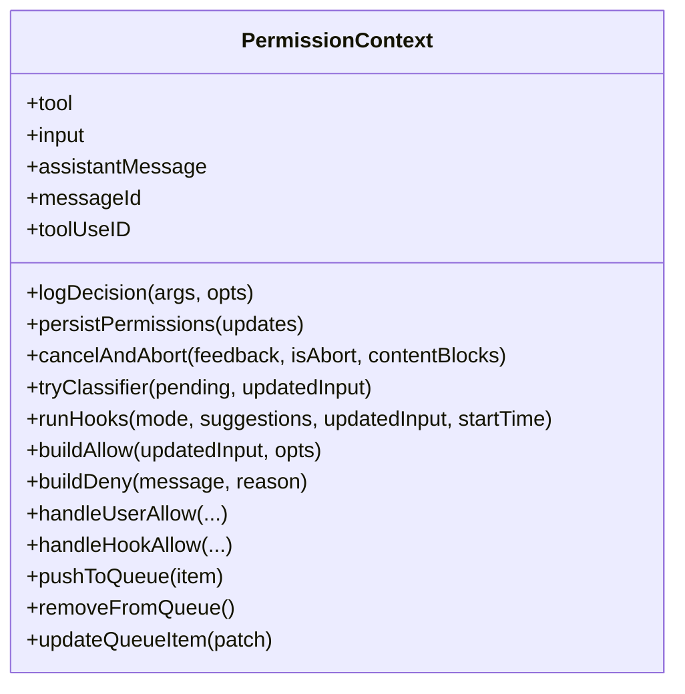
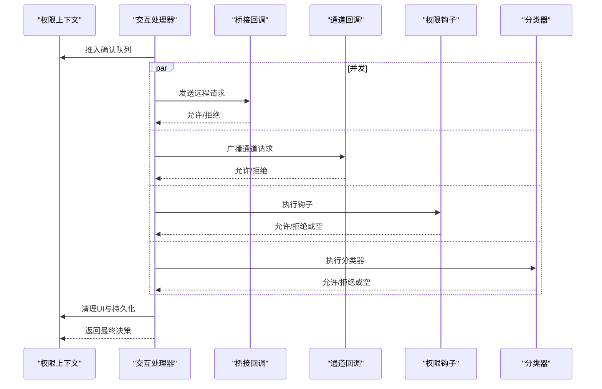
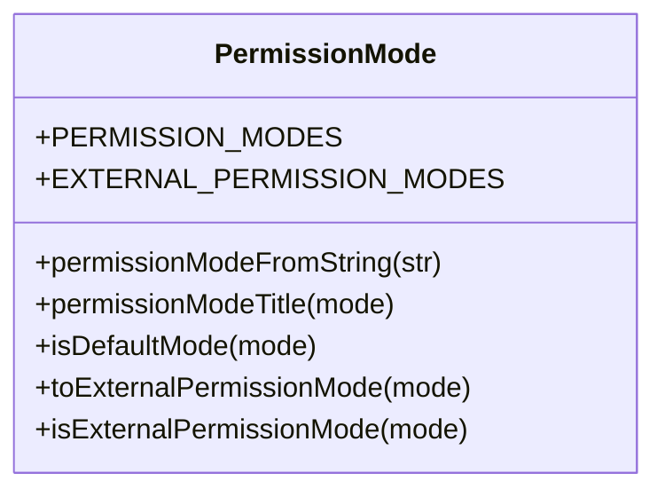
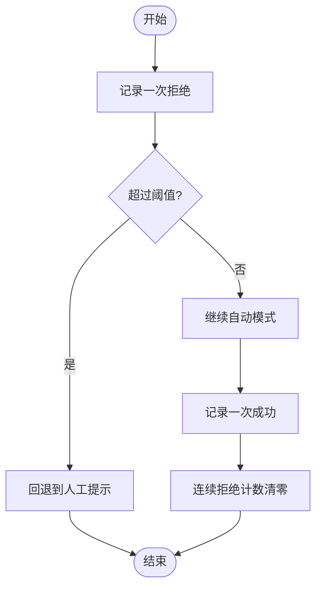
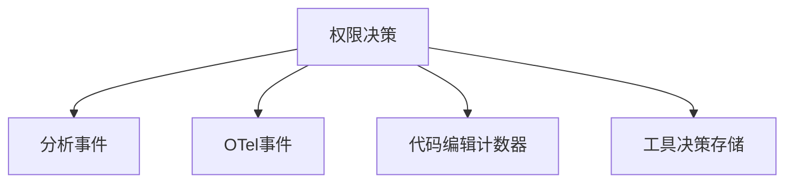
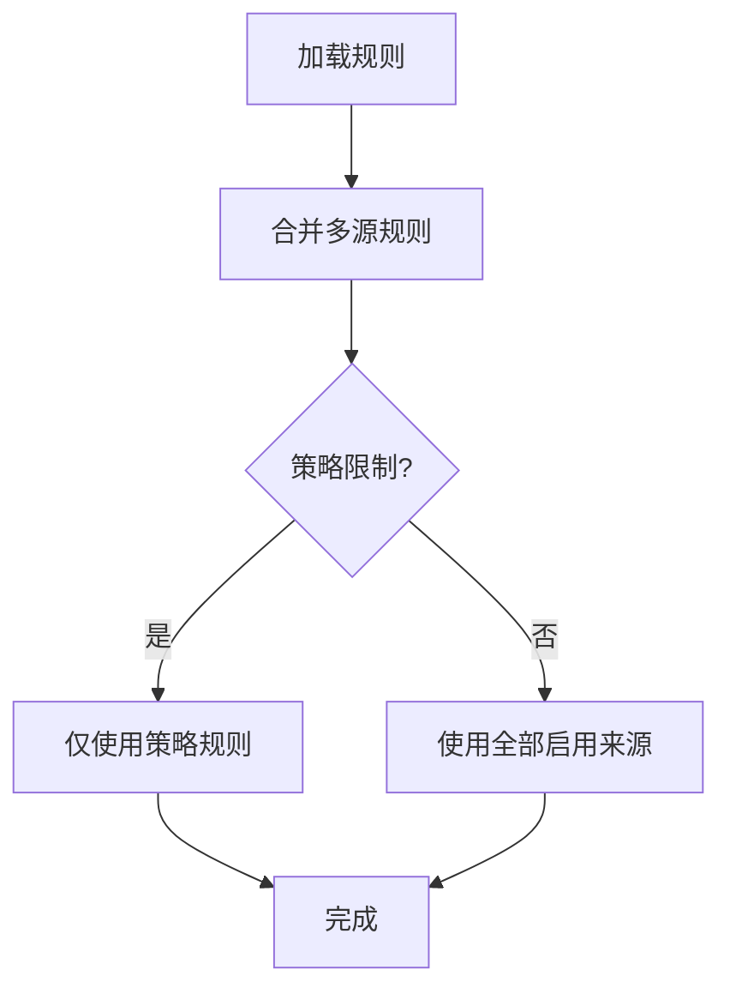
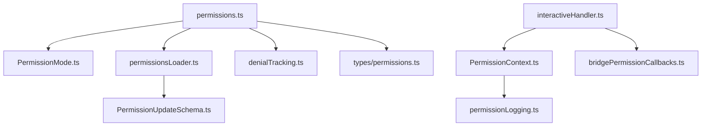

# 权限工作流程

<cite>
**本文档引用的文件**
- [src/utils/permissions/permissions.ts](file://src/utils/permissions/permissions.ts)
- [src/hooks/toolPermission/handlers/interactiveHandler.ts](file://src/hooks/toolPermission/handlers/interactiveHandler.ts)
- [src/hooks/toolPermission/PermissionContext.ts](file://src/hooks/toolPermission/PermissionContext.ts)
- [src/utils/permissions/PermissionMode.ts](file://src/utils/permissions/PermissionMode.ts)
- [src/utils/permissions/denialTracking.ts](file://src/utils/permissions/denialTracking.ts)
- [src/hooks/toolPermission/permissionLogging.ts](file://src/hooks/toolPermission/permissionLogging.ts)
- [src/utils/permissions/permissionsLoader.ts](file://src/utils/permissions/permissionsLoader.ts)
- [src/utils/permissions/PermissionUpdateSchema.ts](file://src/utils/permissions/PermissionUpdateSchema.ts)
- [src/types/permissions.ts](file://src/types/permissions.ts)
- [src/bridge/bridgePermissionCallbacks.ts](file://src/bridge/bridgePermissionCallbacks.ts)
- [src/utils/swarm/permissionSync.ts](file://src/utils/swarm/permissionSync.ts)
- [src/tools/BashTool/modeValidation.ts](file://src/tools/BashTool/modeValidation.ts)
- [src/services/tools/toolExecution.ts](file://src/services/tools/toolExecution.ts)
- [src/cli/print.ts](file://src/cli/print.ts)
</cite>

## 目录
1. [简介](#简介)
2. [项目结构](#项目结构)
3. [核心组件](#核心组件)
4. [架构总览](#架构总览)
5. [详细组件分析](#详细组件分析)
6. [依赖关系分析](#依赖关系分析)
7. [性能考虑](#性能考虑)
8. [故障排除指南](#故障排除指南)
9. [结论](#结论)
10. [附录](#附录)

## 简介
本文件面向Claude Code权限工作流程的技术文档，系统性阐述权限请求的完整生命周期：从权限检查、自动化评估、用户提示到最终决策执行；覆盖自动模式、交互模式、强制模式（如dontAsk）等状态下的差异化处理；解释权限拒绝跟踪与审计日志实现；说明可配置项与自定义能力；并提供监控与调试方法以及异常处理与恢复机制。

## 项目结构
权限工作流由多层协作组成：
- 工具层：各工具在执行前调用统一的权限检查入口，返回允许、询问或拒绝三种结果之一。
- 权限上下文层：封装权限决策的上下文、队列操作、持久化更新与日志记录。
- 交互处理器层：负责在交互模式下推送确认队列、并发运行分类器与钩子、响应桥接端与通道端的远程决策。
- 模式与规则层：定义权限模式、规则来源与行为、更新类型与持久化目标。
- 日志与审计层：集中记录批准/拒绝事件，输出到分析平台与可观测性系统。
- 远程桥接层：支持与远端（如Web应用）进行权限请求/响应的桥接通信。

图表来源
- [src/utils/permissions/permissions.ts:473-800](file://src/utils/permissions/permissions.ts#L473-L800)
- [src/hooks/toolPermission/handlers/interactiveHandler.ts:57-537](file://src/hooks/toolPermission/handlers/interactiveHandler.ts#L57-L537)
- [src/hooks/toolPermission/PermissionContext.ts:96-348](file://src/hooks/toolPermission/PermissionContext.ts#L96-L348)
- [src/utils/permissions/PermissionMode.ts:42-91](file://src/utils/permissions/PermissionMode.ts#L42-L91)
- [src/bridge/bridgePermissionCallbacks.ts:10-27](file://src/bridge/bridgePermissionCallbacks.ts#L10-L27)

章节来源
- [src/utils/permissions/permissions.ts:473-800](file://src/utils/permissions/permissions.ts#L473-L800)
- [src/hooks/toolPermission/handlers/interactiveHandler.ts:57-537](file://src/hooks/toolPermission/handlers/interactiveHandler.ts#L57-L537)
- [src/hooks/toolPermission/PermissionContext.ts:96-348](file://src/hooks/toolPermission/PermissionContext.ts#L96-L348)
- [src/utils/permissions/PermissionMode.ts:42-91](file://src/utils/permissions/PermissionMode.ts#L42-L91)
- [src/bridge/bridgePermissionCallbacks.ts:10-27](file://src/bridge/bridgePermissionCallbacks.ts#L10-L27)

## 核心组件
- 权限检查入口：统一的工具使用权限检查函数，负责规则匹配、模式转换、分类器评估与钩子执行。
- 权限上下文：封装决策上下文、队列操作、持久化更新、日志记录与取消/中止逻辑。
- 交互处理器：在交互模式下推送确认队列、并发运行分类器与钩子、响应桥接端与通道端的远程决策。
- 权限模式：定义默认、计划、接受编辑、绕过权限、不询问、自动等模式及其外部映射。
- 拒绝跟踪：统计连续拒绝与累计拒绝次数，决定是否回退到人工提示。
- 审计日志：集中记录批准/拒绝事件，输出到分析平台与可观测性系统。
- 规则加载与持久化：从多源设置加载规则，支持添加/删除规则与模式更新。
- 更新类型与Schema：定义规则增删改、模式设置、目录范围扩展等更新操作及持久化目标。

章节来源
- [src/utils/permissions/permissions.ts:473-800](file://src/utils/permissions/permissions.ts#L473-L800)
- [src/hooks/toolPermission/PermissionContext.ts:96-348](file://src/hooks/toolPermission/PermissionContext.ts#L96-L348)
- [src/hooks/toolPermission/handlers/interactiveHandler.ts:57-537](file://src/hooks/toolPermission/handlers/interactiveHandler.ts#L57-L537)
- [src/utils/permissions/PermissionMode.ts:42-91](file://src/utils/permissions/PermissionMode.ts#L42-L91)
- [src/utils/permissions/denialTracking.ts:1-46](file://src/utils/permissions/denialTracking.ts#L1-L46)
- [src/hooks/toolPermission/permissionLogging.ts:181-235](file://src/hooks/toolPermission/permissionLogging.ts#L181-L235)
- [src/utils/permissions/permissionsLoader.ts:120-133](file://src/utils/permissions/permissionsLoader.ts#L120-L133)
- [src/utils/permissions/PermissionUpdateSchema.ts:42-79](file://src/utils/permissions/PermissionUpdateSchema.ts#L42-L79)
- [src/types/permissions.ts:427-441](file://src/types/permissions.ts#L427-L441)

## 架构总览
权限工作流采用“规则优先、模式辅助、分类器兜底、钩子扩展”的分层设计。工具调用时先进行规则匹配与模式转换，再并发执行钩子与分类器评估，最后在需要时弹出交互对话框等待用户决策。所有决策均通过统一的日志接口进行审计。

图表来源
- [src/utils/permissions/permissions.ts:473-800](file://src/utils/permissions/permissions.ts#L473-L800)
- [src/hooks/toolPermission/handlers/interactiveHandler.ts:57-537](file://src/hooks/toolPermission/handlers/interactiveHandler.ts#L57-L537)
- [src/hooks/toolPermission/PermissionContext.ts:96-348](file://src/hooks/toolPermission/PermissionContext.ts#L96-L348)
- [src/hooks/toolPermission/permissionLogging.ts:181-235](file://src/hooks/toolPermission/permissionLogging.ts#L181-L235)

## 详细组件分析

### 权限检查入口与决策流程
- 规则匹配：按来源顺序合并alwaysAllow/alwaysDeny/alwaysAsk规则，优先匹配整工具或MCP服务器级规则。
- 模式转换：dontAsk模式将ask直接转为deny；auto模式在满足条件下使用分类器自动评估。
- 分类器评估：对Bash等工具在auto模式下尝试YOLO分类器快速判断，若安全则直接允许并记录。
- 钩子执行：异步遍历权限钩子，若钩子提前返回允许/拒绝则短路后续流程。
- 最终决策：根据规则、模式、分类器与钩子的结果生成allow/ask/deny三态。

图表来源
- [src/utils/permissions/permissions.ts:473-800](file://src/utils/permissions/permissions.ts#L473-L800)
- [src/hooks/toolPermission/handlers/interactiveHandler.ts:57-537](file://src/hooks/toolPermission/handlers/interactiveHandler.ts#L57-L537)
- [src/hooks/toolPermission/permissionLogging.ts:181-235](file://src/hooks/toolPermission/permissionLogging.ts#L181-L235)

章节来源
- [src/utils/permissions/permissions.ts:473-800](file://src/utils/permissions/permissions.ts#L473-L800)

### 权限上下文与交互队列
- 上下文职责：封装工具名、输入、消息ID、工具使用ID、队列操作、持久化更新、日志记录、取消/中止逻辑。
- 队列操作：支持推入、移除、更新队列项，用于交互对话框的显示与状态变更。
- 决策构建：提供buildAllow/buildDeny方法，支持用户修改标记、反馈内容块等。
- 持久化更新：根据更新类型与目的地进行规则增删改、模式设置、目录范围扩展等。

图表来源
- [src/hooks/toolPermission/PermissionContext.ts:96-348](file://src/hooks/toolPermission/PermissionContext.ts#L96-L348)

章节来源
- [src/hooks/toolPermission/PermissionContext.ts:96-348](file://src/hooks/toolPermission/PermissionContext.ts#L96-L348)

### 交互处理器与并发决策
- 并发竞争：桥接端、通道端、本地钩子、分类器四路并发，首个获胜者决定最终结果。
- 用户交互：支持Esc快速关闭、用户交互后清除分类器指示、避免误触。
- 远程桥接：向远端发送请求，接收允许/拒绝响应并取消本地对话框。
- 通道回调：向多个通道（如Telegram、iMessage）广播权限请求，接收纯yes/no回复。
- 重新检查：当模式切换或状态变化时，可重新检查权限以短路允许。

图表来源
- [src/hooks/toolPermission/handlers/interactiveHandler.ts:234-408](file://src/hooks/toolPermission/handlers/interactiveHandler.ts#L234-L408)

章节来源
- [src/hooks/toolPermission/handlers/interactiveHandler.ts:57-537](file://src/hooks/toolPermission/handlers/interactiveHandler.ts#L57-L537)

### 权限模式与状态管理
- 模式定义：默认、计划、接受编辑、绕过权限、不询问、自动（受特性开关控制）。
- 外部映射：部分模式对外部用户不可见（如auto），通过toExternalPermissionMode映射。
- 模式转换：dontAsk将ask转为deny；auto在满足条件时跳过人工提示。
- 模式持久化：通过PermissionUpdate的setMode类型持久化到用户/项目/会话等目标。

图表来源
- [src/utils/permissions/PermissionMode.ts:16-141](file://src/utils/permissions/PermissionMode.ts#L16-L141)
- [src/types/permissions.ts:16-38](file://src/types/permissions.ts#L16-L38)

章节来源
- [src/utils/permissions/PermissionMode.ts:42-91](file://src/utils/permissions/PermissionMode.ts#L42-L91)
- [src/types/permissions.ts:427-441](file://src/types/permissions.ts#L427-L441)

### 拒绝跟踪与回退策略
- 统计维度：连续拒绝次数与累计拒绝次数。
- 回退阈值：超过阈值后自动回退到人工提示，避免过度自动化导致的用户反感。
- 成功清零：在auto模式下成功一次工具使用即清零连续拒绝计数。

图表来源
- [src/utils/permissions/denialTracking.ts:1-46](file://src/utils/permissions/denialTracking.ts#L1-L46)

章节来源
- [src/utils/permissions/denialTracking.ts:1-46](file://src/utils/permissions/denialTracking.ts#L1-L46)

### 审计日志与可观测性
- 事件命名：区分用户批准（永久/临时）、钩子批准、分类器批准、配置批准；拒绝事件统一命名但带来源元数据。
- 指标输出：OTel事件、代码编辑工具计数器、分析平台事件，支持语言维度增强。
- 决策存储：在工具使用上下文中保存最近一次决策，便于下游分析。

图表来源
- [src/hooks/toolPermission/permissionLogging.ts:181-235](file://src/hooks/toolPermission/permissionLogging.ts#L181-L235)
- [src/services/tools/toolExecution.ts:173-194](file://src/services/tools/toolExecution.ts#L173-L194)

章节来源
- [src/hooks/toolPermission/permissionLogging.ts:181-235](file://src/hooks/toolPermission/permissionLogging.ts#L181-L235)
- [src/services/tools/toolExecution.ts:173-194](file://src/services/tools/toolExecution.ts#L173-L194)

### 规则加载与持久化
- 规则来源：用户设置、项目设置、本地设置、策略设置、标志设置、命令行参数、会话内存。
- 加载策略：受策略限制时仅允许管理规则；否则从启用的来源合并规则。
- 持久化操作：支持添加/替换/删除规则、设置模式、增删额外工作目录范围。

图表来源
- [src/utils/permissions/permissionsLoader.ts:120-133](file://src/utils/permissions/permissionsLoader.ts#L120-L133)

章节来源
- [src/utils/permissions/permissionsLoader.ts:120-133](file://src/utils/permissions/permissionsLoader.ts#L120-L133)
- [src/utils/permissions/PermissionUpdateSchema.ts:42-79](file://src/utils/permissions/PermissionUpdateSchema.ts#L42-L79)

### 权限更新类型与Schema
- 更新类型：addRules、replaceRules、removeRules、setMode、addDirectories、removeDirectories。
- 目的地：用户设置、项目设置、本地设置、会话内存、命令行参数。
- Schema约束：使用Zod延迟schema避免循环依赖，确保更新结构合法。

章节来源
- [src/utils/permissions/PermissionUpdateSchema.ts:42-79](file://src/utils/permissions/PermissionUpdateSchema.ts#L42-L79)
- [src/types/permissions.ts:98-131](file://src/types/permissions.ts#L98-L131)

### 远程桥接与同步
- 桥接回调：定义发送请求、发送响应、取消请求与响应监听的接口。
- 响应格式：行为（允许/拒绝）、更新后的输入、更新后的权限、消息。
- 同步工具：提供轮询响应的便利函数，简化工作器侧集成。

章节来源
- [src/bridge/bridgePermissionCallbacks.ts:10-44](file://src/bridge/bridgePermissionCallbacks.ts#L10-L44)
- [src/utils/swarm/permissionSync.ts:519-564](file://src/utils/swarm/permissionSync.ts#L519-L564)

### 模式特定处理（Bash工具）
- 模式验证：在非bypass/dontAsk模式下，根据当前权限模式对Bash命令进行特殊处理。
- 快速路径：在acceptEdits模式下允许安全的文件编辑命令，避免昂贵的分类器调用。

章节来源
- [src/tools/BashTool/modeValidation.ts:58-92](file://src/tools/BashTool/modeValidation.ts#L58-L92)

### 模式切换与CLI集成
- CLI模式切换：支持通过CLI将权限模式切换为auto，若分类器门禁未开启则返回错误信息。
- 切换流程：记录控制响应，更新权限上下文模式并返回新状态。

章节来源
- [src/cli/print.ts:4602-4642](file://src/cli/print.ts#L4602-L4642)

## 依赖关系分析
- 权限检查入口依赖：规则加载器、模式定义、钩子执行器、分类器模块、拒绝跟踪。
- 交互处理器依赖：权限上下文、桥接回调、通道回调、分类器执行器。
- 审计日志依赖：分析平台、OTel、代码编辑计数器、工具使用上下文。
- 规则持久化依赖：设置读写、文件系统操作、JSON解析与更新。

图表来源
- [src/utils/permissions/permissions.ts:1-120](file://src/utils/permissions/permissions.ts#L1-L120)
- [src/hooks/toolPermission/handlers/interactiveHandler.ts:1-50](file://src/hooks/toolPermission/handlers/interactiveHandler.ts#L1-L50)
- [src/hooks/toolPermission/PermissionContext.ts:1-50](file://src/hooks/toolPermission/PermissionContext.ts#L1-L50)
- [src/hooks/toolPermission/permissionLogging.ts:1-30](file://src/hooks/toolPermission/permissionLogging.ts#L1-L30)
- [src/utils/permissions/permissionsLoader.ts:1-30](file://src/utils/permissions/permissionsLoader.ts#L1-L30)
- [src/utils/permissions/PermissionUpdateSchema.ts:1-25](file://src/utils/permissions/PermissionUpdateSchema.ts#L1-L25)

章节来源
- [src/utils/permissions/permissions.ts:1-120](file://src/utils/permissions/permissions.ts#L1-L120)
- [src/hooks/toolPermission/handlers/interactiveHandler.ts:1-50](file://src/hooks/toolPermission/handlers/interactiveHandler.ts#L1-L50)
- [src/hooks/toolPermission/PermissionContext.ts:1-50](file://src/hooks/toolPermission/PermissionContext.ts#L1-L50)
- [src/hooks/toolPermission/permissionLogging.ts:1-30](file://src/hooks/toolPermission/permissionLogging.ts#L1-L30)
- [src/utils/permissions/permissionsLoader.ts:1-30](file://src/utils/permissions/permissionsLoader.ts#L1-L30)
- [src/utils/permissions/PermissionUpdateSchema.ts:1-25](file://src/utils/permissions/PermissionUpdateSchema.ts#L1-L25)

## 性能考虑
- 并发评估：钩子与分类器并发执行，减少用户等待时间。
- 快速路径：acceptEdits模式与安全工具白名单避免不必要的分类器调用。
- UI反馈：分类器运行时的指示器与自动批准过渡动画，提升感知性能。
- 资源释放：在首个获胜者出现后及时清理UI、取消订阅与桥接请求，避免资源泄漏。

## 故障排除指南
- 分类器失败：分类器API错误被记录但不中断流程，避免因网络/速率限制导致的误拒。
- 拒绝过多：当连续拒绝达到阈值时自动回退到人工提示，缓解用户疲劳。
- 模式冲突：dontAsk模式将ask直接转为deny；auto模式在headless环境下可能回退到ask或拒绝。
- 远程桥接：桥接端响应优先于本地/钩子/分类器，首个获胜者决定结果；若远端无响应，本地流程继续推进。
- 设置损坏：规则加载采用宽松解析，保留现有规则避免因其他字段校验失败而丢失权限配置。

章节来源
- [src/hooks/toolPermission/handlers/interactiveHandler.ts:523-529](file://src/hooks/toolPermission/handlers/interactiveHandler.ts#L523-L529)
- [src/utils/permissions/denialTracking.ts:40-45](file://src/utils/permissions/denialTracking.ts#L40-L45)
- [src/utils/permissions/permissions.ts:503-548](file://src/utils/permissions/permissions.ts#L503-L548)
- [src/utils/permissions/permissionsLoader.ts:61-83](file://src/utils/permissions/permissionsLoader.ts#L61-L83)

## 结论
该权限工作流通过规则、模式、分类器与钩子的协同，实现了灵活可控的自动化授权决策。交互处理器确保在需要时提供即时的人工确认，同时通过审计日志与可观测性指标保障透明度与可追溯性。拒绝跟踪与回退策略有效平衡了自动化效率与用户体验。整体设计具备良好的扩展性与自定义能力，适合在不同场景下调整权限策略。

## 附录

### 权限工作流状态管理要点
- 自动模式（auto）：优先使用分类器评估，必要时回退到人工提示；在成功使用后清零连续拒绝计数。
- 交互模式（默认）：所有ask决策均弹出对话框，支持用户修改输入与权限更新。
- 强制模式（dontAsk）：将所有ask直接转为deny，适用于严格环境。
- 绕过模式（bypassPermissions）：跳过权限检查，仅在特定条件下可用。

章节来源
- [src/utils/permissions/PermissionMode.ts:42-91](file://src/utils/permissions/PermissionMode.ts#L42-L91)
- [src/utils/permissions/permissions.ts:503-548](file://src/utils/permissions/permissions.ts#L503-L548)

### 权限拒绝跟踪与审计日志实现
- 拒绝跟踪：维护连续与累计拒绝计数，超过阈值自动回退到提示。
- 审计日志：统一事件命名与元数据，输出至分析平台、OTel与代码编辑计数器，并在工具使用上下文中持久化最近一次决策。

章节来源
- [src/utils/permissions/denialTracking.ts:1-46](file://src/utils/permissions/denialTracking.ts#L1-L46)
- [src/hooks/toolPermission/permissionLogging.ts:181-235](file://src/hooks/toolPermission/permissionLogging.ts#L181-L235)

### 权限工作流配置选项与自定义能力
- 规则来源：用户设置、项目设置、本地设置、策略设置、标志设置、命令行参数、会话内存。
- 更新类型：规则增删改、模式设置、目录范围扩展，支持持久化到不同目的地。
- 模式映射：内部模式与外部模式的转换，适配不同用户类型。

章节来源
- [src/utils/permissions/permissionsLoader.ts:120-133](file://src/utils/permissions/permissionsLoader.ts#L120-L133)
- [src/utils/permissions/PermissionUpdateSchema.ts:42-79](file://src/utils/permissions/PermissionUpdateSchema.ts#L42-L79)
- [src/utils/permissions/PermissionMode.ts:111-115](file://src/utils/permissions/PermissionMode.ts#L111-L115)

### 监控与调试方法
- 分类器错误日志：记录分类器API错误，便于定位网络/速率限制问题。
- 决策等待时间：在用户提示场景记录等待时长，用于性能分析。
- 工具决策存储：在工具使用上下文中保存决策，便于回溯与分析。

章节来源
- [src/hooks/toolPermission/handlers/interactiveHandler.ts:523-529](file://src/hooks/toolPermission/handlers/interactiveHandler.ts#L523-L529)
- [src/hooks/toolPermission/permissionLogging.ts:91-104](file://src/hooks/toolPermission/permissionLogging.ts#L91-L104)
- [src/hooks/toolPermission/permissionLogging.ts:220-229](file://src/hooks/toolPermission/permissionLogging.ts#L220-L229)

### 异常处理与恢复机制
- 分类器失败：捕获并记录错误，不中断主流程。
- 拒绝过多：自动回退到人工提示，避免用户疲劳。
- 模式冲突：在headless环境下合理回退，保证安全性。
- 远程桥接：首个获胜者决定结果，其余分支及时清理资源。

章节来源
- [src/hooks/toolPermission/handlers/interactiveHandler.ts:523-529](file://src/hooks/toolPermission/handlers/interactiveHandler.ts#L523-L529)
- [src/utils/permissions/denialTracking.ts:40-45](file://src/utils/permissions/denialTracking.ts#L40-L45)
- [src/utils/permissions/permissions.ts:503-548](file://src/utils/permissions/permissions.ts#L503-L548)