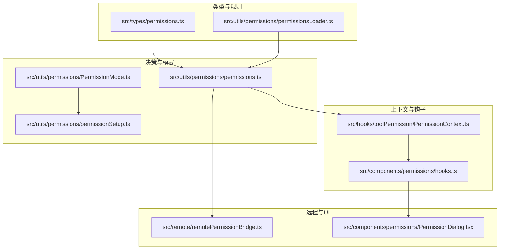
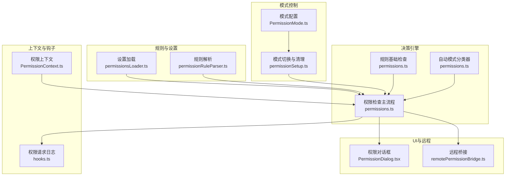
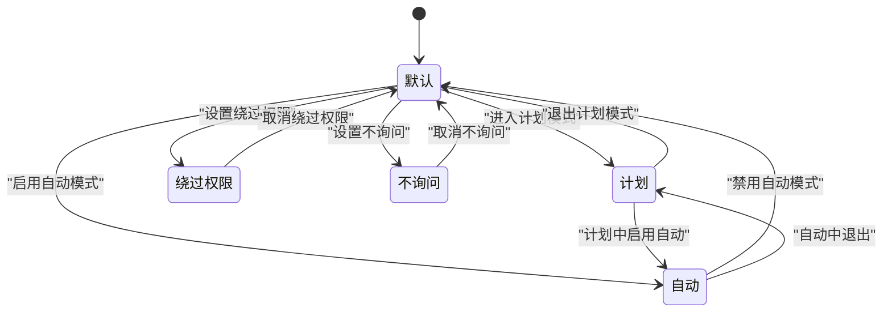
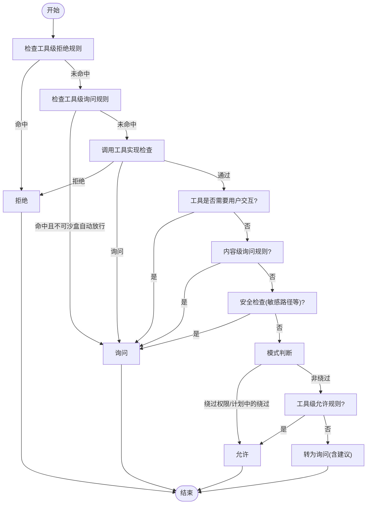
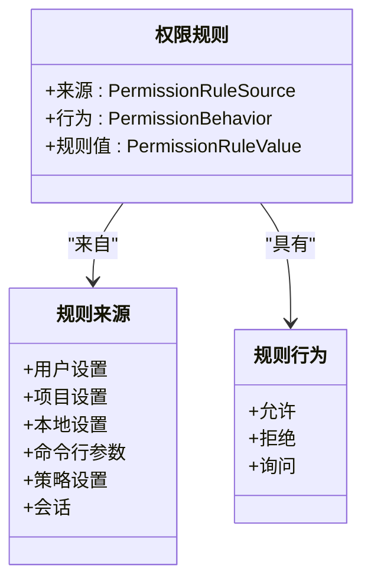
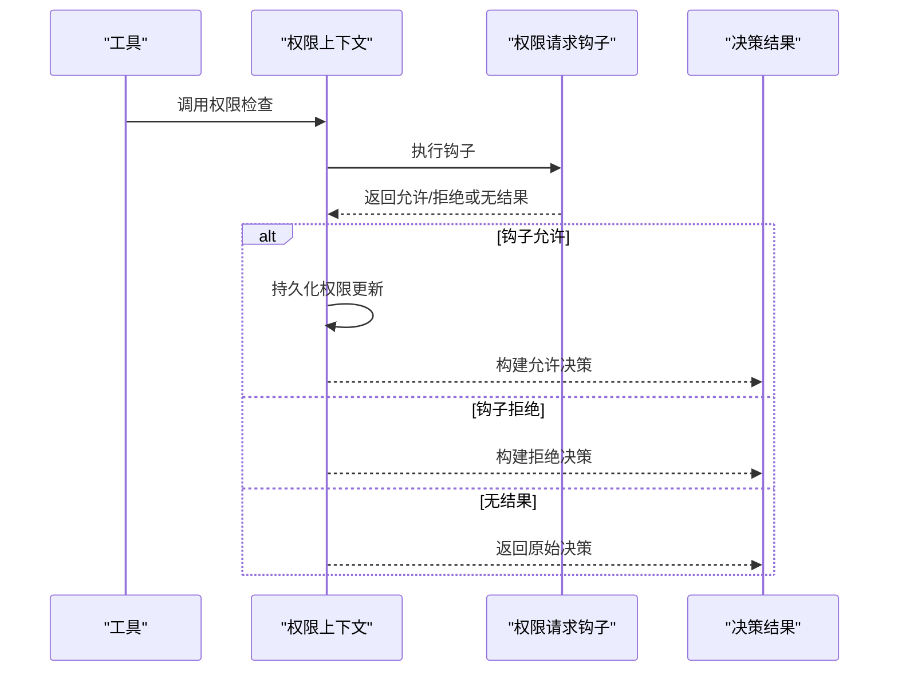
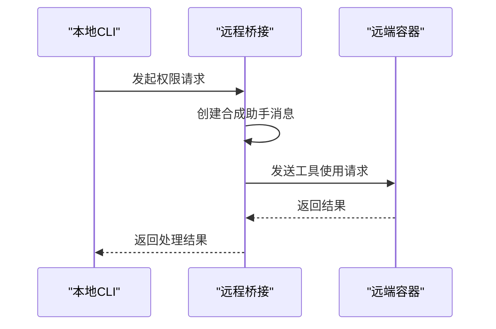
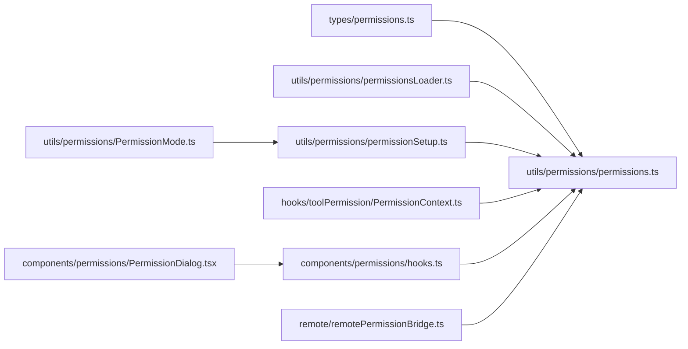

# 权限架构设计

<cite>
**本文档引用的文件**
- [src/types/permissions.ts](file://src/types/permissions.ts)
- [src/utils/permissions/permissions.ts](file://src/utils/permissions/permissions.ts)
- [src/utils/permissions/PermissionMode.ts](file://src/utils/permissions/PermissionMode.ts)
- [src/utils/permissions/permissionSetup.ts](file://src/utils/permissions/permissionSetup.ts)
- [src/utils/permissions/permissionsLoader.ts](file://src/utils/permissions/permissionsLoader.ts)
- [src/hooks/toolPermission/PermissionContext.ts](file://src/hooks/toolPermission/PermissionContext.ts)
- [src/components/permissions/hooks.ts](file://src/components/permissions/hooks.ts)
- [src/remote/remotePermissionBridge.ts](file://src/remote/remotePermissionBridge.ts)
- [src/components/permissions/PermissionDialog.tsx](file://src/components/permissions/PermissionDialog.tsx)
</cite>

## 目录
1. [引言](#引言)
2. [项目结构](#项目结构)
3. [核心组件](#核心组件)
4. [架构总览](#架构总览)
5. [详细组件分析](#详细组件分析)
6. [依赖关系分析](#依赖关系分析)
7. [性能考量](#性能考量)
8. [故障排除指南](#故障排除指南)
9. [结论](#结论)

## 引言
本文件面向Claude Code权限架构设计，系统性阐述权限模式分类（自动模式、交互模式、强制模式）、权限状态管理、权限决策流程，以及模式间转换机制与触发条件。文档同时总结整体设计原则与安全考虑，并给出组件关系图与数据流图，最后说明权限系统与其他模块的集成方式与接口规范。

## 项目结构
权限系统主要分布在以下目录与文件：
- 类型定义：src/types/permissions.ts
- 决策与规则引擎：src/utils/permissions/permissions.ts
- 模式管理：src/utils/permissions/PermissionMode.ts、src/utils/permissions/permissionSetup.ts
- 规则加载与持久化：src/utils/permissions/permissionsLoader.ts
- 上下文与钩子：src/hooks/toolPermission/PermissionContext.ts、src/components/permissions/hooks.ts
- 远程桥接：src/remote/remotePermissionBridge.ts
- UI对话框：src/components/permissions/PermissionDialog.tsx

**图表来源**
- [src/types/permissions.ts:1-442](file://src/types/permissions.ts#L1-L442)
- [src/utils/permissions/permissions.ts:1-1487](file://src/utils/permissions/permissions.ts#L1-L1487)
- [src/utils/permissions/PermissionMode.ts:1-142](file://src/utils/permissions/PermissionMode.ts#L1-L142)
- [src/utils/permissions/permissionSetup.ts:1-800](file://src/utils/permissions/permissionSetup.ts#L1-L800)
- [src/utils/permissions/permissionsLoader.ts:1-297](file://src/utils/permissions/permissionsLoader.ts#L1-L297)
- [src/hooks/toolPermission/PermissionContext.ts:1-389](file://src/hooks/toolPermission/PermissionContext.ts#L1-L389)
- [src/components/permissions/hooks.ts:1-210](file://src/components/permissions/hooks.ts#L1-L210)
- [src/remote/remotePermissionBridge.ts:1-79](file://src/remote/remotePermissionBridge.ts#L1-L79)
- [src/components/permissions/PermissionDialog.tsx:1-72](file://src/components/permissions/PermissionDialog.tsx#L1-L72)

**章节来源**
- [src/types/permissions.ts:1-442](file://src/types/permissions.ts#L1-L442)
- [src/utils/permissions/permissions.ts:1-1487](file://src/utils/permissions/permissions.ts#L1-L1487)
- [src/utils/permissions/PermissionMode.ts:1-142](file://src/utils/permissions/PermissionMode.ts#L1-L142)
- [src/utils/permissions/permissionSetup.ts:1-800](file://src/utils/permissions/permissionSetup.ts#L1-L800)
- [src/utils/permissions/permissionsLoader.ts:1-297](file://src/utils/permissions/permissionsLoader.ts#L1-L297)
- [src/hooks/toolPermission/PermissionContext.ts:1-389](file://src/hooks/toolPermission/PermissionContext.ts#L1-L389)
- [src/components/permissions/hooks.ts:1-210](file://src/components/permissions/hooks.ts#L1-L210)
- [src/remote/remotePermissionBridge.ts:1-79](file://src/remote/remotePermissionBridge.ts#L1-L79)
- [src/components/permissions/PermissionDialog.tsx:1-72](file://src/components/permissions/PermissionDialog.tsx#L1-L72)

## 核心组件
- 权限模式与行为
  - 外部权限模式集合：默认、计划、接受编辑、绕过权限、不询问
  - 内部权限模式集合：在外部模式基础上，按特性启用自动模式
  - 权限行为：允许、拒绝、询问
- 权限规则与来源
  - 规则值包含工具名与可选内容；规则来源包括用户设置、项目设置、本地设置、命令行参数、策略设置、会话等
  - 支持添加、替换、移除规则，以及工作目录扩展
- 决策结果与原因
  - 允许、询问、拒绝三种结果，附带决策原因（规则、模式、子命令结果、钩子、异步代理、沙箱覆盖、分类器、工作目录、安全检查等）
- 自动模式与分类器
  - 基于YOLO分类器的自动决策，支持快速路径（如接受编辑模式）与安全限制
  - 拒绝次数跟踪与上限回退到交互提示
- 远程桥接
  - 为远程环境生成合成消息与工具桩，确保权限请求在远端正确呈现与处理

**章节来源**
- [src/types/permissions.ts:16-39](file://src/types/permissions.ts#L16-L39)
- [src/types/permissions.ts:54-79](file://src/types/permissions.ts#L54-L79)
- [src/types/permissions.ts:88-146](file://src/types/permissions.ts#L88-L146)
- [src/types/permissions.ts:157-266](file://src/types/permissions.ts#L157-L266)
- [src/types/permissions.ts:271-324](file://src/types/permissions.ts#L271-L324)
- [src/types/permissions.ts:330-397](file://src/types/permissions.ts#L330-L397)
- [src/remote/remotePermissionBridge.ts:12-79](file://src/remote/remotePermissionBridge.ts#L12-L79)

## 架构总览
权限系统采用“规则驱动 + 模式控制 + 分类器辅助”的分层架构：
- 规则层：从多源设置加载规则，构建工具权限上下文
- 决策层：按步骤执行规则匹配、模式判断、工具实现检查、安全检查与自动模式分类器评估
- 控制层：模式切换（计划/自动/绕过/默认）与危险规则清理/恢复
- 钩子与日志层：权限请求钩子、决策日志与分析事件
- UI层：权限对话框与请求展示
- 远程层：远程桥接与工具桩

**图表来源**
- [src/utils/permissions/permissionsLoader.ts:120-133](file://src/utils/permissions/permissionsLoader.ts#L120-L133)
- [src/utils/permissions/permissions.ts:1071-1156](file://src/utils/permissions/permissions.ts#L1071-L1156)
- [src/utils/permissions/permissions.ts:1158-1319](file://src/utils/permissions/permissions.ts#L1158-L1319)
- [src/utils/permissions/permissions.ts:518-927](file://src/utils/permissions/permissions.ts#L518-L927)
- [src/utils/permissions/PermissionMode.ts:42-91](file://src/utils/permissions/PermissionMode.ts#L42-L91)
- [src/utils/permissions/permissionSetup.ts:597-646](file://src/utils/permissions/permissionSetup.ts#L597-L646)
- [src/hooks/toolPermission/PermissionContext.ts:96-348](file://src/hooks/toolPermission/PermissionContext.ts#L96-L348)
- [src/components/permissions/hooks.ts:101-210](file://src/components/permissions/hooks.ts#L101-L210)
- [src/components/permissions/PermissionDialog.tsx:1-72](file://src/components/permissions/PermissionDialog.tsx#L1-L72)
- [src/remote/remotePermissionBridge.ts:1-79](file://src/remote/remotePermissionBridge.ts#L1-L79)

## 详细组件分析

### 权限模式与状态管理
- 模式定义与映射
  - 默认、计划、接受编辑、绕过权限、不询问、自动模式（按特性启用）
  - 外部模式与内部模式区分，自动模式仅在特定用户类型可用
- 状态字段
  - 当前模式、额外工作目录、各类规则集合（允许/拒绝/询问）、是否可用绕过权限、是否避免权限提示、是否等待自动化检查等
- 模式转换
  - 计划进入：准备上下文、附加预计划信息
  - 自动进入：激活自动模式、剥离危险规则、记录预自动模式
  - 自动退出：禁用自动模式、需要退出附件、恢复危险规则并清理缓存

**图表来源**
- [src/utils/permissions/PermissionMode.ts:42-91](file://src/utils/permissions/PermissionMode.ts#L42-L91)
- [src/utils/permissions/permissionSetup.ts:597-646](file://src/utils/permissions/permissionSetup.ts#L597-L646)

**章节来源**
- [src/utils/permissions/PermissionMode.ts:1-142](file://src/utils/permissions/PermissionMode.ts#L1-L142)
- [src/utils/permissions/permissionSetup.ts:597-646](file://src/utils/permissions/permissionSetup.ts#L597-L646)
- [src/types/permissions.ts:427-441](file://src/types/permissions.ts#L427-L441)

### 权限决策流程
- 主流程（hasPermissionsToUseToolInner）
  - 步骤1：工具级拒绝规则 → 直接拒绝
  - 步骤1b：工具级询问规则 → 若非沙盒自动放行则询问
  - 步骤1c：调用工具实现检查（可能返回拒绝/询问/通过）
  - 步骤1e：若工具要求用户交互，则必须询问
  - 步骤1f：工具返回的内容级询问规则优先于绕过权限
  - 步骤1g：安全检查（敏感路径等）对绕过权限免疫
  - 步骤2a：模式判断（绕过权限/计划中的绕过）
  - 步骤2b：工具级允许规则
  - 步骤3：将“通过”转为“询问”，并生成建议
- 规则基础检查（checkRuleBasedPermissions）
  - 仅执行规则相关步骤，不运行自动模式分类器、模式转换与钩子
- 自动模式决策
  - 快速路径：接受编辑模式或安全工具白名单
  - 分类器：YOLO分类器评估，失败时按门控策略（失败关闭/打开）
  - 拒绝次数跟踪：超过阈值回退到交互提示

**图表来源**
- [src/utils/permissions/permissions.ts:1158-1319](file://src/utils/permissions/permissions.ts#L1158-L1319)
- [src/utils/permissions/permissions.ts:1071-1156](file://src/utils/permissions/permissions.ts#L1071-L1156)
- [src/utils/permissions/permissions.ts:518-927](file://src/utils/permissions/permissions.ts#L518-L927)

**章节来源**
- [src/utils/permissions/permissions.ts:1158-1319](file://src/utils/permissions/permissions.ts#L1158-L1319)
- [src/utils/permissions/permissions.ts:1071-1156](file://src/utils/permissions/permissions.ts#L1071-L1156)
- [src/utils/permissions/permissions.ts:518-927](file://src/utils/permissions/permissions.ts#L518-L927)

### 权限规则与来源
- 规则来源与持久化
  - 用户设置、项目设置、本地设置、命令行参数、策略设置、会话等
  - 支持添加、替换、移除规则；工作目录扩展
- 规则加载与同步
  - 加载所有规则，支持仅使用受管规则（策略设置）
  - 同步磁盘规则时先清空对应源的行为组合，再批量替换
- 危险规则检测与处理
  - Bash/PowerShell/Agent等危险规则识别
  - 自动模式进入时剥离危险规则，退出时恢复

**图表来源**
- [src/types/permissions.ts:54-79](file://src/types/permissions.ts#L54-L79)
- [src/utils/permissions/permissionsLoader.ts:120-133](file://src/utils/permissions/permissionsLoader.ts#L120-L133)
- [src/utils/permissions/permissionSetup.ts:472-503](file://src/utils/permissions/permissionSetup.ts#L472-L503)

**章节来源**
- [src/utils/permissions/permissionsLoader.ts:1-297](file://src/utils/permissions/permissionsLoader.ts#L1-L297)
- [src/utils/permissions/permissionSetup.ts:472-503](file://src/utils/permissions/permissionSetup.ts#L472-L503)
- [src/types/permissions.ts:54-79](file://src/types/permissions.ts#L54-L79)

### 权限上下文与钩子
- 权限上下文
  - 封装工具、输入、消息、工具使用ID、权限决策日志、持久化更新、分类器尝试、钩子执行、队列操作等
  - 提供构建允许/拒绝决策、持久化权限更新、取消与中断等能力
- 权限请求钩子
  - 在无UI场景（后台/异步代理）中提前允许/拒绝，避免自动拒绝
  - 支持永久/临时更新与中断信号

**图表来源**
- [src/hooks/toolPermission/PermissionContext.ts:216-263](file://src/hooks/toolPermission/PermissionContext.ts#L216-L263)
- [src/utils/permissions/permissions.ts:400-471](file://src/utils/permissions/permissions.ts#L400-L471)

**章节来源**
- [src/hooks/toolPermission/PermissionContext.ts:1-389](file://src/hooks/toolPermission/PermissionContext.ts#L1-L389)
- [src/utils/permissions/permissions.ts:400-471](file://src/utils/permissions/permissions.ts#L400-L471)

### 远程桥接与UI集成
- 远程桥接
  - 为远程权限请求创建合成助手消息，适配远端容器中的工具使用
  - 为本地未知工具创建工具桩，路由到通用权限请求处理
- UI对话框
  - 权限对话框组件封装标题、副标题、颜色与内边距，用于展示权限请求与说明

**图表来源**
- [src/remote/remotePermissionBridge.ts:12-79](file://src/remote/remotePermissionBridge.ts#L12-L79)

**章节来源**
- [src/remote/remotePermissionBridge.ts:1-79](file://src/remote/remotePermissionBridge.ts#L1-L79)
- [src/components/permissions/PermissionDialog.tsx:1-72](file://src/components/permissions/PermissionDialog.tsx#L1-L72)

## 依赖关系分析
- 类型与规则
  - src/types/permissions.ts 提供纯类型与常量，避免循环依赖
  - permissions.ts 依赖类型定义与规则解析器
- 决策与模式
  - permissions.ts 依赖 PermissionMode.ts 与 permissionSetup.ts 的模式配置与切换逻辑
- 上下文与钩子
  - PermissionContext.ts 依赖工具实现、消息类型、权限更新与日志
- 远程与UI
  - remotePermissionBridge.ts 与 UI组件独立存在，通过消息与工具桩对接

**图表来源**
- [src/types/permissions.ts:1-442](file://src/types/permissions.ts#L1-L442)
- [src/utils/permissions/permissions.ts:1-1487](file://src/utils/permissions/permissions.ts#L1-L1487)
- [src/utils/permissions/PermissionMode.ts:1-142](file://src/utils/permissions/PermissionMode.ts#L1-L142)
- [src/utils/permissions/permissionSetup.ts:1-800](file://src/utils/permissions/permissionSetup.ts#L1-L800)
- [src/utils/permissions/permissionsLoader.ts:1-297](file://src/utils/permissions/permissionsLoader.ts#L1-L297)
- [src/hooks/toolPermission/PermissionContext.ts:1-389](file://src/hooks/toolPermission/PermissionContext.ts#L1-L389)
- [src/components/permissions/hooks.ts:1-210](file://src/components/permissions/hooks.ts#L1-L210)
- [src/remote/remotePermissionBridge.ts:1-79](file://src/remote/remotePermissionBridge.ts#L1-L79)
- [src/components/permissions/PermissionDialog.tsx:1-72](file://src/components/permissions/PermissionDialog.tsx#L1-L72)

**章节来源**
- [src/types/permissions.ts:1-442](file://src/types/permissions.ts#L1-L442)
- [src/utils/permissions/permissions.ts:1-1487](file://src/utils/permissions/permissions.ts#L1-L1487)
- [src/utils/permissions/PermissionMode.ts:1-142](file://src/utils/permissions/PermissionMode.ts#L1-L142)
- [src/utils/permissions/permissionSetup.ts:1-800](file://src/utils/permissions/permissionSetup.ts#L1-L800)
- [src/utils/permissions/permissionsLoader.ts:1-297](file://src/utils/permissions/permissionsLoader.ts#L1-L297)
- [src/hooks/toolPermission/PermissionContext.ts:1-389](file://src/hooks/toolPermission/PermissionContext.ts#L1-L389)
- [src/components/permissions/hooks.ts:1-210](file://src/components/permissions/hooks.ts#L1-L210)
- [src/remote/remotePermissionBridge.ts:1-79](file://src/remote/remotePermissionBridge.ts#L1-L79)
- [src/components/permissions/PermissionDialog.tsx:1-72](file://src/components/permissions/PermissionDialog.tsx#L1-L72)

## 性能考量
- 分类器成本与缓存
  - 自动模式分类器调用会产生Token用量与延迟开销，系统记录阶段1/阶段2用量与耗时，便于分析与优化
- 拒绝次数限制
  - 连续/累计拒绝计数达到阈值后回退到交互提示，避免无限自动拒绝导致的资源浪费
- 快速路径
  - 接受编辑模式与安全工具白名单可跳过昂贵的分类器调用
- 沙盒自动放行
  - 在满足条件时，沙盒化的Bash命令可直接放行，减少权限提示

[本节为通用指导，无需具体文件分析]

## 故障排除指南
- 自动模式不可用
  - 检查门控状态与电路断路器；若被禁用，系统会抛出错误或回退到默认模式
- 分类器不可用
  - 根据门控策略选择失败关闭（拒绝并提示重试）或失败打开（回退到正常权限处理）
- 拒绝次数过多
  - 系统会记录并发出警告，必要时抛出中止错误以保护资源
- 规则冲突
  - 使用规则基础检查定位冲突来源；确认来源优先级与行为一致性

**章节来源**
- [src/utils/permissions/permissionSetup.ts:728-739](file://src/utils/permissions/permissionSetup.ts#L728-L739)
- [src/utils/permissions/permissions.ts:843-876](file://src/utils/permissions/permissions.ts#L843-L876)
- [src/utils/permissions/permissions.ts:984-1058](file://src/utils/permissions/permissions.ts#L984-L1058)

## 结论
Claude Code权限架构通过“规则 + 模式 + 分类器”的分层设计，在保证安全性的同时提供了灵活的用户体验。自动模式在严格的安全约束下实现智能化决策，模式切换与危险规则处理确保了可控性与可审计性。通过完善的日志与分析事件，系统能够持续优化决策质量与性能表现。