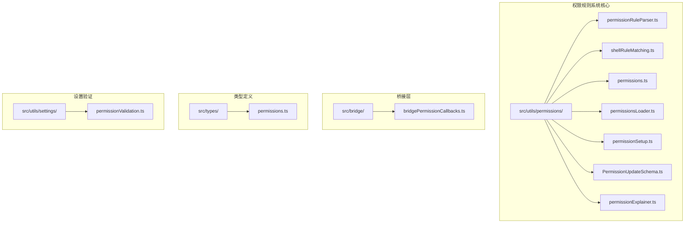
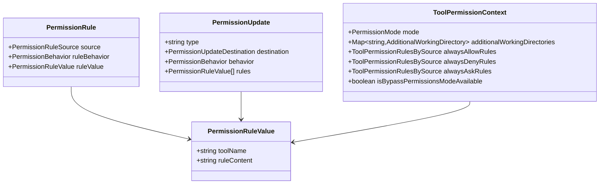
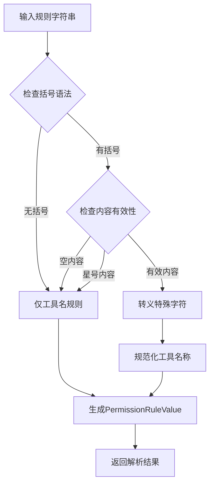
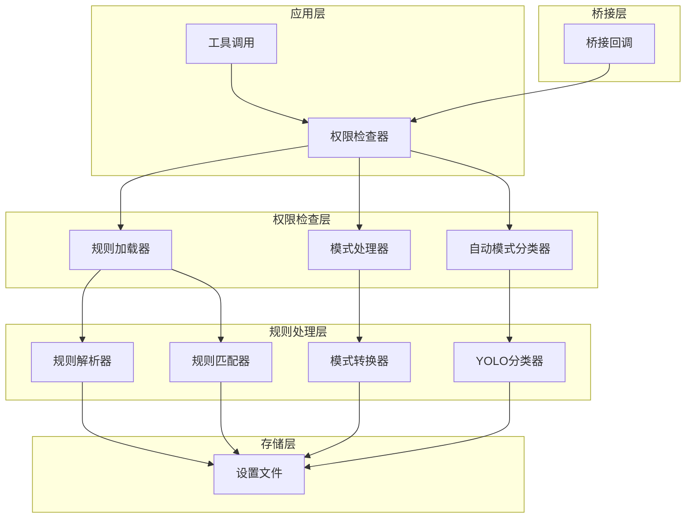
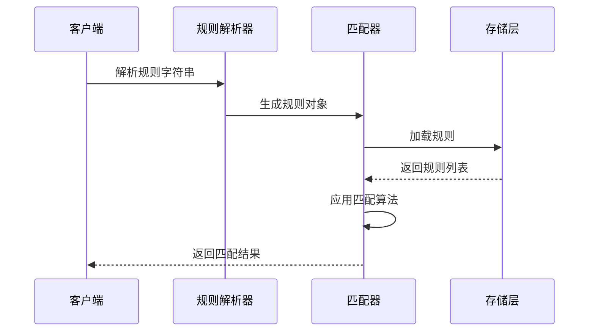
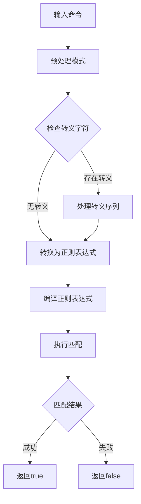
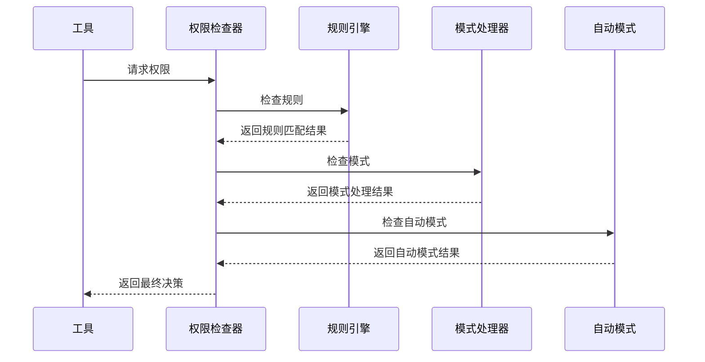
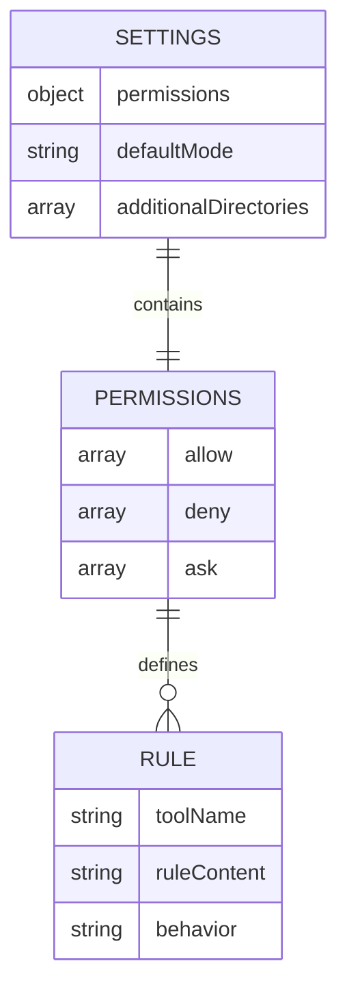
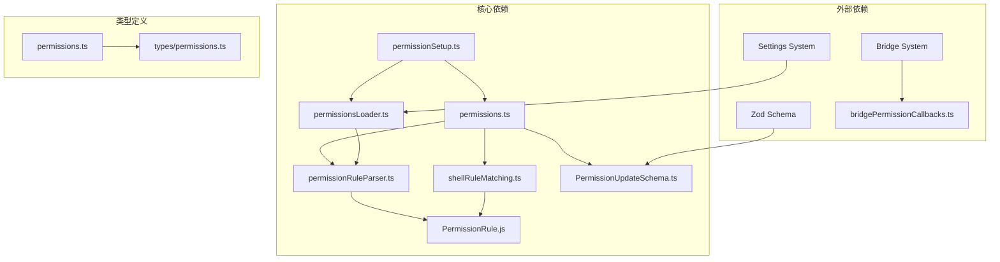

# 权限规则系统

<cite>
**本文档引用的文件**
- [src/utils/permissions/permissionRuleParser.ts](file://src/utils/permissions/permissionRuleParser.ts)
- [src/utils/permissions/shellRuleMatching.ts](file://src/utils/permissions/shellRuleMatching.ts)
- [src/utils/permissions/permissions.ts](file://src/utils/permissions/permissions.ts)
- [src/utils/permissions/permissionsLoader.ts](file://src/utils/permissions/permissionsLoader.ts)
- [src/utils/permissions/permissionSetup.ts](file://src/utils/permissions/permissionSetup.ts)
- [src/utils/permissions/PermissionUpdateSchema.ts](file://src/utils/permissions/PermissionUpdateSchema.ts)
- [src/utils/permissions/permissionExplainer.ts](file://src/utils/permissions/permissionExplainer.ts)
- [src/bridge/bridgePermissionCallbacks.ts](file://src/bridge/bridgePermissionCallbacks.ts)
- [src/types/permissions.ts](file://src/types/permissions.ts)
- [src/utils/settings/permissionValidation.ts](file://src/utils/settings/permissionValidation.ts)
</cite>

## 目录
1. [简介](#简介)
2. [项目结构](#项目结构)
3. [核心组件](#核心组件)
4. [架构概览](#架构概览)
5. [详细组件分析](#详细组件分析)
6. [依赖关系分析](#依赖关系分析)
7. [性能考虑](#性能考虑)
8. [故障排除指南](#故障排除指南)
9. [结论](#结论)

## 简介

Claude Code权限规则系统是一个复杂而精细的安全框架，旨在为AI代理在开发环境中的工具使用提供细粒度的权限控制。该系统通过多层次的规则匹配、智能的自动模式分类器和灵活的配置管理，实现了从基础的工具级权限到复杂的命令级规则的全方位保护。

系统的核心特点包括：
- **多层级权限控制**：支持工具级、内容级和模式级的权限控制
- **智能规则解析**：支持精确匹配、前缀匹配和通配符匹配
- **自动模式安全**：通过YOLO分类器确保在自动化模式下的安全性
- **灵活的配置管理**：支持多种来源的权限规则持久化
- **实时权限检查**：在工具执行前进行即时权限验证

## 项目结构

权限规则系统主要分布在以下目录中：

**图表来源**
- [src/utils/permissions/](file://src/utils/permissions/)
- [src/bridge/bridgePermissionCallbacks.ts](file://src/bridge/bridgePermissionCallbacks.ts)
- [src/types/permissions.ts](file://src/types/permissions.ts)

**章节来源**
- [src/utils/permissions/](file://src/utils/permissions/)
- [src/bridge/bridgePermissionCallbacks.ts](file://src/bridge/bridgePermissionCallbacks.ts)

## 核心组件

### 权限规则数据结构

系统定义了完整的权限规则数据结构体系：

**图表来源**
- [src/types/permissions.ts](file://src/types/permissions.ts)
- [src/utils/permissions/PermissionUpdateSchema.ts](file://src/utils/permissions/PermissionUpdateSchema.ts)

### 规则解析器

规则解析器负责将字符串形式的权限规则转换为可执行的数据结构：

**图表来源**
- [src/utils/permissions/permissionRuleParser.ts](file://src/utils/permissions/permissionRuleParser.ts)

**章节来源**
- [src/utils/permissions/permissionRuleParser.ts](file://src/utils/permissions/permissionRuleParser.ts)
- [src/types/permissions.ts](file://src/types/permissions.ts)

## 架构概览

权限规则系统采用分层架构设计，确保了模块间的清晰分离和高度内聚：

**图表来源**
- [src/utils/permissions/permissions.ts](file://src/utils/permissions/permissions.ts)
- [src/utils/permissions/permissionsLoader.ts](file://src/utils/permissions/permissionsLoader.ts)
- [src/bridge/bridgePermissionCallbacks.ts](file://src/bridge/bridgePermissionCallbacks.ts)

## 详细组件分析

### 规则匹配算法

系统实现了三种主要的规则匹配模式：

#### 1. 精确匹配（Exact Match）
精确匹配用于完全相同的命令或工具名称匹配，是最严格的匹配方式。

#### 2. 前缀匹配（Prefix Match）
前缀匹配支持以特定前缀开头的所有命令，如 `npm:*` 表示所有 npm 相关命令。

#### 3. 通配符匹配（Wildcard Match）
通配符匹配支持使用 `*` 进行灵活的模式匹配，具有强大的表达能力。

**图表来源**
- [src/utils/permissions/shellRuleMatching.ts](file://src/utils/permissions/shellRuleMatching.ts)
- [src/utils/permissions/permissions.ts](file://src/utils/permissions/permissions.ts)

#### 通配符匹配算法详解

通配符匹配算法支持复杂的模式匹配需求：

**图表来源**
- [src/utils/permissions/shellRuleMatching.ts](file://src/utils/permissions/shellRuleMatching.ts)

**章节来源**
- [src/utils/permissions/shellRuleMatching.ts](file://src/utils/permissions/shellRuleMatching.ts)

### 权限决策流程

权限决策流程是整个系统的核心逻辑：

**图表来源**
- [src/utils/permissions/permissions.ts](file://src/utils/permissions/permissions.ts)

### 冲突解决机制

系统实现了多层次的冲突解决策略：

1. **规则优先级**：拒绝规则 > 提示规则 > 允许规则
2. **来源优先级**：用户设置 > 项目设置 > 本地设置 > CLI参数
3. **模式覆盖**：特定模式可以覆盖某些规则

**章节来源**
- [src/utils/permissions/permissions.ts](file://src/utils/permissions/permissions.ts)

### 存储格式和序列化

权限规则采用JSON格式进行存储，支持多种来源的配置：

**图表来源**
- [src/utils/permissions/permissionsLoader.ts](file://src/utils/permissions/permissionsLoader.ts)

**章节来源**
- [src/utils/permissions/permissionsLoader.ts](file://src/utils/permissions/permissionsLoader.ts)
- [src/utils/permissions/PermissionUpdateSchema.ts](file://src/utils/permissions/PermissionUpdateSchema.ts)

## 依赖关系分析

权限规则系统展现了良好的模块化设计，各组件间依赖关系清晰：

**图表来源**
- [src/utils/permissions/](file://src/utils/permissions/)

**章节来源**
- [src/utils/permissions/](file://src/utils/permissions/)

## 性能考虑

系统在设计时充分考虑了性能优化：

### 编译时优化
- 正则表达式在模块级别编译，避免重复编译开销
- 转义占位符使用null字节，提高匹配效率

### 内存优化
- 使用Map和Set进行规则索引，提高查找性能
- 懒加载模式减少不必要的初始化开销

### 缓存策略
- 设置源缓存避免重复读取
- 规则解析结果缓存

## 故障排除指南

### 常见问题诊断

#### 规则解析错误
当遇到规则解析错误时，检查以下要点：
1. 括号是否正确匹配
2. 特殊字符是否正确转义
3. 工具名称是否为合法标识符

#### 权限检查失败
权限检查失败的常见原因：
1. 规则优先级冲突
2. 模式设置不兼容
3. 自动模式分类器异常

#### 配置加载问题
配置加载失败的排查步骤：
1. 检查设置文件格式
2. 验证JSON语法
3. 确认文件权限

**章节来源**
- [src/utils/settings/permissionValidation.ts](file://src/utils/settings/permissionValidation.ts)
- [src/utils/permissions/permissions.ts](file://src/utils/permissions/permissions.ts)

### 调试方法

系统提供了多种调试和验证方法：

#### 规则验证
使用验证函数检查规则格式的有效性：
- 检查括号匹配
- 验证特殊字符转义
- 确认工具名称合法性

#### 权限解释器
权限解释器提供详细的权限决策说明：
- 风险等级评估
- 决策理由分析
- 安全建议提供

#### 桥接回调调试
桥接回调系统支持远程权限控制：
- 实时权限请求
- 动态权限响应
- 错误处理机制

**章节来源**
- [src/utils/permissions/permissionExplainer.ts](file://src/utils/permissions/permissionExplainer.ts)
- [src/bridge/bridgePermissionCallbacks.ts](file://src/bridge/bridgePermissionCallbacks.ts)

## 结论

Claude Code权限规则系统通过精心设计的架构和算法，为AI代理在开发环境中的安全使用提供了全面的保障。系统的主要优势包括：

1. **灵活性**：支持多种匹配模式和配置来源
2. **安全性**：通过多层次的权限控制和自动模式分类器确保安全
3. **可扩展性**：模块化设计便于功能扩展和维护
4. **易用性**：提供丰富的调试和验证工具

该系统为现代AI代理的安全使用提供了最佳实践范例，其设计理念和实现方式值得其他类似系统借鉴和学习。