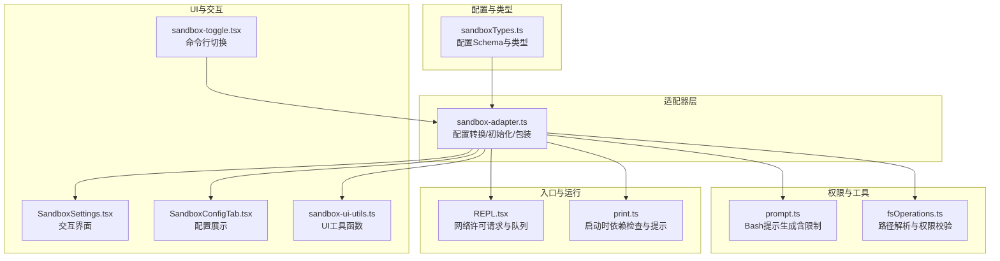
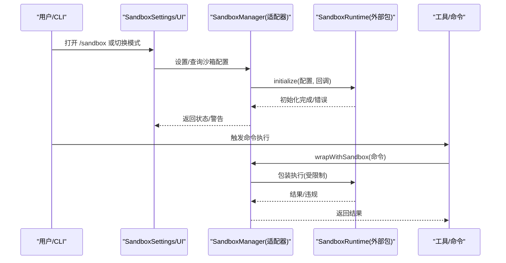
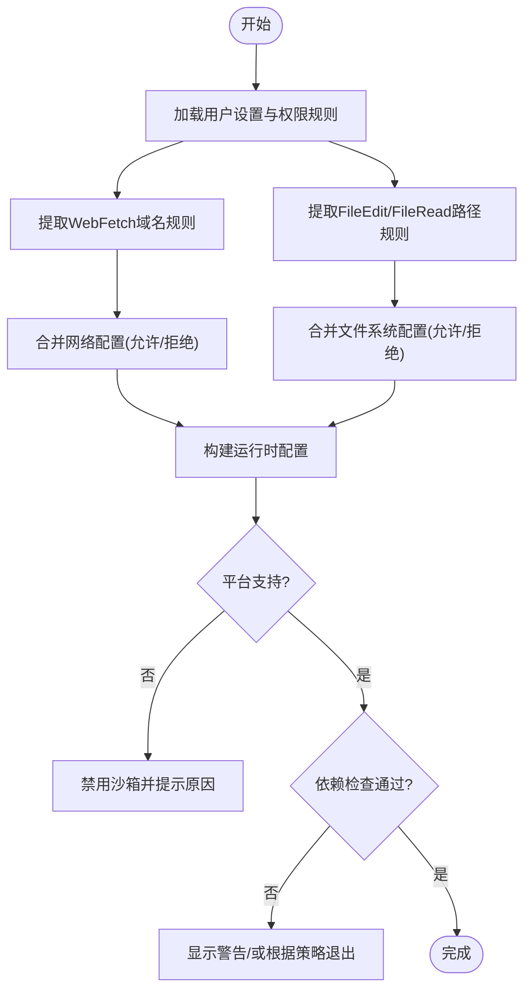
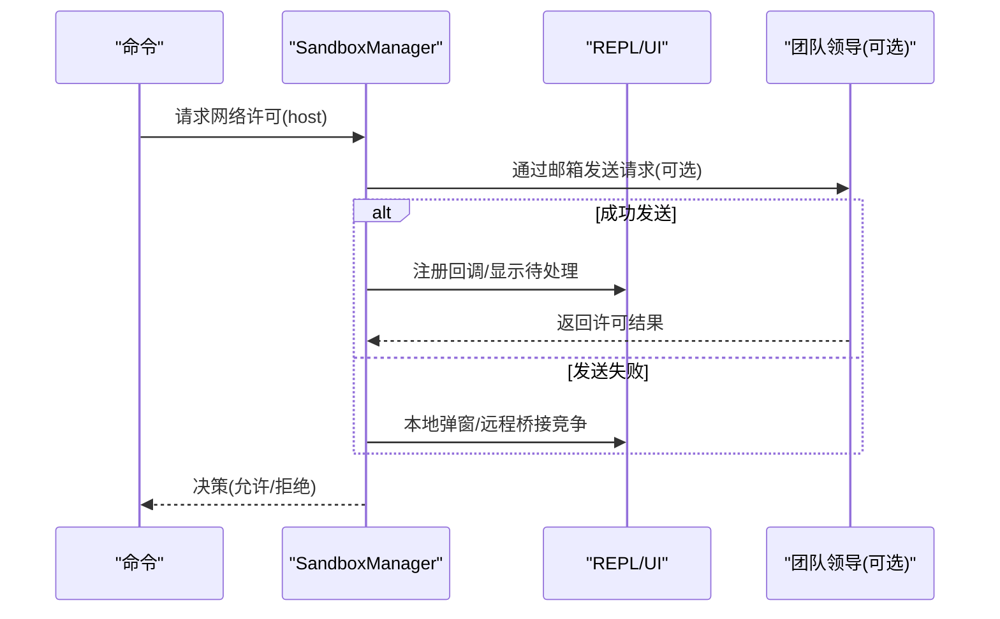
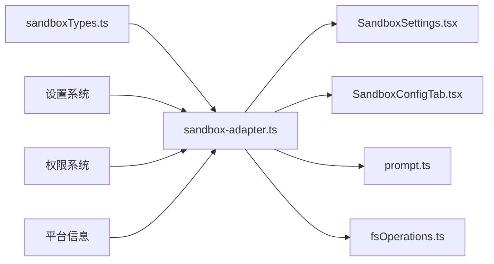

# 沙箱隔离机制

<cite>
**本文档引用的文件**
- [sandbox-adapter.ts](file://src/utils/sandbox/sandbox-adapter.ts)
- [sandboxTypes.ts](file://src/entrypoints/sandboxTypes.ts)
- [sandbox-ui-utils.ts](file://src/utils/sandbox/sandbox-ui-utils.ts)
- [SandboxSettings.tsx](file://src/components/sandbox/SandboxSettings.tsx)
- [SandboxConfigTab.tsx](file://src/components/sandbox/SandboxConfigTab.tsx)
- [sandbox-toggle.tsx](file://src/commands/sandbox-toggle/sandbox-toggle.tsx)
- [REPL.tsx](file://src/screens/REPL.tsx)
- [prompt.ts](file://src/tools/BashTool/prompt.ts)
- [fsOperations.ts](file://src/utils/fsOperations.ts)
- [print.ts](file://src/cli/print.ts)
</cite>

## 目录
1. [简介](#简介)
2. [项目结构](#项目结构)
3. [核心组件](#核心组件)
4. [架构总览](#架构总览)
5. [详细组件分析](#详细组件分析)
6. [依赖关系分析](#依赖关系分析)
7. [性能考虑](#性能考虑)
8. [故障排查指南](#故障排查指南)
9. [结论](#结论)

## 简介
本文件系统性阐述 Claude Code 的沙箱隔离机制，覆盖文件系统隔离、网络访问限制、进程执行控制、配置选项与安全边界、权限系统协作、数据交换、性能开销与优化、故障排查与安全审计、以及绕过检测与异常处理。内容基于仓库中的实际实现进行提炼，并通过图表与流程帮助读者理解从配置到执行的完整链路。

## 项目结构
围绕沙箱的关键代码分布在以下模块：
- 配置与类型：定义沙箱网络与文件系统配置的 Schema，以及对外暴露的类型接口
- 适配器层：将配置转换为运行时参数，负责初始化、依赖检查、平台支持判断、命令包装
- UI 展示：在终端 UI 中展示沙箱状态、配置与违规信息
- 权限集成：与工具权限规则联动，生成最终的沙箱约束
- 命令行入口：提供 /sandbox 相关交互与切换能力

**图表来源**
- [sandboxTypes.ts:11-144](file://src/entrypoints/sandboxTypes.ts#L11-L144)
- [sandbox-adapter.ts:168-381](file://src/utils/sandbox/sandbox-adapter.ts#L168-L381)
- [SandboxSettings.tsx:22-221](file://src/components/sandbox/SandboxSettings.tsx#L22-L221)
- [SandboxConfigTab.tsx:5-45](file://src/components/sandbox/SandboxConfigTab.tsx#L5-L45)
- [sandbox-ui-utils.ts:1-13](file://src/utils/sandbox/sandbox-ui-utils.ts#L1-L13)
- [sandbox-toggle.tsx:10-83](file://src/commands/sandbox-toggle/sandbox-toggle.tsx#L10-L83)
- [prompt.ts:185-226](file://src/tools/BashTool/prompt.ts#L185-L226)
- [fsOperations.ts:125-308](file://src/utils/fsOperations.ts#L125-L308)
- [REPL.tsx:2221-2265](file://src/screens/REPL.tsx#L2221-L2265)
- [print.ts:598-626](file://src/cli/print.ts#L598-L626)

**章节来源**
- [sandbox-adapter.ts:168-381](file://src/utils/sandbox/sandbox-adapter.ts#L168-L381)
- [sandboxTypes.ts:11-144](file://src/entrypoints/sandboxTypes.ts#L11-L144)

## 核心组件
- 配置转换器：将用户设置与权限规则转换为沙箱运行时配置，涵盖网络域白名单/黑名单、文件系统读写路径、忽略违规、代理端口、弱化隔离等
- 初始化与依赖检查：在满足平台支持与依赖齐全的前提下初始化沙箱；若用户强制要求启用且不可用，会给出明确原因并可选择退出
- 命令包装：对 Bash 等命令执行进行包装，确保在沙箱内执行或按策略回退
- UI 与交互：提供 /sandbox 菜单、配置查看、排除命令等功能
- 权限联动：将工具权限规则（如 WebFetch、FileEdit、FileRead）映射为沙箱的网络与文件系统限制
- 违规记录与清理：记录违规事件并在必要时清理潜在的裸仓库文件以防止逃逸

**章节来源**
- [sandbox-adapter.ts:532-592](file://src/utils/sandbox/sandbox-adapter.ts#L532-L592)
- [sandbox-adapter.ts:704-725](file://src/utils/sandbox/sandbox-adapter.ts#L704-L725)
- [sandbox-adapter.ts:730-792](file://src/utils/sandbox/sandbox-adapter.ts#L730-L792)
- [sandbox-adapter.ts:404-414](file://src/utils/sandbox/sandbox-adapter.ts#L404-L414)
- [SandboxSettings.tsx:22-221](file://src/components/sandbox/SandboxSettings.tsx#L22-L221)
- [SandboxConfigTab.tsx:5-45](file://src/components/sandbox/SandboxConfigTab.tsx#L5-L45)
- [sandbox-ui-utils.ts:1-13](file://src/utils/sandbox/sandbox-ui-utils.ts#L1-L13)

## 架构总览
沙箱架构由“配置层 → 适配器层 → 运行时层”构成。配置层来自用户设置与权限规则；适配器层负责转换、初始化、依赖检查与命令包装；运行时层由外部包提供，适配器层将其桥接为本地能力。

**图表来源**
- [SandboxSettings.tsx:110-140](file://src/components/sandbox/SandboxSettings.tsx#L110-L140)
- [sandbox-adapter.ts:730-792](file://src/utils/sandbox/sandbox-adapter.ts#L730-L792)
- [sandbox-adapter.ts:704-725](file://src/utils/sandbox/sandbox-adapter.ts#L704-L725)

## 详细组件分析

### 配置与类型系统
- 网络配置：允许域、仅允许托管域、Unix Socket 白名单、本地绑定、HTTP/SOCKS 代理端口
- 文件系统配置：允许/拒绝读写路径、在拒绝区域内重新允许、仅允许托管读路径
- 其他：忽略违规、弱化嵌套沙箱、弱化网络隔离、排除命令、ripgrep 配置

这些配置通过 Schema 校验，保证类型安全与一致性。

**章节来源**
- [sandboxTypes.ts:14-42](file://src/entrypoints/sandboxTypes.ts#L14-L42)
- [sandboxTypes.ts:47-86](file://src/entrypoints/sandboxTypes.ts#L47-L86)
- [sandboxTypes.ts:91-144](file://src/entrypoints/sandboxTypes.ts#L91-L144)

### 配置转换与平台支持
- 平台支持：macOS、Linux、WSL2；WSL1 不支持
- 依赖检查：对 ripgrep 等工具进行可用性检查，返回错误与警告
- 配置转换：将权限规则与用户设置合并为运行时配置，包括：
  - 网络：WebFetch 规则提取域名，支持仅托管域模式
  - 文件系统：编辑/读取规则映射为允许/拒绝路径，额外加入当前目录与临时目录，阻止写入设置文件与技能目录，阻断裸 Git 仓库逃逸风险
  - 其他：代理端口、忽略违规、弱化隔离、ripgrep 参数

**图表来源**
- [sandbox-adapter.ts:172-381](file://src/utils/sandbox/sandbox-adapter.ts#L172-L381)
- [sandbox-adapter.ts:532-592](file://src/utils/sandbox/sandbox-adapter.ts#L532-L592)

**章节来源**
- [sandbox-adapter.ts:172-381](file://src/utils/sandbox/sandbox-adapter.ts#L172-L381)
- [sandbox-adapter.ts:532-592](file://src/utils/sandbox/sandbox-adapter.ts#L532-L592)

### 初始化与依赖检查
- 初始化：在满足平台与依赖前提下，使用转换后的配置初始化运行时；订阅设置变更以动态更新配置
- 失败处理：初始化失败会清理初始化 Promise 以便重试，并记录日志
- 启动提示：当用户显式开启但不可用时，输出人类可读原因；若强制要求启用则直接退出

**章节来源**
- [sandbox-adapter.ts:730-792](file://src/utils/sandbox/sandbox-adapter.ts#L730-L792)
- [print.ts:598-626](file://src/cli/print.ts#L598-L626)
- [REPL.tsx:2312-2341](file://src/screens/REPL.tsx#L2312-L2341)

### 命令包装与执行控制
- wrapWithSandbox：在沙箱中执行命令；若沙箱未初始化则抛错
- 自动放行 Bash：在启用沙箱时可自动尝试在沙箱内运行 Bash，否则退回常规权限
- 排除命令：支持将特定命令模式加入排除列表，绕过沙箱限制

**章节来源**
- [sandbox-adapter.ts:704-725](file://src/utils/sandbox/sandbox-adapter.ts#L704-L725)
- [sandbox-toggle.tsx:51-78](file://src/commands/sandbox-toggle/sandbox-toggle.tsx#L51-L78)

### 网络许可请求与权限系统协作
- REPL 中的网络许可：当命令发起网络请求时，触发许可请求；支持通过邮箱通信或本地 UI，同时维护待处理队列与状态
- 策略增强：当启用“仅托管域”策略时，所有非托管域请求会被直接拒绝

**图表来源**
- [REPL.tsx:2221-2265](file://src/screens/REPL.tsx#L2221-L2265)
- [sandbox-adapter.ts:746-755](file://src/utils/sandbox/sandbox-adapter.ts#L746-L755)

**章节来源**
- [REPL.tsx:2221-2265](file://src/screens/REPL.tsx#L2221-L2265)
- [sandbox-adapter.ts:746-755](file://src/utils/sandbox/sandbox-adapter.ts#L746-L755)

### 文件系统隔离与路径解析
- 路径解析：统一处理 ~、相对路径、UNC 路径等，避免在 Windows 上触发网络请求
- 权限链：对符号链接链进行多级路径检查，确保拒绝规则对最终目标同样生效
- 安全边界：禁止写入设置文件与技能目录；对裸 Git 仓库文件进行预清理或在命令后清理，防止逃逸

**章节来源**
- [fsOperations.ts:125-308](file://src/utils/fsOperations.ts#L125-L308)
- [sandbox-adapter.ts:223-288](file://src/utils/sandbox/sandbox-adapter.ts#L223-L288)
- [sandbox-adapter.ts:404-414](file://src/utils/sandbox/sandbox-adapter.ts#L404-L414)

### UI 展示与违规处理
- 配置展示：在 UI 中展示当前启用的网络/文件系统限制、排除命令、Linux 下的通配符警告等
- 违规标签清理：移除错误消息中的沙箱违规标记，便于用户阅读
- 违规统计：在非 Linux 平台显示累计违规数量与最近操作

**章节来源**
- [SandboxConfigTab.tsx:5-45](file://src/components/sandbox/SandboxConfigTab.tsx#L5-L45)
- [sandbox-ui-utils.ts:1-13](file://src/utils/sandbox/sandbox-ui-utils.ts#L1-L13)
- [REPL.tsx:50-98](file://src/screens/REPL.tsx#L50-L98)

## 依赖关系分析
- 类型与配置：sandboxTypes.ts 提供配置 Schema，被适配器层消费
- 适配器层：依赖设置系统、权限系统、平台信息、日志与错误处理
- UI 层：依赖适配器层提供的状态与配置查询
- 工具层：Bash 提示生成会读取当前沙箱限制，用于向用户展示

**图表来源**
- [sandboxTypes.ts:11-144](file://src/entrypoints/sandboxTypes.ts#L11-L144)
- [sandbox-adapter.ts:168-381](file://src/utils/sandbox/sandbox-adapter.ts#L168-L381)
- [SandboxSettings.tsx:22-221](file://src/components/sandbox/SandboxSettings.tsx#L22-L221)
- [SandboxConfigTab.tsx:5-45](file://src/components/sandbox/SandboxConfigTab.tsx#L5-L45)
- [prompt.ts:185-226](file://src/tools/BashTool/prompt.ts#L185-L226)
- [fsOperations.ts:125-308](file://src/utils/fsOperations.ts#L125-L308)

**章节来源**
- [sandbox-adapter.ts:168-381](file://src/utils/sandbox/sandbox-adapter.ts#L168-L381)

## 性能考虑
- 初始化延迟：依赖检查与配置转换可能带来一次性开销；通过缓存与懒加载减少重复计算
- 日志监控：在 macOS 默认启用日志监控，有助于诊断但会引入少量开销
- Linux 通配符限制：在 Linux/WSL 上不支持复杂通配符，可能导致规则降级，影响匹配效率
- 建议：
  - 在 CI 或批量任务中提前进行依赖检查与初始化
  - 合理设置排除命令，减少不必要的许可请求
  - 使用“仅托管域”策略降低网络许可请求频率

[本节为通用指导，无需具体文件引用]

## 故障排查指南
- 启动即禁用沙箱
  - 现象：输出“沙箱已禁用”或“沙箱不可用”
  - 原因：平台不支持、依赖缺失、策略锁定、用户设置强制要求但不可用
  - 处理：查看 /sandbox 详情，安装缺失依赖，确认平台支持，检查策略设置
- 无法初始化
  - 现象：初始化失败并记录日志
  - 处理：重试初始化；检查依赖检查结果；确认设置变更是否触发了配置更新
- 网络许可频繁弹窗
  - 现象：REPL 中频繁出现许可请求
  - 处理：在 UI 中配置网络限制；启用“仅托管域”策略；将常用域名加入允许列表
- 文件系统访问被拒
  - 现象：读写受限导致命令失败
  - 处理：在 UI 中调整文件系统限制；确认路径解析与符号链接链；检查裸 Git 仓库清理逻辑
- Linux 通配符无效
  - 现象：某些通配符规则未生效
  - 处理：改用更精确的路径或分组规则；关注 UI 中的警告提示

**章节来源**
- [print.ts:598-626](file://src/cli/print.ts#L598-L626)
- [REPL.tsx:2312-2341](file://src/screens/REPL.tsx#L2312-L2341)
- [SandboxConfigTab.tsx:5-45](file://src/components/sandbox/SandboxConfigTab.tsx#L5-L45)
- [sandbox-adapter.ts:597-642](file://src/utils/sandbox/sandbox-adapter.ts#L597-L642)

## 结论
Claude Code 的沙箱机制通过严格的配置转换、平台与依赖检查、UI 友好的交互以及与权限系统的深度集成，实现了对文件系统与网络访问的强约束。其设计兼顾安全性与可用性：在 macOS 默认启用日志监控，在 Linux/WSL 提供清晰的限制提示；通过“仅托管域”等策略进一步收紧边界。配合完善的故障排查与性能建议，可在保障安全的同时维持良好的开发体验。