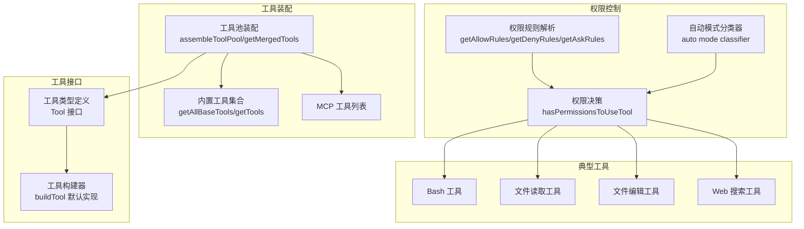
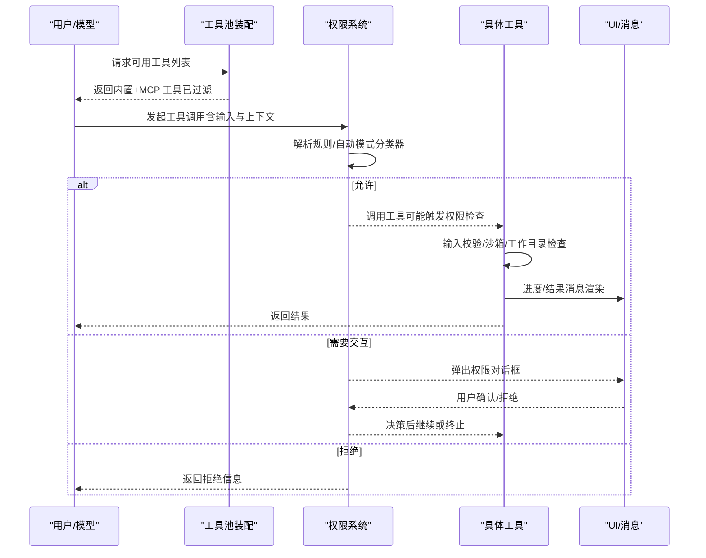
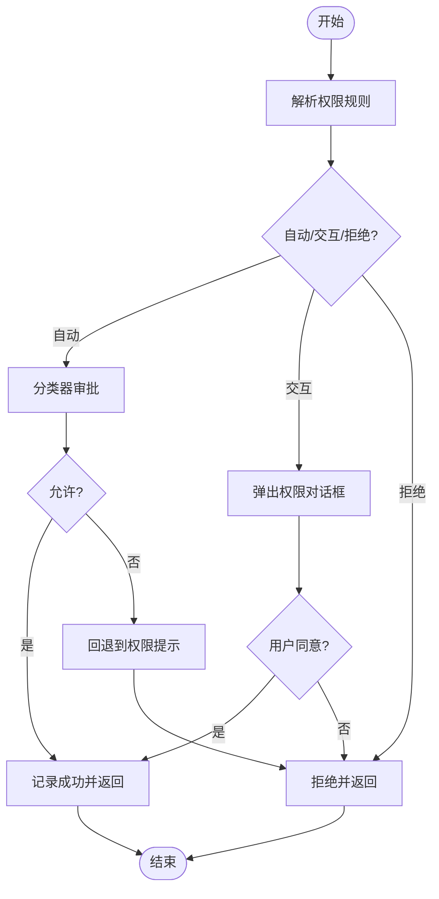
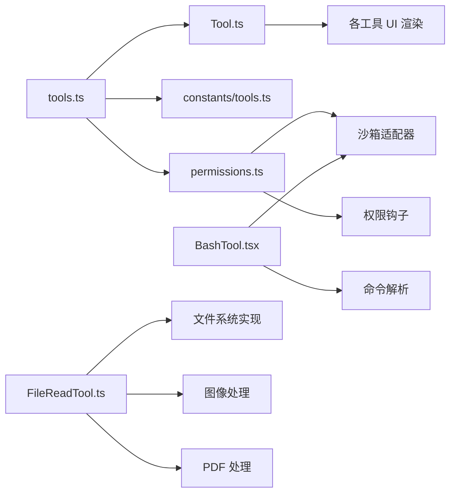

# 工具系统

<cite>
**本文引用的文件**
- [src/tools.ts](file://src/tools.ts)
- [src/Tool.ts](file://src/Tool.ts)
- [src/constants/tools.ts](file://src/constants/tools.ts)
- [src/utils/permissions/permissions.ts](file://src/utils/permissions/permissions.ts)
- [src/tools/BashTool/BashTool.tsx](file://src/tools/BashTool/BashTool.tsx)
- [src/tools/FileReadTool/FileReadTool.ts](file://src/tools/FileReadTool/FileReadTool.ts)
- [src/tools/FileEditTool/FileEditTool.ts](file://src/tools/FileEditTool/FileEditTool.ts)
- [src/tools/WebSearchTool/WebSearchTool.ts](file://src/tools/WebSearchTool/WebSearchTool.ts)
</cite>

## 目录
1. [简介](#简介)
2. [项目结构](#项目结构)
3. [核心组件](#核心组件)
4. [架构总览](#架构总览)
5. [详细组件分析](#详细组件分析)
6. [依赖关系分析](#依赖关系分析)
7. [性能考虑](#性能考虑)
8. [故障排查指南](#故障排查指南)
9. [结论](#结论)
10. [附录](#附录)

## 简介
本文件为 Claude Code 工具系统的全面技术文档，聚焦于工具接口设计、生命周期管理、权限控制、并发与串行执行策略、错误处理与重试、性能优化与资源管理，并提供自定义工具开发指南与具体使用示例。系统支持 40 多种内置工具，覆盖文件操作、系统命令、网络请求、交互工具、任务与计划、MCP 资源访问等能力，并通过统一的工具抽象层与权限框架确保安全性与可扩展性。

## 项目结构
工具系统的核心由以下部分组成：
- 工具注册与装配：集中于工具池装配函数，负责合并内置工具与 MCP 工具，过滤权限规则与 REPL 限制，并保持提示缓存稳定。
- 工具接口与默认行为：统一的工具类型定义与构建器，提供默认实现（如只读、并发安全、权限检查等）。
- 权限控制：基于规则的允许/拒绝/询问策略，结合自动模式分类器与钩子，支持沙箱隔离与工作目录限制。
- 典型工具实现：以 Bash、文件读写、Web 搜索等为代表，展示输入校验、权限检查、进度渲染、结果消息与 UI 渲染的完整流程。
- 执行与生命周期：工具调用上下文、中断行为、并发与串行策略、错误处理与重试建议。

图表来源
- [src/tools.ts:345-367](file://src/tools.ts#L345-L367)
- [src/tools.ts:193-251](file://src/tools.ts#L193-L251)
- [src/Tool.ts:362-695](file://src/Tool.ts#L362-L695)
- [src/utils/permissions/permissions.ts:473-800](file://src/utils/permissions/permissions.ts#L473-L800)
- [src/tools/BashTool/BashTool.tsx:1-200](file://src/tools/BashTool/BashTool.tsx#L1-L200)
- [src/tools/FileReadTool/FileReadTool.ts:1-200](file://src/tools/FileReadTool/FileReadTool.ts#L1-L200)
- [src/tools/FileEditTool/FileEditTool.ts:1-200](file://src/tools/FileEditTool/FileEditTool.ts#L1-L200)
- [src/tools/WebSearchTool/WebSearchTool.ts:1-200](file://src/tools/WebSearchTool/WebSearchTool.ts#L1-L200)

章节来源
- [src/tools.ts:193-367](file://src/tools.ts#L193-L367)
- [src/Tool.ts:362-793](file://src/Tool.ts#L362-L793)

## 核心组件
- 工具类型与构建器
  - 工具接口定义了名称、输入输出模式、描述、并发安全、只读/破坏性标记、权限检查、UI 渲染、摘要与活动描述等契约；并通过构建器提供默认实现，降低重复代码。
  - 关键字段与方法包括：输入/输出模式、是否并发安全、是否只读、是否破坏性、权限检查、输入校验、UI 渲染、摘要与活动描述、最大结果长度、延迟加载与始终加载标志等。
- 工具池装配
  - 提供内置工具集合、按权限上下文过滤、REPL 模式屏蔽原始工具、合并 MCP 工具并去重、保证提示缓存稳定性（排序与去重）。
- 权限系统
  - 规则来源与匹配、允许/拒绝/询问规则、自动模式分类器、钩子决策、沙箱与工作目录限制、拒绝计数与回退提示。

章节来源
- [src/Tool.ts:362-793](file://src/Tool.ts#L362-L793)
- [src/tools.ts:271-367](file://src/tools.ts#L271-L367)
- [src/utils/permissions/permissions.ts:109-302](file://src/utils/permissions/permissions.ts#L109-L302)

## 架构总览
工具系统采用“统一接口 + 分层装配 + 权限驱动”的架构：
- 统一接口：所有工具遵循相同的 Tool 契约，便于统一调度、UI 渲染与统计。
- 分层装配：先生成内置工具集合，再根据环境特性与用户设置动态启用/禁用，最后合并 MCP 工具并按名称去重。
- 权限驱动：在工具调用前进行规则匹配与自动模式分类器评估，必要时弹出交互式权限对话框或自动批准/拒绝。

图表来源
- [src/tools.ts:345-367](file://src/tools.ts#L345-L367)
- [src/utils/permissions/permissions.ts:473-800](file://src/utils/permissions/permissions.ts#L473-L800)
- [src/Tool.ts:379-503](file://src/Tool.ts#L379-L503)

## 详细组件分析

### 工具接口与生命周期
- 接口要点
  - 输入/输出模式：通过 Zod 模式定义，支持 JSON Schema 直接指定的 MCP 工具。
  - 生命周期钩子：描述、调用、进度回调、结果映射、UI 渲染、摘要与活动描述、中断行为、并发安全、只读/破坏性标记、搜索/读取命令识别、是否 MCP/LSP 标记、延迟加载/始终加载、最大结果长度、严格模式等。
  - 构建器：提供默认实现（如默认只读、默认非并发安全、默认允许权限、默认空分类器输入、默认显示名等），确保一致性与安全性。
- 生命周期阶段
  - 描述阶段：生成工具描述文本，用于模型选择工具。
  - 权限阶段：执行输入校验与权限检查，必要时弹出交互式权限对话框或自动模式分类器审批。
  - 执行阶段：调用工具逻辑，支持进度回调与 UI 渲染。
  - 结果阶段：映射为消息块参数，渲染结果消息与可选 UI。
  - 统计阶段：记录令牌消耗、成本、分类器开销等指标。

章节来源
- [src/Tool.ts:362-793](file://src/Tool.ts#L362-L793)

### 工具池装配与模式过滤
- 内置工具集合
  - 根据环境变量与特性开关动态启用工具（如 REPL、PowerShell、计划任务、工作树模式、代理/团队工具等）。
  - 支持嵌入式搜索工具（当可用时，跳过独立的 Glob/Grep 工具）。
- 权限过滤
  - 基于拒绝规则过滤工具，支持 MCP 服务器级规则（如 mcp__server*）。
- REPL 模式
  - 在 REPL 启用时，隐藏原始工具（仅保留 REPL 包装器），避免直接调用底层工具。
- 合并与去重
  - 将内置工具与 MCP 工具合并，按名称去重，内置工具优先，保持排序以稳定提示缓存。

章节来源
- [src/tools.ts:193-367](file://src/tools.ts#L193-L367)
- [src/constants/tools.ts:36-113](file://src/constants/tools.ts#L36-L113)

### 权限控制机制
- 规则体系
  - 允许/拒绝/询问规则来自多个来源（设置、命令行、会话等），支持通配符与 MCP 服务器级匹配。
  - 工具级与内容级规则（如 Bash(prefix:*)）支持细粒度控制。
- 自动模式与分类器
  - 在自动模式下，对敏感工具使用分类器快速审批或拒绝；接受编辑模式（acceptEdits）可绕过分类器审批常见安全操作。
  - PowerShell 在自动模式下需要显式交互（除非特定特性开启）。
- 钩子与回退
  - 对于无法显示权限提示的异步/无头场景，执行权限请求钩子；若失败则自动拒绝。
- 拒绝计数与回退提示
  - 记录连续拒绝次数，在成功工具使用后清零；超过阈值时回退到权限提示。

图表来源
- [src/utils/permissions/permissions.ts:473-800](file://src/utils/permissions/permissions.ts#L473-L800)

章节来源
- [src/utils/permissions/permissions.ts:109-302](file://src/utils/permissions/permissions.ts#L109-L302)
- [src/utils/permissions/permissions.ts:473-800](file://src/utils/permissions/permissions.ts#L473-L800)

### 并发执行与串行策略
- 并发安全
  - 工具可声明自身是否并发安全；非并发安全工具在并发场景下会被串行化或阻塞新消息。
- 中断行为
  - 工具可声明在用户提交新消息时的行为：取消当前工具或阻塞等待。
- Bash 工具的特殊处理
  - 搜索/读取命令用于 UI 折叠显示；静默命令不显示“(无输出)”；支持后台任务与前台任务切换。
- 串行化与队列
  - 对于非并发安全工具或存在冲突状态的工具，系统采用串行化策略，避免竞态条件。

章节来源
- [src/Tool.ts:402-416](file://src/Tool.ts#L402-L416)
- [src/tools/BashTool/BashTool.tsx:83-172](file://src/tools/BashTool/BashTool.tsx#L83-L172)

### 错误处理与重试机制
- 输入校验
  - 工具可实现输入校验，返回明确的错误码与消息，便于 UI 与权限系统区分不同错误类型。
- 权限拒绝
  - 权限拒绝分为“自动拒绝”、“交互式拒绝”、“分类器拒绝”等，系统提供统一的拒绝消息与回退提示。
- 工具内部错误
  - 文件读取工具对超大文件、设备路径、二进制文件等进行保护；Bash 工具对命令解析失败、输出重定向等进行容错。
- 重试建议
  - 对于网络类工具（如 Web 搜索），建议在失败时减少查询规模或增加延迟重试；对于文件操作，建议缩小范围或分批处理。

章节来源
- [src/tools/FileReadTool/FileReadTool.ts:175-185](file://src/tools/FileReadTool/FileReadTool.ts#L175-L185)
- [src/tools/BashTool/BashTool.tsx:1-200](file://src/tools/BashTool/BashTool.tsx#L1-L200)

### 自定义工具开发指南
- 实现步骤
  - 使用构建器定义工具：提供名称、输入模式、描述、UI 渲染、摘要与活动描述、并发安全、只读/破坏性标记、权限检查、输入校验等。
  - 若为 MCP 工具，提供 JSON Schema 输入模式与元数据；若为 LSP 工具，声明 LSP 标记。
  - 实现 call 方法：执行业务逻辑、更新上下文、发送进度消息、返回结果。
  - 实现 UI 渲染：renderToolUseMessage/renderToolResultMessage/renderToolUseProgressMessage 等。
- 权限声明
  - 在 checkPermissions 中实现细粒度权限控制；必要时实现 preparePermissionMatcher 以支持规则匹配。
- UI 渲染
  - 提供简洁的摘要与活动描述，以便在紧凑视图中展示；在详细视图中提供完整结果。
- 最佳实践
  - 明确并发安全与中断行为；限制最大结果长度；对潜在危险操作（删除、覆盖、发送）标记为破坏性；对网络与文件操作添加超时与重试策略。

章节来源
- [src/Tool.ts:362-793](file://src/Tool.ts#L362-L793)

### 典型工具功能分类与使用方法
- 文件操作类
  - 文件读取：支持偏移与大小限制、图像与 PDF 处理、令牌计数估算、设备路径保护。
  - 文件编辑：支持差异计算、历史追踪、权限检查、大小限制、UNC 路径安全处理。
- 系统命令类
  - Bash：命令解析与语义识别（搜索/读取/列表）、静默命令、后台/前台任务、沙箱与工作目录限制。
  - PowerShell：与 Bash 类似的安全与权限控制，支持模式与路径验证。
- 网络请求类
  - Web 搜索：支持域名白/黑名单、最大使用次数限制、流式响应解析、结果聚合。
- 交互工具类
  - 询问用户问题：支持交互式输入与权限提示。
- 任务与计划类
  - 任务创建/获取/更新/列表：与工作树模式配合，支持定时任务。
  - 计划任务：支持创建/删除/列出定时任务。
- MCP 工具类
  - 列表与读取 MCP 资源：支持服务器级权限与资源发现。

章节来源
- [src/tools/FileReadTool/FileReadTool.ts:1-200](file://src/tools/FileReadTool/FileReadTool.ts#L1-L200)
- [src/tools/FileEditTool/FileEditTool.ts:1-200](file://src/tools/FileEditTool/FileEditTool.ts#L1-L200)
- [src/tools/BashTool/BashTool.tsx:1-200](file://src/tools/BashTool/BashTool.tsx#L1-L200)
- [src/tools/WebSearchTool/WebSearchTool.ts:1-200](file://src/tools/WebSearchTool/WebSearchTool.ts#L1-L200)

## 依赖关系分析
- 工具装配依赖
  - 工具池装配依赖工具集合生成、权限上下文、REPL 模式与特性开关。
- 权限系统依赖
  - 权限系统依赖规则解析、自动模式分类器、钩子执行、沙箱管理与工作目录配置。
- 典型工具依赖
  - Bash 工具依赖命令解析、安全检查、沙箱适配器、任务管理与 UI 渲染。
  - 文件读写工具依赖文件系统实现、权限检查、图像与 PDF 处理、令牌估算与 UI 渲染。

图表来源
- [src/tools.ts:193-367](file://src/tools.ts#L193-L367)
- [src/Tool.ts:362-793](file://src/Tool.ts#L362-L793)
- [src/utils/permissions/permissions.ts:109-302](file://src/utils/permissions/permissions.ts#L109-L302)
- [src/tools/BashTool/BashTool.tsx:1-200](file://src/tools/BashTool/BashTool.tsx#L1-L200)
- [src/tools/FileReadTool/FileReadTool.ts:1-200](file://src/tools/FileReadTool/FileReadTool.ts#L1-L200)

章节来源
- [src/tools.ts:193-367](file://src/tools.ts#L193-L367)
- [src/utils/permissions/permissions.ts:109-302](file://src/utils/permissions/permissions.ts#L109-L302)

## 性能考虑
- 工具池装配
  - 保持内置工具与 MCP 工具的稳定排序，避免提示缓存失效；内置工具优先，MCP 工具次之。
- 结果存储与传输
  - 设置最大结果长度，超长结果落地磁盘并返回预览，避免内存溢出与传输开销。
- 自动模式分类器
  - 对安全工具使用快速路径（如 acceptEdits）与允许清单，减少分类器调用；记录分类器开销与成本。
- Bash 工具
  - 对搜索/读取命令进行 UI 折叠，减少冗余消息；对静默命令显示“完成”而非“无输出”。

章节来源
- [src/tools.ts:354-366](file://src/tools.ts#L354-L366)
- [src/Tool.ts:466-472](file://src/Tool.ts#L466-L472)
- [src/utils/permissions/permissions.ts:658-793](file://src/utils/permissions/permissions.ts#L658-L793)
- [src/tools/BashTool/BashTool.tsx:54-82](file://src/tools/BashTool/BashTool.tsx#L54-L82)

## 故障排查指南
- 权限相关
  - 若工具被拒绝，请检查权限规则（允许/拒绝/询问）与自动模式设置；查看拒绝计数与回退提示。
  - 对于无头/异步场景，确认权限钩子是否正常执行；必要时启用“绕过权限模式”或调整规则。
- 文件读取
  - 超大文件导致令牌超限：使用偏移与大小参数分段读取；或改用搜索工具。
  - 设备路径与特殊文件：系统会阻止读取无限输出或阻塞输入的设备文件。
- Bash 工具
  - 命令解析失败：检查语法与重定向；确认是否在沙箱内执行。
  - 输出过多：使用折叠显示或限制输出大小。
- Web 搜索
  - 域名限制与最大使用次数：调整 allowed_domains/blocked_domains 或减少查询频率。

章节来源
- [src/utils/permissions/permissions.ts:473-800](file://src/utils/permissions/permissions.ts#L473-L800)
- [src/tools/FileReadTool/FileReadTool.ts:175-185](file://src/tools/FileReadTool/FileReadTool.ts#L175-L185)
- [src/tools/BashTool/BashTool.tsx:1-200](file://src/tools/BashTool/BashTool.tsx#L1-L200)
- [src/tools/WebSearchTool/WebSearchTool.ts:152-200](file://src/tools/WebSearchTool/WebSearchTool.ts#L152-L200)

## 结论
Claude Code 的工具系统通过统一接口、灵活装配与严格的权限控制，实现了高安全性与可扩展性。内置工具覆盖文件、命令、网络、交互、任务与计划等多个维度；权限系统支持自动模式与交互式审批；并发与串行策略保障了执行稳定性；错误处理与性能优化确保了用户体验。开发者可基于工具构建器快速实现自定义工具，并通过权限声明与 UI 渲染融入整体生态。

## 附录
- 工具使用示例与集成方法
  - 文件读取：指定路径与偏移/大小，系统自动进行令牌估算与 UI 渲染。
  - 文件编辑：提供旧字符串与新字符串，系统计算差异并进行权限检查。
  - Bash 命令：支持管道与重定向，系统识别搜索/读取/列表命令并进行 UI 折叠。
  - Web 搜索：提供查询与域名白/黑名单，系统限制最大使用次数并流式返回结果。
  - 任务管理：在工作树模式下创建/获取/更新/列出任务，支持定时任务。
  - MCP 工具：通过服务器与工具名称访问资源，支持权限规则与元数据传递。

章节来源
- [src/tools/FileReadTool/FileReadTool.ts:1-200](file://src/tools/FileReadTool/FileReadTool.ts#L1-L200)
- [src/tools/FileEditTool/FileEditTool.ts:1-200](file://src/tools/FileEditTool/FileEditTool.ts#L1-L200)
- [src/tools/BashTool/BashTool.tsx:1-200](file://src/tools/BashTool/BashTool.tsx#L1-L200)
- [src/tools/WebSearchTool/WebSearchTool.ts:1-200](file://src/tools/WebSearchTool/WebSearchTool.ts#L1-L200)
- [src/tools.ts:193-367](file://src/tools.ts#L193-L367)