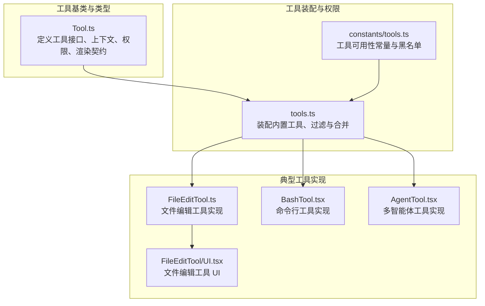
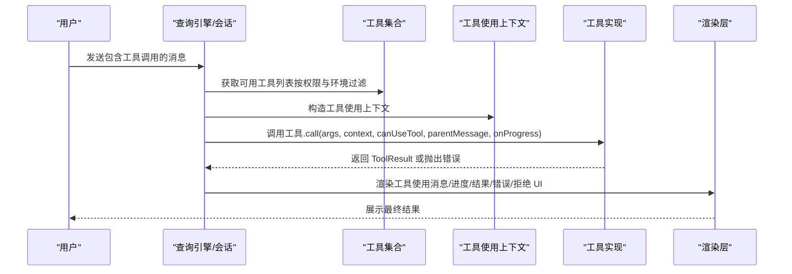
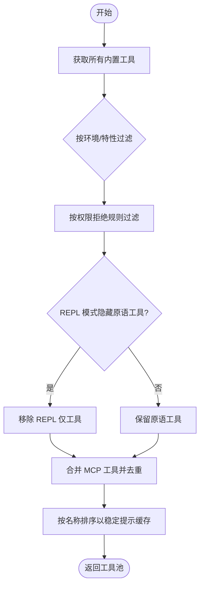
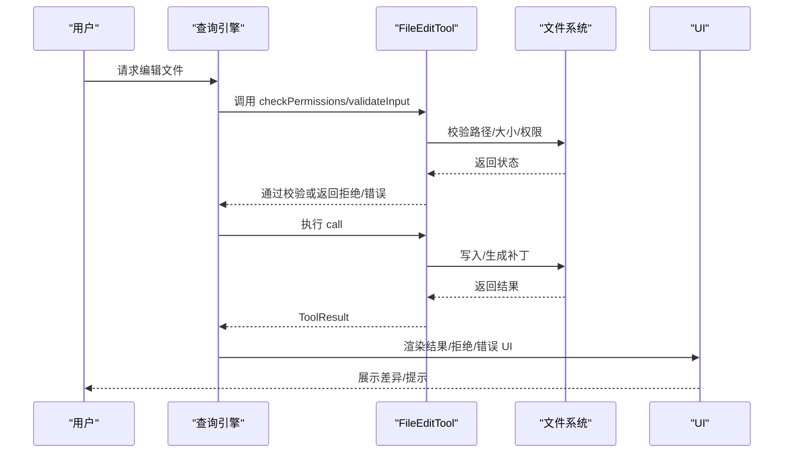
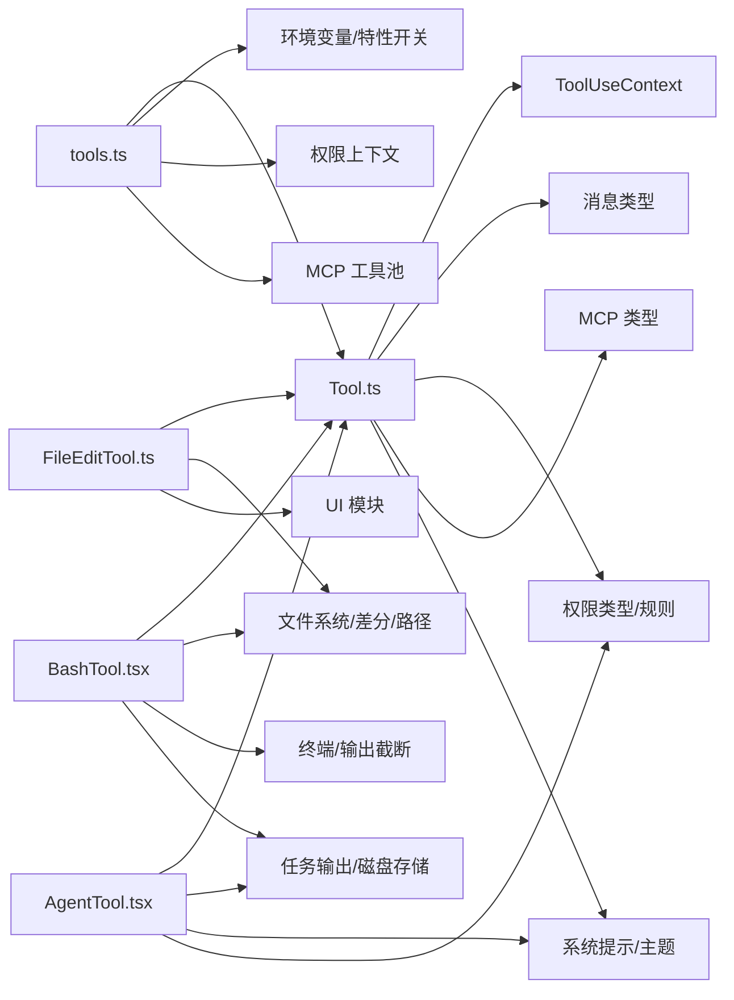

# 自定义工具开发

<cite>
**本文引用的文件**
- [Tool.ts](file://src/Tool.ts)
- [tools.ts](file://src/tools.ts)
- [tools.ts（常量）](file://src/constants/tools.ts)
- [FileEditTool.ts](file://src/tools/FileEditTool/FileEditTool.ts)
- [FileEditTool/UI.tsx](file://src/tools/FileEditTool/UI.tsx)
- [BashTool.tsx](file://src/tools/BashTool/BashTool.tsx)
- [AgentTool.tsx](file://src/tools/AgentTool/AgentTool.tsx)
- [README.md](file://README.md)
- [README_CN.md](file://README_CN.md)
</cite>

## 目录
1. [简介](#简介)
2. [项目结构](#项目结构)
3. [核心组件](#核心组件)
4. [架构总览](#架构总览)
5. [详细组件分析](#详细组件分析)
6. [依赖关系分析](#依赖关系分析)
7. [性能考量](#性能考量)
8. [故障排查指南](#故障排查指南)
9. [结论](#结论)
10. [附录](#附录)

## 简介
本指南面向希望在 Claude Code 中开发自定义工具的工程师与高级用户。文档基于仓库中的工具基类、工具集合装配、权限系统与 UI 渲染机制，系统讲解如何：
- 继承并扩展工具基类，实现必需方法与可选增强能力
- 开发工具的 UI 组件：输入表单、输出展示、交互逻辑
- 声明与配置工具权限，结合权限上下文进行动态决策
- 从简单工具到复杂工具组合的完整示例
- 工具的测试与调试方法
- 工具的打包、发布与分发流程
- 最佳实践与常见陷阱
- 提供工具开发模板与脚手架建议

## 项目结构
Claude Code 的工具体系由“工具基类 + 工具集合装配 + 权限与 UI 渲染”三部分组成：
- 工具基类与类型定义：位于 [Tool.ts](file://src/Tool.ts)，定义工具接口、上下文、进度与渲染契约
- 工具集合装配：位于 [tools.ts](file://src/tools.ts)，负责按环境与权限过滤、合并内置与 MCP 工具
- 权限与可用性常量：位于 [tools.ts（常量）](file://src/constants/tools.ts)，定义不同场景下的工具白/黑名单
- 典型工具实现：如文件编辑工具 [FileEditTool.ts](file://src/tools/FileEditTool/FileEditTool.ts) 及其 UI [FileEditTool/UI.tsx](file://src/tools/FileEditTool/UI.tsx)
- 复杂工具示例：命令行工具 [BashTool.tsx](file://src/tools/BashTool/BashTool.tsx)、多智能体工具 [AgentTool.tsx](file://src/tools/AgentTool/AgentTool.tsx)



图表来源
- [Tool.ts](file://src/Tool.ts)
- [tools.ts](file://src/tools.ts)
- [tools.ts（常量）](file://src/constants/tools.ts)
- [FileEditTool.ts](file://src/tools/FileEditTool/FileEditTool.ts)
- [FileEditTool/UI.tsx](file://src/tools/FileEditTool/UI.tsx)
- [BashTool.tsx](file://src/tools/BashTool/BashTool.tsx)
- [AgentTool.tsx](file://src/tools/AgentTool/AgentTool.tsx)

章节来源
- [Tool.ts](file://src/Tool.ts)
- [tools.ts](file://src/tools.ts)
- [tools.ts（常量）](file://src/constants/tools.ts)

## 核心组件
- 工具基类与类型
  - 工具接口：包含名称、别名、描述、输入/输出模式、调用函数、权限检查、并发安全、只读/破坏性标记、中断行为、是否延迟加载、是否始终加载、MCP 信息、最大结果大小、严格模式、输入回填、输入校验、路径提取、自动分类器输入、结果消息映射、渲染函数族等
  - 构建器：通过构建器统一填充默认行为，避免每个工具重复实现相同逻辑
- 工具集合装配
  - 按环境变量与特性开关组装内置工具列表
  - 过滤权限拒绝规则与 REPL 模式限制
  - 合并 MCP 工具，去重并保持提示缓存稳定排序
- 权限与可用性
  - 工具可用性常量：定义不同角色/模式下允许或禁止使用的工具集合
  - 权限上下文：包含权限模式、附加工作目录、允许/拒绝/询问规则、是否可绕过权限等

章节来源
- [Tool.ts](file://src/Tool.ts)
- [tools.ts](file://src/tools.ts)
- [tools.ts（常量）](file://src/constants/tools.ts)

## 架构总览
工具运行时的关键流程：
- 调用前：校验输入、生成权限上下文、决定是否需要用户授权
- 执行中：工具执行、进度回调、可能的 UI 更新
- 执行后：结果映射为消息块、渲染结果与错误/拒绝 UI、记录审计与统计



图表来源
- [Tool.ts](file://src/Tool.ts)
- [tools.ts](file://src/tools.ts)

## 详细组件分析

### 工具基类与构建器
- 必需接口
  - 名称与别名、描述、输入/输出模式、call、checkPermissions、isEnabled、isConcurrencySafe、isReadOnly、isDestructive、interruptBehavior、shouldDefer/alwaysLoad、mcpInfo、maxResultSizeChars、strict、backfillObservableInput、validateInput、getPath、toAutoClassifierInput、mapToolResultToToolResultBlockParam、renderToolUseMessage/Progress/Queued/Rejected/Error/Result、renderGroupedToolUse、userFacingName 等
- 默认行为
  - 构建器自动填充：启用状态、并发安全、只读、破坏性、权限检查、自动分类器输入、用户可见名等默认实现
- 上下文
  - ToolUseContext 提供命令、调试、思考配置、MCP 客户端/资源、非交互会话标志、代理定义、预算、系统提示覆盖、刷新工具回调、通知、消息追加、文件历史与归属追踪更新、对话/会话标识、子代理信息、文件读取/全局匹配限制、决策追踪、请求提示回调、工具使用 ID、内容替换状态、渲染系统提示快照等

```mermaid
classDiagram
class Tool {
+name : string
+aliases : string[]
+description(input, options) string
+call(args, context, canUseTool, parentMessage, onProgress) ToolResult
+checkPermissions(input, context) PermissionResult
+isEnabled() boolean
+isConcurrencySafe(input) boolean
+isReadOnly(input) boolean
+isDestructive(input) boolean
+interruptBehavior() "cancel"|"block"
+shouldDefer? : boolean
+alwaysLoad? : boolean
+mcpInfo? : {serverName, toolName}
+maxResultSizeChars : number
+strict? : boolean
+backfillObservableInput(input)
+validateInput(input, context) ValidationResult
+getPath(input) string
+toAutoClassifierInput(input) unknown
+mapToolResultToToolResultBlockParam(content, toolUseID)
+renderToolUseMessage(input, options)
+renderToolUseProgressMessage(messages, options)
+renderToolUseQueuedMessage()
+renderToolUseRejectedMessage(input, options)
+renderToolUseErrorMessage(result, options)
+renderToolResultMessage(content, messages, options)
+renderGroupedToolUse(toolUses, options)
+userFacingName(input)
}
class ToolBuilder {
+buildTool(def) Tool
}
ToolBuilder --> Tool : "构建默认实现"
```

图表来源
- [Tool.ts](file://src/Tool.ts)

章节来源
- [Tool.ts](file://src/Tool.ts)

### 工具集合装配与权限过滤
- 装配策略
  - 按环境变量与特性开关选择内置工具
  - 过滤 REPL 专用工具、权限拒绝规则、禁用工具
  - 合并 MCP 工具，按名称去重，内置工具优先
- 可用性常量
  - 定义异步代理、进程内队友、协调者模式等场景下的工具白名单/黑名单



图表来源
- [tools.ts](file://src/tools.ts)
- [tools.ts（常量）](file://src/constants/tools.ts)

章节来源
- [tools.ts](file://src/tools.ts)
- [tools.ts（常量）](file://src/constants/tools.ts)

### 文件编辑工具（FileEditTool）：从简单到复杂
- 简单工具要点
  - 输入/输出模式：通过模式对象定义参数与返回值
  - 权限检查：针对文件写入的权限判定
  - 输入校验：路径展开、大小限制、同值检测、敏感内容检查
  - 渲染：使用 UI 模块渲染使用消息、结果消息、拒绝/错误消息
- 复杂工具要点
  - 并发安全：标记为不安全，避免并发修改
  - 破坏性：标记为破坏性，用于安全分类
  - 自动分类器输入：将文件路径与新内容摘要化，便于安全扫描
  - 用户可见名与摘要：根据计划文件等特殊场景定制显示
  - 路径提取：用于权限匹配与日志追踪
  - 结果映射：将内部输出映射为消息块参数



图表来源
- [FileEditTool.ts](file://src/tools/FileEditTool/FileEditTool.ts)
- [FileEditTool/UI.tsx](file://src/tools/FileEditTool/UI.tsx)

章节来源
- [FileEditTool.ts](file://src/tools/FileEditTool/FileEditTool.ts)
- [FileEditTool/UI.tsx](file://src/tools/FileEditTool/UI.tsx)

### 命令行工具（BashTool）：复杂交互与安全
- 关键点
  - 搜索/读取/列出命令识别：用于 UI 折叠与摘要
  - 只读约束与沙箱策略：根据命令语义与环境决定是否启用沙箱
  - 进度与超时：长任务显示进度、截断输出、超时处理
  - 输出处理：图像/文本/截断检测、预览生成
  - 权限匹配：支持通配符规则匹配文件路径
- UI 渲染
  - 使用专用 UI 模块渲染使用消息、进度消息、排队消息、错误/拒绝消息

章节来源
- [BashTool.tsx](file://src/tools/BashTool/BashTool.tsx)

### 多智能体工具（AgentTool）：工具组合与生命周期
- 关键点
  - 输入/输出模式：描述、提示、子代理类型、模型、后台运行、隔离模式（工作树/远程）、工作目录等
  - 生命周期：注册/启动/前台/后台、进度跟踪、异常处理、远程会话、工作树管理
  - 权限：按代理类型与 MCP 服务器要求过滤
  - 渲染：使用 UI 模块渲染使用消息、进度、标签、结果、拒绝/错误
- 场景
  - 协作模式：团队成员、计划模式、远程会话
  - 异步代理：自动后台、通知、进度汇总

章节来源
- [AgentTool.tsx](file://src/tools/AgentTool/AgentTool.tsx)

## 依赖关系分析
- 工具基类对上下文、消息、权限、MCP、系统提示、主题等模块存在广泛依赖
- 工具集合装配依赖环境变量、特性开关、权限规则、REPL 模式、MCP 工具池
- 典型工具依赖文件系统、差分、终端、任务输出、分析与诊断服务



图表来源
- [Tool.ts](file://src/Tool.ts)
- [tools.ts](file://src/tools.ts)
- [FileEditTool.ts](file://src/tools/FileEditTool/FileEditTool.ts)
- [BashTool.tsx](file://src/tools/BashTool/BashTool.tsx)
- [AgentTool.tsx](file://src/tools/AgentTool/AgentTool.tsx)

章节来源
- [Tool.ts](file://src/Tool.ts)
- [tools.ts](file://src/tools.ts)

## 性能考量
- 结果大小限制：工具可设置最大结果字符数，超过阈值将持久化到磁盘并通过预览展示，避免内存溢出
- 并发安全：默认假设工具不安全，避免并发修改共享资源；必要时实现并发安全逻辑
- UI 折叠：对搜索/读取/列出命令进行折叠，减少转录体积与渲染压力
- 排序稳定性：工具池按名称排序并去重，保证提示缓存命中率
- 进程与任务：长任务采用后台运行与进度提示，避免阻塞主线程

## 故障排查指南
- 输入校验失败
  - 检查 validateInput 是否正确返回拒绝/询问结果，并携带明确错误码与消息
  - 对于路径类工具，确认路径展开与大小限制逻辑
- 权限被拒绝
  - 检查权限上下文与拒绝规则匹配，确认工具是否正确实现 preparePermissionMatcher
  - 对于文件系统工具，核对写入权限与敏感内容检查
- UI 不显示或显示异常
  - 确认渲染函数族是否实现：renderToolUseMessage、renderToolResultMessage、renderToolUseRejectedMessage、renderToolUseErrorMessage
  - 非详细模式下，确保 renderToolUseProgressMessage 正确返回进度节点
- 进度与超时
  - 对长时间运行的工具，实现 onProgress 回调并合理设置超时与截断
- MCP 工具未出现
  - 检查权限上下文是否拒绝该服务器/工具，或名称冲突导致被内置工具覆盖

章节来源
- [Tool.ts](file://src/Tool.ts)
- [FileEditTool.ts](file://src/tools/FileEditTool/FileEditTool.ts)
- [BashTool.tsx](file://src/tools/BashTool/BashTool.tsx)

## 结论
通过工具基类与构建器，Claude Code 提供了统一且强大的工具开发框架。借助权限系统与 UI 渲染契约，开发者可以快速实现从简单到复杂的工具，并将其无缝融入会话与多智能体协作场景。遵循本文的步骤与最佳实践，可显著提升工具的可靠性、安全性与用户体验。

## 附录

### 工具开发步骤清单
- 定义输入/输出模式：使用 Zod 模式或 JSON Schema 描述参数与返回值
- 实现必需方法：name、description、inputSchema、outputSchema、call、checkPermissions
- 可选增强：validateInput、getPath、isConcurrencySafe、isReadOnly、isDestructive、interruptBehavior、toAutoClassifierInput、backfillObservableInput
- 渲染实现：renderToolUseMessage、renderToolResultMessage、renderToolUseProgressMessage、renderToolUseRejectedMessage、renderToolUseErrorMessage
- 权限声明：在权限上下文中声明允许/拒绝/询问规则，必要时实现 preparePermissionMatcher
- 注册与装配：将工具加入工具集合，确保按环境与特性正确装配
- 测试与调试：编写单元/集成测试，利用调试日志与错误消息定位问题
- 打包与发布：遵循项目脚本与构建流程，确保工具在目标环境中可用

### 权限声明与配置方法
- 权限上下文字段
  - 模式、附加工作目录、允许/拒绝/询问规则、是否可绕过权限、是否避免权限提示、自动化检查前置、计划模式前后状态保存等
- 规则匹配
  - 工具可通过 preparePermissionMatcher 生成匹配闭包，用于权限规则模式（如 “git *”）
- 常量与场景
  - 使用工具可用性常量定义不同角色/模式下的工具白/黑名单，确保安全边界

章节来源
- [Tool.ts](file://src/Tool.ts)
- [tools.ts（常量）](file://src/constants/tools.ts)

### 示例：从简单到复杂
- 简单工具（文件编辑）
  - 参考 [FileEditTool.ts](file://src/tools/FileEditTool/FileEditTool.ts) 与 [FileEditTool/UI.tsx](file://src/tools/FileEditTool/UI.tsx)
- 复杂工具（命令行）
  - 参考 [BashTool.tsx](file://src/tools/BashTool/BashTool.tsx)
- 工具组合（多智能体）
  - 参考 [AgentTool.tsx](file://src/tools/AgentTool/AgentTool.tsx)

### 测试与调试技巧
- 单元测试：针对 validateInput、checkPermissions、渲染函数进行断言
- 集成测试：模拟 ToolUseContext 与权限上下文，验证 call 的完整流程
- 调试日志：使用调试工具输出关键路径参数与中间状态
- 错误消息：为拒绝/错误场景提供清晰的 UI 文案与可操作提示

### 打包、发布与分发流程
- 构建与准备
  - 使用项目脚本完成源码准备与转换
- 分发
  - 将工具纳入工具集合，确保按环境与特性开关正确装配
  - 对于 MCP 工具，确保服务器与工具名称规范化并在权限上下文中正确过滤

章节来源
- [README.md](file://README.md)
- [README_CN.md](file://README_CN.md)