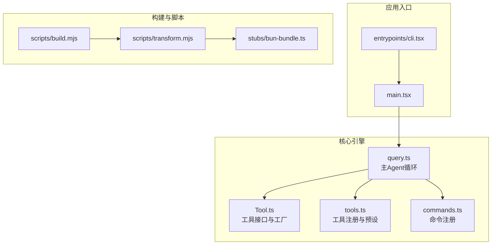
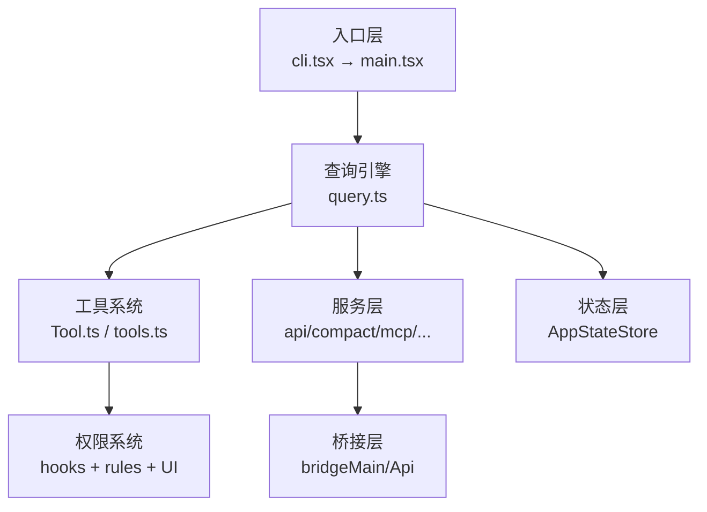
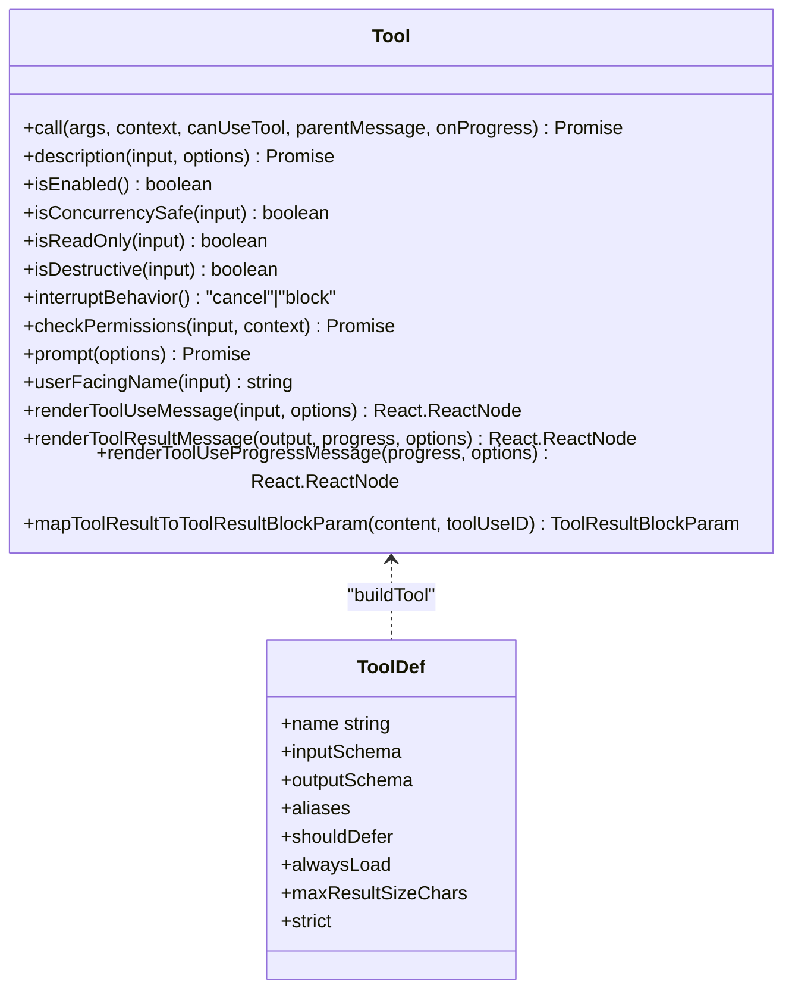
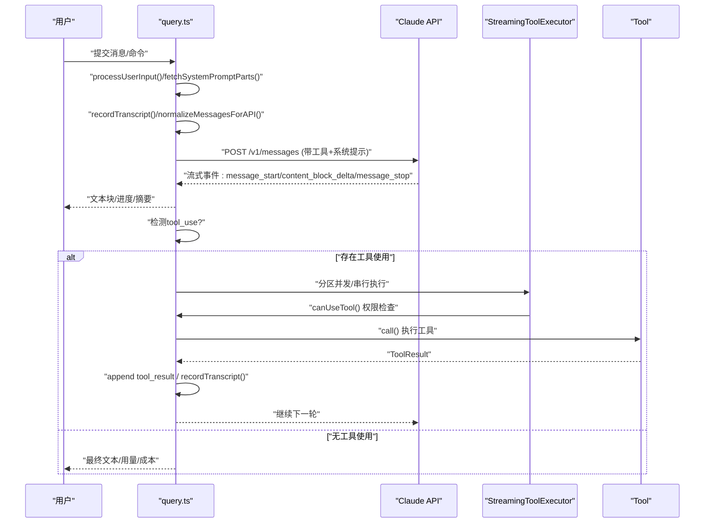
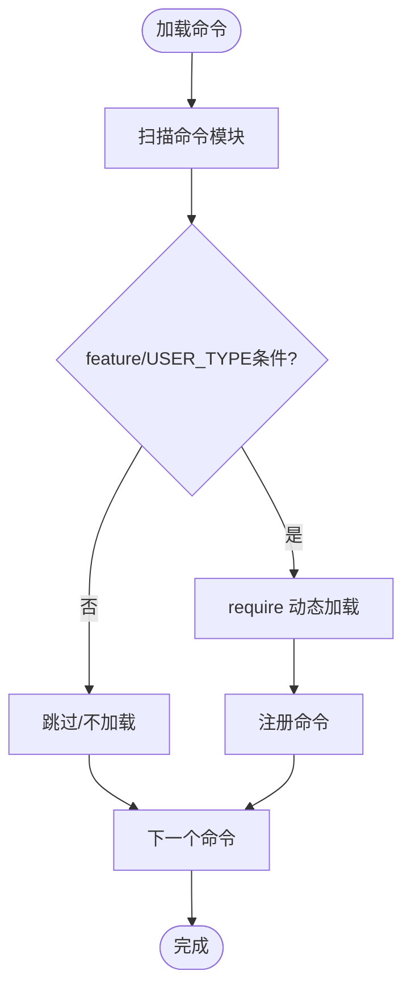
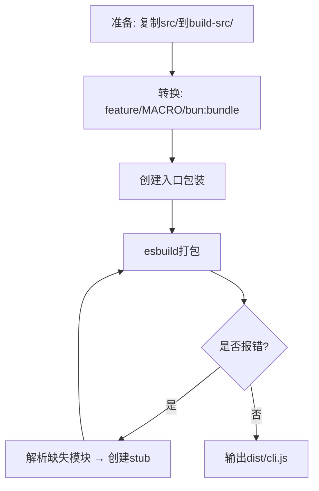
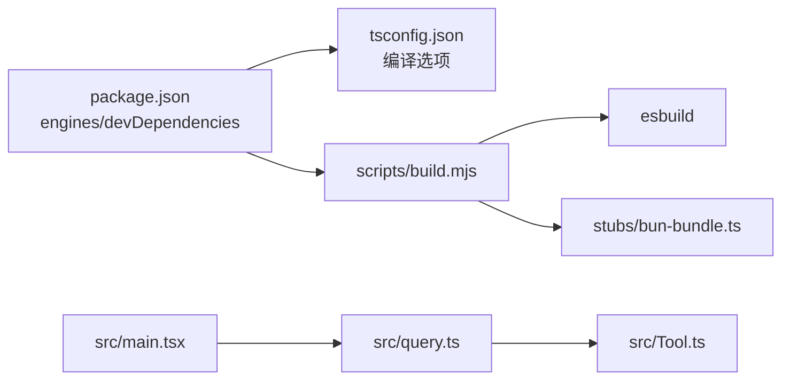

# 开发者指南

<cite>
**本文引用的文件**
- [README.md](file://README.md)
- [QUICKSTART.md](file://QUICKSTART.md)
- [package.json](file://package.json)
- [tsconfig.json](file://tsconfig.json)
- [scripts/build.mjs](file://scripts/build.mjs)
- [scripts/transform.mjs](file://scripts/transform.mjs)
- [stubs/bun-bundle.ts](file://stubs/bun-bundle.ts)
- [src/main.tsx](file://src/main.tsx)
- [src/query.ts](file://src/query.ts)
- [src/Tool.ts](file://src/Tool.ts)
- [src/commands.ts](file://src/commands.ts)
- [src/tools.ts](file://src/tools.ts)
- [src/utils/debug.ts](file://src/utils/debug.ts)
- [src/services/diagnosticTracking.ts](file://src/services/diagnosticTracking.ts)
- [src/commands/init.ts](file://src/commands/init.ts)
- [src/commands/review.ts](file://src/commands/review.ts)
- [src/constants/outputStyles.ts](file://src/constants/outputStyles.ts)
- [src/utils/commitAttribution.ts](file://src/utils/commitAttribution.ts)
- [src/utils/ide.ts](file://src/utils/ide.ts)
- [src/commands/ide/ide.tsx](file://src/commands/ide/ide.tsx)
</cite>

## 目录
1. [简介](#简介)
2. [项目结构](#项目结构)
3. [核心组件](#核心组件)
4. [架构总览](#架构总览)
5. [详细组件分析](#详细组件分析)
6. [依赖关系分析](#依赖关系分析)
7. [性能考量](#性能考量)
8. [故障排查指南](#故障排查指南)
9. [结论](#结论)
10. [附录](#附录)

## 简介
本指南面向Claude Code开发者，提供从环境搭建、构建与运行、代码规范与风格、调试与工具使用、贡献流程、常见问题解决、新功能开发模板、代码审查标准到性能与安全建议的完整指引。文档基于仓库源码与脚本进行系统性梳理，帮助你在不完全具备内部编译条件的情况下，也能高效开展开发工作。

## 项目结构
- 核心目录与职责概览（节选）
  - src：TypeScript源码主体，包含入口、查询引擎、工具系统、命令系统、服务层、状态层等
  - scripts：构建与转换脚本（esbuild驱动）
  - stubs：构建时替换Bun特有模块的桩文件
  - docs：深度分析报告（多语言）
  - services、tools、commands、components、utils等：按领域分层组织
- 关键入口与运行路径
  - CLI入口：src/entrypoints/cli.tsx → src/main.tsx → REPL/QueryEngine
  - 查询主循环：src/query.ts（主Agent循环、工具执行、上下文压缩、权限检查）

图表来源
- [src/entrypoints/cli.tsx](file://src/entrypoints/cli.tsx)
- [src/main.tsx](file://src/main.tsx)
- [src/query.ts](file://src/query.ts)
- [src/Tool.ts](file://src/Tool.ts)
- [src/tools.ts](file://src/tools.ts)
- [src/commands.ts](file://src/commands.ts)
- [scripts/build.mjs](file://scripts/build.mjs)
- [scripts/transform.mjs](file://scripts/transform.mjs)
- [stubs/bun-bundle.ts](file://stubs/bun-bundle.ts)

章节来源
- [README.md: 250-380:250-380](file://README.md#L250-L380)
- [QUICKSTART.md: 106-122:106-122](file://QUICKSTART.md#L106-L122)

## 核心组件
- 工具系统（Tool）
  - 统一接口定义、生命周期钩子、渲染与进度展示、权限校验、并发与只读特性标记等
  - 提供buildTool默认实现，确保一致性与安全性
- 命令系统（commands）
  - 通过模块化注册支持大量斜杠命令；支持按特征门控动态加载
- 查询引擎（query）
  - 主Agent循环、工具并行执行器、上下文压缩、令牌预算与恢复机制
- 构建与脚本
  - 使用esbuild进行最佳努力构建；通过脚本替换Bun编译期特性与缺失模块，生成可运行的cli.js

章节来源
- [src/Tool.ts: 362-793:362-793](file://src/Tool.ts#L362-L793)
- [src/tools.ts: 193-390:193-390](file://src/tools.ts#L193-L390)
- [src/commands.ts: 1-200:1-200](file://src/commands.ts#L1-L200)
- [src/query.ts: 1-200:1-200](file://src/query.ts#L1-L200)
- [scripts/build.mjs: 1-246:1-246](file://scripts/build.mjs#L1-L246)

## 架构总览
- 入口层 → 查询引擎 → 工具/服务/状态
- 特征门控（feature）在构建阶段决定死代码消除，影响命令与工具的可用性
- 权限系统贯穿工具调用前的输入校验、规则匹配与交互式确认

图表来源
- [README.md: 383-446:383-446](file://README.md#L383-L446)
- [src/main.tsx: 1-L200:1-200](file://src/main.tsx#L1-L200)
- [src/query.ts: 1-L200:1-200](file://src/query.ts#L1-L200)

## 详细组件分析

### 工具系统（Tool）类图
- 工具接口包含生命周期、能力标识、渲染与进度、AI侧描述、输入输出模式等
- buildTool提供默认实现，避免重复样板代码

图表来源
- [src/Tool.ts: 362-793:362-793](file://src/Tool.ts#L362-L793)

章节来源
- [src/Tool.ts: 362-793:362-793](file://src/Tool.ts#L362-L793)

### 查询主循环（Query）时序图
- 输入处理 → 组装系统提示 → 记录会话 → 规范化消息 → 调用Claude API流式返回
- 工具使用块触发并行工具执行器，权限检查后调用具体工具，结果回写并继续循环

图表来源
- [README.md: 449-496:449-496](file://README.md#L449-L496)
- [src/query.ts: 1-L200:1-200](file://src/query.ts#L1-L200)

章节来源
- [README.md: 449-496:449-496](file://README.md#L449-L496)
- [src/query.ts: 1-L200:1-200](file://src/query.ts#L1-L200)

### 命令系统（commands）与特征门控
- 命令按需加载，支持按feature标志动态启用/禁用
- 内部特性（如KAIROS、BRIDGE_MODE等）通过条件require加载

图表来源
- [src/commands.ts: 47-123:47-123](file://src/commands.ts#L47-L123)

章节来源
- [src/commands.ts: 1-200:1-200](file://src/commands.ts#L1-L200)

### 构建与脚本（esbuild最佳努力构建）
- 复制src → 转换（feature→false、MACRO注入、bun:bundle替换）→ 创建入口包装 → esbuild打包
- 对缺失模块进行迭代stub创建，最多5轮

图表来源
- [scripts/build.mjs: 52-246:52-246](file://scripts/build.mjs#L52-L246)
- [scripts/transform.mjs: 1-L144:1-144](file://scripts/transform.mjs#L1-L144)

章节来源
- [scripts/build.mjs: 1-L246:1-246](file://scripts/build.mjs#L1-L246)
- [scripts/transform.mjs: 1-L144:1-144](file://scripts/transform.mjs#L1-L144)
- [stubs/bun-bundle.ts: 1-L5:1-5](file://stubs/bun-bundle.ts#L1-L5)

## 依赖关系分析
- 构建依赖
  - Node ≥ 18、npm、esbuild（dev）
  - TypeScript（类型检查）
- 运行时依赖
  - React、chalk、commander、lodash-es等
- 特性相关
  - feature()由stubs/bun-bundle.ts提供桩实现，实际构建由Bun完成；脚本通过字符串替换模拟

图表来源
- [package.json: 1-L21:1-21](file://package.json#L1-L21)
- [tsconfig.json: 1-L37:1-37](file://tsconfig.json#L1-L37)
- [scripts/build.mjs: 1-L246:1-246](file://scripts/build.mjs#L1-L246)
- [stubs/bun-bundle.ts: 1-L5:1-5](file://stubs/bun-bundle.ts#L1-L5)
- [src/main.tsx: 1-L200:1-200](file://src/main.tsx#L1-L200)
- [src/query.ts: 1-L200:1-200](file://src/query.ts#L1-L200)
- [src/Tool.ts: 1-L200:1-200](file://src/Tool.ts#L1-L200)

章节来源
- [package.json: 1-L21:1-21](file://package.json#L1-L21)
- [tsconfig.json: 1-L37:1-37](file://tsconfig.json#L1-L37)

## 性能考量
- 上下文压缩与历史修剪
  - autoCompact、snipCompact、contextCollapse三种策略，减少上下文长度，提升响应速度
- 工具并行执行
  - StreamingToolExecutor对并发安全工具进行并行调度，降低端到端延迟
- 令牌预算与恢复
  - getCurrentTurnTokenBudget、getTurnOutputTokens、incrementBudgetContinuationCount用于控制单次对话开销
- 诊断与追踪
  - diagnosticTracking在IDE集成场景下自动初始化与重置，便于定位性能瓶颈

章节来源
- [README.md: 650-690:650-690](file://README.md#L650-L690)
- [src/query.ts: 100-L121:100-121](file://src/query.ts#L100-L121)
- [src/services/diagnosticTracking.ts: 321-L343:321-343](file://src/services/diagnosticTracking.ts#L321-L343)

## 故障排查指南
- 构建失败与缺失模块
  - esbuild报“Could not resolve”时，脚本会自动创建stub并重试；可手动检查build-src/中的转换文件
- 调试模式
  - 支持通过命令行参数或环境变量开启调试日志；支持过滤器与文件输出
- 诊断追踪
  - handleQueryStart在有IDE客户端连接时初始化追踪，新查询循环会重置状态

章节来源
- [scripts/build.mjs: 175-L229:175-229](file://scripts/build.mjs#L175-L229)
- [src/utils/debug.ts: 42-L83:42-83](file://src/utils/debug.ts#L42-L83)
- [src/services/diagnosticTracking.ts: 330-L343:330-343](file://src/services/diagnosticTracking.ts#L330-L343)

## 结论
本指南提供了从环境准备、构建运行、代码规范、调试工具、贡献流程、问题排查到性能与安全建议的全栈开发指引。尽管源码包含大量特征门控与内部模块，但通过脚本与桩文件，你仍可在本地高效开展开发与验证工作。

## 附录

### 开发环境配置与运行
- 快速运行已编译CLI
  - 设置ANTROPIC_API_KEY或登录后直接运行
- 最佳努力构建（esbuild）
  - 安装esbuild → 运行scripts/build.mjs → 成功后node dist/cli.js
- 已知限制
  - feature()、MACRO、bun:bundle等Bun编译期特性无法完全复现，需手动创建stub
- TypeScript检查
  - 使用npm run check进行类型检查

章节来源
- [QUICKSTART.md: 7-L46:7-46](file://QUICKSTART.md#L7-L46)
- [QUICKSTART.md: 58-L87:58-87](file://QUICKSTART.md#L58-L87)
- [package.json: 7-L12:7-12](file://package.json#L7-L12)

### 代码规范与编程风格
- 类型与模块
  - 使用TypeScript，严格模式关闭，启用sourceMap与declarationMap
  - 模块解析采用bundler，路径别名指向src/*
- 导入与副作用
  - 入口处的side-effect导入需在最前，避免循环依赖
- 工具与命令
  - 工具统一通过buildTool创建，遵循接口契约
  - 命令按feature/USER_TYPE条件加载，保持最小可用集合

章节来源
- [tsconfig.json: 1-L37:1-37](file://tsconfig.json#L1-L37)
- [src/main.tsx: 1-L200:1-200](file://src/main.tsx#L1-L200)
- [src/Tool.ts: 783-L793:783-793](file://src/Tool.ts#L783-L793)
- [src/commands.ts: 47-123:47-123](file://src/commands.ts#L47-L123)

### 调试技巧与开发工具
- 启用调试
  - 支持--debug、--debug=pattern、DEBUG/DEBUG_SDK环境变量、--debug-file等
- 诊断追踪
  - 自动发现IDE客户端并初始化追踪，查询开始时重置状态
- IDE集成
  - 自动检测VS Code/Windsurf等IDE，支持选择与自动连接

章节来源
- [src/utils/debug.ts: 42-L83:42-83](file://src/utils/debug.ts#L42-L83)
- [src/services/diagnosticTracking.ts: 330-L343:330-343](file://src/services/diagnosticTracking.ts#L330-L343)
- [src/utils/ide.ts: 1056-L1076:1056-1076](file://src/utils/ide.ts#L1056-L1076)
- [src/commands/ide/ide.tsx: 19-L68:19-68](file://src/commands/ide/ide.tsx#L19-L68)

### 贡献流程与代码审查
- 新功能开发模板
  - 工具：参考Tool接口与buildTool默认实现，提供输入/输出schema、权限检查、渲染与进度
  - 命令：在commands目录新增模块，按需导出Command对象，必要时配合feature门控
  - 文档：遵循CLAUDE.md与CLAUDE.local.md的编写原则，聚焦项目特定规则与个人偏好
- 代码审查标准
  - 一致性：遵循工具接口与命令注册规范
  - 安全性：权限检查、只读/破坏性标记、输入校验
  - 可维护性：最小化副作用、清晰的错误与进度反馈、必要的注释与测试

章节来源
- [src/Tool.ts: 362-L793:362-793](file://src/Tool.ts#L362-L793)
- [src/commands.ts: 1-L200:1-200](file://src/commands.ts#L1-L200)
- [src/commands/init.ts: 95-L146:95-146](file://src/commands/init.ts#L95-L146)

### 常见开发问题与解决方案
- 构建报“Could not resolve”
  - 使用脚本提供的检查与修复流程，逐个创建stub并重试
- 权限拒绝导致工具无法执行
  - 检查alwaysAllow/alwaysDeny/alwaysAsk规则与交互式确认流程
- 会话历史过长导致超限
  - 启用autoCompact/snippet压缩或调整上下文策略

章节来源
- [scripts/build.mjs: 175-L229:175-229](file://scripts/build.mjs#L175-L229)
- [README.md: 567-L606:567-606](file://README.md#L567-L606)
- [README.md: 650-L690:650-690](file://README.md#L650-L690)

### 新功能开发指导与模板
- 工具模板
  - 实现call/description/checkPermissions等方法，提供inputSchema与render方法
  - 如涉及外部资源，使用isConcurrencySafe/isReadOnly标记
- 命令模板
  - 定义Command对象，提供getPromptForCommand或本地JSX渲染
  - 按需feature门控，避免在非目标环境中暴露
- 输出样式与协作
  - 参考outputStyles中的请求格式与关键指导，确保贡献可追踪与可协作

章节来源
- [src/Tool.ts: 362-L793:362-793](file://src/Tool.ts#L362-L793)
- [src/commands.ts: 1-L200:1-200](file://src/commands.ts#L1-L200)
- [src/constants/outputStyles.ts: 73-L98:73-98](file://src/constants/outputStyles.ts#L73-L98)

### 性能优化与安全编码建议
- 性能
  - 合理使用上下文压缩与历史修剪
  - 并行执行并发安全工具，避免阻塞
  - 控制令牌预算，避免单次对话过大
- 安全
  - 严格权限检查与输入校验
  - 对破坏性操作明确标记并二次确认
  - 会话与贡献归因记录，便于审计与溯源

章节来源
- [README.md: 650-L690:650-690](file://README.md#L650-L690)
- [src/Tool.ts: 400-L504:400-504](file://src/Tool.ts#L400-L504)
- [src/utils/commitAttribution.ts: 548-L561:548-561](file://src/utils/commitAttribution.ts#L548-L561)