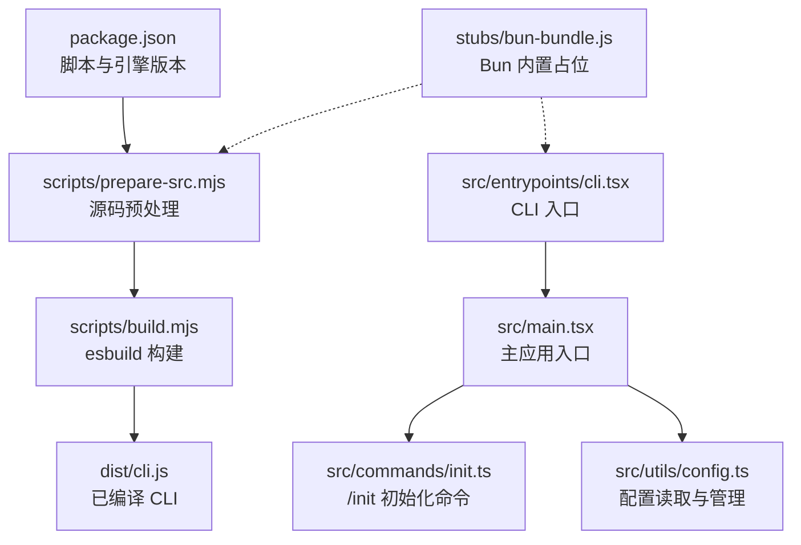
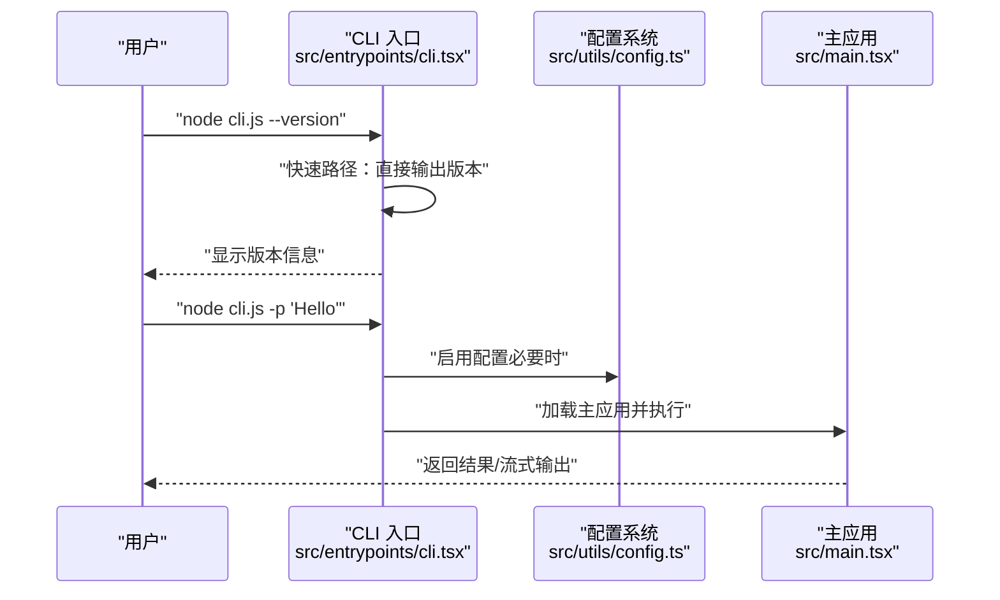
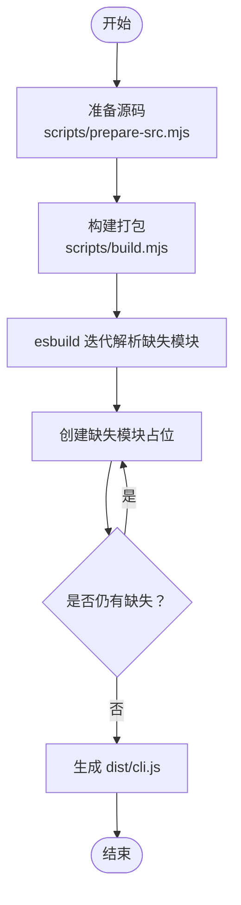
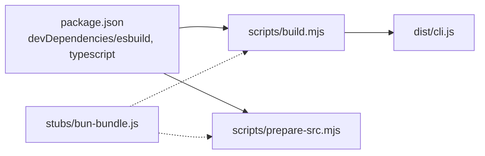

# 快速开始

<cite>
**本文引用的文件**
- [package.json](file://package.json)
- [QUICKSTART.md](file://QUICKSTART.md)
- [README.md](file://README.md)
- [scripts/build.mjs](file://scripts/build.mjs)
- [scripts/prepare-src.mjs](file://scripts/prepare-src.mjs)
- [src/entrypoints/cli.tsx](file://src/entrypoints/cli.tsx)
- [src/commands/init.ts](file://src/commands/init.ts)
- [src/utils/config.ts](file://src/utils/config.ts)
- [stubs/bun-bundle.js](file://stubs/bun-bundle.js)
</cite>

## 目录
1. [简介](#简介)
2. [项目结构](#项目结构)
3. [核心组件](#核心组件)
4. [架构总览](#架构总览)
5. [详细组件分析](#详细组件分析)
6. [依赖分析](#依赖分析)
7. [性能考虑](#性能考虑)
8. [故障排除指南](#故障排除指南)
9. [结论](#结论)
10. [附录](#附录)

## 简介
本指南面向首次接触 Claude Code 的用户与开发者，帮助你在本地完成安装、构建与运行，并快速体验 CLI 交互、创建首个会话与执行简单命令。文档涵盖：
- 系统要求与前置条件
- 两种安装方式：直接运行已编译 CLI 或从源码构建
- 基本使用示例（版本查询、非交互模式、登录）
- 常用配置项与环境变量
- 不同操作系统的注意事项
- 故障排除与常见问题

## 项目结构
该仓库为 Claude Code v2.1.88 的解包源码，包含完整的 TypeScript 源码、构建脚本与文档。关键目录与文件：
- scripts/：构建与准备脚本（esbuild 构建、源码预处理）
- src/entrypoints/cli.tsx：CLI 入口，负责解析参数、加载子系统与启动主循环
- src/commands/init.ts：初始化命令，用于生成 CLAUDE.md、技能与钩子
- src/utils/config.ts：全局与项目级配置读取与管理
- stubs/bun-bundle.js：Bun 编译期内置能力的占位实现，便于在 Node 环境下构建
- package.json：脚本与引擎版本定义

图表来源
- [package.json:1-21](file://package.json#L1-L21)
- [scripts/prepare-src.mjs:1-116](file://scripts/prepare-src.mjs#L1-L116)
- [scripts/build.mjs:1-246](file://scripts/build.mjs#L1-L246)
- [src/entrypoints/cli.tsx:1-303](file://src/entrypoints/cli.tsx#L1-L303)
- [src/commands/init.ts:1-257](file://src/commands/init.ts#L1-L257)
- [src/utils/config.ts:1-200](file://src/utils/config.ts#L1-L200)
- [stubs/bun-bundle.js:1-4](file://stubs/bun-bundle.js#L1-L4)

章节来源
- [README.md:250-380](file://README.md#L250-L380)
- [package.json:1-21](file://package.json#L1-L21)

## 核心组件
- CLI 入口与启动流程
  - CLI 入口在 src/entrypoints/cli.tsx，支持多种快速路径（版本查询、系统提示输出、桥接模式等），并在无特殊标志时加载主应用。
- 主应用与命令系统
  - 主应用入口在 src/main.tsx，负责初始化、加载命令、权限与工具系统、插件与技能等。
  - 初始化命令 /init 在 src/commands/init.ts，用于生成 CLAUDE.md、技能与钩子。
- 配置系统
  - 配置读取与管理在 src/utils/config.ts，支持全局与项目级配置、MCP 服务器、会话持久化等。

章节来源
- [src/entrypoints/cli.tsx:28-303](file://src/entrypoints/cli.tsx#L28-L303)
- [src/commands/init.ts:226-257](file://src/commands/init.ts#L226-L257)
- [src/utils/config.ts:183-200](file://src/utils/config.ts#L183-L200)

## 架构总览
CLI 启动流程概览（简化）：

图表来源
- [src/entrypoints/cli.tsx:36-42](file://src/entrypoints/cli.tsx#L36-L42)
- [src/entrypoints/cli.tsx:287-299](file://src/entrypoints/cli.tsx#L287-L299)
- [src/utils/config.ts:1-200](file://src/utils/config.ts#L1-L200)

## 详细组件分析

### 安装与构建（推荐：直接运行已编译 CLI）
- 适用场景：无需源码改动，快速试用或日常使用
- 步骤要点：
  - 已内置编译产物 dist/cli.js（通过 npm 包分发）
  - 运行前需设置认证凭据（ANTHROPIC_API_KEY 或先执行登录）
  - 支持非交互模式（-p 参数）

章节来源
- [QUICKSTART.md:7-22](file://QUICKSTART.md#L7-L22)
- [package.json:7-11](file://package.json#L7-L11)

### 从源码构建（最佳努力 esbuild 构建）
- 适用场景：需要修改源码、调试或自定义构建
- 系统要求：
  - Node.js 版本满足 engines.node（>= 18）
  - npm 版本建议 >= 9
- 构建步骤：
  - 安装 esbuild（脚本会自动检测并安装）
  - 执行构建脚本，esbuild 多轮迭代解析缺失模块并生成占位
  - 成功后可在 dist/cli.js 运行

图表来源
- [scripts/prepare-src.mjs:1-116](file://scripts/prepare-src.mjs#L1-L116)
- [scripts/build.mjs:140-229](file://scripts/build.mjs#L140-L229)

章节来源
- [QUICKSTART.md:23-87](file://QUICKSTART.md#L23-L87)
- [scripts/build.mjs:1-246](file://scripts/build.mjs#L1-L246)
- [scripts/prepare-src.mjs:1-116](file://scripts/prepare-src.mjs#L1-L116)

### CLI 使用示例
- 查询版本
  - 示例：node cli.js --version
- 非交互模式执行命令
  - 示例：node cli.js -p "Hello Claude"
- 登录（如需）
  - 示例：node cli.js login
- 全局安装后使用
  - 示例：claude --version

章节来源
- [QUICKSTART.md:11-19](file://QUICKSTART.md#L11-L19)
- [package.json:11-11](file://package.json#L11-L11)

### 初始化与首个会话
- 初始化项目知识库
  - 命令：/init（在交互式 REPL 中输入）
  - 功能：生成 CLAUDE.md、可选技能与钩子，引导团队与个人偏好配置
- 创建会话
  - 在交互式 REPL 中直接输入自然语言描述任务，系统将调用工具链与 Claude API 完成任务

章节来源
- [src/commands/init.ts:226-257](file://src/commands/init.ts#L226-L257)
- [README.md:449-496](file://README.md#L449-L496)

### 基本配置与环境变量
- 认证
  - 设置 ANTHROPIC_API_KEY 环境变量
- 远程模式内存限制（容器环境）
  - CLAUDE_CODE_REMOTE=true 时，NODE_OPTIONS 会注入最大堆大小参数
- 简化模式
  - --bare 会提前设置 CLAUDE_CODE_SIMPLE=1，影响特性门控
- 其他
  - 通过 src/utils/config.ts 管理全局与项目级配置（主题、通知渠道、MCP 服务器、会话持久化等）

章节来源
- [QUICKSTART.md:21-21](file://QUICKSTART.md#L21-L21)
- [src/entrypoints/cli.tsx:7-14](file://src/entrypoints/cli.tsx#L7-L14)
- [src/entrypoints/cli.tsx:283-285](file://src/entrypoints/cli.tsx#L283-L285)
- [src/utils/config.ts:183-200](file://src/utils/config.ts#L183-L200)

### 不同操作系统下的安装说明
- Linux/macOS/Windows 均可使用 Node.js >= 18 运行已编译 CLI
- 若选择从源码构建：
  - Windows 用户需确保 npm 与 esbuild 可用
  - 构建过程中可能遇到“缺少模块”的错误，脚本会自动创建占位；若仍有缺失，按提示手动补充

章节来源
- [package.json:13-15](file://package.json#L13-L15)
- [QUICKSTART.md:25-31](file://QUICKSTART.md#L25-L31)
- [scripts/build.mjs:175-192](file://scripts/build.mjs#L175-L192)

## 依赖分析
- 构建依赖
  - esbuild：用于打包 CLI
  - TypeScript：类型检查与源码准备
- 运行时依赖
  - Node.js >= 18（由 engines.node 指定）
  - 通过 stubs/bun-bundle.js 提供 Bun 编译期内置能力的占位，使源码能在 Node 环境下构建

图表来源
- [package.json:16-19](file://package.json#L16-L19)
- [scripts/build.mjs:134-164](file://scripts/build.mjs#L134-L164)
- [scripts/prepare-src.mjs:40-51](file://scripts/prepare-src.mjs#L40-L51)
- [stubs/bun-bundle.js:1-4](file://stubs/bun-bundle.js#L1-L4)

章节来源
- [package.json:16-19](file://package.json#L16-L19)
- [scripts/build.mjs:134-164](file://scripts/build.mjs#L134-L164)
- [scripts/prepare-src.mjs:40-51](file://scripts/prepare-src.mjs#L40-L51)

## 性能考虑
- 启动性能
  - CLI 入口提供多个快速路径（如 --version），避免不必要的模块加载
  - 主应用入口在启动早期并行预取系统信息，缩短整体启动时间
- 运行时性能
  - 通过配置系统与工具链的并行执行，提升任务吞吐
  - 会话持久化采用追加日志格式，兼顾可靠性与写入性能

章节来源
- [src/entrypoints/cli.tsx:36-42](file://src/entrypoints/cli.tsx#L36-L42)
- [src/main.tsx:11-21](file://src/main.tsx#L11-L21)

## 故障排除指南
- 无法找到 esbuild
  - 现象：构建时报错找不到 esbuild
  - 处理：脚本会自动安装 esbuild，若失败请检查网络与 npm 权限
- 构建后仍报“缺少模块”
  - 现象：esbuild 报错提示某些模块无法解析
  - 处理：脚本会收集缺失模块并创建占位；若仍有缺失，请参考“已知问题”部分的手动修复步骤
- 远程模式下内存不足
  - 现象：容器环境中出现 OOM
  - 处理：当 CLAUDE_CODE_REMOTE=true 时，脚本会自动设置 NODE_OPTIONS 的最大堆大小；可根据需要调整
- 认证失败
  - 现象：执行命令时报认证错误
  - 处理：设置 ANTHROPIC_API_KEY 或先执行登录命令

章节来源
- [scripts/build.mjs:44-50](file://scripts/build.mjs#L44-L50)
- [scripts/build.mjs:175-192](file://scripts/build.mjs#L175-L192)
- [src/entrypoints/cli.tsx:7-14](file://src/entrypoints/cli.tsx#L7-L14)
- [QUICKSTART.md:21-21](file://QUICKSTART.md#L21-L21)

## 结论
通过本指南，你可以：
- 快速以已编译 CLI 方式体验 Claude Code
- 在需要时从源码构建并进行定制
- 掌握基本的使用方法、配置与常见问题排查
建议在正式开发前先完成一次“从源码构建”的最佳努力流程，以便熟悉构建与调试过程。

## 附录

### 常用命令速查
- 查看版本：node cli.js --version
- 非交互执行：node cli.js -p "<你的提示>"
- 登录：node cli.js login
- 全局安装后：claude --version

章节来源
- [QUICKSTART.md:11-19](file://QUICKSTART.md#L11-L19)