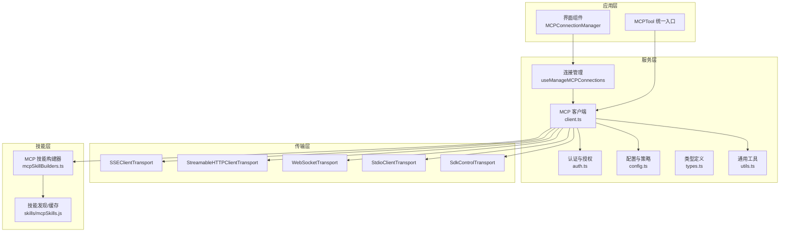
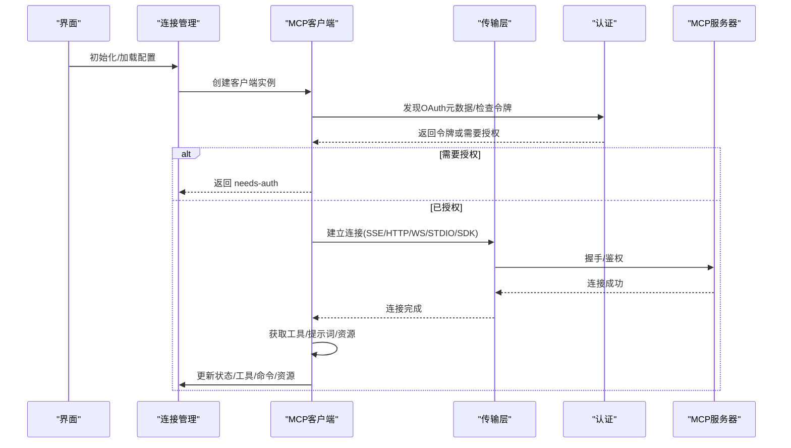
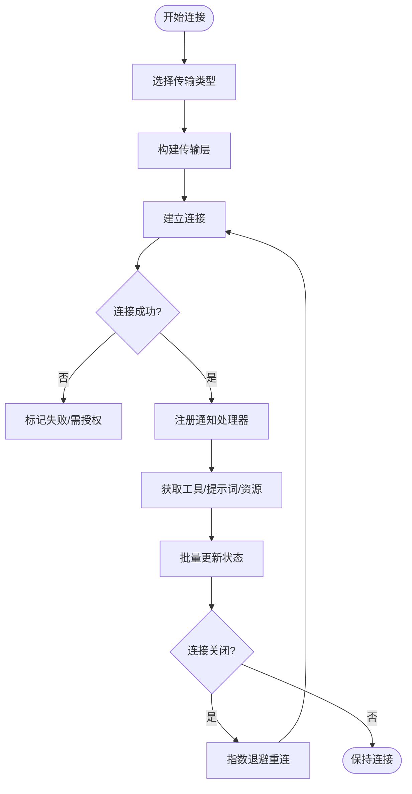
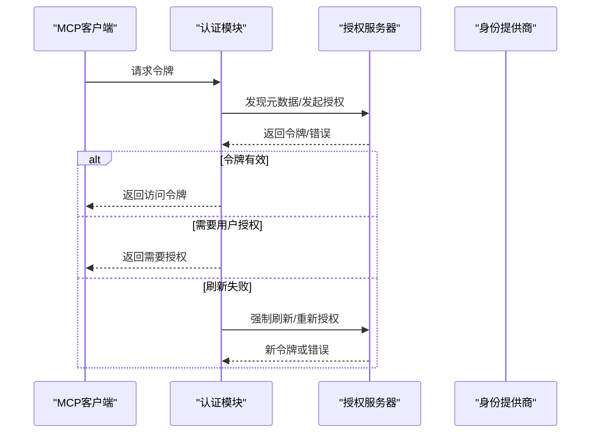
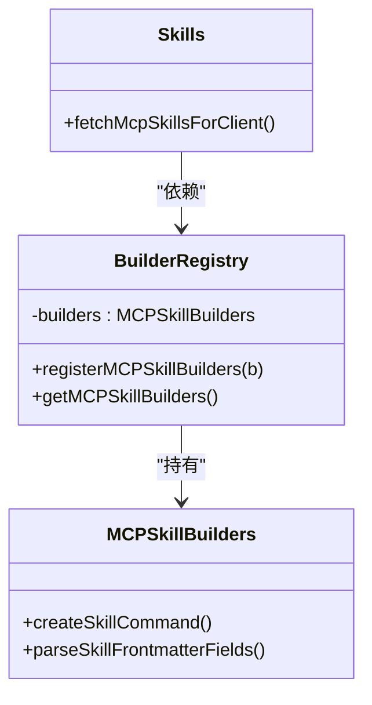
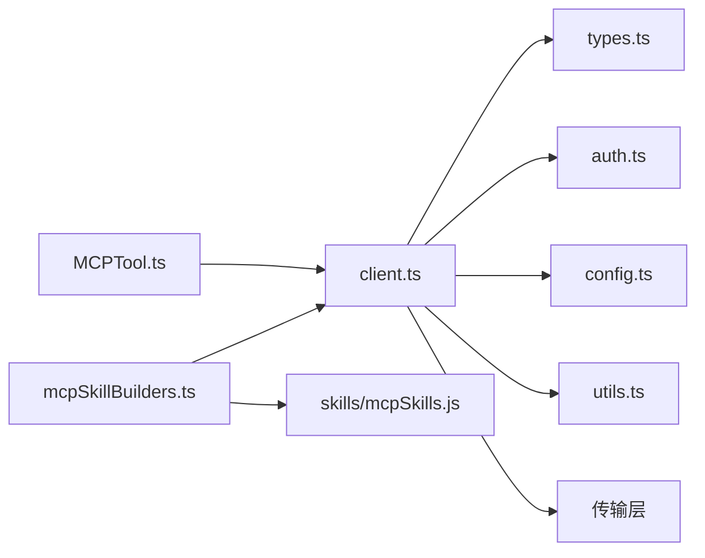

# MCP技能集成

<cite>
**本文档引用的文件**
- [src/services/mcp/client.ts](file://src/services/mcp/client.ts)
- [src/services/mcp/auth.ts](file://src/services/mcp/auth.ts)
- [src/services/mcp/types.ts](file://src/services/mcp/types.ts)
- [src/services/mcp/config.ts](file://src/services/mcp/config.ts)
- [src/services/mcp/useManageMCPConnections.ts](file://src/services/mcp/useManageMCPConnections.ts)
- [src/services/mcp/MCPConnectionManager.tsx](file://src/services/mcp/MCPConnectionManager.tsx)
- [src/services/mcp/utils.ts](file://src/services/mcp/utils.ts)
- [src/tools/MCPTool/MCPTool.ts](file://src/tools/MCPTool/MCPTool.ts)
- [src/skills/mcpSkillBuilders.ts](file://src/skills/mcpSkillBuilders.ts)
- [skills/mcpSkills.js](file://skills/mcpSkills.js)
- [src/services/mcp/mcpStringUtils.ts](file://src/services/mcp/mcpStringUtils.ts)
- [src/services/mcp/normalization.ts](file://src/services/mcp/normalization.ts)
- [src/services/mcp/headersHelper.ts](file://src/services/mcp/headersHelper.ts)
- [src/services/mcp/utils.ts](file://src/services/mcp/utils.ts)
- [src/utils/mcpValidation.ts](file://src/utils/mcpValidation.ts)
- [src/utils/mcpOutputStorage.ts](file://src/utils/mcpOutputStorage.ts)
- [src/utils/mcpWebSocketTransport.ts](file://src/utils/mcpWebSocketTransport.ts)
- [src/utils/http.ts](file://src/utils/http.ts)
- [src/utils/proxy.ts](file://src/utils/proxy.ts)
- [src/utils/mtls.ts](file://src/utils/mtls.ts)
- [src/utils/abortController.ts](file://src/utils/abortController.ts)
- [src/utils/sleep.ts](file://src/utils/sleep.ts)
- [src/utils/errors.ts](file://src/utils/errors.ts)
- [src/utils/log.ts](file://src/utils/log.ts)
- [src/utils/debug.ts](file://src/utils/debug.ts)
- [src/utils/auth.ts](file://src/utils/auth.ts)
- [src/utils/sessionIngressAuth.ts](file://src/utils/sessionIngressAuth.ts)
- [src/utils/ide.js](file://src/utils/ide.js)
- [src/utils/claudeInChrome/mcpServer.ts](file://src/utils/claudeInChrome/mcpServer.ts)
- [src/utils/computerUse/mcpServer.ts](file://src/utils/computerUse/mcpServer.ts)
- [src/services/mcp/claudeai.ts](file://src/services/mcp/claudeai.ts)
- [src/services/mcp/officialRegistry.ts](file://src/services/mcp/officialRegistry.ts)
- [src/services/mcp/xaa.ts](file://src/services/mcp/xaa.ts)
- [src/services/mcp/xaaIdpLogin.ts](file://src/services/mcp/xaaIdpLogin.ts)
- [src/services/mcp/oauthPort.ts](file://src/services/mcp/oauthPort.ts)
- [src/services/mcp/SdkControlTransport.ts](file://src/services/mcp/SdkControlTransport.ts)
- [src/services/mcp/InProcessTransport.ts](file://src/services/mcp/InProcessTransport.ts)
- [src/services/mcp/SdkControlTransport.ts](file://src/services/mcp/SdkControlTransport.ts)
- [src/services/mcp/InProcessTransport.ts](file://src/services/mcp/InProcessTransport.ts)
- [src/services/mcp/headersHelper.ts](file://src/services/mcp/headersHelper.ts)
- [src/services/mcp/normalization.ts](file://src/services/mcp/normalization.ts)
- [src/services/mcp/mcpStringUtils.ts](file://src/services/mcp/mcpStringUtils.ts)
- [src/services/mcp/utils.ts](file://src/services/mcp/utils.ts)
- [src/services/mcp/elicitationHandler.ts](file://src/services/mcp/elicitationHandler.ts)
- [src/services/mcp/channelPermissions.ts](file://src/services/mcp/channelPermissions.ts)
- [src/services/mcp/channelNotification.ts](file://src/services/mcp/channelNotification.ts)
- [src/services/mcp/envExpansion.ts](file://src/services/mcp/envExpansion.ts)
- [src/services/mcp/claudeai.ts](file://src/services/mcp/claudeai.ts)
- [src/services/mcp/officialRegistry.ts](file://src/services/mcp/officialRegistry.ts)
- [src/services/mcp/xaa.ts](file://src/services/mcp/xaa.ts)
- [src/services/mcp/xaaIdpLogin.ts](file://src/services/mcp/xaaIdpLogin.ts)
- [src/services/mcp/oauthPort.ts](file://src/services/mcp/oauthPort.ts)
- [src/services/mcp/SdkControlTransport.ts](file://src/services/mcp/SdkControlTransport.ts)
- [src/services/mcp/InProcessTransport.ts](file://src/services/mcp/InProcessTransport.ts)
- [src/services/mcp/headersHelper.ts](file://src/services/mcp/headersHelper.ts)
- [src/services/mcp/normalization.ts](file://src/services/mcp/normalization.ts)
- [src/services/mcp/mcpStringUtils.ts](file://src/services/mcp/mcpStringUtils.ts)
- [src/services/mcp/utils.ts](file://src/services/mcp/utils.ts)
- [src/services/mcp/elicitationHandler.ts](file://src/services/mcp/elicitationHandler.ts)
- [src/services/mcp/channelPermissions.ts](file://src/services/mcp/channelPermissions.ts)
- [src/services/mcp/channelNotification.ts](file://src/services/mcp/channelNotification.ts)
- [src/services/mcp/envExpansion.ts](file://src/services/mcp/envExpansion.ts)
- [src/services/mcp/claudeai.ts](file://src/services/mcp/claudeai.ts)
- [src/services/mcp/officialRegistry.ts](file://src/services/mcp/officialRegistry.ts)
- [src/services/mcp/xaa.ts](file://src/services/mcp/xaa.ts)
- [src/services/mcp/xaaIdpLogin.ts](file://src/services/mcp/xaaIdpLogin.ts)
- [src/services/mcp/oauthPort.ts](file://src/services/mcp/oauthPort.ts)
- [src/services/mcp/SdkControlTransport.ts](file://src/services/mcp/SdkControlTransport.ts)
- [src/services/mcp/InProcessTransport.ts](file://src/services/mcp/InProcessTransport.ts)
</cite>

## 目录
1. [简介](#简介)
2. [项目结构](#项目结构)
3. [核心组件](#核心组件)
4. [架构总览](#架构总览)
5. [详细组件分析](#详细组件分析)
6. [依赖关系分析](#依赖关系分析)
7. [性能考虑](#性能考虑)
8. [故障排除指南](#故障排除指南)
9. [结论](#结论)
10. [附录](#附录)

## 简介
本文件系统性阐述 Claude Code 中的 MCP（Model Context Protocol）技能集成机制，覆盖协议在技能系统中的作用、MCP 技能的发现、连接与管理流程、MCP 技能构建器的工作原理、与本地技能的统一管理、认证与授权流程、错误处理与重连机制，以及开发与调试实践和性能监控优化策略。目标是帮助开发者快速理解并高效扩展 MCP 技能生态。

## 项目结构
MCP 技能集成主要分布在以下模块：
- 服务层：MCP 客户端、认证、配置、连接管理、工具与资源同步等
- 工具层：MCPTool 统一入口，封装所有 MCP 能力调用
- 技能层：MCP 技能构建器注册与发现，技能索引与搜索
- 工具与资源：工具列表变更通知、资源变更通知、提示词/技能刷新
- 传输与适配：SSE/HTTP/WebSocket/SDK/STDIO 等多种传输适配
- 辅助能力：代理、mTLS、超时控制、输出存储、验证与日志

**图表来源**
- [src/services/mcp/MCPConnectionManager.tsx:38-72](file://src/services/mcp/MCPConnectionManager.tsx#L38-L72)
- [src/services/mcp/useManageMCPConnections.ts:143-146](file://src/services/mcp/useManageMCPConnections.ts#L143-L146)
- [src/services/mcp/client.ts:1-120](file://src/services/mcp/client.ts#L1-L120)
- [src/services/mcp/auth.ts:1-120](file://src/services/mcp/auth.ts#L1-L120)
- [src/services/mcp/config.ts:1-120](file://src/services/mcp/config.ts#L1-L120)
- [src/services/mcp/types.ts:1-120](file://src/services/mcp/types.ts#L1-L120)
- [src/services/mcp/utils.ts:1-120](file://src/services/mcp/utils.ts#L1-L120)
- [src/tools/MCPTool/MCPTool.ts:1-78](file://src/tools/MCPTool/MCPTool.ts#L1-L78)
- [src/skills/mcpSkillBuilders.ts:1-45](file://src/skills/mcpSkillBuilders.ts#L1-L45)
- [skills/mcpSkills.js:1-4](file://skills/mcpSkills.js#L1-L4)

**章节来源**
- [src/services/mcp/MCPConnectionManager.tsx:38-72](file://src/services/mcp/MCPConnectionManager.tsx#L38-L72)
- [src/services/mcp/useManageMCPConnections.ts:143-146](file://src/services/mcp/useManageMCPConnections.ts#L143-L146)
- [src/services/mcp/client.ts:1-120](file://src/services/mcp/client.ts#L1-L120)
- [src/services/mcp/auth.ts:1-120](file://src/services/mcp/auth.ts#L1-L120)
- [src/services/mcp/config.ts:1-120](file://src/services/mcp/config.ts#L1-L120)
- [src/services/mcp/types.ts:1-120](file://src/services/mcp/types.ts#L1-L120)
- [src/services/mcp/utils.ts:1-120](file://src/services/mcp/utils.ts#L1-L120)
- [src/tools/MCPTool/MCPTool.ts:1-78](file://src/tools/MCPTool/MCPTool.ts#L1-L78)
- [src/skills/mcpSkillBuilders.ts:1-45](file://src/skills/mcpSkillBuilders.ts#L1-L45)
- [skills/mcpSkills.js:1-4](file://skills/mcpSkills.js#L1-L4)

## 核心组件
- MCP 客户端：负责连接、传输、工具/提示词/资源获取、通知监听、会话过期检测与重连
- 认证与授权：OAuth 发现、令牌刷新、跨应用访问（XAA）、令牌撤销、步骤提升
- 配置与策略：企业策略、允许/拒绝清单、动态配置合并、去重与签名
- 连接管理：React Hook 管理连接生命周期、批量状态更新、自动重连、通道权限
- MCPTool：统一工具入口，屏蔽底层差异，支持进度渲染与结果截断
- 技能构建器：注册与获取 MCP 技能构建器，供技能发现使用
- 传输适配：SSE/HTTP/WebSocket/STDIO/SDK 多种传输，支持代理、mTLS、超时控制

**章节来源**
- [src/services/mcp/client.ts:1-200](file://src/services/mcp/client.ts#L1-L200)
- [src/services/mcp/auth.ts:1-200](file://src/services/mcp/auth.ts#L1-L200)
- [src/services/mcp/config.ts:1-200](file://src/services/mcp/config.ts#L1-L200)
- [src/services/mcp/useManageMCPConnections.ts:1-200](file://src/services/mcp/useManageMCPConnections.ts#L1-L200)
- [src/tools/MCPTool/MCPTool.ts:1-78](file://src/tools/MCPTool/MCPTool.ts#L1-L78)
- [src/skills/mcpSkillBuilders.ts:1-45](file://src/skills/mcpSkillBuilders.ts#L1-L45)

## 架构总览
MCP 技能集成采用“服务-传输-工具-技能”分层架构：
- 服务层：集中处理连接、认证、配置、策略与状态管理
- 传输层：抽象不同协议与网络栈，统一封装请求/响应与事件
- 工具层：统一 MCP 能力调用接口，支持进度与结果渲染
- 技能层：通过构建器与资源发现，将远端能力转化为本地可用的技能

**图表来源**
- [src/services/mcp/client.ts:595-800](file://src/services/mcp/client.ts#L595-L800)
- [src/services/mcp/auth.ts:256-311](file://src/services/mcp/auth.ts#L256-L311)
- [src/services/mcp/useManageMCPConnections.ts:310-380](file://src/services/mcp/useManageMCPConnections.ts#L310-L380)

**章节来源**
- [src/services/mcp/client.ts:595-800](file://src/services/mcp/client.ts#L595-L800)
- [src/services/mcp/auth.ts:256-311](file://src/services/mcp/auth.ts#L256-L311)
- [src/services/mcp/useManageMCPConnections.ts:310-380](file://src/services/mcp/useManageMCPConnections.ts#L310-L380)

## 详细组件分析

### MCP 客户端与连接管理
- 连接尝试：根据配置选择传输类型，构造传输层，建立连接并返回连接状态
- 会话过期检测：识别“会话未找到”错误，触发清理与重连
- 自动重连：对非本地传输采用指数退避重连，支持取消与最大次数限制
- 状态更新：批量更新客户端、工具、命令、资源，避免频繁渲染抖动
- 通知监听：订阅工具/提示词/资源变更通知，动态刷新

**图表来源**
- [src/services/mcp/client.ts:595-800](file://src/services/mcp/client.ts#L595-L800)
- [src/services/mcp/useManageMCPConnections.ts:333-468](file://src/services/mcp/useManageMCPConnections.ts#L333-L468)

**章节来源**
- [src/services/mcp/client.ts:595-800](file://src/services/mcp/client.ts#L595-L800)
- [src/services/mcp/useManageMCPConnections.ts:333-468](file://src/services/mcp/useManageMCPConnections.ts#L333-L468)

### 认证与授权流程
- OAuth 元数据发现：支持配置化元数据 URL 或按规范自动发现
- 令牌刷新：带超时控制的刷新封装，标准化非标准错误码
- 令牌撤销：优先 RFC 7009，回退到 Bearer 方案；支持保留步骤提升状态
- XAA（跨应用访问）：一次 IdP 登录复用，执行 RFC 8693+jwt-bearer 交换
- 步骤提升：缓存发现状态与范围，减少重复探测成本
- 授权失败处理：记录需求授权状态，触发 UI 提示与缓存

**图表来源**
- [src/services/mcp/auth.ts:256-311](file://src/services/mcp/auth.ts#L256-L311)
- [src/services/mcp/auth.ts:664-800](file://src/services/mcp/auth.ts#L664-L800)
- [src/services/mcp/xaa.ts:1-200](file://src/services/mcp/xaa.ts#L1-L200)
- [src/services/mcp/xaaIdpLogin.ts:1-200](file://src/services/mcp/xaaIdpLogin.ts#L1-L200)

**章节来源**
- [src/services/mcp/auth.ts:256-311](file://src/services/mcp/auth.ts#L256-L311)
- [src/services/mcp/auth.ts:664-800](file://src/services/mcp/auth.ts#L664-L800)
- [src/services/mcp/xaa.ts:1-200](file://src/services/mcp/xaa.ts#L1-L200)
- [src/services/mcp/xaaIdpLogin.ts:1-200](file://src/services/mcp/xaaIdpLogin.ts#L1-L200)

### MCP 技能构建器与技能发现
- 注册机制：在启动阶段注册 MCP 技能构建器，避免循环依赖
- 获取机制：延迟抛出异常以提示尚未初始化，确保顺序正确
- 技能发现：通过资源与提示词组合生成技能集合，支持缓存与失效
- 与本地技能统一：技能命名空间与本地技能隔离，避免冲突

**图表来源**
- [src/skills/mcpSkillBuilders.ts:26-44](file://src/skills/mcpSkillBuilders.ts#L26-L44)
- [skills/mcpSkills.js:1-4](file://skills/mcpSkills.js#L1-L4)

**章节来源**
- [src/skills/mcpSkillBuilders.ts:26-44](file://src/skills/mcpSkillBuilders.ts#L26-L44)
- [skills/mcpSkills.js:1-4](file://skills/mcpSkills.js#L1-L4)

### MCP 技能与本地技能的统一管理
- 命名空间：MCP 技能与本地技能使用不同前缀，避免冲突
- 过滤与排除：按服务器名称过滤工具/命令/资源，支持批量排除
- 去重与签名：基于命令/URL 的签名去重，避免插件重复加载
- 动态配置：支持动态注入配置，与静态配置合并，保持一致性

**章节来源**
- [src/services/mcp/utils.ts:39-149](file://src/services/mcp/utils.ts#L39-L149)
- [src/services/mcp/config.ts:223-266](file://src/services/mcp/config.ts#L223-L266)

### 传输适配与网络栈
- SSE/HTTP/WebSocket/STDIO/SDK：统一抽象，支持代理、mTLS、超时控制
- 用户代理与头部：统一 UA 设置，支持动态头部与环境变量展开
- 输出存储与验证：大输出持久化、内容大小估算与截断
- 会话入口：支持通过会话入口 JWT 直接连接远端服务器

**章节来源**
- [src/services/mcp/client.ts:619-800](file://src/services/mcp/client.ts#L619-L800)
- [src/utils/mcpOutputStorage.ts:1-200](file://src/utils/mcpOutputStorage.ts#L1-L200)
- [src/utils/mcpValidation.ts:1-200](file://src/utils/mcpValidation.ts#L1-L200)
- [src/utils/mcpWebSocketTransport.ts:1-200](file://src/utils/mcpWebSocketTransport.ts#L1-L200)
- [src/utils/http.ts:1-200](file://src/utils/http.ts#L1-L200)
- [src/utils/proxy.ts:1-200](file://src/utils/proxy.ts#L1-L200)
- [src/utils/mtls.ts:1-200](file://src/utils/mtls.ts#L1-L200)

### 错误处理与重连机制
- 会话过期：识别特定错误码，触发清理与重连
- 需要授权：记录授权需求，写入缓存，等待用户操作
- 自动重连：指数退避，最大重试次数，支持取消
- 批量更新：防抖合并状态更新，降低渲染压力

**章节来源**
- [src/services/mcp/client.ts:193-206](file://src/services/mcp/client.ts#L193-L206)
- [src/services/mcp/client.ts:340-361](file://src/services/mcp/client.ts#L340-L361)
- [src/services/mcp/useManageMCPConnections.ts:371-464](file://src/services/mcp/useManageMCPConnections.ts#L371-L464)

## 依赖关系分析
- 模块耦合：客户端依赖传输层、认证、配置、工具与资源获取
- 反向依赖：工具层依赖客户端，技能层依赖构建器与客户端
- 外部依赖：SDK 类型、传输抽象、OAuth 规范、代理与 mTLS 库
- 循环依赖规避：技能构建器注册为叶子节点，避免依赖闭环

**图表来源**
- [src/services/mcp/client.ts:1-120](file://src/services/mcp/client.ts#L1-L120)
- [src/tools/MCPTool/MCPTool.ts:1-78](file://src/tools/MCPTool/MCPTool.ts#L1-L78)
- [src/skills/mcpSkillBuilders.ts:1-45](file://src/skills/mcpSkillBuilders.ts#L1-L45)
- [skills/mcpSkills.js:1-4](file://skills/mcpSkills.js#L1-L4)

**章节来源**
- [src/services/mcp/client.ts:1-120](file://src/services/mcp/client.ts#L1-L120)
- [src/tools/MCPTool/MCPTool.ts:1-78](file://src/tools/MCPTool/MCPTool.ts#L1-L78)
- [src/skills/mcpSkillBuilders.ts:1-45](file://src/skills/mcpSkillBuilders.ts#L1-L45)
- [skills/mcpSkills.js:1-4](file://skills/mcpSkills.js#L1-L4)

## 性能考虑
- 连接批量化：批量大小可通过环境变量配置，平衡并发与资源占用
- 缓存与去重：工具/提示词/资源缓存，签名去重避免重复加载
- 超时与内存：避免单次超时信号长期存活导致内存泄漏，使用独立定时器
- 输出截断：对大输出进行估算与截断，防止内存膨胀
- 传输优化：SSE/HTTP/WebSocket 各有适用场景，合理选择以降低延迟

**章节来源**
- [src/services/mcp/client.ts:492-550](file://src/services/mcp/client.ts#L492-L550)
- [src/utils/mcpValidation.ts:1-200](file://src/utils/mcpValidation.ts#L1-L200)
- [src/services/mcp/client.ts:552-561](file://src/services/mcp/client.ts#L552-L561)

## 故障排除指南
- 401/403 授权问题：检查令牌是否过期或缺失，必要时触发强制刷新
- 会话未找到：识别特定错误码，清理缓存后重连
- 代理与 mTLS：确认代理配置与证书设置，避免握手失败
- 日志与调试：启用调试日志，定位传输层与认证层问题
- 重连失败：检查网络稳定性与服务器可达性，调整重连参数

**章节来源**
- [src/services/mcp/client.ts:340-422](file://src/services/mcp/client.ts#L340-L422)
- [src/services/mcp/client.ts:193-206](file://src/services/mcp/client.ts#L193-L206)
- [src/utils/proxy.ts:1-200](file://src/utils/proxy.ts#L1-L200)
- [src/utils/mtls.ts:1-200](file://src/utils/mtls.ts#L1-L200)
- [src/utils/log.ts:1-200](file://src/utils/log.ts#L1-L200)

## 结论
MCP 技能集成通过清晰的服务-传输-工具-技能分层，实现了对多协议、多场景的统一接入。借助严格的认证授权、完善的错误处理与重连机制、以及与本地技能的统一管理，系统在保证安全性的同时提供了良好的可扩展性与用户体验。建议在开发新 MCP 技能时遵循现有命名规范与传输选择策略，并充分利用缓存与批量化机制以获得最佳性能。

## 附录
- 开发与调试建议
  - 使用调试日志定位问题，关注传输层与认证层
  - 合理设置超时与批量化参数，避免阻塞与资源浪费
  - 在本地与远端分别测试，确保兼容性
- 性能监控要点
  - 关注连接成功率、重连次数与平均延迟
  - 监控工具/资源获取耗时与缓存命中率
  - 大输出场景下注意内存与磁盘占用