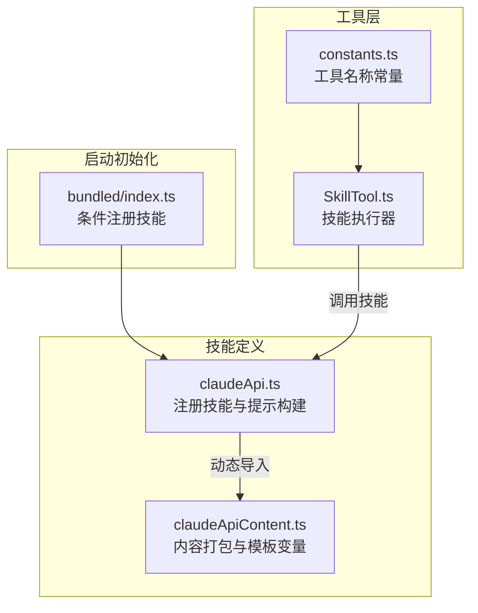
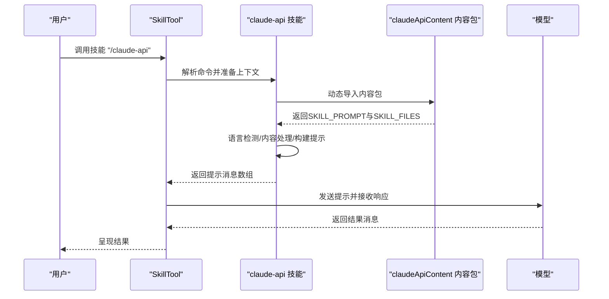
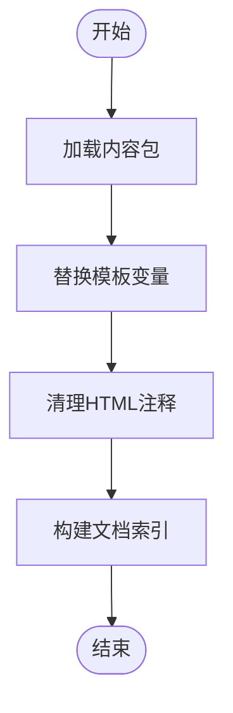
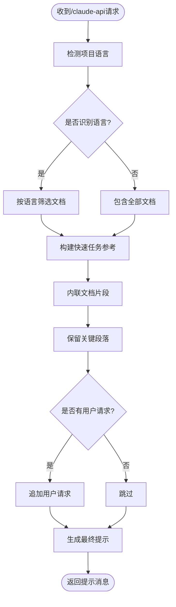
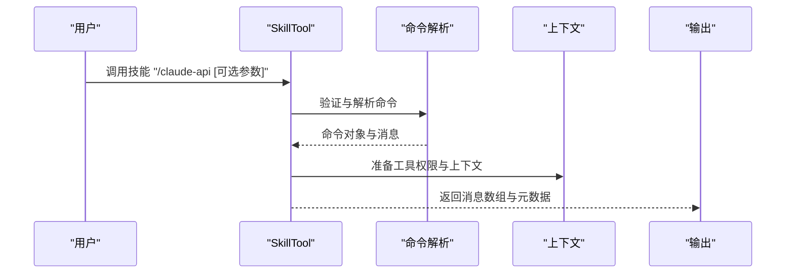
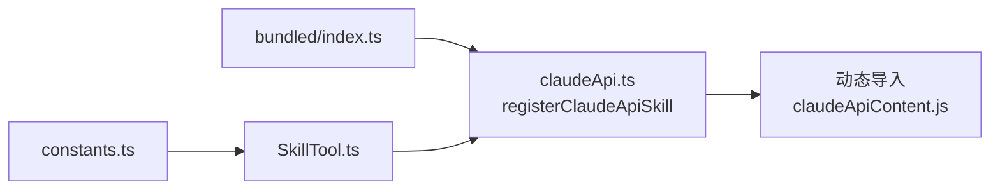

# Claude API内容技能 (claudeApiContent)

<cite>
**本文档引用的文件**
- [claudeApiContent.ts](file://src/skills/bundled/claudeApiContent.ts)
- [claudeApi.ts](file://src/skills/bundled/claudeApi.ts)
- [index.ts](file://src/skills/bundled/index.ts)
- [SkillTool.ts](file://src/tools/SkillTool/SkillTool.ts)
- [constants.ts](file://src/tools/SkillTool/constants.ts)
</cite>

## 目录
1. [简介](#简介)
2. [项目结构](#项目结构)
3. [核心组件](#核心组件)
4. [架构总览](#架构总览)
5. [详细组件分析](#详细组件分析)
6. [依赖关系分析](#依赖关系分析)
7. [性能考量](#性能考量)
8. [故障排除指南](#故障排除指南)
9. [结论](#结论)
10. [附录](#附录)

## 简介
本文件面向Claude Code的Claude API内容技能（claudeApiContent），系统性阐述其特殊用途、实现机制与集成方式。该技能的核心目标是将多语言的Claude API官方文档以结构化、可检索的方式内嵌到Claude的上下文中，帮助用户在构建基于Claude API的应用时快速定位正确的概念、用法与最佳实践。

与Claude API技能（registerClaudeApiSkill）的关系与区别：
- 内容技能（claudeApiContent）：负责打包与注入文档内容，提供模板变量替换、HTML注释清理、按语言筛选等预处理能力；它本身不直接触发，而是被其他技能（如claude-api技能）在调用时按需加载并使用。
- Claude API技能（registerClaudeApiSkill）：是一个可被用户主动触发或由系统自动触发的技能，负责检测项目语言、选择合适的文档集合、构建最终提示词，并通过SkillTool执行。

## 项目结构
Claude API内容技能位于skills/bundled目录下，采用“内容打包 + 按需加载”的设计：
- 内容打包：claudeApiContent.ts将各语言的API文档以字符串形式内联打包，形成一个可直接使用的文档字典。
- 技能注册：claudeApi.ts注册一个名为“claude-api”的技能，该技能在运行时动态导入内容包并根据项目语言生成定制化提示。
- 启动初始化：bundled/index.ts在启动时按特性开关注册该技能。

**图表来源**
- [claudeApi.ts:180-196](file://src/skills/bundled/claudeApi.ts#L180-L196)
- [claudeApiContent.ts:1-76](file://src/skills/bundled/claudeApiContent.ts#L1-L76)
- [index.ts:64-69](file://src/skills/bundled/index.ts#L64-L69)
- [SkillTool.ts:331-329](file://src/tools/SkillTool/SkillTool.ts#L331-L329)
- [constants.ts:1-1](file://src/tools/SkillTool/constants.ts#L1-L1)

**章节来源**
- [claudeApi.ts:1-197](file://src/skills/bundled/claudeApi.ts#L1-L197)
- [claudeApiContent.ts:1-76](file://src/skills/bundled/claudeApiContent.ts#L1-L76)
- [index.ts:64-69](file://src/skills/bundled/index.ts#L64-L69)

## 核心组件
- 内容打包模块（claudeApiContent.ts）
  - 负责将多语言文档（Python、TypeScript、Java、Go、Ruby、C#、PHP、Curl等）与共享主题（错误码、模型列表、提示缓存、工具使用概念、实时源）以字符串形式内联打包。
  - 提供模板变量映射（SKILL_MODEL_VARS），用于在运行时替换文档中的占位符。
  - 暴露SKILL_PROMPT与SKILL_FILES，作为技能构建提示的基础。
- 技能注册与提示构建（claudeApi.ts）
  - 注册名为“claude-api”的技能，定义触发条件、允许工具集与用户可触发性。
  - 实现语言检测逻辑，按检测到的语言筛选文档集合。
  - 提供内容处理函数（清理HTML注释、模板变量替换）、内联引用构建与提示词拼装。
  - 在getPromptForCommand中按需动态导入内容包并生成最终提示。
- 启动初始化（bundled/index.ts）
  - 条件注册“claude-api”技能，受特性开关控制。
- 技能执行器（SkillTool.ts）
  - 统一的技能调用入口，支持权限校验、参数验证、fork子代理执行、进度上报等。
  - 与claude-api技能配合，完成从命令解析到消息返回的完整流程。

**章节来源**
- [claudeApiContent.ts:31-45](file://src/skills/bundled/claudeApiContent.ts#L31-L45)
- [claudeApiContent.ts:47-75](file://src/skills/bundled/claudeApiContent.ts#L47-L75)
- [claudeApi.ts:180-196](file://src/skills/bundled/claudeApi.ts#L180-L196)
- [claudeApi.ts:30-53](file://src/skills/bundled/claudeApi.ts#L30-L53)
- [claudeApi.ts:64-79](file://src/skills/bundled/claudeApi.ts#L64-L79)
- [claudeApi.ts:81-94](file://src/skills/bundled/claudeApi.ts#L81-L94)
- [claudeApi.ts:132-178](file://src/skills/bundled/claudeApi.ts#L132-L178)
- [index.ts:64-69](file://src/skills/bundled/index.ts#L64-L69)
- [SkillTool.ts:354-430](file://src/tools/SkillTool/SkillTool.ts#L354-L430)
- [SkillTool.ts:580-766](file://src/tools/SkillTool/SkillTool.ts#L580-L766)

## 架构总览
下图展示了从用户触发到最终提示生成与执行的关键路径，突出内容技能与API技能之间的协作关系：

**图表来源**
- [claudeApi.ts:189-194](file://src/skills/bundled/claudeApi.ts#L189-L194)
- [SkillTool.ts:634-647](file://src/tools/SkillTool/SkillTool.ts#L634-L647)
- [SkillTool.ts:756-774](file://src/tools/SkillTool/SkillTool.ts#L756-L774)

## 详细组件分析

### 内容技能（claudeApiContent.ts）
- 数据结构
  - SKILL_MODEL_VARS：模板变量映射，键为占位符名称，值为具体模型标识或名称。
  - SKILL_PROMPT：技能主提示模板。
  - SKILL_FILES：文档索引，键为相对路径，值为对应Markdown内容。
- 处理逻辑
  - 模板变量替换：将文档中的双花括号占位符替换为SKILL_MODEL_VARS中的对应值。
  - HTML注释清理：循环移除所有HTML注释块，确保提示词简洁清晰。
- 复杂度与性能
  - 单次替换复杂度近似O(n)，其中n为文档长度；多次文档处理为O(k·n)。
  - 通过按需导入避免在启动时占用内存，降低冷启动成本。

**图表来源**
- [claudeApiContent.ts:31-45](file://src/skills/bundled/claudeApiContent.ts#L31-L45)
- [claudeApiContent.ts:47-75](file://src/skills/bundled/claudeApiContent.ts#L47-L75)

**章节来源**
- [claudeApiContent.ts:1-76](file://src/skills/bundled/claudeApiContent.ts#L1-L76)

### Claude API技能（claudeApi.ts）
- 触发与描述
  - 技能名称：“claude-api”
  - 描述：用于使用Claude API或Anthropic SDK构建应用；具备明确的触发条件与工具限制。
- 语言检测
  - 基于项目根目录的文件特征（扩展名、配置文件等）识别语言，若无法识别则回退到全量文档。
- 文档选择与提示构建
  - 按语言筛选文档集合，构建“快速任务参考”与“包含的文档”两部分提示。
  - 保留“何时使用WebFetch”与“常见陷阱”等关键段落，增强实用性。
- 动态导入与延迟加载
  - 仅在用户调用时才动态导入内容包，避免不必要的内存占用。

**图表来源**
- [claudeApi.ts:30-53](file://src/skills/bundled/claudeApi.ts#L30-L53)
- [claudeApi.ts:55-62](file://src/skills/bundled/claudeApi.ts#L55-L62)
- [claudeApi.ts:132-178](file://src/skills/bundled/claudeApi.ts#L132-L178)

**章节来源**
- [claudeApi.ts:180-196](file://src/skills/bundled/claudeApi.ts#L180-L196)
- [claudeApi.ts:19-28](file://src/skills/bundled/claudeApi.ts#L19-L28)
- [claudeApi.ts:132-178](file://src/skills/bundled/claudeApi.ts#L132-L178)

### 技能执行器（SkillTool.ts）
- 输入输出与参数
  - 输入：skill（技能名）、args（可选参数）
  - 输出：成功状态、命令名、工具许可列表（可选）、模型覆盖（可选）、执行状态（inline/forked）等。
- 执行流程
  - 参数验证：检查技能名格式、是否存在、是否允许模型调用、是否为提示型技能。
  - 权限检查：支持显式允许/拒绝规则、前缀匹配、自动放行安全属性技能。
  - 执行策略：若技能声明为fork上下文，则以子代理方式执行；否则直接扩展为消息并返回。
  - 进度上报：对工具使用消息进行进度通知，便于UI反馈。
- 与claude-api技能的衔接
  - SkillTool在调用前会解析命令、准备上下文、记录遥测信息，并将生成的消息数组返回给调用方。

**图表来源**
- [SkillTool.ts:354-430](file://src/tools/SkillTool/SkillTool.ts#L354-L430)
- [SkillTool.ts:580-766](file://src/tools/SkillTool/SkillTool.ts#L580-L766)

**章节来源**
- [SkillTool.ts:291-329](file://src/tools/SkillTool/SkillTool.ts#L291-L329)
- [SkillTool.ts:354-430](file://src/tools/SkillTool/SkillTool.ts#L354-L430)
- [SkillTool.ts:580-766](file://src/tools/SkillTool/SkillTool.ts#L580-L766)

## 依赖关系分析
- 组件耦合
  - claudeApi.ts依赖claudeApiContent.ts提供的内容与模板变量。
  - bundled/index.ts在启动时按特性开关注册claudeApi.ts。
  - SkillTool.ts作为统一入口，与所有技能（包括claude-api）交互。
- 外部依赖
  - 文件系统读取用于语言检测（readdir）。
  - 动态导入用于延迟加载内容包，避免冷启动开销。
- 循环依赖
  - 通过模块拆分与动态导入避免直接循环依赖。

**图表来源**
- [index.ts:64-69](file://src/skills/bundled/index.ts#L64-L69)
- [claudeApi.ts:189-190](file://src/skills/bundled/claudeApi.ts#L189-L190)
- [SkillTool.ts:331-329](file://src/tools/SkillTool/SkillTool.ts#L331-L329)
- [constants.ts:1-1](file://src/tools/SkillTool/constants.ts#L1-L1)

**章节来源**
- [index.ts:64-69](file://src/skills/bundled/index.ts#L64-L69)
- [claudeApi.ts:189-190](file://src/skills/bundled/claudeApi.ts#L189-L190)
- [SkillTool.ts:331-329](file://src/tools/SkillTool/SkillTool.ts#L331-L329)

## 性能考量
- 延迟加载与按需导入
  - 内容包仅在用户调用“/claude-api”时导入，显著减少启动时内存占用。
- 文档处理优化
  - 模板变量替换与HTML注释清理均为线性复杂度，适合大体量文档。
- 语言检测
  - 通过扫描根目录文件特征进行判断，避免深度遍历，时间复杂度较低。
- 执行策略
  - 对于非fork型技能，SkillTool直接扩展消息返回，避免额外代理开销。

[本节为通用性能讨论，无需特定文件来源]

## 故障排除指南
- 技能不可用或未触发
  - 确认特性开关已启用，且bundled/index.ts中已注册“claude-api”技能。
  - 检查触发条件：当代码导入Anthropic SDK或用户询问使用Claude API/Agent SDK时应触发。
- 语言检测失败
  - 若项目缺少典型文件（如package.json、requirements.txt等），可能导致语言识别为null，此时将回退到全量文档。
- 模板变量未生效
  - 确保SKILL_MODEL_VARS中的键与文档中的占位符一致；内容技能会在构建提示前进行替换。
- 提示词过大或上下文溢出
  - 可通过“长对话压缩”等机制（文档中提及）减少上下文长度，或分段处理。
- 权限问题
  - 若被权限规则拒绝，可通过本地设置添加允许规则或使用前缀匹配（如“/claude-api:*”）。

**章节来源**
- [index.ts:64-69](file://src/skills/bundled/index.ts#L64-L69)
- [claudeApi.ts:180-187](file://src/skills/bundled/claudeApi.ts#L180-L187)
- [claudeApi.ts:30-53](file://src/skills/bundled/claudeApi.ts#L30-L53)
- [SkillTool.ts:432-578](file://src/tools/SkillTool/SkillTool.ts#L432-L578)

## 结论
Claude API内容技能（claudeApiContent）通过“内容打包 + 模板变量替换 + HTML注释清理”的方式，为Claude API技能提供了高质量、可检索的文档基础。结合按需导入与语言检测机制，该体系在保证实用性的同时兼顾性能与可维护性。SkillTool进一步统一了技能执行流程，确保从命令解析到消息返回的顺畅衔接。对于开发者而言，理解这两者的协作关系有助于更高效地利用Claude API技能进行应用开发与问题排查。

[本节为总结性内容，无需特定文件来源]

## 附录

### 输入输出格式与配置选项
- 输入
  - 技能名：固定为“claude-api”
  - 参数：可选的用户请求文本（例如具体问题或任务描述）
- 输出
  - 成功标志与命令名
  - 工具许可列表（可选）
  - 模型覆盖（可选）
  - 执行状态：inline 或 forked
- 配置选项
  - 模板变量：SKILL_MODEL_VARS（模型ID/名称映射）
  - 文档索引：SKILL_FILES（路径到内容的映射）

**章节来源**
- [SkillTool.ts:291-329](file://src/tools/SkillTool/SkillTool.ts#L291-L329)
- [SkillTool.ts:301-326](file://src/tools/SkillTool/SkillTool.ts#L301-L326)
- [claudeApiContent.ts:31-45](file://src/skills/bundled/claudeApiContent.ts#L31-L45)
- [claudeApiContent.ts:47-75](file://src/skills/bundled/claudeApiContent.ts#L47-L75)

### 使用场景与示例
- 快速上手
  - 场景：首次接入Claude API，需要了解基本概念与SDK使用方法
  - 步骤：调用“/claude-api”，技能将按语言筛选并内联相关文档，提供“快速任务参考”
- 实时流式响应
  - 场景：构建聊天界面或实时响应显示
  - 步骤：在“快速任务参考”指引下，结合streaming文档片段进行实现
- 长对话与上下文管理
  - 场景：长时间对话可能超出上下文窗口
  - 步骤：参考文档中的“压缩”建议，对历史消息进行精简
- 提示缓存优化
  - 场景：希望提升缓存命中率或诊断低命中率问题
  - 步骤：结合shared/prompt-caching.md与对应语言README进行优化
- 工具调用与Agent
  - 场景：实现函数调用、工具使用或Agent能力
  - 步骤：参考shared/tool-use-concepts.md与对应语言的tool-use.md
- 批处理与文件上传
  - 场景：非低延迟场景下的批量处理或跨请求文件上传
  - 步骤：参考对应语言的batches.md与files-api.md
- Agent SDK（Python/TypeScript）
  - 场景：使用内置工具（文件/网络/终端）的Agent
  - 步骤：参考agent-sdk的README与patterns.md
- 错误处理
  - 场景：遇到错误码或异常情况
  - 步骤：参考shared/error-codes.md进行排查
- 最新文档
  - 场景：需要获取线上最新文档
  - 步骤：参考shared/live-sources.md提供的URL

**章节来源**
- [claudeApi.ts:96-130](file://src/skills/bundled/claudeApi.ts#L96-L130)
- [claudeApi.ts:132-178](file://src/skills/bundled/claudeApi.ts#L132-L178)