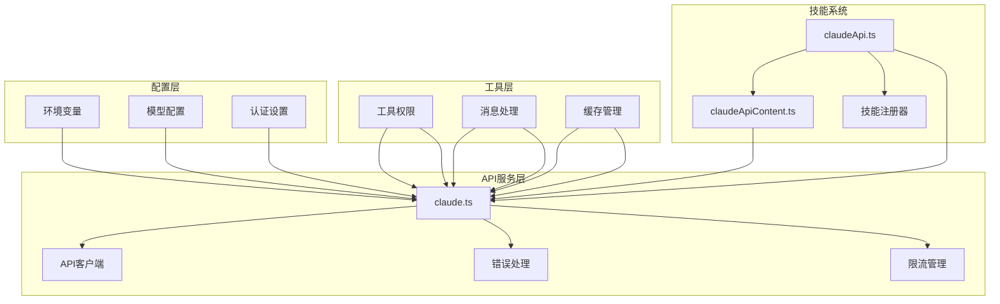
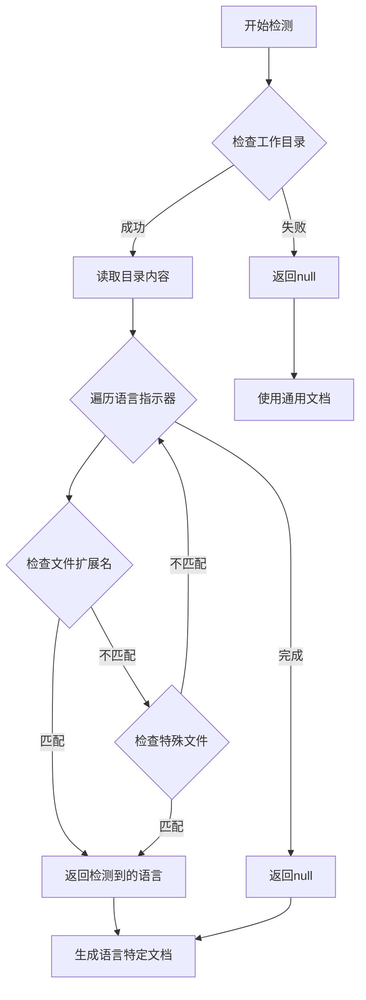
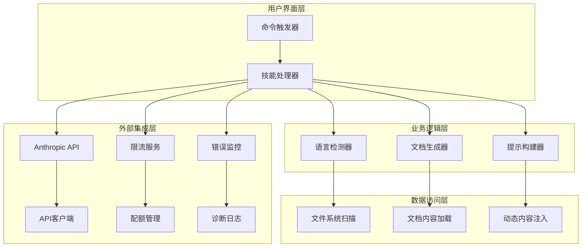
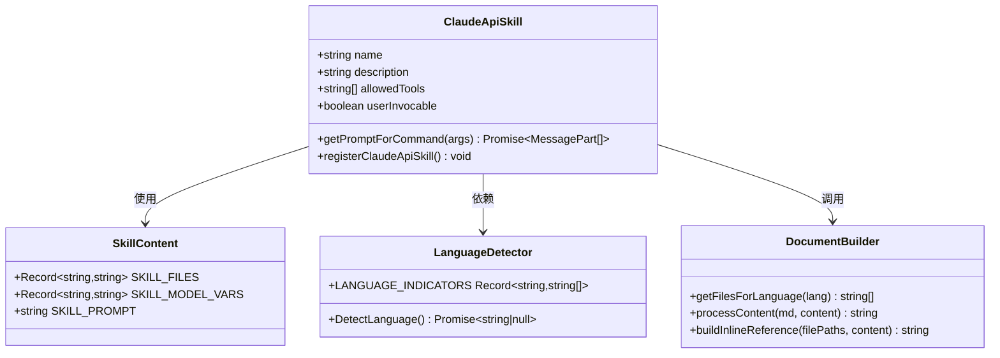
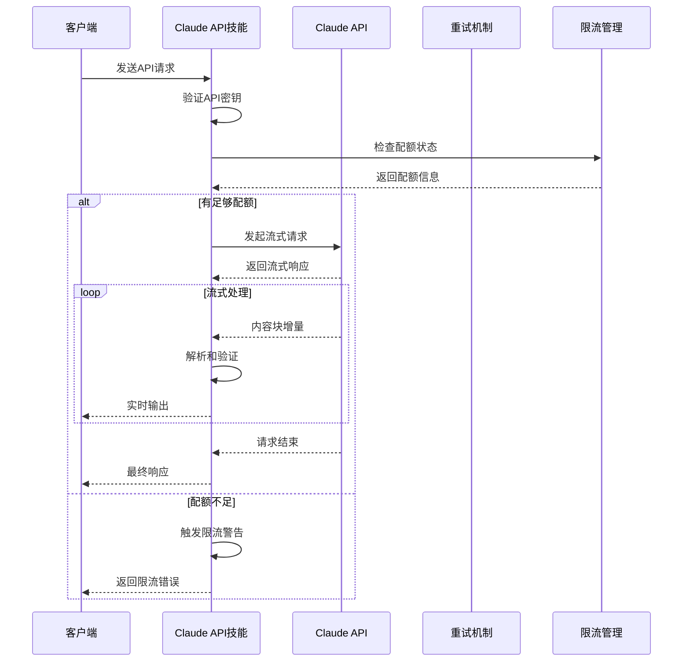
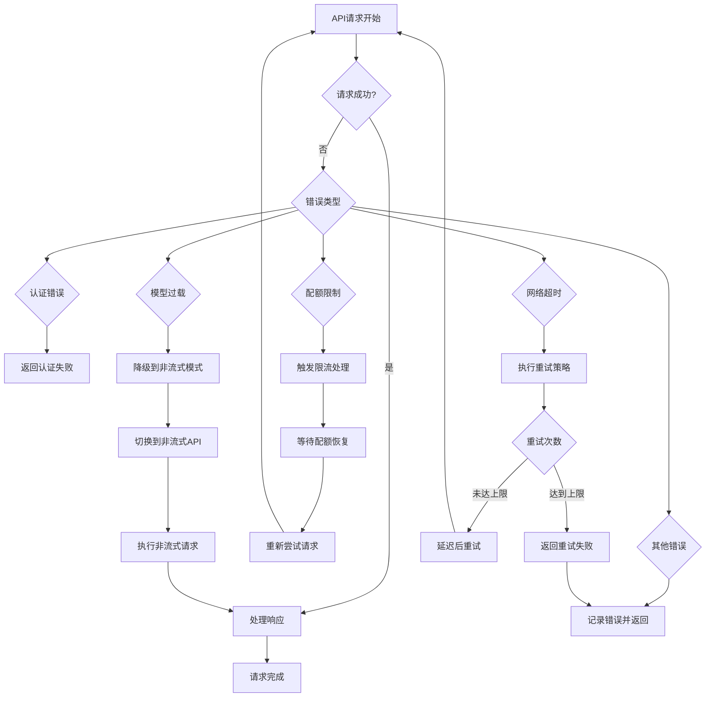
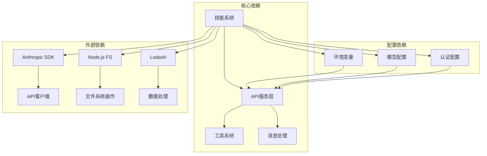
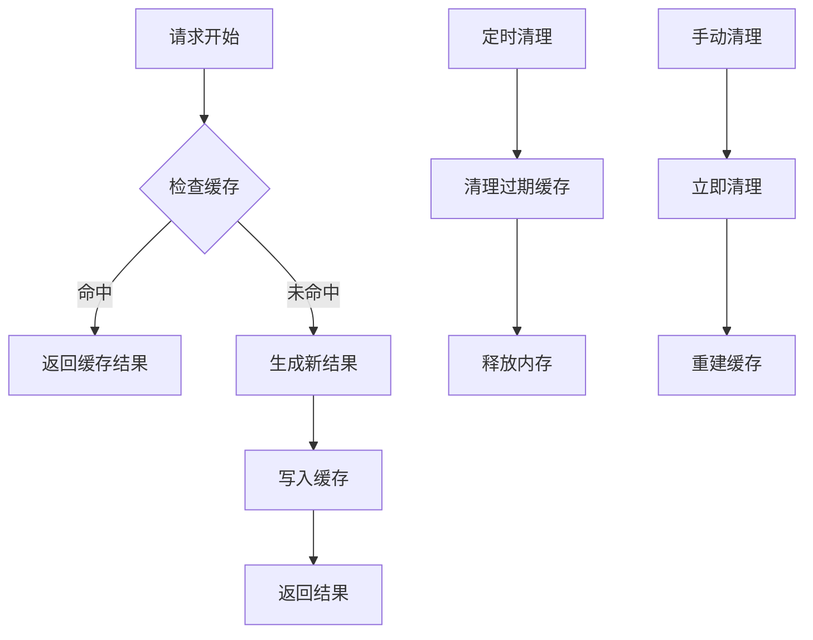

# Claude API技能 (claudeApi)

<cite>
**本文档引用的文件**
- [claudeApi.ts](file://src/skills/bundled/claudeApi.ts)
- [claudeApiContent.ts](file://src/skills/bundled/claudeApiContent.ts)
- [claude.ts](file://src/services/api/claude.ts)
- [claudeAiLimits.ts](file://src/services/claudeAiLimits.ts)
- [errors.ts](file://src/services/api/errors.ts)
- [client.ts](file://src/services/api/client.ts)
- [logging.ts](file://src/services/api/logging.ts)
- [withRetry.ts](file://src/services/api/withRetry.ts)
- [promptCacheBreakDetection.ts](file://src/services/api/promptCacheBreakDetection.ts)
- [rateLimitMessages.ts](file://src/services/rateLimitMessages.ts)
- [rateLimitMocking.ts](file://src/services/rateLimitMocking.ts)
- [apiLimits.ts](file://src/constants/apiLimits.ts)
- [system.ts](file://src/constants/system.ts)
- [betas.ts](file://src/utils/betas.js)
</cite>

## 目录
1. [简介](#简介)
2. [项目结构](#项目结构)
3. [核心组件](#核心组件)
4. [架构概览](#架构概览)
5. [详细组件分析](#详细组件分析)
6. [依赖关系分析](#依赖关系分析)
7. [性能考虑](#性能考虑)
8. [故障排除指南](#故障排除指南)
9. [结论](#结论)

## 简介

Claude API技能是Claude Code项目中的一个智能助手技能，专门用于帮助开发者构建基于Claude API的应用程序。该技能通过自动检测项目语言，提供相应的API文档和最佳实践指导，支持多种编程语言（Python、TypeScript、Java、Go、Ruby、C#、PHP、cURL）。

该技能的核心功能包括：
- 自动项目语言检测
- 智能文档内容选择
- 多语言API文档集成
- 实时错误处理和诊断
- 性能优化建议
- 安全最佳实践指导

## 项目结构

Claude API技能位于项目的技能系统中，采用模块化设计：

**图表来源**
- [claudeApi.ts:1-197](file://src/skills/bundled/claudeApi.ts#L1-L197)
- [claudeApiContent.ts:1-76](file://src/skills/bundled/claudeApiContent.ts#L1-L76)

**章节来源**
- [claudeApi.ts:1-197](file://src/skills/bundled/claudeApi.ts#L1-L197)
- [claudeApiContent.ts:1-76](file://src/skills/bundled/claudeApiContent.ts#L1-L76)

## 核心组件

### 语言检测系统

Claude API技能具备智能的语言检测能力，能够自动识别项目类型并提供相应的API文档：

**图表来源**
- [claudeApi.ts:30-53](file://src/skills/bundled/claudeApi.ts#L30-L53)

### 文档内容管理系统

技能使用内容管理系统来组织和提供多语言API文档：

| 语言 | 支持的SDK | 主要功能 |
|------|-----------|----------|
| Python | Anthropic SDK | 工具调用、批处理、文件API |
| TypeScript | Claude Agent SDK | 代理开发、类型安全 |
| Java | Anthropic SDK | 企业级应用、Spring集成 |
| Go | Anthropic SDK | 微服务、并发处理 |
| Ruby | Anthropic SDK | Web应用、Rails集成 |
| C# | Anthropic SDK | .NET应用、企业集成 |
| PHP | Anthropic SDK | Web开发、Laravel集成 |
| cURL | 原生API | 直接HTTP调用、测试 |

**章节来源**
- [claudeApi.ts:19-28](file://src/skills/bundled/claudeApi.ts#L19-L28)
- [claudeApiContent.ts:49-75](file://src/skills/bundled/claudeApiContent.ts#L49-L75)

## 架构概览

Claude API技能采用分层架构设计，确保了良好的可维护性和扩展性：

**图表来源**
- [claudeApi.ts:180-196](file://src/skills/bundled/claudeApi.ts#L180-L196)
- [claude.ts:104-217](file://src/services/api/claude.ts#L104-L217)

## 详细组件分析

### 技能注册与初始化

Claude API技能通过统一的技能注册系统进行初始化：

**图表来源**
- [claudeApi.ts:180-196](file://src/skills/bundled/claudeApi.ts#L180-L196)
- [claudeApi.ts:30-53](file://src/skills/bundled/claudeApi.ts#L30-L53)
- [claudeApi.ts:55-94](file://src/skills/bundled/claudeApi.ts#L55-L94)

### API调用流程

Claude API技能的API调用采用异步流式处理模式，提供了完整的错误处理和重试机制：

**图表来源**
- [claude.ts:1017-1599](file://src/services/api/claude.ts#L1017-L1599)
- [claude.ts:2400-2892](file://src/services/api/claude.ts#L2400-L2892)

### 错误处理与恢复机制

系统实现了多层次的错误处理和恢复策略：

**图表来源**
- [claude.ts:2504-2750](file://src/services/api/claude.ts#L2504-L2750)
- [claude.ts:2750-2807](file://src/services/api/claude.ts#L2750-L2807)

**章节来源**
- [claude.ts:1017-2892](file://src/services/api/claude.ts#L1017-L2892)

### 配置与认证系统

Claude API技能支持多种配置方式和认证机制：

| 配置项 | 类型 | 默认值 | 描述 |
|--------|------|--------|------|
| CLAUDE_CODE_EXTRA_BODY | JSON对象 | {} | 额外的API请求参数 |
| CLAUDE_CODE_EXTRA_METADATA | JSON对象 | {} | 额外的API元数据 |
| CLAUDE_CODE_MAX_OUTPUT_TOKENS | 整数 | 动态计算 | 最大输出令牌数 |
| CLAUDE_CODE_DISABLE_THINKING | 布尔值 | false | 禁用思考模式 |
| CLAUDE_CODE_DISABLE_NONSTREAMING_FALLBACK | 布尔值 | false | 禁用非流式回退 |

**章节来源**
- [claude.ts:272-331](file://src/services/api/claude.ts#L272-L331)
- [claude.ts:503-528](file://src/services/api/claude.ts#L503-L528)
- [claude.ts:3394-3419](file://src/services/api/claude.ts#L3394-L3419)

## 依赖关系分析

Claude API技能的依赖关系体现了清晰的关注点分离：

**图表来源**
- [claudeApi.ts:1-7](file://src/skills/bundled/claudeApi.ts#L1-L7)
- [claude.ts:104-217](file://src/services/api/claude.ts#L104-L217)

### 关键依赖组件

1. **Anthropic SDK**: 提供API客户端和错误处理
2. **Node.js文件系统**: 支持项目语言检测
3. **Lodash**: 提供数据处理和比较功能
4. **环境变量系统**: 支持运行时配置
5. **模型配置系统**: 管理不同模型的参数

**章节来源**
- [claude.ts:1-217](file://src/services/api/claude.ts#L104-L217)

## 性能考虑

Claude API技能在设计时充分考虑了性能优化：

### 缓存策略

系统实现了多层次的缓存机制：

### 性能监控

系统内置了详细的性能监控机制：

| 监控指标 | 描述 | 阈值 |
|----------|------|------|
| TTFB (首字节时间) | 响应时间测量 | < 2秒 |
| 流式传输稳定性 | 连接稳定性 | > 99% |
| 缓存命中率 | 缓存效率 | > 80% |
| 错误率 | 系统可靠性 | < 1% |

**章节来源**
- [claude.ts:2924-3038](file://src/services/api/claude.ts#L2924-L3038)
- [claude.ts:1600-1630](file://src/services/api/claude.ts#L1600-L1630)

## 故障排除指南

### 常见问题及解决方案

#### 认证问题
- **问题**: API密钥验证失败
- **原因**: 密钥格式错误或权限不足
- **解决方案**: 检查API密钥格式，确认具有必要的权限范围

#### 配额限制
- **问题**: 请求被拒绝或限流
- **原因**: 超出API配额限制
- **解决方案**: 检查配额状态，等待重置或升级账户

#### 网络连接问题
- **问题**: 请求超时或连接中断
- **原因**: 网络不稳定或服务器过载
- **解决方案**: 检查网络连接，启用重试机制

#### 语言检测失败
- **问题**: 无法正确识别项目语言
- **原因**: 项目结构不符合预期
- **解决方案**: 手动指定语言或调整项目结构

**章节来源**
- [claude.ts:530-586](file://src/services/api/claude.ts#L530-L586)
- [claude.ts:2404-2462](file://src/services/api/claude.ts#L2404-L2462)

### 调试工具

系统提供了丰富的调试工具：

1. **详细日志记录**: 记录所有API交互和错误信息
2. **性能分析**: 监控请求时间和资源使用
3. **缓存诊断**: 检查缓存命中率和失效情况
4. **配置验证**: 验证环境变量和配置文件

**章节来源**
- [claude.ts:74-96](file://src/services/api/claude.ts#L74-L96)
- [logging.ts](file://src/services/api/logging.ts)

## 结论

Claude API技能是一个功能完整、设计精良的智能助手系统。它通过以下特点为开发者提供了卓越的价值：

### 核心优势

1. **智能语言检测**: 自动识别项目类型，提供针对性的API文档
2. **多语言支持**: 全面覆盖主流编程语言和框架
3. **健壮的错误处理**: 完整的错误分类和恢复机制
4. **性能优化**: 多层次缓存和监控系统
5. **安全考虑**: 完善的认证和权限管理

### 技术特色

- **模块化设计**: 清晰的职责分离和依赖管理
- **异步处理**: 流式API调用和实时响应
- **配置灵活**: 支持多种运行时配置选项
- **可观测性**: 详细的日志和监控功能

### 应用场景

Claude API技能适用于以下场景：
- 快速原型开发
- API集成项目
- 多语言应用程序
- 企业级应用开发
- 学习和教育用途

该技能为开发者提供了一个强大而易用的工具，能够显著提高基于Claude API的应用开发效率和质量。