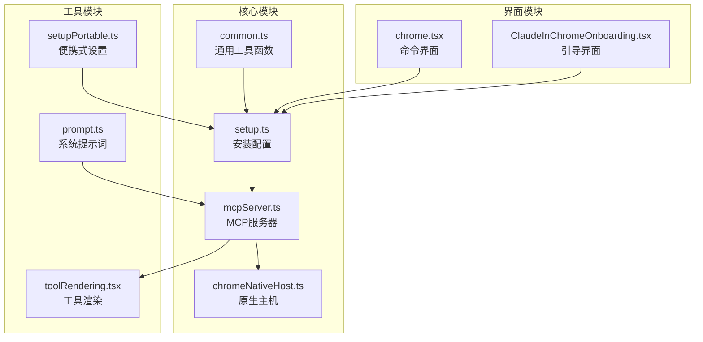
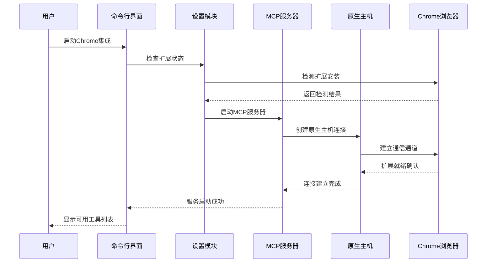
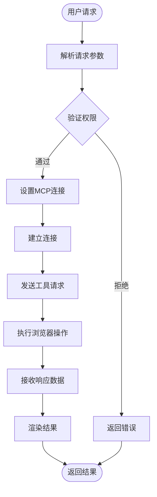
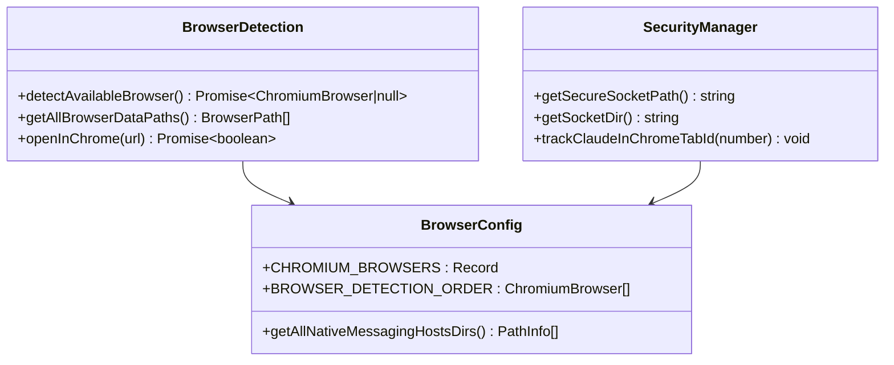
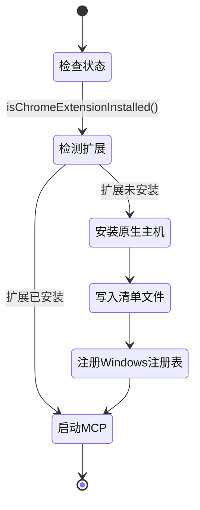
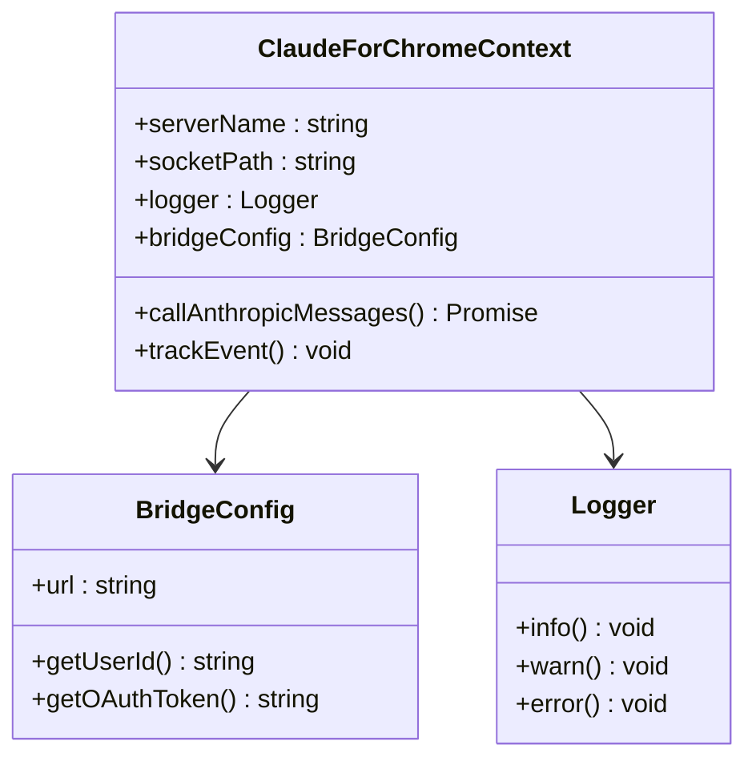
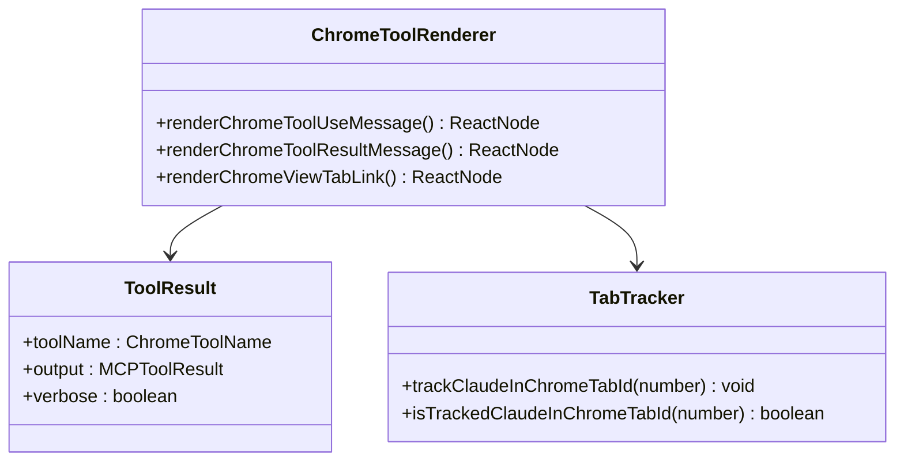

# Claude Chrome集成技能 (claudeInChrome)

<cite>
**本文档引用的文件**
- [src/utils/claudeInChrome/common.ts](file://src/utils/claudeInChrome/common.ts)
- [src/utils/claudeInChrome/setup.ts](file://src/utils/claudeInChrome/setup.ts)
- [src/utils/claudeInChrome/mcpServer.ts](file://src/utils/claudeInChrome/mcpServer.ts)
- [src/utils/claudeInChrome/chromeNativeHost.ts](file://src/utils/claudeInChrome/chromeNativeHost.ts)
- [src/utils/claudeInChrome/toolRendering.tsx](file://src/utils/claudeInChrome/toolRendering.tsx)
- [src/utils/claudeInChrome/setupPortable.ts](file://src/utils/claudeInChrome/setupPortable.ts)
- [src/utils/claudeInChrome/prompt.ts](file://src/utils/claudeInChrome/prompt.ts)
- [src/commands/chrome/chrome.tsx](file://src/commands/chrome/chrome.tsx)
- [src/components/ClaudeInChromeOnboarding.tsx](file://src/components/ClaudeInChromeOnboarding.tsx)
</cite>

## 目录
1. [简介](#简介)
2. [项目结构](#项目结构)
3. [核心组件](#核心组件)
4. [架构概览](#架构概览)
5. [详细组件分析](#详细组件分析)
6. [依赖关系分析](#依赖关系分析)
7. [性能考虑](#性能考虑)
8. [故障排除指南](#故障排除指南)
9. [结论](#结论)

## 简介

Claude Chrome集成技能（claudeInChrome）是Claude Code项目中的一个高级浏览器自动化功能，允许用户通过Chrome扩展直接控制浏览器并与Claude AI进行交互。该技能提供了完整的浏览器自动化能力，包括网页导航、表单填写、截图捕获、GIF录制、控制台日志调试和网络请求监控等功能。

该技能的核心价值在于为开发者提供了一个强大的浏览器自动化工具，可以在不离开开发环境的情况下执行复杂的浏览器任务，特别适用于Web应用测试、自动化脚本编写和浏览器调试场景。

## 项目结构

Claude Chrome集成技能主要分布在以下核心文件中：



**图表来源**
- [src/utils/claudeInChrome/common.ts:1-541](file://src/utils/claudeInChrome/common.ts#L1-L541)
- [src/utils/claudeInChrome/setup.ts:1-401](file://src/utils/claudeInChrome/setup.ts#L1-L401)

**章节来源**
- [src/utils/claudeInChrome/common.ts:1-541](file://src/utils/claudeInChrome/common.ts#L1-L541)
- [src/utils/claudeInChrome/setup.ts:1-401](file://src/utils/claudeInChrome/setup.ts#L1-L401)

## 核心组件

### 浏览器支持矩阵

Claude Chrome技能支持多种主流浏览器，包括：

| 浏览器 | 支持状态 | 平台兼容性 |
|--------|----------|------------|
| Google Chrome | ✅ 完全支持 | Windows/Linux/macOS |
| Brave | ✅ 完全支持 | Windows/Linux/macOS |
| Microsoft Edge | ✅ 完全支持 | Windows/Linux/macOS |
| Chromium | ✅ 完全支持 | Windows/Linux/macOS |
| Arc Browser | ⚠️ 部分支持 | macOS/Windows |
| Vivaldi | ✅ 完全支持 | Windows/Linux/macOS |
| Opera | ✅ 完全支持 | Windows/Linux/macOS |

### 工具集功能

技能提供了丰富的浏览器自动化工具：

1. **导航工具**：网页跳转、标签页管理
2. **交互工具**：鼠标点击、键盘输入、拖拽操作
3. **内容工具**：页面读取、文本提取、图像上传
4. **调试工具**：控制台日志、网络请求监控
5. **媒体工具**：截图捕获、GIF录制
6. **窗口工具**：窗口尺寸调整、快捷键执行

**章节来源**
- [src/utils/claudeInChrome/common.ts:39-216](file://src/utils/claudeInChrome/common.ts#L39-L216)
- [src/utils/claudeInChrome/toolRendering.tsx:11-15](file://src/utils/claudeInChrome/toolRendering.tsx#L11-L15)

## 架构概览

Claude Chrome技能采用分层架构设计，实现了从用户界面到浏览器控制的完整链路：



**图表来源**
- [src/utils/claudeInChrome/setup.ts:91-171](file://src/utils/claudeInChrome/setup.ts#L91-L171)
- [src/utils/claudeInChrome/mcpServer.ts:248-275](file://src/utils/claudeInChrome/mcpServer.ts#L248-L275)

### 数据流架构



**图表来源**
- [src/utils/claudeInChrome/mcpServer.ts:85-246](file://src/utils/claudeInChrome/mcpServer.ts#L85-L246)

## 详细组件分析

### 通用工具模块 (common.ts)

通用工具模块提供了浏览器检测、路径管理和安全通信等基础功能：



**图表来源**
- [src/utils/claudeInChrome/common.ts:39-275](file://src/utils/claudeInChrome/common.ts#L39-L275)

#### 浏览器检测机制

系统实现了智能的浏览器检测算法，能够自动识别已安装的浏览器并确定最佳的使用策略：

1. **多平台支持**：支持Windows、Linux、macOS和WSL环境
2. **优先级排序**：根据使用频率对浏览器进行排序
3. **路径扫描**：遍历所有可能的安装路径
4. **状态验证**：验证浏览器的实际可用性

**章节来源**
- [src/utils/claudeInChrome/common.ts:345-409](file://src/utils/claudeInChrome/common.ts#L345-L409)

### 设置模块 (setup.ts)

设置模块负责整个技能的初始化和配置管理：



**图表来源**
- [src/utils/claudeInChrome/setup.ts:91-171](file://src/utils/claudeInChrome/setup.ts#L91-L171)

#### 权限管理模式

设置模块实现了灵活的权限管理模式，支持三种不同的权限检查级别：

1. **询问模式**：每次操作前询问用户许可
2. **跳过检查**：完全跳过权限检查
3. **跟随计划**：根据预设计划执行操作

**章节来源**
- [src/utils/claudeInChrome/setup.ts:36-68](file://src/utils/claudeInChrome/setup.ts#L36-L68)

### MCP服务器模块 (mcpServer.ts)

MCP服务器模块是技能的核心协调器，负责管理与浏览器扩展的通信：



**图表来源**
- [src/utils/claudeInChrome/mcpServer.ts:85-246](file://src/utils/claudeInChrome/mcpServer.ts#L85-L246)

#### 桥接通信机制

MCP服务器支持两种通信模式：

1. **本地套接字模式**：使用Unix域套接字或Windows命名管道
2. **桥接模式**：通过WebSocket连接到云端桥接服务

**章节来源**
- [src/utils/claudeInChrome/mcpServer.ts:51-79](file://src/utils/claudeInChrome/mcpServer.ts#L51-L79)

### 原生主机模块 (chromeNativeHost.ts)

原生主机模块实现了Chrome扩展与Node.js进程之间的直接通信：


**图表来源**
- [src/utils/claudeInChrome/chromeNativeHost.ts:59-82](file://src/utils/claudeInChrome/chromeNativeHost.ts#L59-L82)

#### 消息处理流程

原生主机实现了完整的消息处理机制：

1. **消息读取**：异步读取Chrome发送的消息
2. **格式验证**：使用Zod验证消息格式
3. **类型分发**：根据消息类型进行相应处理
4. **双向转发**：在Chrome和Node.js之间转发消息

**章节来源**
- [src/utils/claudeInChrome/chromeNativeHost.ts:245-352](file://src/utils/claudeInChrome/chromeNativeHost.ts#L245-L352)

### 工具渲染模块 (toolRendering.tsx)

工具渲染模块负责将浏览器工具的执行结果以用户友好的方式展示：



**图表来源**
- [src/utils/claudeInChrome/toolRendering.tsx:117-262](file://src/utils/claudeInChrome/toolRendering.tsx#L117-L262)

#### 结果呈现策略

工具渲染实现了智能的结果呈现策略：

1. **简洁模式**：显示简要的操作摘要
2. **详细模式**：显示完整的工具输出
3. **交互链接**：提供可点击的标签页查看链接

**章节来源**
- [src/utils/claudeInChrome/toolRendering.tsx:149-215](file://src/utils/claudeInChrome/toolRendering.tsx#L149-L215)

## 依赖关系分析

Claude Chrome技能的依赖关系体现了清晰的分层设计：

```mermaid
graph TD
subgraph "外部依赖"
A[@ant/claude-for-chrome-mcp<br/>浏览器工具包]
B[StdioServerTransport<br/>传输层]
C[Zod<br/>数据验证]
end
subgraph "内部模块"
D[common.ts]
E[setup.ts]
F[mcpServer.ts]
G[chromeNativeHost.ts]
H[toolRendering.tsx]
end
subgraph "用户界面"
I[chrome.tsx]
J[ClaudeInChromeOnboarding.tsx]
end
A --> F
B --> F
C --> G
D --> E
E --> F
F --> G
F --> H
E --> I
E --> J
```

**图表来源**
- [src/utils/claudeInChrome/setup.ts:1-32](file://src/utils/claudeInChrome/setup.ts#L1-L32)
- [src/utils/claudeInChrome/mcpServer.ts:1-22](file://src/utils/claudeInChrome/mcpServer.ts#L1-L22)

### 耦合度分析

技能模块展现了良好的内聚性和低耦合性：

- **高内聚**：每个模块专注于特定功能领域
- **低耦合**：模块间通过明确定义的接口交互
- **可替换性**：底层实现可以独立替换而不影响上层逻辑

**章节来源**
- [src/utils/claudeInChrome/common.ts:1-10](file://src/utils/claudeInChrome/common.ts#L1-L10)

## 性能考虑

### 内存管理

Claude Chrome技能在内存管理方面采用了多项优化策略：

1. **标签页跟踪限制**：最多跟踪200个标签页，防止内存泄漏
2. **套接字清理**：自动清理死进程的套接字文件
3. **缓存策略**：智能缓存扩展检测结果，避免重复扫描

### 并发处理

系统支持多客户端并发连接：

- **连接池管理**：动态管理MCP客户端连接
- **消息队列**：有序处理来自Chrome的消息
- **资源隔离**：每个客户端拥有独立的缓冲区

### 性能优化建议

1. **合理使用工具**：避免在同一页面上执行过多连续操作
2. **及时清理**：定期清理不需要的标签页和临时文件
3. **监控资源**：关注内存和CPU使用情况

## 故障排除指南

### 常见问题诊断

#### 扩展未检测到

**症状**：系统报告扩展未安装或检测失败

**解决方案**：
1. 检查Chrome扩展是否正确安装
2. 验证扩展版本兼容性
3. 重启Chrome浏览器
4. 检查防火墙设置

#### 连接建立失败

**症状**：MCP服务器无法与原生主机建立连接

**解决方案**：
1. 检查套接字文件权限
2. 验证用户权限设置
3. 清理残留的套接字文件
4. 重新安装原生主机

#### 工具执行超时

**症状**：浏览器工具执行超时或无响应

**解决方案**：
1. 检查网络连接状态
2. 验证目标网站可访问性
3. 减少操作复杂度
4. 增加等待时间

### 调试工具

系统提供了完善的调试支持：

1. **日志记录**：详细的调试日志输出
2. **状态监控**：实时监控连接状态
3. **错误报告**：友好的错误信息提示
4. **性能指标**：运行时性能数据收集

**章节来源**
- [src/utils/claudeInChrome/mcpServer.ts:115-117](file://src/utils/claudeInChrome/mcpServer.ts#L115-L117)

### 安全考虑

Claude Chrome技能在设计时充分考虑了安全性：

1. **权限控制**：严格的权限检查机制
2. **数据隔离**：浏览器会话与系统进程隔离
3. **输入验证**：所有外部输入都经过严格验证
4. **审计日志**：记录所有敏感操作

**章节来源**
- [src/utils/claudeInChrome/common.ts:474-540](file://src/utils/claudeInChrome/common.ts#L474-L540)

## 结论

Claude Chrome集成技能代表了现代AI辅助开发工具的先进水平，它成功地将复杂的浏览器自动化功能封装在一个易于使用的界面中。通过精心设计的架构和完善的错误处理机制，该技能为开发者提供了一个强大而可靠的浏览器自动化解决方案。

技能的主要优势包括：

- **跨平台兼容**：支持Windows、Linux、macOS等多种操作系统
- **多浏览器支持**：兼容主流Chrome系浏览器
- **安全可靠**：完善的权限控制和安全机制
- **易于使用**：直观的命令行界面和工具渲染
- **高性能**：优化的并发处理和资源管理

随着技术的不断发展，Claude Chrome技能将继续演进，为开发者提供更加智能化和自动化的浏览器操作体验。