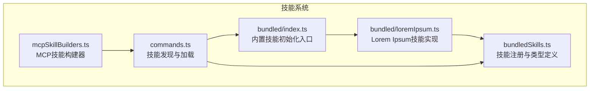
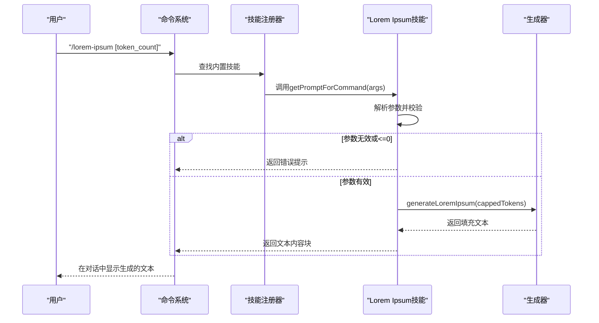
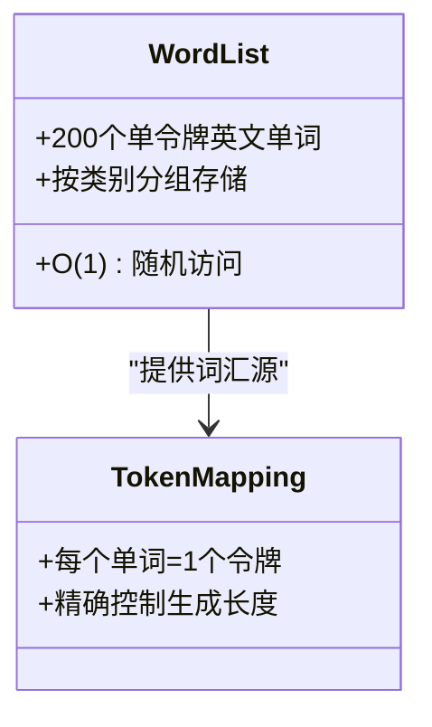
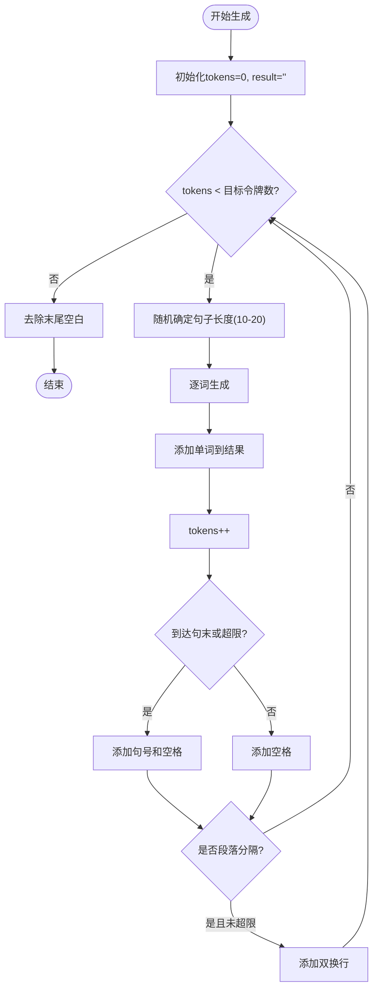
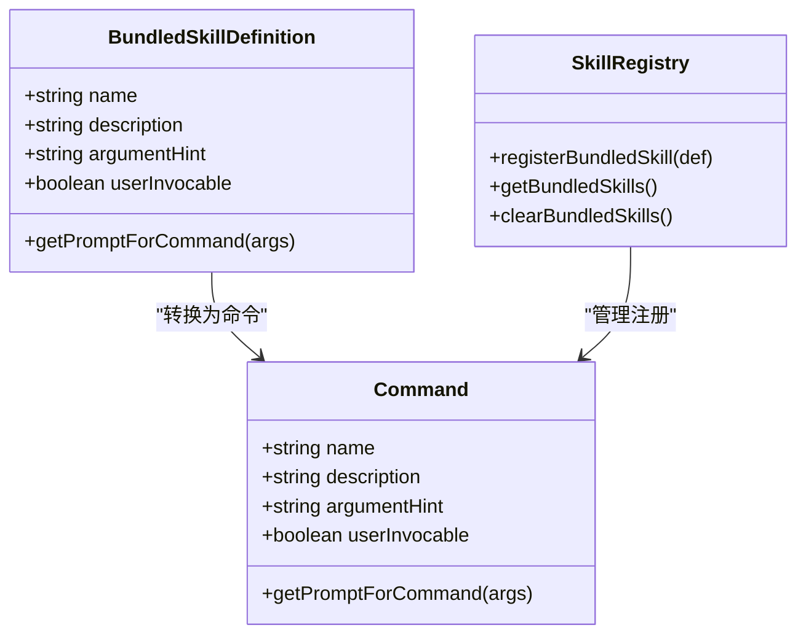
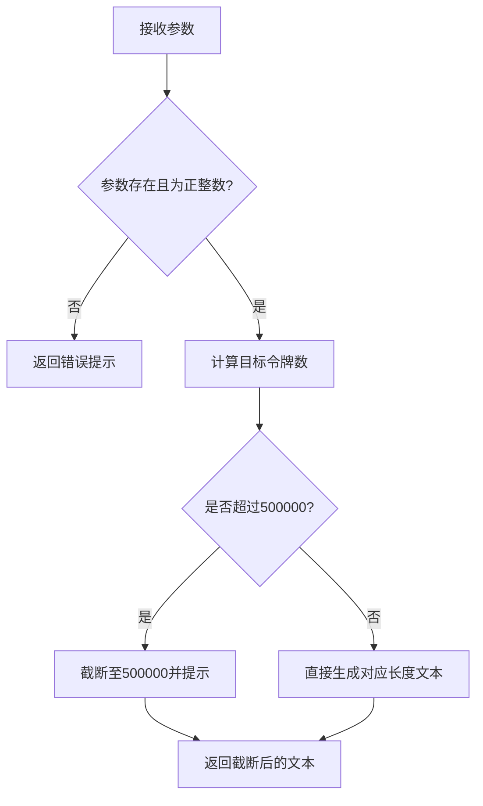
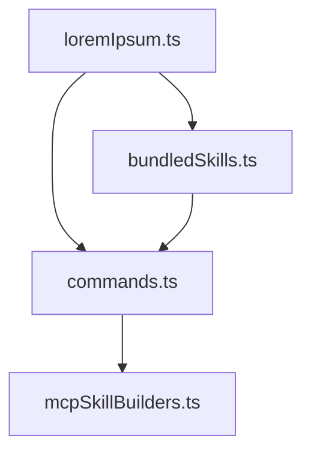

# Lorem Ipsum技能 (loremIpsum)

<cite>
**本文档引用的文件**
- [loremIpsum.ts](file://src/skills/bundled/loremIpsum.ts)
- [bundledSkills.ts](file://src/skills/bundledSkills.ts)
- [index.ts（技能入口）](file://src/skills/bundled/index.ts)
- [commands.ts](file://src/commands.ts)
- [mcpSkillBuilders.ts](file://src/skills/mcpSkillBuilders.ts)
</cite>

## 目录
1. [简介](#简介)
2. [项目结构](#项目结构)
3. [核心组件](#核心组件)
4. [架构概览](#架构概览)
5. [详细组件分析](#详细组件分析)
6. [依赖关系分析](#依赖关系分析)
7. [性能考量](#性能考量)
8. [故障排除指南](#故障排除指南)
9. [结论](#结论)
10. [附录：使用示例与最佳实践](#附录使用示例与最佳实践)

## 简介
Lorem Ipsum技能是一个内置的占位文本生成工具，专为长上下文测试而设计。该技能通过生成接近指定令牌数的英文填充文本，帮助开发者和设计师在不泄露真实内容的前提下进行界面布局、排版测试、性能验证和用户体验评估。技能支持可选的令牌数量参数，并具备安全上限限制，确保系统稳定性。

## 项目结构
Lorem Ipsum技能位于技能系统的核心模块中，采用“内置技能”（bundled skills）的形式随CLI一起分发。其核心文件组织如下：
- 技能实现：src/skills/bundled/loremIpsum.ts
- 技能注册与类型定义：src/skills/bundledSkills.ts
- 内置技能初始化入口：src/skills/bundled/index.ts
- 技能发现与加载：src/commands.ts
- MCP技能构建器：src/skills/mcpSkillBuilders.ts

**图表来源**
- [index.ts（技能入口）:15-55](file://src/skills/bundled/index.ts#L15-L55)
- [loremIpsum.ts:234-283](file://src/skills/bundled/loremIpsum.ts#L234-L283)
- [bundledSkills.ts:11-41](file://src/skills/bundledSkills.ts#L11-L41)
- [commands.ts:353-398](file://src/commands.ts#L353-L398)
- [mcpSkillBuilders.ts:26-44](file://src/skills/mcpSkillBuilders.ts#L26-L44)

**章节来源**
- [index.ts（技能入口）:15-55](file://src/skills/bundled/index.ts#L15-L55)
- [loremIpsum.ts:234-283](file://src/skills/bundled/loremIpsum.ts#L234-L283)
- [bundledSkills.ts:11-41](file://src/skills/bundledSkills.ts#L11-L41)
- [commands.ts:353-398](file://src/commands.ts#L353-L398)
- [mcpSkillBuilders.ts:26-44](file://src/skills/mcpSkillBuilders.ts#L26-L44)

## 核心组件
Lorem Ipsum技能由以下核心组件构成：
- 词表与令牌映射：包含200个经过验证的单令牌英文单词集合，覆盖常用词汇类别（代词、动词、名词、形容词、介词、连词、副词、技术术语等），确保生成文本的令牌计数精确可控。
- 文本生成算法：基于随机句子长度（10-20个单词）和段落分隔策略（约20%概率在5-8句之间插入空行），逐步累积达到目标令牌数。
- 技能注册系统：通过registerBundledSkill将技能注册为命令，支持用户触发和参数解析。
- 安全与限制：默认目标令牌数为10000，最大安全上限为500000，超出部分会被截断并提示用户。

**章节来源**
- [loremIpsum.ts:3-200](file://src/skills/bundled/loremIpsum.ts#L3-L200)
- [loremIpsum.ts:202-232](file://src/skills/bundled/loremIpsum.ts#L202-L232)
- [loremIpsum.ts:234-283](file://src/skills/bundled/loremIpsum.ts#L234-L283)
- [bundledSkills.ts:15-41](file://src/skills/bundledSkills.ts#L15-L41)

## 架构概览
Lorem Ipsum技能在系统中的工作流如下：
1. 启动阶段：initBundledSkills函数导入并调用registerLoremIpsumSkill完成技能注册。
2. 用户触发：用户通过命令行输入"/lorem-ipsum [token_count]"发起请求。
3. 参数解析：getPromptForCommand解析参数，进行有效性检查和安全上限处理。
4. 文本生成：generateLoremIpsum根据目标令牌数生成填充文本。
5. 结果返回：将生成的文本作为内容块返回到对话上下文中。

**图表来源**
- [index.ts（技能入口）:24-29](file://src/skills/bundled/index.ts#L24-L29)
- [loremIpsum.ts:245-280](file://src/skills/bundled/loremIpsum.ts#L245-L280)
- [bundledSkills.ts:75-98](file://src/skills/bundledSkills.ts#L75-L98)

**章节来源**
- [index.ts（技能入口）:24-29](file://src/skills/bundled/index.ts#L24-L29)
- [loremIpsum.ts:245-280](file://src/skills/bundled/loremIpsum.ts#L245-L280)
- [bundledSkills.ts:75-98](file://src/skills/bundledSkills.ts#L75-L98)

## 详细组件分析

### 组件A：词表与令牌映射
- 设计原则：选择经过API令牌计数验证的单令牌英文单词，确保生成文本的令牌计数精确可控。
- 数据结构：数组存储200个常用英文词汇，按类别分组（代词、动词、名词、形容词、介词、连词、副词、技术术语等）。
- 复杂度分析：词表访问为O(1)，随机选择通过Math.random()实现均匀分布。

**图表来源**
- [loremIpsum.ts:3-200](file://src/skills/bundled/loremIpsum.ts#L3-L200)

**章节来源**
- [loremIpsum.ts:3-200](file://src/skills/bundled/loremIpsum.ts#L3-L200)

### 组件B：文本生成算法
- 生成策略：句子长度随机（10-20个单词），段落分隔概率约20%（每5-8句一次）。
- 控制逻辑：循环累积直到达到目标令牌数，确保输出长度接近但不超过目标值。
- 输出格式：自动添加句号和空格，段落间插入双换行符。

**图表来源**
- [loremIpsum.ts:202-232](file://src/skills/bundled/loremIpsum.ts#L202-L232)

**章节来源**
- [loremIpsum.ts:202-232](file://src/skills/bundled/loremIpsum.ts#L202-L232)

### 组件C：技能注册与生命周期
- 注册机制：通过registerBundledSkill将技能定义转换为命令对象，包含名称、描述、参数提示、用户可触发性等属性。
- 初始化入口：initBundledSkills在启动时调用，确保所有内置技能（包括Lorem Ipsum）被正确注册。
- 访问控制：技能仅在特定用户类型（USER_TYPE='ant'）下可用，体现内部功能限制。

**图表来源**
- [bundledSkills.ts:15-41](file://src/skills/bundledSkills.ts#L15-L41)
- [bundledSkills.ts:75-98](file://src/skills/bundledSkills.ts#L75-L98)
- [index.ts（技能入口）:24-29](file://src/skills/bundled/index.ts#L24-L29)

**章节来源**
- [bundledSkills.ts:15-41](file://src/skills/bundledSkills.ts#L15-L41)
- [bundledSkills.ts:75-98](file://src/skills/bundledSkills.ts#L75-L98)
- [index.ts（技能入口）:24-29](file://src/skills/bundled/index.ts#L24-L29)

### 组件D：参数处理与安全限制
- 参数验证：检查输入是否为正整数，无效时返回错误提示。
- 默认值与上限：无参数时默认10000令牌，最大安全上限500000令牌。
- 用户反馈：当请求超过上限时，会提示截断并返回最大允许数量的文本。

**图表来源**
- [loremIpsum.ts:245-280](file://src/skills/bundled/loremIpsum.ts#L245-L280)

**章节来源**
- [loremIpsum.ts:245-280](file://src/skills/bundled/loremIpsum.ts#L245-L280)

## 依赖关系分析
Lorem Ipsum技能与其他组件的依赖关系如下：
- 对bundledSkills.ts的依赖：使用registerBundledSkill进行技能注册，依赖Command接口定义。
- 对commands.ts的依赖：通过getSkills聚合内置技能，参与技能发现与加载流程。
- 对mcpSkillBuilders.ts的间接关联：作为技能系统的一部分，遵循统一的技能构建和加载规范。

**图表来源**
- [loremIpsum.ts:234-283](file://src/skills/bundled/loremIpsum.ts#L234-L283)
- [bundledSkills.ts:75-98](file://src/skills/bundledSkills.ts#L75-L98)
- [commands.ts:353-398](file://src/commands.ts#L353-L398)
- [mcpSkillBuilders.ts:26-44](file://src/skills/mcpSkillBuilders.ts#L26-L44)

**章节来源**
- [loremIpsum.ts:234-283](file://src/skills/bundled/loremIpsum.ts#L234-L283)
- [bundledSkills.ts:75-98](file://src/skills/bundledSkills.ts#L75-L98)
- [commands.ts:353-398](file://src/commands.ts#L353-L398)
- [mcpSkillBuilders.ts:26-44](file://src/skills/mcpSkillBuilders.ts#L26-L44)

## 性能考量
- 时间复杂度：生成算法的时间复杂度为O(n)，其中n为目标令牌数。由于每个单词为单令牌，生成过程线性且高效。
- 空间复杂度：空间复杂度为O(n)，主要用于累积结果字符串。对于大令牌数（如500000），内存占用会相应增加。
- 随机性与可重复性：当前实现使用Math.random()，不具备种子控制。如需可重复的测试数据，可在生产环境中引入固定种子的随机数生成器。
- I/O开销：技能为纯内存操作，无外部I/O依赖，执行速度快且稳定。

## 故障排除指南
- 问题：技能不可用
  - 检查USER_TYPE环境变量是否为'ant'
  - 确认initBundledSkills已执行
  - 验证技能注册是否成功

- 问题：参数无效
  - 确保输入为正整数
  - 检查参数格式是否正确

- 问题：生成文本过短
  - 检查目标令牌数是否超过500000的安全上限
  - 确认生成算法是否正常执行

**章节来源**
- [loremIpsum.ts:234-280](file://src/skills/bundled/loremIpsum.ts#L234-L280)
- [index.ts（技能入口）:24-29](file://src/skills/bundled/index.ts#L24-L29)

## 结论
Lorem Ipsum技能通过精确的令牌控制和高效的文本生成算法，为长上下文测试提供了可靠的占位文本解决方案。其内置设计确保了易用性和安全性，同时通过合理的参数限制和错误处理机制，保证了系统的稳定运行。该技能在开发和设计流程中具有重要价值，特别是在界面布局测试、性能验证和用户体验评估等场景中。

## 附录：使用示例与最佳实践

### 使用示例
- 基础用法：/lorem-ipsum 10000
- 大规模测试：/lorem-ipsum 50000
- 边界测试：/lorem-ipsum 500000

### 最佳实践
- 令牌数选择：根据具体测试需求选择合适的令牌数，避免超过500000的安全上限
- 场景适配：在界面布局测试中使用较小令牌数，在长上下文验证中使用较大令牌数
- 批量生成：结合自动化脚本批量生成不同长度的测试数据
- 版本控制：将生成的测试数据纳入版本控制，便于回归测试

### 创意应用
- 用户体验测试：生成不同长度的占位文本用于界面响应时间测试
- 排版验证：通过段落分隔和句子长度变化验证排版效果
- 性能基准：建立不同令牌数下的性能基准数据集
- 多语言扩展：在保持单令牌特性的前提下，扩展词表以支持其他语言的占位文本生成