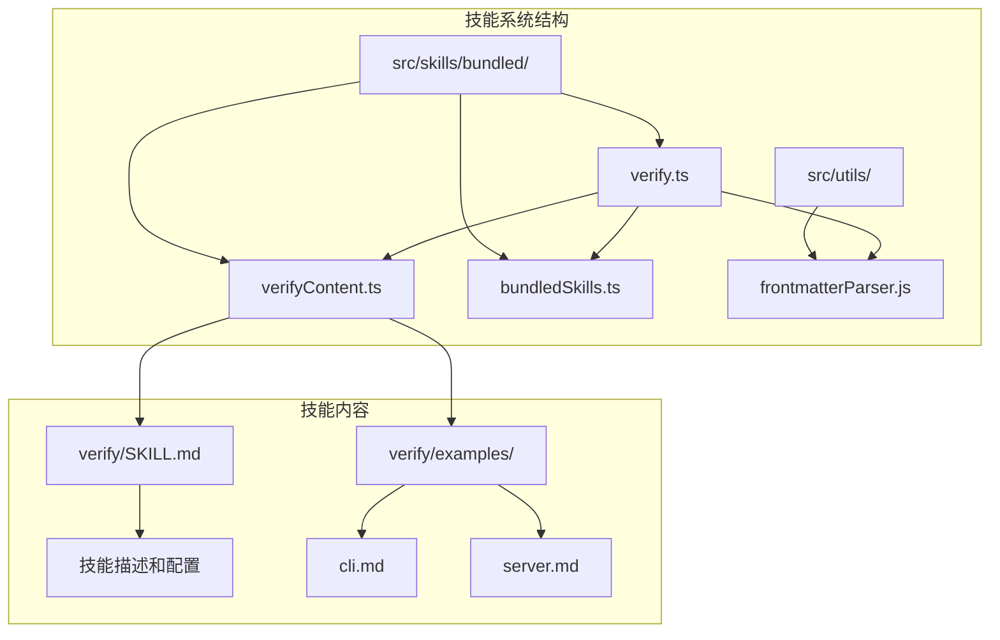
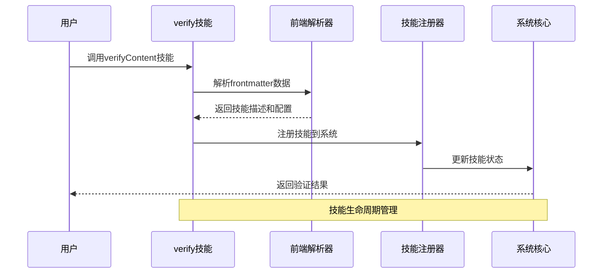
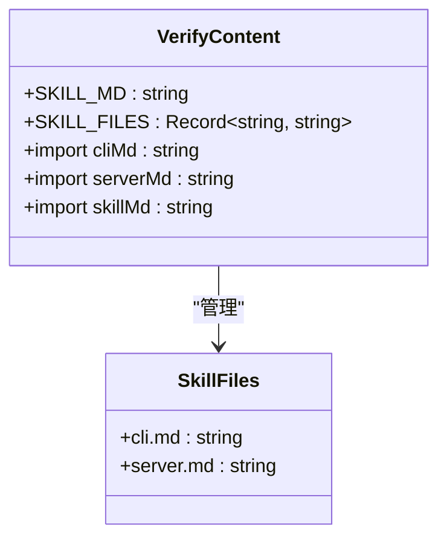
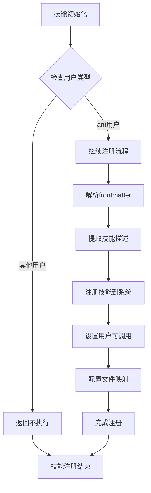
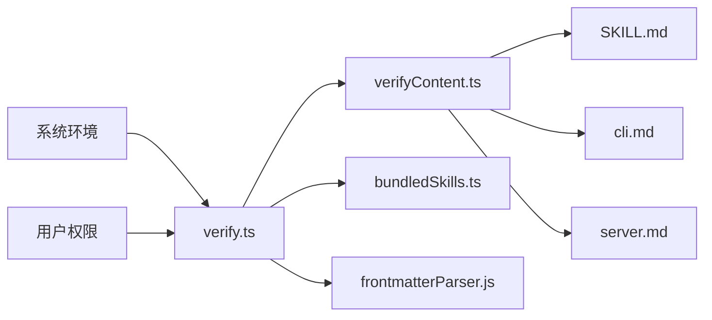

# 内容验证技能 (verifyContent)

<cite>
**本文档引用的文件**
- [verify.ts](file://src/skills/bundled/verify.ts)
- [verifyContent.ts](file://src/skills/bundled/verifyContent.ts)
- [bundledSkills.ts](file://src/skills/bundledSkills.ts)
- [frontmatterParser.js](file://src/utils/frontmatterParser.js)
- [README.md](file://README.md)
- [README_CN.md](file://README_CN.md)
</cite>

## 目录
1. [简介](#简介)
2. [项目结构](#项目结构)
3. [核心组件](#核心组件)
4. [架构概览](#架构概览)
5. [详细组件分析](#详细组件分析)
6. [依赖关系分析](#依赖关系分析)
7. [性能考虑](#性能考虑)
8. [故障排除指南](#故障排除指南)
9. [结论](#结论)

## 简介

内容验证技能（verifyContent）是Claude Code项目中的一个内置技能，专门用于验证代码变更是否按预期工作。该技能通过运行应用程序来验证代码变更的有效性，确保代码变更不会破坏现有功能，并且能够正确实现预期的行为。

verifyContent技能的核心目标是提供一个自动化的内容验证流程，帮助开发者确保代码质量并减少回归错误的风险。该技能通过解析前端数据（frontmatter）来提取技能描述和配置信息，并将其注册到技能系统中。

## 项目结构

verifyContent技能位于项目的技能系统中，具体位于以下路径结构：

**图表来源**
- [verify.ts:1-31](file://src/skills/bundled/verify.ts#L1-L31)
- [verifyContent.ts:1-14](file://src/skills/bundled/verifyContent.ts#L1-L14)

**章节来源**
- [verify.ts:1-31](file://src/skills/bundled/verify.ts#L1-L31)
- [verifyContent.ts:1-14](file://src/skills/bundled/verifyContent.ts#L1-L14)

## 核心组件

verifyContent技能由三个主要组件构成：

### 1. verifyContent.ts - 技能内容管理器
负责管理技能相关的Markdown文件内容，包括技能描述和示例文件。

### 2. verify.ts - 技能注册器
负责将verifyContent技能注册到系统中，处理技能的初始化和配置。

### 3. bundledSkills.ts - 技能系统核心
提供技能注册和管理的基础框架。

**章节来源**
- [verify.ts:1-31](file://src/skills/bundled/verify.ts#L1-L31)
- [verifyContent.ts:1-14](file://src/skills/bundled/verifyContent.ts#L1-L14)

## 架构概览

verifyContent技能采用模块化设计，通过清晰的职责分离实现了灵活的内容验证功能：

**图表来源**
- [verify.ts:12-30](file://src/skills/bundled/verify.ts#L12-L30)
- [frontmatterParser.js](file://src/utils/frontmatterParser.js)

## 详细组件分析

### verifyContent.ts 组件分析

verifyContent.ts是技能内容管理的核心组件，负责处理技能相关的Markdown文件：

**图表来源**
- [verifyContent.ts:8-13](file://src/skills/bundled/verifyContent.ts#L8-L13)

该组件的主要功能包括：
- **内容导入**：通过Bun的文本加载器导入Markdown文件
- **数据结构**：定义技能内容的数据结构
- **文件管理**：组织和管理技能相关的示例文件

**章节来源**
- [verifyContent.ts:1-14](file://src/skills/bundled/verifyContent.ts#L1-L14)

### verify.ts 组件分析

verify.ts是技能注册的核心组件，负责将verifyContent技能集成到系统中：

**图表来源**
- [verify.ts:12-30](file://src/skills/bundled/verify.ts#L12-L30)

该组件的关键特性：
- **条件注册**：仅在特定用户类型下激活
- **前端解析**：使用parseFrontmatter解析技能元数据
- **动态描述**：根据frontmatter动态设置技能描述
- **文件映射**：建立技能文件与实际内容的关联

**章节来源**
- [verify.ts:1-31](file://src/skills/bundled/verify.ts#L1-L31)

### 技能注册流程

verifyContent技能的注册过程遵循以下步骤：

1. **环境检查**：验证当前用户类型是否为'ant'
2. **内容解析**：使用frontmatter解析器提取技能元数据
3. **描述生成**：从frontmatter中获取或设置默认描述
4. **注册执行**：调用registerBundledSkill进行技能注册
5. **配置设置**：设置技能的可调用性和文件映射

**章节来源**
- [verify.ts:12-30](file://src/skills/bundled/verify.ts#L12-L30)

## 依赖关系分析

verifyContent技能的依赖关系相对简单但功能明确：

**图表来源**
- [verify.ts:1-3](file://src/skills/bundled/verify.ts#L1-L3)
- [verifyContent.ts:4-6](file://src/skills/bundled/verifyContent.ts#L4-L6)

主要依赖关系：
- **verifyContent.ts** 依赖于具体的Markdown文件内容
- **verify.ts** 依赖于技能注册框架和前端解析器
- **frontmatterParser.js** 提供元数据解析功能
- **bundledSkills.ts** 提供技能注册基础设施

**章节来源**
- [verify.ts:1-3](file://src/skills/bundled/verify.ts#L1-L3)
- [verifyContent.ts:4-6](file://src/skills/bundled/verifyContent.ts#L4-L6)

## 性能考虑

verifyContent技能的设计注重性能和效率：

### 内存优化
- **延迟加载**：技能内容通过Bun的文本加载器按需导入
- **缓存策略**：解析后的frontmatter数据可以被缓存复用
- **资源管理**：避免不必要的内存分配和对象创建

### 执行效率
- **条件检查**：快速的用户类型检查避免无效执行
- **异步处理**：使用async/await确保非阻塞操作
- **最小化依赖**：只引入必要的依赖模块

### 可扩展性
- **模块化设计**：便于添加新的验证示例和规则
- **配置驱动**：通过frontmatter轻松调整技能行为
- **插件架构**：支持未来扩展更多验证功能

## 故障排除指南

### 常见问题及解决方案

**问题1：技能未激活**
- **症状**：verifyContent技能不可用
- **原因**：用户类型不是'ant'
- **解决**：检查process.env.USER_TYPE环境变量

**问题2：内容加载失败**
- **症状**：技能描述或示例文件为空
- **原因**：Markdown文件导入失败
- **解决**：验证文件路径和Bun构建配置

**问题3：前端解析错误**
- **症状**：技能描述显示默认值而非预期内容
- **原因**：frontmatter格式不正确
- **解决**：检查SKILL.md文件的frontmatter语法

**问题4：注册失败**
- **症状**：技能无法注册到系统
- **原因**：bundledSkills框架问题
- **解决**：验证技能注册接口的正确性

**章节来源**
- [verify.ts:13-15](file://src/skills/bundled/verify.ts#L13-L15)
- [verify.ts:5](file://src/skills/bundled/verify.ts#L5)

## 结论

verifyContent技能作为Claude Code项目中的重要组成部分，提供了强大的内容验证能力。通过模块化的架构设计和清晰的职责分离，该技能实现了高效的代码变更验证功能。

该技能的主要优势包括：
- **简洁高效**：最小化的实现提供了最大的功能价值
- **易于扩展**：模块化设计便于添加新的验证规则和示例
- **用户友好**：通过frontmatter提供灵活的配置选项
- **性能优化**：采用延迟加载和缓存策略提升执行效率

未来的发展方向可能包括：
- 扩展更多的验证示例和场景
- 集成更复杂的验证算法
- 提供更详细的验证报告和反馈
- 支持自定义验证规则的配置

通过持续的优化和扩展，verifyContent技能将成为Claude Code生态系统中不可或缺的重要工具。