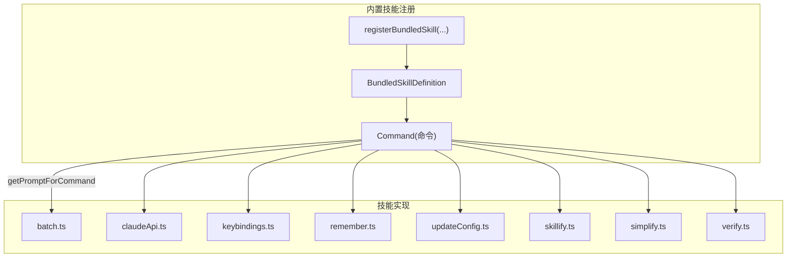
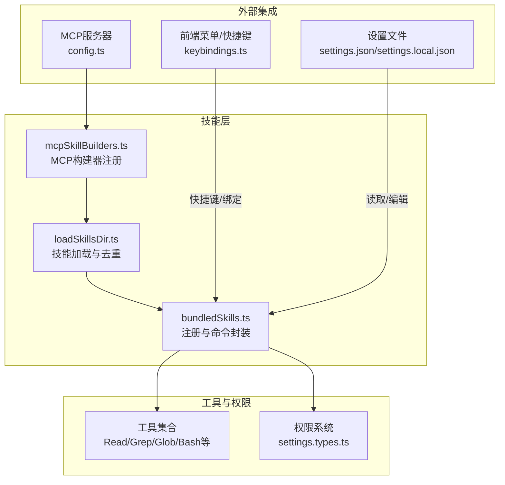
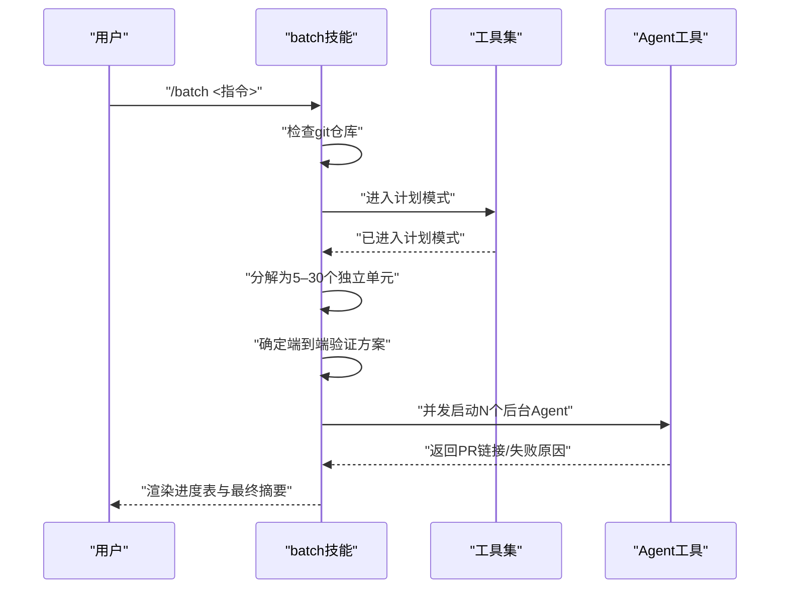
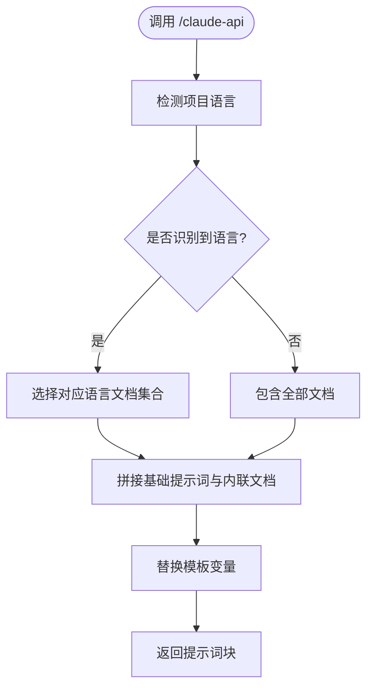
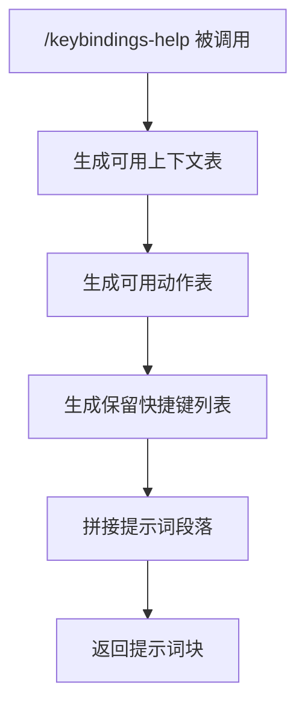
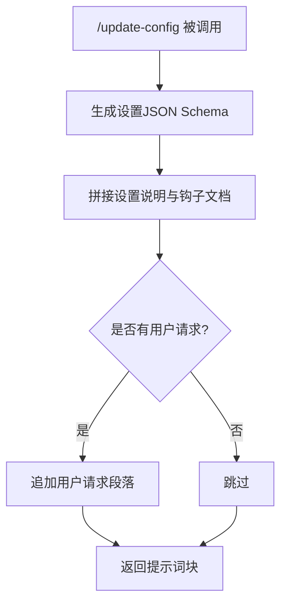
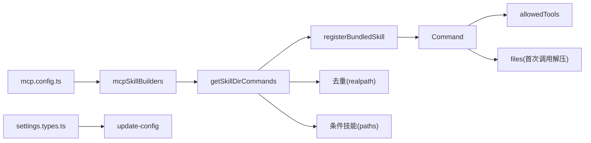

# 内置技能详解

<cite>
**本文引用的文件**
- [bundledSkills.ts](file://src/skills/bundledSkills.ts)
- [index.ts](file://src/skills/bundled/index.ts)
- [batch.ts](file://src/skills/bundled/batch.ts)
- [claudeApi.ts](file://src/skills/bundled/claudeApi.ts)
- [claudeApiContent.ts](file://src/skills/bundled/claudeApiContent.ts)
- [keybindings.ts](file://src/skills/bundled/keybindings.ts)
- [remember.ts](file://src/skills/bundled/remember.ts)
- [updateConfig.ts](file://src/skills/bundled/updateConfig.ts)
- [skillify.ts](file://src/skills/bundled/skillify.ts)
- [simplify.ts](file://src/skills/bundled/simplify.ts)
- [verify.ts](file://src/skills/bundled/verify.ts)
- [verifyContent.ts](file://src/skills/bundled/verifyContent.ts)
- [loadSkillsDir.ts](file://src/skills/loadSkillsDir.ts)
- [mcpSkillBuilders.ts](file://src/skills/mcpSkillBuilders.ts)
- [types.ts](file://src/utils/settings/types.ts)
- [config.ts](file://src/services/mcp/config.ts)
</cite>

## 目录
1. [简介](#简介)
2. [项目结构](#项目结构)
3. [核心组件](#核心组件)
4. [架构总览](#架构总览)
5. [详细组件分析](#详细组件分析)
6. [依赖关系分析](#依赖关系分析)
7. [性能考量](#性能考量)
8. [故障排查指南](#故障排查指南)
9. [结论](#结论)
10. [附录](#附录)

## 简介
本文件面向Claude Code的内置技能系统，系统性梳理并解释所有内置技能的功能特性、输入输出、参数配置、使用场景、实现原理与最佳实践。重点覆盖以下能力：
- 批量并行工作流：/batch
- API调用辅助：/claude-api
- 快捷键定制：/keybindings-help（以及快捷键相关能力）
- 记忆与整理：/remember
- 配置与钩子：/update-config
- 技能化封装：/skillify
- 代码简化审查：/simplify
- 变更验证：/verify
同时说明这些技能如何与命令注册、权限系统、MCP服务器、前端交互等系统组件协同工作，并给出扩展与二次开发建议。

## 项目结构
内置技能由“注册器”和“技能实现”两部分组成：
- 注册器：在启动时集中注册，形成统一的命令表，供模型或用户调用
- 技能实现：每个技能独立维护提示词、工具许可、触发条件等

图表来源
- [bundledSkills.ts:53-100](file://src/skills/bundledSkills.ts#L53-L100)
- [index.ts:1-13](file://src/skills/bundled/index.ts#L1-L13)

章节来源
- [bundledSkills.ts:1-221](file://src/skills/bundledSkills.ts#L1-L221)
- [index.ts:1-13](file://src/skills/bundled/index.ts#L1-L13)

## 核心组件
- 内置技能定义与注册
  - 定义类型：名称、描述、别名、触发条件、允许工具、是否可被用户调用、启用条件、钩子、上下文、代理、文件注入等
  - 注册函数：将技能包装为Command，加入全局注册表
  - 文件注入：支持在首次调用时将参考文件解压到安全目录，供模型按需读取
- 技能加载与发现
  - 支持从多源目录加载技能（策略、用户、项目、附加目录），并去重
  - 兼容旧版/commands/目录中的技能文件
  - 条件技能：根据路径匹配在文件触达时激活
- MCP技能构建器
  - 通过静态注册的方式，避免运行时动态导入导致的二进制打包问题
  - 提供createSkillCommand与parseSkillFrontmatterFields两个工厂方法

章节来源
- [bundledSkills.ts:15-100](file://src/skills/bundledSkills.ts#L15-L100)
- [loadSkillsDir.ts:638-800](file://src/skills/loadSkillsDir.ts#L638-L800)
- [mcpSkillBuilders.ts:26-44](file://src/skills/mcpSkillBuilders.ts#L26-L44)

## 架构总览
内置技能与系统其他模块的交互关系如下：

图表来源
- [bundledSkills.ts:53-100](file://src/skills/bundledSkills.ts#L53-L100)
- [loadSkillsDir.ts:638-800](file://src/skills/loadSkillsDir.ts#L638-L800)
- [mcpSkillBuilders.ts:26-44](file://src/skills/mcpSkillBuilders.ts#L26-L44)
- [types.ts:1075-1148](file://src/utils/settings/types.ts#L1075-L1148)
- [config.ts:380-408](file://src/services/mcp/config.ts#L380-L408)

## 详细组件分析

### 批量并行工作流：/batch
- 功能概述
  - 将大规模机械式变更分解为5–30个独立单元，使用隔离工作树并行执行，每个单元完成后各自提交并创建PR
  - 包含研究规划、工人编排、进度跟踪与最终汇总
- 输入输出
  - 输入：用户指令（如迁移、重构、批量改名）
  - 输出：计划文件、并行子任务、PR链接汇总表
- 关键流程
  - 检查是否为git仓库；若否，返回错误提示
  - 进入“研究与规划”阶段，生成工作单元与端到端验证方案
  - 启动后台Agent执行各单元，收集结果并更新状态表
- 最佳实践
  - 大规模变更优先使用该技能，确保单元间无耦合
  - 明确端到端验证步骤，避免仅跑单元测试
- 使用场景
  - 跨文件的大规模重构、SDK迁移、类型补全等

图表来源
- [batch.ts:19-88](file://src/skills/bundled/batch.ts#L19-L88)

章节来源
- [batch.ts:1-125](file://src/skills/bundled/batch.ts#L1-L125)

### API调用辅助：/claude-api
- 功能概述
  - 基于项目语言自动选择相关文档，内联注入参考内容，帮助用户正确使用Claude API或SDK
  - 支持多语言（Python/TypeScript/Java/Go/Ruby/C#/PHP/curl）与Agent SDK
- 输入输出
  - 输入：用户请求（可选）
  - 输出：包含语言特定文档片段与通用指引的提示词
- 实现要点
  - 语言检测：扫描当前工作目录以识别项目类型
  - 文档内联：将选定语言的文档片段拼接到基础提示词中
  - 占位符替换：将模板变量替换为实际模型ID/名称
- 使用场景
  - 需要快速查阅API文档、对比不同语言实现、理解Agent SDK用法

图表来源
- [claudeApi.ts:30-178](file://src/skills/bundled/claudeApi.ts#L30-L178)
- [claudeApiContent.ts:47-76](file://src/skills/bundled/claudeApiContent.ts#L47-L76)

章节来源
- [claudeApi.ts:1-197](file://src/skills/bundled/claudeApi.ts#L1-L197)
- [claudeApiContent.ts:1-76](file://src/skills/bundled/claudeApiContent.ts#L1-L76)

### 快捷键定制：/keybindings-help 与快捷键系统
- 功能概述
  - 生成快捷键参考与写入指南，帮助用户修改~/.claude/keybindings.json
  - 提供上下文、动作、保留快捷键、常见模式与校验规则
- 输入输出
  - 输入：用户请求（可选）
  - 输出：包含文件格式、语法、解绑、交互规则、常见问题与示例的提示词
- 实现要点
  - 动态生成上下文与动作表格
  - 列出非可重新绑定、终端保留与macOS保留的快捷键
  - 提供解绑、重绑定、和组合键（chord）示例
- 使用场景
  - 自定义提交、打开外部编辑器、切换主题等快捷键

图表来源
- [keybindings.ts:19-327](file://src/skills/bundled/keybindings.ts#L19-L327)

章节来源
- [keybindings.ts:1-340](file://src/skills/bundled/keybindings.ts#L1-L340)

### 记忆与整理：/remember
- 功能概述
  - 审查自动记忆条目，提出提升至CLAUDE.md/CLAUDE.local.md或共享内存的建议，清理过期、冲突与重复项
- 输入输出
  - 输入：用户补充上下文（可选）
  - 输出：对记忆层的审查报告与改进建议
- 使用场景
  - 整理知识库、清理冗余信息、统一团队共享记忆

章节来源
- [remember.ts:1-82](file://src/skills/bundled/remember.ts#L1-L82)

### 配置与钩子：/update-config
- 功能概述
  - 通过编辑settings.json配置Claude Code；复杂自动化行为需要在settings.json中配置钩子
  - 提供设置文件位置、JSON Schema、钩子结构与验证流程
- 输入输出
  - 输入：用户请求（可选）
  - 输出：设置说明、钩子文档与验证流程
- 实现要点
  - 动态生成设置JSON Schema，保持与类型一致
  - 强调“先读取再合并”的写入原则
  - 提供钩子构造与验证的分步流程
- 使用场景
  - 设置主题/模型、添加权限、配置环境变量、编写钩子

图表来源
- [updateConfig.ts:10-475](file://src/skills/bundled/updateConfig.ts#L10-L475)

章节来源
- [updateConfig.ts:1-476](file://src/skills/bundled/updateConfig.ts#L1-L476)
- [types.ts:1075-1148](file://src/utils/settings/types.ts#L1075-L1148)

### 技能化封装：/skillify
- 功能概述
  - 将会话中可复用的流程捕获为可重用技能，生成SKILL.md并保存到指定位置
- 输入输出
  - 输入：用户对过程的简述（可选）
  - 输出：技能草稿与确认流程
- 实现要点
  - 提取会话记忆与用户消息，作为设计依据
  - 通过AskUserQuestion迭代确认技能名称、目标、步骤、参数与保存位置
  - 生成符合规范的SKILL.md并提示后续使用方式
- 使用场景
  - 将重复性工作沉淀为技能，便于团队复用

章节来源
- [skillify.ts:1-198](file://src/skills/bundled/skillify.ts#L1-L198)

### 代码简化审查：/simplify
- 功能概述
  - 并行启动三个审查Agent，分别关注代码复用、质量与效率，聚合结果后直接修复问题
- 输入输出
  - 输入：可选聚焦点
  - 输出：审查报告与修复摘要
- 使用场景
  - 代码评审、重构前的预检、CI前的质量把关

章节来源
- [simplify.ts:1-70](file://src/skills/bundled/simplify.ts#L1-L70)

### 变更验证：/verify
- 功能概述
  - 通过CLI或服务端示例验证变更是否达到预期
- 输入输出
  - 输入：用户请求（可选）
  - 输出：验证示例与操作指引
- 使用场景
  - 端到端验证、回归测试、部署前检查

章节来源
- [verify.ts:1-31](file://src/skills/bundled/verify.ts#L1-L31)
- [verifyContent.ts:1-14](file://src/skills/bundled/verifyContent.ts#L1-L14)

## 依赖关系分析
- 注册与命令封装
  - registerBundledSkill负责将技能定义转换为Command对象，注入工具许可、是否可被用户调用、启用条件、钩子、上下文、代理等字段
  - 若定义包含files，则在首次调用时解压参考文件到安全目录，并在提示词前添加“技能根目录”前缀
- 技能加载与发现
  - getSkillDirCommands按顺序从策略、用户、项目、附加目录加载技能，支持目录格式（skill-name/SKILL.md）与旧版/commands/兼容
  - 去重逻辑基于文件真实路径，避免符号链接与重复父目录导致的重复加载
  - 条件技能（带paths）在文件触达时激活
- MCP技能构建器
  - 通过静态注册避免运行时动态导入问题，提供createSkillCommand与parseSkillFrontmatterFields两个工厂方法
- 设置与权限
  - settings.types.ts定义了设置结构与钩子类型，update-config技能动态生成JSON Schema并与之同步
- MCP服务器策略
  - config.ts提供MCP服务器的允许/拒绝策略与默认禁用内置服务器的逻辑

图表来源
- [bundledSkills.ts:53-100](file://src/skills/bundledSkills.ts#L53-L100)
- [loadSkillsDir.ts:638-800](file://src/skills/loadSkillsDir.ts#L638-L800)
- [mcpSkillBuilders.ts:26-44](file://src/skills/mcpSkillBuilders.ts#L26-L44)
- [types.ts:1075-1148](file://src/utils/settings/types.ts#L1075-L1148)
- [config.ts:380-408](file://src/services/mcp/config.ts#L380-L408)

章节来源
- [bundledSkills.ts:1-221](file://src/skills/bundledSkills.ts#L1-L221)
- [loadSkillsDir.ts:638-800](file://src/skills/loadSkillsDir.ts#L638-L800)
- [mcpSkillBuilders.ts:1-45](file://src/skills/mcpSkillBuilders.ts#L1-L45)
- [types.ts:1075-1148](file://src/utils/settings/types.ts#L1075-L1148)
- [config.ts:380-408](file://src/services/mcp/config.ts#L380-L408)

## 性能考量
- 提示词延迟加载
  - /claude-api与/verify等技能在首次调用时才按需加载文档内容，减少内存占用
- 文件解压与安全写入
  - 解压采用分组mkdir与原子写入，避免竞态与路径穿越风险
- 技能加载去重
  - 基于realpath进行文件身份识别，避免重复加载与符号链接陷阱
- 并行执行
  - /batch通过后台Agent并行执行多个单元，显著缩短整体耗时

## 故障排查指南
- /keybindings-help
  - 常见问题：未知上下文、重复按键、与终端/系统保留快捷键冲突
  - 建议：使用/doctor查看配置问题；遵循“先读取再合并”的写入原则
- /update-config
  - 常见问题：数组覆盖而非合并、文件位置不明确、JSON语法错误
  - 建议：先读取现有文件，再合并新增项；使用jq校验钩子命令
- /batch
  - 常见问题：非git仓库、单元间存在隐式依赖、端到端验证缺失
  - 建议：确保仓库初始化；拆分独立单元；提供明确的e2e步骤
- /claude-api
  - 常见问题：语言识别失败、缺少内联文档
  - 建议：在项目根目录放置典型文件以辅助识别；必要时手动选择语言

章节来源
- [keybindings.ts:231-290](file://src/skills/bundled/keybindings.ts#L231-L290)
- [updateConfig.ts:434-443](file://src/skills/bundled/updateConfig.ts#L434-L443)
- [batch.ts:91-99](file://src/skills/bundled/batch.ts#L91-L99)
- [claudeApi.ts:30-53](file://src/skills/bundled/claudeApi.ts#L30-L53)

## 结论
内置技能系统通过统一的注册与封装机制，将多样化的功能（批量工作流、API辅助、快捷键、记忆整理、配置与钩子、技能化封装、简化审查、变更验证）整合为可被模型与用户调用的一致接口。其设计兼顾安全性（文件解压与权限控制）、可扩展性（MCP与条件技能）与易用性（动态生成参考与验证流程）。对于团队协作与规模化工程实践，建议优先使用/remember与/skillify沉淀知识与流程，借助/update-config与/claude-api完善自动化与文档一致性，并以/batch与/simplify保障大规模变更的质量与效率。

## 附录
- 扩展点与二次开发
  - 新增内置技能：在src/skills/bundled下创建新文件，导出registerXxxSkill并在index.ts中注册
  - 条件技能：在SKILL.md中声明paths，使技能在匹配文件触达时激活
  - MCP技能：通过mcpSkillBuilders.ts注册构建器，遵循静态导入约束
  - 钩子系统：在settings.json中配置PreToolUse/PostToolUse等事件，实现自动化行为
- 配置与自定义参数
  - 设置文件位置：全局、项目、本地三层，后加载覆盖先加载
  - JSON Schema：/update-config动态生成，确保与类型一致
  - MCP服务器：支持名称、命令、URL三种策略，结合企业策略进行允许/拒绝控制