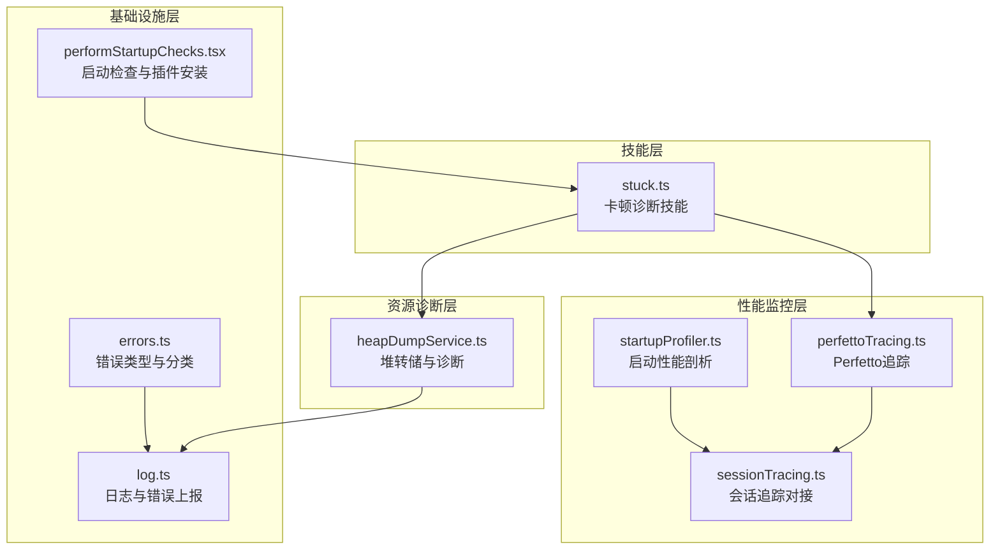
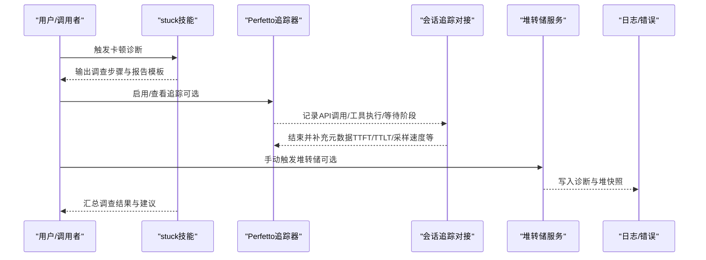
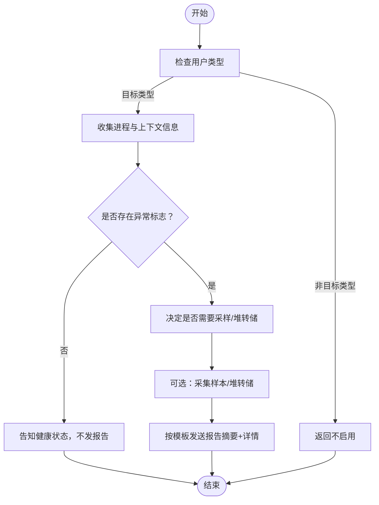
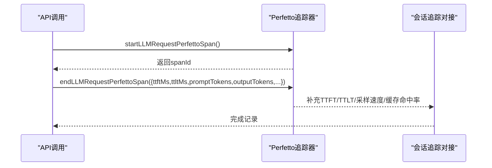
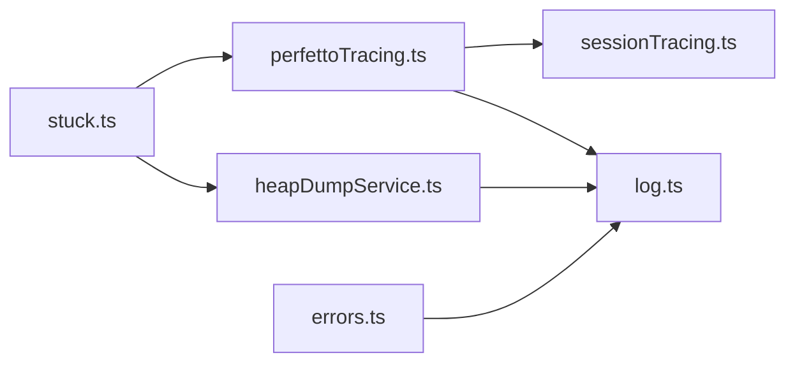

# 卡顿检测技能（stuck）

<cite>
**本文引用的文件**
- [stuck.ts](file://src/skills/bundled/stuck.ts)
- [perfettoTracing.ts](file://src/utils/telemetry/perfettoTracing.ts)
- [startupProfiler.ts](file://src/utils/startupProfiler.ts)
- [heapDumpService.ts](file://src/utils/heapDumpService.ts)
- [sessionTracing.ts](file://src/utils/telemetry/sessionTracing.ts)
- [errors.ts](file://src/utils/errors.ts)
- [log.ts](file://src/utils/log.ts)
- [performStartupChecks.tsx](file://src/utils/plugins/performStartupChecks.tsx)
</cite>

## 目录
1. [简介](#简介)
2. [项目结构](#项目结构)
3. [核心组件](#核心组件)
4. [架构总览](#架构总览)
5. [详细组件分析](#详细组件分析)
6. [依赖关系分析](#依赖关系分析)
7. [性能考量](#性能考量)
8. [故障排除指南](#故障排除指南)
9. [结论](#结论)
10. [附录](#附录)

## 简介
本文件面向Claude Code的“卡顿检测技能（stuck）”，系统化阐述其在性能监控与卡顿诊断中的作用：如何通过提示词引导用户或AI对卡顿/冻结/缓慢会话进行系统性排查；如何结合系统内置的性能追踪（Perfetto）、启动性能剖析（Startup Profiler）、堆转储（Heap Dump）与错误日志能力，形成从“现象观察—根因定位—证据采集—报告输出”的闭环流程。文档同时给出阈值设定、告警机制与处理策略建议，并提供性能基准测试与持续监控实践。

## 项目结构
与卡顿检测技能直接相关的模块分布如下：
- 技能定义与提示词：位于技能目录，提供可执行的诊断步骤与报告模板
- 性能追踪与剖析：Perfetto追踪器、启动性能剖析器、会话追踪对接
- 内存与资源诊断：堆转储服务与内存诊断指标
- 错误与日志：统一错误类型与日志记录，保障问题可复现与可追溯

图表来源
- [stuck.ts:1-80](file://src/skills/bundled/stuck.ts#L1-L80)
- [perfettoTracing.ts:1-120](file://src/utils/telemetry/perfettoTracing.ts#L1-L120)
- [startupProfiler.ts:1-60](file://src/utils/startupProfiler.ts#L1-L60)
- [heapDumpService.ts:1-60](file://src/utils/heapDumpService.ts#L1-L60)
- [sessionTracing.ts:381-420](file://src/utils/telemetry/sessionTracing.ts#L381-L420)
- [errors.ts:1-40](file://src/utils/errors.ts#L1-L40)
- [log.ts:158-203](file://src/utils/log.ts#L158-L203)
- [performStartupChecks.tsx:1-40](file://src/utils/plugins/performStartupChecks.tsx#L1-L40)

章节来源
- [stuck.ts:1-80](file://src/skills/bundled/stuck.ts#L1-L80)
- [perfettoTracing.ts:1-120](file://src/utils/telemetry/perfettoTracing.ts#L1-L120)
- [startupProfiler.ts:1-60](file://src/utils/startupProfiler.ts#L1-L60)
- [heapDumpService.ts:1-60](file://src/utils/heapDumpService.ts#L1-L60)
- [sessionTracing.ts:381-420](file://src/utils/telemetry/sessionTracing.ts#L381-L420)
- [errors.ts:1-40](file://src/utils/errors.ts#L1-L40)
- [log.ts:158-203](file://src/utils/log.ts#L158-L203)
- [performStartupChecks.tsx:1-40](file://src/utils/plugins/performStartupChecks.tsx#L1-L40)

## 核心组件
- 卡顿诊断技能（stuck）
  - 仅在特定用户类型下可用，提供针对卡顿/冻结/缓慢会话的系统化调查步骤与报告模板
  - 包含进程状态、CPU、内存、子进程挂起等关键指标的识别要点
- Perfetto追踪器
  - 提供Chrome Trace事件格式的性能追踪，支持API调用、工具执行、等待用户输入等阶段的时序可视化
  - 支持周期写盘、过期跨度清理与事件上限管理，避免长期运行导致内存膨胀
- 启动性能剖析器
  - 基于浏览器性能API的分阶段耗时统计，支持采样与详细报告两种模式
- 堆转储服务
  - 在内存异常增长或手动触发时生成堆快照与诊断信息，辅助判断是否为V8堆泄漏
- 会话追踪对接
  - 将会话生命周期内的关键事件与Perfetto追踪器对接，确保响应时间、首Token时间、采样速度等指标被完整记录
- 错误与日志
  - 统一错误类型与分类，提供安全的遥测错误消息封装，以及硬失败模式下的进程退出策略

章节来源
- [stuck.ts:61-80](file://src/skills/bundled/stuck.ts#L61-L80)
- [perfettoTracing.ts:253-335](file://src/utils/telemetry/perfettoTracing.ts#L253-L335)
- [startupProfiler.ts:1-60](file://src/utils/startupProfiler.ts#L1-L60)
- [heapDumpService.ts:221-278](file://src/utils/heapDumpService.ts#L221-L278)
- [sessionTracing.ts:381-420](file://src/utils/telemetry/sessionTracing.ts#L381-L420)
- [errors.ts:93-121](file://src/utils/errors.ts#L93-L121)
- [log.ts:158-203](file://src/utils/log.ts#L158-L203)

## 架构总览
卡顿检测技能通过提示词驱动的调查流程，结合系统内建的性能追踪与资源诊断能力，形成“诊断—取证—报告”的闭环。整体流程如下：

图表来源
- [stuck.ts:61-80](file://src/skills/bundled/stuck.ts#L61-L80)
- [perfettoTracing.ts:425-485](file://src/utils/telemetry/perfettoTracing.ts#L425-L485)
- [sessionTracing.ts:381-420](file://src/utils/telemetry/sessionTracing.ts#L381-L420)
- [heapDumpService.ts:221-278](file://src/utils/heapDumpService.ts#L221-L278)
- [log.ts:158-203](file://src/utils/log.ts#L158-L203)

## 详细组件分析

### 卡顿诊断技能（stuck）
- 能力边界
  - 仅在特定用户类型下启用，避免对外部构建产生影响
  - 提供明确的调查清单：进程列表、高CPU/高RSS、不可中断睡眠、僵尸进程、子进程挂起等
  - 强制要求“仅在发现异常时上报”，并提供两段式报告模板（摘要+详情）
- 关键阈值与信号
  - 高CPU：≥90% 持续
  - 不可中断睡眠（D状态）：I/O挂起
  - 停止/挂起（T状态）：可能误触暂停
  - 僵尸（Z状态）：父进程未回收
  - 高内存：≥4GB RSS
  - 子进程挂起：如git/node/shell命令卡死
- 处理策略
  - 仅诊断不干预，不主动终止任何进程
  - 若具备条件，可采集样本（macOS sample）以定位原因
  - 通过Slack MCP工具或复制粘贴模板向#claude-code-feedback提交报告

图表来源
- [stuck.ts:61-80](file://src/skills/bundled/stuck.ts#L61-L80)

章节来源
- [stuck.ts:6-59](file://src/skills/bundled/stuck.ts#L6-L59)

### Perfetto追踪器（响应时间与阻塞检测）
- 功能特性
  - 以Chrome Trace事件格式记录API调用、工具执行、等待用户输入等阶段
  - 自动计算派生指标：ITPS（输入令牌每秒）、OTPS（采样速度）、缓存命中率
  - 支持请求重试子跨度、请求准备阶段子跨度，便于定位阻塞点
  - 周期写盘与事件上限管理，避免长时间运行导致内存占用过高
- 关键阈值与告警
  - TTFT（首Token时间）异常升高：网络/模型/预处理阻塞
  - OTPS骤降：模型推理或后处理瓶颈
  - 缓存命中率异常：提示缓存策略或数据新鲜度问题
  - 请求准备阶段过长：客户端初始化/重试策略问题
- 处理策略
  - 定位到具体阶段（API调用/工具执行/等待）后，结合日志与堆转储进一步分析
  - 对于重试频繁场景，优先检查网络稳定性与上游限流策略

图表来源
- [perfettoTracing.ts:425-485](file://src/utils/telemetry/perfettoTracing.ts#L425-L485)
- [sessionTracing.ts:381-420](file://src/utils/telemetry/sessionTracing.ts#L381-L420)

章节来源
- [perfettoTracing.ts:253-335](file://src/utils/telemetry/perfettoTracing.ts#L253-L335)
- [perfettoTracing.ts:425-685](file://src/utils/telemetry/perfettoTracing.ts#L425-L685)
- [sessionTracing.ts:381-420](file://src/utils/telemetry/sessionTracing.ts#L381-L420)

### 启动性能剖析器（启动阶段卡顿识别）
- 功能特性
  - 通过性能标记记录关键阶段（导入、初始化、设置加载、总耗时）
  - 支持采样与详细报告两种模式，详细模式下输出内存快照
- 关键阈值与告警
  - 导入时间、初始化时间、设置加载时间异常升高：模块依赖或配置问题
  - 总启动时间显著增加：需结合Perfetto与堆转储定位
- 处理策略
  - 采样模式用于趋势监控；详细模式用于单次深入分析

章节来源
- [startupProfiler.ts:1-60](file://src/utils/startupProfiler.ts#L1-L60)
- [startupProfiler.ts:159-194](file://src/utils/startupProfiler.ts#L159-L194)

### 堆转储服务（内存泄漏与资源诊断）
- 功能特性
  - 在内存异常增长或手动触发时生成堆快照与诊断信息
  - 诊断内容包含V8堆统计、空间分布、原生上下文数、句柄与请求计数等
- 关键阈值与告警
  - RSS持续升高且无GC回收迹象：可能存在泄漏
  - 原生上下文数异常：Detached Contexts上升
  - 打开文件描述符异常：Linux/macOS平台资源泄露线索
- 处理策略
  - 先写诊断再写堆快照，避免大堆快照序列化过程崩溃
  - 结合Perfetto的采样速度下降与TTFT异常，定位泄漏发生阶段

章节来源
- [heapDumpService.ts:221-278](file://src/utils/heapDumpService.ts#L221-L278)

### 错误与日志（异常捕获与上报）
- 功能特性
  - 统一错误类型与分类，支持安全的遥测错误消息封装
  - 提供硬失败模式（HARD FAIL），在严重错误时直接退出进程
  - 错误队列与内存日志，保证在sink未就绪时也能暂存
- 处理策略
  - 对可预期的文件系统/网络错误进行分类处理
  - 对不可预期错误进行短栈帧聚合，减少上下文浪费

章节来源
- [errors.ts:93-121](file://src/utils/errors.ts#L93-L121)
- [errors.ts:197-239](file://src/utils/errors.ts#L197-L239)
- [log.ts:158-203](file://src/utils/log.ts#L158-L203)

## 依赖关系分析
- 技能与追踪器
  - stuck技能通过提示词引导用户在可疑场景下启用/查看Perfetto追踪
  - 会话追踪对接负责将响应时间、TTFT/TTLT等指标注入追踪器
- 追踪器与诊断
  - Perfetto追踪器输出的阶段与指标，与堆转储诊断相互印证
- 错误与日志
  - 统一错误类型与日志记录为问题复现提供基础

图表来源
- [stuck.ts:61-80](file://src/skills/bundled/stuck.ts#L61-L80)
- [perfettoTracing.ts:253-335](file://src/utils/telemetry/perfettoTracing.ts#L253-L335)
- [sessionTracing.ts:381-420](file://src/utils/telemetry/sessionTracing.ts#L381-L420)
- [heapDumpService.ts:221-278](file://src/utils/heapDumpService.ts#L221-L278)
- [errors.ts:93-121](file://src/utils/errors.ts#L93-L121)
- [log.ts:158-203](file://src/utils/log.ts#L158-L203)

章节来源
- [stuck.ts:61-80](file://src/skills/bundled/stuck.ts#L61-L80)
- [perfettoTracing.ts:253-335](file://src/utils/telemetry/perfettoTracing.ts#L253-L335)
- [sessionTracing.ts:381-420](file://src/utils/telemetry/sessionTracing.ts#L381-L420)
- [heapDumpService.ts:221-278](file://src/utils/heapDumpService.ts#L221-L278)
- [errors.ts:93-121](file://src/utils/errors.ts#L93-L121)
- [log.ts:158-203](file://src/utils/log.ts#L158-L203)

## 性能考量
- 响应时间监测
  - 使用TTFT/TTLT与OTPS作为核心指标，结合Perfetto阶段划分定位瓶颈
- 阻塞检测
  - 通过等待用户输入阶段与工具执行阶段的异常延长，识别阻塞点
- 性能瓶颈识别
  - API调用阶段：关注网络/模型/重试策略
  - 工具执行阶段：关注外部进程与I/O
  - 启动阶段：关注模块导入与设置加载
- 资源与内存
  - 结合RSS与堆转储诊断，区分V8堆泄漏与原生内存问题
- 告警机制
  - 建议基于阈值（如TTFT>XX秒、OTPS<YY、RSS>ZZGB）触发通知与自动采样
- 处理策略
  - 先采样/堆转储，再回溯日志与追踪，最后形成报告

[本节为通用性能讨论，无需列出章节来源]

## 故障排除指南
- 症状：会话卡顿但无明显错误
  - 步骤：启用Perfetto追踪，观察API调用与工具执行阶段耗时
  - 建议：若TTFT异常升高，检查网络与上游限流；若OTPS骤降，检查模型推理或后处理
- 症状：内存持续增长
  - 步骤：触发堆转储，对比诊断指标（RSS、Detached Contexts、打开文件描述符）
  - 建议：若Detached Contexts上升，排查上下文泄漏；若打开文件描述符异常，检查资源释放
- 症状：启动缓慢
  - 步骤：启用启动性能剖析，查看导入/初始化/设置加载阶段耗时
  - 建议：优化模块依赖与配置加载路径
- 症状：工具执行阻塞
  - 步骤：在Perfetto中定位工具执行阶段，结合系统进程状态（D/T/Z状态）判断
  - 建议：终止挂起子进程或调整外部工具参数

章节来源
- [perfettoTracing.ts:425-685](file://src/utils/telemetry/perfettoTracing.ts#L425-L685)
- [heapDumpService.ts:162-212](file://src/utils/heapDumpService.ts#L162-L212)
- [startupProfiler.ts:159-194](file://src/utils/startupProfiler.ts#L159-L194)
- [stuck.ts:14-21](file://src/skills/bundled/stuck.ts#L14-L21)

## 结论
卡顿检测技能（stuck）通过标准化的调查流程与报告模板，为卡顿/冻结/缓慢会话提供了可操作的诊断入口。结合Perfetto追踪、启动性能剖析、堆转储与统一错误日志体系，能够形成从现象到根因的闭环分析链路。建议在生产环境中以阈值驱动的方式开启采样与诊断，并将关键指标纳入持续监控仪表盘，以便快速定位与缓解性能问题。

[本节为总结性内容，无需列出章节来源]

## 附录
- 性能基准测试建议
  - 基准环境：固定硬件、相同工作负载、相同模型与工具集
  - 指标：TTFT、TTLT、OTPS、缓存命中率、启动总耗时、RSS峰值
  - 周期：每日/每周采样，记录异常事件与修复前后对比
- 持续监控建议
  - 将Perfetto导出的阶段耗时与OTPS纳入看板
  - 设置RSS与Detached Contexts的阈值告警
  - 对启动阶段耗时建立趋势基线，异常时自动触发详细剖析

[本节为通用建议，无需列出章节来源]