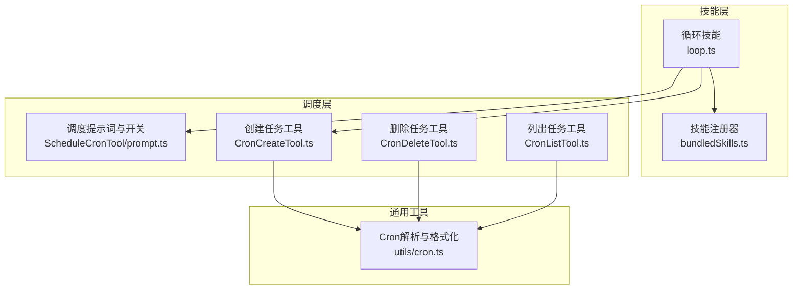
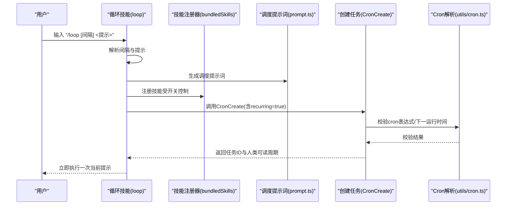
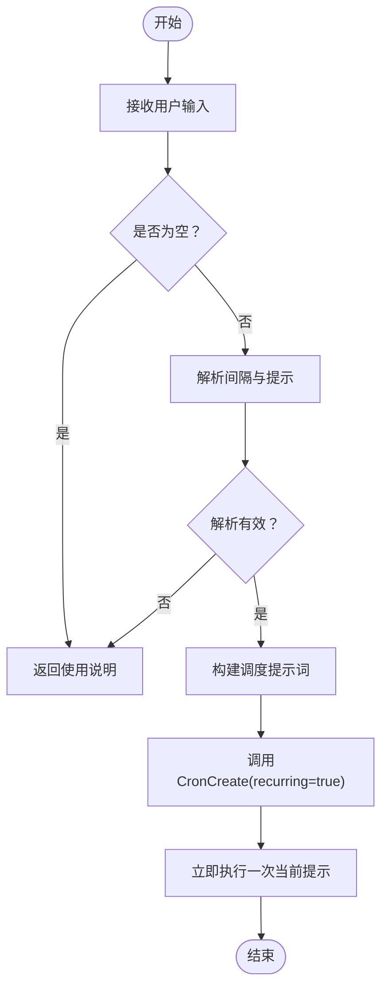
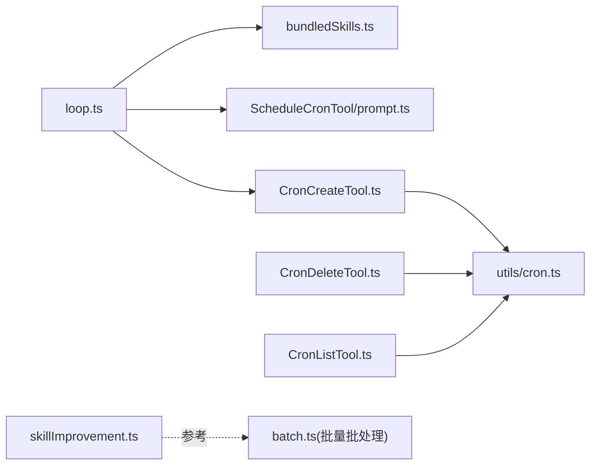

# 循环技能 (loop)

<cite>
**本文引用的文件**
- [src/skills/bundled/loop.ts](file://src/skills/bundled/loop.ts)
- [src/skills/bundledSkills.ts](file://src/skills/bundledSkills.ts)
- [src/tools/ScheduleCronTool/prompt.ts](file://src/tools/ScheduleCronTool/prompt.ts)
- [src/tools/ScheduleCronTool/CronCreateTool.ts](file://src/tools/ScheduleCronTool/CronCreateTool.ts)
- [src/tools/ScheduleCronTool/CronDeleteTool.ts](file://src/tools/ScheduleCronTool/CronDeleteTool.ts)
- [src/tools/ScheduleCronTool/CronListTool.ts](file://src/tools/ScheduleCronTool/CronListTool.ts)
- [src/utils/cron.ts](file://src/utils/cron.ts)
- [src/utils/hooks/skillImprovement.ts](file://src/utils/hooks/skillImprovement.ts)
</cite>

## 目录
1. [简介](#简介)
2. [项目结构](#项目结构)
3. [核心组件](#核心组件)
4. [架构总览](#架构总览)
5. [详细组件分析](#详细组件分析)
6. [依赖关系分析](#依赖关系分析)
7. [性能考量](#性能考量)
8. [故障排查指南](#故障排查指南)
9. [结论](#结论)
10. [附录：使用示例与最佳实践](#附录使用示例与最佳实践)

## 简介
本文件面向Claude Code的循环技能（loop），系统化阐述其循环调度能力与实现机制。循环技能允许用户以简洁的命令形式设置“按固定周期重复执行”的任务，并在创建后立即执行一次当前轮次，随后由底层调度系统按计划周期触发后续执行。本文将从架构、数据流、处理逻辑、配置参数、终止条件、异常处理、与其他技能的配合以及性能优化等维度进行深入解析。

## 项目结构
围绕循环技能的关键文件组织如下：
- 技能定义与注册：src/skills/bundled/loop.ts
- 技能注册基础设施：src/skills/bundledSkills.ts
- 调度系统开关与提示词：src/tools/ScheduleCronTool/prompt.ts
- 调度工具（创建/删除/列出）：src/tools/ScheduleCronTool/CronCreateTool.ts、CronDeleteTool.ts、CronListTool.ts
- Cron表达式解析与人类可读转换：src/utils/cron.ts
- 技能改进钩子（批量批处理相关）：src/utils/hooks/skillImprovement.ts

图表来源
- [src/skills/bundled/loop.ts:74-92](file://src/skills/bundled/loop.ts#L74-L92)
- [src/skills/bundledSkills.ts:53-100](file://src/skills/bundledSkills.ts#L53-L100)
- [src/tools/ScheduleCronTool/prompt.ts:36-62](file://src/tools/ScheduleCronTool/prompt.ts#L36-L62)
- [src/tools/ScheduleCronTool/CronCreateTool.ts:56-102](file://src/tools/ScheduleCronTool/CronCreateTool.ts#L56-L102)
- [src/tools/ScheduleCronTool/CronDeleteTool.ts:35-95](file://src/tools/ScheduleCronTool/CronDeleteTool.ts#L35-L95)
- [src/tools/ScheduleCronTool/CronListTool.ts:17-35](file://src/tools/ScheduleCronTool/CronListTool.ts#L17-L35)
- [src/utils/cron.ts:83-101](file://src/utils/cron.ts#L83-L101)

章节来源
- [src/skills/bundled/loop.ts:1-93](file://src/skills/bundled/loop.ts#L1-L93)
- [src/skills/bundledSkills.ts:11-108](file://src/skills/bundledSkills.ts#L11-L108)

## 核心组件
- 循环技能（loop）
  - 职责：解析用户输入中的时间间隔与提示词；构建调度提示；注册为可被用户调用的技能；启用条件受调度系统开关控制。
  - 关键点：支持“每秒/分/时/天”粒度；优先解析前缀时间、其次解析末尾“every …”语法；默认10分钟；若解析出空提示则返回使用说明。
- 技能注册器（bundledSkills）
  - 职责：统一注册内置技能，支持延迟提取参考文件、前置基础目录提示、统一生命周期管理。
- 调度系统开关与提示词（ScheduleCronTool/prompt.ts）
  - 职责：集中控制调度系统可用性（含环境变量覆盖）、持久化开关、默认最大存活期、提示词模板。
- 调度工具
  - CronCreate：校验cron表达式、下一触发时间、任务数量上限、持久化路径等，创建并返回任务ID。
  - CronDelete：按ID取消任务，校验任务存在性与归属。
  - CronList：列出所有任务（会区分持久化与会话内任务）。
- Cron工具（utils/cron.ts）
  - 职责：解析标准5字段cron表达式、计算下一次运行时间、将cron转为人类可读描述。

章节来源
- [src/skills/bundled/loop.ts:25-72](file://src/skills/bundled/loop.ts#L25-L72)
- [src/skills/bundledSkills.ts:15-41](file://src/skills/bundledSkills.ts#L15-L41)
- [src/tools/ScheduleCronTool/prompt.ts:36-62](file://src/tools/ScheduleCronTool/prompt.ts#L36-L62)
- [src/tools/ScheduleCronTool/CronCreateTool.ts:82-102](file://src/tools/ScheduleCronTool/CronCreateTool.ts#L82-L102)
- [src/tools/ScheduleCronTool/CronDeleteTool.ts:61-81](file://src/tools/ScheduleCronTool/CronDeleteTool.ts#L61-L81)
- [src/tools/ScheduleCronTool/CronListTool.ts:20-35](file://src/tools/ScheduleCronTool/CronListTool.ts#L20-L35)
- [src/utils/cron.ts:83-101](file://src/utils/cron.ts#L83-L101)

## 架构总览
循环技能通过“提示词构建 + 工具调用 + 调度执行”的链路完成端到端闭环。用户输入经由循环技能解析为标准调度提示，随后由CronCreate创建任务并立即执行一次，之后由调度器按cron周期触发后续执行。

图表来源
- [src/skills/bundled/loop.ts:74-92](file://src/skills/bundled/loop.ts#L74-L92)
- [src/skills/bundledSkills.ts:53-100](file://src/skills/bundledSkills.ts#L53-L100)
- [src/tools/ScheduleCronTool/prompt.ts:64-121](file://src/tools/ScheduleCronTool/prompt.ts#L64-L121)
- [src/tools/ScheduleCronTool/CronCreateTool.ts:56-102](file://src/tools/ScheduleCronTool/CronCreateTool.ts#L56-L102)
- [src/utils/cron.ts:83-101](file://src/utils/cron.ts#L83-L101)

## 详细组件分析

### 组件A：循环技能（loop）
- 功能要点
  - 输入解析：优先匹配前缀“数字+单位”（如5m、2h），其次匹配末尾“every N单位”或“every N 单位词”，否则使用默认10分钟。
  - 提示词构建：将解析后的cron表达式与提示文本传给CronCreate；同时给出人类可读周期与自动过期说明。
  - 执行策略：创建任务后立即执行一次当前提示，避免等待首次触发。
  - 启用条件：受isKairosCronEnabled开关控制，且可通过环境变量覆盖。
- 数据结构与复杂度
  - 解析过程为线性扫描与正则匹配，整体复杂度O(n)，n为输入长度。
  - cron表达式解析为常数时间（固定5字段），计算下一次运行时间最多遍历约一年内的分钟数，属于常数级上界。
- 错误处理
  - 空提示：直接返回使用说明，不调用CronCreate。
  - 无效间隔：遵循规则3（默认10分钟）或规则2（末尾every但非时间表达式）。
- 性能影响
  - 立即执行一次可减少用户感知延迟，但需确保当前无阻塞任务。
  - cron表达式校验在工具层完成，避免错误任务进入调度队列。

图表来源
- [src/skills/bundled/loop.ts:25-72](file://src/skills/bundled/loop.ts#L25-L72)
- [src/skills/bundled/loop.ts:74-92](file://src/skills/bundled/loop.ts#L74-L92)

章节来源
- [src/skills/bundled/loop.ts:11-23](file://src/skills/bundled/loop.ts#L11-L23)
- [src/skills/bundled/loop.ts:25-72](file://src/skills/bundled/loop.ts#L25-L72)
- [src/skills/bundled/loop.ts:74-92](file://src/skills/bundled/loop.ts#L74-L92)

### 组件B：技能注册器（bundledSkills）
- 职责
  - 统一注册内置技能，支持延迟提取参考文件、前置基础目录提示、统一生命周期管理。
  - 为循环技能提供注册入口，设置名称、描述、启用条件、是否用户可调用等元信息。
- 复杂度与健壮性
  - 注册过程为O(1)，文件提取采用一次性缓存，避免重复写入。
  - 路径安全检查防止逃逸，失败时记录调试日志但不影响技能继续工作。

章节来源
- [src/skills/bundledSkills.ts:15-41](file://src/skills/bundledSkills.ts#L15-L41)
- [src/skills/bundledSkills.ts:53-100](file://src/skills/bundledSkills.ts#L53-L100)
- [src/skills/bundledSkills.ts:131-145](file://src/skills/bundledSkills.ts#L131-L145)
- [src/skills/bundledSkills.ts:195-206](file://src/skills/bundledSkills.ts#L195-L206)

### 组件C：调度系统开关与提示词（prompt.ts）
- 职责
  - isKairosCronEnabled：综合编译期特性开关与运行时GrowthBook门控，支持环境变量强制关闭。
  - isDurableCronEnabled：独立控制持久化开关，不影响会话内调度。
  - 提供CronCreate/CronDelete/CronList的描述与提示词模板。
- 运行时行为
  - 默认最大存活期用于回收长期运行的循环任务，避免无限占用资源。
  - 提示词中明确持久化与会话内任务的区别及边界。

章节来源
- [src/tools/ScheduleCronTool/prompt.ts:36-62](file://src/tools/ScheduleCronTool/prompt.ts#L36-L62)
- [src/tools/ScheduleCronTool/prompt.ts:68-121](file://src/tools/ScheduleCronTool/prompt.ts#L68-L121)
- [src/tools/ScheduleCronTool/prompt.ts:123-136](file://src/tools/ScheduleCronTool/prompt.ts#L123-L136)

### 组件D：调度工具（CronCreate/CronDelete/CronList）
- CronCreate
  - 校验：cron表达式合法性、下一运行时间可达性、任务数量上限、持久化路径。
  - 输出：任务ID与人类可读周期，便于用户确认与后续取消。
- CronDelete
  - 校验：任务存在性、任务归属（多智能体场景下仅能取消自己的任务）。
  - 输出：已取消的任务ID。
- CronList
  - 列出所有任务（持久化与会话内），便于运维与审计。

章节来源
- [src/tools/ScheduleCronTool/CronCreateTool.ts:82-102](file://src/tools/ScheduleCronTool/CronCreateTool.ts#L82-L102)
- [src/tools/ScheduleCronTool/CronDeleteTool.ts:61-81](file://src/tools/ScheduleCronTool/CronDeleteTool.ts#L61-L81)
- [src/tools/ScheduleCronTool/CronListTool.ts:20-35](file://src/tools/ScheduleCronTool/CronListTool.ts#L20-L35)

### 组件E：Cron工具（utils/cron.ts）
- 职责
  - 解析标准5字段cron表达式为展开集合，支持通配符、步长、范围、列表。
  - 计算严格大于给定时间的下一次运行时间，考虑月份/周日等约束。
  - 将常见cron模式转为人类可读描述，支持本地时区与UTC显示差异。
- 复杂度
  - 表达式解析为常数时间（固定字段数）。
  - 下一次运行时间计算最多遍历约一年分钟数，属于常数级上界。

章节来源
- [src/utils/cron.ts:83-101](file://src/utils/cron.ts#L83-L101)
- [src/utils/cron.ts:119-181](file://src/utils/cron.ts#L119-L181)
- [src/utils/cron.ts:218-308](file://src/utils/cron.ts#L218-L308)

## 依赖关系分析
- 循环技能依赖技能注册器进行注册，依赖调度提示词与开关，最终调用CronCreate完成调度。
- CronCreate依赖Cron解析工具进行表达式校验与下一运行时间计算。
- CronDelete/CronList依赖任务存储与上下文判定，确保任务可见性与可操作性。
- 技能改进钩子（skillImprovement.ts）与循环技能无直接耦合，但可作为批量批处理场景的补充。

图表来源
- [src/skills/bundled/loop.ts:74-92](file://src/skills/bundled/loop.ts#L74-L92)
- [src/skills/bundledSkills.ts:53-100](file://src/skills/bundledSkills.ts#L53-L100)
- [src/tools/ScheduleCronTool/prompt.ts:64-121](file://src/tools/ScheduleCronTool/prompt.ts#L64-L121)
- [src/tools/ScheduleCronTool/CronCreateTool.ts:56-102](file://src/tools/ScheduleCronTool/CronCreateTool.ts#L56-L102)
- [src/utils/cron.ts:83-101](file://src/utils/cron.ts#L83-L101)
- [src/utils/hooks/skillImprovement.ts:80-117](file://src/utils/hooks/skillImprovement.ts#L80-L117)

章节来源
- [src/utils/hooks/skillImprovement.ts:80-117](file://src/utils/hooks/skillImprovement.ts#L80-L117)

## 性能考量
- 立即执行策略
  - 在创建任务后立即执行一次当前提示，可显著降低用户等待时间，但需确保当前无阻塞任务，避免抢占式冲突。
- Cron表达式校验
  - 在工具层尽早失败，避免错误任务进入调度队列，减少无效唤醒与资源浪费。
- 任务数量限制
  - 限制最大任务数（例如50），防止过度并发导致系统压力过大。
- 最大存活期
  - 循环任务在达到最大存活期后自动过期，避免长期占用资源；建议结合业务需求合理设置间隔与过期时间。
- 人类可读周期
  - 使用cronToHuman生成易理解的周期描述，有助于用户快速评估与调整任务频率。

## 故障排查指南
- 常见问题与定位
  - 无法创建任务：检查cron表达式是否合法、下一运行时间是否可达、任务数量是否超过上限。
  - 任务未触发：确认调度系统开关是否开启、环境变量是否覆盖、当前是否处于空闲状态。
  - 任务无法取消：确认任务ID是否存在、是否为当前智能体所拥有。
  - 立即执行失败：检查当前是否有阻塞任务、权限与工具可用性。
- 排查步骤
  - 使用CronList查看当前所有任务，核对任务ID与周期。
  - 使用CronDelete按ID取消任务，重新创建并观察。
  - 检查调度提示词与开关状态，必要时临时关闭持久化以验证会话内行为。
  - 查看调试日志，定位技能注册与文件提取阶段的问题。

章节来源
- [src/tools/ScheduleCronTool/CronCreateTool.ts:82-102](file://src/tools/ScheduleCronTool/CronCreateTool.ts#L82-L102)
- [src/tools/ScheduleCronTool/CronDeleteTool.ts:61-81](file://src/tools/ScheduleCronTool/CronDeleteTool.ts#L61-L81)
- [src/tools/ScheduleCronTool/CronListTool.ts:20-35](file://src/tools/ScheduleCronTool/CronListTool.ts#L20-L35)
- [src/skills/bundledSkills.ts:131-145](file://src/skills/bundledSkills.ts#L131-L145)

## 结论
循环技能（loop）通过简洁的命令式接口与强大的调度系统结合，实现了“立即执行 + 周期触发”的高效重复性任务处理。其设计强调可读性（人类可读周期）、可控性（开关与持久化）、可观测性（任务列表与取消）、可维护性（错误早发现与清晰提示）。配合其他技能与工具，可形成从“一次性任务”到“长期监控”的完整自动化闭环。

## 附录：使用示例与最佳实践
- 典型场景
  - 定时巡检：每5分钟检查部署状态，立即执行一次当前检查。
  - 周期提醒：每小时提醒团队站会，避免错过会议时间。
  - 长期监控：每天凌晨执行健康检查，自动过期回收。
- 最佳实践
  - 合理选择间隔：尽量避开API热点时刻（如整点/半点），降低并发峰值。
  - 明确终止条件：为长期循环任务设置合理的最大存活期，避免无限占用。
  - 分离持久化与会话内任务：仅对需要跨会话保留的任务启用持久化。
  - 与技能改进钩子配合：在批量批处理场景中，利用技能改进钩子提升流程质量与一致性。