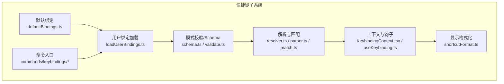
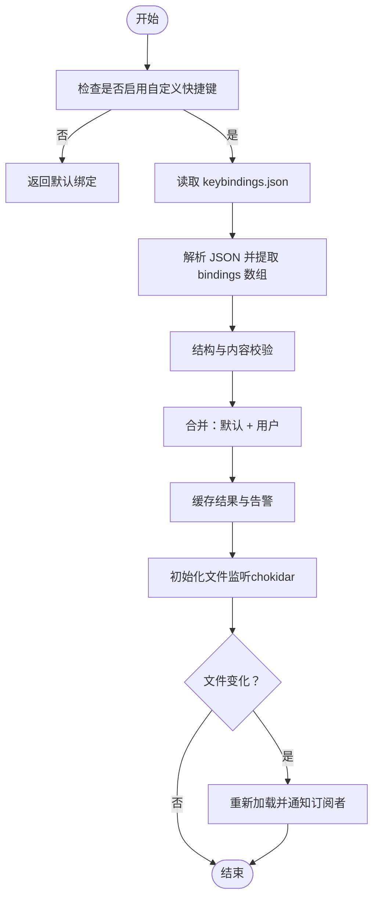
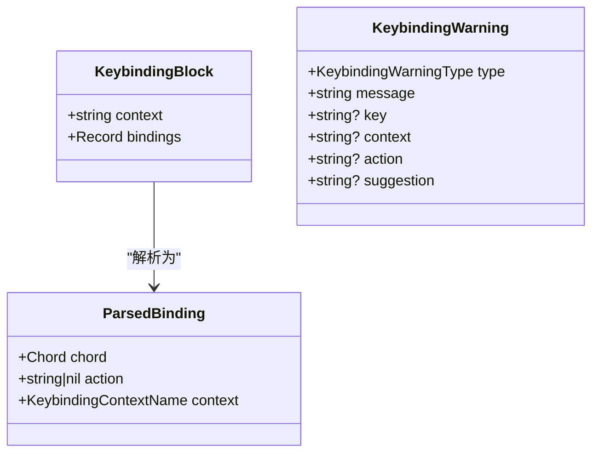
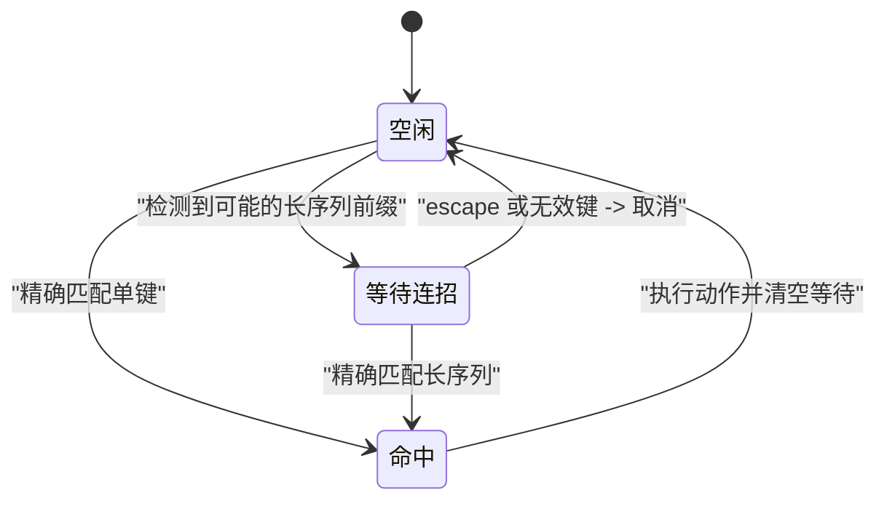
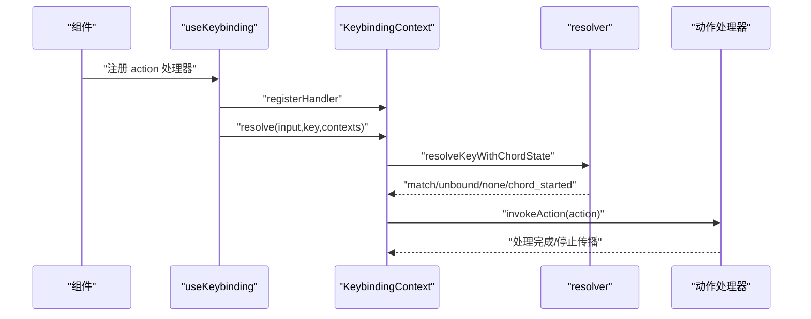
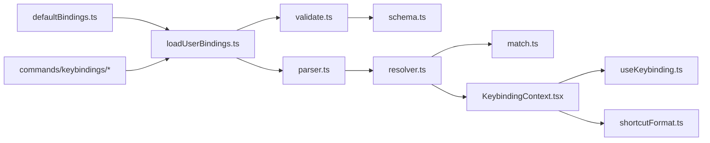

# 快捷键技能（keybindings）

<cite>
**本文引用的文件**
- [defaultBindings.ts](file://src/keybindings/defaultBindings.ts)
- [loadUserBindings.ts](file://src/keybindings/loadUserBindings.ts)
- [schema.ts](file://src/keybindings/schema.ts)
- [validate.ts](file://src/keybindings/validate.ts)
- [resolver.ts](file://src/keybindings/resolver.ts)
- [parser.ts](file://src/keybindings/parser.ts)
- [match.ts](file://src/keybindings/match.ts)
- [reservedShortcuts.ts](file://src/keybindings/reservedShortcuts.ts)
- [useKeybinding.ts](file://src/keybindings/useKeybinding.ts)
- [KeybindingContext.tsx](file://src/keybindings/KeybindingContext.tsx)
- [shortcutFormat.ts](file://src/keybindings/shortcutFormat.ts)
- [index.ts（命令）](file://src/commands/keybindings/index.ts)
- [keybindings.ts（命令实现）](file://src/commands/keybindings/keybindings.ts)
</cite>

## 目录
1. [简介](#简介)
2. [项目结构](#项目结构)
3. [核心组件](#核心组件)
4. [架构总览](#架构总览)
5. [详细组件分析](#详细组件分析)
6. [依赖关系分析](#依赖关系分析)
7. [性能考量](#性能考量)
8. [故障排查指南](#故障排查指南)
9. [结论](#结论)
10. [附录：配置与使用指南](#附录配置与使用指南)

## 简介
本文件系统性阐述 Claude Code 的“快捷键技能”（keybindings），覆盖默认快捷键、用户自定义配置、解析与匹配机制、冲突与优先级规则、平台差异、以及如何通过快捷键显著提升效率与体验。文档同时提供可操作的配置示例与个性化设置建议，并给出学习曲线与适应建议。

## 项目结构
快捷键子系统围绕“默认绑定 + 用户绑定 + 解析器 + 上下文 + 命令入口”的结构组织，关键模块如下：
- 默认绑定：定义全局与各上下文的默认快捷键
- 用户绑定加载与热重载：从用户目录读取并监听变更
- 模式校验与 JSON Schema：确保配置合法
- 解析与匹配：将输入事件转换为动作
- 上下文与钩子：在 UI 中注册与处理快捷键
- 命令入口：生成/打开用户配置文件



图表来源
- [defaultBindings.ts:32-341](file://src/keybindings/defaultBindings.ts#L32-L341)
- [loadUserBindings.ts:133-237](file://src/keybindings/loadUserBindings.ts#L133-L237)
- [schema.ts:177-229](file://src/keybindings/schema.ts#L177-L229)
- [validate.ts:425-451](file://src/keybindings/validate.ts#L425-L451)
- [resolver.ts:32-61](file://src/keybindings/resolver.ts#L32-L61)
- [parser.ts:191-203](file://src/keybindings/parser.ts#L191-L203)
- [match.ts:29-47](file://src/keybindings/match.ts#L29-L47)
- [KeybindingContext.tsx:13-43](file://src/keybindings/KeybindingContext.tsx#L13-L43)
- [useKeybinding.ts:33-97](file://src/keybindings/useKeybinding.ts#L33-L97)
- [shortcutFormat.ts:38-63](file://src/keybindings/shortcutFormat.ts#L38-L63)
- [index.ts（命令）:4-11](file://src/commands/keybindings/index.ts#L4-L11)
- [keybindings.ts（命令实现）:11-53](file://src/commands/keybindings/keybindings.ts#L11-L53)

章节来源
- [defaultBindings.ts:32-341](file://src/keybindings/defaultBindings.ts#L32-L341)
- [loadUserBindings.ts:133-237](file://src/keybindings/loadUserBindings.ts#L133-L237)
- [schema.ts:177-229](file://src/keybindings/schema.ts#L177-L229)
- [validate.ts:425-451](file://src/keybindings/validate.ts#L425-L451)
- [resolver.ts:32-61](file://src/keybindings/resolver.ts#L32-L61)
- [parser.ts:191-203](file://src/keybindings/parser.ts#L191-L203)
- [match.ts:29-47](file://src/keybindings/match.ts#L29-L47)
- [KeybindingContext.tsx:13-43](file://src/keybindings/KeybindingContext.tsx#L13-L43)
- [useKeybinding.ts:33-97](file://src/keybindings/useKeybinding.ts#L33-L97)
- [shortcutFormat.ts:38-63](file://src/keybindings/shortcutFormat.ts#L38-L63)
- [index.ts（命令）:4-11](file://src/commands/keybindings/index.ts#L4-L11)
- [keybindings.ts（命令实现）:11-53](file://src/commands/keybindings/keybindings.ts#L11-L53)

## 核心组件
- 默认绑定（defaultBindings.ts）
  - 定义全局、聊天、自动补全、设置、确认、标签页、转录、历史搜索、任务、主题选择器、滚动、帮助、附件、底部指示器、消息选择器、差异对话框、模型选择器、选择组件、插件等上下文的默认快捷键
  - 包含平台特定逻辑（如图片粘贴键、模式循环键在不同终端/VT模式下的差异）
  - 预留部分功能开关（如 KAIROS、QUICK_SEARCH、TERMINAL_PANEL、MESSAGE_ACTIONS、VOICE_MODE 等）

- 用户绑定加载（loadUserBindings.ts）
  - 仅对特定用户类型开放（Anthropic 员工），外部用户始终使用默认绑定
  - 从用户配置目录读取 keybindings.json，支持对象包装格式 { "bindings": [...] }
  - 提供同步/异步加载、缓存、热重载（chokidar 监听）、错误日志与告警
  - 合并顺序：默认绑定在前，用户绑定在后（用户绑定覆盖默认）

- 模式校验与 Schema（schema.ts / validate.ts）
  - 使用 Zod 生成 JSON Schema，约束上下文名称、动作标识、命令绑定格式
  - 校验结构合法性、重复键、保留键冲突、命令绑定上下文限制、语音激活键的安全性提示

- 解析与匹配（resolver.ts / parser.ts / match.ts）
  - 将输入字符与修饰键映射为内部表示，支持多键组合与连招（chord）
  - 单键阶段与连招阶段分别匹配；连招等待时优先长序列，避免短序列误触发
  - 支持“未绑定”显式解绑（action=null），以及保留键检查

- 上下文与钩子（KeybindingContext.tsx / useKeybinding.ts）
  - 提供 React 上下文，注册活动上下文集合，管理连招状态，分发动作回调
  - useKeybinding/useKeybindings 钩子负责在组件中注册动作处理器，处理传播与回退

- 显示格式化（shortcutFormat.ts）
  - 在非 React 环境获取已配置快捷键显示文本，必要时回退到默认值并记录事件

- 命令入口（commands/keybindings/*）
  - /keybindings 命令用于创建或打开用户配置文件模板，写入时采用排他写以避免竞态

章节来源
- [defaultBindings.ts:32-341](file://src/keybindings/defaultBindings.ts#L32-L341)
- [loadUserBindings.ts:133-237](file://src/keybindings/loadUserBindings.ts#L133-L237)
- [schema.ts:177-229](file://src/keybindings/schema.ts#L177-L229)
- [validate.ts:425-451](file://src/keybindings/validate.ts#L425-L451)
- [resolver.ts:32-61](file://src/keybindings/resolver.ts#L32-L61)
- [parser.ts:191-203](file://src/keybindings/parser.ts#L191-L203)
- [match.ts:29-47](file://src/keybindings/match.ts#L29-L47)
- [KeybindingContext.tsx:13-43](file://src/keybindings/KeybindingContext.tsx#L13-L43)
- [useKeybinding.ts:33-97](file://src/keybindings/useKeybinding.ts#L33-L97)
- [shortcutFormat.ts:38-63](file://src/keybindings/shortcutFormat.ts#L38-L63)
- [index.ts（命令）:4-11](file://src/commands/keybindings/index.ts#L4-L11)
- [keybindings.ts（命令实现）:11-53](file://src/commands/keybindings/keybindings.ts#L11-L53)

## 架构总览
快捷键工作流从输入事件开始，经过上下文判定、连招状态管理、解析匹配，最终调用注册的动作处理器。

```mermaid
sequenceDiagram
participant U as "用户"
participant Ink as "Ink 输入"
participant Ctx as "KeybindingContext"
participant Res as "解析器(resolver)"
participant Par as "解析(parser)"
participant Mat as "匹配(match)"
participant Act as "动作处理器"
U->>Ink : "按键/修饰键"
Ink->>Ctx : "输入事件"
Ctx->>Res : "resolve(input,key,contexts)"
Res->>Par : "解析chord/keystroke"
Par-->>Res : "ParsedBinding[]"
Res->>Mat : "匹配单键/连招"
Mat-->>Res : "匹配结果"
Res-->>Ctx : "match/unbound/none/chord_started"
Ctx->>Act : "invokeAction(action)"
Act-->>Ctx : "处理完成/停止传播"
```

图表来源
- [KeybindingContext.tsx:13-43](file://src/keybindings/KeybindingContext.tsx#L13-L43)
- [resolver.ts:32-61](file://src/keybindings/resolver.ts#L32-L61)
- [parser.ts:191-203](file://src/keybindings/parser.ts#L191-L203)
- [match.ts:29-47](file://src/keybindings/match.ts#L29-L47)
- [useKeybinding.ts:47-96](file://src/keybindings/useKeybinding.ts#L47-L96)

## 详细组件分析

### 组件A：默认绑定与平台适配
- 关键点
  - 图片粘贴键根据平台选择 alt+v（Windows）或 ctrl+v
  - 模式循环键在支持 VT 的终端上使用 shift+tab，在不支持的 Windows 终端上使用 meta+m
  - 多处功能开关控制快捷键启用（如 KAIROS、QUICK_SEARCH、TERMINAL_PANEL、MESSAGE_ACTIONS、VOICE_MODE）
  - 特殊键（ctrl+c、ctrl+d、ctrl+m）被保留，不可重绑定

- 影响范围
  - 所有上下文的默认行为基线
  - 为用户自定义提供覆盖空间

章节来源
- [defaultBindings.ts:12-31](file://src/keybindings/defaultBindings.ts#L12-L31)
- [defaultBindings.ts:32-341](file://src/keybindings/defaultBindings.ts#L32-L341)

### 组件B：用户绑定加载与热重载
- 关键点
  - 仅 Anthropic 员工可启用自定义快捷键
  - 文件路径：~/.claude/keybindings.json，支持对象包装 { "bindings": [...] }
  - 同步/异步加载、缓存、chokidar 监听、稳定阈值与轮询策略
  - 合并顺序：默认在前，用户在后，用户覆盖默认
  - 错误与告警：结构错误、键重复、解析失败、权限问题等

- 流程图（加载与热重载）


图表来源
- [loadUserBindings.ts:133-237](file://src/keybindings/loadUserBindings.ts#L133-L237)
- [loadUserBindings.ts:353-404](file://src/keybindings/loadUserBindings.ts#L353-L404)
- [loadUserBindings.ts:424-448](file://src/keybindings/loadUserBindings.ts#L424-L448)

章节来源
- [loadUserBindings.ts:133-237](file://src/keybindings/loadUserBindings.ts#L133-L237)
- [loadUserBindings.ts:353-404](file://src/keybindings/loadUserBindings.ts#L353-L404)
- [loadUserBindings.ts:424-448](file://src/keybindings/loadUserBindings.ts#L424-L448)

### 组件C：模式校验与 Schema
- 关键点
  - 上下文枚举与动作枚举集中定义，保证一致性
  - Schema 约束：context 必须为枚举值；bindings 为对象映射；action 可为动作字符串、命令前缀或 null（解绑）
  - 校验内容：结构合法性、重复键（同一上下文内）、保留键冲突、命令绑定上下文限制、语音激活键安全性

- 类图（关键类型）


图表来源
- [schema.ts:177-229](file://src/keybindings/schema.ts#L177-L229)
- [validate.ts:26-34](file://src/keybindings/validate.ts#L26-L34)
- [parser.ts:191-203](file://src/keybindings/parser.ts#L191-L203)

章节来源
- [schema.ts:177-229](file://src/keybindings/schema.ts#L177-L229)
- [validate.ts:425-451](file://src/keybindings/validate.ts#L425-L451)

### 组件D：解析与匹配（含连招）
- 关键点
  - 单键阶段：按上下文过滤后，最后一条匹配生效
  - 连招阶段：等待更长序列，若存在更长匹配则优先等待；否则精确匹配
  - “未绑定”：action=null 时视为显式解绑
  - 修饰键兼容：alt/meta 在终端中常混用，解析时统一处理；super（cmd/win）需终端协议支持

- 状态机（连招解析）


图表来源
- [resolver.ts:166-244](file://src/keybindings/resolver.ts#L166-L244)

章节来源
- [resolver.ts:32-61](file://src/keybindings/resolver.ts#L32-L61)
- [resolver.ts:166-244](file://src/keybindings/resolver.ts#L166-L244)
- [parser.ts:13-75](file://src/keybindings/parser.ts#L13-L75)
- [match.ts:29-47](file://src/keybindings/match.ts#L29-L47)

### 组件E：上下文与钩子
- 关键点
  - KeybindingContext 提供 resolve、getDisplayText、activeContexts、handler 注册与调用
  - useKeybinding/useKeybindings 在组件中注册动作处理器，支持连招等待与取消、显式解绑传播控制
  - 优先级：已注册活动上下文 > 当前上下文 > Global

- 序列图（钩子处理流程）


图表来源
- [useKeybinding.ts:47-96](file://src/keybindings/useKeybinding.ts#L47-L96)
- [KeybindingContext.tsx:13-43](file://src/keybindings/KeybindingContext.tsx#L13-L43)
- [resolver.ts:166-244](file://src/keybindings/resolver.ts#L166-L244)

章节来源
- [KeybindingContext.tsx:13-43](file://src/keybindings/KeybindingContext.tsx#L13-L43)
- [useKeybinding.ts:33-97](file://src/keybindings/useKeybinding.ts#L33-L97)

### 组件F：显示格式化与回退
- 关键点
  - 在非 React 环境获取已配置快捷键显示文本
  - 若未找到，记录一次回退事件并返回默认值
  - 用于命令、服务等场景展示当前生效的快捷键

章节来源
- [shortcutFormat.ts:38-63](file://src/keybindings/shortcutFormat.ts#L38-L63)

### 组件G：命令入口（/keybindings）
- 关键点
  - 仅在启用自定义快捷键时可用
  - 创建或打开用户配置文件，写入模板，避免 stat 预检带来的竞态
  - 编辑器打开失败会返回友好提示

章节来源
- [index.ts（命令）:4-11](file://src/commands/keybindings/index.ts#L4-L11)
- [keybindings.ts（命令实现）:11-53](file://src/commands/keybindings/keybindings.ts#L11-L53)

## 依赖关系分析
- 内聚与耦合
  - defaultBindings 与 loadUserBindings 通过 parseBindings 合并，形成“默认优先、用户覆盖”的高内聚设计
  - resolver 依赖 parser 与 match，职责清晰：解析输入为内部结构，再进行匹配
  - KeybindingContext 作为上下文中心，协调解析与处理器调用
  - validate 与 schema 双向约束，保证配置质量

- 外部依赖
  - chokidar：文件监听与热重载
  - Zod：JSON Schema 生成与校验
  - Ink：输入事件与修饰键信息



图表来源
- [defaultBindings.ts:32-341](file://src/keybindings/defaultBindings.ts#L32-L341)
- [loadUserBindings.ts:133-237](file://src/keybindings/loadUserBindings.ts#L133-L237)
- [validate.ts:425-451](file://src/keybindings/validate.ts#L425-L451)
- [schema.ts:177-229](file://src/keybindings/schema.ts#L177-L229)
- [parser.ts:191-203](file://src/keybindings/parser.ts#L191-L203)
- [resolver.ts:32-61](file://src/keybindings/resolver.ts#L32-L61)
- [match.ts:29-47](file://src/keybindings/match.ts#L29-L47)
- [KeybindingContext.tsx:13-43](file://src/keybindings/KeybindingContext.tsx#L13-L43)
- [useKeybinding.ts:33-97](file://src/keybindings/useKeybinding.ts#L33-L97)
- [shortcutFormat.ts:38-63](file://src/keybindings/shortcutFormat.ts#L38-L63)
- [index.ts（命令）:4-11](file://src/commands/keybindings/index.ts#L4-L11)
- [keybindings.ts（命令实现）:11-53](file://src/commands/keybindings/keybindings.ts#L11-L53)

## 性能考量
- 解析与匹配
  - 解析阶段：一次性 parseBindings，后续只做匹配，时间复杂度近似 O(N)（N 为绑定数）
  - 匹配阶段：单键阶段先过滤上下文，再逐条匹配；连招阶段通过前缀匹配减少比较次数
- 缓存与热重载
  - 同步加载使用缓存，避免重复 IO
  - chokidar 监听采用稳定阈值与轮询策略，降低频繁触发
- 渲染与传播
  - useKeybinding 在命中后调用 stopImmediatePropagation，减少后续处理器开销

[本节为通用指导，无需列出具体文件来源]

## 故障排查指南
- 常见问题与定位
  - 结构错误：bindings 不是数组、缺少 bindings 字段、块结构非法
  - 重复键：同一上下文中重复定义同一键
  - 保留键冲突：尝试重绑定不可重绑定键（如 ctrl+c、ctrl+d、ctrl+m）
  - 命令绑定上下文错误：command:* 必须位于 Chat 上下文
  - 语音激活键风险：裸字母键在热身阶段可能打印字符，建议使用空格或带修饰键组合
  - 文件权限/不存在：chokidar 监听目录不存在或非目录时不会监听
  - 外部用户无自定义：仅 Anthropic 员工可启用自定义快捷键

- 排查步骤
  - 使用 /keybindings 命令打开或创建配置文件，检查格式与上下文
  - 查看控制台/日志中的验证告警（parse_error、duplicate、reserved、invalid_context、invalid_action）
  - 临时禁用用户绑定以确认是否为自定义配置导致的问题
  - 在非 React 场景使用 getShortcutDisplay 获取显示文本，观察回退事件

章节来源
- [validate.ts:130-247](file://src/keybindings/validate.ts#L130-L247)
- [validate.ts:332-368](file://src/keybindings/validate.ts#L332-L368)
- [validate.ts:370-399](file://src/keybindings/validate.ts#L370-L399)
- [loadUserBindings.ts:353-404](file://src/keybindings/loadUserBindings.ts#L353-L404)
- [reservedShortcuts.ts:16-33](file://src/keybindings/reservedShortcuts.ts#L16-L33)
- [shortcutFormat.ts:38-63](file://src/keybindings/shortcutFormat.ts#L38-L63)

## 结论
Claude Code 的快捷键系统通过“默认绑定 + 用户覆盖 + 强约束校验 + 连招解析 + 上下文优先级”的设计，既保证了易用性与可扩展性，又兼顾了跨平台与终端差异。对于提升效率而言，合理规划常用动作的快捷键、遵循保留键与上下文规则、善用连招与显式解绑，能够显著缩短交互路径、减少鼠标切换、提升专注度。

[本节为总结性内容，无需列出具体文件来源]

## 附录：配置与使用指南

### 设置方法
- 启用与入口
  - 仅 Anthropic 员工可启用自定义快捷键
  - 使用 /keybindings 命令创建或打开配置文件（~/.claude/keybindings.json），采用对象包装格式 { "bindings": [...] }

- 加载与热重载
  - 应用启动时同步加载默认绑定
  - 启用自定义后异步加载用户绑定并监听变更，自动热重载

章节来源
- [index.ts（命令）:4-11](file://src/commands/keybindings/index.ts#L4-L11)
- [keybindings.ts（命令实现）:11-53](file://src/commands/keybindings/keybindings.ts#L11-L53)
- [loadUserBindings.ts:133-237](file://src/keybindings/loadUserBindings.ts#L133-L237)
- [loadUserBindings.ts:353-404](file://src/keybindings/loadUserBindings.ts#L353-L404)

### 可用的快捷键组合
- 全局（Global）
  - 示例：中断、退出、重绘、待办切换、转录切换、简报切换（视功能开关）、快速搜索、快速打开、终端面板开关等
- 聊天（Chat）
  - 示例：取消、杀掉代理、模式循环、模型选择器、快速模式、思考开关、提交、历史上下/下一页、撤销、外部编辑器、暂存、图片粘贴、消息动作（视功能开关）、语音激活（视功能开关）
- 自动补全（Autocomplete）
  - 示例：接受、关闭、上一项、下一项
- 设置（Settings）
  - 示例：取消、列表上下导航、空格选中、保存并关闭、搜索、重试
- 确认（Confirmation）
  - 示例：是/否、列表上下导航、切换字段、切换模式、切换解释、切换调试
- 标签页（Tabs）
  - 示例：下一/上一
- 转录（Transcript）
  - 示例：切换显示全部、退出、q 退出
- 历史搜索（HistorySearch）
  - 示例：下一个、接受、取消、执行
- 任务（Task）
  - 示例：后台运行（tmux 场景）
- 主题选择器（ThemePicker）
  - 示例：切换语法高亮
- 滚动（Scroll）
  - 示例：翻页、行进、回到顶部/底部、复制
- 帮助（Help）
  - 示例：关闭
- 附件（Attachments）
  - 示例：下一/上一、移除、退出
- 底部指示器（Footer）
  - 示例：上下/左右、打开选中、清除选择
- 消息选择器（MessageSelector）
  - 示例：上下、到顶/到底、选择
- 差异对话框（DiffDialog）
  - 示例：关闭、前后源、前后文件、查看详情
- 模型选择器（ModelPicker）
  - 示例：降低/提高努力
- 选择（Select）
  - 示例：上/下、接受/取消
- 插件（Plugin）
  - 示例：切换、安装

章节来源
- [defaultBindings.ts:32-341](file://src/keybindings/defaultBindings.ts#L32-L341)

### 冲突解决与优先级规则
- 优先级
  - 已注册活动上下文 > 当前上下文 > Global
  - 用户绑定在默认绑定之后，覆盖同键同上下文的默认行为
- 保留键
  - 不可重绑定：ctrl+c、ctrl+d、ctrl+m
  - 终端拦截：ctrl+z（挂起）、ctrl+\（退出信号）
  - macOS 系统：cmd+c/v/x/q/w/tab/space 等
- 连招优先
  - 存在更长连招前缀时不立即触发短序列，避免误触发
- 显式解绑
  - 将 action 设为 null 可显式解绑某键

章节来源
- [resolver.ts:32-61](file://src/keybindings/resolver.ts#L32-L61)
- [resolver.ts:166-244](file://src/keybindings/resolver.ts#L166-L244)
- [reservedShortcuts.ts:16-83](file://src/keybindings/reservedShortcuts.ts#L16-L83)
- [validate.ts:332-368](file://src/keybindings/validate.ts#L332-L368)

### 个性化设置示例
- 常用场景建议
  - 聊天：将“提交”设为更顺手的键；将“撤销”设为 ctrl+_ 或 ctrl+shift+-
  - 列表导航：在 Select/Confirmation/Footer 等上下文使用 j/k 或方向键
  - 模式切换：将“模式循环”设为 shift+tab 或 meta+m（取决于终端）
  - 语音：将“按住说话”设为空格或 meta+k，避免热身阶段打印字符
- 注意事项
  - 避免与系统/终端/Shell 冲突（如 cmd+、ctrl+c/d/m、ctrl+z/\）
  - 连招尽量避免与常用单键冲突
  - 使用命令绑定时必须置于 Chat 上下文

章节来源
- [validate.ts:218-243](file://src/keybindings/validate.ts#L218-L243)
- [defaultBindings.ts:12-31](file://src/keybindings/defaultBindings.ts#L12-L31)

### 提升效率与用户体验
- 减少手离开键盘的时间：将常用动作映射到顺手位置
- 一致性：同一类操作在不同上下文使用相同键
- 可发现性：通过 /keybindings 命令查看当前生效的快捷键显示文本
- 无障碍：为不同平台选择合适键（如 Windows 的 alt+v 粘贴）

章节来源
- [shortcutFormat.ts:38-63](file://src/keybindings/shortcutFormat.ts#L38-L63)
- [keybindings.ts（命令实现）:11-53](file://src/commands/keybindings/keybindings.ts#L11-L53)

### 学习曲线与适应建议
- 第一阶段：熟悉默认键，重点掌握聊天与列表导航
- 第二阶段：针对高频动作进行微调，保持与默认键的差异化
- 第三阶段：引入连招，减少常用序列的输入成本
- 建议：逐步迁移，先改一两个关键键，观察效果后再扩展

[本节为通用指导，无需列出具体文件来源]