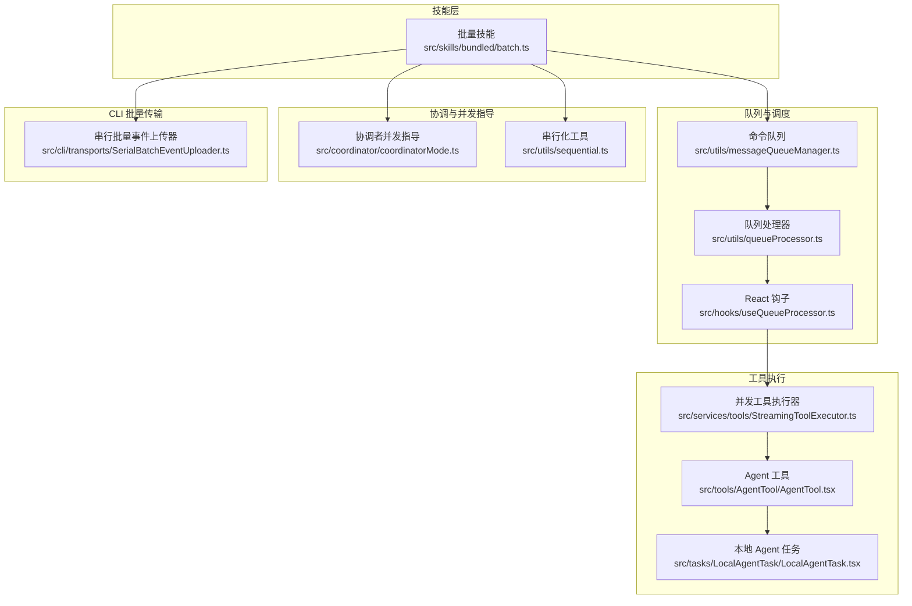
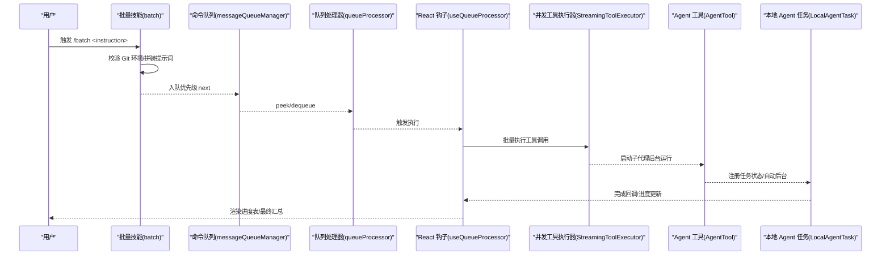
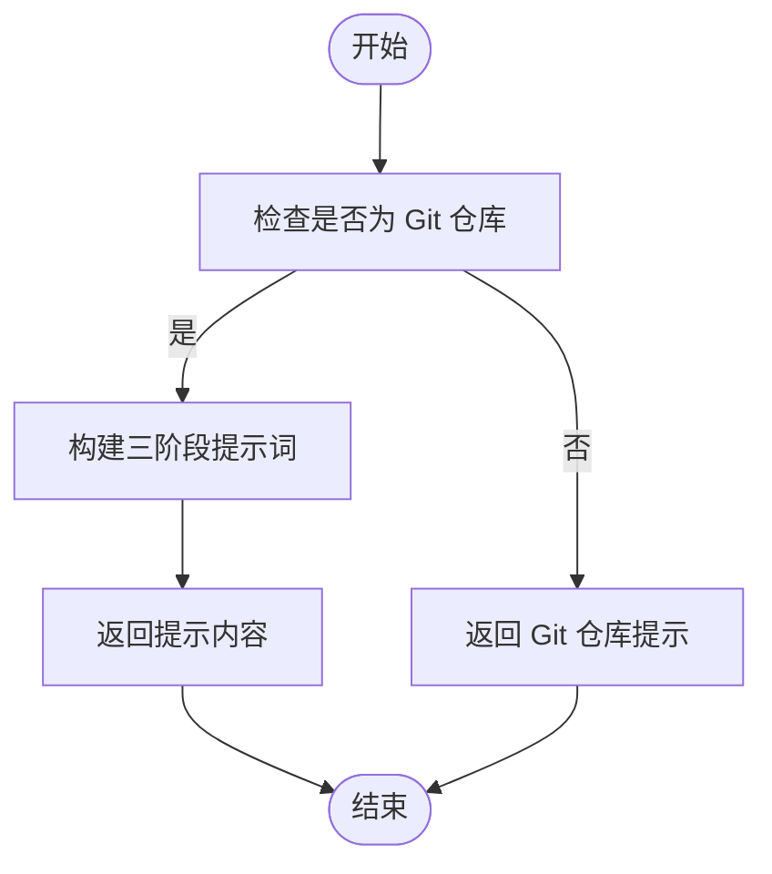
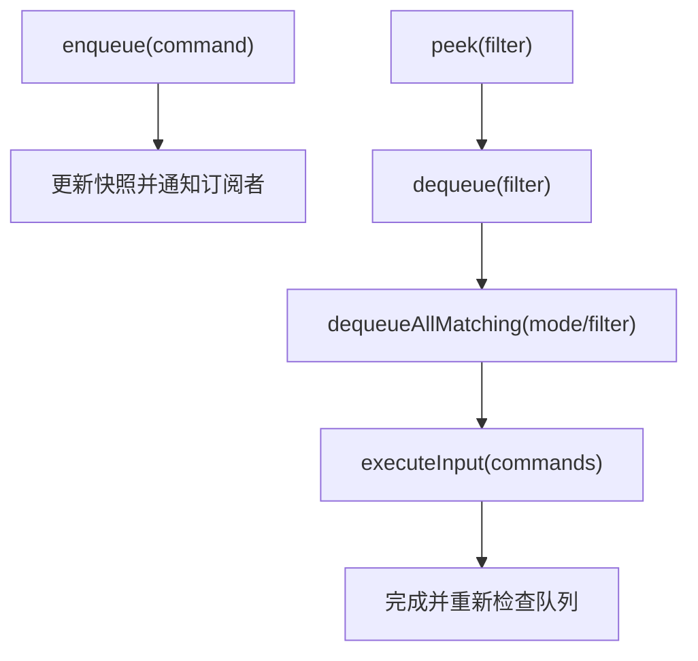
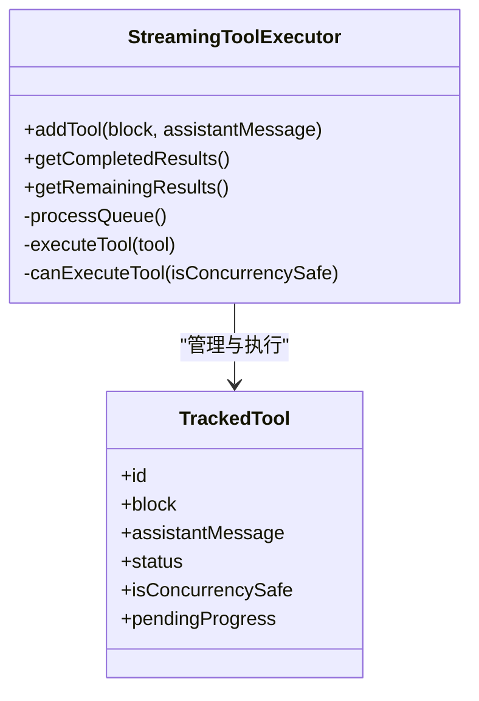
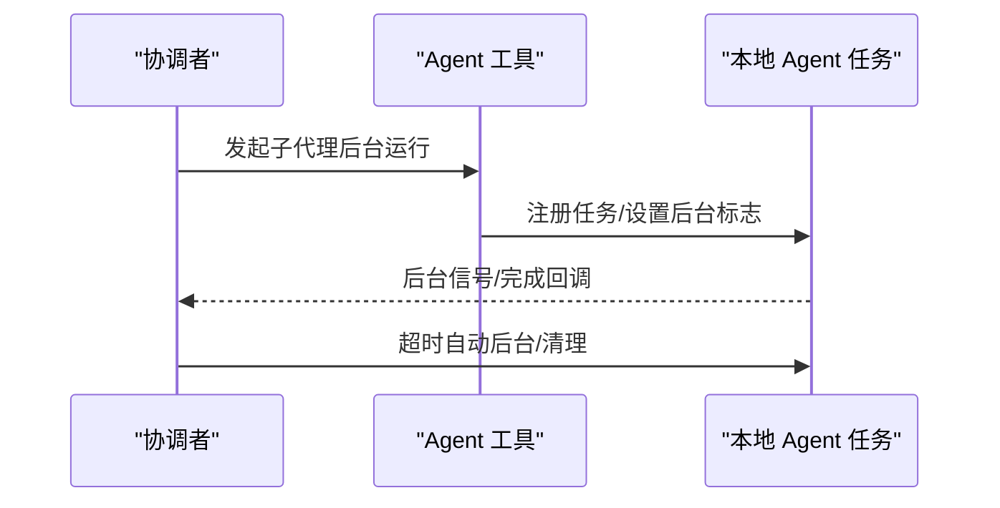
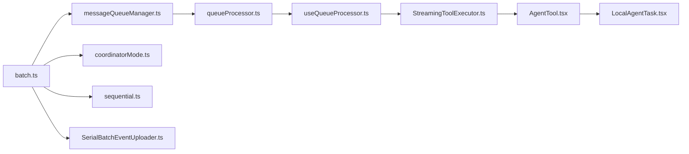

# 批量处理技能（batch）

<cite>
**本文引用的文件**
- [batch.ts](file://src/skills/bundled/batch.ts)
- [batch.ts](file://build-src/src/skills/bundled/batch.ts)
- [messageQueueManager.ts](file://src/utils/messageQueueManager.ts)
- [queueProcessor.ts](file://src/utils/queueProcessor.ts)
- [useQueueProcessor.ts](file://src/hooks/useQueueProcessor.ts)
- [StreamingToolExecutor.ts](file://src/services/tools/StreamingToolExecutor.ts)
- [AgentTool.tsx](file://src/tools/AgentTool/AgentTool.tsx)
- [LocalAgentTask.tsx](file://src/tasks/LocalAgentTask/LocalAgentTask.tsx)
- [coordinatorMode.ts](file://src/coordinator/coordinatorMode.ts)
- [Sequential.ts](file://src/utils/sequential.ts)
- [SerialBatchEventUploader.ts](file://src/cli/transports/SerialBatchEventUploader.ts)
</cite>

## 目录
1. [简介](#简介)
2. [项目结构](#项目结构)
3. [核心组件](#核心组件)
4. [架构总览](#架构总览)
5. [详细组件分析](#详细组件分析)
6. [依赖关系分析](#依赖关系分析)
7. [性能考量](#性能考量)
8. [故障排查指南](#故障排查指南)
9. [结论](#结论)
10. [附录：使用示例与最佳实践](#附录使用示例与最佳实践)

## 简介
本文件系统性阐述 Claude Code 的批量处理技能（batch）的设计与实现，重点覆盖以下方面：
- 批量任务的分解与并行执行机制
- 任务队列管理与优先级调度
- 工具并发安全与串行化保障
- 协调者（coordinator）工作流与子代理（agent）编排
- 输入参数与输出结果规范
- 错误处理与调试技巧
- 性能优化策略与与其他技能的协作方式

该技能通过“研究—计划—并行执行—进度跟踪”的三阶段工作流，将大规模、可分解的变更拆分为 5–30 个独立单元，每个单元在隔离的 git worktree 中并行执行，最终汇总为多个独立 PR。

## 项目结构
与批量处理技能直接相关的关键模块如下：
- 技能定义与提示词构建：src/skills/bundled/batch.ts
- 命令队列与优先级调度：src/utils/messageQueueManager.ts、src/utils/queueProcessor.ts、src/hooks/useQueueProcessor.ts
- 工具并发执行器：src/services/tools/StreamingToolExecutor.ts
- 子代理与后台任务：src/tools/AgentTool/AgentTool.tsx、src/tasks/LocalAgentTask/LocalAgentTask.tsx
- 协调者并发指导：src/coordinator/coordinatorMode.ts
- 串行化工具：src/utils/sequential.ts
- 批量事件上传器（CLI 层）：src/cli/transports/SerialBatchEventUploader.ts

图表来源
- [batch.ts:100-125](file://src/skills/bundled/batch.ts#L100-L125)
- [messageQueueManager.ts:123-193](file://src/utils/messageQueueManager.ts#L123-L193)
- [queueProcessor.ts:52-87](file://src/utils/queueProcessor.ts#L52-L87)
- [useQueueProcessor.ts:28-38](file://src/hooks/useQueueProcessor.ts#L28-L38)
- [StreamingToolExecutor.ts:40-151](file://src/services/tools/StreamingToolExecutor.ts#L40-L151)
- [AgentTool.tsx:559-577](file://src/tools/AgentTool/AgentTool.tsx#L559-L577)
- [LocalAgentTask.tsx:485-678](file://src/tasks/LocalAgentTask/LocalAgentTask.tsx#L485-L678)
- [coordinatorMode.ts:211-235](file://src/coordinator/coordinatorMode.ts#L211-L235)
- [sequential.ts:1-56](file://src/utils/sequential.ts#L1-L56)
- [SerialBatchEventUploader.ts:64-233](file://src/cli/transports/SerialBatchEventUploader.ts#L64-L233)

章节来源
- [batch.ts:1-125](file://src/skills/bundled/batch.ts#L1-L125)
- [messageQueueManager.ts:1-548](file://src/utils/messageQueueManager.ts#L1-L548)
- [queueProcessor.ts:1-96](file://src/utils/queueProcessor.ts#L1-L96)
- [useQueueProcessor.ts:1-38](file://src/hooks/useQueueProcessor.ts#L1-L38)
- [StreamingToolExecutor.ts:1-531](file://src/services/tools/StreamingToolExecutor.ts#L1-L531)
- [AgentTool.tsx:559-577](file://src/tools/AgentTool/AgentTool.tsx#L559-L577)
- [LocalAgentTask.tsx:485-678](file://src/tasks/LocalAgentTask/LocalAgentTask.tsx#L485-L678)
- [coordinatorMode.ts:211-235](file://src/coordinator/coordinatorMode.ts#L211-L235)
- [sequential.ts:1-56](file://src/utils/sequential.ts#L1-L56)
- [SerialBatchEventUploader.ts:64-233](file://src/cli/transports/SerialBatchEventUploader.ts#L64-L233)

## 核心组件
- 批量技能注册与提示词生成：负责校验环境（必须为 Git 仓库）、拼装三阶段提示词（研究/计划/并行执行/进度跟踪），并以禁用模型调用的方式直接返回提示内容给协调者。
- 命令队列与调度：统一管理用户输入、通知消息与任务指令，支持优先级（now/next/later）与模式（prompt/bash/task-notification）分组批处理。
- 并发工具执行器：根据工具的并发安全性决定是否允许并行执行，非并发工具串行执行，保证顺序一致性。
- 子代理与后台任务：Agent 工具支持后台运行与自动后台切换；本地 Agent 任务支持状态管理、超时自动后台与清理。
- 协调者并发指导：强调“并行是超级能力”，在研究与实现阶段给出并发策略建议。
- 串行化工具：为需要避免竞态的操作提供顺序执行包装。
- CLI 批量事件上传器：在 CLI 场景下对事件进行批量缓冲、背压控制与序列化发送。

章节来源
- [batch.ts:100-125](file://src/skills/bundled/batch.ts#L100-L125)
- [messageQueueManager.ts:123-193](file://src/utils/messageQueueManager.ts#L123-L193)
- [queueProcessor.ts:52-87](file://src/utils/queueProcessor.ts#L52-L87)
- [StreamingToolExecutor.ts:40-151](file://src/services/tools/StreamingToolExecutor.ts#L40-L151)
- [AgentTool.tsx:559-577](file://src/tools/AgentTool/AgentTool.tsx#L559-L577)
- [LocalAgentTask.tsx:485-678](file://src/tasks/LocalAgentTask/LocalAgentTask.tsx#L485-L678)
- [coordinatorMode.ts:211-235](file://src/coordinator/coordinatorMode.ts#L211-L235)
- [sequential.ts:1-56](file://src/utils/sequential.ts#L1-L56)
- [SerialBatchEventUploader.ts:64-233](file://src/cli/transports/SerialBatchEventUploader.ts#L64-L233)

## 架构总览
批量处理技能的端到端流程由“提示词构建—命令入队—队列调度—工具并发执行—子代理后台运行—进度汇总”构成。其关键交互如下：

图表来源
- [batch.ts:110-122](file://src/skills/bundled/batch.ts#L110-L122)
- [messageQueueManager.ts:167-193](file://src/utils/messageQueueManager.ts#L167-L193)
- [queueProcessor.ts:52-87](file://src/utils/queueProcessor.ts#L52-L87)
- [useQueueProcessor.ts:28-38](file://src/hooks/useQueueProcessor.ts#L28-L38)
- [StreamingToolExecutor.ts:40-151](file://src/services/tools/StreamingToolExecutor.ts#L40-L151)
- [AgentTool.tsx:559-577](file://src/tools/AgentTool/AgentTool.tsx#L559-L577)
- [LocalAgentTask.tsx:485-678](file://src/tasks/LocalAgentTask/LocalAgentTask.tsx#L485-L678)

## 详细组件分析

### 组件一：批量技能（batch）
- 职责
  - 校验当前目录是否为 Git 仓库，否则提示初始化或在仓库内运行。
  - 生成三阶段提示词：Phase 1 研究与计划；Phase 2 并行启动子代理；Phase 3 进度跟踪与汇总。
  - 指定最小/最大子代理数量范围（5–30），并要求每个子代理使用隔离的 worktree 与后台运行。
- 输入参数
  - 必填：指令文本（instruction）。若为空，返回引导消息。
- 输出结果
  - 返回纯文本提示内容，供协调者后续处理；不触发模型推理。

图表来源
- [batch.ts:110-122](file://src/skills/bundled/batch.ts#L110-L122)
- [batch.ts:91-98](file://src/skills/bundled/batch.ts#L91-L98)

章节来源
- [batch.ts:1-125](file://src/skills/bundled/batch.ts#L1-L125)
- [batch.ts:1-125](file://build-src/src/skills/bundled/batch.ts#L1-L125)

### 组件二：命令队列与调度（messageQueueManager + queueProcessor + useQueueProcessor）
- 命令队列
  - 支持三种优先级：now/next/later；同优先级按 FIFO 处理。
  - 提供入队、出队、窥视、匹配出队、移除、清空等操作。
  - 对用户输入默认优先级为 next，系统通知默认 later。
- 队列处理器
  - 分离斜杠命令与 bash 命令为单条执行，其他非斜杠命令按模式聚合批量执行。
  - 仅处理主进程命令（agentId 未设置），避免子代理通知阻塞。
- React 钩子
  - 订阅队列变化，在查询空闲且无本地 UI 阻塞时触发处理。

图表来源
- [messageQueueManager.ts:123-193](file://src/utils/messageQueueManager.ts#L123-L193)
- [queueProcessor.ts:52-87](file://src/utils/queueProcessor.ts#L52-L87)
- [useQueueProcessor.ts:28-38](file://src/hooks/useQueueProcessor.ts#L28-L38)

章节来源
- [messageQueueManager.ts:1-548](file://src/utils/messageQueueManager.ts#L1-L548)
- [queueProcessor.ts:1-96](file://src/utils/queueProcessor.ts#L1-L96)
- [useQueueProcessor.ts:1-38](file://src/hooks/useQueueProcessor.ts#L1-L38)

### 组件三：并发工具执行器（StreamingToolExecutor）
- 并发策略
  - 工具按“并发安全”属性决定是否与其他并发安全工具并行执行。
  - 非并发工具串行执行，确保顺序一致性与资源互斥。
- 执行流程
  - 工具入队后立即尝试执行；若条件满足则启动，否则等待。
  - 支持进度消息即时产出、错误传播与兄弟进程取消（如 Bash 失败导致级联取消）。
  - 提供迭代器与异步迭代器，用于逐步产出已完成结果与进度。
- 中断与回退
  - 用户中断或流式回退时生成合成错误消息，避免重复报错。
  - 支持丢弃（discard）已排队与进行中的工具，用于回退场景。

图表来源
- [StreamingToolExecutor.ts:40-151](file://src/services/tools/StreamingToolExecutor.ts#L40-L151)
- [StreamingToolExecutor.ts:265-405](file://src/services/tools/StreamingToolExecutor.ts#L265-L405)

章节来源
- [StreamingToolExecutor.ts:1-531](file://src/services/tools/StreamingToolExecutor.ts#L1-L531)

### 组件四：子代理与后台任务（AgentTool + LocalAgentTask）
- Agent 工具
  - 强制后台运行以避免阻塞主循环；根据特性开关与上下文决定是否异步。
  - 为子代理装配独立工具池，避免父权限影响。
- 本地 Agent 任务
  - 注册任务状态、自动后台信号、超时自动后台与清理逻辑。
  - 提供后台切换与前台注销接口，确保生命周期可控。

图表来源
- [AgentTool.tsx:559-577](file://src/tools/AgentTool/AgentTool.tsx#L559-L577)
- [LocalAgentTask.tsx:485-678](file://src/tasks/LocalAgentTask/LocalAgentTask.tsx#L485-L678)

章节来源
- [AgentTool.tsx:559-577](file://src/tools/AgentTool/AgentTool.tsx#L559-L577)
- [LocalAgentTask.tsx:485-678](file://src/tasks/LocalAgentTask/LocalAgentTask.tsx#L485-L678)

### 组件五：协调者并发指导（coordinatorMode）
- 并发原则
  - 研究类只读任务自由并行；写密集任务串行；验证可在不同文件区域与实现并行。
- 质量标准
  - 验证需证明代码实际可用，而非仅确认存在；类型检查与错误调查不可忽视。
- 失败处理
  - 子代理失败时继续同一实例修正，必要时更换方案并向用户汇报。

章节来源
- [coordinatorMode.ts:211-235](file://src/coordinator/coordinatorMode.ts#L211-L235)

### 组件六：串行化工具（sequential）
- 作用
  - 将并发调用串行化，保证顺序执行与正确返回值，适用于文件写入或易冲突的数据库更新等场景。
- 行为
  - 内部维护队列与处理状态，逐个执行并保持调用上下文。

章节来源
- [sequential.ts:1-56](file://src/utils/sequential.ts#L1-L56)

### 组件七：CLI 批量事件上传器（SerialBatchEventUploader）
- 功能
  - 缓冲待发送事件，按批次大小与字节上限打包；支持背压等待与刷新等待。
  - 在无法序列化的项上进行就地丢弃，防止队列卡死。
- 关键点
  - pendingCount 可用于关闭前后计数对比，检测静默丢弃批次。

章节来源
- [SerialBatchEventUploader.ts:64-233](file://src/cli/transports/SerialBatchEventUploader.ts#L64-L233)

## 依赖关系分析
- 批量技能依赖命令队列与调度，确保提示词与后续工具调用有序进入执行环。
- 并发工具执行器依赖工具定义与权限判定，按并发安全属性调度执行。
- 子代理与任务管理依赖状态存储与生命周期钩子，确保后台运行与清理。
- 协调者并发指导提供策略约束，影响任务拆分与执行顺序。
- 串行化工具作为通用保障，用于需要避免竞态的场景。
- CLI 批量事件上传器在 CLI 环境下提供批量传输能力。

图表来源
- [batch.ts:100-125](file://src/skills/bundled/batch.ts#L100-L125)
- [messageQueueManager.ts:123-193](file://src/utils/messageQueueManager.ts#L123-L193)
- [queueProcessor.ts:52-87](file://src/utils/queueProcessor.ts#L52-L87)
- [useQueueProcessor.ts:28-38](file://src/hooks/useQueueProcessor.ts#L28-L38)
- [StreamingToolExecutor.ts:40-151](file://src/services/tools/StreamingToolExecutor.ts#L40-L151)
- [AgentTool.tsx:559-577](file://src/tools/AgentTool/AgentTool.tsx#L559-L577)
- [LocalAgentTask.tsx:485-678](file://src/tasks/LocalAgentTask/LocalAgentTask.tsx#L485-L678)
- [coordinatorMode.ts:211-235](file://src/coordinator/coordinatorMode.ts#L211-L235)
- [sequential.ts:1-56](file://src/utils/sequential.ts#L1-L56)
- [SerialBatchEventUploader.ts:64-233](file://src/cli/transports/SerialBatchEventUploader.ts#L64-L233)

章节来源
- [batch.ts:1-125](file://src/skills/bundled/batch.ts#L1-L125)
- [messageQueueManager.ts:1-548](file://src/utils/messageQueueManager.ts#L1-L548)
- [queueProcessor.ts:1-96](file://src/utils/queueProcessor.ts#L1-L96)
- [useQueueProcessor.ts:1-38](file://src/hooks/useQueueProcessor.ts#L1-L38)
- [StreamingToolExecutor.ts:1-531](file://src/services/tools/StreamingToolExecutor.ts#L1-L531)
- [AgentTool.tsx:559-577](file://src/tools/AgentTool/AgentTool.tsx#L559-L577)
- [LocalAgentTask.tsx:485-678](file://src/tasks/LocalAgentTask/LocalAgentTask.tsx#L485-L678)
- [coordinatorMode.ts:211-235](file://src/coordinator/coordinatorMode.ts#L211-L235)
- [sequential.ts:1-56](file://src/utils/sequential.ts#L1-L56)
- [SerialBatchEventUploader.ts:64-233](file://src/cli/transports/SerialBatchEventUploader.ts#L64-L233)

## 性能考量
- 并发最大化
  - 研究与只读任务尽量并行；写密集任务串行；验证与实现尽可能并行但分区执行。
- 队列批处理
  - 非斜杠命令按模式聚合，减少执行开销；斜杠命令与 bash 命令单独处理以保留错误隔离。
- 背压与限流
  - CLI 批量上传器在缓冲区满时暂停生产者，待空间释放后恢复；合理设置批次大小与字节上限。
- 工具并发安全
  - 使用并发安全标记避免不必要的串行；非并发工具串行执行，确保资源一致性。
- 自动后台与清理
  - 子代理自动后台与超时清理，避免长时间占用主线程与资源泄漏。

## 故障排查指南
- Git 环境问题
  - 症状：提示非 Git 仓库。
  - 排查：确认当前目录为 Git 仓库；若不存在，先初始化或在已有仓库中运行。
- 队列停滞
  - 症状：命令未被处理或 UI 卡住。
  - 排查：检查是否有子代理通知导致未过滤；确认 useQueueProcessor 条件满足（无查询、无本地 UI 阻塞）。
- 工具执行异常
  - 症状：并发工具执行失败或被回退。
  - 排查：查看工具并发安全标记；Bash 失败会触发兄弟进程取消；检查流式回退与丢弃逻辑。
- 子代理未完成
  - 症状：后台任务未按时完成或未清理。
  - 排查：确认自动后台定时器与清理函数是否注册；检查任务状态与后台信号解析。
- CLI 批量上传失败
  - 症状：批次被丢弃或挂起。
  - 排查：检查 droppedBatchCount 与 pendingCount；定位不可序列化项并修复数据结构。

章节来源
- [batch.ts:91-98](file://src/skills/bundled/batch.ts#L91-L98)
- [messageQueueManager.ts:167-193](file://src/utils/messageQueueManager.ts#L167-L193)
- [queueProcessor.ts:52-87](file://src/utils/queueProcessor.ts#L52-L87)
- [StreamingToolExecutor.ts:153-205](file://src/services/tools/StreamingToolExecutor.ts#L153-L205)
- [LocalAgentTask.tsx:572-678](file://src/tasks/LocalAgentTask/LocalAgentTask.tsx#L572-L678)
- [SerialBatchEventUploader.ts:84-94](file://src/cli/transports/SerialBatchEventUploader.ts#L84-L94)

## 结论
批量处理技能通过“研究—计划—并行执行—进度跟踪”的闭环，结合命令队列、并发工具执行器与子代理后台运行机制，实现了对大规模变更的高效、可控与可观测的自动化执行。遵循并发指导、合理设置任务粒度与批次参数、利用串行化工具与背压控制，可显著提升整体吞吐与稳定性。

## 附录：使用示例与最佳实践
- 使用示例
  - 在终端输入 /batch <instruction>，其中 instruction 描述要执行的大规模变更（如迁移、重构、批量注解等）。
  - 确保当前目录为 Git 仓库；若为空仓库，请先初始化。
  - 等待协调者生成计划并并行启动子代理；在 UI 中观察进度表与 PR 链接。
- 最佳实践
  - 任务拆分：优先按目录或模块切分，保证每单位可独立实现与合并。
  - 并发策略：研究与只读任务并行；写密集任务串行；验证与实现分区并行。
  - 错误处理：关注 Bash 级联失败与工具回退；必要时在同一子代理上继续修正。
  - 性能优化：合理设置子代理数量（5–30）；CLI 环境下调整批次大小与字节上限；启用自动后台与清理。
  - 调试技巧：通过 droppedBatchCount 与 pendingCount 判断静默丢弃；利用进度消息与完成回调定位问题。