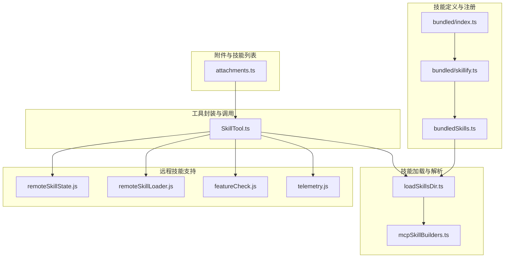
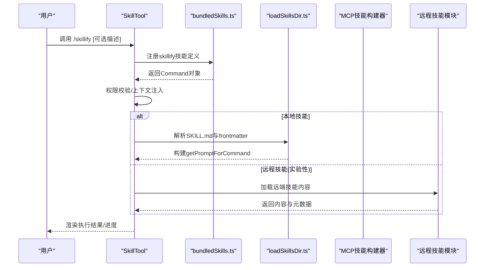
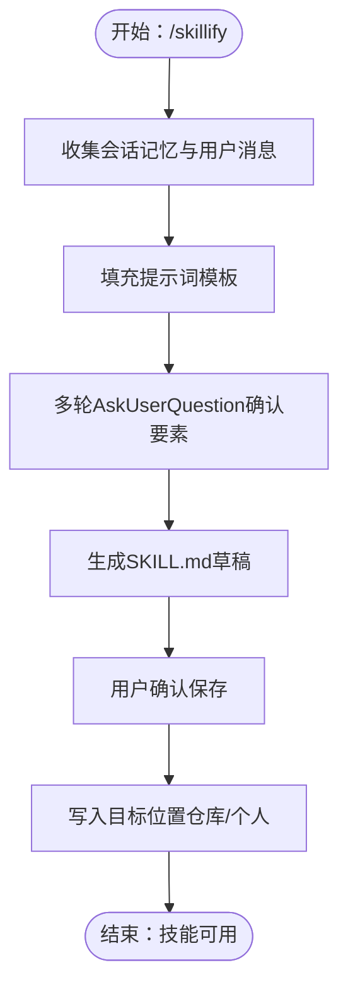
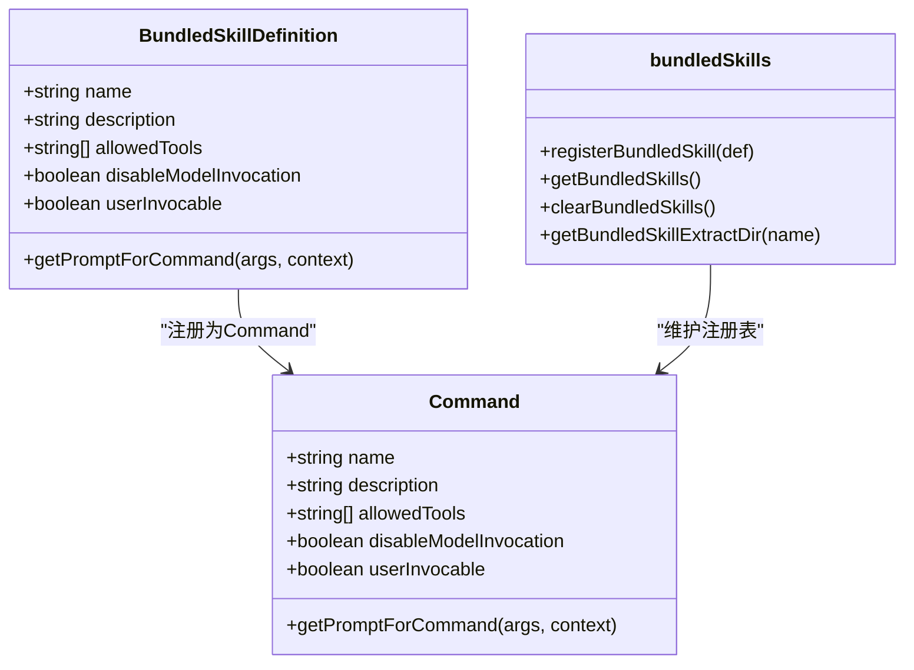
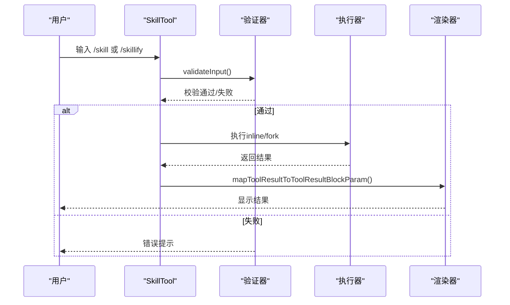
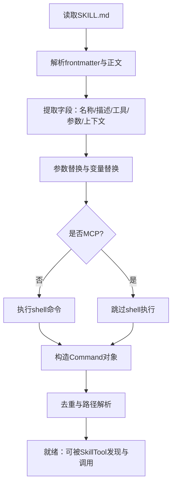
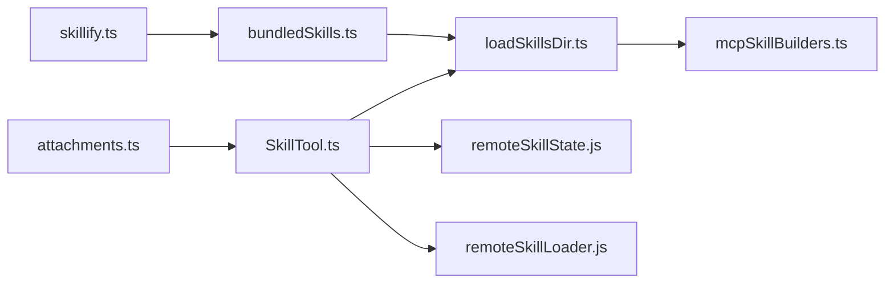

# 技能化技能（skillify）

<cite>
**本文引用的文件**
- [SkillTool.ts](file://src/tools/SkillTool/SkillTool.ts)
- [bundledSkills.ts](file://src/skills/bundledSkills.ts)
- [loadSkillsDir.ts](file://src/skills/loadSkillsDir.ts)
- [mcpSkillBuilders.ts](file://src/skills/mcpSkillBuilders.ts)
- [index.ts](file://src/skills/bundled/index.ts)
- [skillify.ts](file://src/skills/bundled/skillify.ts)
- [remoteSkillState.js](file://services/skillSearch/remoteSkillState.js)
- [remoteSkillLoader.js](file://services/skillSearch/remoteSkillLoader.js)
- [featureCheck.js](file://services/skillSearch/featureCheck.js)
- [telemetry.js](file://services/skillSearch/telemetry.js)
- [attachments.ts](file://src/utils/attachments.ts)
</cite>

## 目录
1. [简介](#简介)
2. [项目结构](#项目结构)
3. [核心组件](#核心组件)
4. [架构总览](#架构总览)
5. [详细组件分析](#详细组件分析)
6. [依赖关系分析](#依赖关系分析)
7. [性能考量](#性能考量)
8. [故障排查指南](#故障排查指南)
9. [结论](#结论)
10. [附录](#附录)

## 简介
本文件面向Claude Code的“技能化技能”（skillify），系统阐述其在技能系统中的定位与作用：将一次会话中可重复的流程固化为可复用的技能（SKILL.md），并以模块化、接口标准化与复用性增强的方式融入现有技能体系。文档覆盖以下要点：
- 转换规则：从会话记忆与用户消息中抽取关键信息，生成技能模板与参数建议
- 封装策略：通过内置技能注册机制与工具层封装，统一技能生命周期与执行上下文
- 接口设计：SkillTool对技能调用进行权限校验、上下文注入与结果渲染
- 兼容性保证：支持本地技能、MCP技能与实验性远程技能的统一发现与执行
- 实施指南：如何在实际场景中使用skillify捕获工作流，以及质量评估与最佳实践

## 项目结构
围绕skillify的关键目录与文件如下：
- 技能定义与注册：src/skills/bundled/*.ts（含skillify.ts）、src/skills/bundled/index.ts
- 技能加载与解析：src/skills/loadSkillsDir.ts、src/skills/mcpSkillBuilders.ts
- 工具封装与调用：src/tools/SkillTool/SkillTool.ts
- 远程技能支持（实验性）：services/skillSearch/*
- 附件与技能列表：src/utils/attachments.ts

**图表来源**
- [bundled/index.ts:24-80](file://src/skills/bundled/index.ts#L24-L80)
- [skillify.ts:158-198](file://src/skills/bundled/skillify.ts#L158-L198)
- [bundledSkills.ts:53-100](file://src/skills/bundledSkills.ts#L53-L100)
- [loadSkillsDir.ts:638-800](file://src/skills/loadSkillsDir.ts#L638-L800)
- [mcpSkillBuilders.ts:33-44](file://src/skills/mcpSkillBuilders.ts#L33-L44)
- [SkillTool.ts:81-94](file://src/tools/SkillTool/SkillTool.ts#L81-L94)
- [remoteSkillState.js:1-3](file://services/skillSearch/remoteSkillState.js#L1-L3)
- [remoteSkillLoader.js:1-3](file://services/skillSearch/remoteSkillLoader.js#L1-L3)
- [featureCheck.js](file://services/skillSearch/featureCheck.js)
- [telemetry.js](file://services/skillSearch/telemetry.js)
- [attachments.ts:2643-2683](file://src/utils/attachments.ts#L2643-L2683)

**章节来源**
- [bundled/index.ts:24-80](file://src/skills/bundled/index.ts#L24-L80)
- [skillify.ts:158-198](file://src/skills/bundled/skillify.ts#L158-L198)
- [bundledSkills.ts:53-100](file://src/skills/bundledSkills.ts#L53-L100)
- [loadSkillsDir.ts:638-800](file://src/skills/loadSkillsDir.ts#L638-L800)
- [mcpSkillBuilders.ts:33-44](file://src/skills/mcpSkillBuilders.ts#L33-L44)
- [SkillTool.ts:81-94](file://src/tools/SkillTool/SkillTool.ts#L81-L94)
- [remoteSkillState.js:1-3](file://services/skillSearch/remoteSkillState.js#L1-L3)
- [remoteSkillLoader.js:1-3](file://services/skillSearch/remoteSkillLoader.js#L1-L3)
- [featureCheck.js](file://services/skillSearch/featureCheck.js)
- [telemetry.js](file://services/skillSearch/telemetry.js)
- [attachments.ts:2643-2683](file://src/utils/attachments.ts#L2643-L2683)

## 核心组件
- skillify技能：内置的“捕获器”，用于将一次会话中的可重复流程转化为标准的SKILL.md技能文件
- bundledSkills注册器：提供统一的技能定义与注册接口，支持引用文件提取、上下文注入与安全路径校验
- SkillTool工具：统一的技能调用入口，负责权限校验、上下文切换、fork执行、结果渲染与遥测
- 技能加载器：解析SKILL.md的frontmatter与正文，构建Command对象，支持参数替换、shell命令执行与路径去重
- MCP技能构建器：在不形成循环依赖的前提下，向MCP端点暴露技能构建能力
- 远程技能模块（实验性）：在特定用户类型下，支持从远端加载技能内容并直接注入对话

**章节来源**
- [skillify.ts:158-198](file://src/skills/bundled/skillify.ts#L158-L198)
- [bundledSkills.ts:53-100](file://src/skills/bundledSkills.ts#L53-L100)
- [SkillTool.ts:354-430](file://src/tools/SkillTool/SkillTool.ts#L354-L430)
- [loadSkillsDir.ts:185-265](file://src/skills/loadSkillsDir.ts#L185-L265)
- [mcpSkillBuilders.ts:33-44](file://src/skills/mcpSkillBuilders.ts#L33-L44)
- [remoteSkillState.js:1-3](file://services/skillSearch/remoteSkillState.js#L1-L3)
- [remoteSkillLoader.js:1-3](file://services/skillSearch/remoteSkillLoader.js#L1-L3)

## 架构总览
skillify在技能系统中的位置与交互如下：

**图表来源**
- [SkillTool.ts:580-767](file://src/tools/SkillTool/SkillTool.ts#L580-L767)
- [bundledSkills.ts:53-100](file://src/skills/bundledSkills.ts#L53-L100)
- [loadSkillsDir.ts:267-401](file://src/skills/loadSkillsDir.ts#L267-L401)
- [remoteSkillLoader.js:1-3](file://services/skillSearch/remoteSkillLoader.js#L1-L3)

## 详细组件分析

### skillify技能：会话到技能的转换
- 角色与职责
  - 基于会话记忆与用户消息，引导用户完成技能要素的确认与细化
  - 输出符合规范的SKILL.md，包含名称、描述、工具权限、触发条件、参数与步骤等
- 关键实现
  - 注册入口：在bundled/index.ts中初始化时注册
  - 提示词模板：包含会话上下文、用户消息与逐步提问流程
  - 执行入口：通过SkillTool.validateInput/findCommand后进入执行阶段
- 安全与限制
  - 仅在特定用户类型下启用
  - 禁止模型直接调用（disableModelInvocation），需人工确认后再保存

**图表来源**
- [skillify.ts:22-156](file://src/skills/bundled/skillify.ts#L22-L156)
- [index.ts:24-80](file://src/skills/bundled/index.ts#L24-L80)

**章节来源**
- [skillify.ts:158-198](file://src/skills/bundled/skillify.ts#L158-L198)
- [index.ts:24-80](file://src/skills/bundled/index.ts#L24-L80)

### bundledSkills：技能封装与复用
- 统一注册接口：registerBundledSkill接收技能定义，返回Command对象
- 引用文件处理：支持在首次调用时将files映射写入磁盘，并在提示词前添加Base目录前缀
- 安全路径校验：防止路径逃逸，确保写入受限于确定性目录
- 复用性增强：通过闭包缓存与进程级单次提取，避免重复IO

**图表来源**
- [bundledSkills.ts:15-41](file://src/skills/bundledSkills.ts#L15-L41)
- [bundledSkills.ts:53-100](file://src/skills/bundledSkills.ts#L53-L100)

**章节来源**
- [bundledSkills.ts:53-100](file://src/skills/bundledSkills.ts#L53-L100)
- [bundledSkills.ts:131-145](file://src/skills/bundledSkills.ts#L131-L145)
- [bundledSkills.ts:195-206](file://src/skills/bundledSkills.ts#L195-L206)

### SkillTool：技能调用的统一入口
- 命令发现：聚合本地命令与MCP技能，去重并按名称匹配
- 权限校验：基于规则允许/拒绝；对“仅安全属性”的技能自动放行
- 执行策略：根据context决定inline或fork子代理执行
- 结果渲染：将技能输出映射为tool_result消息块
- 遥测与追踪：记录调用来源、深度、插件信息与性能指标

**图表来源**
- [SkillTool.ts:354-430](file://src/tools/SkillTool/SkillTool.ts#L354-L430)
- [SkillTool.ts:580-767](file://src/tools/SkillTool/SkillTool.ts#L580-L767)
- [SkillTool.ts:843-869](file://src/tools/SkillTool/SkillTool.ts#L843-L869)

**章节来源**
- [SkillTool.ts:81-94](file://src/tools/SkillTool/SkillTool.ts#L81-L94)
- [SkillTool.ts:354-430](file://src/tools/SkillTool/SkillTool.ts#L354-L430)
- [SkillTool.ts:580-767](file://src/tools/SkillTool/SkillTool.ts#L580-L767)
- [SkillTool.ts:843-869](file://src/tools/SkillTool/SkillTool.ts#L843-L869)

### 技能加载与解析：从文件到命令
- frontmatter解析：名称、描述、工具权限、触发条件、参数、上下文、代理、effort等
- 参数替换：支持$arg_name占位符与argumentNames
- Shell命令执行：在非MCP场景下允许在提示中执行shell命令
- 去重与路径解析：基于realpath识别同一文件的不同路径，避免重复加载

**图表来源**
- [loadSkillsDir.ts:185-265](file://src/skills/loadSkillsDir.ts#L185-L265)
- [loadSkillsDir.ts:267-401](file://src/skills/loadSkillsDir.ts#L267-L401)
- [loadSkillsDir.ts:407-480](file://src/skills/loadSkillsDir.ts#L407-L480)
- [loadSkillsDir.ts:638-800](file://src/skills/loadSkillsDir.ts#L638-L800)

**章节来源**
- [loadSkillsDir.ts:185-265](file://src/skills/loadSkillsDir.ts#L185-L265)
- [loadSkillsDir.ts:267-401](file://src/skills/loadSkillsDir.ts#L267-L401)
- [loadSkillsDir.ts:407-480](file://src/skills/loadSkillsDir.ts#L407-L480)
- [loadSkillsDir.ts:638-800](file://src/skills/loadSkillsDir.ts#L638-L800)

### MCP技能构建器：解耦与可扩展
- 作用：在不引入循环依赖的前提下，向MCP端点暴露技能构建能力
- 设计：通过mcpSkillBuilders.ts注册createSkillCommand与parseSkillFrontmatterFields，供MCP侧动态导入

**章节来源**
- [mcpSkillBuilders.ts:33-44](file://src/skills/mcpSkillBuilders.ts#L33-L44)

### 远程技能模块（实验性）：扩展发现与执行
- 功能：在特定用户类型下，支持从远端加载技能内容并直接注入对话
- 交互：stripCanonicalPrefix识别规范名，getDiscoveredRemoteSkill获取URL，loadRemoteSkill加载内容
- 遥测：记录缓存命中、延迟、字节数与方法等指标

**章节来源**
- [SkillTool.ts:101-116](file://src/tools/SkillTool/SkillTool.ts#L101-L116)
- [SkillTool.ts:377-396](file://src/tools/SkillTool/SkillTool.ts#L377-L396)
- [SkillTool.ts:605-613](file://src/tools/SkillTool/SkillTool.ts#L605-L613)
- [SkillTool.ts:969-1109](file://src/tools/SkillTool/SkillTool.ts#L969-L1109)
- [remoteSkillState.js:1-3](file://services/skillSearch/remoteSkillState.js#L1-L3)
- [remoteSkillLoader.js:1-3](file://services/skillSearch/remoteSkillLoader.js#L1-L3)
- [featureCheck.js](file://services/skillSearch/featureCheck.js)
- [telemetry.js](file://services/skillSearch/telemetry.js)

## 依赖关系分析
- 模块耦合
  - skillify依赖bundledSkills进行注册与提示词生成
  - SkillTool依赖loadSkillsDir进行命令解析与去重
  - MCP技能构建器通过mcpSkillBuilders.ts解耦，避免循环依赖
  - 远程技能模块在Feature开关下按需加载，降低主流程复杂度
- 可能的循环依赖
  - 通过mcpSkillBuilders.ts作为叶子模块，避免loadSkillsDir与mcpSkills.ts之间的相互依赖
- 外部集成点
  - 附件与技能列表：filterToBundledAndMcp用于turn-0快速列举，平衡数量与意图明确性

**图表来源**
- [skillify.ts:158-198](file://src/skills/bundled/skillify.ts#L158-L198)
- [bundledSkills.ts:53-100](file://src/skills/bundledSkills.ts#L53-L100)
- [loadSkillsDir.ts:638-800](file://src/skills/loadSkillsDir.ts#L638-L800)
- [mcpSkillBuilders.ts:33-44](file://src/skills/mcpSkillBuilders.ts#L33-L44)
- [SkillTool.ts:81-94](file://src/tools/SkillTool/SkillTool.ts#L81-L94)
- [remoteSkillState.js:1-3](file://services/skillSearch/remoteSkillState.js#L1-L3)
- [remoteSkillLoader.js:1-3](file://services/skillSearch/remoteSkillLoader.js#L1-L3)
- [attachments.ts:2643-2683](file://src/utils/attachments.ts#L2643-L2683)

**章节来源**
- [attachments.ts:2643-2683](file://src/utils/attachments.ts#L2643-L2683)

## 性能考量
- IO优化
  - bundledSkills对引用文件采用一次性提取与进程内缓存，避免重复写盘
  - loadSkillsDir对重复文件使用realpath去重，减少解析与加载开销
- 执行策略
  - 对自包含任务优先选择fork执行，减少主线程阻塞与上下文切换成本
- 遥测与可观测性
  - 远程技能加载记录缓存命中与延迟，便于容量规划与问题定位

[本节为通用指导，无需具体文件分析]

## 故障排查指南
- 未知技能名称
  - 现象：validateInput返回错误
  - 排查：确认技能存在于本地或MCP命令集中，且未被禁用模型调用
- 权限拒绝
  - 现象：checkPermissions返回deny或要求许可
  - 排查：检查allow/deny规则，必要时使用建议的规则添加快捷方式
- 远程技能不可用
  - 现象：远程技能未被发现或加载失败
  - 排查：确认Feature开启、用户类型满足要求，且会话状态中存在对应slug
- 文件写入失败
  - 现象：bundledSkills提取引用文件失败
  - 排查：检查目标目录权限与路径合法性，关注路径逃逸保护日志

**章节来源**
- [SkillTool.ts:354-430](file://src/tools/SkillTool/SkillTool.ts#L354-L430)
- [SkillTool.ts:432-578](file://src/tools/SkillTool/SkillTool.ts#L432-L578)
- [SkillTool.ts:605-613](file://src/tools/SkillTool/SkillTool.ts#L605-L613)
- [bundledSkills.ts:131-145](file://src/skills/bundledSkills.ts#L131-L145)

## 结论
skillify技能通过“会话到技能”的自动化转换，显著降低了技能沉淀门槛，配合bundledSkills的封装、SkillTool的统一入口与loadSkillsDir的解析能力，形成了从定义、注册、发现到执行的完整闭环。在保证安全性与可审计性的前提下，该方案既增强了技能系统的可扩展性，也为用户提供了高质量的复用体验。

[本节为总结，无需具体文件分析]

## 附录

### 实施指南：使用skillify捕获工作流
- 步骤
  - 在会话末尾调用 /skillify [可选描述]
  - 按AskUserQuestion逐步确认名称、目标、步骤、参数与保存位置
  - 确认后生成SKILL.md并保存至仓库或个人目录
  - 后续通过 /技能名 [参数] 直接调用
- 最佳实践
  - 明确成功标准与人类检查点，确保每步都有可验证的产出
  - 使用allowed-tools精确声明所需权限，避免过度授权
  - 对自包含任务优先选择fork执行，提升稳定性与隔离性

[本节为操作指引，无需具体文件分析]

### 质量评估与最佳实践
- 质量评估维度
  - 完整性：是否覆盖所有关键步骤与前置条件
  - 可靠性：是否包含成功标准与回退策略
  - 可维护性：参数命名清晰、步骤粒度适中、注释充分
- 最佳实践
  - 以“可验证的成功标准”驱动步骤设计
  - 将不可逆操作标记为人类检查点
  - 使用when_to_use与arguments提供明确的触发条件与参数说明
  - 定期回顾与迭代技能，结合使用统计与反馈

[本节为通用指导，无需具体文件分析]