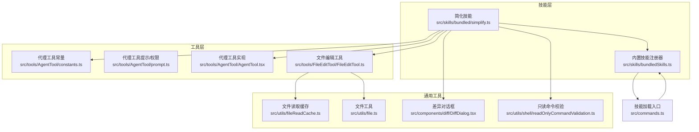
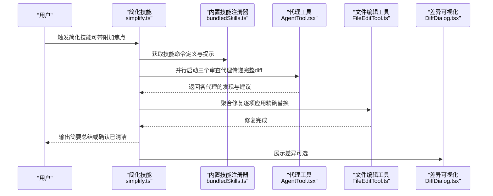
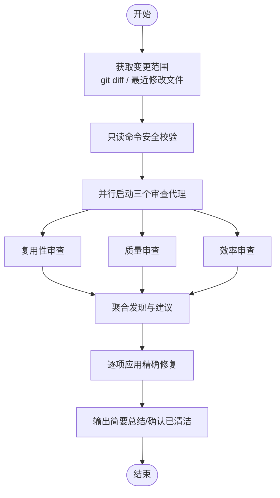
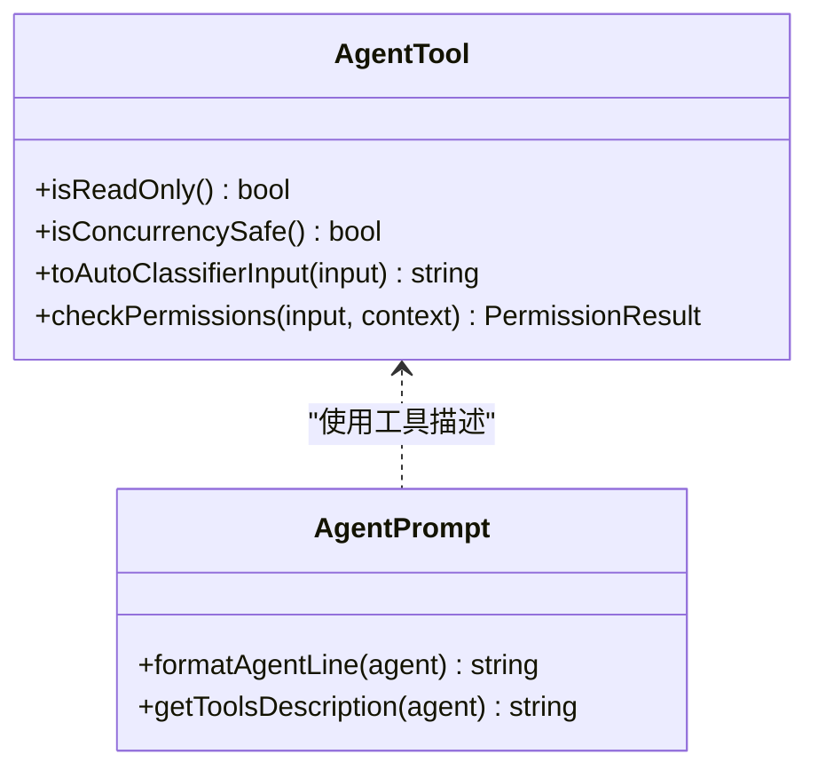
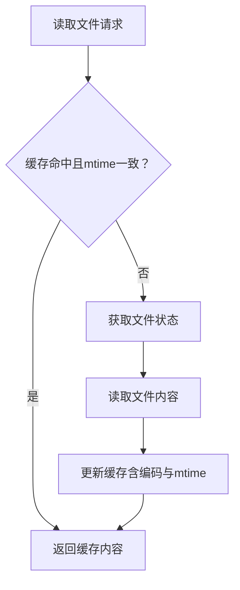
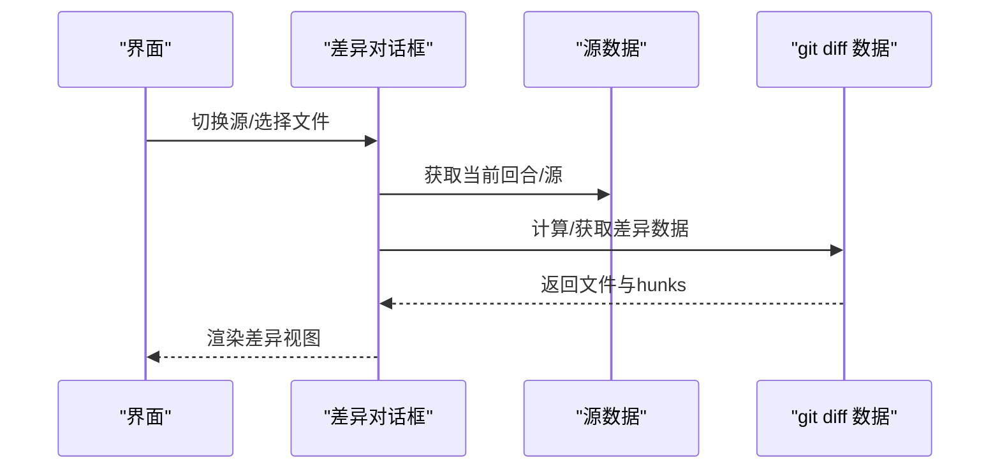
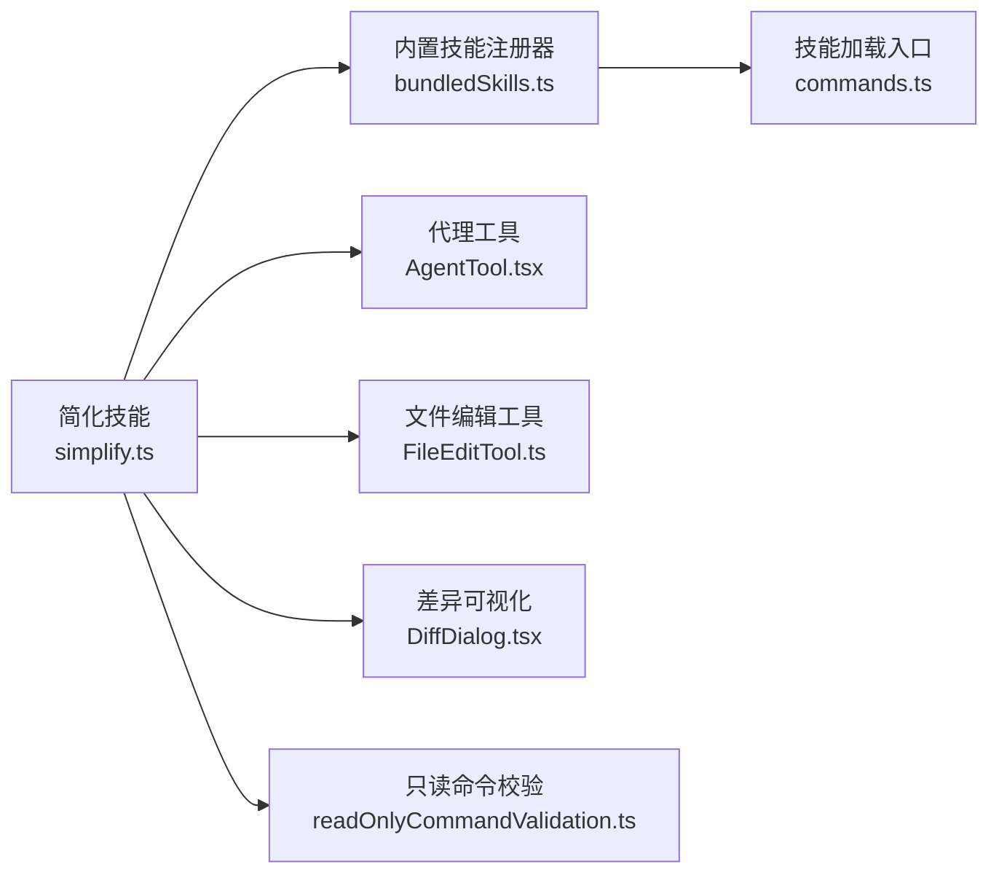

# 简化技能（simplify）

<cite>
**本文引用的文件**
- [src/skills/bundled/simplify.ts](file://src/skills/bundled/simplify.ts)
- [src/skills/bundledSkills.ts](file://src/skills/bundledSkills.ts)
- [src/tools/AgentTool/constants.ts](file://src/tools/AgentTool/constants.ts)
- [src/tools/AgentTool/prompt.ts](file://src/tools/AgentTool/prompt.ts)
- [src/tools/AgentTool/AgentTool.tsx](file://src/tools/AgentTool/AgentTool.tsx)
- [src/tools/FileEditTool/FileEditTool.ts](file://src/tools/FileEditTool/FileEditTool.ts)
- [src/utils/fileReadCache.ts](file://src/utils/fileReadCache.ts)
- [src/utils/file.ts](file://src/utils/file.ts)
- [src/components/diff/DiffDialog.tsx](file://src/components/diff/DiffDialog.tsx)
- [src/utils/shell/readOnlyCommandValidation.ts](file://src/utils/shell/readOnlyCommandValidation.ts)
- [src/commands.ts](file://src/commands.ts)
- [src/constants/prompts.ts](file://src/constants/prompts.ts)
</cite>

## 目录
1. [简介](#简介)
2. [项目结构](#项目结构)
3. [核心组件](#核心组件)
4. [架构总览](#架构总览)
5. [详细组件分析](#详细组件分析)
6. [依赖关系分析](#依赖关系分析)
7. [性能考量](#性能考量)
8. [故障排查指南](#故障排查指南)
9. [结论](#结论)
10. [附录](#附录)

## 简介
简化技能（simplify）是 Claude Code 中用于“代码审查与清理”的内置技能。其目标是在变更代码中识别并修复可复用性不足、质量隐患与效率问题，通过并行启动三个专用审查代理，分别聚焦“复用性”“质量”“效率”，在聚合结果后直接进行修复，最终输出简要总结或确认代码已清洁。

该技能以“用户可调用”的形式注册，支持附加焦点参数，便于针对特定模块或问题域进行定向简化。

## 项目结构
简化技能位于“技能”目录下，采用“内置技能”注册机制；其运行依赖“代理工具”“文件编辑工具”“差异可视化组件”以及“只读命令安全校验”等基础设施。

**图表来源**
- [src/skills/bundled/simplify.ts:1-70](file://src/skills/bundled/simplify.ts#L1-L70)
- [src/skills/bundledSkills.ts:75-122](file://src/skills/bundledSkills.ts#L75-L122)
- [src/tools/AgentTool/constants.ts:1-13](file://src/tools/AgentTool/constants.ts#L1-L13)
- [src/tools/AgentTool/prompt.ts:20-46](file://src/tools/AgentTool/prompt.ts#L20-L46)
- [src/tools/AgentTool/AgentTool.tsx:1262-1282](file://src/tools/AgentTool/AgentTool.tsx#L1262-L1282)
- [src/tools/FileEditTool/FileEditTool.ts:128-141](file://src/tools/FileEditTool/FileEditTool.ts#L128-L141)
- [src/utils/fileReadCache.ts:1-44](file://src/utils/fileReadCache.ts#L1-L44)
- [src/utils/file.ts:345-352](file://src/utils/file.ts#L345-L352)
- [src/components/diff/DiffDialog.tsx:84-135](file://src/components/diff/DiffDialog.tsx#L84-L135)
- [src/utils/shell/readOnlyCommandValidation.ts:107-149](file://src/utils/shell/readOnlyCommandValidation.ts#L107-L149)
- [src/commands.ts:353-398](file://src/commands.ts#L353-L398)

**章节来源**
- [src/skills/bundled/simplify.ts:1-70](file://src/skills/bundled/simplify.ts#L1-L70)
- [src/skills/bundledSkills.ts:75-122](file://src/skills/bundledSkills.ts#L75-L122)
- [src/commands.ts:353-398](file://src/commands.ts#L353-L398)

## 核心组件
- 简化技能定义与提示模板：负责构建“简化”任务的完整提示，包含三阶段流程与三个审查代理的职责清单。
- 内置技能注册器：将简化技能注册为用户可调用的命令，提供动态提示生成能力。
- 代理工具：作为并行执行载体，承载三个审查代理的上下文与工具权限。
- 文件编辑工具：在修复阶段对文件进行精确替换，配合缓存减少重复 I/O。
- 差异可视化：在 IDE/界面侧展示变更范围，辅助理解简化前后的差异。
- 只读命令安全校验：确保 git diff 等只读命令的安全执行，避免误用风险。

**章节来源**
- [src/skills/bundled/simplify.ts:4-53](file://src/skills/bundled/simplify.ts#L4-L53)
- [src/skills/bundledSkills.ts:75-122](file://src/skills/bundledSkills.ts#L75-L122)
- [src/tools/AgentTool/constants.ts:1-13](file://src/tools/AgentTool/constants.ts#L1-L13)
- [src/tools/FileEditTool/FileEditTool.ts:128-141](file://src/tools/FileEditTool/FileEditTool.ts#L128-L141)
- [src/utils/fileReadCache.ts:1-44](file://src/utils/fileReadCache.ts#L1-L44)
- [src/components/diff/DiffDialog.tsx:84-135](file://src/components/diff/DiffDialog.tsx#L84-L135)
- [src/utils/shell/readOnlyCommandValidation.ts:107-149](file://src/utils/shell/readOnlyCommandValidation.ts#L107-L149)

## 架构总览
简化技能的执行流由“提示构造—并行代理—聚合修复—输出总结”构成。提示中明确要求先获取变更（git diff 或最近修改文件），随后并发启动三个代理，最后统一修复并总结。

**图表来源**
- [src/skills/bundled/simplify.ts:4-53](file://src/skills/bundled/simplify.ts#L4-L53)
- [src/skills/bundledSkills.ts:75-122](file://src/skills/bundledSkills.ts#L75-L122)
- [src/tools/AgentTool/AgentTool.tsx:1262-1282](file://src/tools/AgentTool/AgentTool.tsx#L1262-L1282)
- [src/tools/FileEditTool/FileEditTool.ts:128-141](file://src/tools/FileEditTool/FileEditTool.ts#L128-L141)
- [src/components/diff/DiffDialog.tsx:84-135](file://src/components/diff/DiffDialog.tsx#L84-L135)

## 详细组件分析

### 简化技能提示与三阶段流程
- 阶段一：识别变更
  - 通过 git diff（或 git diff HEAD）获取变更内容；若无变更则回退到最近修改文件。
  - 安全命令白名单：仅允许安全的 diff 参数，避免潜在风险。
- 阶段二：并行启动三个审查代理
  - 代理工具名称常量：统一代理工具标识，便于权限与追踪。
  - 代理提示与工具描述：格式化代理可用工具列表，确保权限透明。
- 阶段三：修复与总结
  - 聚合三个代理的发现，逐项修复；对不适用或误报项跳过。
  - 输出简洁总结，或确认代码已清洁。

**图表来源**
- [src/skills/bundled/simplify.ts:4-53](file://src/skills/bundled/simplify.ts#L4-L53)
- [src/utils/shell/readOnlyCommandValidation.ts:107-149](file://src/utils/shell/readOnlyCommandValidation.ts#L107-L149)
- [src/tools/AgentTool/constants.ts:1-13](file://src/tools/AgentTool/constants.ts#L1-L13)
- [src/tools/AgentTool/prompt.ts:20-46](file://src/tools/AgentTool/prompt.ts#L20-L46)

**章节来源**
- [src/skills/bundled/simplify.ts:4-53](file://src/skills/bundled/simplify.ts#L4-L53)
- [src/utils/shell/readOnlyCommandValidation.ts:107-149](file://src/utils/shell/readOnlyCommandValidation.ts#L107-L149)
- [src/tools/AgentTool/constants.ts:1-13](file://src/tools/AgentTool/constants.ts#L1-L13)
- [src/tools/AgentTool/prompt.ts:20-46](file://src/tools/AgentTool/prompt.ts#L20-L46)

### 代理工具与权限控制
- 代理工具实现具备只读权限委托、并发安全、自动分类输入等特性，适配简化技能的并行执行需求。
- 提示与工具描述：根据代理定义动态生成工具可用性说明，确保用户与系统对工具使用边界清晰。

**图表来源**
- [src/tools/AgentTool/AgentTool.tsx:1262-1282](file://src/tools/AgentTool/AgentTool.tsx#L1262-L1282)
- [src/tools/AgentTool/prompt.ts:20-46](file://src/tools/AgentTool/prompt.ts#L20-L46)

**章节来源**
- [src/tools/AgentTool/AgentTool.tsx:1262-1282](file://src/tools/AgentTool/AgentTool.tsx#L1262-L1282)
- [src/tools/AgentTool/prompt.ts:20-46](file://src/tools/AgentTool/prompt.ts#L20-L46)

### 文件编辑与缓存优化
- 文件编辑工具在修复阶段执行精确字符串替换，支持路径归一化与批量验证。
- 文件读取缓存基于 mtime 自动失效，避免重复 I/O，提升大规模修复场景的性能。

**图表来源**
- [src/utils/fileReadCache.ts:1-44](file://src/utils/fileReadCache.ts#L1-L44)
- [src/utils/file.ts:345-352](file://src/utils/file.ts#L345-L352)
- [src/tools/FileEditTool/FileEditTool.ts:128-141](file://src/tools/FileEditTool/FileEditTool.ts#L128-L141)

**章节来源**
- [src/utils/fileReadCache.ts:1-44](file://src/utils/fileReadCache.ts#L1-L44)
- [src/utils/file.ts:345-352](file://src/utils/file.ts#L345-L352)
- [src/tools/FileEditTool/FileEditTool.ts:128-141](file://src/tools/FileEditTool/FileEditTool.ts#L128-L141)

### 差异可视化与用户交互
- 差异对话框根据当前源与 git diff 数据生成可视化的 hunks 列表，支持文件与块级选择，便于用户核对简化前后的差异。

**图表来源**
- [src/components/diff/DiffDialog.tsx:84-135](file://src/components/diff/DiffDialog.tsx#L84-L135)

**章节来源**
- [src/components/diff/DiffDialog.tsx:84-135](file://src/components/diff/DiffDialog.tsx#L84-L135)

## 依赖关系分析
- 简化技能依赖内置技能注册器以暴露为用户可调用命令。
- 运行时依赖代理工具进行并行执行，依赖文件编辑工具进行修复，依赖差异可视化组件进行结果呈现。
- 安全方面依赖只读命令校验，限制危险参数，降低误操作风险。

**图表来源**
- [src/skills/bundled/simplify.ts:1-70](file://src/skills/bundled/simplify.ts#L1-L70)
- [src/skills/bundledSkills.ts:75-122](file://src/skills/bundledSkills.ts#L75-L122)
- [src/tools/AgentTool/AgentTool.tsx:1262-1282](file://src/tools/AgentTool/AgentTool.tsx#L1262-L1282)
- [src/tools/FileEditTool/FileEditTool.ts:128-141](file://src/tools/FileEditTool/FileEditTool.ts#L128-L141)
- [src/components/diff/DiffDialog.tsx:84-135](file://src/components/diff/DiffDialog.tsx#L84-L135)
- [src/utils/shell/readOnlyCommandValidation.ts:107-149](file://src/utils/shell/readOnlyCommandValidation.ts#L107-L149)
- [src/commands.ts:353-398](file://src/commands.ts#L353-L398)

**章节来源**
- [src/skills/bundled/simplify.ts:1-70](file://src/skills/bundled/simplify.ts#L1-L70)
- [src/skills/bundledSkills.ts:75-122](file://src/skills/bundledSkills.ts#L75-L122)
- [src/commands.ts:353-398](file://src/commands.ts#L353-L398)

## 性能考量
- 并行代理执行：通过一次消息并发启动三个代理，缩短整体审查时间。
- 文件读取缓存：基于 mtime 的缓存避免重复读取，显著降低 I/O 压力。
- 精确替换与批量验证：文件编辑工具在修复前进行路径与内容一致性校验，减少无效写入。
- 只读命令白名单：限制 git diff 参数，避免高开销或高风险选项带来的额外成本。

**章节来源**
- [src/skills/bundled/simplify.ts:12-14](file://src/skills/bundled/simplify.ts#L12-L14)
- [src/utils/fileReadCache.ts:1-44](file://src/utils/fileReadCache.ts#L1-L44)
- [src/tools/FileEditTool/FileEditTool.ts:128-141](file://src/tools/FileEditTool/FileEditTool.ts#L128-L141)
- [src/utils/shell/readOnlyCommandValidation.ts:107-149](file://src/utils/shell/readOnlyCommandValidation.ts#L107-L149)

## 故障排查指南
- 未检测到变更
  - 检查是否处于有变更的工作区，或确认最近修改文件列表是否为空。
  - 确认只读命令校验是否正确放行了必要的 diff 参数。
- 代理无法启动或权限不足
  - 核对代理工具的可用工具列表与权限检查逻辑，确保所需工具在允许范围内。
- 修复失败或未生效
  - 检查文件路径归一化与读取缓存是否导致旧内容被使用。
  - 确认文件编辑工具的输入参数（old_string/new_string/replace_all）是否匹配当前文件状态。
- 结果不直观
  - 使用差异可视化组件核对 hunks，确认简化前后对比。

**章节来源**
- [src/utils/shell/readOnlyCommandValidation.ts:107-149](file://src/utils/shell/readOnlyCommandValidation.ts#L107-L149)
- [src/tools/AgentTool/prompt.ts:20-46](file://src/tools/AgentTool/prompt.ts#L20-L46)
- [src/tools/FileEditTool/FileEditTool.ts:128-141](file://src/tools/FileEditTool/FileEditTool.ts#L128-L141)
- [src/utils/fileReadCache.ts:1-44](file://src/utils/fileReadCache.ts#L1-L44)
- [src/components/diff/DiffDialog.tsx:84-135](file://src/components/diff/DiffDialog.tsx#L84-L135)

## 结论
简化技能通过“提示驱动 + 并行代理 + 精准修复”的闭环，系统性地提升代码的可复用性、质量与效率。其设计强调安全性（只读命令白名单）、可观测性（差异可视化）与性能（缓存与并发），适合在日常开发与代码审查流程中高频使用。建议在团队内将其纳入标准审查步骤，以持续提升代码健康度与可维护性。

## 附录

### 使用示例与最佳实践
- 快速简化当前变更
  - 在有 git 变更的工作区触发简化技能，系统将自动获取 diff 并并行启动三个代理进行审查与修复。
- 针对性简化
  - 附加焦点参数，限定审查范围（如特定模块或函数），提升修复的针对性与可控性。
- 与代码审查流程结合
  - 将简化技能作为 PR 审查前置步骤之一：先简化，再进行人工审查，减少后续返工。
- 回滚机制
  - 若修复结果不符合预期，可利用版本控制系统的 diff/回滚能力快速恢复；同时保留简化前的差异视图以便比对。

**章节来源**
- [src/skills/bundled/simplify.ts:61-67](file://src/skills/bundled/simplify.ts#L61-L67)
- [src/components/diff/DiffDialog.tsx:84-135](file://src/components/diff/DiffDialog.tsx#L84-L135)

### 效果评估与质量保证
- 量化指标建议
  - 复用性改进数：新增函数/变量被替代次数。
  - 质量问题修复数：冗余状态、参数膨胀、复制粘贴变体等修复数量。
  - 效率优化数：不必要的计算/并发缺失/热路径阻塞等优化数量。
  - 修复耗时：从触发到完成的平均时长。
  - I/O 次数：文件读取缓存命中率与总读取次数。
- 质量保证措施
  - 只读命令白名单：防止危险参数引发的副作用。
  - 权限与并发安全：代理工具的只读与并发安全属性保障执行稳定。
  - 缓存与校验：文件读取缓存与输入校验降低错误修复概率。
  - 用户反馈：差异可视化与简要总结帮助快速验证修复效果。

**章节来源**
- [src/utils/shell/readOnlyCommandValidation.ts:107-149](file://src/utils/shell/readOnlyCommandValidation.ts#L107-L149)
- [src/tools/AgentTool/AgentTool.tsx:1262-1282](file://src/tools/AgentTool/AgentTool.tsx#L1262-L1282)
- [src/utils/fileReadCache.ts:1-44](file://src/utils/fileReadCache.ts#L1-L44)
- [src/constants/prompts.ts:410-416](file://src/constants/prompts.ts#L410-L416)