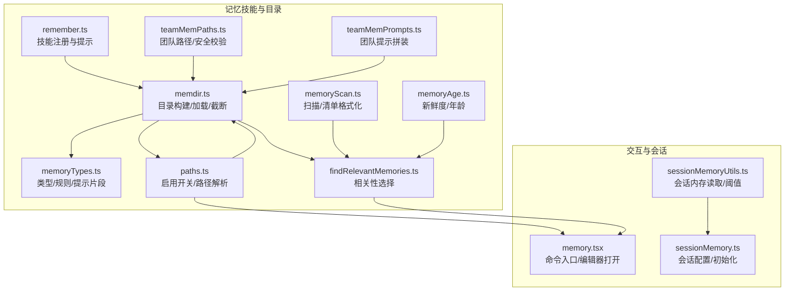
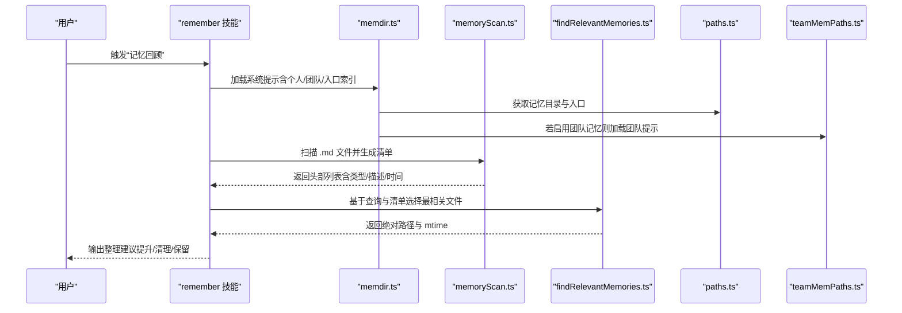
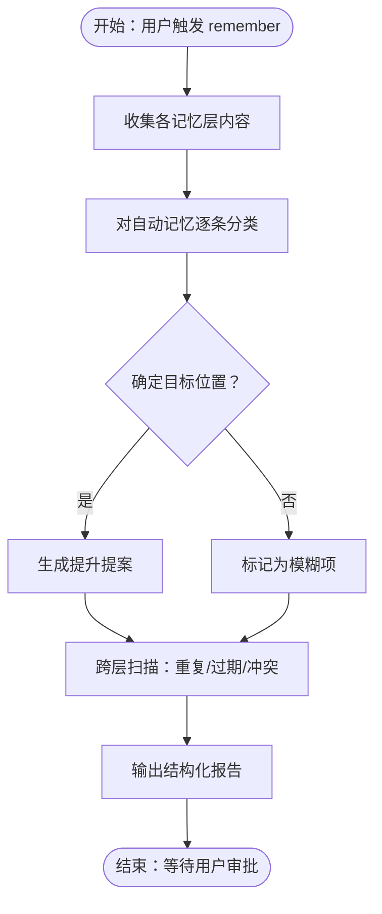
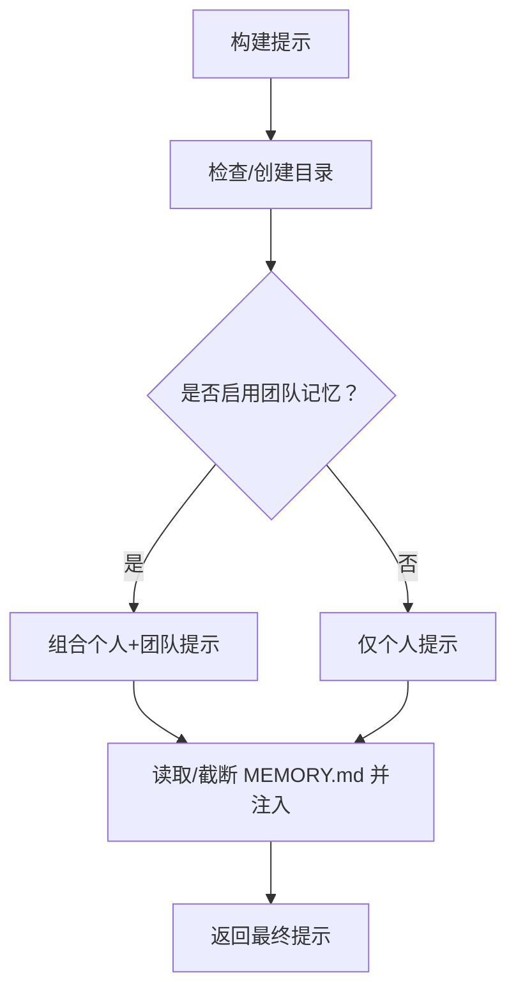
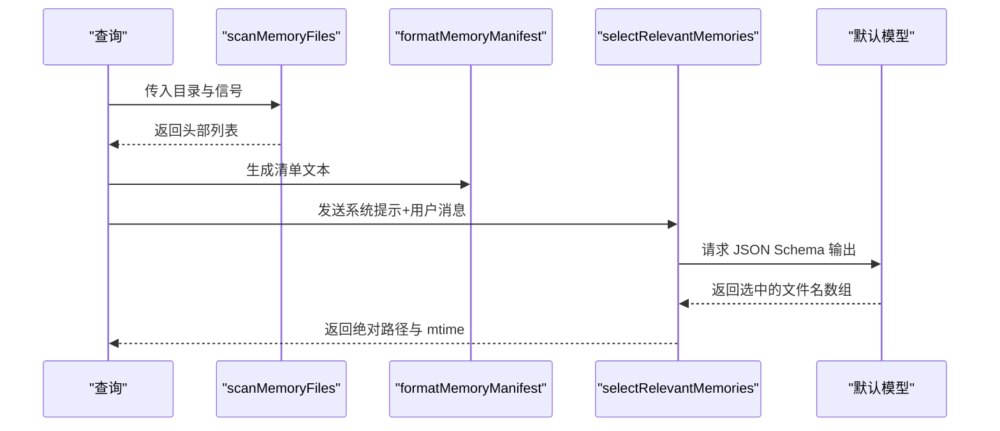
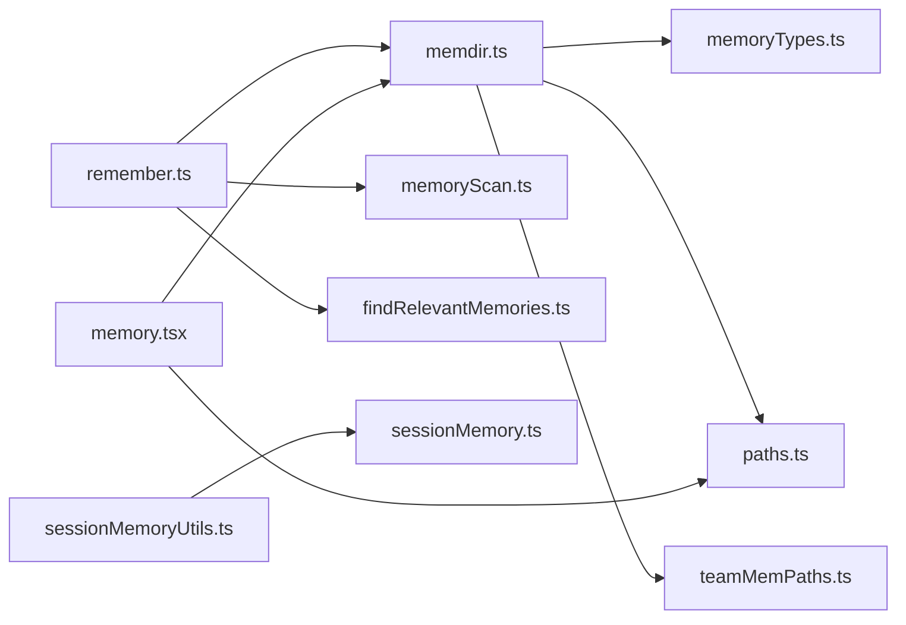

# 记忆技能（remember）

<cite>
**本文引用的文件**
- [src/skills/bundled/remember.ts](file://src/skills/bundled/remember.ts)
- [src/memdir/memdir.ts](file://src/memdir/memdir.ts)
- [src/memdir/memoryTypes.ts](file://src/memdir/memoryTypes.ts)
- [src/memdir/memoryScan.ts](file://src/memdir/memoryScan.ts)
- [src/memdir/memoryAge.ts](file://src/memdir/memoryAge.ts)
- [src/memdir/paths.ts](file://src/memdir/paths.ts)
- [src/memdir/teamMemPaths.ts](file://src/memdir/teamMemPaths.ts)
- [src/memdir/teamMemPrompts.ts](file://src/memdir/teamMemPrompts.ts)
- [src/memdir/findRelevantMemories.ts](file://src/memdir/findRelevantMemories.ts)
- [src/commands/memory/memory.tsx](file://src/commands/memory/memory.tsx)
- [src/services/SessionMemory/sessionMemoryUtils.ts](file://src/services/SessionMemory/sessionMemoryUtils.ts)
- [src/services/SessionMemory/sessionMemory.ts](file://src/services/SessionMemory/sessionMemory.ts)
</cite>

## 目录
1. [简介](#简介)
2. [项目结构](#项目结构)
3. [核心组件](#核心组件)
4. [架构总览](#架构总览)
5. [详细组件分析](#详细组件分析)
6. [依赖关系分析](#依赖关系分析)
7. [性能考量](#性能考量)
8. [故障排查指南](#故障排查指南)
9. [结论](#结论)
10. [附录：使用示例与最佳实践](#附录使用示例与最佳实践)

## 简介
本文件系统性阐述 Claude Code 的“记忆技能（remember）”能力，聚焦于自动记忆（auto memory）与团队记忆（team memory）的存储、检索、组织与清理策略。内容涵盖：
- 数据持久化与目录结构
- 记忆类型与保存规范
- 检索与相关性选择算法
- 安全与路径校验
- 与会话系统的集成点
- 隐私保护与存储优化建议
- 实战使用示例与最佳实践

## 项目结构
与记忆技能直接相关的代码主要分布在以下模块：
- 记忆技能注册与提示：src/skills/bundled/remember.ts
- 记忆目录构建与加载：src/memdir/memdir.ts
- 记忆类型与规则：src/memdir/memoryTypes.ts
- 记忆扫描与清单格式化：src/memdir/memoryScan.ts
- 记忆新鲜度与年龄计算：src/memdir/memoryAge.ts
- 路径解析与启用开关：src/memdir/paths.ts
- 团队记忆路径与安全校验：src/memdir/teamMemPaths.ts
- 团队记忆提示拼装：src/memdir/teamMemPrompts.ts
- 相关性检索与选择：src/memdir/findRelevantMemories.ts
- 记忆命令入口（CLI/编辑器）：src/commands/memory/memory.tsx
- 会话记忆工具（上下文维护）：src/services/SessionMemory/sessionMemoryUtils.ts、src/services/SessionMemory/sessionMemory.ts

**图表来源**
- [src/skills/bundled/remember.ts:1-83](file://src/skills/bundled/remember.ts#L1-L83)
- [src/memdir/memdir.ts:1-508](file://src/memdir/memdir.ts#L1-L508)
- [src/memdir/memoryTypes.ts:1-272](file://src/memdir/memoryTypes.ts#L1-L272)
- [src/memdir/memoryScan.ts:1-95](file://src/memdir/memoryScan.ts#L1-L95)
- [src/memdir/memoryAge.ts:1-54](file://src/memdir/memoryAge.ts#L1-L54)
- [src/memdir/paths.ts:1-279](file://src/memdir/paths.ts#L1-L279)
- [src/memdir/teamMemPaths.ts:1-293](file://src/memdir/teamMemPaths.ts#L1-L293)
- [src/memdir/teamMemPrompts.ts:1-101](file://src/memdir/teamMemPrompts.ts#L1-L101)
- [src/memdir/findRelevantMemories.ts:1-142](file://src/memdir/findRelevantMemories.ts#L1-L142)
- [src/commands/memory/memory.tsx:1-90](file://src/commands/memory/memory.tsx#L1-L90)
- [src/services/SessionMemory/sessionMemoryUtils.ts:1-177](file://src/services/SessionMemory/sessionMemoryUtils.ts#L1-L177)
- [src/services/SessionMemory/sessionMemory.ts:228-264](file://src/services/SessionMemory/sessionMemory.ts#L228-L264)

**章节来源**
- [src/skills/bundled/remember.ts:1-83](file://src/skills/bundled/remember.ts#L1-L83)
- [src/memdir/memdir.ts:1-508](file://src/memdir/memdir.ts#L1-L508)
- [src/memdir/memoryTypes.ts:1-272](file://src/memdir/memoryTypes.ts#L1-L272)
- [src/memdir/memoryScan.ts:1-95](file://src/memdir/memoryScan.ts#L1-L95)
- [src/memdir/memoryAge.ts:1-54](file://src/memdir/memoryAge.ts#L1-L54)
- [src/memdir/paths.ts:1-279](file://src/memdir/paths.ts#L1-L279)
- [src/memdir/teamMemPaths.ts:1-293](file://src/memdir/teamMemPaths.ts#L1-L293)
- [src/memdir/teamMemPrompts.ts:1-101](file://src/memdir/teamMemPrompts.ts#L1-L101)
- [src/memdir/findRelevantMemories.ts:1-142](file://src/memdir/findRelevantMemories.ts#L1-L142)
- [src/commands/memory/memory.tsx:1-90](file://src/commands/memory/memory.tsx#L1-L90)
- [src/services/SessionMemory/sessionMemoryUtils.ts:1-177](file://src/services/SessionMemory/sessionMemoryUtils.ts#L1-L177)
- [src/services/SessionMemory/sessionMemory.ts:228-264](file://src/services/SessionMemory/sessionMemory.ts#L228-L264)

## 核心组件
- 记忆技能（remember）
  - 注册与提示：在满足条件时向用户暴露“记忆回顾与整理”能力，指导将自动记忆中的条目提升到 CLAUDE.md、CLAUDE.local.md 或团队共享记忆，并识别重复、过期与冲突。
  - 参考：[src/skills/bundled/remember.ts:1-83](file://src/skills/bundled/remember.ts#L1-L83)

- 记忆目录与提示构建
  - 构建行为准则、类型定义、保存流程、检索指引与截断策略；支持个人与团队双目录模式，以及助理长会话日志模式。
  - 参考：[src/memdir/memdir.ts:1-508](file://src/memdir/memdir.ts#L1-L508)

- 记忆类型与规则
  - 四类记忆类型（user/feedback/project/reference），明确适用范围、何时保存、如何使用与结构化写法。
  - 参考：[src/memdir/memoryTypes.ts:1-272](file://src/memdir/memoryTypes.ts#L1-L272)

- 记忆扫描与清单
  - 扫描目录下 .md 文件，提取 frontmatter 头部信息，按修改时间排序并限制数量，生成清单文本。
  - 参考：[src/memdir/memoryScan.ts:1-95](file://src/memdir/memoryScan.ts#L1-L95)

- 新鲜度与年龄
  - 将 mtime 转换为天数与可读字符串，输出系统提醒以警示过期风险。
  - 参考：[src/memdir/memoryAge.ts:1-54](file://src/memdir/memoryAge.ts#L1-L54)

- 路径解析与启用开关
  - 解析记忆根目录、入口文件（MEMORY.md）、日志文件路径；判断是否启用自动记忆；路径安全校验。
  - 参考：[src/memdir/paths.ts:1-279](file://src/memdir/paths.ts#L1-L279)

- 团队记忆路径与安全
  - 团队目录位于个人目录之下，提供严格的安全校验（路径规范化、符号链接解析、前缀匹配）。
  - 参考：[src/memdir/teamMemPaths.ts:1-293](file://src/memdir/teamMemPaths.ts#L1-L293)

- 团队记忆提示
  - 组合个人与团队目录的行为准则与保存流程，注入搜索指引。
  - 参考：[src/memdir/teamMemPrompts.ts:1-101](file://src/memdir/teamMemPrompts.ts#L1-L101)

- 相关性检索
  - 基于扫描结果与最近使用工具列表，调用模型选择最相关的记忆文件。
  - 参考：[src/memdir/findRelevantMemories.ts:1-142](file://src/memdir/findRelevantMemories.ts#L1-L142)

- 记忆命令入口
  - CLI 对话框选择记忆文件并打开编辑器，确保目录存在与文件唯一创建。
  - 参考：[src/commands/memory/memory.tsx:1-90](file://src/commands/memory/memory.tsx#L1-L90)

- 会话记忆工具
  - 提供会话级记忆读取、阈值判断、等待提取完成等工具函数，用于上下文维护与节流。
  - 参考：[src/services/SessionMemory/sessionMemoryUtils.ts:1-177](file://src/services/SessionMemory/sessionMemoryUtils.ts#L1-L177)、[src/services/SessionMemory/sessionMemory.ts:228-264](file://src/services/SessionMemory/sessionMemory.ts#L228-L264)

**章节来源**
- [src/skills/bundled/remember.ts:1-83](file://src/skills/bundled/remember.ts#L1-L83)
- [src/memdir/memdir.ts:1-508](file://src/memdir/memdir.ts#L1-L508)
- [src/memdir/memoryTypes.ts:1-272](file://src/memdir/memoryTypes.ts#L1-L272)
- [src/memdir/memoryScan.ts:1-95](file://src/memdir/memoryScan.ts#L1-L95)
- [src/memdir/memoryAge.ts:1-54](file://src/memdir/memoryAge.ts#L1-L54)
- [src/memdir/paths.ts:1-279](file://src/memdir/paths.ts#L1-L279)
- [src/memdir/teamMemPaths.ts:1-293](file://src/memdir/teamMemPaths.ts#L1-L293)
- [src/memdir/teamMemPrompts.ts:1-101](file://src/memdir/teamMemPrompts.ts#L1-L101)
- [src/memdir/findRelevantMemories.ts:1-142](file://src/memdir/findRelevantMemories.ts#L1-L142)
- [src/commands/memory/memory.tsx:1-90](file://src/commands/memory/memory.tsx#L1-L90)
- [src/services/SessionMemory/sessionMemoryUtils.ts:1-177](file://src/services/SessionMemory/sessionMemoryUtils.ts#L1-L177)
- [src/services/SessionMemory/sessionMemory.ts:228-264](file://src/services/SessionMemory/sessionMemory.ts#L228-L264)

## 架构总览
记忆技能围绕“文件型持久化 + 系统提示注入 + 检索与选择 + 安全校验”的闭环展开。其关键交互如下：

**图表来源**
- [src/skills/bundled/remember.ts:1-83](file://src/skills/bundled/remember.ts#L1-L83)
- [src/memdir/memdir.ts:1-508](file://src/memdir/memdir.ts#L1-L508)
- [src/memdir/memoryScan.ts:1-95](file://src/memdir/memoryScan.ts#L1-L95)
- [src/memdir/findRelevantMemories.ts:1-142](file://src/memdir/findRelevantMemories.ts#L1-L142)
- [src/memdir/paths.ts:1-279](file://src/memdir/paths.ts#L1-L279)
- [src/memdir/teamMemPaths.ts:1-293](file://src/memdir/teamMemPaths.ts#L1-L293)

## 详细组件分析

### 记忆技能（remember）
- 功能定位
  - 回顾用户记忆景观，提出分组化的变更提案（提升、清理、模糊项、无需操作），不直接写入，需用户确认。
- 关键步骤
  - 收集所有记忆层（CLAUDE.md、CLAUDE.local.md、自动记忆、团队记忆）
  - 分类每个自动记忆条目至 CLAUDE.md、CLAUDE.local.md、团队记忆或保留在自动记忆
  - 识别跨层重复、过期与冲突
  - 结构化输出报告，便于逐项审批
- 与启用开关的关系
  - 仅在自动记忆启用时可用
- 参考：[src/skills/bundled/remember.ts:1-83](file://src/skills/bundled/remember.ts#L1-L83)

**图表来源**
- [src/skills/bundled/remember.ts:1-83](file://src/skills/bundled/remember.ts#L1-L83)

**章节来源**
- [src/skills/bundled/remember.ts:1-83](file://src/skills/bundled/remember.ts#L1-L83)

### 记忆目录与提示构建（memdir.ts）
- 行为准则与保存流程
  - 明确四类记忆类型、禁止保存的内容、何时访问与信任回忆的注意事项
  - 支持两步保存流程（写文件 + 更新索引）
- 入口索引截断
  - 对 MEMORY.md 进行行数与字节数上限截断，并追加警告
- 目录存在性保证
  - 在构建提示前确保目录存在，避免后续写入失败
- 搜索过去上下文
  - 在特性开启时提供搜索指引（记忆文件与会话日志）
- 参考：[src/memdir/memdir.ts:1-508](file://src/memdir/memdir.ts#L1-L508)

**图表来源**
- [src/memdir/memdir.ts:1-508](file://src/memdir/memdir.ts#L1-L508)

**章节来源**
- [src/memdir/memdir.ts:1-508](file://src/memdir/memdir.ts#L1-L508)

### 记忆类型与规则（memoryTypes.ts）
- 类型体系
  - user/feedback/project/reference 四类，分别定义适用范围、何时保存、如何使用与结构化写法
- 禁止保存内容
  - 从当前项目状态可推导的信息（代码、架构、历史）不在记忆范围内
- 信任回忆与漂移提醒
  - 强调“回忆可能过期”，建议先验证再行动
- 参考：[src/memdir/memoryTypes.ts:1-272](file://src/memdir/memoryTypes.ts#L1-L272)

**章节来源**
- [src/memdir/memoryTypes.ts:1-272](file://src/memdir/memoryTypes.ts#L1-L272)

### 记忆扫描与清单（memoryScan.ts）
- 扫描策略
  - 递归遍历目录，过滤 .md（排除入口索引），限制最大文件数
  - 仅读取前若干行以解析 frontmatter，同时获取 mtime
- 排序与裁剪
  - 按 mtime 降序排序，最多返回固定数量
- 清单格式化
  - 生成“类型 文件名（时间戳）：描述”的一行文本清单
- 参考：[src/memdir/memoryScan.ts:1-95](file://src/memdir/memoryScan.ts#L1-L95)

**章节来源**
- [src/memdir/memoryScan.ts:1-95](file://src/memdir/memoryScan.ts#L1-L95)

### 新鲜度与年龄（memoryAge.ts）
- 年龄计算
  - 将 mtime 转换为“今天/昨天/N天前”的可读字符串
- 新鲜度提醒
  - 对超过1天的记忆附加系统提醒，提示验证后再行动
- 参考：[src/memdir/memoryAge.ts:1-54](file://src/memdir/memoryAge.ts#L1-L54)

**章节来源**
- [src/memdir/memoryAge.ts:1-54](file://src/memdir/memoryAge.ts#L1-L54)

### 路径解析与启用开关（paths.ts）
- 启用判定
  - 环境变量、简单模式、远程无持久化、设置项等多源优先级决定是否启用
- 路径解析
  - 记忆根目录、个人目录、团队目录、入口文件、日志文件路径
- 安全校验
  - 路径规范化、拒绝危险输入（相对路径、根路径、UNC、空字节等）
- 参考：[src/memdir/paths.ts:1-279](file://src/memdir/paths.ts#L1-L279)

**章节来源**
- [src/memdir/paths.ts:1-279](file://src/memdir/paths.ts#L1-L279)

### 团队记忆路径与安全（teamMemPaths.ts）
- 目录结构
  - 团队目录位于个人目录之下，按项目隔离
- 安全校验
  - 字符串级路径规范化（resolve）+ 符号链接深度解析（realpathDeepestExisting）+ 前缀匹配，防止路径穿越与符号链接逃逸
- 参考：[src/memdir/teamMemPaths.ts:1-293](file://src/memdir/teamMemPaths.ts#L1-L293)

**章节来源**
- [src/memdir/teamMemPaths.ts:1-293](file://src/memdir/teamMemPaths.ts#L1-L293)

### 团队记忆提示（teamMemPrompts.ts）
- 组合提示
  - 在个人与团队目录均存在时，拼装统一的行为准则、保存流程与搜索指引
- 参考：[src/memdir/teamMemPrompts.ts:1-101](file://src/memdir/teamMemPrompts.ts#L1-L101)

**章节来源**
- [src/memdir/teamMemPrompts.ts:1-101](file://src/memdir/teamMemPrompts.ts#L1-L101)

### 相关性检索（findRelevantMemories.ts）
- 流程
  - 扫描头信息 → 生成清单 → 基于查询与近期工具列表调用模型 → 选择最相关文件
- 选择系统提示
  - 明确只选“明显有用”的文件，避免噪声；若对话中已使用某工具，则跳过该工具的参考文档记忆
- 参考：[src/memdir/findRelevantMemories.ts:1-142](file://src/memdir/findRelevantMemories.ts#L1-L142)

**图表来源**
- [src/memdir/findRelevantMemories.ts:1-142](file://src/memdir/findRelevantMemories.ts#L1-L142)
- [src/memdir/memoryScan.ts:1-95](file://src/memdir/memoryScan.ts#L1-L95)

**章节来源**
- [src/memdir/findRelevantMemories.ts:1-142](file://src/memdir/findRelevantMemories.ts#L1-L142)

### 记忆命令入口（memory.tsx）
- 功能
  - 通过对话框选择记忆文件，确保配置目录存在，尝试以独占方式创建文件，随后在编辑器中打开
- 参考：[src/commands/memory/memory.tsx:1-90](file://src/commands/memory/memory.tsx#L1-L90)

**章节来源**
- [src/commands/memory/memory.tsx:1-90](file://src/commands/memory/memory.tsx#L1-L90)

### 会话记忆工具（SessionMemory）
- 工具函数
  - 等待正在进行的提取完成（带超时与陈旧阈值）
  - 读取会话记忆内容（异常安全）
  - 设置/获取会话记忆配置（最小令牌阈值、更新间隔、工具调用间隔）
  - 初始化阈值判断与标记
- 参考：[src/services/SessionMemory/sessionMemoryUtils.ts:1-177](file://src/services/SessionMemory/sessionMemoryUtils.ts#L1-L177)、[src/services/SessionMemory/sessionMemory.ts:228-264](file://src/services/SessionMemory/sessionMemory.ts#L228-L264)

**章节来源**
- [src/services/SessionMemory/sessionMemoryUtils.ts:1-177](file://src/services/SessionMemory/sessionMemoryUtils.ts#L1-L177)
- [src/services/SessionMemory/sessionMemory.ts:228-264](file://src/services/SessionMemory/sessionMemory.ts#L228-L264)

## 依赖关系分析
- 记忆技能依赖
  - 记忆目录构建与类型规则（memdir.ts + memoryTypes.ts）
  - 目录扫描与相关性选择（memoryScan.ts + findRelevantMemories.ts）
  - 路径解析与安全校验（paths.ts + teamMemPaths.ts）
- 与会话系统耦合
  - 会话记忆工具提供阈值与等待机制，避免在高负载时频繁读写
- 与命令入口协作
  - memory.tsx 作为用户触达记忆文件的入口，确保目录与文件存在性

**图表来源**
- [src/skills/bundled/remember.ts:1-83](file://src/skills/bundled/remember.ts#L1-L83)
- [src/memdir/memdir.ts:1-508](file://src/memdir/memdir.ts#L1-L508)
- [src/memdir/memoryTypes.ts:1-272](file://src/memdir/memoryTypes.ts#L1-L272)
- [src/memdir/memoryScan.ts:1-95](file://src/memdir/memoryScan.ts#L1-L95)
- [src/memdir/findRelevantMemories.ts:1-142](file://src/memdir/findRelevantMemories.ts#L1-L142)
- [src/memdir/paths.ts:1-279](file://src/memdir/paths.ts#L1-L279)
- [src/memdir/teamMemPaths.ts:1-293](file://src/memdir/teamMemPaths.ts#L1-L293)
- [src/commands/memory/memory.tsx:1-90](file://src/commands/memory/memory.tsx#L1-L90)
- [src/services/SessionMemory/sessionMemoryUtils.ts:1-177](file://src/services/SessionMemory/sessionMemoryUtils.ts#L1-L177)
- [src/services/SessionMemory/sessionMemory.ts:228-264](file://src/services/SessionMemory/sessionMemory.ts#L228-L264)

**章节来源**
- [src/skills/bundled/remember.ts:1-83](file://src/skills/bundled/remember.ts#L1-L83)
- [src/memdir/memdir.ts:1-508](file://src/memdir/memdir.ts#L1-L508)
- [src/memdir/memoryTypes.ts:1-272](file://src/memdir/memoryTypes.ts#L1-L272)
- [src/memdir/memoryScan.ts:1-95](file://src/memdir/memoryScan.ts#L1-L95)
- [src/memdir/findRelevantMemories.ts:1-142](file://src/memdir/findRelevantMemories.ts#L1-L142)
- [src/memdir/paths.ts:1-279](file://src/memdir/paths.ts#L1-L279)
- [src/memdir/teamMemPaths.ts:1-293](file://src/memdir/teamMemPaths.ts#L1-L293)
- [src/commands/memory/memory.tsx:1-90](file://src/commands/memory/memory.tsx#L1-L90)
- [src/services/SessionMemory/sessionMemoryUtils.ts:1-177](file://src/services/SessionMemory/sessionMemoryUtils.ts#L1-L177)
- [src/services/SessionMemory/sessionMemory.ts:228-264](file://src/services/SessionMemory/sessionMemory.ts#L228-L264)

## 性能考量
- 扫描与排序
  - 单次扫描后读取并排序，避免二次 stat，减少系统调用
  - 最大文件数限制与行数/字节截断，降低 IO 与上下文膨胀
- 相关性选择
  - 使用较小的 JSON Schema 输出与有限槽位，控制模型推理成本
- 会话记忆节流
  - 等待正在进行的提取完成，避免并发读写；超时与陈旧阈值保障稳定性
- 建议
  - 控制 MEMORY.md 条目长度与数量，遵循“每行简洁、摘要为主”的原则
  - 合理组织主题文件而非堆叠在索引中，减少截断与检索负担

[本节为通用指导，无需特定文件来源]

## 故障排查指南
- 记忆目录不可用
  - 检查启用开关与环境变量；确认目录存在性与权限
  - 参考：[src/memdir/paths.ts:1-279](file://src/memdir/paths.ts#L1-L279)
- 团队记忆写入失败
  - 校验路径是否被符号链接逃逸或包含危险字符；使用安全校验函数
  - 参考：[src/memdir/teamMemPaths.ts:1-293](file://src/memdir/teamMemPaths.ts#L1-L293)
- 相关性选择未命中
  - 检查扫描结果是否为空（无 .md 或被过滤）；确认查询关键词与清单描述匹配
  - 参考：[src/memdir/findRelevantMemories.ts:1-142](file://src/memdir/findRelevantMemories.ts#L1-L142)
- 会话记忆读取异常
  - 检查文件权限与路径；利用异常安全读取与等待机制
  - 参考：[src/services/SessionMemory/sessionMemoryUtils.ts:1-177](file://src/services/SessionMemory/sessionMemoryUtils.ts#L1-L177)

**章节来源**
- [src/memdir/paths.ts:1-279](file://src/memdir/paths.ts#L1-L279)
- [src/memdir/teamMemPaths.ts:1-293](file://src/memdir/teamMemPaths.ts#L1-L293)
- [src/memdir/findRelevantMemories.ts:1-142](file://src/memdir/findRelevantMemories.ts#L1-L142)
- [src/services/SessionMemory/sessionMemoryUtils.ts:1-177](file://src/services/SessionMemory/sessionMemoryUtils.ts#L1-L177)

## 结论
remember 技能通过“文件型持久化 + 系统提示注入 + 安全校验 + 智能检索”的组合，实现了对自动与团队记忆的高效管理与治理。其设计强调：
- 明确的类型边界与保存规范
- 可控的检索与相关性选择
- 严格的路径与符号链接安全
- 与会话系统的协同与节流
配合合理的组织与清理策略，可在长期协作中持续提升上下文质量与一致性。

[本节为总结，无需特定文件来源]

## 附录：使用示例与最佳实践
- 如何使用 remember 技能
  - 场景：需要整理自动记忆、提升到 CLAUDE.md/CLAUDE.local.md 或团队共享，或清理重复/过期/冲突
  - 步骤：触发 remember，审阅提案，逐项批准
  - 参考：[src/skills/bundled/remember.ts:1-83](file://src/skills/bundled/remember.ts#L1-L83)
- 如何编辑记忆文件
  - 使用命令入口选择文件，确保目录存在并以独占方式创建，随后在编辑器中打开
  - 参考：[src/commands/memory/memory.tsx:1-90](file://src/commands/memory/memory.tsx#L1-L90)
- 如何组织记忆内容
  - 优先保存“不可从当前项目状态推导”的信息（用户角色、反馈、项目动态、外部资源）
  - 保持索引简洁，主题文件详尽，避免截断
  - 参考：[src/memdir/memoryTypes.ts:1-272](file://src/memdir/memoryTypes.ts#L1-L272)、[src/memdir/memdir.ts:1-508](file://src/memdir/memdir.ts#L1-L508)
- 如何与会话系统集成
  - 利用会话记忆工具设置阈值与等待机制，避免在高负载时频繁读写
  - 参考：[src/services/SessionMemory/sessionMemoryUtils.ts:1-177](file://src/services/SessionMemory/sessionMemoryUtils.ts#L1-L177)、[src/services/SessionMemory/sessionMemory.ts:228-264](file://src/services/SessionMemory/sessionMemory.ts#L228-L264)

**章节来源**
- [src/skills/bundled/remember.ts:1-83](file://src/skills/bundled/remember.ts#L1-L83)
- [src/commands/memory/memory.tsx:1-90](file://src/commands/memory/memory.tsx#L1-L90)
- [src/memdir/memoryTypes.ts:1-272](file://src/memdir/memoryTypes.ts#L1-L272)
- [src/memdir/memdir.ts:1-508](file://src/memdir/memdir.ts#L1-L508)
- [src/services/SessionMemory/sessionMemoryUtils.ts:1-177](file://src/services/SessionMemory/sessionMemoryUtils.ts#L1-L177)
- [src/services/SessionMemory/sessionMemory.ts:228-264](file://src/services/SessionMemory/sessionMemory.ts#L228-L264)