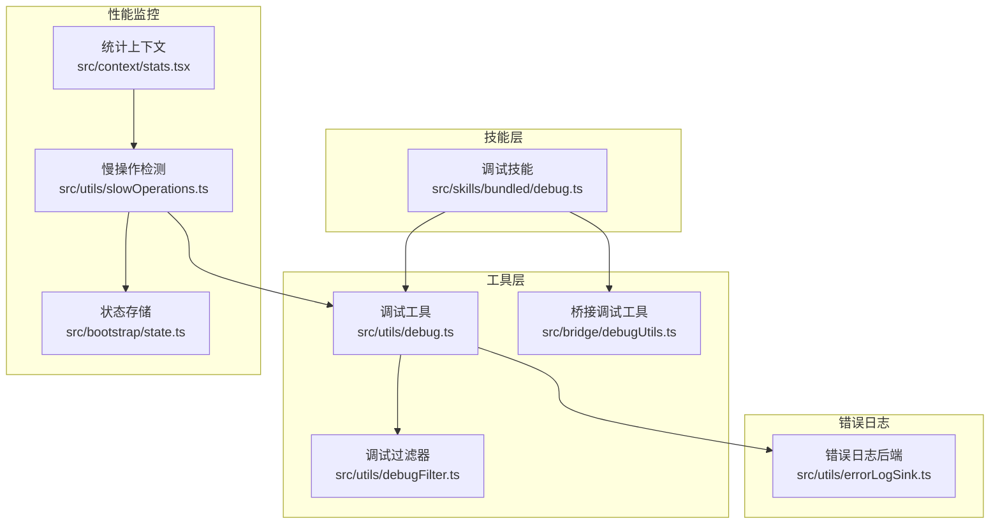
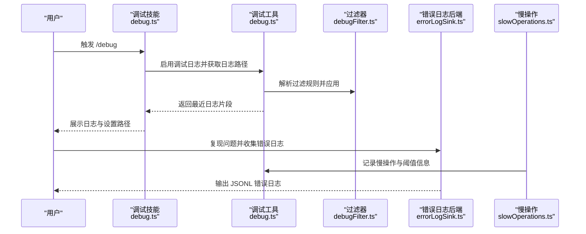
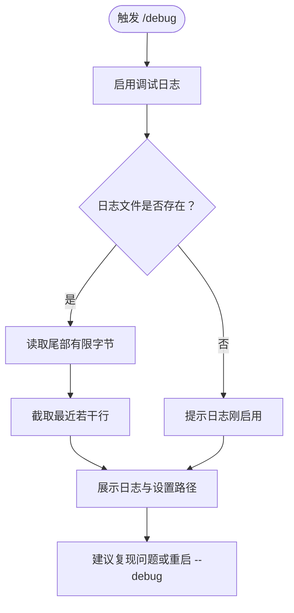
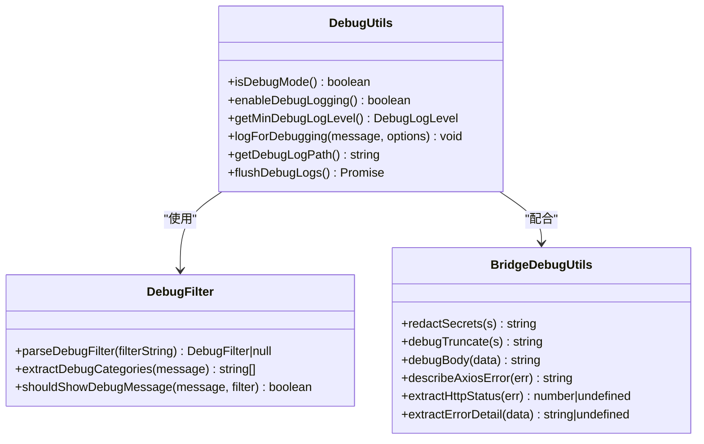
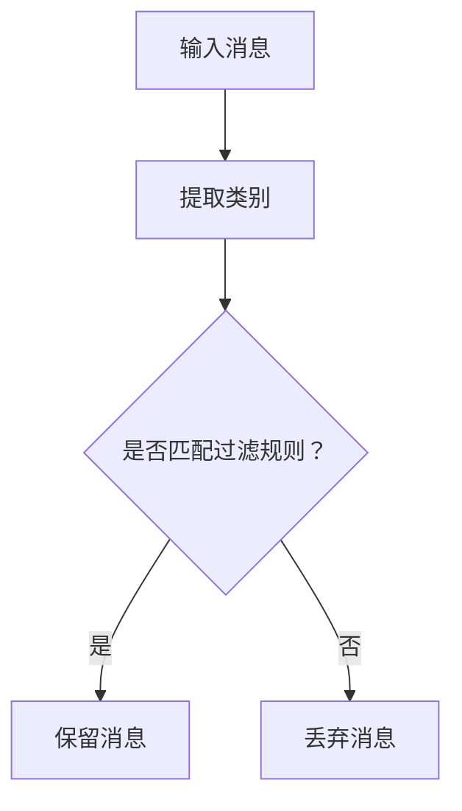
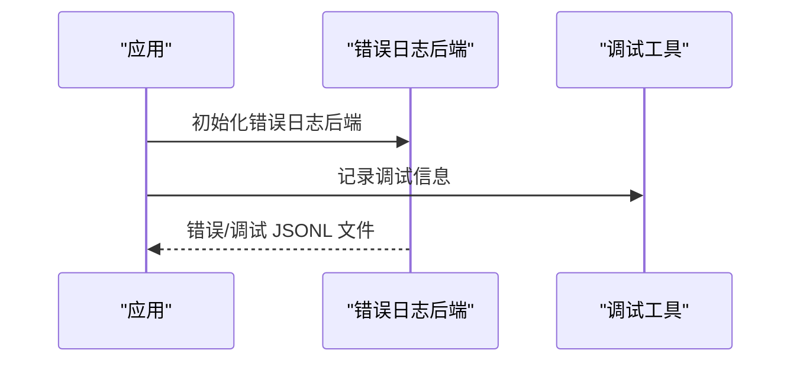
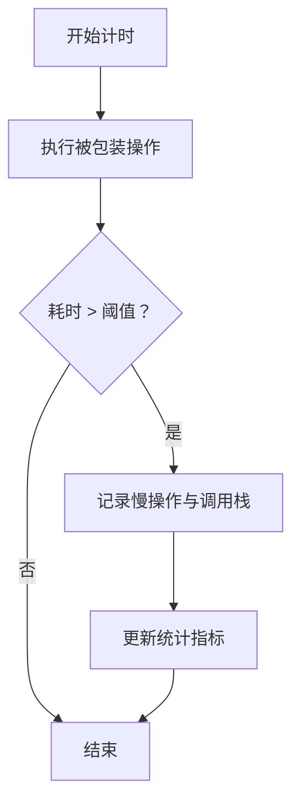
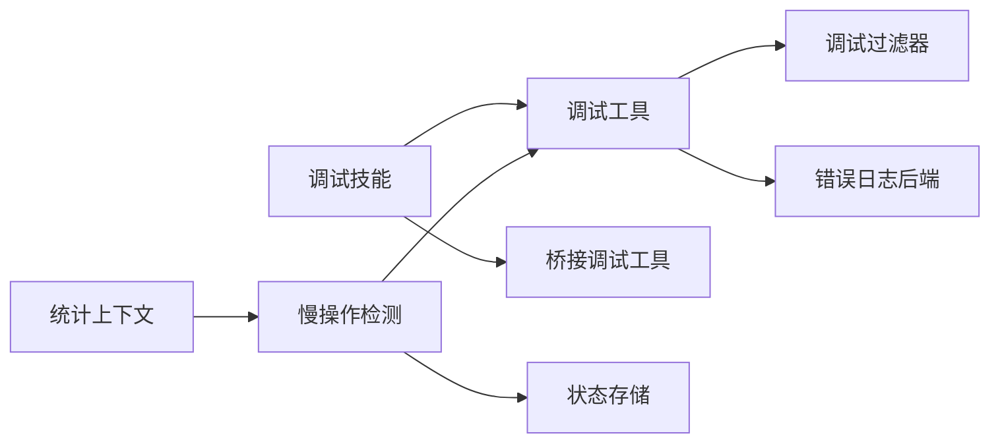

# 调试技能 (debug)

<cite>
**本文引用的文件**
- [src/skills/bundled/debug.ts](file://src/skills/bundled/debug.ts)
- [src/utils/debug.ts](file://src/utils/debug.ts)
- [src/utils/debugFilter.ts](file://src/utils/debugFilter.ts)
- [src/bridge/debugUtils.ts](file://src/bridge/debugUtils.ts)
- [src/utils/errorLogSink.ts](file://src/utils/errorLogSink.ts)
- [src/utils/slowOperations.ts](file://src/utils/slowOperations.ts)
- [src/bootstrap/state.ts](file://src/bootstrap/state.ts)
- [src/context/stats.tsx](file://src/context/stats.tsx)
</cite>

## 目录
1. [简介](#简介)
2. [项目结构](#项目结构)
3. [核心组件](#核心组件)
4. [架构总览](#架构总览)
5. [详细组件分析](#详细组件分析)
6. [依赖关系分析](#依赖关系分析)
7. [性能考量](#性能考量)
8. [故障排查指南](#故障排查指南)
9. [结论](#结论)
10. [附录](#附录)

## 简介
本文件系统性阐述 Claude Code 的调试技能（debug skill）及其配套调试能力，覆盖以下方面：
- 调试技能的触发方式、会话级日志启用与日志读取
- 日志输出格式、级别与过滤机制
- 错误追踪与 MCP 日志记录
- 性能监控与慢操作检测
- 配置项与运行参数
- 实用调试示例、最佳实践与效率提升建议

调试技能旨在帮助用户在当前会话中快速启用并查看调试日志，结合过滤与错误追踪能力，定位问题根因；同时通过慢操作检测与统计指标，辅助识别性能瓶颈。

## 项目结构
围绕调试技能的关键模块分布如下：
- 技能层：调试技能注册与提示模板生成
- 工具层：调试日志写入、过滤、阈值与缓冲策略
- 桥接层：敏感信息脱敏、消息截断与错误描述增强
- 错误日志：统一错误与 MCP 日志落盘
- 性能层：慢操作检测、阈值与统计

图表来源
- [src/skills/bundled/debug.ts:1-104](file://src/skills/bundled/debug.ts#L1-L104)
- [src/utils/debug.ts:1-269](file://src/utils/debug.ts#L1-L269)
- [src/utils/debugFilter.ts:1-158](file://src/utils/debugFilter.ts#L1-L158)
- [src/bridge/debugUtils.ts:1-142](file://src/bridge/debugUtils.ts#L1-L142)
- [src/utils/errorLogSink.ts:1-236](file://src/utils/errorLogSink.ts#L1-L236)
- [src/utils/slowOperations.ts:1-287](file://src/utils/slowOperations.ts#L1-L287)
- [src/bootstrap/state.ts:1589-1633](file://src/bootstrap/state.ts#L1589-L1633)
- [src/context/stats.tsx:38-88](file://src/context/stats.tsx#L38-L88)

章节来源
- [src/skills/bundled/debug.ts:1-104](file://src/skills/bundled/debug.ts#L1-L104)
- [src/utils/debug.ts:1-269](file://src/utils/debug.ts#L1-L269)
- [src/utils/debugFilter.ts:1-158](file://src/utils/debugFilter.ts#L1-L158)
- [src/bridge/debugUtils.ts:1-142](file://src/bridge/debugUtils.ts#L1-L142)
- [src/utils/errorLogSink.ts:1-236](file://src/utils/errorLogSink.ts#L1-L236)
- [src/utils/slowOperations.ts:1-287](file://src/utils/slowOperations.ts#L1-L287)
- [src/bootstrap/state.ts:1589-1633](file://src/bootstrap/state.ts#L1589-L1633)
- [src/context/stats.tsx:38-88](file://src/context/stats.tsx#L38-L88)

## 核心组件
- 调试技能（debug skill）
  - 触发后自动启用会话级调试日志（非 ant 用户）
  - 读取并展示最近若干行日志，便于快速定位问题
  - 提供设置文件路径提示，辅助定位配置问题
- 调试工具（debug utilities）
  - 支持日志级别过滤、最小日志级别、输出到标准错误或文件
  - 自动维护“最新日志”符号链接，便于快速访问
  - 缓冲写入与异步刷新，兼顾性能与可靠性
- 调试过滤器（debug filter）
  - 基于类别（include/exclude）的过滤规则，支持混合模式校验
  - 从消息中提取类别，实现细粒度筛选
- 桥接调试工具（bridge debug utils）
  - 敏感字段脱敏、消息截断、HTTP 错误详情提取
  - 统一桥接跳过事件的记录
- 错误日志后端（error log sink）
  - 将错误与 MCP 日志以 JSONL 格式落盘，带时间戳与会话信息
  - 与调试日志互补，聚焦错误与异常路径
- 慢操作检测（slow operations）
  - 基于阈值的慢操作检测与统计，支持结构化克隆、JSON 序列化等关键路径
  - 提供调用栈帧提取，帮助定位慢点

章节来源
- [src/skills/bundled/debug.ts:12-103](file://src/skills/bundled/debug.ts#L12-L103)
- [src/utils/debug.ts:18-269](file://src/utils/debug.ts#L18-L269)
- [src/utils/debugFilter.ts:3-158](file://src/utils/debugFilter.ts#L3-L158)
- [src/bridge/debugUtils.ts:11-142](file://src/bridge/debugUtils.ts#L11-L142)
- [src/utils/errorLogSink.ts:29-236](file://src/utils/errorLogSink.ts#L29-L236)
- [src/utils/slowOperations.ts:29-287](file://src/utils/slowOperations.ts#L29-L287)

## 架构总览
调试技能的工作流从“启用日志”开始，贯穿“读取日志、过滤与分析”，并与“错误日志后端”“慢操作检测”协同，形成完整的诊断闭环。

图表来源
- [src/skills/bundled/debug.ts:25-101](file://src/skills/bundled/debug.ts#L25-L101)
- [src/utils/debug.ts:64-228](file://src/utils/debug.ts#L64-L228)
- [src/utils/debugFilter.ts:16-157](file://src/utils/debugFilter.ts#L16-L157)
- [src/utils/errorLogSink.ts:225-235](file://src/utils/errorLogSink.ts#L225-L235)
- [src/utils/slowOperations.ts:155-157](file://src/utils/slowOperations.ts#L155-L157)

## 详细组件分析

### 调试技能（debug skill）
- 功能要点
  - 在非 ant 用户场景下，首次触发时启用会话级调试日志
  - 仅读取日志尾部有限字节，避免长会话导致内存压力
  - 展示日志大小、最近若干行，并提示如何复现问题
  - 提供用户/项目/本地设置文件路径，辅助定位配置问题
- 关键行为
  - 若日志尚未存在，提示“日志刚被启用”
  - 若已存在，展示最近若干行并建议使用 grep 过滤 ERROR/WARN
- 使用建议
  - 先启用日志，再复现问题，最后读取日志
  - 对于启动阶段问题，可考虑以 --debug 启动以捕获完整启动链路

图表来源
- [src/skills/bundled/debug.ts:25-101](file://src/skills/bundled/debug.ts#L25-L101)

章节来源
- [src/skills/bundled/debug.ts:12-103](file://src/skills/bundled/debug.ts#L12-L103)

### 调试工具（debug utilities）
- 日志级别与最小级别
  - 支持 verbose/debug/info/warn/error 级别
  - 可通过环境变量设置最小级别，用于抑制高噪声日志
- 运行模式判定
  - 支持通过命令行参数、环境变量、标准错误输出、指定日志文件等方式启用
  - 支持 --debug=pattern 形式的过滤模式解析
- 输出目标
  - 默认写入文件（带缓冲与异步刷新）
  - 可输出到标准错误（便于终端直视）
- 文件管理
  - 自动维护“最新日志”符号链接，便于快速定位
  - 写入失败时自动创建目录并重试
- 格式化与兼容
  - 多行消息在格式化输出场景下转为 JSON 字符串，保证 JSONL 可用性

图表来源
- [src/utils/debug.ts:18-269](file://src/utils/debug.ts#L18-L269)
- [src/utils/debugFilter.ts:3-158](file://src/utils/debugFilter.ts#L3-L158)
- [src/bridge/debugUtils.ts:26-142](file://src/bridge/debugUtils.ts#L26-L142)

章节来源
- [src/utils/debug.ts:18-269](file://src/utils/debug.ts#L18-L269)
- [src/utils/debugFilter.ts:16-158](file://src/utils/debugFilter.ts#L16-L158)
- [src/bridge/debugUtils.ts:11-142](file://src/bridge/debugUtils.ts#L11-L142)

### 调试过滤器（debug filter）
- 过滤规则
  - 支持 include/exclude 两种模式，禁止混用
  - 支持空字符串表示无过滤
- 类别提取
  - 从多种消息格式中提取类别（前缀、方括号、MCP 服务器名、特定关键词等）
  - 支持二次类别推断，提高匹配准确性
- 显示策略
  - 未分类消息在排除模式下默认不显示，在包含模式下默认不显示
  - 优先进行类别提取，再进行匹配判断

图表来源
- [src/utils/debugFilter.ts:65-157](file://src/utils/debugFilter.ts#L65-L157)

章节来源
- [src/utils/debugFilter.ts:3-158](file://src/utils/debugFilter.ts#L3-L158)

### 桥接调试工具（bridge debug utils）
- 敏感信息脱敏
  - 对常见密钥字段进行脱敏处理，长度较短的值采用前后截断
- 消息截断
  - 对超长消息进行截断并标注长度，避免日志膨胀
- 错误描述增强
  - 针对 HTTP 错误，附加响应体中的详细信息
  - 提取状态码与错误详情，便于快速定位
- 事件记录
  - 统一记录桥接跳过事件，便于后续分析

章节来源
- [src/bridge/debugUtils.ts:11-142](file://src/bridge/debugUtils.ts#L11-L142)

### 错误日志后端（error log sink）
- 错误与 MCP 日志
  - 将错误与 MCP 调试信息以 JSONL 格式写入独立文件
  - 自动添加时间戳、会话 ID、工作目录等元数据
- 初始化顺序
  - 应在分析日志后端初始化之前调用，确保错误队列被正确接管
- 与调试日志的关系
  - 调试日志偏向运行时事件与上下文，错误日志聚焦异常与失败路径

图表来源
- [src/utils/errorLogSink.ts:225-235](file://src/utils/errorLogSink.ts#L225-L235)
- [src/utils/debug.ts:203-228](file://src/utils/debug.ts#L203-L228)

章节来源
- [src/utils/errorLogSink.ts:29-236](file://src/utils/errorLogSink.ts#L29-L236)

### 慢操作检测（slow operations）
- 阈值策略
  - 开发构建更低阈值，内部用户更高阈值，其他构建禁用
  - 可通过环境变量覆盖阈值
- 记录与统计
  - 使用资源池采样计算分位数，提供最小/最大/平均/中位数
  - 将慢操作加入状态存储，便于 UI 或诊断工具展示
- 性能影响
  - 仅在慢于阈值时记录，避免对快路径造成额外开销
  - 提供调用栈帧提取，帮助定位具体调用位置

图表来源
- [src/utils/slowOperations.ts:29-125](file://src/utils/slowOperations.ts#L29-L125)
- [src/bootstrap/state.ts:1595-1621](file://src/bootstrap/state.ts#L1595-L1621)
- [src/context/stats.tsx:38-88](file://src/context/stats.tsx#L38-L88)

章节来源
- [src/utils/slowOperations.ts:29-287](file://src/utils/slowOperations.ts#L29-L287)
- [src/bootstrap/state.ts:1589-1633](file://src/bootstrap/state.ts#L1589-L1633)
- [src/context/stats.tsx:38-88](file://src/context/stats.tsx#L38-L88)

## 依赖关系分析
- 调试技能依赖调试工具与桥接调试工具，用于日志读取与消息处理
- 调试工具依赖过滤器进行类别筛选，并与错误日志后端互补
- 慢操作检测与状态存储、统计上下文协同，提供性能维度

图表来源
- [src/skills/bundled/debug.ts:1-104](file://src/skills/bundled/debug.ts#L1-L104)
- [src/utils/debug.ts:1-269](file://src/utils/debug.ts#L1-L269)
- [src/utils/debugFilter.ts:1-158](file://src/utils/debugFilter.ts#L1-L158)
- [src/bridge/debugUtils.ts:1-142](file://src/bridge/debugUtils.ts#L1-L142)
- [src/utils/errorLogSink.ts:1-236](file://src/utils/errorLogSink.ts#L1-L236)
- [src/utils/slowOperations.ts:1-287](file://src/utils/slowOperations.ts#L1-L287)
- [src/bootstrap/state.ts:1589-1633](file://src/bootstrap/state.ts#L1589-L1633)
- [src/context/stats.tsx:38-88](file://src/context/stats.tsx#L38-L88)

章节来源
- [src/skills/bundled/debug.ts:1-104](file://src/skills/bundled/debug.ts#L1-L104)
- [src/utils/debug.ts:1-269](file://src/utils/debug.ts#L1-L269)
- [src/utils/debugFilter.ts:1-158](file://src/utils/debugFilter.ts#L1-L158)
- [src/bridge/debugUtils.ts:1-142](file://src/bridge/debugUtils.ts#L1-L142)
- [src/utils/errorLogSink.ts:1-236](file://src/utils/errorLogSink.ts#L1-L236)
- [src/utils/slowOperations.ts:1-287](file://src/utils/slowOperations.ts#L1-L287)
- [src/bootstrap/state.ts:1589-1633](file://src/bootstrap/state.ts#L1589-L1633)
- [src/context/stats.tsx:38-88](file://src/context/stats.tsx#L38-L88)

## 性能考量
- 日志读取
  - 调试技能仅读取尾部有限字节，避免长会话导致内存占用过高
- 日志写入
  - 默认缓冲写入，定期刷新；在调试模式下采用同步写入以避免进程退出丢失
  - 自动维护“最新日志”符号链接，便于快速定位
- 过滤与格式化
  - 多行消息在格式化输出场景下转为 JSON，保持 JSONL 可用性
- 慢操作检测
  - 仅在超过阈值时记录，避免对快路径产生额外开销
  - 提供分位数统计，便于识别尾部延迟

章节来源
- [src/skills/bundled/debug.ts:33-57](file://src/skills/bundled/debug.ts#L33-L57)
- [src/utils/debug.ts:155-228](file://src/utils/debug.ts#L155-L228)
- [src/utils/slowOperations.ts:29-125](file://src/utils/slowOperations.ts#L29-L125)
- [src/context/stats.tsx:38-88](file://src/context/stats.tsx#L38-L88)

## 故障排查指南
- 日志未生成
  - 确认是否为非 ant 用户，需先触发 /debug 启用日志
  - 检查是否通过 --debug 或 --debug-file 参数启动
- 日志过大
  - 使用 grep 过滤 ERROR/WARN 行，或使用调试过滤器按类别筛选
  - 利用“最新日志”符号链接快速定位当前会话日志
- 错误定位困难
  - 结合错误日志后端输出的 JSONL 文件，关注时间戳与会话 ID
  - 使用桥接调试工具的错误描述增强功能，获取更详细的 HTTP 错误信息
- 性能问题
  - 查看慢操作检测记录，关注耗时与调用栈帧
  - 使用统计上下文查看分位数指标，识别异常峰值

章节来源
- [src/skills/bundled/debug.ts:59-77](file://src/skills/bundled/debug.ts#L59-L77)
- [src/utils/debug.ts:230-253](file://src/utils/debug.ts#L230-L253)
- [src/utils/errorLogSink.ts:152-213](file://src/utils/errorLogSink.ts#L152-L213)
- [src/bridge/debugUtils.ts:60-121](file://src/bridge/debugUtils.ts#L60-L121)
- [src/utils/slowOperations.ts:114-125](file://src/utils/slowOperations.ts#L114-L125)
- [src/context/stats.tsx:38-88](file://src/context/stats.tsx#L38-L88)

## 结论
调试技能与配套工具共同构成了一个高效、低侵入的诊断体系：既能快速启用并读取会话日志，又能通过过滤、脱敏与错误日志后端实现精准定位；配合慢操作检测与统计指标，进一步完善了性能监控维度。合理使用这些能力，可在开发流程中显著缩短问题定位时间，提升整体效率。

## 附录

### 配置选项与运行参数
- 最小日志级别
  - 环境变量：CLAUDE_CODE_DEBUG_LOG_LEVEL
  - 取值：verbose/debug/info/warn/error
- 启用调试模式
  - 命令行：--debug 或 -d
  - 环境变量：DEBUG、DEBUG_SDK
  - 标准错误：--debug-to-stderr 或 -d2e
  - 指定文件：--debug-file 或 --debug-file=路径
- 过滤规则
  - 命令行：--debug=pattern
  - 语法：逗号分隔的类别列表，支持前缀 ! 表示排除
  - 示例：--debug=api,hooks 或 --debug=!file,!network
- 慢操作阈值
  - 环境变量：CLAUDE_CODE_SLOW_OPERATION_THRESHOLD_MS
  - 开发构建默认较低阈值，内部用户较高阈值
- 设置文件路径
  - 用户设置、项目设置、本地设置路径会在调试提示中给出

章节来源
- [src/utils/debug.ts:28-102](file://src/utils/debug.ts#L28-L102)
- [src/utils/debugFilter.ts:16-53](file://src/utils/debugFilter.ts#L16-L53)
- [src/utils/slowOperations.ts:29-44](file://src/utils/slowOperations.ts#L29-L44)
- [src/skills/bundled/debug.ts:85-91](file://src/skills/bundled/debug.ts#L85-L91)