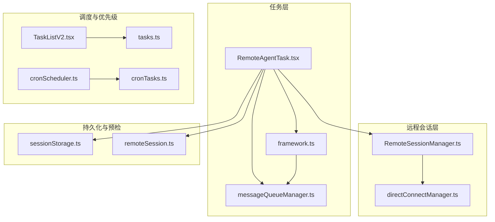
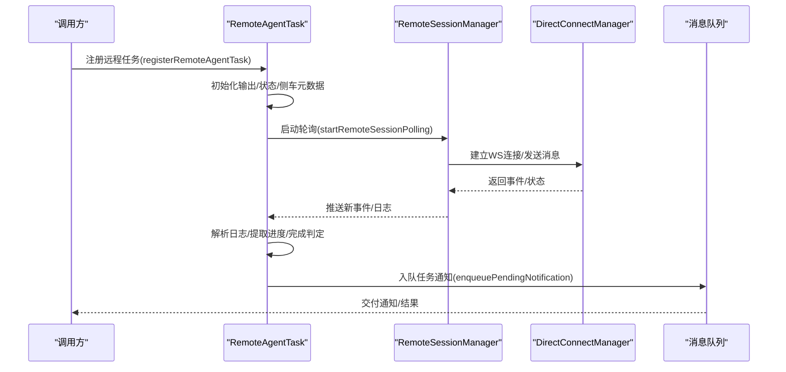
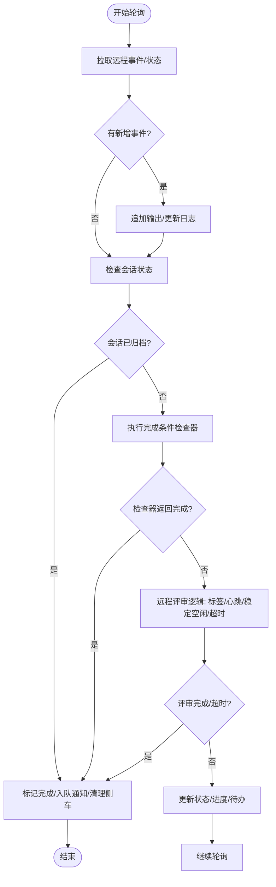
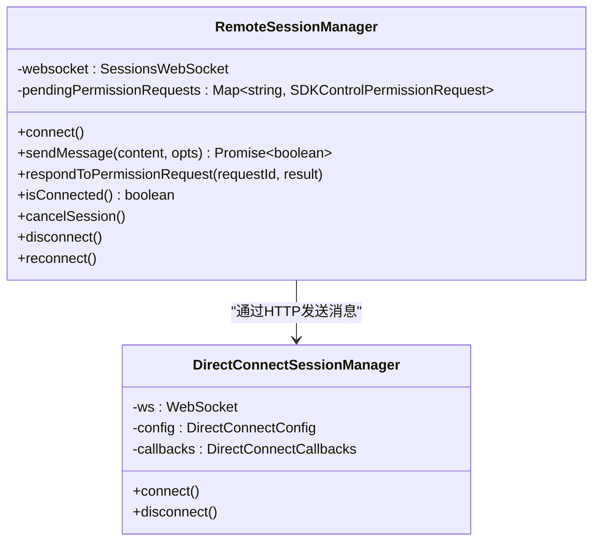
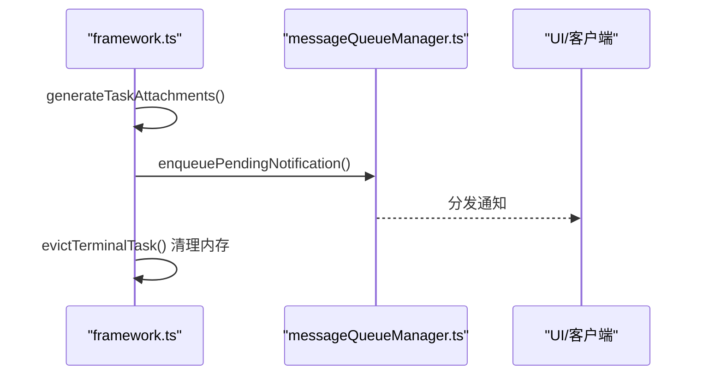
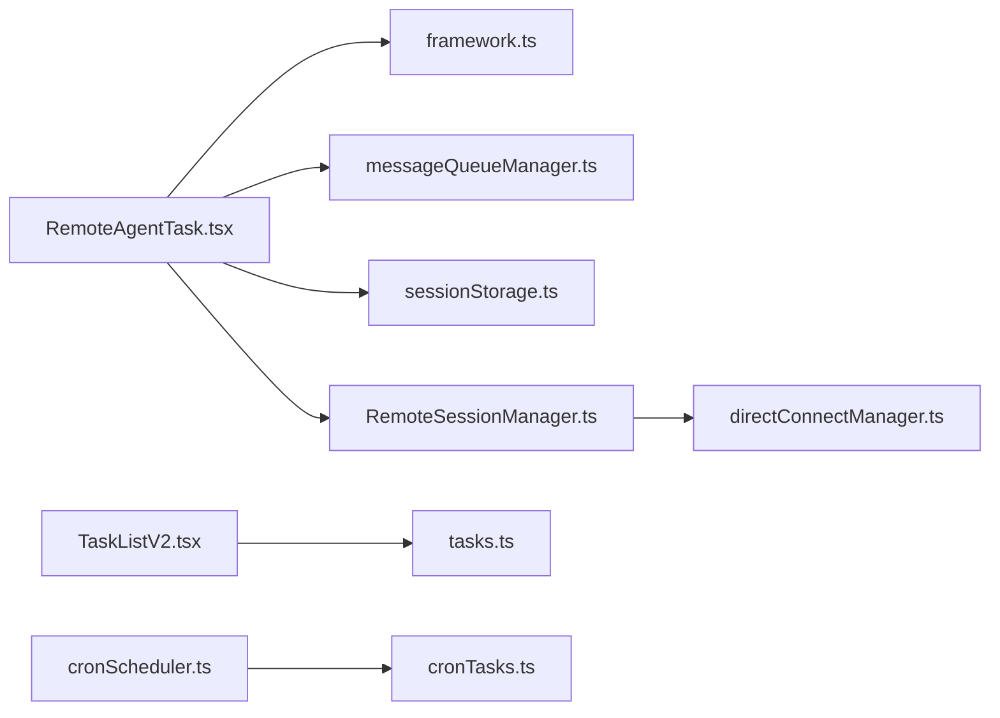

# 远程代理调度技能（scheduleRemoteAgents）

<cite>
**本文引用的文件**
- [RemoteAgentTask.tsx](file://src/tasks/RemoteAgentTask/RemoteAgentTask.tsx)
- [remoteSession.ts](file://src/utils/background/remote/remoteSession.ts)
- [sessionStorage.ts](file://src/utils/sessionStorage.ts)
- [framework.ts](file://src/utils/task/framework.ts)
- [messageQueueManager.ts](file://src/utils/messageQueueManager.ts)
- [RemoteSessionManager.ts](file://src/remote/RemoteSessionManager.ts)
- [directConnectManager.ts](file://src/server/directConnectManager.ts)
- [ultraplan.tsx](file://src/commands/ultraplan.tsx)
- [cronScheduler.ts](file://src/utils/cronScheduler.ts)
- [cronTasks.ts](file://src/utils/cronTasks.ts)
- [tasks.ts](file://src/utils/tasks.ts)
- [TaskListV2.tsx](file://src/components/TaskListV2.tsx)
</cite>

## 目录
1. [简介](#简介)
2. [项目结构](#项目结构)
3. [核心组件](#核心组件)
4. [架构总览](#架构总览)
5. [详细组件分析](#详细组件分析)
6. [依赖分析](#依赖分析)
7. [性能考量](#性能考量)
8. [故障排查指南](#故障排查指南)
9. [结论](#结论)
10. [附录](#附录)

## 简介
本文件面向Claude Code的“远程代理调度技能（scheduleRemoteAgents）”，系统化阐述其在远程任务调度与代理管理方面的设计与实现，覆盖任务分配、负载均衡、状态监控、完成条件判定、超时与容错、以及与远程协作系统的集成方式。文档同时提供配置参数、调度算法要点、优先级策略与最佳实践，并给出性能监控与优化建议。

## 项目结构
围绕“远程代理调度技能”的关键代码分布在以下模块：
- 任务定义与轮询：RemoteAgentTask.tsx
- 远程会话管理：RemoteSessionManager.ts、directConnectManager.ts
- 任务框架与通知：framework.ts、messageQueueManager.ts
- 会话侧车元数据持久化：sessionStorage.ts
- 预条件检查与环境校验：remoteSession.ts
- 调度与优先级（通用任务系统）：cronScheduler.ts、cronTasks.ts、tasks.ts、TaskListV2.tsx
- 特定场景（如Ultraplan）：ultraplan.tsx

图表来源
- [RemoteAgentTask.tsx](file://src/tasks/RemoteAgentTask/RemoteAgentTask.tsx)
- [framework.ts](file://src/utils/task/framework.ts)
- [messageQueueManager.ts](file://src/utils/messageQueueManager.ts)
- [sessionStorage.ts](file://src/utils/sessionStorage.ts)
- [remoteSession.ts](file://src/utils/background/remote/remoteSession.ts)
- [RemoteSessionManager.ts](file://src/remote/RemoteSessionManager.ts)
- [directConnectManager.ts](file://src/server/directConnectManager.ts)
- [cronScheduler.ts](file://src/utils/cronScheduler.ts)
- [cronTasks.ts](file://src/utils/cronTasks.ts)
- [tasks.ts](file://src/utils/tasks.ts)
- [TaskListV2.tsx](file://src/components/TaskListV2.tsx)

章节来源
- [RemoteAgentTask.tsx](file://src/tasks/RemoteAgentTask/RemoteAgentTask.tsx)
- [framework.ts](file://src/utils/task/framework.ts)
- [messageQueueManager.ts](file://src/utils/messageQueueManager.ts)
- [sessionStorage.ts](file://src/utils/sessionStorage.ts)
- [remoteSession.ts](file://src/utils/background/remote/remoteSession.ts)
- [RemoteSessionManager.ts](file://src/remote/RemoteSessionManager.ts)
- [directConnectManager.ts](file://src/server/directConnectManager.ts)
- [cronScheduler.ts](file://src/utils/cronScheduler.ts)
- [cronTasks.ts](file://src/utils/cronTasks.ts)
- [tasks.ts](file://src/utils/tasks.ts)
- [TaskListV2.tsx](file://src/components/TaskListV2.tsx)

## 核心组件
- 远程代理任务（RemoteAgentTask）
  - 定义远程任务类型、状态机、轮询逻辑、完成条件检查器注册、侧车元数据持久化与恢复、通知与输出管理。
- 远程会话管理（RemoteSessionManager）
  - 维护WebSocket订阅、HTTP消息发送、权限请求响应、连接生命周期管理。
- 任务框架与通知（framework.ts、messageQueueManager.ts）
  - 统一的任务注册、状态更新、附件生成、通知入队与去重、终端任务回收。
- 会话侧车元数据（sessionStorage.ts）
  - 将远程任务身份信息写入本地侧车文件，支持--resume恢复。
- 预条件检查（remoteSession.ts）
  - 登录态、远程环境、Git仓库与GitHub应用安装、策略限制等前置条件校验。
- 调度与优先级（cronScheduler.ts、cronTasks.ts、tasks.ts、TaskListV2.tsx）
  - 周期性任务调度、抖动与节流、任务抢占与原子占用、任务列表优先级展示。

章节来源
- [RemoteAgentTask.tsx](file://src/tasks/RemoteAgentTask/RemoteAgentTask.tsx)
- [RemoteSessionManager.ts](file://src/remote/RemoteSessionManager.ts)
- [framework.ts](file://src/utils/task/framework.ts)
- [messageQueueManager.ts](file://src/utils/messageQueueManager.ts)
- [sessionStorage.ts](file://src/utils/sessionStorage.ts)
- [remoteSession.ts](file://src/utils/background/remote/remoteSession.ts)
- [cronScheduler.ts](file://src/utils/cronScheduler.ts)
- [cronTasks.ts](file://src/utils/cronTasks.ts)
- [tasks.ts](file://src/utils/tasks.ts)
- [TaskListV2.tsx](file://src/components/TaskListV2.tsx)

## 架构总览
远程代理调度技能以“任务-会话-通知”三层协同：
- 任务层负责任务生命周期、状态推进、完成判定与通知；
- 会话层负责与远程协作系统（CCR）建立并维护连接，处理消息与权限；
- 框架层负责统一的任务状态与输出管理、通知分发与回收。

图表来源
- [RemoteAgentTask.tsx](file://src/tasks/RemoteAgentTask/RemoteAgentTask.tsx)
- [RemoteSessionManager.ts](file://src/remote/RemoteSessionManager.ts)
- [directConnectManager.ts](file://src/server/directConnectManager.ts)
- [messageQueueManager.ts](file://src/utils/messageQueueManager.ts)

## 详细组件分析

### 远程代理任务（RemoteAgentTask）
- 任务类型与状态
  - 支持多种远程任务类型（如远程代理、Ultraplan、远程评审、自动修复PR等），统一状态机：starting、running、completed、failed、killed。
- 任务注册与侧车持久化
  - 注册时生成任务ID、初始化输出文件、创建任务状态并登记到任务框架；同时将任务身份信息写入侧车文件，便于--resume恢复。
- 轮询与完成判定
  - 固定轮询间隔，按日志增量追加输出；通过完成条件检查器（completionCheckers）对特定任务类型进行判定；对远程评审任务采用心跳进度标签与稳定空闲检测相结合的完成策略；对Ultraplan与长任务采用特殊跳过逻辑避免误判。
- 通知与输出
  - 任务完成后通过消息队列入队通知；终端任务在通知后清理输出与侧车元数据。
- 恢复与容错
  - --resume扫描侧车文件，拉取远程会话状态，重建任务状态并重启轮询；对404或归档会话进行清理；网络瞬断通过稳定空闲计数与超时保护避免误判。

图表来源
- [RemoteAgentTask.tsx](file://src/tasks/RemoteAgentTask/RemoteAgentTask.tsx)

章节来源
- [RemoteAgentTask.tsx](file://src/tasks/RemoteAgentTask/RemoteAgentTask.tsx)
- [sessionStorage.ts](file://src/utils/sessionStorage.ts)
- [framework.ts](file://src/utils/task/framework.ts)
- [messageQueueManager.ts](file://src/utils/messageQueueManager.ts)

### 远程会话管理（RemoteSessionManager）
- 连接与消息
  - 通过WebSocket订阅远程会话事件，处理SDK消息与控制消息；通过HTTP向远程会话发送用户消息。
- 权限请求与响应
  - 接收来自服务器的工具使用权限请求，维护挂起请求映射，并根据用户决策发送允许/拒绝响应。
- 生命周期管理
  - 提供连接、断开、重连、中断信号（取消当前请求）等能力；支持Viewer模式（只读）与初始提示处理。

图表来源
- [RemoteSessionManager.ts](file://src/remote/RemoteSessionManager.ts)
- [directConnectManager.ts](file://src/server/directConnectManager.ts)

章节来源
- [RemoteSessionManager.ts](file://src/remote/RemoteSessionManager.ts)
- [directConnectManager.ts](file://src/server/directConnectManager.ts)

### 任务框架与通知（framework.ts、messageQueueManager.ts）
- 任务注册与状态更新
  - 统一的任务注册、状态更新、运行中任务收集、终端任务回收；支持增量输出偏移与附件生成。
- 通知入队与去重
  - 通过消息队列入队任务通知，避免重复通知；支持按优先级匹配与批量移除命令。

图表来源
- [framework.ts](file://src/utils/task/framework.ts)
- [messageQueueManager.ts](file://src/utils/messageQueueManager.ts)

章节来源
- [framework.ts](file://src/utils/task/framework.ts)
- [messageQueueManager.ts](file://src/utils/messageQueueManager.ts)

### 会话侧车元数据（sessionStorage.ts）
- 作用
  - 将远程任务身份信息写入本地侧车文件，支持--resume恢复；仅保存身份，不保存实时状态，状态由远程系统刷新。
- 持久化与清理
  - 写入、读取、删除侧车元数据；失败时记录调试日志但不阻塞任务注册。

章节来源
- [sessionStorage.ts](file://src/utils/sessionStorage.ts)

### 预条件检查（remoteSession.ts）
- 校验项
  - 策略允许、登录态、远程环境、Git仓库、GitHub应用安装；当启用bundle种子时可放宽要求。
- 错误格式化
  - 将预条件错误转换为用户可读提示。

章节来源
- [remoteSession.ts](file://src/utils/background/remote/remoteSession.ts)

### 调度与优先级（cronScheduler.ts、cronTasks.ts、tasks.ts、TaskListV2.tsx）
- 周期性任务调度
  - 计算下次触发时间、抖动与节流、守护进程子进程重启锚定、一次性与周期性任务区分。
- 任务抢占与原子占用
  - 使用锁文件保证任务列表级原子性，避免并发冲突。
- 任务列表优先级
  - 最近完成、进行中、待处理、较早完成的优先级排序与截断显示。

章节来源
- [cronScheduler.ts](file://src/utils/cronScheduler.ts)
- [cronTasks.ts](file://src/utils/cronTasks.ts)
- [tasks.ts](file://src/utils/tasks.ts)
- [TaskListV2.tsx](file://src/components/TaskListV2.tsx)

## 依赖分析
- RemoteAgentTask依赖任务框架与消息队列进行状态与通知管理；依赖侧车存储进行恢复；依赖远程会话管理进行事件获取。
- RemoteSessionManager依赖DirectConnectManager进行HTTP消息发送；维护权限请求映射。
- 通用任务系统（cronScheduler、tasks）为远程任务提供调度与优先级基础。

图表来源
- [RemoteAgentTask.tsx](file://src/tasks/RemoteAgentTask/RemoteAgentTask.tsx)
- [framework.ts](file://src/utils/task/framework.ts)
- [messageQueueManager.ts](file://src/utils/messageQueueManager.ts)
- [sessionStorage.ts](file://src/utils/sessionStorage.ts)
- [RemoteSessionManager.ts](file://src/remote/RemoteSessionManager.ts)
- [directConnectManager.ts](file://src/server/directConnectManager.ts)
- [TaskListV2.tsx](file://src/components/TaskListV2.tsx)
- [tasks.ts](file://src/utils/tasks.ts)
- [cronScheduler.ts](file://src/utils/cronScheduler.ts)
- [cronTasks.ts](file://src/utils/cronTasks.ts)

章节来源
- [RemoteAgentTask.tsx](file://src/tasks/RemoteAgentTask/RemoteAgentTask.tsx)
- [framework.ts](file://src/utils/task/framework.ts)
- [messageQueueManager.ts](file://src/utils/messageQueueManager.ts)
- [sessionStorage.ts](file://src/utils/sessionStorage.ts)
- [RemoteSessionManager.ts](file://src/remote/RemoteSessionManager.ts)
- [directConnectManager.ts](file://src/server/directConnectManager.ts)
- [TaskListV2.tsx](file://src/components/TaskListV2.tsx)
- [tasks.ts](file://src/utils/tasks.ts)
- [cronScheduler.ts](file://src/utils/cronScheduler.ts)
- [cronTasks.ts](file://src/utils/cronTasks.ts)

## 性能考量
- 轮询与增量处理
  - 固定轮询间隔，仅对新增事件进行日志拼接与输出追加，降低I/O与CPU开销。
- 稳定空闲检测
  - 对远程会话短暂空闲进行多次确认，避免频繁误判导致的无效通知与资源浪费。
- 通知去重与延迟回收
  - 通过“已通知”标志避免重复入队；终端任务在通知后尽快回收，释放内存。
- 抖动与节流（通用任务系统）
  - 周期性任务引入抖动与节流，分散推理峰值，提升整体稳定性。
- 输出偏移与增量附件
  - 仅生成增量附件，减少不必要的渲染与传输。

章节来源
- [RemoteAgentTask.tsx](file://src/tasks/RemoteAgentTask/RemoteAgentTask.tsx)
- [framework.ts](file://src/utils/task/framework.ts)
- [cronScheduler.ts](file://src/utils/cronScheduler.ts)
- [cronTasks.ts](file://src/utils/cronTasks.ts)

## 故障排查指南
- 无法创建远程任务
  - 检查预条件：登录态、远程环境、Git仓库与GitHub应用安装；查看格式化后的错误提示。
- 任务长时间无进展
  - 关注稳定空闲检测与远程评审超时；确认网络波动是否导致轮询中断。
- 任务恢复异常
  - 检查侧车元数据是否存在与可读；确认远程会话状态；404或归档会话会被清理。
- 通知未送达
  - 检查“已通知”标志与消息队列状态；确认任务已完成/失败/被停止的状态一致性。
- 权限请求未响应
  - 确认RemoteSessionManager中的挂起请求映射；检查权限回调链路。

章节来源
- [remoteSession.ts](file://src/utils/background/remote/remoteSession.ts)
- [RemoteAgentTask.tsx](file://src/tasks/RemoteAgentTask/RemoteAgentTask.tsx)
- [sessionStorage.ts](file://src/utils/sessionStorage.ts)
- [RemoteSessionManager.ts](file://src/remote/RemoteSessionManager.ts)
- [messageQueueManager.ts](file://src/utils/messageQueueManager.ts)

## 结论
“远程代理调度技能（scheduleRemoteAgents）”通过统一的任务框架、可靠的远程会话管理与完善的侧车恢复机制，实现了对多类远程任务的高效调度与状态监控。结合稳定空闲检测、完成条件检查器与通知去重策略，系统在复杂网络环境下仍能保持稳健与低开销。配合通用任务系统的调度与优先级能力，可进一步扩展为更广泛的代理调度平台。

## 附录

### 配置参数与调度算法要点
- 轮询间隔
  - 固定轮询间隔用于统一节奏，避免过载。
- 完成条件检查器
  - 针对不同任务类型注册专用检查器，确保完成判定的准确性与时效性。
- 稳定空闲检测
  - 多次连续空闲且无日志增长才视为稳定空闲，避免误判。
- 远程评审超时
  - 设定固定超时阈值，防止长时间挂起。
- 抖动与节流（通用任务系统）
  - 在周期性任务中引入抖动，分散触发时间，降低集中压力。

章节来源
- [RemoteAgentTask.tsx](file://src/tasks/RemoteAgentTask/RemoteAgentTask.tsx)
- [cronScheduler.ts](file://src/utils/cronScheduler.ts)
- [cronTasks.ts](file://src/utils/cronTasks.ts)

### 优先级与负载均衡策略
- 任务列表优先级
  - 最近完成、进行中、待处理、较早完成的顺序展示与截断，提升可见性与交互效率。
- 任务抢占与原子占用
  - 使用锁文件保证任务列表级原子性，避免并发冲突与重复占用。
- 通用调度抖动
  - 通过抖动与节流降低推理峰值，提升系统整体吞吐与稳定性。

章节来源
- [TaskListV2.tsx](file://src/components/TaskListV2.tsx)
- [tasks.ts](file://src/utils/tasks.ts)
- [cronScheduler.ts](file://src/utils/cronScheduler.ts)
- [cronTasks.ts](file://src/utils/cronTasks.ts)

### 实际案例与最佳实践
- 远程评审
  - 使用心跳进度标签与稳定空闲检测，结合超时保护，确保评审流程可控。
- Ultraplan
  - 与专用轮询分离，避免与通用轮询逻辑冲突；停止时归档远程会话并清理UI状态。
- 侧车恢复
  - --resume时仅恢复身份，状态从远程系统刷新，避免本地状态漂移。
- 通知与输出
  - 任务完成后清理输出与侧车元数据，减少磁盘占用；终端任务尽快回收，释放内存。

章节来源
- [RemoteAgentTask.tsx](file://src/tasks/RemoteAgentTask/RemoteAgentTask.tsx)
- [ultraplan.tsx](file://src/commands/ultraplan.tsx)
- [sessionStorage.ts](file://src/utils/sessionStorage.ts)
- [framework.ts](file://src/utils/task/framework.ts)