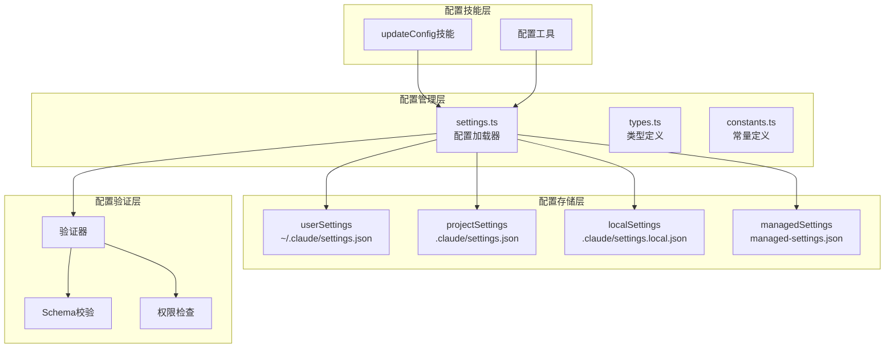
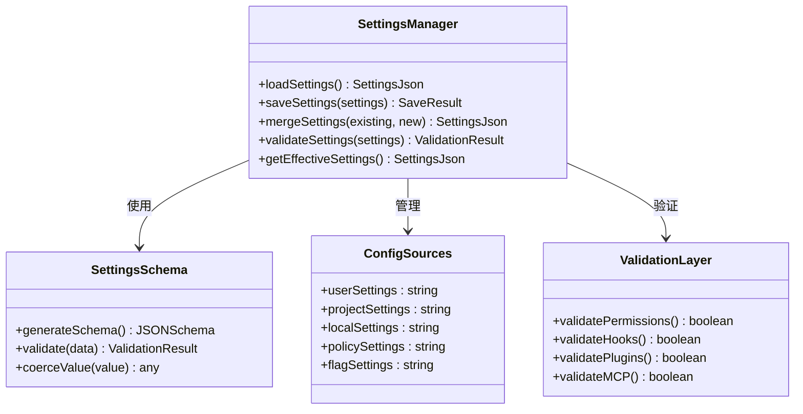
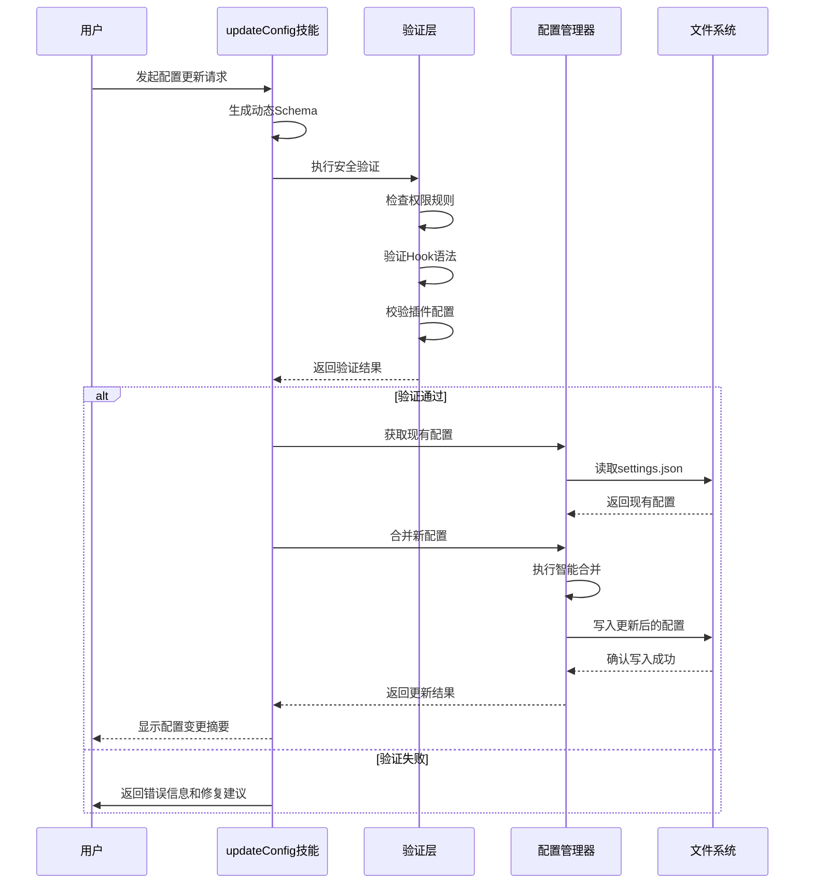
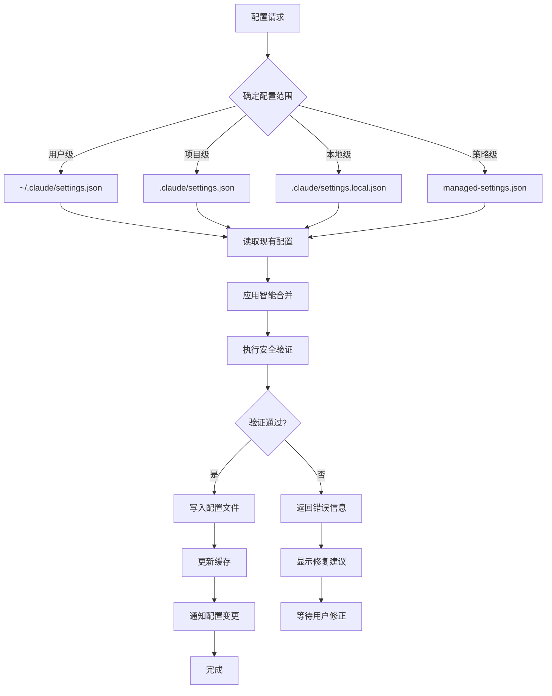
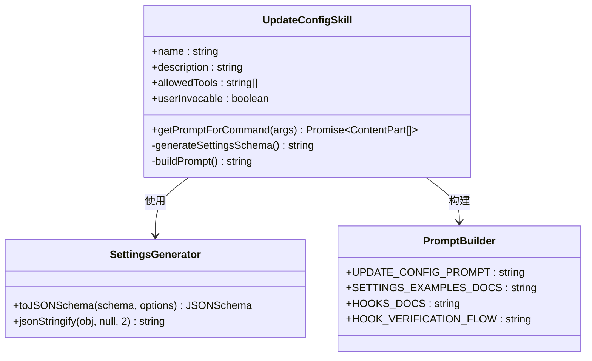
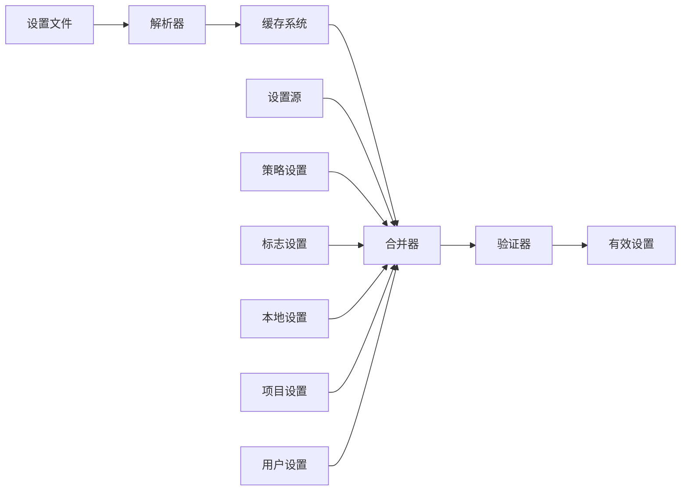
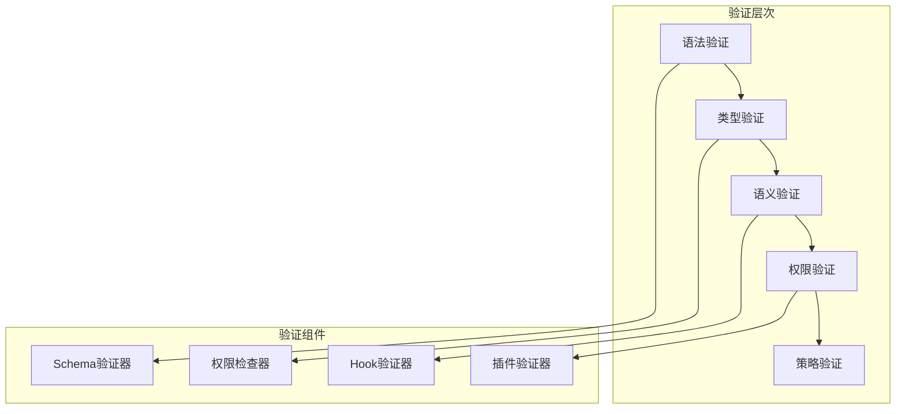
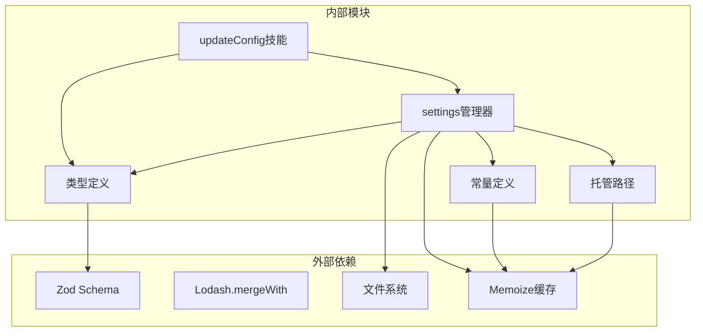
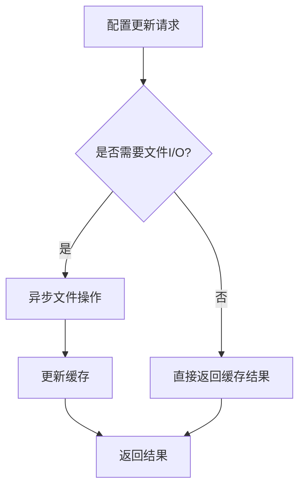

# 配置更新技能（updateConfig）

<cite>
**本文档引用的文件**
- [updateConfig.ts](file://src/skills/bundled/updateConfig.ts)
- [settings.ts](file://src/utils/settings/settings.ts)
- [types.ts](file://src/utils/settings/types.ts)
- [constants.ts](file://src/utils/settings/constants.ts)
- [managedPath.ts](file://src/utils/settings/managedPath.ts)
- [config.ts](file://src/utils/config.ts)
- [configConstants.ts](file://src/utils/configConstants.ts)
- [config.tsx](file://src/commands/config/config.tsx)
</cite>

## 目录
1. [简介](#简介)
2. [项目结构](#项目结构)
3. [核心组件](#核心组件)
4. [架构概览](#架构概览)
5. [详细组件分析](#详细组件分析)
6. [依赖关系分析](#依赖关系分析)
7. [性能考虑](#性能考虑)
8. [故障排除指南](#故障排除指南)
9. [结论](#结论)
10. [附录](#附录)

## 简介

配置更新技能（updateConfig）是Claude Code中的一个核心技能，专门用于通过settings.json文件来配置Claude Code执行器。该技能提供了完整的配置管理功能，包括配置文件操作、参数修改、版本控制、安全检查、回滚机制和验证策略。

updateConfig技能的核心价值在于它能够：
- 自动化配置更新流程，减少手动操作错误
- 提供智能的配置合并策略，避免覆盖现有设置
- 实现安全的配置验证和错误处理
- 支持多层级配置源的优先级管理
- 提供完整的配置变更追踪和审计能力

## 项目结构

Claude Code的配置系统采用分层架构设计，主要由以下组件构成：

**图表来源**
- [updateConfig.ts:445-475](file://src/skills/bundled/updateConfig.ts#L445-L475)
- [settings.ts:812-826](file://src/utils/settings/settings.ts#L812-L826)
- [constants.ts:7-22](file://src/utils/settings/constants.ts#L7-L22)

**章节来源**
- [updateConfig.ts:1-476](file://src/skills/bundled/updateConfig.ts#L1-L476)
- [settings.ts:1-200](file://src/utils/settings/settings.ts#L1-L200)
- [constants.ts:1-203](file://src/utils/settings/constants.ts#L1-L203)

## 核心组件

### updateConfig技能核心功能

updateConfig技能提供了以下核心功能：

#### 1. 动态Schema生成
技能能够根据当前的设置类型动态生成JSON Schema，确保提示内容与实际类型保持同步。

#### 2. 多层级配置支持
支持用户级、项目级、本地级和策略级配置的统一管理。

#### 3. 智能合并策略
提供智能的配置合并逻辑，避免覆盖现有设置，特别适用于数组类型的配置。

#### 4. 安全验证机制
内置完整的安全检查和验证机制，确保配置变更的安全性和有效性。

**章节来源**
- [updateConfig.ts:10-13](file://src/skills/bundled/updateConfig.ts#L10-L13)
- [updateConfig.ts:445-475](file://src/skills/bundled/updateConfig.ts#L445-L475)

### 配置管理架构

**图表来源**
- [settings.ts:812-826](file://src/utils/settings/settings.ts#L812-L826)
- [types.ts:255-256](file://src/utils/settings/types.ts#L255-L256)
- [constants.ts:7-22](file://src/utils/settings/constants.ts#L7-L22)

**章节来源**
- [settings.ts:473-521](file://src/utils/settings/settings.ts#L473-L521)
- [types.ts:243-241](file://src/utils/settings/types.ts#L243-L241)

## 架构概览

### 配置更新流程

**图表来源**
- [updateConfig.ts:452-473](file://src/skills/bundled/updateConfig.ts#L452-L473)
- [settings.ts:473-521](file://src/utils/settings/settings.ts#L473-L521)

### 配置优先级体系

**图表来源**
- [constants.ts:7-22](file://src/utils/settings/constants.ts#L7-L22)
- [settings.ts:812-826](file://src/utils/settings/settings.ts#L812-L826)

**章节来源**
- [constants.ts:26-93](file://src/utils/settings/constants.ts#L26-L93)
- [settings.ts:812-826](file://src/utils/settings/settings.ts#L812-L826)

## 详细组件分析

### updateConfig技能实现

#### 技能注册和初始化

updateConfig技能通过`registerBundledSkill`函数进行注册，提供完整的配置管理功能：

**图表来源**
- [updateConfig.ts:445-475](file://src/skills/bundled/updateConfig.ts#L445-L475)
- [updateConfig.ts:10-13](file://src/skills/bundled/updateConfig.ts#L10-L13)

#### 配置Schema生成

技能使用Zod库动态生成JSON Schema，确保与实际类型定义保持同步：

**章节来源**
- [updateConfig.ts:10-13](file://src/skills/bundled/updateConfig.ts#L10-L13)
- [updateConfig.ts:462-467](file://src/skills/bundled/updateConfig.ts#L462-L467)

### 配置管理器

#### 设置加载和解析

配置管理器负责从多个来源加载和解析配置：

**图表来源**
- [settings.ts:178-200](file://src/utils/settings/settings.ts#L178-L200)
- [settings.ts:473-521](file://src/utils/settings/settings.ts#L473-L521)

#### 智能合并策略

配置管理器实现了复杂的合并策略，特别处理数组类型的配置：

**章节来源**
- [settings.ts:473-495](file://src/utils/settings/settings.ts#L473-L495)

### 类型系统和验证

#### 设置类型定义

设置系统基于Zod Schema定义，提供完整的类型安全保证：

**章节来源**
- [types.ts:255-256](file://src/utils/settings/types.ts#L255-L256)
- [types.ts:42-85](file://src/utils/settings/types.ts#L42-L85)

#### 验证机制

系统包含多层次的验证机制：

**图表来源**
- [types.ts:42-85](file://src/utils/settings/types.ts#L42-L85)
- [settings.ts:178-200](file://src/utils/settings/settings.ts#L178-L200)

**章节来源**
- [types.ts:1-800](file://src/utils/settings/types.ts#L1-L800)
- [settings.ts:157-170](file://src/utils/settings/settings.ts#L157-L170)

## 依赖关系分析

### 组件间依赖

**图表来源**
- [updateConfig.ts:1-4](file://src/skills/bundled/updateConfig.ts#L1-L4)
- [settings.ts:1-47](file://src/utils/settings/settings.ts#L1-L47)

### 循环依赖检测

系统通过模块化设计避免了循环依赖问题：

**章节来源**
- [updateConfig.ts:1-4](file://src/skills/bundled/updateConfig.ts#L1-L4)
- [settings.ts:1-47](file://src/utils/settings/settings.ts#L1-L47)

## 性能考虑

### 缓存策略

系统采用了多层缓存机制来优化性能：

1. **文件解析缓存**：缓存已解析的设置文件内容
2. **设置合并缓存**：缓存合并后的设置结果
3. **类型验证缓存**：缓存验证结果以避免重复计算

### 异步操作优化

**图表来源**
- [settings.ts:182-199](file://src/utils/settings/settings.ts#L182-L199)

### 内存管理

系统通过以下机制优化内存使用：
- 懒加载策略，仅在需要时加载配置
- 缓存失效机制，防止内存泄漏
- 增量更新策略，避免全量重新计算

## 故障排除指南

### 常见问题和解决方案

#### 配置文件损坏

当配置文件损坏时，系统会自动降级到默认配置：

**章节来源**
- [settings.ts:783-795](file://src/utils/settings/settings.ts#L783-L795)

#### 权限不足错误

系统提供详细的权限错误信息和修复建议：

**章节来源**
- [settings.ts:157-170](file://src/utils/settings/settings.ts#L157-L170)

#### 配置冲突处理

当多个配置源产生冲突时，系统按照预定义的优先级解决：

**章节来源**
- [constants.ts:7-22](file://src/utils/settings/constants.ts#L7-L22)

### 调试和诊断

系统提供了完整的调试工具和诊断功能：

**章节来源**
- [config.ts:48-51](file://src/utils/config.ts#L48-L51)
- [config.ts:797-800](file://src/utils/config.ts#L797-L800)

## 结论

updateConfig技能为Claude Code提供了强大而灵活的配置管理能力。通过其智能的合并策略、严格的安全验证和完善的错误处理机制，确保了配置更新的安全性和可靠性。

该技能的主要优势包括：
- **自动化程度高**：减少了手动配置的复杂性和错误率
- **安全性强**：内置多重验证机制保护系统完整性
- **灵活性好**：支持多种配置源和复杂的合并场景
- **可维护性强**：清晰的架构设计便于后续扩展和维护

随着Claude Code生态系统的不断发展，updateConfig技能将继续发挥重要作用，为用户提供更好的配置管理体验。

## 附录

### 最佳实践建议

1. **配置变更前备份**：在进行重大配置变更前，建议备份现有的settings.json文件
2. **渐进式变更**：对于复杂的配置变更，建议分步骤进行，便于问题定位
3. **测试环境验证**：在生产环境应用配置前，先在测试环境中验证
4. **监控变更影响**：关注配置变更对系统性能和功能的影响

### 自动化更新方案

系统支持多种自动化配置更新方案：
- **脚本化部署**：通过脚本批量更新多个项目的配置
- **CI/CD集成**：在持续集成流程中自动应用配置更新
- **远程管理**：通过远程接口集中管理多个实例的配置

### 兼容性处理

系统提供了完善的向后兼容性支持：
- **字段迁移**：自动处理废弃字段的迁移
- **类型转换**：支持不同版本间的类型转换
- **配置降级**：在不支持某些功能的版本中自动降级