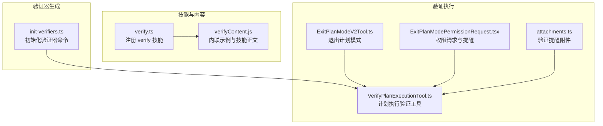
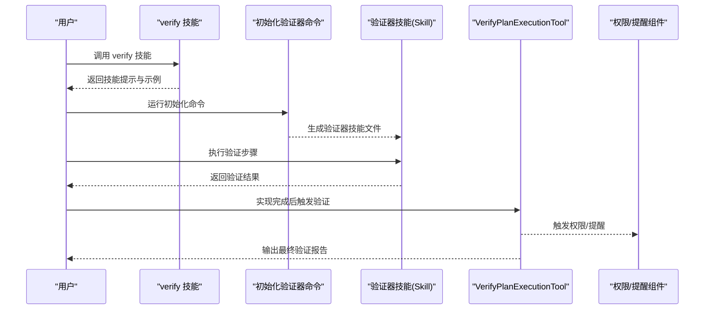
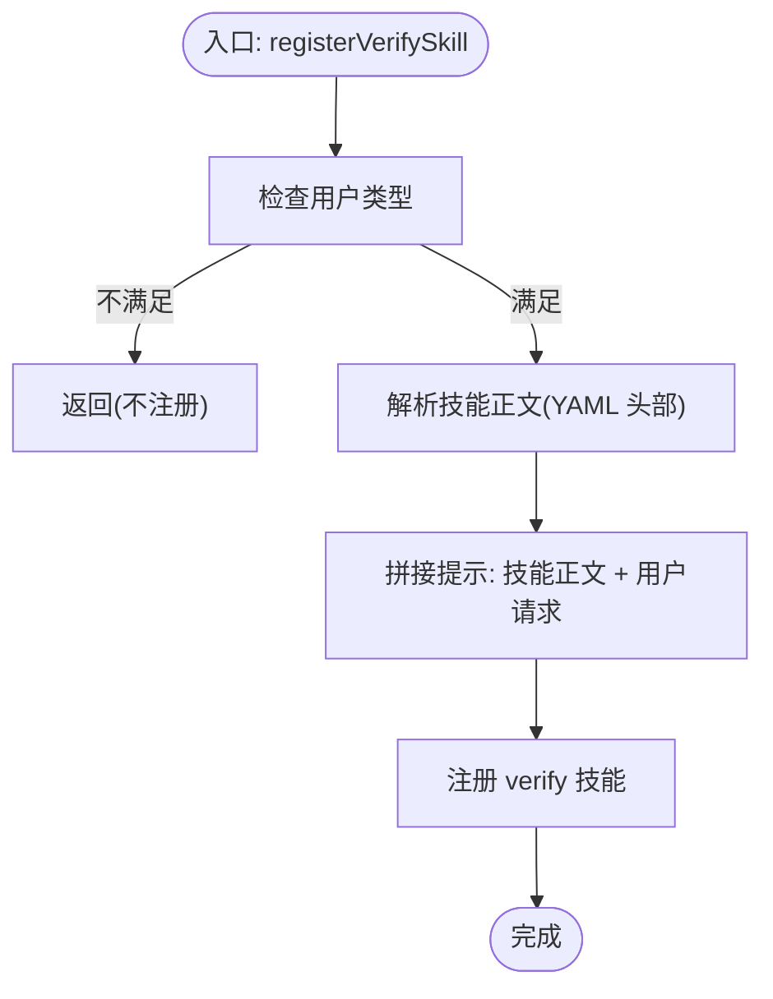
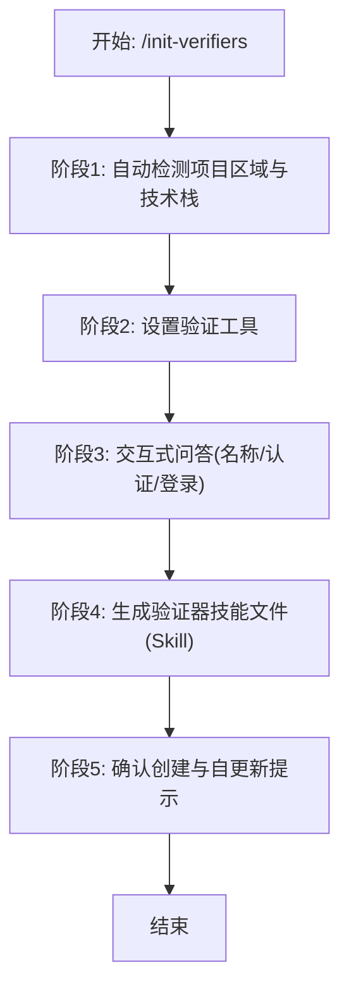
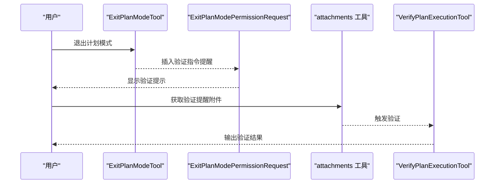
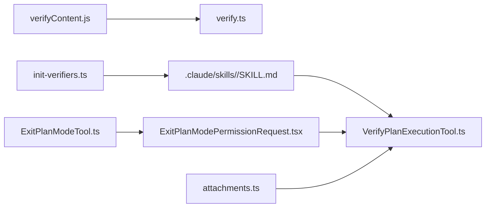

# 验证技能 (verify)

<cite>
**本文引用的文件**
- [verify.ts](file://src/skills/bundled/verify.ts)
- [verifyContent.ts](file://src/skills/bundled/verifyContent.js)
- [init-verifiers.ts](file://src/commands/init-verifiers.ts)
- [VerifyPlanExecutionTool](file://tools/VerifyPlanExecutionTool/VerifyPlanExecutionTool.ts)
- [VerifyPlanExecutionTool 示例](file://tools/VerifyPlanExecutionTool/README.md)
- [ExitPlanModeTool](file://src/tools/ExitPlanModeTool/ExitPlanModeV2Tool.ts)
- [ExitPlanModePermissionRequest 组件](file://src/components/permissions/ExitPlanModePermissionRequest/ExitPlanModePermissionRequest.tsx)
- [attachments 工具](file://src/utils/attachments.ts)
</cite>

## 目录
1. [简介](#简介)
2. [项目结构](#项目结构)
3. [核心组件](#核心组件)
4. [架构总览](#架构总览)
5. [详细组件分析](#详细组件分析)
6. [依赖关系分析](#依赖关系分析)
7. [性能考量](#性能考量)
8. [故障排除指南](#故障排除指南)
9. [结论](#结论)
10. [附录](#附录)

## 简介
本文件系统性阐述 Claude Code 的验证技能（verify）能力，聚焦于“验证”在质量保证流程中的作用：通过可插拔的验证器技能（verifier skills），对代码变更进行自动化功能性验证。验证技能由两部分组成：
- 内置验证技能注册器：负责在特定用户类型下加载并暴露 verify 技能，提供基础提示模板与示例文件。
- 初始化验证器命令：帮助用户基于项目结构自动生成不同类型的验证器技能（Web UI、CLI、API），并引导安装与配置相应的工具链。

验证技能不直接执行测试，而是通过“验证器技能”与工具链协作完成验证任务；同时，系统提供了计划执行验证工具与相关权限/提醒机制，确保在实现完成后触发验证。

## 项目结构
验证相关代码主要分布在以下位置：
- 技能注册与内容打包：src/skills/bundled/verify.ts、verifyContent.js
- 验证器初始化命令：src/commands/init-verifiers.ts
- 计划执行验证工具：tools/VerifyPlanExecutionTool/VerifyPlanExecutionTool.ts 及其文档
- 计划退出与验证提醒：src/tools/ExitPlanModeTool/ExitPlanModeV2Tool.ts、src/components/permissions/ExitPlanModePermissionRequest/ExitPlanModePermissionRequest.tsx、src/utils/attachments.ts

图表来源
- [verify.ts:1-31](file://src/skills/bundled/verify.ts#L1-L31)
- [verifyContent.ts:1-14](file://src/skills/bundled/verifyContent.js#L1-L14)
- [init-verifiers.ts:1-263](file://src/commands/init-verifiers.ts#L1-L263)
- [VerifyPlanExecutionTool:1-200](file://tools/VerifyPlanExecutionTool/VerifyPlanExecutionTool.ts#L1-L200)
- [ExitPlanModeTool:240-316](file://src/tools/ExitPlanModeTool/ExitPlanModeV2Tool.ts#L240-L316)
- [ExitPlanModePermissionRequest:354-367](file://src/components/permissions/ExitPlanModePermissionRequest/ExitPlanModePermissionRequest.tsx#L354-L367)
- [attachments:3891-3906](file://src/utils/attachments.ts#L3891-L3906)

章节来源
- [verify.ts:1-31](file://src/skills/bundled/verify.ts#L1-L31)
- [verifyContent.ts:1-14](file://src/skills/bundled/verifyContent.js#L1-L14)
- [init-verifiers.ts:1-263](file://src/commands/init-verifiers.ts#L1-L263)

## 核心组件
- 验证技能注册器（verify.ts）
  - 解析技能正文的 YAML 头部，提取描述信息
  - 仅在特定用户类型下注册 verify 技能
  - 提供 getPromptForCommand，将技能正文与用户请求拼接为提示
  - 暴露示例文件集合（如 CLI、服务端示例）

- 验证器初始化命令（init-verifiers.ts）
  - 自动检测项目区域与技术栈（前端/后端/CLI）
  - 基于检测结果推荐或安装浏览器自动化（Playwright、Chrome DevTools）、终端录制（asciinema/Tmux）、HTTP 测试工具
  - 交互式确认验证器名称、认证方式、登录流程等
  - 输出标准化的验证器技能文件（SKILL.md），包含 allowed-tools 列表
  - 强调验证器发现规则：文件夹名需包含“verifier”（大小写不敏感）

- 计划执行验证工具（VerifyPlanExecutionTool）
  - 在实现完成后触发后台验证，确保变更按预期工作
  - 支持环境变量开关与团队权限流程（如需要领导批准）

- 计划退出与验证提醒（ExitPlanModeTool、ExitPlanModePermissionRequest、attachments）
  - 退出计划模式时插入验证指令提醒
  - 通过附件与权限请求组件，确保用户在合适时机调用验证工具

章节来源
- [verify.ts:12-30](file://src/skills/bundled/verify.ts#L12-L30)
- [verifyContent.ts:10-13](file://src/skills/bundled/verifyContent.js#L10-L13)
- [init-verifiers.ts:17-26](file://src/commands/init-verifiers.ts#L17-L26)
- [VerifyPlanExecutionTool:1-200](file://tools/VerifyPlanExecutionTool/VerifyPlanExecutionTool.ts#L1-L200)
- [ExitPlanModeTool:240-316](file://src/tools/ExitPlanModeTool/ExitPlanModeV2Tool.ts#L240-L316)
- [ExitPlanModePermissionRequest:354-367](file://src/components/permissions/ExitPlanModePermissionRequest/ExitPlanModePermissionRequest.tsx#L354-L367)
- [attachments:3891-3906](file://src/utils/attachments.ts#L3891-L3906)

## 架构总览
验证技能的整体流程如下：
- 用户通过 verify 技能或初始化命令生成验证器技能
- 验证器技能定义了 allowed-tools 与验证步骤
- 实现完成后，调用 VerifyPlanExecutionTool 触发验证
- 系统通过权限与提醒机制确保验证被正确执行

图表来源
- [verify.ts:22-28](file://src/skills/bundled/verify.ts#L22-L28)
- [init-verifiers.ts:163-208](file://src/commands/init-verifiers.ts#L163-L208)
- [VerifyPlanExecutionTool:1-200](file://tools/VerifyPlanExecutionTool/VerifyPlanExecutionTool.ts#L1-L200)
- [ExitPlanModeTool:240-316](file://src/tools/ExitPlanModeTool/ExitPlanModeV2Tool.ts#L240-L316)
- [ExitPlanModePermissionRequest:354-367](file://src/components/permissions/ExitPlanModePermissionRequest/ExitPlanModePermissionRequest.tsx#L354-L367)

## 详细组件分析

### 验证技能注册器（verify.ts）
- 功能要点
  - 仅在满足条件（特定用户类型）时注册 verify 技能
  - 从技能正文解析描述，作为技能说明
  - 将技能正文与用户输入拼接为提示，便于后续验证器执行

图表来源
- [verify.ts:12-30](file://src/skills/bundled/verify.ts#L12-L30)

章节来源
- [verify.ts:12-30](file://src/skills/bundled/verify.ts#L12-L30)

### 验证器初始化命令（init-verifiers.ts）
- 功能要点
  - 自动检测项目区域与技术栈
  - 推荐并安装合适的验证工具（Playwright、Chrome DevTools、asciinema/Tmux、curl/httpie）
  - 交互式确认验证器名称、认证方式、登录流程
  - 生成标准化的验证器技能文件（SKILL.md），包含 allowed-tools 列表
  - 强调验证器发现规则：文件夹名需包含“verifier”

图表来源
- [init-verifiers.ts:23-262](file://src/commands/init-verifiers.ts#L23-L262)

章节来源
- [init-verifiers.ts:1-263](file://src/commands/init-verifiers.ts#L1-L263)

### 计划执行验证工具（VerifyPlanExecutionTool）
- 功能要点
  - 在实现完成后触发后台验证
  - 支持环境变量开关与团队权限流程
  - 与计划退出、权限请求、提醒附件协同工作

图表来源
- [ExitPlanModeTool:240-316](file://src/tools/ExitPlanModeTool/ExitPlanModeV2Tool.ts#L240-L316)
- [ExitPlanModePermissionRequest:354-367](file://src/components/permissions/ExitPlanModePermissionRequest/ExitPlanModePermissionRequest.tsx#L354-L367)
- [attachments:3891-3906](file://src/utils/attachments.ts#L3891-L3906)
- [VerifyPlanExecutionTool:1-200](file://tools/VerifyPlanExecutionTool/VerifyPlanExecutionTool.ts#L1-L200)

章节来源
- [VerifyPlanExecutionTool:1-200](file://tools/VerifyPlanExecutionTool/VerifyPlanExecutionTool.ts#L1-L200)
- [ExitPlanModeTool:240-316](file://src/tools/ExitPlanModeTool/ExitPlanModeV2Tool.ts#L240-L316)
- [ExitPlanModePermissionRequest:354-367](file://src/components/permissions/ExitPlanModePermissionRequest/ExitPlanModePermissionRequest.tsx#L354-L367)
- [attachments:3891-3906](file://src/utils/attachments.ts#L3891-L3906)

### 验证器技能模板与规则
- 文件结构
  - SKILL.md：验证器技能正文（含 YAML 头部、标题、项目上下文、设置说明、认证、报告、清理、自更新）
  - examples/cli.md、examples/server.md：示例文件（用于 verify 技能展示）
- allowed-tools 规则
  - verifier-playwright：Bash 包管理器命令 + mcp__playwright__* + 文件工具
  - verifier-cli：Tmux + Bash(asciinema:*) + 文件工具
  - verifier-api：Bash(curl:*/http:*) + 包管理器命令 + 文件工具

章节来源
- [verifyContent.ts:10-13](file://src/skills/bundled/verifyContent.js#L10-L13)
- [init-verifiers.ts:169-245](file://src/commands/init-verifiers.ts#L169-L245)

## 依赖关系分析
- verify.ts 依赖 verifyContent.js 提供的技能正文与示例文件
- init-verifiers.ts 生成的验证器技能文件放置于 .claude/skills/<verifier-name>/SKILL.md，文件夹名需包含“verifier”
- VerifyPlanExecutionTool 与计划退出/权限提醒组件配合，确保在实现完成后触发验证

图表来源
- [verify.ts:1-31](file://src/skills/bundled/verify.ts#L1-L31)
- [verifyContent.ts:1-14](file://src/skills/bundled/verifyContent.js#L1-L14)
- [init-verifiers.ts:163-208](file://src/commands/init-verifiers.ts#L163-L208)
- [VerifyPlanExecutionTool:1-200](file://tools/VerifyPlanExecutionTool/VerifyPlanExecutionTool.ts#L1-L200)
- [ExitPlanModeTool:240-316](file://src/tools/ExitPlanModeTool/ExitPlanModeV2Tool.ts#L240-L316)
- [ExitPlanModePermissionRequest:354-367](file://src/components/permissions/ExitPlanModePermissionRequest/ExitPlanModePermissionRequest.tsx#L354-L367)
- [attachments:3891-3906](file://src/utils/attachments.ts#L3891-L3906)

章节来源
- [verify.ts:1-31](file://src/skills/bundled/verify.ts#L1-L31)
- [verifyContent.ts:1-14](file://src/skills/bundled/verifyContent.js#L1-L14)
- [init-verifiers.ts:163-208](file://src/commands/init-verifiers.ts#L163-L208)
- [VerifyPlanExecutionTool:1-200](file://tools/VerifyPlanExecutionTool/VerifyPlanExecutionTool.ts#L1-L200)
- [ExitPlanModeTool:240-316](file://src/tools/ExitPlanModeTool/ExitPlanModeV2Tool.ts#L240-L316)
- [ExitPlanModePermissionRequest:354-367](file://src/components/permissions/ExitPlanModePermissionRequest/ExitPlanModePermissionRequest.tsx#L354-L367)
- [attachments:3891-3906](file://src/utils/attachments.ts#L3891-L3906)

## 性能考量
- 验证器技能的 allowed-tools 选择直接影响验证执行效率与稳定性。优先选择轻量、稳定的工具组合（如 curl/httpie 用于 API、Tmux 用于 CLI、Playwright 用于 UI）。
- 在多项目区域中，建议拆分验证器（按项目/类型命名），避免单个验证器承担过多职责。
- 使用环境变量控制验证功能开关，减少不必要的验证开销。

## 故障排除指南
- 验证器未被发现
  - 检查验证器文件夹名是否包含“verifier”（大小写不敏感）
  - 确认 SKILL.md 存在且包含正确的 YAML 头部与 allowed-tools
- 验证失败但技能说明过时
  - 使用验证器的“自更新”机制，根据提示修正开发服务器命令、端口或就绪信号
- 权限与提醒问题
  - 确保在实现完成后调用 VerifyPlanExecutionTool
  - 检查计划退出与权限请求组件是否正确插入验证提醒

章节来源
- [init-verifiers.ts:248-256](file://src/commands/init-verifiers.ts#L248-L256)
- [ExitPlanModePermissionRequest:354-367](file://src/components/permissions/ExitPlanModePermissionRequest/ExitPlanModePermissionRequest.tsx#L354-L367)
- [attachments:3891-3906](file://src/utils/attachments.ts#L3891-L3906)

## 结论
验证技能（verify）通过“技能注册器 + 验证器初始化命令”的组合，为 Claude Code 的质量保证流程提供了可扩展、可定制的验证能力。它不直接执行测试，而是借助验证器技能与工具链协作完成验证；并通过计划执行验证工具与权限/提醒机制，确保变更在实现后得到及时验证，从而提升整体交付质量与可靠性。

## 附录
- 使用示例与配置指南
  - 通过 verify 技能获取验证提示与示例
  - 使用 /init-verifiers 命令生成验证器技能文件，按项目类型选择合适的工具链
  - 在实现完成后调用 VerifyPlanExecutionTool 触发验证
- 验证策略与自动化测试集成建议
  - 将验证器技能纳入 CI/CD 流水线，在合并前自动执行相应验证
  - 对关键路径（UI、API、CLI）分别建立独立验证器，确保覆盖全面
  - 定期审查与更新验证器技能，保持与开发环境一致

章节来源
- [verify.ts:22-28](file://src/skills/bundled/verify.ts#L22-L28)
- [init-verifiers.ts:163-208](file://src/commands/init-verifiers.ts#L163-L208)
- [VerifyPlanExecutionTool 示例:1-200](file://tools/VerifyPlanExecutionTool/README.md#L1-L200)