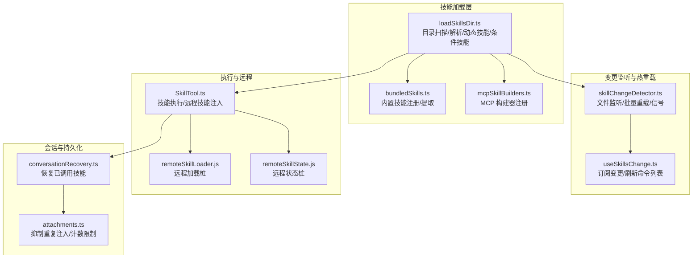
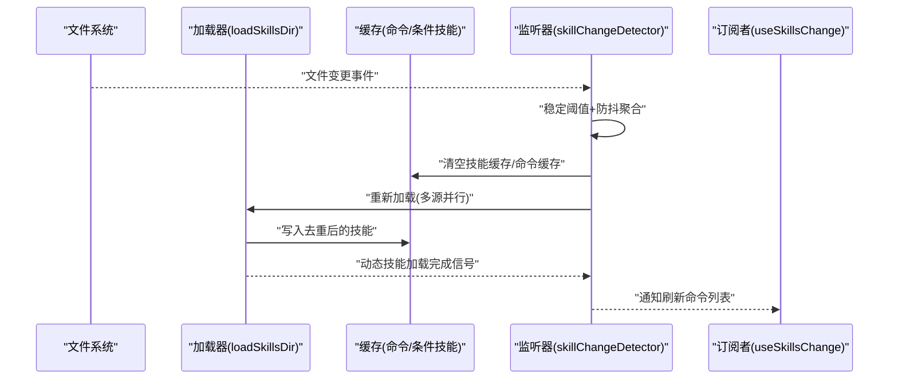
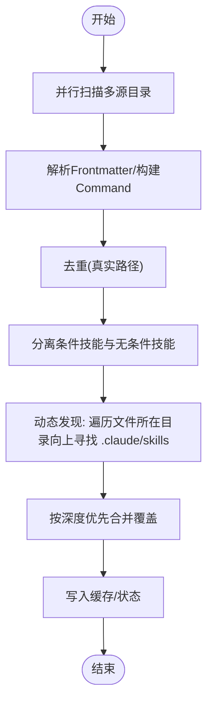
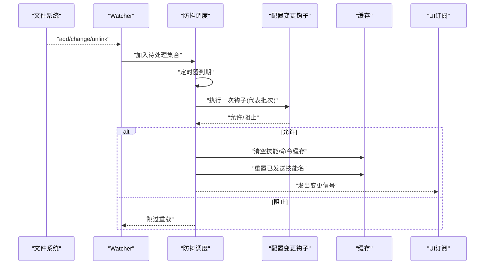
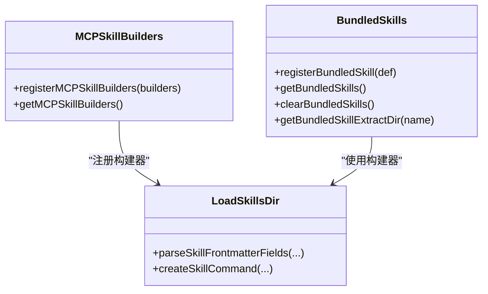
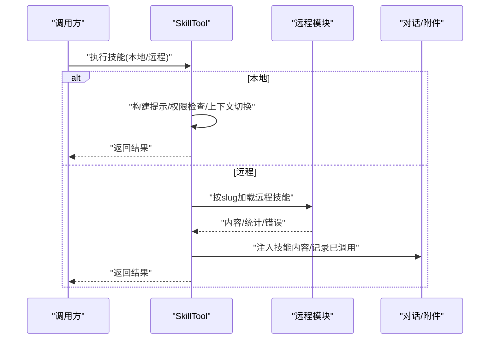
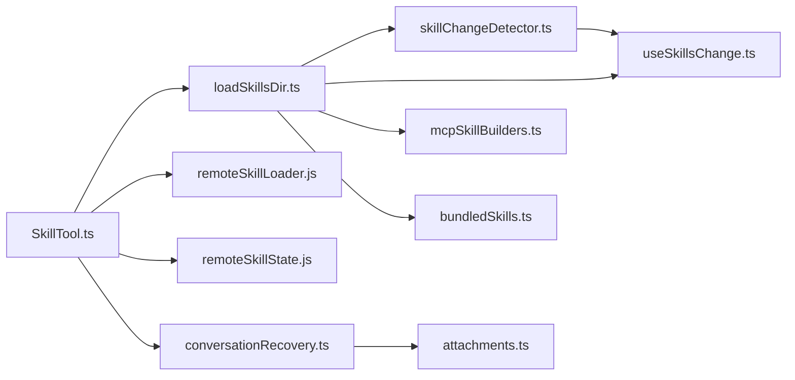

# 技能加载与管理

<cite>
**本文引用的文件**
- [loadSkillsDir.ts](file://src/skills/loadSkillsDir.ts)
- [skillChangeDetector.ts](file://src/utils/skills/skillChangeDetector.ts)
- [bundledSkills.ts](file://src/skills/bundledSkills.ts)
- [mcpSkillBuilders.ts](file://src/skills/mcpSkillBuilders.ts)
- [SkillTool.ts](file://src/tools/SkillTool/SkillTool.ts)
- [useSkillsChange.ts](file://src/hooks/useSkillsChange.ts)
- [conversationRecovery.ts](file://src/utils/conversationRecovery.ts)
- [attachments.ts](file://src/utils/attachments.ts)
- [remoteSkillLoader.js](file://services/skillSearch/remoteSkillLoader.js)
- [remoteSkillState.js](file://services/skillSearch/remoteSkillState.js)
</cite>

## 目录
1. [简介](#简介)
2. [项目结构](#项目结构)
3. [核心组件](#核心组件)
4. [架构总览](#架构总览)
5. [详细组件分析](#详细组件分析)
6. [依赖关系分析](#依赖关系分析)
7. [性能考量](#性能考量)
8. [故障排查指南](#故障排查指南)
9. [结论](#结论)
10. [附录](#附录)

## 简介
本文件系统性阐述 Claude Code 的“技能加载与管理”机制，覆盖以下关键主题：
- 技能目录扫描：从多源路径并行发现、去重与合并
- 文件解析与动态加载：Frontmatter 解析、命令对象构建、条件技能激活
- 缓存机制：内存缓存策略、失效与重建流程
- 技能管理器：注册、查找、更新、卸载（含动态技能）
- 依赖与冲突：路径匹配规则、优先级与覆盖
- 热重载与动态更新：文件变更检测、批量重载、事件通知
- 错误处理与异常恢复：容错策略、降级与日志
- 最佳实践与性能调优：配置建议、监控指标

## 项目结构
围绕技能加载与管理的关键模块如下：
- 技能加载与解析：src/skills/loadSkillsDir.ts
- 动态技能与条件技能：同上文件中的动态技能状态与条件技能集合
- 文件变更监听与热重载：src/utils/skills/skillChangeDetector.ts
- 内置/捆绑技能注册：src/skills/bundledSkills.ts
- MCP 技能构建器注册：src/skills/mcpSkillBuilders.ts
- 技能工具入口与远程技能：src/tools/SkillTool/SkillTool.ts
- 技能变更订阅与 UI 刷新：src/hooks/useSkillsChange.ts
- 会话恢复与已调用技能持久化：src/utils/conversationRecovery.ts、src/utils/attachments.ts
- 远程技能服务桩：services/skillSearch/remoteSkillLoader.js、services/skillSearch/remoteSkillState.js

**图表来源**
- [loadSkillsDir.ts](file://src/skills/loadSkillsDir.ts)
- [skillChangeDetector.ts](file://src/utils/skills/skillChangeDetector.ts)
- [bundledSkills.ts](file://src/skills/bundledSkills.ts)
- [mcpSkillBuilders.ts](file://src/skills/mcpSkillBuilders.ts)
- [SkillTool.ts](file://src/tools/SkillTool/SkillTool.ts)
- [useSkillsChange.ts](file://src/hooks/useSkillsChange.ts)
- [conversationRecovery.ts](file://src/utils/conversationRecovery.ts)
- [attachments.ts](file://src/utils/attachments.ts)
- [remoteSkillLoader.js](file://services/skillSearch/remoteSkillLoader.js)
- [remoteSkillState.js](file://services/skillSearch/remoteSkillState.js)

**章节来源**
- [loadSkillsDir.ts](file://src/skills/loadSkillsDir.ts)
- [skillChangeDetector.ts](file://src/utils/skills/skillChangeDetector.ts)
- [bundledSkills.ts](file://src/skills/bundledSkills.ts)
- [mcpSkillBuilders.ts](file://src/skills/mcpSkillBuilders.ts)
- [SkillTool.ts](file://src/tools/SkillTool/SkillTool.ts)
- [useSkillsChange.ts](file://src/hooks/useSkillsChange.ts)
- [conversationRecovery.ts](file://src/utils/conversationRecovery.ts)
- [attachments.ts](file://src/utils/attachments.ts)
- [remoteSkillLoader.js](file://services/skillSearch/remoteSkillLoader.js)
- [remoteSkillState.js](file://services/skillSearch/remoteSkillState.js)

## 核心组件
- 目录扫描与加载器：负责从策略设置、用户设置、项目设置、附加目录以及遗留 commands 目录并行加载，并进行去重、条件技能分离与缓存。
- 动态技能与条件技能：在运行时根据文件路径发现新的技能目录，按深度优先覆盖；条件技能通过 ignore 规则在文件操作时激活。
- 文件变更监听器：基于 chokidar 监听技能/命令目录，稳定阈值与防抖避免事件风暴，统一触发缓存清理与 UI 刷新。
- 内置/捆绑技能：在进程内注册，必要时惰性解压参考文件到安全目录，保持与磁盘技能一致的提示前缀契约。
- MCP 技能构建器：通过叶子模块注册两个关键函数，避免循环依赖与打包问题。
- 技能工具：封装本地/远程技能执行、权限判定、上下文切换、结果渲染与遥测。
- 会话恢复：从附件中恢复已调用技能，抑制重复注入，保障跨进程会话连续性。

**章节来源**
- [loadSkillsDir.ts](file://src/skills/loadSkillsDir.ts)
- [skillChangeDetector.ts](file://src/utils/skills/skillChangeDetector.ts)
- [bundledSkills.ts](file://src/skills/bundledSkills.ts)
- [mcpSkillBuilders.ts](file://src/skills/mcpSkillBuilders.ts)
- [SkillTool.ts](file://src/tools/SkillTool/SkillTool.ts)
- [useSkillsChange.ts](file://src/hooks/useSkillsChange.ts)
- [conversationRecovery.ts](file://src/utils/conversationRecovery.ts)
- [attachments.ts](file://src/utils/attachments.ts)

## 架构总览
技能加载与管理采用“分层 + 事件驱动”的架构：
- 加载层：多源并行扫描、解析与合并，输出统一的 Command 列表
- 状态层：动态技能映射、条件技能集合、已激活集合
- 监听层：文件系统变更检测与批量重载
- 执行层：技能工具封装执行、远程技能注入、权限与上下文
- 恢复层：会话恢复与附件交互，保证一致性

**图表来源**
- [skillChangeDetector.ts](file://src/utils/skills/skillChangeDetector.ts)
- [loadSkillsDir.ts](file://src/skills/loadSkillsDir.ts)
- [useSkillsChange.ts](file://src/hooks/useSkillsChange.ts)

## 详细组件分析

### 组件A：技能目录扫描与动态加载
职责与流程：
- 并行扫描策略设置、用户设置、项目设置、附加目录与遗留 commands 目录
- 去重：基于真实路径识别重复文件（符号链接/父目录重复）
- 条件技能：带 paths 前言的技能先暂存，待文件路径匹配后再激活
- 动态技能：根据文件路径向上遍历至工作目录，发现 .claude/skills 并加载，深者优先覆盖浅者
- 缓存：memoize 化主入口，配合显式 clear 清理

关键点：
- 目录格式要求：/skills/ 下仅支持 skill-name/SKILL.md 的目录格式
- 兼容 legacy /commands/：支持目录与单文件两种形式
- 路径匹配：条件技能使用 ignore 库，行为与 CLAUDE.md 一致
- 性能：并行读取、去重与条件技能分离，减少后续筛选成本

**图表来源**
- [loadSkillsDir.ts](file://src/skills/loadSkillsDir.ts)

**章节来源**
- [loadSkillsDir.ts](file://src/skills/loadSkillsDir.ts)

### 组件B：文件变更监听与热重载
职责与流程：
- 初始化：收集可监听路径（用户/项目/附加目录），创建 chokidar 监听器
- 变更处理：稳定阈值等待、原子写入检测、忽略 .git 与非文件类型
- 批量重载：防抖聚合多个变更，一次性执行配置变更钩子、清空缓存、重置已发送技能名、发出变更信号
- 订阅刷新：UI 层订阅后重新拉取命令列表

关键点：
- 针对 Bun 的死锁规避：在 Bun 环境下使用 stat() 轮询替代 FSWatcher
- 防抖时间与轮询间隔：平衡实时性与资源消耗
- 配置变更钩子：阻断型钩子可阻止重载，避免危险批量操作

**图表来源**
- [skillChangeDetector.ts](file://src/utils/skills/skillChangeDetector.ts)

**章节来源**
- [skillChangeDetector.ts](file://src/utils/skills/skillChangeDetector.ts)
- [useSkillsChange.ts](file://src/hooks/useSkillsChange.ts)

### 组件C：内置/捆绑技能与 MCP 技能构建器
职责与流程：
- 内置技能：在进程启动时注册，支持懒提取参考文件到安全目录，统一提示前缀契约
- MCP 技能：通过叶子模块注册 createSkillCommand 与 parseSkillFrontmatterFields，避免循环依赖与打包问题

关键点：
- 安全写入：使用 O_EXCL/O_NOFOLLOW 与严格权限，防止符号链接攻击
- 提示前缀：为磁盘技能与内置技能提供一致的 baseDir 契约
- 注册时机：在 loadSkillsDir 模块初始化时注册，确保 MCP 发现可用

**图表来源**
- [bundledSkills.ts](file://src/skills/bundledSkills.ts)
- [mcpSkillBuilders.ts](file://src/skills/mcpSkillBuilders.ts)
- [loadSkillsDir.ts](file://src/skills/loadSkillsDir.ts)

**章节来源**
- [bundledSkills.ts](file://src/skills/bundledSkills.ts)
- [mcpSkillBuilders.ts](file://src/skills/mcpSkillBuilders.ts)
- [loadSkillsDir.ts](file://src/skills/loadSkillsDir.ts)

### 组件D：技能工具与远程技能
职责与流程：
- 技能执行：fork 子代理执行或内联执行，支持模型与努力级别覆盖
- 权限与属性：仅允许白名单属性，其他属性需权限判定
- 远程技能：在特性开关下按 slug 从远程加载 SKILL.md 内容并注入对话，记录遥测

关键点：
- fork 执行：隔离上下文与预算，适合长耗时或高风险任务
- 远程加载：失败时记录遥测并抛出明确错误，避免静默失败
- 已调用技能：记录以供会话恢复与压缩保留

**图表来源**
- [SkillTool.ts](file://src/tools/SkillTool/SkillTool.ts)
- [remoteSkillLoader.js](file://services/skillSearch/remoteSkillLoader.js)
- [remoteSkillState.js](file://services/skillSearch/remoteSkillState.js)
- [conversationRecovery.ts](file://src/utils/conversationRecovery.ts)
- [attachments.ts](file://src/utils/attachments.ts)

**章节来源**
- [SkillTool.ts](file://src/tools/SkillTool/SkillTool.ts)
- [remoteSkillLoader.js](file://services/skillSearch/remoteSkillLoader.js)
- [remoteSkillState.js](file://services/skillSearch/remoteSkillState.js)
- [conversationRecovery.ts](file://src/utils/conversationRecovery.ts)
- [attachments.ts](file://src/utils/attachments.ts)

## 依赖关系分析
- 模块耦合：
  - loadSkillsDir.ts 依赖 frontmatter 解析、markdown 加载、设置与策略、缓存与信号等
  - skillChangeDetector.ts 依赖 loadSkillsDir 的缓存清理与信号，以及 hooks 执行
  - SkillTool.ts 依赖 commands 列表、权限判定、fork 上下文与远程模块
  - bundledSkills.ts 与 mcpSkillBuilders.ts 通过注册间接耦合到 loadSkillsDir
- 外部依赖：
  - chokidar：文件监听
  - ignore：条件技能路径匹配
  - lodash-es：去重与工具函数
- 循环依赖规避：
  - mcpSkillBuilders.ts 作为叶子模块，避免 loadSkillsDir 与 mcpSkills.ts 的直接循环

**图表来源**
- [loadSkillsDir.ts](file://src/skills/loadSkillsDir.ts)
- [skillChangeDetector.ts](file://src/utils/skills/skillChangeDetector.ts)
- [useSkillsChange.ts](file://src/hooks/useSkillsChange.ts)
- [mcpSkillBuilders.ts](file://src/skills/mcpSkillBuilders.ts)
- [bundledSkills.ts](file://src/skills/bundledSkills.ts)
- [SkillTool.ts](file://src/tools/SkillTool/SkillTool.ts)
- [remoteSkillLoader.js](file://services/skillSearch/remoteSkillLoader.js)
- [remoteSkillState.js](file://services/skillSearch/remoteSkillState.js)
- [conversationRecovery.ts](file://src/utils/conversationRecovery.ts)
- [attachments.ts](file://src/utils/attachments.ts)

**章节来源**
- [loadSkillsDir.ts](file://src/skills/loadSkillsDir.ts)
- [skillChangeDetector.ts](file://src/utils/skills/skillChangeDetector.ts)
- [SkillTool.ts](file://src/tools/SkillTool/SkillTool.ts)

## 性能考量
- 并行加载：多源目录并行扫描与解析，显著降低冷启动时间
- 缓存策略：主入口 memoize 化，配合显式 clear；动态技能加载后仅清理命令 memo 缓存，避免丢失新技能
- 防抖与批处理：文件变更防抖与批量重载，避免事件风暴导致的 CPU 占用与死锁风险
- 条件技能延迟激活：仅在匹配路径时激活，减少常驻内存与查询开销
- Bun 特化：在 Bun 环境下禁用 FSWatcher，改用 stat() 轮询，避免已知死锁
- I/O 优化：批量 mkdir 与安全写入，减少系统调用次数

[本节为通用性能讨论，无需特定文件来源]

## 故障排查指南
常见问题与定位方法：
- 技能未出现或被覆盖
  - 检查是否为目录格式（skill-name/SKILL.md），确认去重逻辑与深度优先覆盖
  - 查看条件技能是否因路径不匹配未激活
- 文件变更未生效
  - 确认监听路径是否存在且可访问
  - 检查防抖时间与稳定阈值是否过长
  - 若为 Bun 环境，确认轮询启用
- 权限/安全相关错误
  - 捆绑技能写入失败时会记录调试日志，检查目标目录权限与路径合法性
- 远程技能加载失败
  - 查看遥测日志中的错误字段，确认 URL 方案与网络可达性
- 会话恢复后技能缺失
  - 检查 invoked_skills 附件是否正确注入，确认抑制重复注入逻辑

**章节来源**
- [loadSkillsDir.ts](file://src/skills/loadSkillsDir.ts)
- [skillChangeDetector.ts](file://src/utils/skills/skillChangeDetector.ts)
- [bundledSkills.ts](file://src/skills/bundledSkills.ts)
- [SkillTool.ts](file://src/tools/SkillTool/SkillTool.ts)
- [conversationRecovery.ts](file://src/utils/conversationRecovery.ts)
- [attachments.ts](file://src/utils/attachments.ts)

## 结论
该体系通过“多源并行扫描 + 去重 + 条件激活 + 文件监听 + 批量重载”的组合，实现了高性能、可扩展且鲁棒的技能加载与管理。内置/捆绑技能与 MCP 构建器注册进一步增强了生态兼容性。配合会话恢复与遥测，整体具备良好的可观测性与可维护性。

[本节为总结，无需特定文件来源]

## 附录
- 最佳实践
  - 使用目录格式组织技能，避免单文件误用
  - 合理设置条件技能的 paths，缩小匹配范围
  - 在大仓库中启用 Bun 轮询监听，避免死锁
  - 对远程技能加载增加重试与降级策略
  - 使用特性开关渐进引入实验性能力
- 性能调优建议
  - 调整防抖与稳定阈值以适配团队编辑节奏
  - 控制条件技能数量，避免过多匹配导致激活成本上升
  - 合理拆分技能，避免单个技能过大影响提示长度估算与 token 预估

[本节为通用建议，无需特定文件来源]