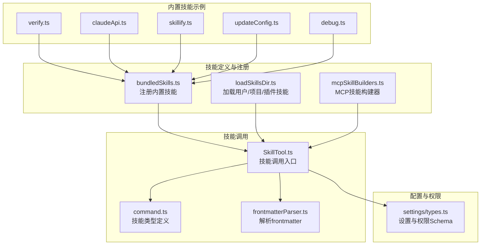
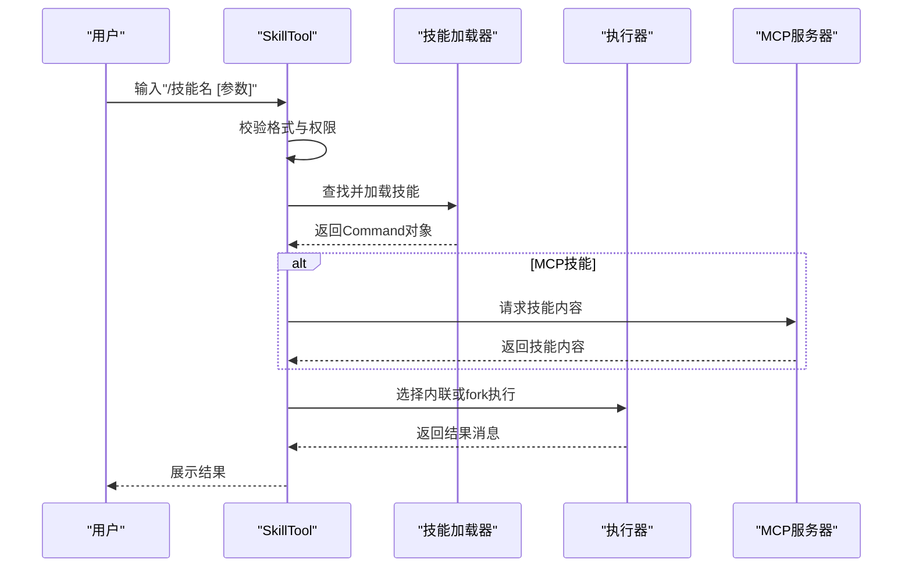
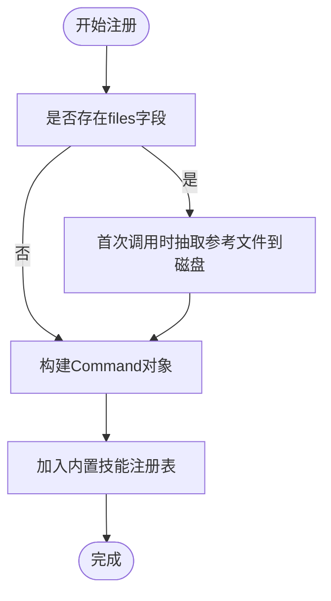
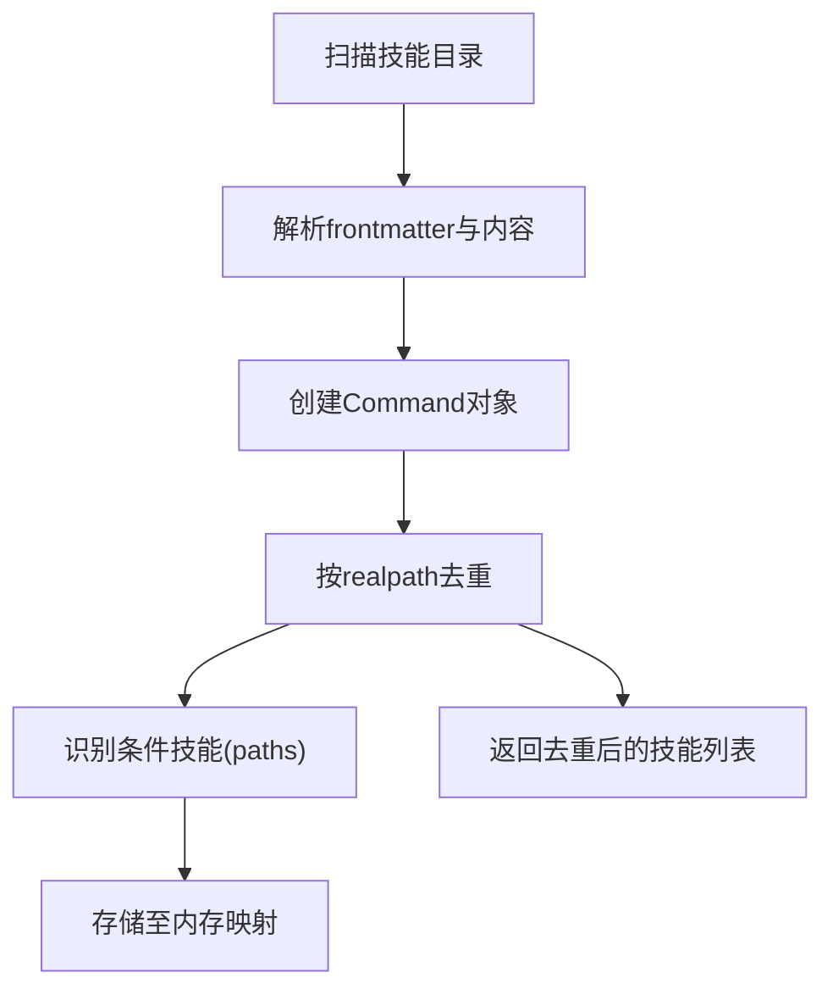
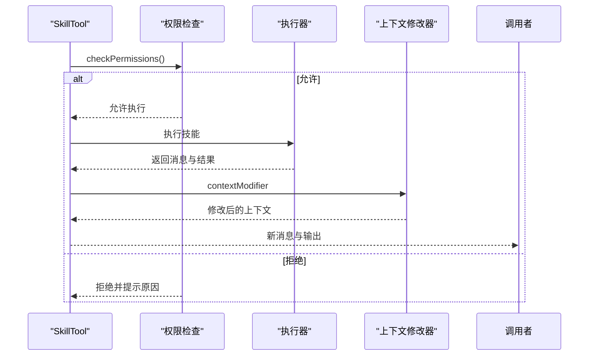
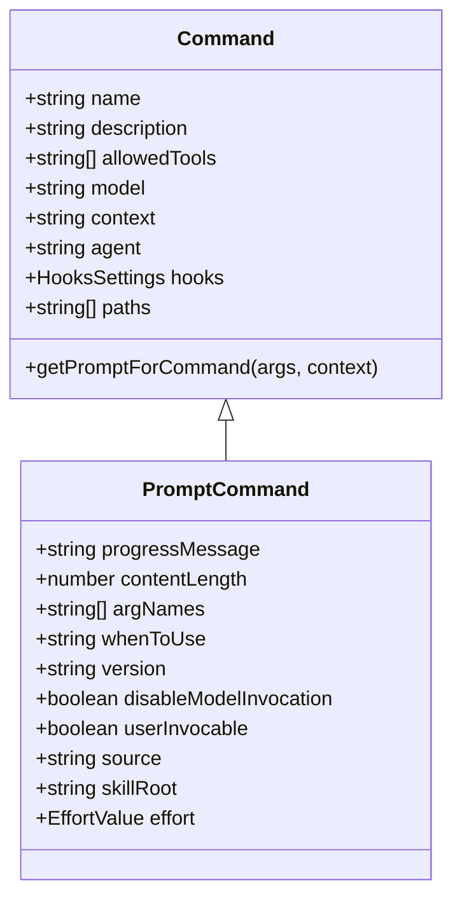
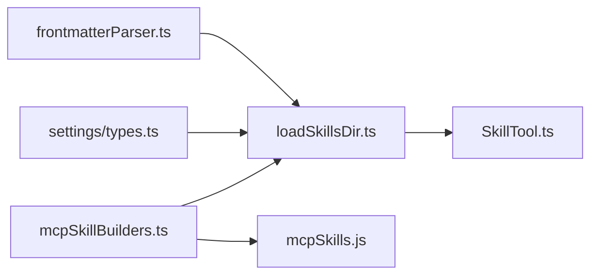

# 技能开发指南

<cite>
**本文档引用的文件**
- [README.md](file://README.md)
- [README_CN.md](file://README_CN.md)
- [bundledSkills.ts](file://src/skills/bundledSkills.ts)
- [loadSkillsDir.ts](file://src/skills/loadSkillsDir.ts)
- [mcpSkillBuilders.ts](file://src/skills/mcpSkillBuilders.ts)
- [SkillTool.ts](file://src/tools/SkillTool/SkillTool.ts)
- [command.ts](file://src/types/command.ts)
- [frontmatterParser.ts](file://src/utils/frontmatterParser.ts)
- [settings/types.ts](file://src/utils/settings/types.ts)
- [index.ts](file://src/skills/bundled/index.ts)
- [verify.ts](file://src/skills/bundled/verify.ts)
- [claudeApi.ts](file://src/skills/bundled/claudeApi.ts)
- [skillify.ts](file://src/skills/bundled/skillify.ts)
- [updateConfig.ts](file://src/skills/bundled/updateConfig.ts)
- [debug.ts](file://src/skills/bundled/debug.ts)
- [mcpSkills.js](file://skills/mcpSkills.js)
</cite>

## 目录
1. [简介](#简介)
2. [项目结构](#项目结构)
3. [核心组件](#核心组件)
4. [架构总览](#架构总览)
5. [详细组件分析](#详细组件分析)
6. [依赖关系分析](#依赖关系分析)
7. [性能考虑](#性能考虑)
8. [故障排查指南](#故障排查指南)
9. [结论](#结论)
10. [附录](#附录)

## 简介
本指南面向Claude Code技能开发者，提供从设计、实现到测试与发布的完整流程说明。文档基于仓库源码进行深入分析，重点涵盖：
- 技能的定义与注册机制（内置、用户目录、插件、MCP）
- 技能API的使用方法与接口规范
- 技能开发最佳实践（代码结构、权限控制、错误处理、性能优化）
- 测试策略与调试技巧
- 技能发布与版本管理、兼容性处理
- 与社区生态系统的集成方式（Marketplace、插件）

## 项目结构
Claude Code采用“命令即技能”的统一抽象，技能以Markdown文件（SKILL.md）形式定义，通过前端数据块（frontmatter）声明元信息，运行时由SkillTool触发执行。核心目录与文件如下：
- 技能注册与加载：src/skills/bundledSkills.ts、src/skills/loadSkillsDir.ts
- 技能调用入口：src/tools/SkillTool/SkillTool.ts
- 技能类型定义：src/types/command.ts
- 前端数据解析：src/utils/frontmatterParser.ts
- 设置与权限：src/utils/settings/types.ts
- 内置技能示例：src/skills/bundled/*.ts
- MCP技能支持：src/skills/mcpSkillBuilders.ts、skills/mcpSkills.js

**图表来源**
- [bundledSkills.ts:1-221](file://src/skills/bundledSkills.ts#L1-L221)
- [loadSkillsDir.ts:1-800](file://src/skills/loadSkillsDir.ts#L1-L800)
- [mcpSkillBuilders.ts:1-45](file://src/skills/mcpSkillBuilders.ts#L1-L45)
- [SkillTool.ts:1-800](file://src/tools/SkillTool/SkillTool.ts#L1-L800)
- [command.ts:1-217](file://src/types/command.ts#L1-L217)
- [frontmatterParser.ts:1-371](file://src/utils/frontmatterParser.ts#L1-L371)
- [settings/types.ts:1-800](file://src/utils/settings/types.ts#L1-L800)

**章节来源**
- [README.md:250-380](file://README.md#L250-L380)
- [README_CN.md:225-266](file://README_CN.md#L225-L266)

## 核心组件
- 技能定义与注册
  - 内置技能注册：registerBundledSkill()负责将技能注册到全局命令表，并支持首次调用时抽取参考文件到磁盘。
  - 用户/项目/插件技能加载：getSkillDirCommands()按优先级扫描多处目录，解析frontmatter，去重并构建Command对象。
  - MCP技能：通过mcpSkillBuilders.ts注册构建器，供MCP服务器动态发现与加载。

- 技能调用
  - SkillTool：校验技能名称、权限规则、是否允许模型直接调用；支持fork子代理执行与内联执行两种上下文；记录遥测与使用统计。

- 类型与Schema
  - Command：统一的技能/命令类型，支持prompt型、本地型、JSX型；包含allowedTools、model、context、hooks等字段。
  - Frontmatter：描述技能的元信息，如description、when_to_use、arguments、context、hooks等。
  - Settings：集中化的设置Schema，包含权限、MCP服务器、插件、hooks等配置。

**章节来源**
- [bundledSkills.ts:1-221](file://src/skills/bundledSkills.ts#L1-L221)
- [loadSkillsDir.ts:1-800](file://src/skills/loadSkillsDir.ts#L1-L800)
- [mcpSkillBuilders.ts:1-45](file://src/skills/mcpSkillBuilders.ts#L1-L45)
- [SkillTool.ts:1-800](file://src/tools/SkillTool/SkillTool.ts#L1-L800)
- [command.ts:1-217](file://src/types/command.ts#L1-L217)
- [frontmatterParser.ts:1-371](file://src/utils/frontmatterParser.ts#L1-L371)
- [settings/types.ts:1-800](file://src/utils/settings/types.ts#L1-L800)

## 架构总览
技能系统围绕“命令即技能”的理念构建，统一的Command抽象贯穿加载、权限、执行与展示环节。整体流程如下：

**图表来源**
- [SkillTool.ts:1-800](file://src/tools/SkillTool/SkillTool.ts#L1-L800)
- [loadSkillsDir.ts:1-800](file://src/skills/loadSkillsDir.ts#L1-L800)
- [mcpSkillBuilders.ts:1-45](file://src/skills/mcpSkillBuilders.ts#L1-L45)

## 详细组件分析

### 技能定义与注册（bundledSkills.ts）
- 技能定义结构
  - name、description、aliases、whenToUse、argumentHint、allowedTools、model、disableModelInvocation、userInvocable、isEnabled、hooks、context、agent、files等。
  - files字段支持在首次调用时将参考文件抽取到磁盘，便于后续Read/Grep操作。
- 注册与去重
  - registerBundledSkill()将技能加入内部数组；getBundledSkills()返回副本防止外部修改；clearBundledSkills()用于测试清理。
- 文件安全写入
  - 使用O_NOFOLLOW/O_EXCL策略与0o700/0o600权限，避免符号链接攻击与竞态写入。

**图表来源**
- [bundledSkills.ts:1-221](file://src/skills/bundledSkills.ts#L1-L221)

**章节来源**
- [bundledSkills.ts:1-221](file://src/skills/bundledSkills.ts#L1-L221)

### 技能加载与去重（loadSkillsDir.ts）
- 加载路径
  - 管理策略目录（managed）、用户目录（user）、项目目录（project）、额外目录（--add-dir）、遗留commands目录。
- 去重策略
  - 通过realpath解析真实路径，避免同源不同路径导致的重复加载。
- 条件技能
  - 支持paths frontmatter，仅在匹配文件被触碰时激活；存储在内存映射中等待触发。

**图表来源**
- [loadSkillsDir.ts:1-800](file://src/skills/loadSkillsDir.ts#L1-L800)

**章节来源**
- [loadSkillsDir.ts:1-800](file://src/skills/loadSkillsDir.ts#L1-L800)

### 技能调用入口（SkillTool.ts）
- 输入校验
  - 去除前导斜杠、校验技能存在性、禁止模型直接调用的技能、确保为prompt型技能。
- 权限决策
  - 支持deny/allow规则匹配、前缀通配符、自动允许仅使用安全属性的技能、建议添加规则。
- 执行策略
  - fork子代理执行（独立上下文与预算）与内联执行（扩展当前对话）。
- 遥测与追踪
  - 记录调用来源、父代理ID、插件市场信息、是否被发现等。

**图表来源**
- [SkillTool.ts:1-800](file://src/tools/SkillTool/SkillTool.ts#L1-L800)

**章节来源**
- [SkillTool.ts:1-800](file://src/tools/SkillTool/SkillTool.ts#L1-L800)

### 技能类型与Schema（command.ts、frontmatterParser.ts、settings/types.ts）
- Command类型
  - type区分prompt/local/local-jsx；prompt型包含allowedTools、model、context、agent、hooks、paths等。
- Frontmatter字段
  - description、when_to_use、arguments、argument-hint、context、agent、hooks、paths、shell等。
- 设置Schema
  - 权限（allow/deny/ask/defaultMode）、MCP服务器（allow/deny）、插件、hooks、环境变量、输出样式等。

**图表来源**
- [command.ts:1-217](file://src/types/command.ts#L1-L217)
- [frontmatterParser.ts:1-371](file://src/utils/frontmatterParser.ts#L1-L371)
- [settings/types.ts:1-800](file://src/utils/settings/types.ts#L1-L800)

**章节来源**
- [command.ts:1-217](file://src/types/command.ts#L1-L217)
- [frontmatterParser.ts:1-371](file://src/utils/frontmatterParser.ts#L1-L371)
- [settings/types.ts:1-800](file://src/utils/settings/types.ts#L1-L800)

### 内置技能示例
- verify：员工专用，加载验证相关参考文件，支持追加用户请求。
- claude-api：根据项目语言动态注入相应文档，支持多语言与共享文档。
- skillify：引导用户将可复用流程封装为技能，支持AskUserQuestion交互。
- update-config：指导用户通过编辑settings.json配置系统行为，包含hooks配置与验证流程。
- debug：启用/读取调试日志，帮助诊断问题。

**章节来源**
- [verify.ts:1-31](file://src/skills/bundled/verify.ts#L1-L31)
- [claudeApi.ts:1-197](file://src/skills/bundled/claudeApi.ts#L1-L197)
- [skillify.ts:1-198](file://src/skills/bundled/skillify.ts#L1-L198)
- [updateConfig.ts:1-476](file://src/skills/bundled/updateConfig.ts#L1-L476)
- [debug.ts:1-104](file://src/skills/bundled/debug.ts#L1-L104)

## 依赖关系分析
- 技能加载依赖
  - loadSkillsDir.ts依赖frontmatterParser.ts解析元信息，依赖settings/types.ts读取设置与权限。
- 技能调用依赖
  - SkillTool.ts依赖commands.ts查找命令、权限系统、遥测与插件标识。
- MCP技能依赖
  - mcpSkillBuilders.ts作为依赖图叶子节点，避免循环依赖，供mcpSkills.ts与loadSkillsDir.ts共同使用。

**图表来源**
- [loadSkillsDir.ts:1-800](file://src/skills/loadSkillsDir.ts#L1-L800)
- [SkillTool.ts:1-800](file://src/tools/SkillTool/SkillTool.ts#L1-L800)
- [mcpSkillBuilders.ts:1-45](file://src/skills/mcpSkillBuilders.ts#L1-L45)
- [mcpSkills.js:1-4](file://skills/mcpSkills.js#L1-L4)

**章节来源**
- [loadSkillsDir.ts:1-800](file://src/skills/loadSkillsDir.ts#L1-L800)
- [SkillTool.ts:1-800](file://src/tools/SkillTool/SkillTool.ts#L1-L800)
- [mcpSkillBuilders.ts:1-45](file://src/skills/mcpSkillBuilders.ts#L1-L45)
- [mcpSkills.js:1-4](file://skills/mcpSkills.js#L1-L4)

## 性能考虑
- 技能加载
  - 使用realpath去重，避免重复解析同一文件；支持--bare模式仅加载显式路径，减少IO开销。
- 技能执行
  - fork执行隔离上下文与预算，避免长耗时任务影响主会话；内联执行适合短小、即时的任务。
- 前端数据解析
  - frontmatter解析对特殊字符进行转义与括号展开，提升复杂glob模式的稳定性。
- 设置与权限
  - 权限规则按工具维度匹配，支持前缀通配符，减少不必要的交互提示。

[本节为通用指导，无需特定文件引用]

## 故障排查指南
- 技能未显示
  - 检查frontmatter中的user-invocable与disableModelInvocation设置；确认技能路径与权限。
- 权限被拒绝
  - 使用建议的规则添加allow/deny条目；检查allow/deny/ask规则与默认模式。
- MCP技能不可用
  - 确认MCP服务器已正确配置与授权；检查mcpSkillBuilders.ts注册状态。
- 调试日志
  - 使用/debug技能启用/读取调试日志，定位ERROR/WARN与异常堆栈。

**章节来源**
- [SkillTool.ts:1-800](file://src/tools/SkillTool/SkillTool.ts#L1-L800)
- [loadSkillsDir.ts:1-800](file://src/skills/loadSkillsDir.ts#L1-L800)
- [debug.ts:1-104](file://src/skills/bundled/debug.ts#L1-L104)

## 结论
Claude Code的技能系统以统一的Command抽象为核心，结合严格的权限控制、灵活的执行上下文与完善的遥测追踪，为开发者提供了强大的可扩展能力。遵循本文档的设计与实现规范，可以高效地创建高质量的技能，并与社区生态系统无缝集成。

[本节为总结，无需特定文件引用]

## 附录

### 技能开发流程
- 设计阶段
  - 明确技能目标、触发条件、输入参数与成功标准；编写when_to_use与arguments。
- 实现阶段
  - 创建SKILL.md，填写frontmatter与正文；必要时使用files字段提供参考文件。
  - 如需交互，使用AskUserQuestion工具引导用户输入。
- 集成阶段
  - 将技能放置于~/.claude/skills或项目.clau/de/skills目录；确保权限与hooks配置正确。
- 测试阶段
  - 使用/update-config与/debug技能辅助验证；在不同上下文中测试fork与内联执行。
- 发布阶段
  - 将技能提交至Marketplace或团队仓库；维护version与when_to_use说明。

**章节来源**
- [updateConfig.ts:1-476](file://src/skills/bundled/updateConfig.ts#L1-L476)
- [debug.ts:1-104](file://src/skills/bundled/debug.ts#L1-L104)
- [frontmatterParser.ts:1-371](file://src/utils/frontmatterParser.ts#L1-L371)

### 接口规范与最佳实践
- 接口规范
  - Command类型：统一的技能/命令抽象；PromptCommand支持allowedTools、model、context、hooks、paths等。
  - Frontmatter字段：description、when_to_use、arguments、argument-hint、context、agent、hooks、paths、shell。
  - Settings Schema：权限、MCP服务器、插件、hooks、环境变量等。
- 最佳实践
  - 使用清晰的when_to_use与arguments；合理设置context（fork适合自包含任务）。
  - 严格控制allowedTools，最小权限原则；使用hooks进行自动化与审计。
  - 对复杂glob模式进行转义与括号展开；避免路径逃逸。
  - 使用内置技能作为参考（verify、claude-api、skillify、update-config、debug）。

**章节来源**
- [command.ts:1-217](file://src/types/command.ts#L1-L217)
- [frontmatterParser.ts:1-371](file://src/utils/frontmatterParser.ts#L1-L371)
- [settings/types.ts:1-800](file://src/utils/settings/types.ts#L1-L800)
- [verify.ts:1-31](file://src/skills/bundled/verify.ts#L1-L31)
- [claudeApi.ts:1-197](file://src/skills/bundled/claudeApi.ts#L1-L197)
- [skillify.ts:1-198](file://src/skills/bundled/skillify.ts#L1-L198)
- [updateConfig.ts:1-476](file://src/skills/bundled/updateConfig.ts#L1-L476)
- [debug.ts:1-104](file://src/skills/bundled/debug.ts#L1-L104)

### 版本管理与兼容性
- 向后兼容
  - Settings Schema支持新增可选字段与枚举值扩展；类型转换与passthrough保留未知字段。
- 版本标注
  - 在frontmatter中设置version字段；在SKILL.md中维护变更说明。
- 兼容性处理
  - 使用feature()门控实验性功能；在发布构建中死代码消除未启用的功能。

**章节来源**
- [settings/types.ts:210-241](file://src/utils/settings/types.ts#L210-L241)
- [README.md:780-800](file://README.md#L780-L800)

### 社区生态系统集成
- Marketplace
  - 通过enabledPlugins与extraKnownMarketplaces配置市场源；严格/阻断列表控制来源。
- 插件
  - 以plugin@marketplace格式启用插件；支持版本约束与用户配置。
- MCP
  - 允许/阻断列表控制MCP服务器；支持URL模式与命令数组匹配。

**章节来源**
- [settings/types.ts:558-622](file://src/utils/settings/types.ts#L558-L622)
- [settings/types.ts:601-622](file://src/utils/settings/types.ts#L601-L622)