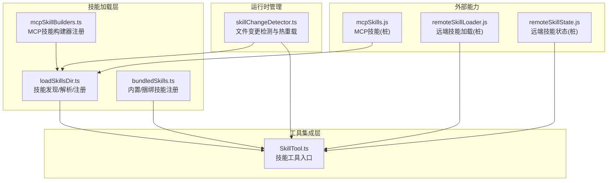
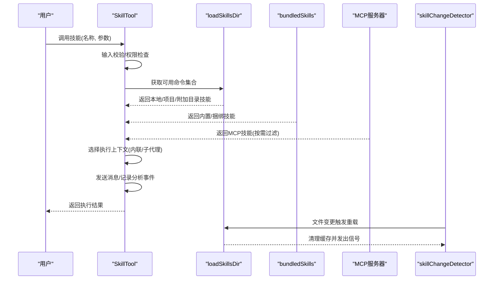
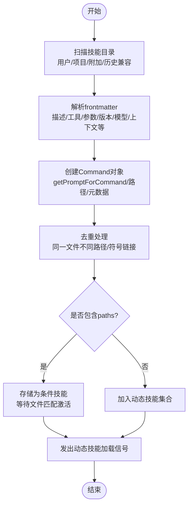
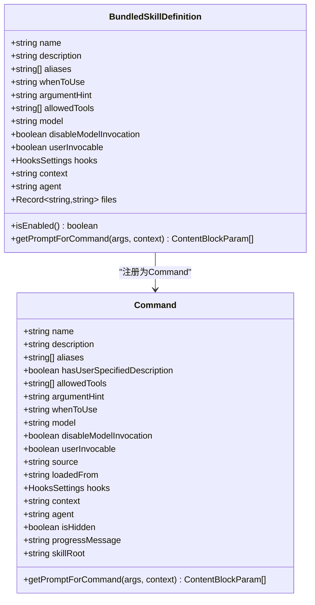
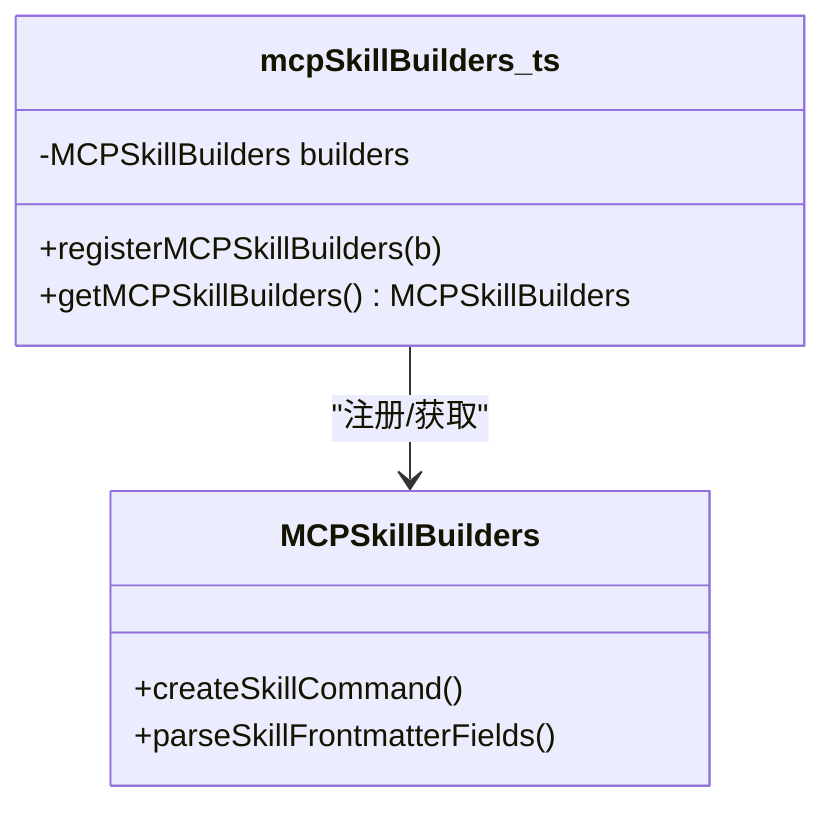
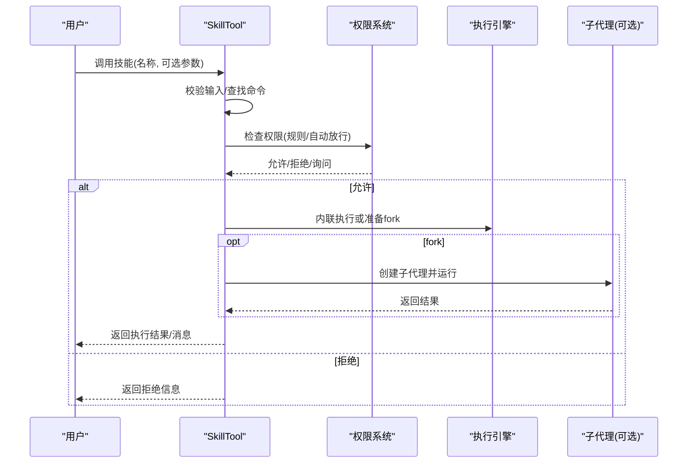
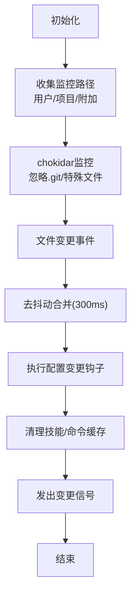

# 技能架构设计

<cite>
**本文档引用的文件**
- [loadSkillsDir.ts](file://src/skills/loadSkillsDir.ts)
- [bundledSkills.ts](file://src/skills/bundledSkills.ts)
- [mcpSkillBuilders.ts](file://src/skills/mcpSkillBuilders.ts)
- [SkillTool.ts](file://src/tools/SkillTool/SkillTool.ts)
- [skillChangeDetector.ts](file://src/utils/skills/skillChangeDetector.ts)
- [remoteSkillLoader.js](file://services/skillSearch/remoteSkillLoader.js)
- [remoteSkillState.js](file://services/skillSearch/remoteSkillState.js)
- [mcpSkills.js](file://skills/mcpSkills.js)
</cite>

## 目录
1. [简介](#简介)
2. [项目结构](#项目结构)
3. [核心组件](#核心组件)
4. [架构总览](#架构总览)
5. [详细组件分析](#详细组件分析)
6. [依赖关系分析](#依赖关系分析)
7. [性能考虑](#性能考虑)
8. [故障排除指南](#故障排除指南)
9. [结论](#结论)

## 简介
本文件面向Claude Code技能架构，系统阐述技能系统的定义、组织与管理机制，技能加载器的发现、解析与注册流程，技能与工具系统的集成方式，以及技能的生命周期管理（加载、激活、停用、卸载）。文档还解释了技能系统的模块化设计与可扩展性，并通过类图与流程图展示组件间的依赖关系与交互模式。

## 项目结构
技能系统围绕以下关键模块构建：
- 技能加载与发现：负责从用户目录、项目目录、附加目录及历史兼容路径中发现并加载技能，解析frontmatter元数据，生成Command对象。
- 内置/捆绑技能：在CLI二进制中预置的技能，按需提取参考文件到磁盘，统一接口与Command类型。
- MCP技能构建器：为MCP服务器发现提供安全的函数注册点，避免循环依赖。
- 技能工具（SkillTool）：对外暴露的工具接口，用于验证、权限检查、执行技能（含内联与子代理派生两种执行上下文）。
- 技能变更检测：基于文件系统监控，实现动态技能的热重载与缓存清理。
- 远程技能服务：实验性能力，支持从远端源发现与加载技能（当前为桩模块）。



**图表来源**
- [loadSkillsDir.ts](file://src/skills/loadSkillsDir.ts)
- [bundledSkills.ts](file://src/skills/bundledSkills.ts)
- [mcpSkillBuilders.ts](file://src/skills/mcpSkillBuilders.ts)
- [SkillTool.ts](file://src/tools/SkillTool/SkillTool.ts)
- [skillChangeDetector.ts](file://src/utils/skills/skillChangeDetector.ts)
- [remoteSkillLoader.js](file://services/skillSearch/remoteSkillLoader.js)
- [remoteSkillState.js](file://services/skillSearch/remoteSkillState.js)
- [mcpSkills.js](file://skills/mcpSkills.js)

**章节来源**
- [loadSkillsDir.ts](file://src/skills/loadSkillsDir.ts)
- [bundledSkills.ts](file://src/skills/bundledSkills.ts)
- [mcpSkillBuilders.ts](file://src/skills/mcpSkillBuilders.ts)
- [SkillTool.ts](file://src/tools/SkillTool/SkillTool.ts)
- [skillChangeDetector.ts](file://src/utils/skills/skillChangeDetector.ts)
- [remoteSkillLoader.js](file://services/skillSearch/remoteSkillLoader.js)
- [remoteSkillState.js](file://services/skillSearch/remoteSkillState.js)
- [mcpSkills.js](file://skills/mcpSkills.js)

## 核心组件
- 技能加载器（loadSkillsDir.ts）
  - 负责扫描用户/项目/附加目录，解析frontmatter，生成Command对象；支持条件技能（paths）延迟激活；提供动态技能监听信号。
- 内置/捆绑技能（bundledSkills.ts）
  - 注册编译期内置技能，按需提取参考文件至磁盘，统一Command接口。
- MCP技能构建器（mcpSkillBuilders.ts）
  - 提供仅一次的构建器注册，避免模块循环依赖，供MCP发现使用。
- 技能工具（SkillTool.ts）
  - 对外工具入口，负责输入校验、权限决策、执行策略选择（内联或子代理）、消息注入与结果返回。
- 技能变更检测（skillChangeDetector.ts）
  - 基于chokidar监控技能文件变化，去抖动批量重载，清理缓存并通知订阅者。
- 远程技能服务（remoteSkillLoader.js、remoteSkillState.js、mcpSkills.js）
  - 当前为桩模块，预留实验性远程技能发现与加载能力。

**章节来源**
- [loadSkillsDir.ts](file://src/skills/loadSkillsDir.ts)
- [bundledSkills.ts](file://src/skills/bundledSkills.ts)
- [mcpSkillBuilders.ts](file://src/skills/mcpSkillBuilders.ts)
- [SkillTool.ts](file://src/tools/SkillTool/SkillTool.ts)
- [skillChangeDetector.ts](file://src/utils/skills/skillChangeDetector.ts)
- [remoteSkillLoader.js](file://services/skillSearch/remoteSkillLoader.js)
- [remoteSkillState.js](file://services/skillSearch/remoteSkillState.js)
- [mcpSkills.js](file://skills/mcpSkills.js)

## 架构总览
技能系统采用“多源发现 + 统一Command模型 + 工具桥接”的分层架构：
- 多源发现：用户技能、项目技能、附加目录技能、历史兼容commands目录、MCP服务器技能。
- 元数据解析：统一解析frontmatter字段，生成标准化Command对象。
- 执行策略：根据技能配置选择内联执行或派生子代理执行，确保资源隔离与可观测性。
- 生命周期：加载（静态/动态）、激活（条件技能匹配）、停用（移除条件映射）、卸载（清理状态）。
- 集成点：SkillTool作为统一入口，与权限系统、消息流、分析埋点、MCP生态深度集成。



**图表来源**
- [SkillTool.ts](file://src/tools/SkillTool/SkillTool.ts)
- [loadSkillsDir.ts](file://src/skills/loadSkillsDir.ts)
- [bundledSkills.ts](file://src/skills/bundledSkills.ts)
- [skillChangeDetector.ts](file://src/utils/skills/skillChangeDetector.ts)

## 详细组件分析

### 技能加载器（loadSkillsDir.ts）
职责与特性：
- 目录扫描：用户技能、托管技能、项目技能、附加目录技能、历史兼容commands目录。
- 前体解析：统一解析frontmatter字段（描述、工具白名单、参数提示、版本、模型、是否禁用模型调用、用户可调用性、钩子、执行上下文、代理、努力度、shell等）。
- 命令生成：创建标准化Command对象，支持参数替换、会话变量替换、shell命令执行（MCP场景禁用）。
- 条件技能：基于paths frontmatter进行gitignore风格匹配，按需激活并加入动态技能集合。
- 动态监听：提供动态技能加载信号，供其他模块清理缓存与重建索引。



**图表来源**
- [loadSkillsDir.ts](file://src/skills/loadSkillsDir.ts)

**章节来源**
- [loadSkillsDir.ts](file://src/skills/loadSkillsDir.ts)

### 内置/捆绑技能（bundledSkills.ts）
职责与特性：
- 定义内置技能的注册接口，支持一次性注册、获取与清空。
- 支持在首次调用时提取参考文件到磁盘，以便模型按需读取。
- 统一Command接口，包含启用条件、钩子、执行上下文、代理等属性。



**图表来源**
- [bundledSkills.ts](file://src/skills/bundledSkills.ts)

**章节来源**
- [bundledSkills.ts](file://src/skills/bundledSkills.ts)

### MCP技能构建器（mcpSkillBuilders.ts）
职责与特性：
- 以叶子模块形式注册两个核心函数（创建Command与解析frontmatter），避免循环依赖。
- 在模块初始化时完成注册，确保MCP连接前即可被发现。



**图表来源**
- [mcpSkillBuilders.ts](file://src/skills/mcpSkillBuilders.ts)

**章节来源**
- [mcpSkillBuilders.ts](file://src/skills/mcpSkillBuilders.ts)

### 技能工具（SkillTool.ts）
职责与特性：
- 输入校验：去除前导斜杠、检查技能存在性、是否允许模型调用、是否为prompt型技能。
- 权限检查：支持显式规则（精确/前缀匹配）、自动放行安全属性技能、建议添加规则。
- 执行策略：若配置为fork则派生子代理执行；否则内联执行，注入消息并返回结果。
- 分析埋点：记录技能调用、来源、插件信息、查询深度等指标。
- 远程技能：实验性支持远程规范技能（ant用户），拦截_canonical_前缀并直接加载内容。



**图表来源**
- [SkillTool.ts](file://src/tools/SkillTool/SkillTool.ts)

**章节来源**
- [SkillTool.ts](file://src/tools/SkillTool/SkillTool.ts)

### 技能变更检测（skillChangeDetector.ts）
职责与特性：
- 初始化：注册动态技能加载回调、收集可监控路径（用户/项目/附加目录）。
- 监控：基于chokidar监控文件变化，忽略.git与特殊设备文件，使用轮询避免Bun死锁。
- 去抖动：对批量变更进行去抖动合并，防止事件风暴导致事件循环阻塞。
- 重载：执行配置变更钩子后清理技能与命令缓存，发出变更信号。



**图表来源**
- [skillChangeDetector.ts](file://src/utils/skills/skillChangeDetector.ts)

**章节来源**
- [skillChangeDetector.ts](file://src/utils/skills/skillChangeDetector.ts)

### 远程技能服务（remoteSkillLoader.js、remoteSkillState.js、mcpSkills.js）
职责与特性：
- 当前为桩模块，预留实验性远程技能发现与加载能力。
- 与SkillTool中的实验性功能配合，支持_canonical_前缀的远程技能识别与加载。

**章节来源**
- [remoteSkillLoader.js](file://services/skillSearch/remoteSkillLoader.js)
- [remoteSkillState.js](file://services/skillSearch/remoteSkillState.js)
- [mcpSkills.js](file://skills/mcpSkills.js)

## 依赖关系分析
- 模块耦合
  - loadSkillsDir.ts与mcpSkillBuilders.ts通过叶子模块解耦，避免循环依赖。
  - SkillTool.ts依赖命令集合（本地/项目/附加/MCP），并通过权限系统与分析埋点集成。
  - skillChangeDetector.ts与loadSkillsDir.ts通过信号与缓存清理协作，实现动态热重载。
- 外部依赖
  - chokidar用于文件监控，ignore用于路径匹配，lodash-es.memoize用于缓存优化。
- 循环依赖规避
  - 通过mcpSkillBuilders.ts作为中间层，使MCP发现无需直接导入loadSkillsDir.ts的实现细节。

```mermaid
graph LR
A["loadSkillsDir.ts"] <- --> B["mcpSkillBuilders.ts"]
A --> C["SkillTool.ts"]
C --> D["权限系统/分析埋点"]
E["skillChangeDetector.ts"] --> A
E --> C
F["remoteSkillLoader.js"] --> C
G["remoteSkillState.js"] --> C
H["mcpSkills.js"] --> A
```

**图表来源**
- [loadSkillsDir.ts](file://src/skills/loadSkillsDir.ts)
- [mcpSkillBuilders.ts](file://src/skills/mcpSkillBuilders.ts)
- [SkillTool.ts](file://src/tools/SkillTool/SkillTool.ts)
- [skillChangeDetector.ts](file://src/utils/skills/skillChangeDetector.ts)
- [remoteSkillLoader.js](file://services/skillSearch/remoteSkillLoader.js)
- [remoteSkillState.js](file://services/skillSearch/remoteSkillState.js)
- [mcpSkills.js](file://skills/mcpSkills.js)

**章节来源**
- [loadSkillsDir.ts](file://src/skills/loadSkillsDir.ts)
- [mcpSkillBuilders.ts](file://src/skills/mcpSkillBuilders.ts)
- [SkillTool.ts](file://src/tools/SkillTool/SkillTool.ts)
- [skillChangeDetector.ts](file://src/utils/skills/skillChangeDetector.ts)
- [remoteSkillLoader.js](file://services/skillSearch/remoteSkillLoader.js)
- [remoteSkillState.js](file://services/skillSearch/remoteSkillState.js)
- [mcpSkills.js](file://skills/mcpSkills.js)

## 性能考虑
- 缓存与去重
  - 使用memoize缓存命令解析结果，减少重复计算。
  - 基于realpath去重同一文件的不同路径访问，避免重复加载。
- 并发与批处理
  - 目录扫描与文件读取并行化，批量处理文件变更事件，降低I/O压力。
- 执行上下文
  - fork执行上下文隔离资源与内存，避免长时间占用主进程。
- 监控策略
  - chokidar轮询间隔默认2秒，平衡延迟与CPU开销；Bun环境下强制轮询避免死锁。

[本节为通用性能讨论，不直接分析具体文件]

## 故障排除指南
- 技能未显示
  - 检查技能文件命名与目录格式（skill-name/SKILL.md），确认frontmatter字段有效。
  - 确认未被权限规则阻止，或尝试添加允许规则。
- 权限被拒绝
  - 查看权限系统日志，确认是否存在deny规则或需要用户确认。
  - 对于仅使用安全属性的技能，系统会自动放行。
- 执行失败
  - 检查技能是否禁用模型调用（disable-model-invocation），该场景下仅用户可触发。
  - 若为MCP技能，确认服务器已连接且技能已正确注册。
- 热重载无效
  - 确认文件监控初始化成功，路径可访问且非.git目录。
  - 观察去抖动时间（300ms），避免频繁写入导致的重载风暴。

**章节来源**
- [SkillTool.ts](file://src/tools/SkillTool/SkillTool.ts)
- [skillChangeDetector.ts](file://src/utils/skills/skillChangeDetector.ts)

## 结论
Claude Code技能架构通过“多源发现 + 统一Command模型 + 工具桥接 + 文件监控热重载”的设计，实现了高可扩展性与强集成性。技能加载器负责严谨的解析与注册，内置/捆绑技能提供即用能力，MCP构建器保障生态扩展，SkillTool提供一致的调用体验，而变更检测确保动态场景下的稳定性。该架构为后续远程技能、插件市场与更复杂的工具链集成奠定了坚实基础。