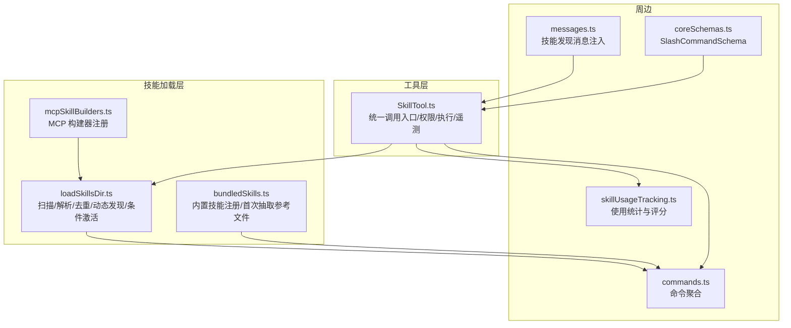
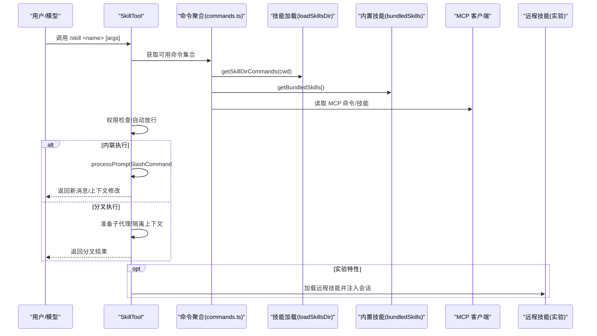
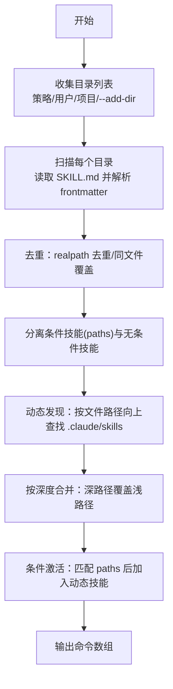
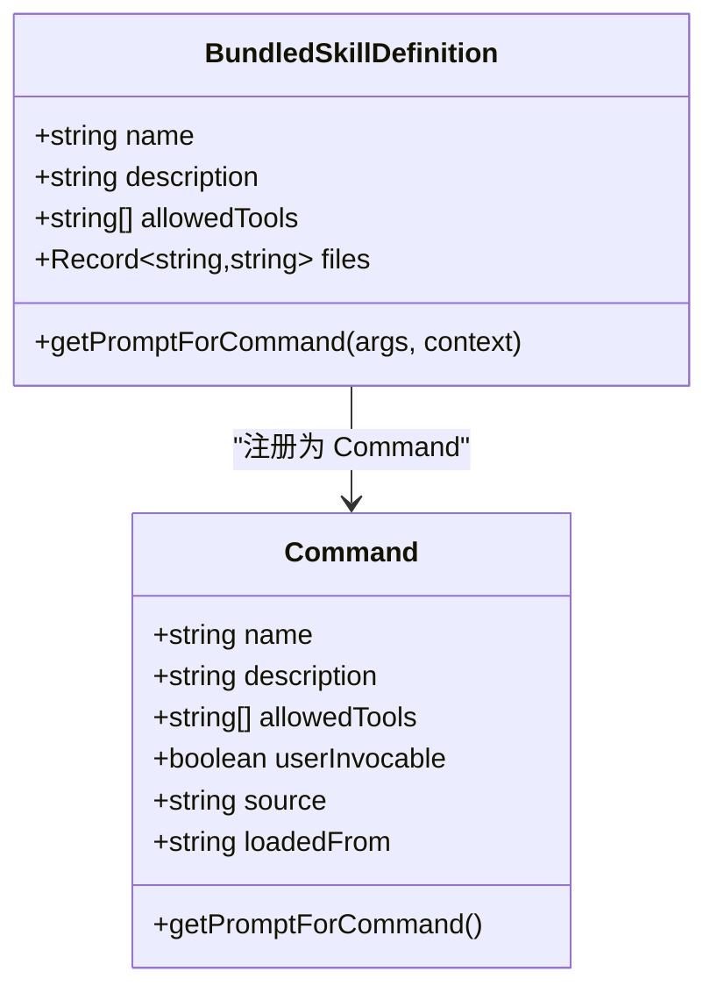
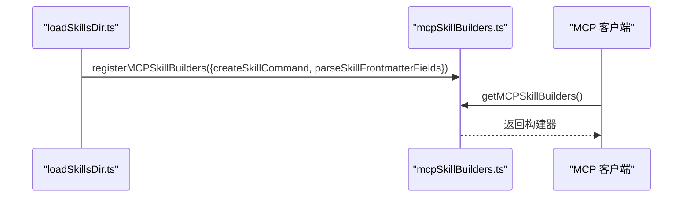
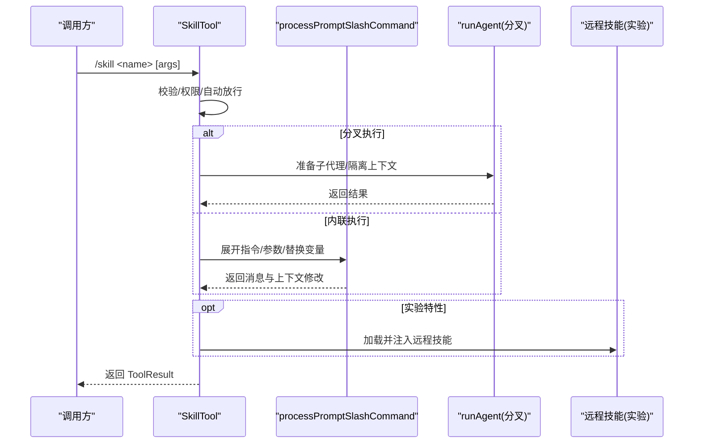
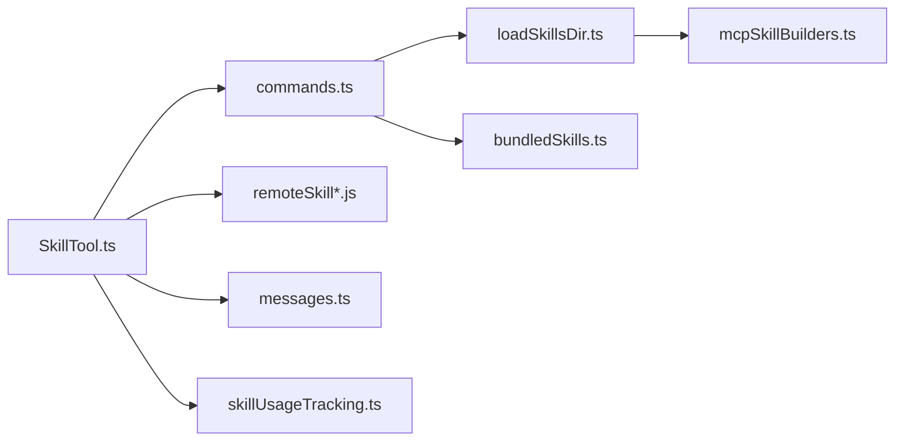

# 技能系统

<cite>
**本文引用的文件**
- [loadSkillsDir.ts](file://src/skills/loadSkillsDir.ts)
- [bundledSkills.ts](file://src/skills/bundledSkills.ts)
- [mcpSkillBuilders.ts](file://src/skills/mcpSkillBuilders.ts)
- [SkillTool.ts](file://src/tools/SkillTool/SkillTool.ts)
- [index.ts](file://src/commands/skills/index.ts)
- [messages.ts](file://src/utils/messages.ts)
- [coreSchemas.ts](file://src/entrypoints/sdk/coreSchemas.ts)
- [commands.ts](file://src/commands.ts)
- [skillUsageTracking.ts](file://src/utils/suggestions/skillUsageTracking.ts)
- [remoteSkillLoader.js](file://services/skillSearch/remoteSkillLoader.js)
- [remoteSkillState.js](file://services/skillSearch/remoteSkillState.js)
- [telemetry.js](file://services/skillSearch/telemetry.js)
- [featureCheck.js](file://services/skillSearch/featureCheck.js)
- [mcpSkills.js](file://skills/mcpSkills.js)
</cite>

## 目录
1. [简介](#简介)
2. [项目结构](#项目结构)
3. [核心组件](#核心组件)
4. [架构总览](#架构总览)
5. [详细组件分析](#详细组件分析)
6. [依赖关系分析](#依赖关系分析)
7. [性能考量](#性能考量)
8. [故障排查指南](#故障排查指南)
9. [结论](#结论)
10. [附录](#附录)

## 简介
本文件系统性阐述 Claude Code 的“技能”（Skill）体系：从设计原理到实现机制，覆盖技能发现、加载、缓存、权限与安全、内置技能、扩展开发、MCP 集成、配置与自定义、以及与工具系统的协同。目标是帮助开发者与高级用户理解并高效使用与扩展技能系统。

## 项目结构
技能系统主要由以下模块构成：
- 技能加载与发现：负责扫描本地/项目/策略目录、解析 frontmatter、构建命令对象、动态发现与条件激活。
- 内置技能注册：在启动时注册随 CLI 分发的内置技能，并支持首次调用时抽取参考文件到磁盘。
- MCP 技能构建器：为 MCP 服务器端发现提供稳定的构建函数注册点，避免循环依赖。
- 技能工具（SkillTool）：对外暴露统一的 /skill 调用入口，处理权限、执行上下文（内联/分叉）、遥测与结果渲染。
- 远程技能（实验特性）：通过特征开关启用，支持从云端加载技能并注入会话。
- 周边能力：命令聚合、消息注入、SDK 模式、使用统计与排序。

图表来源
- [loadSkillsDir.ts:638-804](file://src/skills/loadSkillsDir.ts#L638-L804)
- [bundledSkills.ts:53-100](file://src/skills/bundledSkills.ts#L53-L100)
- [mcpSkillBuilders.ts:33-44](file://src/skills/mcpSkillBuilders.ts#L33-L44)
- [SkillTool.ts:81-94](file://src/tools/SkillTool/SkillTool.ts#L81-L94)
- [commands.ts:353-398](file://src/commands.ts#L353-L398)
- [messages.ts:3503-3520](file://src/utils/messages.ts#L3503-L3520)
- [coreSchemas.ts:1016-1045](file://src/entrypoints/sdk/coreSchemas.ts#L1016-L1045)
- [skillUsageTracking.ts:44-55](file://src/utils/suggestions/skillUsageTracking.ts#L44-L55)

章节来源
- [loadSkillsDir.ts:638-804](file://src/skills/loadSkillsDir.ts#L638-L804)
- [bundledSkills.ts:53-100](file://src/skills/bundledSkills.ts#L53-L100)
- [mcpSkillBuilders.ts:33-44](file://src/skills/mcpSkillBuilders.ts#L33-L44)
- [SkillTool.ts:81-94](file://src/tools/SkillTool/SkillTool.ts#L81-L94)
- [commands.ts:353-398](file://src/commands.ts#L353-L398)
- [messages.ts:3503-3520](file://src/utils/messages.ts#L3503-L3520)
- [coreSchemas.ts:1016-1045](file://src/entrypoints/sdk/coreSchemas.ts#L1016-L1045)
- [skillUsageTracking.ts:44-55](file://src/utils/suggestions/skillUsageTracking.ts#L44-L55)

## 核心组件
- 技能命令对象（Command/PromptCommand）
  - 统一承载技能名称、描述、允许工具、参数提示、执行上下文（inline/fork）、代理（agent）、effort、路径过滤（paths）等元数据。
  - 支持延迟生成提示内容（getPromptForCommand），并在其中进行参数替换、shell 执行、会话 ID 注入等。
- 技能加载器（loadSkillsDir）
  - 支持多源目录：策略（managed）、用户（user）、项目（project）、额外添加目录（--add-dir）。
  - 解析 frontmatter 字段，构建命令对象；对重复文件（符号链接/父目录重叠）进行去重；支持条件技能（基于 paths）按需激活。
  - 提供动态发现接口：根据文件路径向上遍历查找 .claude/skills 目录并加载，按深度优先覆盖原则合并。
- 内置技能（bundledSkills）
  - 在启动阶段注册，可携带参考文件，首次调用时抽取到受控目录，确保模型可读取辅助文件。
- MCP 技能构建器（mcpSkillBuilders）
  - 以只读类型注册 createSkillCommand 与 parseSkillFrontmatterFields，避免模块循环依赖，供 MCP 客户端发现使用。
- 技能工具（SkillTool）
  - 对外提供统一调用入口，支持内联与分叉两种执行上下文；内置权限检查与自动放行白名单；记录使用统计；遥测丰富。
- 远程技能（实验特性）
  - 通过特征开关启用，支持从 gs/http(s)/s3 加载技能，注入会话并记录遥测；仅限特定用户组。
- 命令聚合与消息注入
  - commands.ts 聚合来自目录、插件、内置与 MCP 的命令；messages.ts 在开启实验特性时注入技能发现消息提醒。

章节来源
- [loadSkillsDir.ts:185-265](file://src/skills/loadSkillsDir.ts#L185-L265)
- [loadSkillsDir.ts:270-401](file://src/skills/loadSkillsDir.ts#L270-L401)
- [loadSkillsDir.ts:407-480](file://src/skills/loadSkillsDir.ts#L407-L480)
- [loadSkillsDir.ts:818-817](file://src/skills/loadSkillsDir.ts#L818-L817)
- [bundledSkills.ts:53-100](file://src/skills/bundledSkills.ts#L53-L100)
- [mcpSkillBuilders.ts:33-44](file://src/skills/mcpSkillBuilders.ts#L33-L44)
- [SkillTool.ts:331-352](file://src/tools/SkillTool/SkillTool.ts#L331-L352)
- [SkillTool.ts:580-632](file://src/tools/SkillTool/SkillTool.ts#L580-L632)
- [SkillTool.ts:969-1109](file://src/tools/SkillTool/SkillTool.ts#L969-L1109)
- [commands.ts:353-398](file://src/commands.ts#L353-L398)
- [messages.ts:3503-3520](file://src/utils/messages.ts#L3503-L3520)

## 架构总览
技能系统采用“多源加载 + 统一命令模型 + 工具入口”的分层架构：
- 多源加载：策略/用户/项目/额外目录 + 内置 + 插件 + MCP。
- 命令模型：统一的 Command 接口，支持 frontmatter 元数据、延迟提示生成、执行上下文与代理。
- 工具入口：SkillTool 作为唯一对外调用面，负责权限、执行、遥测与结果渲染。
- 动态与条件：动态发现与条件技能（paths）提升灵活性与安全性。
- 实验特性：远程技能注入会话，增强外部知识来源。

图表来源
- [SkillTool.ts:81-94](file://src/tools/SkillTool/SkillTool.ts#L81-L94)
- [SkillTool.ts:354-430](file://src/tools/SkillTool/SkillTool.ts#L354-L430)
- [SkillTool.ts:580-632](file://src/tools/SkillTool/SkillTool.ts#L580-L632)
- [SkillTool.ts:969-1109](file://src/tools/SkillTool/SkillTool.ts#L969-L1109)
- [commands.ts:353-398](file://src/commands.ts#L353-L398)
- [loadSkillsDir.ts:638-804](file://src/skills/loadSkillsDir.ts#L638-L804)
- [bundledSkills.ts:106-108](file://src/skills/bundledSkills.ts#L106-L108)

## 详细组件分析

### 技能加载与管理（loadSkillsDir）
- 目录扫描与来源
  - 策略目录（managed）、用户目录（user）、项目目录（project）、额外目录（--add-dir）。
  - 旧版 /commands/ 目录兼容，支持目录格式（SKILL.md）与单文件格式。
- 去重与安全
  - 使用 realpath 去除符号链接与父目录重叠导致的重复。
  - Git 忽略检测，避免 node_modules 等目录被误加载。
- 动态发现与条件激活
  - 根据文件路径向上遍历，发现 .claude/skills 目录并加载，深路径优先覆盖浅路径。
  - 条件技能（paths）在匹配到操作文件时激活，加入动态技能集。
- 缓存与信号
  - 使用 memoize 缓存目录命令；提供 onDynamicSkillsLoaded 信号通知其他模块清理缓存。
- 前端元数据解析
  - 解析 name/description/allowed-tools/arguments/when_to_use/version/model/disable-model-invocation/user-invocable/hooks/context/agent/effort/shell 等字段。
- 命令对象构建
  - 创建 PromptCommand，支持延迟生成提示内容，执行参数替换、shell 命令、会话 ID 注入等。

图表来源
- [loadSkillsDir.ts:638-804](file://src/skills/loadSkillsDir.ts#L638-L804)
- [loadSkillsDir.ts:861-915](file://src/skills/loadSkillsDir.ts#L861-L915)
- [loadSkillsDir.ts:923-975](file://src/skills/loadSkillsDir.ts#L923-L975)
- [loadSkillsDir.ts:997-1058](file://src/skills/loadSkillsDir.ts#L997-L1058)

章节来源
- [loadSkillsDir.ts:638-804](file://src/skills/loadSkillsDir.ts#L638-L804)
- [loadSkillsDir.ts:818-817](file://src/skills/loadSkillsDir.ts#L818-L817)
- [loadSkillsDir.ts:861-915](file://src/skills/loadSkillsDir.ts#L861-L915)
- [loadSkillsDir.ts:923-975](file://src/skills/loadSkillsDir.ts#L923-L975)
- [loadSkillsDir.ts:997-1058](file://src/skills/loadSkillsDir.ts#L997-L1058)

### 内置技能（bundledSkills）
- 注册与生命周期
  - 在模块初始化时注册，返回 Command 列表；支持清空用于测试。
  - 可指定 files，首次调用时抽取到受控目录，后续提示中自动加上“Base directory for this skill: <dir>”前缀。
- 安全写入
  - 使用安全标志位与严格路径校验，防止路径逃逸与符号链接攻击；设置严格的文件权限。
- 与命令模型一致
  - 与磁盘技能共享相同的 Command 结构，便于统一调度与显示。

图表来源
- [bundledSkills.ts:15-41](file://src/skills/bundledSkills.ts#L15-L41)
- [bundledSkills.ts:53-100](file://src/skills/bundledSkills.ts#L53-L100)

章节来源
- [bundledSkills.ts:53-100](file://src/skills/bundledSkills.ts#L53-L100)
- [bundledSkills.ts:131-145](file://src/skills/bundledSkills.ts#L131-L145)
- [bundledSkills.ts:195-206](file://src/skills/bundledSkills.ts#L195-L206)

### MCP 技能构建器（mcpSkillBuilders）
- 设计动机
  - 避免在 MCP 客户端与加载器之间形成循环依赖；在 Bun 打包环境下保证动态导入稳定。
- 注册与获取
  - 在加载器初始化时注册 createSkillCommand 与 parseSkillFrontmatterFields；MCP 客户端通过该注册点安全获取构建函数。

图表来源
- [loadSkillsDir.ts:1077-1087](file://src/skills/loadSkillsDir.ts#L1077-L1087)
- [mcpSkillBuilders.ts:33-44](file://src/skills/mcpSkillBuilders.ts#L33-L44)

章节来源
- [loadSkillsDir.ts:1077-1087](file://src/skills/loadSkillsDir.ts#L1077-L1087)
- [mcpSkillBuilders.ts:33-44](file://src/skills/mcpSkillBuilders.ts#L33-L44)

### 技能工具（SkillTool）
- 输入输出与验证
  - 输入：skill（名称）、args（可选）；输出：内联或分叉执行结果。
  - 校验：去除前导斜杠兼容、存在性检查、是否允许模型直接调用、是否为 prompt 类型。
- 权限与自动放行
  - deny/allow 规则匹配；对仅含安全属性的技能自动放行；支持精确与前缀规则建议。
- 执行上下文
  - 内联：通过 processPromptSlashCommand 展开指令与参数，返回新消息与上下文修改。
  - 分叉：准备子代理，隔离 token 预算与工具权限，返回 agentId 与结果文本。
- 遥测与追踪
  - 记录执行上下文、触发来源、查询深度、父代理 ID、插件来源等；远程技能记录缓存命中与加载延迟。
- 远程技能（实验）
  - 仅限特定用户组；从 gs/http(s)/s3 加载，注入 meta 用户消息，记录遥测。

图表来源
- [SkillTool.ts:354-430](file://src/tools/SkillTool/SkillTool.ts#L354-L430)
- [SkillTool.ts:580-632](file://src/tools/SkillTool/SkillTool.ts#L580-L632)
- [SkillTool.ts:634-766](file://src/tools/SkillTool/SkillTool.ts#L634-L766)
- [SkillTool.ts:969-1109](file://src/tools/SkillTool/SkillTool.ts#L969-L1109)

章节来源
- [SkillTool.ts:291-329](file://src/tools/SkillTool/SkillTool.ts#L291-L329)
- [SkillTool.ts:354-430](file://src/tools/SkillTool/SkillTool.ts#L354-L430)
- [SkillTool.ts:580-632](file://src/tools/SkillTool/SkillTool.ts#L580-L632)
- [SkillTool.ts:634-766](file://src/tools/SkillTool/SkillTool.ts#L634-L766)
- [SkillTool.ts:969-1109](file://src/tools/SkillTool/SkillTool.ts#L969-L1109)

### 远程技能（实验特性）
- 模块组织
  - remoteSkillLoader.js、remoteSkillState.js、telemetry.js、featureCheck.js 通过特征开关按需加载。
- 加载与注入
  - 从 gs/http(s)/s3 加载技能内容，剥离 frontmatter，注入 base 目录与会话变量，包装为 meta 用户消息。
- 遥测
  - 记录缓存命中、加载延迟、文件数量与字节数等指标。

章节来源
- [SkillTool.ts:108-116](file://src/tools/SkillTool/SkillTool.ts#L108-L116)
- [SkillTool.ts:969-1109](file://src/tools/SkillTool/SkillTool.ts#L969-L1109)
- [remoteSkillLoader.js:1-3](file://services/skillSearch/remoteSkillLoader.js#L1-L3)
- [remoteSkillState.js](file://services/skillSearch/remoteSkillState.js)
- [telemetry.js](file://services/skillSearch/telemetry.js)
- [featureCheck.js](file://services/skillSearch/featureCheck.js)

### 内置技能与命令展示
- 列出可用技能的命令入口
  - skills/index.ts 定义本地 JSX 命令，用于 UI 展示与交互。
- SDK 模式下的技能描述
  - SlashCommandSchema 定义了技能名称、描述与参数提示的结构，便于外部 SDK 使用。

章节来源
- [index.ts:1-10](file://src/commands/skills/index.ts#L1-L10)
- [coreSchemas.ts:1016-1045](file://src/entrypoints/sdk/coreSchemas.ts#L1016-L1045)

### 技能发现消息注入
- 当开启实验特性时，若收到技能发现附件，系统会向会话注入一条系统提醒消息，列出相关技能及其描述，指导用户通过 Skill(...) 调用。

章节来源
- [messages.ts:3503-3520](file://src/utils/messages.ts#L3503-L3520)

### 技能使用统计与排序
- 使用评分
  - 基于使用频次与时间衰减（7 天半衰期）计算技能使用分数，用于后续排序与推荐。

章节来源
- [skillUsageTracking.ts:44-55](file://src/utils/suggestions/skillUsageTracking.ts#L44-L55)

## 依赖关系分析
- 模块耦合
  - loadSkillsDir 与 mcpSkillBuilders 通过只读注册解耦；SkillTool 通过 commands.ts 聚合命令，避免直接依赖各来源。
- 外部依赖
  - 文件系统访问、ignore 库（gitignore 风格匹配）、memoize 缓存、遥测与日志工具。
- 循环依赖规避
  - mcpSkillBuilders 作为叶子模块，仅依赖类型，避免在客户端与加载器间形成环。

图表来源
- [SkillTool.ts:81-94](file://src/tools/SkillTool/SkillTool.ts#L81-L94)
- [commands.ts:353-398](file://src/commands.ts#L353-L398)
- [loadSkillsDir.ts:638-804](file://src/skills/loadSkillsDir.ts#L638-L804)
- [bundledSkills.ts:106-108](file://src/skills/bundledSkills.ts#L106-L108)
- [mcpSkillBuilders.ts:33-44](file://src/skills/mcpSkillBuilders.ts#L33-L44)
- [messages.ts:3503-3520](file://src/utils/messages.ts#L3503-L3520)
- [skillUsageTracking.ts:44-55](file://src/utils/suggestions/skillUsageTracking.ts#L44-L55)

章节来源
- [SkillTool.ts:81-94](file://src/tools/SkillTool/SkillTool.ts#L81-L94)
- [commands.ts:353-398](file://src/commands.ts#L353-L398)
- [loadSkillsDir.ts:638-804](file://src/skills/loadSkillsDir.ts#L638-L804)
- [bundledSkills.ts:106-108](file://src/skills/bundledSkills.ts#L106-L108)
- [mcpSkillBuilders.ts:33-44](file://src/skills/mcpSkillBuilders.ts#L33-L44)
- [messages.ts:3503-3520](file://src/utils/messages.ts#L3503-L3520)
- [skillUsageTracking.ts:44-55](file://src/utils/suggestions/skillUsageTracking.ts#L44-L55)

## 性能考量
- 缓存策略
  - 目录命令使用 memoize 缓存，显著降低重复扫描成本；动态技能变更后通过信号通知清理相关缓存。
- I/O 优化
  - 动态发现时跳过已检查路径，避免对不存在目录的重复 stat；去重阶段并行解析文件 identity。
- 执行上下文
  - 分叉执行隔离资源，避免主线程阻塞；内联执行减少进程开销。
- 条件技能
  - 仅在匹配到文件时激活，降低命令集规模与提示长度。
- 建议
  - 合理使用 --add-dir 限制扫描范围；避免在大仓库中放置过多 .claude/skills；利用 paths 精准控制条件技能。

[本节为通用建议，无需特定文件引用]

## 故障排查指南
- 技能未出现
  - 检查目录来源是否启用（策略/用户/项目/插件仅限策略）；确认文件路径未被 gitignore 屏蔽；查看动态发现日志。
- 权限被拒绝
  - 查看 deny/allow 规则匹配；必要时使用自动建议规则添加；确认技能属性是否超出安全白名单。
- 远程技能加载失败
  - 确认特征开关开启且用户组符合要求；检查 URL 方案与网络可达性；查看遥测中的错误信息。
- 执行上下文异常
  - 若为分叉执行，检查 effort 与代理配置；内联执行时注意参数替换与 shell 命令执行。
- 使用统计不更新
  - 确认使用统计模块正常工作；检查会话状态与记录逻辑。

章节来源
- [SkillTool.ts:432-578](file://src/tools/SkillTool/SkillTool.ts#L432-L578)
- [SkillTool.ts:969-1109](file://src/tools/SkillTool/SkillTool.ts#L969-L1109)
- [loadSkillsDir.ts:861-915](file://src/skills/loadSkillsDir.ts#L861-L915)

## 结论
Claude Code 的技能系统通过“多源加载 + 统一命令模型 + 工具入口 + 动态与条件机制 + 安全与权限控制”，实现了灵活、可扩展、可审计的技能生态。内置技能与 MCP 技能互补，远程技能（实验）进一步拓展知识边界。配合使用统计与消息注入，系统在易用性与安全性之间取得良好平衡。

[本节为总结，无需特定文件引用]

## 附录

### 技能扩展开发与 API 规范
- 开发步骤
  - 在 .claude/skills/<skill>/SKILL.md 中编写技能内容与 frontmatter。
  - 使用 allowed-tools/argument-hint/when_to_use/version/model/disable-model-invocation/user-invocable/hooks/context/agent/effort/shell 等字段声明行为。
  - 如需条件激活，使用 paths 字段声明匹配规则。
- 调试与验证
  - 使用 /skills 命令查看可用技能；通过日志观察动态发现与条件激活过程。
  - 分叉执行时关注子代理上下文与工具权限。

章节来源
- [loadSkillsDir.ts:185-265](file://src/skills/loadSkillsDir.ts#L185-L265)
- [loadSkillsDir.ts:407-480](file://src/skills/loadSkillsDir.ts#L407-L480)
- [index.ts:1-10](file://src/commands/skills/index.ts#L1-L10)

### MCP 技能集成与管理
- 发现与注册
  - MCP 客户端通过 mcpSkillBuilders 获取构建函数，安全地将远端命令/技能转换为本地 Command。
- 命令聚合
  - commands.ts 将本地、内置、插件与 MCP 命令统一聚合，供 SkillTool 使用。
- UI 与交互
  - mcpSkills.js 作为占位模块，实际逻辑由 MCP 客户端实现并注入命令。

章节来源
- [mcpSkillBuilders.ts:33-44](file://src/skills/mcpSkillBuilders.ts#L33-L44)
- [commands.ts:353-398](file://src/commands.ts#L353-L398)
- [mcpSkills.js:1-3](file://skills/mcpSkills.js#L1-L3)

### 配置与自定义选项
- 目录来源
  - 策略（managed）、用户（user）、项目（project）、额外目录（--add-dir）。
- 策略与权限
  - 支持仅插件模式限制；策略开关可禁用策略技能。
- 前端元数据
  - name/description/allowed-tools/arguments/when_to_use/version/model/disable-model-invocation/user-invocable/hooks/context/agent/effort/shell 等。
- 使用统计
  - 基于使用频度与时间衰减计算评分，用于排序与推荐。

章节来源
- [loadSkillsDir.ts:78-94](file://src/skills/loadSkillsDir.ts#L78-L94)
- [loadSkillsDir.ts:638-804](file://src/skills/loadSkillsDir.ts#L638-L804)
- [skillUsageTracking.ts:44-55](file://src/utils/suggestions/skillUsageTracking.ts#L44-L55)